# 数据库设计文档（DBD）

> **项目**：阿尔兹海默症 Alzheimer 患者协同寻回系统
> **版本**：V2.0
> **上位文档**：SRS V2.0、SADD V2.0、LLD V2.0
> **变更历史**：

| 版本 | 日期 | 变更摘要 |
| :--- | :--- | :--- |
| V2.0 | 2025-06-17 | 首版，基于 LLD V2.0 全部 6 域汇总 |

---

## 1. 全局设计原则

### 1.1 数据库版本与扩展

| 项目 | 版本/说明 |
| :--- | :--- |
| 数据库 | PostgreSQL 16 |
| 空间扩展 | PostGIS 3.4（`CREATE EXTENSION postgis`） |
| 向量扩展 | pgvector 0.7+（`CREATE EXTENSION vector`） |
| 分区管理 | pg_partman 5.x（`CREATE EXTENSION pg_partman`），用于 `sys_outbox_log`、`consumed_event_log`、`sys_log` 按月/季度自动分区 |

### 1.2 命名规范

| 对象 | 规则 | 示例 |
| :--- | :--- | :--- |
| 表名 | `snake_case`，业务域前缀可选 | `rescue_task`、`sys_outbox_log` |
| 字段名 | `snake_case` | `patient_id`、`created_at` |
| 主键索引 | `pk_{table}` | `pk_rescue_task` |
| 唯一索引 | `uq_{table}_{col}` 或 `uq_{table}_{语义}` | `uq_tag_asset_tag_code` |
| 普通索引 | `idx_{table}_{col}` | `idx_clue_record_patient_id` |
| 部分索引 | `uq_{table}_{语义}_partial` | `uq_task_active_per_patient_partial` |
| GiST 索引 | `gist_{table}_{col}` | `gist_clue_record_location` |
| HNSW 索引 | `hnsw_{table}_{col}` | `hnsw_vector_store_embedding` |
| GIN 索引 | `gin_{table}_{col}` | `gin_ai_session_messages` |
| 外键约束 | `fk_{table}_{ref_table}` | 本项目**不使用物理外键**（见下文说明） |

### 1.3 公共字段规范

所有业务表必须包含以下公共字段（来自 SADD HC-04、HC-01）：

| 字段 | 类型 | 说明 |
| :--- | :--- | :--- |
| `id` | `bigint GENERATED BY DEFAULT AS IDENTITY` | 主键（`sys_config` 例外，以 `config_key` 为主键） |
| `created_at` | `timestamptz NOT NULL DEFAULT now()` | 创建时间 |
| `updated_at` | `timestamptz NOT NULL DEFAULT now()` | 更新时间（只读表可省略） |
| `trace_id` | `varchar(64) NOT NULL` | 全链路追踪标识（HC-04），所有表必选 |

**状态表附加字段**（含状态机的表必选）：

| 字段 | 类型 | 说明 |
| :--- | :--- | :--- |
| `version` / `event_version` / `profile_version` | `bigint NOT NULL DEFAULT 0` | 乐观锁（HC-01），CAS 更新 |

### 1.4 软删除策略

- 需要逻辑删除的表使用 `deleted_at timestamptz` 字段，`NULL` 表示未删除
- 查询层默认附加 `WHERE deleted_at IS NULL`
- 适用表：`patient_profile`
- `vector_store` 使用 `valid` + `deleted_at` 双字段：`valid=false` 表示被替代/失效，`deleted_at IS NOT NULL` 表示逻辑删除
- 物理删除仅在 `profile.deleted.logical` 事件触发时对 `vector_store` 执行（FR-PRO-009）

### 1.5 外键策略说明

本项目**不使用物理外键约束**，原因：
1. 跨域表逻辑关联无法用单库外键保障，统一采用事件驱动 + 应用层校验
2. 域内表关联通过 Repository 层应用逻辑保障一致性
3. 高写入表（`sys_outbox_log`、`clue_record`）避免外键锁竞争
4. 逻辑外键通过注释标注 `-- FK逻辑: ref {target_table}({col})`

### 1.6 时区与精度

- 所有时间字段使用 `timestamptz`（带时区），应用层统一 UTC 写入
- 日期字段使用 `date`
- 金额/分数使用 `numeric(p, s)`

---

## 2. 完整建表 DDL

### 2.1 TASK 域

#### 2.1.1 rescue_task（寻回任务表）

> 来自 LLD §3.1.1，SRS FR-TASK-001 ~ FR-TASK-005

```sql
CREATE TABLE rescue_task (
    id              bigint GENERATED BY DEFAULT AS IDENTITY PRIMARY KEY,
    task_no         varchar(32)    NOT NULL,
    patient_id      bigint         NOT NULL,       -- FK逻辑: ref patient_profile(id)
    status          varchar(20)    NOT NULL DEFAULT 'CREATED',
    source          varchar(32)    NOT NULL,
    remark          varchar(500),
    daily_appearance text,
    daily_photo_url varchar(1024),
    ai_analysis_summary text,
    poster_url      varchar(1024),
    close_type      varchar(20),
    close_reason    varchar(256),
    event_version   bigint         NOT NULL DEFAULT 0,
    created_by      bigint         NOT NULL,       -- FK逻辑: ref sys_user(id)
    closed_by       bigint,                        -- FK逻辑: ref sys_user(id)
    closed_at       timestamptz,
    trace_id        varchar(64)    NOT NULL,
    created_at      timestamptz    NOT NULL DEFAULT now(),
    updated_at      timestamptz    NOT NULL DEFAULT now(),

    CONSTRAINT ck_task_status CHECK (status IN ('CREATED','ACTIVE','SUSTAINED','CLOSED_FOUND','CLOSED_FALSE_ALARM')),
    CONSTRAINT ck_task_source CHECK (source IN ('APP','ADMIN_PORTAL','AUTO_UPGRADE')),
    CONSTRAINT ck_task_close_type CHECK (close_type IS NULL OR close_type IN ('FOUND','FALSE_ALARM'))
);

COMMENT ON TABLE rescue_task IS '寻回任务表 — TASK 域聚合根，任务状态机唯一权威实体';
COMMENT ON COLUMN rescue_task.event_version IS '乐观锁字段，每次状态变更自增（HC-01）';
COMMENT ON COLUMN rescue_task.trace_id IS '全链路追踪标识（HC-04）';
COMMENT ON COLUMN rescue_task.daily_appearance IS '当日着装特征描述，task.created 事件 payload 冗余字段（FR-TASK-003）';
```

---

### 2.2 CLUE 域

#### 2.2.1 clue_record（线索记录表）

> 来自 LLD §4.1.1，SRS FR-CLUE-001 ~ FR-CLUE-010

```sql
CREATE TABLE clue_record (
    id                  bigint GENERATED BY DEFAULT AS IDENTITY PRIMARY KEY,
    clue_no             varchar(32)     NOT NULL,
    patient_id          bigint          NOT NULL,       -- FK逻辑: ref patient_profile(id)
    task_id             bigint,                         -- FK逻辑: ref rescue_task(id)，首条线索可能先于任务
    tag_code            varchar(100)    NOT NULL,       -- FK逻辑: ref tag_asset(tag_code)
    source_type         varchar(20)     NOT NULL,
    location            geometry(Point, 4326),          -- PostGIS WGS84
    coord_system        varchar(10)     NOT NULL DEFAULT 'WGS84',
    description         text,
    photo_url           varchar(1024),
    tag_only            boolean         NOT NULL DEFAULT false,
    risk_score          numeric(5,4),
    suspect_flag        boolean         NOT NULL DEFAULT false,
    suspect_reason      varchar(256),
    is_valid            boolean,
    review_status       varchar(20),
    override            boolean         NOT NULL DEFAULT false,
    override_by         bigint,
    override_reason     varchar(256),
    reject_reason       varchar(256),
    rejected_by         bigint,
    assignee_user_id    bigint,
    assigned_at         timestamptz,
    reviewed_at         timestamptz,
    entry_token_jti     varchar(64),
    device_fingerprint  varchar(128)    NOT NULL,       -- HC-06 匿名风险隔离
    trace_id            varchar(64)     NOT NULL,
    created_at          timestamptz     NOT NULL DEFAULT now(),
    updated_at          timestamptz     NOT NULL DEFAULT now(),

    CONSTRAINT ck_clue_source_type CHECK (source_type IN ('SCAN','MANUAL','POSTER_SCAN')),
    CONSTRAINT ck_clue_review_status CHECK (review_status IS NULL OR review_status IN ('PENDING','OVERRIDDEN','REJECTED'))
);

COMMENT ON TABLE clue_record IS '线索记录表 — CLUE 域聚合根，记录路人上报的线索原始数据与研判结果';
COMMENT ON COLUMN clue_record.location IS 'PostGIS 地理字段，SRID=4326（WGS84），查询使用 ST_DWithin / ST_Distance';
COMMENT ON COLUMN clue_record.device_fingerprint IS '匿名风险隔离必填字段（HC-06）';
COMMENT ON COLUMN clue_record.trace_id IS '全链路追踪标识（HC-04）';
```

#### 2.2.2 patient_trajectory（患者轨迹表）

> 来自 LLD §4.1.2，SRS FR-CLUE-010

```sql
CREATE TABLE patient_trajectory (
    id              bigint GENERATED BY DEFAULT AS IDENTITY PRIMARY KEY,
    patient_id      bigint          NOT NULL,       -- FK逻辑: ref patient_profile(id)
    task_id         bigint          NOT NULL,       -- FK逻辑: ref rescue_task(id)
    window_start    timestamptz     NOT NULL,
    window_end      timestamptz     NOT NULL,
    point_count     int             NOT NULL DEFAULT 0,
    geometry_type   varchar(32)     NOT NULL,
    geometry_data   geometry,                       -- PostGIS 轨迹几何
    trace_id        varchar(64)     NOT NULL,
    created_at      timestamptz     NOT NULL DEFAULT now(),

    CONSTRAINT ck_trajectory_geometry_type CHECK (geometry_type IN ('LINESTRING','SPARSE_POINT','EMPTY_WINDOW')),
    CONSTRAINT ck_trajectory_data_consistency CHECK (
        (geometry_type = 'EMPTY_WINDOW' AND geometry_data IS NULL)
        OR (geometry_type != 'EMPTY_WINDOW' AND geometry_data IS NOT NULL)
    )
);

COMMENT ON TABLE patient_trajectory IS '患者轨迹表 — 将离散有效坐标点按时间窗口聚合为连续轨迹空间数据对象';
COMMENT ON COLUMN patient_trajectory.geometry_data IS 'PostGIS 轨迹几何，EMPTY_WINDOW 时必须为 NULL';
COMMENT ON COLUMN patient_trajectory.trace_id IS '全链路追踪标识（HC-04）';
```

---

### 2.3 PROFILE 域

#### 2.3.1 patient_profile（患者档案表）

> 来自 LLD §5.1.1，SRS FR-PRO-001 ~ FR-PRO-010

```sql
CREATE TABLE patient_profile (
    id                    bigint GENERATED BY DEFAULT AS IDENTITY PRIMARY KEY,
    profile_no            varchar(32)     NOT NULL,
    name                  varchar(64)     NOT NULL,       -- PII: @Desensitize(CHINESE_NAME)（HC-07）
    gender                varchar(16)     NOT NULL DEFAULT 'UNKNOWN',
    birthday              date            NOT NULL,
    short_code            char(6)         NOT NULL,       -- 6 位短码，服务端发号，对称混淆
    photo_url             varchar(1024)   NOT NULL,       -- PII: 路人端需水印
    medical_history       jsonb,
    appearance_tags       jsonb,
    long_text_profile     text,                           -- 同步写入向量空间，变更触发 profile.updated 事件
    fence_enabled         boolean         NOT NULL DEFAULT false,
    fence_center          geometry(Point, 4326),          -- PostGIS WGS84，PII: @Desensitize(GEO_BLUR)
    fence_radius_m        int,                            -- 配置键 profile.fence.default_radius_m
    lost_status           varchar(20)     NOT NULL DEFAULT 'NORMAL',
    lost_status_event_time timestamptz,                   -- 防乱序锚点（SADD §4.6）
    profile_version       bigint          NOT NULL DEFAULT 0,   -- 乐观锁（HC-01）
    created_by            bigint          NOT NULL,       -- FK逻辑: ref sys_user(id)
    deleted_at            timestamptz,                    -- 逻辑删除（FR-PRO-009）
    trace_id              varchar(64)     NOT NULL,
    created_at            timestamptz     NOT NULL DEFAULT now(),
    updated_at            timestamptz     NOT NULL DEFAULT now(),

    CONSTRAINT ck_profile_gender CHECK (gender IN ('MALE','FEMALE','UNKNOWN')),
    CONSTRAINT ck_profile_lost_status CHECK (lost_status IN ('NORMAL','MISSING_PENDING','MISSING')),
    CONSTRAINT ck_profile_fence CHECK (
        (fence_enabled = false)
        OR (fence_enabled = true AND fence_center IS NOT NULL AND fence_radius_m IS NOT NULL)
    )
);

COMMENT ON TABLE patient_profile IS '患者档案表 — PROFILE 域聚合根，档案 + 3 态走失状态机';
COMMENT ON COLUMN patient_profile.short_code IS '6 位短码，全局唯一（FR-PRO-003, FR-PRO-004）';
COMMENT ON COLUMN patient_profile.fence_center IS 'PostGIS WGS84 SRID=4326，查询使用 ST_DWithin';
COMMENT ON COLUMN patient_profile.profile_version IS '乐观锁字段，每次档案更新自增（HC-01）';
COMMENT ON COLUMN patient_profile.trace_id IS '全链路追踪标识（HC-04）';
```

#### 2.3.2 guardian_relation（监护关系表）

> 来自 LLD §5.1.2，SRS FR-PRO-006

```sql
CREATE TABLE guardian_relation (
    id              bigint GENERATED BY DEFAULT AS IDENTITY PRIMARY KEY,
    user_id         bigint          NOT NULL,       -- FK逻辑: ref sys_user(id)
    patient_id      bigint          NOT NULL,       -- FK逻辑: ref patient_profile(id)
    relation_role   varchar(32)     NOT NULL,
    relation_status varchar(20)     NOT NULL DEFAULT 'PENDING',
    trace_id        varchar(64)     NOT NULL,
    created_at      timestamptz     NOT NULL DEFAULT now(),
    updated_at      timestamptz     NOT NULL DEFAULT now(),

    CONSTRAINT ck_guardian_role CHECK (relation_role IN ('PRIMARY_GUARDIAN','GUARDIAN')),
    CONSTRAINT ck_guardian_status CHECK (relation_status IN ('PENDING','ACTIVE','REVOKED'))
);

COMMENT ON TABLE guardian_relation IS '监护关系表 — 长期存在的用户-患者绑定关系';
COMMENT ON COLUMN guardian_relation.trace_id IS '全链路追踪标识（HC-04）';
```

#### 2.3.3 guardian_transfer_request（监护权转移请求表）

> 来自 LLD §5.1.2a，SRS FR-PRO-007，§5.2.6 监护权协同请求状态机

```sql
CREATE TABLE guardian_transfer_request (
    id                  bigint GENERATED BY DEFAULT AS IDENTITY PRIMARY KEY,
    request_id          varchar(64)     NOT NULL,
    patient_id          bigint          NOT NULL,       -- FK逻辑: ref patient_profile(id)
    initiator_user_id   bigint          NOT NULL,       -- FK逻辑: ref sys_user(id)
    target_user_id      bigint          NOT NULL,       -- FK逻辑: ref sys_user(id)
    status              varchar(32)     NOT NULL DEFAULT 'PENDING_CONFIRM',
    reason              varchar(256),
    expire_at           timestamptz     NOT NULL,
    confirmed_at        timestamptz,
    rejected_at         timestamptz,
    reject_reason       varchar(256),
    revoked_by          bigint,
    revoked_at          timestamptz,
    revoke_reason       varchar(256),
    trace_id            varchar(64)     NOT NULL,
    created_at          timestamptz     NOT NULL DEFAULT now(),
    updated_at          timestamptz     NOT NULL DEFAULT now(),

    CONSTRAINT ck_transfer_status CHECK (status IN ('PENDING_CONFIRM','COMPLETED','REJECTED','REVOKED','EXPIRED'))
);

COMMENT ON TABLE guardian_transfer_request IS '监护权转移请求表 — 临时性主监护权转移，独立生命周期';
COMMENT ON COLUMN guardian_transfer_request.request_id IS '转移请求号，全局唯一';
COMMENT ON COLUMN guardian_transfer_request.trace_id IS '全链路追踪标识（HC-04）';
```

#### 2.3.4 guardian_invitation（监护邀请表）

> 来自 LLD §5.1.3，SRS FR-PRO-006

```sql
CREATE TABLE guardian_invitation (
    id                  bigint GENERATED BY DEFAULT AS IDENTITY PRIMARY KEY,
    invite_id           varchar(64)     NOT NULL,
    patient_id          bigint          NOT NULL,       -- FK逻辑: ref patient_profile(id)
    inviter_user_id     bigint          NOT NULL,       -- FK逻辑: ref sys_user(id)
    invitee_user_id     bigint          NOT NULL,       -- FK逻辑: ref sys_user(id)
    relation_role       varchar(32)     NOT NULL DEFAULT 'GUARDIAN',
    status              varchar(20)     NOT NULL DEFAULT 'PENDING',
    reason              varchar(256),
    reject_reason       varchar(256),
    expire_at           timestamptz     NOT NULL,
    accepted_at         timestamptz,
    rejected_at         timestamptz,
    revoked_at          timestamptz,
    trace_id            varchar(64)     NOT NULL,
    created_at          timestamptz     NOT NULL DEFAULT now(),
    updated_at          timestamptz     NOT NULL DEFAULT now(),

    CONSTRAINT ck_invitation_role CHECK (relation_role IN ('GUARDIAN')),
    CONSTRAINT ck_invitation_status CHECK (status IN ('PENDING','ACCEPTED','REJECTED','EXPIRED','REVOKED'))
);

COMMENT ON TABLE guardian_invitation IS '监护邀请表 — 主监护人邀请成员加入';
COMMENT ON COLUMN guardian_invitation.invite_id IS '邀请号，全局唯一';
COMMENT ON COLUMN guardian_invitation.trace_id IS '全链路追踪标识（HC-04）';
```

---

### 2.4 MAT 域

#### 2.4.1 tag_asset（标签资产表）

> 来自 LLD §6.1.1，SRS FR-MAT-002 ~ FR-MAT-005，§5.2.3 标签状态机

```sql
CREATE TABLE tag_asset (
    id                      bigint GENERATED BY DEFAULT AS IDENTITY PRIMARY KEY,
    tag_code                varchar(100)    NOT NULL,       -- 全局唯一
    short_code              char(6),                        -- 绑定后填充，FK逻辑: ref patient_profile(short_code)
    patient_id              bigint,                         -- 绑定后填充，FK逻辑: ref patient_profile(id)
    status                  varchar(20)     NOT NULL DEFAULT 'UNBOUND',
    status_event_time       timestamptz,                    -- 防乱序锚点（SADD §4.6）
    qr_content              varchar(1024),
    resource_token          varchar(256),                   -- SADD §3.5 路由凭据
    batch_no                varchar(64),
    order_id                bigint,                         -- FK逻辑: ref tag_apply_record(id)
    bound_at                timestamptz,
    bound_by                bigint,                         -- FK逻辑: ref sys_user(id)
    voided_at               timestamptz,
    voided_by               bigint,
    void_reason             varchar(256),
    suspected_lost_at       timestamptz,
    suspected_lost_clue_id  bigint,                         -- FK逻辑: ref clue_record(id)
    loss_confirmed_at       timestamptz,
    loss_confirmed_by       bigint,
    version                 bigint          NOT NULL DEFAULT 0,  -- 乐观锁（HC-01）
    trace_id                varchar(64)     NOT NULL,
    created_at              timestamptz     NOT NULL DEFAULT now(),
    updated_at              timestamptz     NOT NULL DEFAULT now(),

    CONSTRAINT ck_tag_status CHECK (status IN ('UNBOUND','ALLOCATED','BOUND','SUSPECTED_LOST','LOST','VOIDED'))
);

COMMENT ON TABLE tag_asset IS '标签资产表 — MAT 域聚合根，防走失标签全生命周期主数据（6 态状态机）';
COMMENT ON COLUMN tag_asset.version IS '乐观锁字段，所有状态变更必须通过聚合根方法 + CAS 更新（HC-01）';
COMMENT ON COLUMN tag_asset.resource_token IS 'SADD §3.5 路由凭据，内含签名参数';
COMMENT ON COLUMN tag_asset.trace_id IS '全链路追踪标识（HC-04）';
```

#### 2.4.2 tag_apply_record（物资申领工单表）

> 来自 LLD §6.1.2，SRS FR-MAT-001、FR-MAT-004，§5.2.5 工单状态机

```sql
CREATE TABLE tag_apply_record (
    id                          bigint GENERATED BY DEFAULT AS IDENTITY PRIMARY KEY,
    order_no                    varchar(32)     NOT NULL,
    applicant_user_id           bigint          NOT NULL,       -- FK逻辑: ref sys_user(id)
    patient_id                  bigint          NOT NULL,       -- FK逻辑: ref patient_profile(id)
    status                      varchar(20)     NOT NULL DEFAULT 'PENDING_AUDIT',
    rejected                    boolean         NOT NULL DEFAULT false,
    cancelled                   boolean         NOT NULL DEFAULT false,
    quantity                    int             NOT NULL,
    shipping_address            varchar(512)    NOT NULL,
    shipping_contact            varchar(64)     NOT NULL,       -- PII: @Desensitize(CHINESE_NAME)（HC-07）
    shipping_phone              varchar(32)     NOT NULL,       -- PII: @Desensitize(PHONE)（HC-07）
    audit_by                    bigint,
    audit_at                    timestamptz,
    audit_remark                varchar(256),
    reject_reason               varchar(256),
    cancel_reason               varchar(256),
    ship_at                     timestamptz,
    ship_by                     bigint,
    ship_remark                 varchar(256),
    received_at                 timestamptz,
    exception_reason            varchar(256),
    exception_at                timestamptz,
    exception_resolved_action   varchar(20),
    exception_resolved_by       bigint,
    exception_resolved_at       timestamptz,
    exception_resolved_remark   varchar(256),
    version                     bigint          NOT NULL DEFAULT 0,
    trace_id                    varchar(64)     NOT NULL,
    created_at                  timestamptz     NOT NULL DEFAULT now(),
    updated_at                  timestamptz     NOT NULL DEFAULT now(),

    CONSTRAINT ck_order_status CHECK (status IN ('PENDING_AUDIT','PENDING_SHIP','SHIPPED','RECEIVED','EXCEPTION','VOIDED')),
    CONSTRAINT ck_exception_action CHECK (exception_resolved_action IS NULL OR exception_resolved_action IN ('RESEND','VOID'))
);

COMMENT ON TABLE tag_apply_record IS '物资申领工单表 — MAT 域聚合根，6 主态 + REJECTED/CANCELLED 终态';
COMMENT ON COLUMN tag_apply_record.shipping_contact IS 'PII 字段，@Desensitize(CHINESE_NAME)（HC-07）';
COMMENT ON COLUMN tag_apply_record.shipping_phone IS 'PII 字段，@Desensitize(PHONE)（HC-07）';
COMMENT ON COLUMN tag_apply_record.version IS '乐观锁（HC-01）';
COMMENT ON COLUMN tag_apply_record.trace_id IS '全链路追踪标识（HC-04）';
```

---

### 2.5 AI 域

#### 2.5.1 ai_session（AI 会话表）

> 来自 LLD §7.1.1，SRS FR-AI-001、FR-AI-009、FR-AI-011、FR-AI-014

```sql
CREATE TABLE ai_session (
    id                      bigint GENERATED BY DEFAULT AS IDENTITY PRIMARY KEY,
    session_id              varchar(64)     NOT NULL,
    user_id                 bigint          NOT NULL,       -- FK逻辑: ref sys_user(id)
    patient_id              bigint          NOT NULL,       -- FK逻辑: ref patient_profile(id)
    task_id                 bigint,                         -- FK逻辑: ref rescue_task(id)，可空
    messages                jsonb           NOT NULL DEFAULT '[]'::jsonb,  -- 含 tool_calls 结构
    request_tokens          int             NOT NULL DEFAULT 0,
    response_tokens         int             NOT NULL DEFAULT 0,
    token_usage             jsonb,                          -- 细粒度计费明细
    token_used              int             NOT NULL DEFAULT 0,
    model_name              varchar(64),
    prompt_template_version varchar(32),
    status                  varchar(20)     NOT NULL DEFAULT 'ACTIVE',
    archived_at             timestamptz,
    feedback                varchar(20),
    feedback_at             timestamptz,
    version                 bigint          NOT NULL DEFAULT 0,  -- 乐观锁，禁止全量覆盖（HC-01）
    trace_id                varchar(64)     NOT NULL,
    created_at              timestamptz     NOT NULL DEFAULT now(),
    updated_at              timestamptz     NOT NULL DEFAULT now(),

    CONSTRAINT ck_session_status CHECK (status IN ('ACTIVE','ARCHIVED')),
    CONSTRAINT ck_session_feedback CHECK (feedback IS NULL OR feedback IN ('ADOPTED','USELESS'))
);

COMMENT ON TABLE ai_session IS 'AI 会话表 — 存储家属 AI 对话的完整上下文与 Token 消耗';
COMMENT ON COLUMN ai_session.messages IS 'JSONB 消息数组，禁止全量读改写覆盖，必须 version CAS 更新';
COMMENT ON COLUMN ai_session.token_usage IS '细粒度计费明细 {prompt_tokens, completion_tokens, total_tokens, model_name, estimated_cost, ...}';
COMMENT ON COLUMN ai_session.version IS '乐观锁（HC-01）';
COMMENT ON COLUMN ai_session.trace_id IS '全链路追踪标识（HC-04）';
```

#### 2.5.2 patient_memory_note（患者记忆条目表）

> 来自 LLD §7.1.2，任务关闭触发记忆沉淀

```sql
CREATE TABLE patient_memory_note (
    id                  bigint GENERATED BY DEFAULT AS IDENTITY PRIMARY KEY,
    note_id             varchar(64)     NOT NULL,
    patient_id          bigint          NOT NULL,       -- FK逻辑: ref patient_profile(id)
    kind                varchar(32)     NOT NULL,
    content             text            NOT NULL,
    tags                jsonb,
    source_version      bigint,
    source_event_id     varchar(64),
    created_by          bigint,                         -- FK逻辑: ref sys_user(id)
    trace_id            varchar(64)     NOT NULL,
    created_at          timestamptz     NOT NULL DEFAULT now(),
    updated_at          timestamptz     NOT NULL DEFAULT now(),

    CONSTRAINT ck_memory_kind CHECK (kind IN ('HABIT','PLACE','PREFERENCE','SAFETY_CUE','RESCUE_CASE'))
);

COMMENT ON TABLE patient_memory_note IS '患者记忆条目表 — AI 从对话/任务中沉淀的结构化患者记忆';
COMMENT ON COLUMN patient_memory_note.kind IS 'RESCUE_CASE 仅由 task.closed.found 触发，false_alarm 禁止沉淀（BR-003）';
COMMENT ON COLUMN patient_memory_note.trace_id IS '全链路追踪标识（HC-04）';
```

#### 2.5.3 vector_store（向量存储表）

> 来自 LLD §7.1.3，SADD ADR-003

```sql
CREATE TABLE vector_store (
    id              bigint GENERATED BY DEFAULT AS IDENTITY PRIMARY KEY,
    patient_id      bigint          NOT NULL,       -- FK逻辑: ref patient_profile(id)，检索隔离键
    source_type     varchar(32)     NOT NULL,
    source_id       varchar(64)     NOT NULL,
    source_version  bigint,
    chunk_no        int             NOT NULL DEFAULT 0,
    chunk_hash      varchar(64),
    embedding       vector(1024)    NOT NULL,       -- pgvector，cosine 距离
    content         text            NOT NULL,
    valid           boolean         NOT NULL DEFAULT true,
    superseded_at   timestamptz,
    deleted_at      timestamptz,                    -- 逻辑删除（profile.deleted.logical 时物理删除）
    expired_at      timestamptz,
    trace_id        varchar(64)     NOT NULL,
    created_at      timestamptz     NOT NULL DEFAULT now(),

    CONSTRAINT ck_vector_source_type CHECK (source_type IN ('PROFILE','MEMORY','RESCUE_CASE'))
);

COMMENT ON TABLE vector_store IS '向量存储表 — 存储患者档案/记忆/线索的 Embedding 向量，供 RAG 语义检索';
COMMENT ON COLUMN vector_store.embedding IS 'pgvector vector(1024)，HNSW 索引，cosine 距离。维度配置键 ai.embedding.model_dimension';
COMMENT ON COLUMN vector_store.patient_id IS '检索隔离键：WHERE patient_id=:pid AND valid=true，禁止全局 ANN 后过滤';
COMMENT ON COLUMN vector_store.trace_id IS '全链路追踪标识（HC-04）';
```

#### 2.5.4 ai_quota_ledger（AI 配额台账表）

> 来自 LLD §7.1.4，SRS FR-AI-009

```sql
CREATE TABLE ai_quota_ledger (
    id          bigint GENERATED BY DEFAULT AS IDENTITY PRIMARY KEY,
    ledger_type varchar(20)     NOT NULL,
    owner_id    bigint          NOT NULL,       -- user_id 或 patient_id
    period      varchar(20)     NOT NULL,       -- 计费周期，如 '2026-04'
    quota_limit int             NOT NULL,       -- 配额上限（Token），配置键 ai.quota.{ledger_type}.monthly_limit
    used        int             NOT NULL DEFAULT 0,
    reserved    int             NOT NULL DEFAULT 0,
    status      varchar(20)     NOT NULL DEFAULT 'ACTIVE',
    version     bigint          NOT NULL DEFAULT 0,
    trace_id    varchar(64)     NOT NULL,
    created_at  timestamptz     NOT NULL DEFAULT now(),
    updated_at  timestamptz     NOT NULL DEFAULT now(),

    CONSTRAINT ck_ledger_type CHECK (ledger_type IN ('USER','PATIENT')),
    CONSTRAINT ck_ledger_status CHECK (status IN ('ACTIVE','EXHAUSTED'))
);

COMMENT ON TABLE ai_quota_ledger IS 'AI 配额台账表 — 双维度（用户/患者）配额账本，预占-确认-回滚状态机';
COMMENT ON COLUMN ai_quota_ledger.quota_limit IS '配额上限（HC-05），从配置中心读取';
COMMENT ON COLUMN ai_quota_ledger.trace_id IS '全链路追踪标识（HC-04）';
```

---

### 2.6 GOV 域

#### 2.6.1 sys_user（用户表）

> 来自 LLD §8.1.1，SRS FR-GOV-001、FR-GOV-002、FR-GOV-004

```sql
CREATE TABLE sys_user (
    id              bigint GENERATED BY DEFAULT AS IDENTITY PRIMARY KEY,
    username        varchar(64)     NOT NULL,
    email           varchar(128)    NOT NULL,       -- PII: @Desensitize(EMAIL)
    phone           varchar(32),                    -- PII: @Desensitize(PHONE)
    password_hash   varchar(128)    NOT NULL,       -- BCrypt
    nickname        varchar(64),
    avatar_url      varchar(1024),
    role            varchar(32)     NOT NULL DEFAULT 'FAMILY',
    status          varchar(20)     NOT NULL DEFAULT 'ACTIVE',
    email_verified  boolean         NOT NULL DEFAULT false,
    last_login_at   timestamptz,
    last_login_ip   varchar(64),
    deactivated_at  timestamptz,
    trace_id        varchar(64)     NOT NULL,
    created_at      timestamptz     NOT NULL DEFAULT now(),
    updated_at      timestamptz     NOT NULL DEFAULT now(),

    CONSTRAINT ck_user_role CHECK (role IN ('FAMILY','ADMIN','SUPER_ADMIN')),
    CONSTRAINT ck_user_status CHECK (status IN ('ACTIVE','DISABLED','DEACTIVATED'))
);

COMMENT ON TABLE sys_user IS '用户表 — GOV 域聚合根，含注册、登录、角色管理';
COMMENT ON COLUMN sys_user.email IS 'PII 字段，@Desensitize(EMAIL)（HC-07）';
COMMENT ON COLUMN sys_user.phone IS 'PII 字段，@Desensitize(PHONE)（HC-07）';
COMMENT ON COLUMN sys_user.password_hash IS 'BCrypt 哈希，不可逆';
COMMENT ON COLUMN sys_user.trace_id IS '全链路追踪标识（HC-04）';
```

#### 2.6.2 sys_log（审计日志表）

> 来自 LLD §8.1.2，SRS FR-GOV-006、FR-AI-011，分区表（按月）

```sql
CREATE TABLE sys_log (
    id                  bigint GENERATED BY DEFAULT AS IDENTITY,
    module              varchar(64)     NOT NULL,
    action              varchar(64)     NOT NULL,
    action_id           varchar(64),
    result_code         varchar(64),
    executed_at         timestamptz,
    operator_user_id    bigint,
    operator_username   varchar(64),
    object_id           varchar(64),
    result              varchar(20),
    risk_level          varchar(20),
    detail              jsonb,
    action_source       varchar(20),
    agent_profile       varchar(64),
    execution_mode      varchar(20),
    confirm_level       varchar(20),
    blocked_reason      varchar(128),
    ip                  varchar(64),
    request_id          varchar(64),
    trace_id            varchar(64)     NOT NULL,
    created_at          timestamptz     NOT NULL DEFAULT now(),

    PRIMARY KEY (id, created_at),   -- 分区键必须包含在主键中

    CONSTRAINT ck_log_result CHECK (result IS NULL OR result IN ('SUCCESS','FAIL')),
    CONSTRAINT ck_log_risk_level CHECK (risk_level IS NULL OR risk_level IN ('LOW','MEDIUM','HIGH','CRITICAL')),
    CONSTRAINT ck_log_action_source CHECK (action_source IS NULL OR action_source IN ('USER','AI_AGENT'))
) PARTITION BY RANGE (created_at);

COMMENT ON TABLE sys_log IS '审计日志表 — 按月 RANGE 分区（pg_partman 管理）';
COMMENT ON COLUMN sys_log.trace_id IS '全链路追踪标识（HC-04）';
COMMENT ON COLUMN sys_log.action_source IS 'AI_AGENT 时 action_id/result_code/executed_at 必须落库';

-- 示例分区（pg_partman 自动创建后续分区）
CREATE TABLE sys_log_y2026m01 PARTITION OF sys_log
    FOR VALUES FROM ('2026-01-01') TO ('2026-02-01');
```

#### 2.6.3 sys_outbox_log（Outbox 事件表）

> 来自 LLD §8.1.3，SADD HC-02，分区表（按月）

```sql
CREATE TABLE sys_outbox_log (
    event_id            varchar(64)     NOT NULL,
    topic               varchar(128)    NOT NULL,
    aggregate_id        varchar(64),
    partition_key       varchar(64),
    payload             jsonb           NOT NULL,
    request_id          varchar(64),
    trace_id            varchar(64)     NOT NULL,
    phase               varchar(20)     NOT NULL DEFAULT 'PENDING',
    retry_count         int             NOT NULL DEFAULT 0,
    next_retry_at       timestamptz,
    lease_owner         varchar(64),
    lease_until         timestamptz,
    sent_at             timestamptz,
    last_error          varchar(512),
    last_intervention_by bigint,
    last_intervention_at timestamptz,
    replay_reason       varchar(256),
    replay_token        varchar(64),
    replayed_at         timestamptz,
    created_at          timestamptz     NOT NULL DEFAULT now(),
    updated_at          timestamptz     NOT NULL DEFAULT now(),

    PRIMARY KEY (event_id, created_at),   -- 分区键必须包含在主键中

    CONSTRAINT ck_outbox_phase CHECK (phase IN ('PENDING','DISPATCHING','SENT','RETRY','DEAD'))
) PARTITION BY RANGE (created_at);

COMMENT ON TABLE sys_outbox_log IS 'Outbox 事件表 — Local Transaction + Outbox Pattern（HC-02），按月分区';
COMMENT ON COLUMN sys_outbox_log.phase IS '状态机：PENDING → DISPATCHING → SENT；失败路径 DISPATCHING → RETRY → DEAD';
COMMENT ON COLUMN sys_outbox_log.trace_id IS '全链路追踪标识（HC-04）';

-- 示例分区
CREATE TABLE sys_outbox_log_y2026m01 PARTITION OF sys_outbox_log
    FOR VALUES FROM ('2026-01-01') TO ('2026-02-01');
```

#### 2.6.4 consumed_event_log（消费幂等日志表）

> 来自 LLD §8.1.4，分区表（按月）

```sql
CREATE TABLE consumed_event_log (
    id              bigint GENERATED BY DEFAULT AS IDENTITY,
    consumer_name   varchar(64)     NOT NULL,
    topic           varchar(128)    NOT NULL,
    event_id        varchar(64)     NOT NULL,
    partition       int,
    "offset"        bigint,
    trace_id        varchar(64)     NOT NULL,
    processed_at    timestamptz     NOT NULL DEFAULT now(),

    PRIMARY KEY (id, processed_at)  -- 分区键必须包含在主键中
) PARTITION BY RANGE (processed_at);

COMMENT ON TABLE consumed_event_log IS '消费幂等日志表 — 按月分区，保障事件消费者幂等性';
COMMENT ON COLUMN consumed_event_log.trace_id IS '全链路追踪标识（HC-04）';

-- 示例分区
CREATE TABLE consumed_event_log_y2026m01 PARTITION OF consumed_event_log
    FOR VALUES FROM ('2026-01-01') TO ('2026-02-01');
```

#### 2.6.5 sys_config（系统配置表）

> 来自 LLD §8.1.5，SRS FR-GOV-008

```sql
CREATE TABLE sys_config (
    config_key      varchar(128)    PRIMARY KEY,
    config_value    text            NOT NULL,
    scope           varchar(32)     NOT NULL DEFAULT 'public',
    description     varchar(512),
    updated_by      bigint,                         -- FK逻辑: ref sys_user(id)
    updated_reason  varchar(256),
    trace_id        varchar(64)     NOT NULL,
    created_at      timestamptz     NOT NULL DEFAULT now(),
    updated_at      timestamptz     NOT NULL DEFAULT now(),

    CONSTRAINT ck_config_scope CHECK (scope IN ('public','ops','security','ai_policy'))
);

COMMENT ON TABLE sys_config IS '系统配置表 — 动态配置中心（HC-05），所有业务阈值从此表读取';
COMMENT ON COLUMN sys_config.trace_id IS '全链路追踪标识（HC-04）';
```

#### 2.6.6 notification_inbox（通知收件箱表）

> 来自 LLD §8.1.6，SRS FR-GOV-010

```sql
CREATE TABLE notification_inbox (
    notification_id     bigint GENERATED BY DEFAULT AS IDENTITY PRIMARY KEY,
    user_id             bigint          NOT NULL,       -- FK逻辑: ref sys_user(id)
    type                varchar(32)     NOT NULL,
    title               varchar(128)    NOT NULL,
    content             text,
    level               varchar(16)     NOT NULL DEFAULT 'INFO',
    channel             varchar(20)     NOT NULL,
    related_task_id     bigint,                         -- FK逻辑: ref rescue_task(id)
    related_patient_id  bigint,                         -- FK逻辑: ref patient_profile(id)
    read_status         varchar(16)     NOT NULL DEFAULT 'UNREAD',
    read_at             timestamptz,
    source_event_id     varchar(64),
    trace_id            varchar(64)     NOT NULL,
    created_at          timestamptz     NOT NULL DEFAULT now(),
    updated_at          timestamptz     NOT NULL DEFAULT now(),

    CONSTRAINT ck_inbox_type CHECK (type IN (
        'TASK_PROGRESS','FENCE_ALERT','TASK_CLOSED','MISSING_PENDING_ALERT',
        'TAG_SUSPECTED_LOST','TRANSFER_REQUEST','SYSTEM'
    )),
    CONSTRAINT ck_inbox_level CHECK (level IN ('INFO','WARN','CRITICAL')),
    CONSTRAINT ck_inbox_channel CHECK (channel IN ('WEBSOCKET','JPUSH','EMAIL','INBOX')),
    CONSTRAINT ck_inbox_read_status CHECK (read_status IN ('UNREAD','READ'))
);

COMMENT ON TABLE notification_inbox IS '通知收件箱表 — 多渠道通知落库，支持已读/未读查询';
COMMENT ON COLUMN notification_inbox.trace_id IS '全链路追踪标识（HC-04）';
```

---

## 3. 索引规划

### 3.1 TASK 域索引

| 索引名 | 类型 | 字段 | 查询场景 |
| :--- | :--- | :--- | :--- |
| `uq_rescue_task_task_no` | UNIQUE B-tree | `task_no` | 任务号精确查询 |
| `uq_task_active_per_patient_partial` | UNIQUE B-tree（部分索引） | `patient_id` WHERE `status NOT IN ('CLOSED_FOUND','CLOSED_FALSE_ALARM')` | 同一患者仅允许一个非终态任务（业务约束） |
| `idx_rescue_task_patient_id` | B-tree | `patient_id` | 按患者查询任务列表 |
| `idx_rescue_task_status` | B-tree | `status` | 按状态筛选任务 |
| `idx_rescue_task_created_at` | B-tree | `created_at` | 时间范围查询、归档扫描 |

```sql
CREATE UNIQUE INDEX uq_rescue_task_task_no ON rescue_task (task_no);

CREATE UNIQUE INDEX uq_task_active_per_patient_partial ON rescue_task (patient_id)
    WHERE status NOT IN ('CLOSED_FOUND', 'CLOSED_FALSE_ALARM');

CREATE INDEX idx_rescue_task_patient_id ON rescue_task (patient_id);
CREATE INDEX idx_rescue_task_status ON rescue_task (status);
CREATE INDEX idx_rescue_task_created_at ON rescue_task (created_at);
```

### 3.2 CLUE 域索引

| 索引名 | 类型 | 字段 | 查询场景 |
| :--- | :--- | :--- | :--- |
| `uq_clue_record_clue_no` | UNIQUE B-tree | `clue_no` | 线索号精确查询 |
| `idx_clue_record_patient_id` | B-tree | `patient_id` | 按患者查询线索列表 |
| `idx_clue_record_task_id` | B-tree | `task_id` | 按任务查询关联线索 |
| `idx_clue_record_tag_code` | B-tree | `tag_code` | 标签码查询关联线索 |
| `gist_clue_record_location` | GiST | `location` | 空间范围查询 `ST_DWithin`（防漂移距离计算、围栏判定） |
| `idx_clue_record_suspect_flag` | B-tree（部分索引） | `suspect_flag` WHERE `suspect_flag = true AND review_status = 'PENDING'` | 管理员复核队列查询 |
| `idx_clue_record_created_at` | B-tree | `created_at` | 时间范围查询 |
| `idx_patient_trajectory_task` | B-tree | `(patient_id, task_id, window_start)` | 轨迹查询（时间窗口范围） |
| `gist_patient_trajectory_geometry` | GiST | `geometry_data` | 轨迹空间查询 |

```sql
CREATE UNIQUE INDEX uq_clue_record_clue_no ON clue_record (clue_no);
CREATE INDEX idx_clue_record_patient_id ON clue_record (patient_id);
CREATE INDEX idx_clue_record_task_id ON clue_record (task_id);
CREATE INDEX idx_clue_record_tag_code ON clue_record (tag_code);
CREATE INDEX gist_clue_record_location ON clue_record USING gist (location);
CREATE INDEX idx_clue_record_suspect_flag ON clue_record (suspect_flag)
    WHERE suspect_flag = true AND review_status = 'PENDING';
CREATE INDEX idx_clue_record_created_at ON clue_record (created_at);

CREATE INDEX idx_patient_trajectory_task ON patient_trajectory (patient_id, task_id, window_start);
CREATE INDEX gist_patient_trajectory_geometry ON patient_trajectory USING gist (geometry_data);
```

### 3.3 PROFILE 域索引

| 索引名 | 类型 | 字段 | 查询场景 |
| :--- | :--- | :--- | :--- |
| `uq_patient_profile_profile_no` | UNIQUE B-tree | `profile_no` | 档案编号精确查询 |
| `uq_patient_profile_short_code` | UNIQUE B-tree | `short_code` | 短码精确查询（扫码路由） |
| `gist_patient_profile_fence_center` | GiST | `fence_center` | 围栏中心空间查询 |
| `idx_patient_profile_lost_status` | B-tree | `lost_status` | 按走失状态筛选 |
| `idx_patient_profile_deleted_at` | B-tree（部分索引） | `deleted_at` WHERE `deleted_at IS NULL` | 活跃档案查询（排除已删除） |
| `uq_guardian_active` | UNIQUE B-tree（部分索引） | `(user_id, patient_id)` WHERE `relation_status = 'ACTIVE'` | 监护关系唯一性 |
| `idx_guardian_relation_patient` | B-tree | `patient_id` | 按患者查询所有监护人 |
| `idx_guardian_relation_user` | B-tree | `user_id` | 按用户查询关联患者 |
| `uq_transfer_request_id` | UNIQUE B-tree | `request_id` | 转移请求号精确查询 |
| `uq_transfer_pending_per_patient` | UNIQUE B-tree（部分索引） | `patient_id` WHERE `status = 'PENDING_CONFIRM'` | 同一患者仅一条进行中转移 |
| `uq_guardian_invitation_invite_id` | UNIQUE B-tree | `invite_id` | 邀请号精确查询 |
| `idx_invitation_patient` | B-tree | `patient_id` | 按患者查询邀请列表 |
| `idx_invitation_invitee` | B-tree | `invitee_user_id` | 被邀请人查询待处理邀请 |

```sql
CREATE UNIQUE INDEX uq_patient_profile_profile_no ON patient_profile (profile_no);
CREATE UNIQUE INDEX uq_patient_profile_short_code ON patient_profile (short_code);
CREATE INDEX gist_patient_profile_fence_center ON patient_profile USING gist (fence_center);
CREATE INDEX idx_patient_profile_lost_status ON patient_profile (lost_status);
CREATE INDEX idx_patient_profile_deleted_at ON patient_profile (deleted_at)
    WHERE deleted_at IS NULL;

CREATE UNIQUE INDEX uq_guardian_active ON guardian_relation (user_id, patient_id)
    WHERE relation_status = 'ACTIVE';
CREATE INDEX idx_guardian_relation_patient ON guardian_relation (patient_id);
CREATE INDEX idx_guardian_relation_user ON guardian_relation (user_id);

CREATE UNIQUE INDEX uq_transfer_request_id ON guardian_transfer_request (request_id);
CREATE UNIQUE INDEX uq_transfer_pending_per_patient ON guardian_transfer_request (patient_id)
    WHERE status = 'PENDING_CONFIRM';

CREATE UNIQUE INDEX uq_guardian_invitation_invite_id ON guardian_invitation (invite_id);
CREATE INDEX idx_invitation_patient ON guardian_invitation (patient_id);
CREATE INDEX idx_invitation_invitee ON guardian_invitation (invitee_user_id);
```

### 3.4 MAT 域索引

| 索引名 | 类型 | 字段 | 查询场景 |
| :--- | :--- | :--- | :--- |
| `uq_tag_asset_tag_code` | UNIQUE B-tree | `tag_code` | 标签码全局唯一 |
| `idx_tag_asset_short_code` | B-tree | `short_code` | 短码查询关联标签 |
| `idx_tag_asset_patient_id` | B-tree | `patient_id` | 按患者查询绑定标签 |
| `idx_tag_asset_status` | B-tree | `status` | 按状态筛选（库存统计） |
| `idx_tag_asset_order_id` | B-tree | `order_id` | 按工单查询分配的标签 |
| `idx_tag_asset_batch_no` | B-tree | `batch_no` | 按批次号查询 |
| `uq_tag_apply_record_order_no` | UNIQUE B-tree | `order_no` | 工单号精确查询 |
| `idx_tag_apply_record_applicant` | B-tree | `applicant_user_id` | 按申请人查询工单 |
| `idx_tag_apply_record_patient` | B-tree | `patient_id` | 按患者查询工单 |
| `idx_tag_apply_record_status` | B-tree | `status` | 按状态筛选工单（审核队列） |

```sql
CREATE UNIQUE INDEX uq_tag_asset_tag_code ON tag_asset (tag_code);
CREATE INDEX idx_tag_asset_short_code ON tag_asset (short_code);
CREATE INDEX idx_tag_asset_patient_id ON tag_asset (patient_id);
CREATE INDEX idx_tag_asset_status ON tag_asset (status);
CREATE INDEX idx_tag_asset_order_id ON tag_asset (order_id);
CREATE INDEX idx_tag_asset_batch_no ON tag_asset (batch_no);

CREATE UNIQUE INDEX uq_tag_apply_record_order_no ON tag_apply_record (order_no);
CREATE INDEX idx_tag_apply_record_applicant ON tag_apply_record (applicant_user_id);
CREATE INDEX idx_tag_apply_record_patient ON tag_apply_record (patient_id);
CREATE INDEX idx_tag_apply_record_status ON tag_apply_record (status);
```

### 3.5 AI 域索引

| 索引名 | 类型 | 字段 | 查询场景 |
| :--- | :--- | :--- | :--- |
| `uq_ai_session_session_id` | UNIQUE B-tree | `session_id` | 会话号精确查询 |
| `idx_ai_session_user_patient` | B-tree | `(user_id, patient_id)` | 按用户+患者查询会话列表 |
| `idx_ai_session_task_id` | B-tree | `task_id` | 按任务查询关联会话 |
| `idx_ai_session_status` | B-tree | `status` | 按状态筛选（归档扫描） |
| `gin_ai_session_messages` | GIN | `messages` | JSONB 消息内容查询（tool_calls 审计） |
| `uq_memory_note_note_id` | UNIQUE B-tree | `note_id` | 记忆条目号精确查询 |
| `idx_memory_note_patient` | B-tree | `patient_id` | 按患者查询记忆列表 |
| `idx_memory_note_kind` | B-tree | `(patient_id, kind)` | 按患者+类型查询 |
| `hnsw_vector_store_embedding` | HNSW | `embedding vector_cosine_ops` WHERE `valid = true` | RAG 语义检索（cosine 距离），部分索引排除失效向量 |
| `idx_vector_store_patient` | B-tree | `(patient_id, valid)` | 按患者+有效性查询向量 |
| `idx_vector_store_source` | B-tree | `(source_type, source_id)` | 按来源查询（失效/更新） |
| `uq_ledger_owner_period` | UNIQUE B-tree | `(ledger_type, owner_id, period)` | 配额唯一约束 |

```sql
CREATE UNIQUE INDEX uq_ai_session_session_id ON ai_session (session_id);
CREATE INDEX idx_ai_session_user_patient ON ai_session (user_id, patient_id);
CREATE INDEX idx_ai_session_task_id ON ai_session (task_id);
CREATE INDEX idx_ai_session_status ON ai_session (status);
CREATE INDEX gin_ai_session_messages ON ai_session USING gin (messages);

CREATE UNIQUE INDEX uq_memory_note_note_id ON patient_memory_note (note_id);
CREATE INDEX idx_memory_note_patient ON patient_memory_note (patient_id);
CREATE INDEX idx_memory_note_kind ON patient_memory_note (patient_id, kind);

-- HNSW 索引：m=32, ef_construction=256（配置键 ai.vector.hnsw_m / ai.vector.hnsw_ef_construction）
-- 部分索引仅覆盖 valid=true 的向量
CREATE INDEX hnsw_vector_store_embedding ON vector_store
    USING hnsw (embedding vector_cosine_ops)
    WITH (m = 32, ef_construction = 256)
    WHERE valid = true;

CREATE INDEX idx_vector_store_patient ON vector_store (patient_id, valid);
CREATE INDEX idx_vector_store_source ON vector_store (source_type, source_id);

CREATE UNIQUE INDEX uq_ledger_owner_period ON ai_quota_ledger (ledger_type, owner_id, period);
```

### 3.6 GOV 域索引

| 索引名 | 类型 | 字段 | 查询场景 |
| :--- | :--- | :--- | :--- |
| `uq_sys_user_username` | UNIQUE B-tree | `username` | 登录名唯一 |
| `uq_sys_user_email` | UNIQUE B-tree | `email` | 邮箱唯一 |
| `idx_sys_user_role` | B-tree | `role` | 按角色筛选 |
| `idx_sys_log_module_action` | B-tree | `(module, action, created_at)` | 审计日志按模块+动作查询 |
| `idx_sys_log_operator` | B-tree | `(operator_user_id, created_at)` | 按操作人查询日志 |
| `idx_sys_log_trace_id` | B-tree | `trace_id` | 链路追踪查询 |
| `idx_sys_log_action_source` | B-tree | `action_source` WHERE `action_source = 'AI_AGENT'` | AI Agent 操作审计 |
| `idx_outbox_phase_retry` | B-tree | `(phase, next_retry_at)` WHERE `phase IN ('PENDING','RETRY')` | Outbox Polling Dispatcher 扫描待发送事件 |
| `idx_outbox_topic_partition` | B-tree | `(topic, partition_key)` | 按 Topic + 分区键查询 |
| `idx_outbox_lease` | B-tree | `(lease_owner, lease_until)` WHERE `phase = 'DISPATCHING'` | 租约续期与超时检测 |
| `uq_consumed_event` | UNIQUE B-tree | `(consumer_name, topic, event_id, processed_at)` | 消费幂等唯一约束 |
| `idx_inbox_user_unread` | B-tree | `(user_id, read_status, created_at DESC)` | 用户未读通知列表 |
| `idx_inbox_patient` | B-tree | `related_patient_id` | 按患者查询关联通知 |

```sql
CREATE UNIQUE INDEX uq_sys_user_username ON sys_user (username);
CREATE UNIQUE INDEX uq_sys_user_email ON sys_user (email);
CREATE INDEX idx_sys_user_role ON sys_user (role);

-- sys_log 分区表索引（每个分区自动继承）
CREATE INDEX idx_sys_log_module_action ON sys_log (module, action, created_at);
CREATE INDEX idx_sys_log_operator ON sys_log (operator_user_id, created_at);
CREATE INDEX idx_sys_log_trace_id ON sys_log (trace_id);
CREATE INDEX idx_sys_log_action_source ON sys_log (action_source)
    WHERE action_source = 'AI_AGENT';

-- sys_outbox_log 分区表索引
CREATE INDEX idx_outbox_phase_retry ON sys_outbox_log (phase, next_retry_at)
    WHERE phase IN ('PENDING', 'RETRY');
CREATE INDEX idx_outbox_topic_partition ON sys_outbox_log (topic, partition_key);
CREATE INDEX idx_outbox_lease ON sys_outbox_log (lease_owner, lease_until)
    WHERE phase = 'DISPATCHING';

-- consumed_event_log 分区表索引
CREATE UNIQUE INDEX uq_consumed_event ON consumed_event_log (consumer_name, topic, event_id, processed_at);

-- notification_inbox 索引
CREATE INDEX idx_inbox_user_unread ON notification_inbox (user_id, read_status, created_at DESC);
CREATE INDEX idx_inbox_patient ON notification_inbox (related_patient_id);
```

---

## 4. 跨域 ER 图

```plantuml
@startuml
!define ENTITY(name) entity name <<(E,#FFAAAA)>>
!define TABLE(name) entity name

skinparam linetype ortho
skinparam entity {
    BackgroundColor #F8F8F8
    BorderColor #333333
}

' ===== TASK 域 =====
package "TASK 域" #E8F5E9 {
    TABLE(rescue_task) {
        * id : bigint <<PK>>
        --
        task_no : varchar(32)
        patient_id : bigint
        status : varchar(20)
        event_version : bigint
        created_by : bigint
        closed_by : bigint
    }
}

' ===== CLUE 域 =====
package "CLUE 域" #E3F2FD {
    TABLE(clue_record) {
        * id : bigint <<PK>>
        --
        clue_no : varchar(32)
        patient_id : bigint
        task_id : bigint
        tag_code : varchar(100)
        location : geometry(Point,4326)
    }

    TABLE(patient_trajectory) {
        * id : bigint <<PK>>
        --
        patient_id : bigint
        task_id : bigint
        geometry_data : geometry
    }
}

' ===== PROFILE 域 =====
package "PROFILE 域" #FFF3E0 {
    TABLE(patient_profile) {
        * id : bigint <<PK>>
        --
        profile_no : varchar(32)
        short_code : char(6)
        lost_status : varchar(20)
        profile_version : bigint
        fence_center : geometry(Point,4326)
    }

    TABLE(guardian_relation) {
        * id : bigint <<PK>>
        --
        user_id : bigint
        patient_id : bigint
        relation_role : varchar(32)
        relation_status : varchar(20)
    }

    TABLE(guardian_transfer_request) {
        * id : bigint <<PK>>
        --
        request_id : varchar(64)
        patient_id : bigint
        initiator_user_id : bigint
        target_user_id : bigint
        status : varchar(32)
    }

    TABLE(guardian_invitation) {
        * id : bigint <<PK>>
        --
        invite_id : varchar(64)
        patient_id : bigint
        inviter_user_id : bigint
        invitee_user_id : bigint
    }
}

' ===== MAT 域 =====
package "MAT 域" #F3E5F5 {
    TABLE(tag_asset) {
        * id : bigint <<PK>>
        --
        tag_code : varchar(100)
        short_code : char(6)
        patient_id : bigint
        status : varchar(20)
        order_id : bigint
    }

    TABLE(tag_apply_record) {
        * id : bigint <<PK>>
        --
        order_no : varchar(32)
        applicant_user_id : bigint
        patient_id : bigint
        status : varchar(20)
    }
}

' ===== AI 域 =====
package "AI 域" #FFFDE7 {
    TABLE(ai_session) {
        * id : bigint <<PK>>
        --
        session_id : varchar(64)
        user_id : bigint
        patient_id : bigint
        task_id : bigint
    }

    TABLE(patient_memory_note) {
        * id : bigint <<PK>>
        --
        note_id : varchar(64)
        patient_id : bigint
        kind : varchar(32)
    }

    TABLE(vector_store) {
        * id : bigint <<PK>>
        --
        patient_id : bigint
        source_type : varchar(32)
        embedding : vector(1024)
    }

    TABLE(ai_quota_ledger) {
        * id : bigint <<PK>>
        --
        ledger_type : varchar(20)
        owner_id : bigint
        period : varchar(20)
    }
}

' ===== GOV 域 =====
package "GOV 域" #ECEFF1 {
    TABLE(sys_user) {
        * id : bigint <<PK>>
        --
        username : varchar(64)
        email : varchar(128)
        role : varchar(32)
    }

    TABLE(sys_config) {
        * config_key : varchar(128) <<PK>>
        --
        config_value : text
        scope : varchar(32)
    }

    TABLE(notification_inbox) {
        * notification_id : bigint <<PK>>
        --
        user_id : bigint
        type : varchar(32)
        channel : varchar(20)
    }

    TABLE(sys_log) {
        * id : bigint <<PK>>
        --
        module : varchar(64)
        action : varchar(64)
        trace_id : varchar(64)
    }

    TABLE(sys_outbox_log) {
        * event_id : varchar(64) <<PK>>
        --
        topic : varchar(128)
        phase : varchar(20)
    }

    TABLE(consumed_event_log) {
        * id : bigint <<PK>>
        --
        consumer_name : varchar(64)
        event_id : varchar(64)
    }
}

' ===== 域内关联（实线） =====
guardian_relation }o--|| patient_profile : "patient_id"
guardian_transfer_request }o--|| patient_profile : "patient_id"
guardian_invitation }o--|| patient_profile : "patient_id"
tag_asset }o--o| tag_apply_record : "order_id"
patient_trajectory }o--|| rescue_task : "task_id"

' ===== 跨域逻辑关联（虚线，事件驱动/应用层保障） =====
rescue_task ..> patient_profile : "patient_id\n(事件: task.created)"
clue_record ..> patient_profile : "patient_id\n(应用层校验)"
clue_record ..> rescue_task : "task_id\n(应用层校验)"
clue_record ..> tag_asset : "tag_code\n(应用层校验)"
tag_asset ..> patient_profile : "patient_id\n(事件: tag.bound)"
tag_apply_record ..> patient_profile : "patient_id\n(应用层校验)"
ai_session ..> patient_profile : "patient_id\n(应用层校验)"
ai_session ..> rescue_task : "task_id\n(应用层校验)"
patient_memory_note ..> patient_profile : "patient_id\n(事件: memory.appended)"
vector_store ..> patient_profile : "patient_id\n(事件: profile.created/updated)"
notification_inbox ..> rescue_task : "related_task_id\n(应用层填充)"
notification_inbox ..> patient_profile : "related_patient_id\n(应用层填充)"

' ===== 用户关联（虚线） =====
guardian_relation ..> sys_user : "user_id\n(应用层校验)"
guardian_transfer_request ..> sys_user : "initiator_user_id\n(应用层校验)"
guardian_invitation ..> sys_user : "inviter/invitee_user_id\n(应用层校验)"
rescue_task ..> sys_user : "created_by/closed_by\n(应用层校验)"
tag_apply_record ..> sys_user : "applicant_user_id\n(应用层校验)"
ai_session ..> sys_user : "user_id\n(应用层校验)"
notification_inbox ..> sys_user : "user_id\n(应用层校验)"

@enduml
```



**关联说明**：

| 关联类型 | 标记 | 一致性保障方式 |
| :--- | :--- | :--- |
| 域内实线 | `──` | 应用层 Repository 校验 + 同一事务写入 |
| 跨域虚线 | `..>` | 事件驱动（Outbox → Redis Streams → 消费者校验）或应用层 HTTP 查询 |
| 用户引用虚线 | `..>` | JWT 身份传播（§12.3），应用层 `X-Operator-User-Id` 校验 |

**跨域逻辑外键一致性保障清单**：

| 引用方 | 被引用方 | 字段 | 一致性保障 |
| :--- | :--- | :--- | :--- |
| `rescue_task` | `patient_profile` | `patient_id` | 创建任务前 HTTP 查询 PROFILE 域验证患者存在 |
| `clue_record` | `rescue_task` | `task_id` | 线索验证阶段查询 TASK 域获取活跃任务 |
| `clue_record` | `tag_asset` | `tag_code` | 扫码入口验签后查询 MAT 域验证标签状态 |
| `tag_asset` | `patient_profile` | `patient_id` | 绑定时查询 PROFILE 域验证患者存在且非删除 |
| `ai_session` | `rescue_task` | `task_id` | 创建会话时查询 TASK 域验证任务存在 |
| `vector_store` | `patient_profile` | `patient_id` | 消费 `profile.created` 事件时自动填充 |

---

## 5. 数据归档与清理策略

### 5.1 总体原则

- 审计日志保留 **180 天**（来自 SRS FR-GOV-007）
- 业务数据按终态保留周期分级
- 归档方式：冷分区 → 对象存储（OSS/S3 兼容）→ 定期清理
- 清理触发：pg_partman 自动 detach 过期分区 + 定时任务导出至对象存储

### 5.2 各表归档策略

| 表名 | 保留周期 | 归档方式 | 清理触发 | 说明 |
| :--- | :--- | :--- | :--- | :--- |
| `rescue_task` | 永久（活跃）/ 365 天（终态） | 终态任务 365 天后导出至对象存储 | 定时任务扫描 `closed_at` | 终态数据仅归档，不删除行（支持审计回溯） |
| `clue_record` | 永久（有效）/ 365 天（无效） | 无效线索 365 天后导出 | 定时任务扫描 `created_at` | 有效线索与任务同生命周期 |
| `patient_trajectory` | 与关联任务同 | 同 `rescue_task` | — | 跟随任务归档 |
| `patient_profile` | 永久（活跃）/ 逻辑删除后 90 天物理清理 | `deleted_at` 后 90 天物理 DELETE | 定时任务 | FR-PRO-009 要求删除关联数据 |
| `guardian_relation` | 永久 | — | — | 历史关系保留（`REVOKED` 状态） |
| `guardian_transfer_request` | 永久 | — | — | 全部保留，支持审计 |
| `guardian_invitation` | 永久 | — | — | 全部保留 |
| `tag_asset` | 永久 | — | — | 物理标签资产全生命周期保留 |
| `tag_apply_record` | 永久（活跃）/ 365 天（终态） | 同 `rescue_task` | — | — |
| `ai_session` | 永久（活跃）/ 90 天（归档态） | `ARCHIVED` 后 90 天导出至对象存储 | 定时任务扫描 `archived_at` | 包含完整消息历史，体积较大 |
| `patient_memory_note` | 永久 | — | — | 患者逻辑删除时标记 expired |
| `vector_store` | 动态 | 患者逻辑删除时物理 DELETE（FR-PRO-009）；失效向量 30 天后物理清理 | 定时任务扫描 `superseded_at` / `expired_at` | 向量数据物理删除，不可恢复 |
| `ai_quota_ledger` | 永久 | — | — | 计费审计保留 |
| `sys_user` | 永久 | — | — | `DEACTIVATED` 状态保留 90 天后物理清理 |
| `sys_log` | **180 天** | 分区 detach → 导出至对象存储 → DROP | pg_partman 按月自动分区，6 个月后 detach | FR-GOV-007 |
| `sys_outbox_log` | **90 天** | 分区 detach → 导出 → DROP | pg_partman 按月分区，3 个月后 detach | `SENT` 状态 7 天后即可归档；`DEAD` 状态保留至人工处理 |
| `consumed_event_log` | **90 天** | 分区 detach → DROP | pg_partman 按月分区 | 仅用于消费幂等，过期后无业务价值 |
| `sys_config` | 永久 | — | — | 配置项不删除 |
| `notification_inbox` | 180 天 | 180 天后导出至对象存储 | 定时任务扫描 `created_at` | 已读通知可提前清理（90 天） |

### 5.3 Outbox DEAD 事件处理

`sys_outbox_log` 中 `phase = 'DEAD'` 的事件需特殊处理（来自 LLD §9）：

1. **告警**：`DEAD` 事件产生时立即触发 `CRITICAL` 级别告警（配置键 `outbox.dead.alert.channel`）
2. **人工处理**：管理员通过 `POST /api/v1/admin/super/outbox/dead/{id}/replay` 手动重放
3. **重放幂等**：重放时生成新 `replay_token`，消费者通过 `consumed_event_log` 去重
4. **清理策略**：`DEAD` 且已处理（`replayed_at IS NOT NULL`）的事件 30 天后可归档；未处理的 `DEAD` 事件永不自动清理，必须人工介入

### 5.4 pg_partman 配置示例

```sql
-- 启用 pg_partman
CREATE EXTENSION IF NOT EXISTS pg_partman;

-- 配置 sys_log 按月分区
SELECT partman.create_parent(
    p_parent_table   := 'public.sys_log',
    p_control        := 'created_at',
    p_type           := 'range',
    p_interval       := '1 month',
    p_premake        := 3    -- 预建 3 个未来分区
);

-- 配置 sys_outbox_log 按月分区
SELECT partman.create_parent(
    p_parent_table   := 'public.sys_outbox_log',
    p_control        := 'created_at',
    p_type           := 'range',
    p_interval       := '1 month',
    p_premake        := 3
);

-- 配置 consumed_event_log 按月分区
SELECT partman.create_parent(
    p_parent_table   := 'public.consumed_event_log',
    p_control        := 'processed_at',
    p_type           := 'range',
    p_interval       := '1 month',
    p_premake        := 3
);

-- 配置自动 retention（sys_log 保留 6 个月）
UPDATE partman.part_config SET retention = '6 months', retention_keep_table = false
    WHERE parent_table = 'public.sys_log';

-- 配置自动 retention（sys_outbox_log 保留 3 个月）
UPDATE partman.part_config SET retention = '3 months', retention_keep_table = false
    WHERE parent_table = 'public.sys_outbox_log';

-- 配置自动 retention（consumed_event_log 保留 3 个月）
UPDATE partman.part_config SET retention = '3 months', retention_keep_table = false
    WHERE parent_table = 'public.consumed_event_log';
```

---

## 6. 自检报告

| 检查项 | 覆盖状态 | 不符合项 |
| :--- | :--- | :--- |
| 所有表含 `trace_id` | ✅ 19/19 表全部包含 | — |
| 所有状态表含乐观锁 `version`/`event_version`/`profile_version` | ✅ 7/7 状态表全部包含 | — |
| 所有写接口有幂等说明（LLD §3.3 ~ §8.3） | ✅ 已在 LLD 中逐接口标注 | — |
| 所有状态变更经过聚合根方法（HC-01） | ✅ CHECK 约束 + 乐观锁保障 | — |
| PostGIS 字段统一 SRID=4326 | ✅ `patient_profile.fence_center`、`clue_record.location`、`patient_trajectory.geometry_data` | — |
| pgvector 维度统一 `vector(1024)` + cosine | ✅ `vector_store.embedding` | — |
| HNSW 参数：m=32, ef_construction=256 | ✅ 索引创建 SQL 已标注 | — |
| DDL 全部在 DBD 中，LLD 无建表 SQL | ✅ LLD V2.0 仅含数据模型说明，无 DDL | — |
| 分区表主键包含分区键 | ✅ `sys_log`、`sys_outbox_log`、`consumed_event_log` | — |
| PII 字段标注脱敏规则（HC-07） | ✅ 5 个 PII 字段均在 COMMENT 中标注 | — |
| 软删除字段 `deleted_at` 仅用于适用表 | ✅ `patient_profile`、`vector_store` | — |
| 外键策略统一为逻辑外键 + 注释标注 | ✅ 所有跨域引用用 `-- FK逻辑` 注释 | — |
