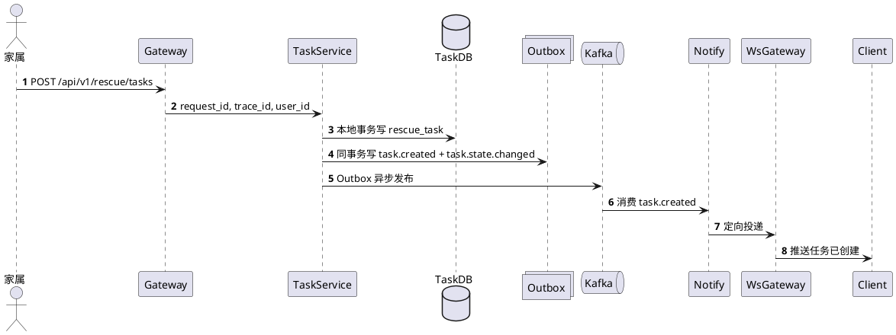

# 基于AI的阿尔兹海默症患者协同寻回系统
## 系统详细设计文档（LLD）

## 0. 文档信息

| 项目 | 内容 |
| :--- | :--- |
| 文档名称 | 系统详细设计文档（LLD） |
| 版本 | V1.1 |
| 日期 | 2026-04-07 |
| 输入基线 | SRS_simplify.md（V1.0）、SADD_from_SRS_simplify.md（V1.0-R3） |
| 文档目标 | 将架构约束下沉为可实现、可测试、可运维的详细设计 |

适用范围：
- 后端服务研发与联调。
- 数据库与消息基础设施落地。
- 测试用例设计与验收追踪。
- 运维监控、告警与演练。

## 1. 设计范围与分层边界

### 1.1 设计范围
1. 服务拆分与职责边界。
2. 核心接口与契约校验规则。
3. 数据模型、索引与状态机守卫。
4. EDA、Outbox、幂等与防乱序实现。
5. 缓存、WebSocket 路由与降级链路。
6. AI 双账本、上下文防护与失败分级。
7. 可观测、告警、发布与回滚。

### 1.2 非范围说明
- 前端页面视觉和交互细节。
- 云厂商专有资源模板（IaC 文件可单独输出）。
- 模型 Prompt 业务文案优化。
- NFC 芯片写入与读写协议实现（本期仅交付二维码方案，NFC 作为后续迭代能力）。

### 1.3 继承自 SADD 的硬约束

| 编号 | 约束 |
| :--- | :--- |
| HC-01 | TASK 域是任务状态机唯一权威；AI 仅发布建议事件。 |
| HC-02 | 核心状态变更必须本地事务 + Outbox 同提交。 |
| HC-03 | 所有写接口必须支持 request_id 幂等。 |
| HC-04 | 全链路必须透传 trace_id。 |
| HC-05 | WebSocket 集群必须路由查询后定向下发，禁止全量广播。 |
| HC-06 | 通知仅使用应用推送和站内通知，不依赖短信。 |

### 1.4 术语

| 术语 | 说明 |
| :--- | :--- |
| Intake 原始事件 | clue.reported.raw，先入 Kafka 削峰，不走 Outbox。 |
| 领域状态事件 | 由领域服务发布、必须走 Outbox。 |
| L1/L2 缓存 | L1 为进程内本地缓存，L2 为 Redis 只读投影。 |
| 抑制分支 | L1/L2 都不可用或都未命中时的受控降级路径。 |
| pod_id | 当前连接归属的 WS 节点唯一标识。 |

### 1.5 接口覆盖策略与非目标（对齐 API 全量契约）

覆盖策略：
1. API 文档是“方法+路径级”唯一契约源，当前第 3 章覆盖 114 条接口。
2. LLD 是实现设计源，重点展开核心链路接口；不以逐条复制 API 全量字段表为目标。
3. 每个 API 接口至少要在 LLD 具备一个有效锚点：
  - 接口级锚点（第 3 章 `#### 3.x.y`）；
  - 机制级锚点（第 4~14 章实现小节）。
4. API 新增或变更接口时，必须同步更新“LLD -> API 映射矩阵”，否则视为设计闭环未完成。

非目标：
- 不在 LLD 复写 API 文档中的全量请求/响应示例。
- 不在 LLD 与 API 维护两套可能冲突的错误码字典。
- 不将 LLD 作为前端联调唯一入口（前端仍以 API 文档为准）。

## 2. 服务划分与部署视图

### 2.1 微服务拆分

| 服务名 | 所属域 | 写模型归属 | 关键职责 | 发布事件 | 消费事件 |
| :--- | :--- | :--- | :--- | :--- | :--- |
| gateway-security | 接入安全层 | 无 | 认证透传、幂等预拦截、时间窗校验 | - | - |
| auth-service | 接入安全层 | 无 | JWT 校验、resource_token 验签解码 | - | - |
| risk-service | 接入安全层 | 风控计数 | CAPTCHA、IP/设备限流、冷却策略 | - | - |
| profile-service | 患者档案与标识域 | patient_profile、sys_user_patient、tag_asset | 档案、监护关系、标签状态管理 | profile.updated、profile.corrected、profile.deleted.logical、tag.bound | task.created、task.resolved、task.false_alarm |
| task-service | 寻回任务域 | rescue_task | 任务创建/关闭、状态收敛、通知触发 | task.created、task.resolved、task.false_alarm、task.state.changed | clue.validated、track.updated、fence.breached、ai.strategy.generated、ai.poster.generated |
| clue-intake-service | 线索域（入口） | clue_record（原始段） | 匿名线索入口、标准化与入站削峰 | clue.reported.raw、clue.vectorize.requested | - |
| clue-analysis-service | 线索域（研判） | clue_record | 时空研判、围栏判定、可疑线索识别 | clue.validated、clue.suspected、track.updated、fence.breached | clue.reported.raw、task.state.changed、clue.rejected |
| clue-trajectory-service | 线索域（轨迹） | patient_trajectory | 轨迹聚合、窗口归档、终态 Flush | track.updated（聚合后） | clue.validated、task.resolved、task.false_alarm |
| ai-orchestrator-service | AI 域 | ai_session、配额账本 | 上下文组装、推理、策略事件 | ai.strategy.generated、ai.poster.generated、memory.appended、memory.expired | clue.validated、track.updated、task.resolved |
| ai-vectorizer-service | AI 域 | vector_store | 文本切片、向量写入、失效清理 | - | profile.updated、profile.corrected、profile.deleted.logical、memory.appended、memory.expired、clue.vectorize.requested |
| material-service | 物资域 | tag_apply_record | 工单流转、发货、异常处置 | material.order.created | tag.bound |
| notify-service | 通知域 | 本地幂等日志 | 事件消费、模板组装、通知分发 | - | task.created、task.resolved、task.false_alarm、fence.breached、track.updated |
| ws-gateway-service | 通知域 | Redis 路由态 | WebSocket 长连接、路由注册、点对点下发 | - | Kafka 业务事件、定向通道 ws.push.{pod_id} |
| admin-review-service | 治理域 | clue_record 审核字段 | clue.override / reject、治理审计 | clue.rejected、clue.validated(override=true) | clue.suspected |
| outbox-dispatcher | 平台组件 | sys_outbox_log | 分区抢占、租约、重试、死信闸门 | Kafka 对应 Topic | - |

### 2.2 部署拓扑（PlantUML）

```plantuml
@startuml
node GatewayCluster {
  [gateway-security]
  [auth-service]
  [risk-service]
}

node AppCluster {
  [profile-service]
  [task-service]
  [clue-intake-service]
  [clue-analysis-service]
  [clue-trajectory-service]
  [ai-orchestrator-service]
  [ai-vectorizer-service]
  [material-service]
  [notify-service]
  [admin-review-service]
  [outbox-dispatcher]
}

node WSCluster {
  [ws-gateway-service-1]
  [ws-gateway-service-2]
}

database PostgreSQL16 as PG
database Redis as R
queue Kafka as K
cloud LLM as LLM
cloud Map as MAP
cloud Push as PUSH

GatewayCluster --> AppCluster
AppCluster --> PG
AppCluster --> R
AppCluster --> K
ai-orchestrator-service --> LLM
clue-analysis-service --> MAP
notify-service --> PUSH
WSCluster --> R
WSCluster --> K
@enduml
```

### 2.3 端到端主时序（任务创建到通知）



## 3. 接口详细设计

### 3.1 通用协议与头部约束

| 项 | 约束 |
| :--- | :--- |
| 协议 | HTTPS + JSON |
| 幂等键 | X-Request-Id（16-64，字母数字与-） |
| 链路追踪 | X-Trace-Id（16-64） |
| 时间防重放 | request_time 偏差 <= 300s |
| 鉴权 | Bearer JWT（匿名接口除外） |
| Agent 执行上下文 | `X-Action-Source`、`X-Agent-Profile`、`X-Execution-Mode`、`X-Confirm-Level`（`X-Action-Source=AI_AGENT` 时必填） |
| 内部保留 Header 防伪造 | X-User-Id、X-User-Role 等内部头仅允许网关注入；网关必须在请求入站第一时间清洗或拒绝客户端同名头（E_REQ_4003），再执行令牌解析与内部头注入 |
| 响应结构 | code、message、trace_id、data |

响应结构示例：

```json
{
  "code": "OK",
  "message": "success",
  "trace_id": "trc_20260405_001",
  "data": {}
}
```

#### 3.1.1 Agent 受控执行协议

1. 网关识别 `X-Action-Source=AI_AGENT` 后进入 Policy Guard 链路。
2. Policy Guard 按顺序执行：
  - 角色与授权校验（RBAC + Ownership）。
  - 执行模式校验（AUTO/CONFIRM_1/CONFIRM_2/CONFIRM_3/MANUAL_ONLY）。
  - 确认等级校验（`X-Confirm-Level` 与接口要求比对）。
3. 支持 `dry_run=true` 预检查：只校验，不落副作用事务。
4. 拒绝语义：
  - 策略拒绝 -> `E_GOV_4039`
  - 确认等级不足 -> `E_GOV_4097`
  - 预检查失败 -> `E_GOV_4226`
  - 人工专属接口被 Agent 调用 -> `E_GOV_4231`
5. 所有通过门禁的写请求都必须写审计扩展字段：`action_source`、`agent_profile`、`execution_mode`、`confirm_level`。
6. 大模型 Function Calling 只允许产出规范化意图（`action` + `args`），后端必须先转换为“建议/待办”，禁止直接调用实体写仓储。
7. 仅当实体用户（家属/管理员）以合法 JWT 且通过 Ownership 校验完成二次确认后，才允许调用常规写接口落地状态变更。

### 3.2 任务域接口

#### 3.2.1 POST /api/v1/rescue/tasks

用途：创建寻回任务。

请求体：

| 字段 | 类型 | 必填 | 约束 |
| :--- | :--- | :---: | :--- |
| patient_id | int64 | 是 | 必须存在且无 ACTIVE 任务 |
| source | string | 是 | APP / MINI_PROGRAM / ADMIN_PORTAL |
| remark | string | 否 | <= 500 |

处理逻辑：
1. 幂等拦截（Redis SETNX + TTL）。
2. 校验授权关系与唯一进行中任务。
3. 写 rescue_task(status=ACTIVE)。
4. 同事务写 Outbox 事件 task.created、task.state.changed。
5. 提交后异步投递。

错误码：E_TASK_4091、E_TASK_4030、E_REQ_4001。

#### 3.2.2 POST /api/v1/rescue/tasks/{task_id}/close

用途：任务关闭（RESOLVED / FALSE_ALARM）。

请求体：

| 字段 | 类型 | 必填 | 约束 |
| :--- | :--- | :---: | :--- |
| close_type | string | 是 | RESOLVED / FALSE_ALARM |
| reason | string | 条件必填 | FALSE_ALARM 时必填，长度 5-256 |

处理逻辑：
1. 读取当前状态并执行条件更新（仅 ACTIVE 可关闭）。
2. close_type=RESOLVED 发布 task.resolved；close_type=FALSE_ALARM 发布 task.false_alarm。
3. 同事务发布 task.state.changed(version+1)。
4. 写审计日志并返回终态。

错误码：E_TASK_4041、E_TASK_4093、E_TASK_4004、E_TASK_4005。

### 3.3 线索域接口

#### 3.3.1 GET /r/{resource_token}

用途：扫码入口，完成验签并动态路由。

路由规则：
- BOUND -> 302 到 /p/{short_code}/clues/new，并下发 entry_token Cookie。
- LOST -> 302 到 /p/{short_code}/emergency/report，并下发 entry_token Cookie。
- UNBOUND / ALLOCATED / VOID -> 无效页。

安全要求：
- entry_token 仅允许 HttpOnly + Secure + SameSite=Strict Cookie 传递。
- 禁止通过 URL Query 透传 entry_token。

#### 3.3.2 POST /api/v1/public/clues/manual-entry

用途：二维码污损时手动兜底。

请求体：

| 字段 | 类型 | 必填 | 约束 |
| :--- | :--- | :---: | :--- |
| short_code | string | 是 | 固定 6 位大写字母数字 |
| pin_code | string | 是 | 固定 6 位 |
| captcha_token | string | 是 | 必须验签通过 |
| device_fingerprint | string | 是 | 16-128 |

风控：
- IP 限流：<= 5 次/分钟。
- 设备限流：<= 20 次/小时。
- 同 short_code 连续失败 >=5 次进入 15 分钟冷却。

响应体：

| 字段 | 类型 | 必填 | 约束 |
| :--- | :--- | :---: | :--- |
| manual_entry_token | string | 是 | 一次性令牌，TTL <= 120s，用于后续匿名入口访问授权 |

#### 3.3.3 POST /api/v1/clues/report

用途：匿名提交线索。

请求体：

| 字段 | 类型 | 必填 | 约束 |
| :--- | :--- | :---: | :--- |
| tag_code | string | 是 | 与网关匿名凭据中的 tag_code 一致 |
| coord_system | string | 是 | 网关完成标准化后固定为 WGS84 |
| location.lat | number | 是 | 合法范围；内部服务只接收网关标准化后的 WGS84 |
| location.lng | number | 是 | 合法范围；内部服务只接收网关标准化后的 WGS84 |
| description | string | 否 | <=2000 |
| photo_url | string | 否 | 白名单域名 |

处理流程：
1. 网关已完成坐标系校验与坐标转换（GCJ-02/BD-09 -> WGS84）。
2. 网关从 Cookie(entry_token) 或 X-Anonymous-Token 提取并校验匿名凭据，不接受 Body 传递 token。
3. 校验匿名凭据一次性与绑定关系。
4. 写 clue_record(raw) 并同事务写 Outbox 事件 clue.reported.raw、clue.vectorize.requested。
5. 由研判服务与向量化 Worker 异步处理，不在入口同步执行重计算或 Embedding 网络调用。
6. clue-analysis-service 消费 clue.reported.raw 时必须写入 risk_score 与 suspect_reason（若不可疑可置空 suspect_reason）。

#### 3.3.4 POST /api/v1/clues/{clue_id}/override

用途：管理员强制回流可疑线索。

请求体：

| 字段 | 类型 | 必填 | 约束 |
| :--- | :--- | :---: | :--- |
| override | bool | 是 | 仅允许 true |
| override_reason | string | 是 | 5-256 |

结果：发布 clue.validated（override=true）。

#### 3.3.5 POST /api/v1/clues/{clue_id}/reject

用途：管理员驳回可疑线索。

请求体：

| 字段 | 类型 | 必填 | 约束 |
| :--- | :--- | :---: | :--- |
| reject_reason | string | 是 | 5-256 |

结果：发布 clue.rejected 并关闭复核工单。

### 3.4 AI 域接口

#### 3.4.1 POST /api/v1/ai/sessions/{session_id}/messages

用途：提交 AI 对话消息。

请求体：

| 字段 | 类型 | 必填 | 约束 |
| :--- | :--- | :---: | :--- |
| prompt | string | 是 | 1-4000 |

强约束：
- 禁止客户端提交 patient_id 和 task_id。
- patient_id / task_id 必须由服务端按 session_id 反查。
- 需先通过 user_id 与 patient_id 两条独立限流。
- 调用前必须通过双账本配额预占。

处理逻辑（并发安全）：
1. 按 session_id 反查会话上下文并完成授权校验。
2. 完成限流与双账本预占。
3. 生成 message_patch（仅本次追加消息）。
4. 使用数据库原子更新追加 messages，禁止先 SELECT 后 UPDATE。
5. 失败时按配额状态执行回滚或补偿。

并发安全伪代码：

```sql
-- 原子追加（推荐）
UPDATE ai_session
SET messages = messages || :message_patch::jsonb,
    request_tokens = request_tokens + :request_tokens,
    response_tokens = response_tokens + :response_tokens,
    token_used = token_used + (:request_tokens + :response_tokens),
    token_usage = :token_usage::jsonb,
    updated_at = now()
WHERE session_id = :session_id;

-- 或采用乐观锁 CAS（并发冲突可重试）
UPDATE ai_session
SET messages = messages || :message_patch::jsonb,
    version = version + 1,
    updated_at = now()
WHERE session_id = :session_id
  AND version = :expected_version;
```

错误码补充：E_AI_4001、E_AI_4033、E_AI_4292、E_AI_4293、E_AI_4091。

### 3.5 档案与监护接口

#### 3.5.1 POST /api/v1/patients/{patient_id}/guardians/invitations

用途：主监护人邀请成员加入患者监护协同。

请求体：

| 字段 | 类型 | 必填 | 约束 |
| :--- | :--- | :---: | :--- |
| invitee_user_id | int64 | 是 | 被邀请用户必须存在且当前非 ACTIVE 成员 |
| relation_role | string | 是 | 仅允许 GUARDIAN |
| reason | string | 否 | 长度 <= 256 |

错误码：E_PRO_4032、E_PRO_4041、E_PRO_4042、E_PRO_4094、E_PRO_4006、E_REQ_4001。

#### 3.5.2 POST /api/v1/patients/{patient_id}/guardians/invitations/{invite_id}/accept

用途：被邀请用户确认或拒绝加入。

请求体：

| 字段 | 类型 | 必填 | 约束 |
| :--- | :--- | :---: | :--- |
| action | string | 是 | ACCEPT / REJECT |
| reject_reason | string | 条件必填 | action=REJECT 时必填，长度 5-256 |

事务语义（guardian_invitation → sys_user_patient 衔接）：
1. action=ACCEPT 时，必须在同一事务内完成：
   a. guardian_invitation.status → ACCEPTED，写入 accepted_at。
   b. 创建或激活 sys_user_patient 行：user_id=invitee_user_id，patient_id=patient_id，relation_role=GUARDIAN，relation_status=ACTIVE。
   c. 若目标 sys_user_patient 行已存在且 relation_status=REVOKED，更新为 ACTIVE 并重置 transfer_state=NONE。
   d. 若目标行已存在且 relation_status=ACTIVE，幂等返回成功（不重复创建）。
   e. 同事务写 Outbox 事件：guardian.invitation.accepted。
2. action=REJECT 时，guardian_invitation.status → REJECTED，写入 rejected_at 与 reject_reason；不创建或修改 sys_user_patient。

错误码：E_PRO_4041、E_PRO_4043、E_PRO_4096、E_PRO_4008、E_REQ_4001。

#### 3.5.3 POST /api/v1/patients/{patient_id}/guardians/primary-transfer

用途：发起主监护权双阶段转移（写入 PENDING_CONFIRM）。

请求体：

| 字段 | 类型 | 必填 | 约束 |
| :--- | :--- | :---: | :--- |
| target_user_id | int64 | 是 | 必须是该患者 ACTIVE 成员 |
| reason | string | 是 | 长度 5-256 |
| expire_in_seconds | int32 | 否 | 范围 300-86400，默认 1800 |

处理要点：
1. 同患者仅允许一个 PENDING_CONFIRM 转移请求。
2. 同事务写 transfer_requested_by、transfer_requested_at、transfer_reason。

错误码：E_PRO_4032、E_PRO_4041、E_PRO_4044、E_PRO_4095、E_PRO_4009、E_PRO_4010、E_REQ_4001。

#### 3.5.4 POST /api/v1/patients/{patient_id}/guardians/primary-transfer/{transfer_request_id}/confirm

用途：受方确认主监护转移或拒绝。

请求体：

| 字段 | 类型 | 必填 | 约束 |
| :--- | :--- | :---: | :--- |
| action | string | 是 | ACCEPT / REJECT |
| reject_reason | string | 条件必填 | action=REJECT 时必填，长度 5-256 |

处理要点：
1. 二次校验受方 relation_status=ACTIVE。
2. ACCEPT：同事务完成旧主降级与新主升级，并写 transfer_confirmed_at。
3. REJECT：写 transfer_rejected_at、transfer_reject_reason。

错误码：E_PRO_4041、E_PRO_4045、E_PRO_4097、E_PRO_4099、E_PRO_4011、E_PRO_4013、E_REQ_4001。

#### 3.5.5 POST /api/v1/patients/{patient_id}/guardians/primary-transfer/{transfer_request_id}/cancel

用途：发起方撤销未确认的主监护转移请求。

请求体：

| 字段 | 类型 | 必填 | 约束 |
| :--- | :--- | :---: | :--- |
| cancel_reason | string | 是 | 长度 5-256 |

处理要点：
1. 仅原发起方或 SUPERADMIN。
2. 仅 PENDING_CONFIRM 且未过期可撤销。
3. 同事务写 transfer_cancelled_by、transfer_cancelled_at、transfer_cancel_reason。
4. 响应字段 cancelled_at 回传自 sys_user_patient.transfer_cancelled_at。

错误码：E_PRO_4041、E_PRO_4045、E_PRO_4098、E_PRO_4012、E_REQ_4001。

#### 3.5.6 DELETE /api/v1/patients/{patient_id}/guardians/{user_id}

用途：移除家庭成员。

处理要点：
1. 仅 PRIMARY_GUARDIAN 或 SUPERADMIN 可执行。
2. 若目标成员存在 PENDING_CONFIRM 的主监护转移请求，必须同事务取消。
3. 将 sys_user_patient.relation_status 更新为 REVOKED。
4. 响应字段 removed_at 由该行 updated_at 回传。

错误码：E_PRO_4032、E_PRO_4041、E_PRO_4044、E_PRO_4099、E_REQ_4001。

### 3.6 物资与标签接口

#### 3.6.1 POST /api/v1/material/orders

用途：创建标签申领工单（初始状态 PENDING）。

请求体：

| 字段 | 类型 | 必填 | 约束 |
| :--- | :--- | :---: | :--- |
| patient_id | int64 | 是 | 必须存在且当前用户具备监护授权 |
| quantity | int32 | 是 | 范围 1-20 |
| apply_note | string | 否 | 长度 <= 256 |
| delivery_address | string | 是 | 长度 10-512 |

错误码：E_PRO_4030、E_PRO_4041、E_MAT_4001、E_MAT_4002、E_REQ_4001。

#### 3.6.2 POST /api/v1/patients/{patient_id}/tags/bind

用途：家属/监护人在授权范围内执行标签绑定。

请求体：

| 字段 | 类型 | 必填 | 约束 |
| :--- | :--- | :---: | :--- |
| tag_code | string | 是 | 长度 8-100，字母数字 |
| resource_token | string | 是 | 长度 32-1024，Base64URL |
| bind_source | string | 否 | APP / MINI_PROGRAM，默认 APP |
| scanned_at | string | 否 | ISO-8601 时间戳 |

绑定校验：
1. order.tag_code == payload.tag_code == scanned_tag_code。
2. protected_payload.patient_id == path.patient_id。
3. 当前用户具备 patient_id 监护授权。
4. 若 applicant_user_id != current_user，允许协同绑定但记录高危审计。

错误码：
- E_PRO_4030：无患者监护授权。
- E_MAT_4223：resource_token 验签或解密失败。
- E_MAT_4096：tag_code 三方一致性校验失败。
- E_MAT_4097：resource_token 中 patient_id 与路径 patient_id 不一致。
- E_MAT_4032：resource_token 审计载荷不完整或非法。
- E_MAT_4092：订单状态非法，无法自动收敛。
- E_REQ_4001：幂等键不合法。

绑定成功后：
- 发布 tag.bound。
- 若工单状态为 SHIPPED，触发 order.auto_confirm.on_bind 进入 COMPLETED。

#### 3.6.3 PUT /api/v1/admin/material/orders/{order_id}/cancel/approve

用途：管理员审核通过取消申请。

处理要点：
1. 仅允许 CANCEL_PENDING -> CANCELLED。
2. 同事务写 status=CANCELLED、approved_at、closed_at。

错误码：E_GOV_4030、E_MAT_4041、E_MAT_4094、E_REQ_4001。

#### 3.6.4 GET /api/v1/material/orders/{order_id}/resource-link

用途：读取工单资源链状态。

处理要点：
1. resource_link 落库字段为 tag_apply_record.resource_link。
2. resource_token_expire_at 与 status 由令牌服务运行时计算回传，不作为持久化状态列。

错误码：E_GOV_4011、E_MAT_4030、E_MAT_4041、E_REQ_4005。

### 3.7 查询接口（Query）与分页契约

设计原则：
1. 主通道采用 WebSocket 增量推送。
2. 查询接口提供快照拉取与断线补偿。
3. 长轮询仅作为受限网络下的降级手段。

#### 3.7.1 GET /api/v1/rescue/tasks/{task_id}/snapshot

用途：拉取任务最新快照（状态、关键轨迹摘要、版本锚点）。

响应 data：

| 字段 | 类型 | 说明 |
| :--- | :--- | :--- |
| task_id | int64 | 任务标识 |
| status | string | ACTIVE/RESOLVED/FALSE_ALARM |
| patient_id | int64 | 患者标识 |
| version | int64 | 状态版本 |
| event_time | string | 最后状态事件时间锚点 |
| latest_trajectory | object | 最近轨迹摘要 |

错误码：E_TASK_4041、E_PRO_4030。

#### 3.7.2 GET /api/v1/rescue/tasks/{task_id}/trajectory/latest

用途：按任务拉取最新轨迹片段。

查询参数：

| 字段 | 类型 | 必填 | 约束 |
| :--- | :--- | :---: | :--- |
| limit | int32 | 否 | 1-200，默认 50 |
| since_event_time | string | 否 | ISO-8601，用于增量拉取 |

错误码：E_TASK_4041、E_CLUE_4043、E_REQ_4001。

#### 3.7.3 GET /api/v1/rescue/tasks

用途：任务列表查询（分页）。

查询参数：

| 字段 | 类型 | 必填 | 约束 |
| :--- | :--- | :---: | :--- |
| page_no | int32 | 否 | >=1，默认 1 |
| page_size | int32 | 否 | 1-100，默认 20 |
| status | string | 否 | ACTIVE/RESOLVED/FALSE_ALARM |
| patient_id | int64 | 否 | 授权范围内过滤 |

统一分页响应：

```json
{
  "code": "OK",
  "message": "success",
  "trace_id": "trc_xxx",
  "data": {
    "items": [],
    "page_no": 1,
    "page_size": 20,
    "total": 0,
    "has_next": false
  }
}
```

#### 3.7.4 GET /api/v1/rescue/tasks/{task_id}/events/poll

用途：长轮询降级接口（弱网或 WS 不可用时）。

查询参数：

| 字段 | 类型 | 必填 | 约束 |
| :--- | :--- | :---: | :--- |
| since_version | int64 | 是 | 客户端已确认版本 |
| timeout_ms | int32 | 否 | 1000-25000，默认 15000 |

返回语义：
- 有增量事件：立即返回事件列表（含 aggregate_id、version、event_time）。
- 无增量事件：超时返回空列表。

## 4. 事件模型与契约设计

### 4.1 Topic 清单

| Topic | 分区键 | 生产方 | 消费方 |
| :--- | :--- | :--- | :--- |
| clue.reported.raw | tag_code | clue-intake-service | clue-analysis-service |
| clue.vectorize.requested | patient_id | clue-intake-service | ai-vectorizer-service |
| clue.validated | patient_id | clue-analysis-service | task-service、ai-orchestrator-service、clue-trajectory-service |
| clue.suspected | patient_id | clue-analysis-service | admin-review-service、task-service |
| clue.rejected | patient_id | admin-review-service | clue-analysis-service、governance |
| track.updated | patient_id | clue-analysis/trajectory | task-service、ai-orchestrator-service |
| fence.breached | patient_id | clue-analysis-service | task-service、notify-service |
| task.created | patient_id | task-service | profile-service、notify-service、ai-orchestrator-service |
| task.state.changed | patient_id | task-service | clue-analysis-service |
| task.resolved | patient_id | task-service | profile-service、clue-trajectory-service、notify-service、ai-orchestrator-service |
| task.false_alarm | patient_id | task-service | profile-service、clue-trajectory-service、notify-service |
| ai.strategy.generated | task_id | ai-orchestrator-service | task-service |
| ai.poster.generated | task_id | ai-orchestrator-service | task-service |
| profile.created | patient_id | profile-service | ai-vectorizer-service |
| profile.updated | patient_id | profile-service | ai-vectorizer-service |
| profile.corrected | patient_id | profile-service | ai-vectorizer-service |
| profile.deleted.logical | patient_id | profile-service | ai-vectorizer-service |
| memory.appended | patient_id | ai-orchestrator-service | ai-vectorizer-service |
| memory.expired | patient_id | ai-orchestrator-service | ai-vectorizer-service |
| material.order.created | order_id | material-service | admin handlers |
| tag.bound | patient_id | profile-service | material-service、notify-service |

### 4.2 统一事件 Envelope

```json
{
  "event_id": "evt_01H...",
  "topic": "task.state.changed",
  "partition_key": "patient_1001",
  "aggregate_id": "task_8848",
  "event_time": "2026-04-05T10:21:00Z",
  "version": 12,
  "request_id": "req_...",
  "trace_id": "trc_...",
  "producer": "task-service",
  "payload": {}
}
```

### 4.3 task.state.changed 载荷

```json
{
  "task_id": 8848,
  "patient_id": 1001,
  "status": "ACTIVE",
  "version": 12,
  "event_time": "2026-04-05T10:21:00Z"
}
```

消费者约束：
- 仅当 incoming.version > current.version 时覆盖本地投影。
- 旧版本事件丢弃并记录 EVENT_STALE_DROP 审计。

## 5. 数据模型详细设计

### 5.1 表清单

| 类别 | 表名 |
| :--- | :--- |
| 核心业务表 | sys_user、patient_profile、sys_user_patient、guardian_invitation、rescue_task、clue_record、patient_trajectory、tag_asset、tag_apply_record、ai_session、patient_memory_note、notification_inbox、vector_store、sys_log、sys_config |
| 技术调度表 | sys_outbox_log |
| 技术幂等表 | consumed_event_log（每个消费者服务本地） |

### 5.2 patient_profile

| 字段 | 类型 | 约束 | 说明 |
| :--- | :--- | :--- | :--- |
| id | bigint | PK | 患者主键 |
| profile_no | varchar(32) | unique | 业务编号 |
| name | varchar(64) | not null | 姓名 |
| gender | varchar(16) | not null | MALE/FEMALE/UNKNOWN |
| birthday | date | not null | 出生日期 |
| short_code | char(6) | unique not null | 患者维度对外短码路由标识 |
| pin_code_hash | varchar(128) | not null | 手动兜底 PIN 哈希 |
| pin_code_salt | varchar(64) | not null | PIN 哈希盐值（抗彩虹表） |
| photo_url | varchar(1024) | not null | 患者近期正面免冠照片 |
| medical_history | jsonb | not null default '{}'::jsonb | 医疗扩展信息（血型/慢病/过敏等） |
| fence_enabled | boolean | not null default false | 围栏开关 |
| fence_center | geometry(Point,4326) | null | 围栏中心点（WGS84） |
| fence_radius_m | int | null | 围栏半径（米） |
| lost_status | varchar(20) | not null | NORMAL/MISSING |
| lost_status_event_time | timestamptz | not null | 防乱序锚点 |
| profile_version | bigint | not null default 1 | 档案版本单调递增 |
| created_at | timestamptz | not null | 创建时间 |
| updated_at | timestamptz | not null | 更新时间 |

medical_history JSONB 键契约（对齐 API 3.3.8 / 3.3.9）：
- blood_type: string（A/B/AB/O/UNKNOWN）
- chronic_diseases: array<string>
- allergy_notes: string（<=500）

索引：
- ux_patient_profile_no(profile_no)
- ux_patient_short_code(short_code)
- idx_patient_lost_status(lost_status)
- idx_patient_medical_history_gin(medical_history)

围栏约束：
- fence_enabled=true 时，fence_center 与 fence_radius_m 必须同时非空。
- fence_enabled=false 时，fence_center 与 fence_radius_m 必须同时为空。

### 5.2.3 PIN 码生命周期

1. 患者建档（3.3.8）时必须生成初始 PIN（一次性展示给主监护人），仅落 `pin_code_hash/pin_code_salt`，禁止明文存储。
2. 手动兜底入口（3.3.2）只做哈希比对与风控校验，不回传 PIN 相关信息。
3. PIN 重置仅允许主监护人或受控管理角色在已鉴权场景触发，重置动作必须写治理审计。
4. 任意 PIN 变更都必须使旧的 manual_entry_token 与 entry_token 失效。

### 5.2.1 short_code 发号实现（序列真源 + 号段预取）

实现约束：
1. 数据库序列 `patient_short_code_seq` 作为唯一真源，禁止客户端或业务服务自定义短码。
2. 发号服务按固定步长预取号段（如 200/500），节点本地仅在号段内递增消费。
3. 编码流程采用“sequence_id -> 可逆混淆 -> Base36 定长 6 位”输出 `short_code`。
4. 可逆混淆必须是区间 `[0, 36^6-1]` 上的双射映射，必须提供 encode/decode 回环一致性。
5. 禁止对混淆结果进行截断、取模、大小写二次归一；禁止引入会破坏双射的保留码重映射。
6. 写入 `patient_profile.short_code` 时依赖唯一索引兜底；若冲突则自动重试下一序列值，单请求最多重试 3 次。
7. 当 1 分钟窗口内冲突率 >0.01% 或连续出现重试耗尽时，触发发号熔断（30 秒）并阻断建档写入，等待人工处置。

灾备与回切：
1. 主备切换后必须执行“序列水位校准”，水位下限不小于最近已分配号段上界。
2. 故障节点未消费完的本地号段直接废弃，禁止回填回收。
3. Runbook 必须包含“水位确认 -> 流量切换 -> 灰度建档验证 -> 全量恢复”的标准步骤。

### 5.2.2 short_code 质量门禁（上线前）

1. 双射正确性：对至少 1000 万个连续 `sequence_id` 样本执行 encode/decode 回环，要求 100% 一致。
2. 冲突基线：同样本规模下 `short_code` 唯一值数量必须等于样本量，不允许真实碰撞。
3. 压测门槛：建档接口在开启发号后，`alloc_latency` 的 TP95 不得因重试超过基线 20%。
4. 风险处置：若任一门禁不满足，禁止上线并回退到“阻断建档 + 告警”安全状态。

### 5.3 sys_user_patient

| 字段 | 类型 | 约束 | 说明 |
| :--- | :--- | :--- | :--- |
| id | bigint | PK | 主键 |
| user_id | bigint | not null | 用户 |
| patient_id | bigint | not null | 患者 |
| relation_role | varchar(32) | not null | PRIMARY_GUARDIAN/GUARDIAN |
| relation_status | varchar(20) | not null | PENDING/ACTIVE/REVOKED |
| transfer_state | varchar(32) | not null default 'NONE' | NONE/PENDING_CONFIRM/ACCEPTED/REJECTED/CANCELLED/EXPIRED |
| transfer_request_id | varchar(64) | null | 转移请求号 |
| transfer_target_user_id | bigint | null | 受方 |
| transfer_requested_by | bigint | null | 主监护转移发起人 |
| transfer_requested_at | timestamptz | null | 主监护转移发起时间 |
| transfer_reason | varchar(256) | null | 主监护转移发起原因 |
| transfer_cancelled_by | bigint | null | 主监护转移撤销操作人 |
| transfer_cancelled_at | timestamptz | null | 主监护转移撤销时间 |
| transfer_cancel_reason | varchar(256) | null | 主监护转移撤销原因 |
| transfer_expire_at | timestamptz | null | 过期时间 |
| transfer_confirmed_at | timestamptz | null | 确认接受时间 |
| transfer_rejected_at | timestamptz | null | 拒绝时间 |
| transfer_reject_reason | varchar(256) | null | 拒绝原因 |
| created_at | timestamptz | not null | 创建时间 |
| updated_at | timestamptz | not null | 更新时间 |

索引与约束：
- ux_user_patient_active(user_id, patient_id, relation_status)
- check(relation_status in ('PENDING','ACTIVE','REVOKED'))
- check(transfer_state in ('NONE','PENDING_CONFIRM','ACCEPTED','REJECTED','CANCELLED','EXPIRED'))
- transfer_state='ACCEPTED' 时，transfer_confirmed_at 必须非空；其他状态必须为空。
- transfer_state='REJECTED' 时，transfer_rejected_at 与 transfer_reject_reason 必须成对非空；其他状态必须为空。
- transfer_state='CANCELLED' 时，transfer_cancelled_by/transfer_cancelled_at/transfer_cancel_reason 必须成组非空；其他状态必须为空。
- uq_transfer_pending(patient_id) where transfer_state='PENDING_CONFIRM'
- 主监护转移链路必须完整记录发起/撤销/拒绝三类审计字段，满足 AC-027 合规追踪。
- 删除成员接口中的 removed_at 为回传语义，映射自 sys_user_patient.updated_at。

### 5.3A guardian_invitation

| 字段 | 类型 | 约束 | 说明 |
| :--- | :--- | :--- | :--- |
| id | bigint | PK | 主键 |
| invite_id | varchar(64) | unique not null | 邀请号 |
| patient_id | bigint | not null | 邀请归属患者 |
| inviter_user_id | bigint | not null | 邀请发起人 |
| invitee_user_id | bigint | not null | 被邀请用户 |
| relation_role | varchar(32) | not null | PRIMARY_GUARDIAN/GUARDIAN |
| status | varchar(20) | not null default 'PENDING' | PENDING/ACCEPTED/REJECTED/EXPIRED/REVOKED |
| reason | varchar(256) | null | 发起原因 |
| reject_reason | varchar(256) | null | 拒绝/撤销原因 |
| expire_at | timestamptz | not null | 过期时间 |
| accepted_at | timestamptz | null | 接受时间 |
| rejected_at | timestamptz | null | 拒绝时间 |
| revoked_at | timestamptz | null | 撤销时间 |
| created_at | timestamptz | not null | 创建时间 |
| updated_at | timestamptz | not null | 更新时间 |

语义约束：
- ACCEPTED：accepted_at 必须非空。
- REJECTED：受邀人显式拒绝。
- REJECTED：rejected_at 与 reject_reason 必须成对非空。
- REVOKED：邀请方主动撤销。
- REVOKED：revoked_at 与 reject_reason 必须成对非空。
- 邀请创建接口（3.5.1）仅允许 `relation_role=GUARDIAN`；`PRIMARY_GUARDIAN` 仅用于历史兼容/扩展预留，不得通过邀请链路直接赋予。

### 5.4 rescue_task

| 字段 | 类型 | 约束 | 说明 |
| :--- | :--- | :--- | :--- |
| id | bigint | PK | 主键 |
| task_no | varchar(32) | unique | 任务编号 |
| patient_id | bigint | not null | 患者 |
| status | varchar(20) | not null | ACTIVE/RESOLVED/FALSE_ALARM |
| source | varchar(32) | not null | 来源 |
| ai_analysis_summary | text | null | AI 分析摘要（异步回写） |
| poster_url | varchar(1024) | null | AI 海报地址（ai.poster.generated 回写） |
| close_reason | varchar(256) | null | 关闭原因 |
| event_version | bigint | not null default 0 | 状态事件版本 |
| created_by | bigint | not null | 发起人 |
| created_at | timestamptz | not null | 创建时间 |
| closed_at | timestamptz | null | 任务关闭时间（终态写入） |
| updated_at | timestamptz | not null | 更新时间 |

关键约束：
- uq_task_active_per_patient(patient_id) where status='ACTIVE'
- status='ACTIVE' 时 closed_at 必须为空；status in ('RESOLVED','FALSE_ALARM') 时 closed_at 必须非空。
- 状态流转必须条件更新，禁止无条件 UPDATE。

### 5.5 clue_record

| 字段 | 类型 | 约束 | 说明 |
| :--- | :--- | :--- | :--- |
| id | bigint | PK | 主键 |
| clue_no | varchar(32) | unique | 线索编号 |
| patient_id | bigint | not null | 患者 |
| task_id | bigint | null | 关联任务 |
| tag_code | varchar(100) | not null | 标签码 |
| source_type | varchar(20) | not null | SCAN/MANUAL |
| risk_score | numeric(5,4) | null | 风险分（0-1） |
| location | geometry(Point,4326) | not null | 坐标 |
| coord_system | varchar(10) | not null | 标准化坐标系，入库固定 WGS84 |
| description | text | null | 现场描述 |
| photo_url | varchar(1024) | null | 图片地址 |
| is_valid | boolean | not null | 是否有效 |
| suspect_flag | boolean | not null | 是否可疑 |
| suspect_reason | varchar(256) | null | 可疑原因摘要（由研判服务生成） |
| review_status | varchar(20) | null default null | 仅可疑线索使用：PENDING/OVERRIDDEN/REJECTED；非可疑为 NULL |
| assignee_user_id | bigint | null | 复核指派人 |
| assigned_at | timestamptz | null | 指派时间 |
| reviewed_at | timestamptz | null | 完成复核时间 |
| override | boolean | not null default false | 管理员强制回流标记 |
| override_by | bigint | null | 强制回流操作人 |
| override_reason | varchar(256) | null | 强制回流原因 |
| reject_reason | varchar(256) | null | 驳回原因 |
| rejected_by | bigint | null | 驳回人 |
| created_at | timestamptz | not null | 创建时间 |
| updated_at | timestamptz | not null | 更新时间 |

复核语义约束：
- 非可疑线索（suspect_flag=false）不得进入复核队列，review_status 必须为 NULL。
- 可疑线索（suspect_flag=true）入队时 review_status 必须初始化为 PENDING。
- 管理员处置后，review_status 仅允许流转为 OVERRIDDEN 或 REJECTED。
- review_status in (OVERRIDDEN, REJECTED) 时 reviewed_at 必须非空；review_status in (NULL, PENDING) 时 reviewed_at 必须为空。
- 当 review_status=OVERRIDDEN 时，override 必须为 true。
- 当 review_status=REJECTED 时，rejected_by 与 reject_reason 必须成对非空。
- 当 review_status!=OVERRIDDEN 时，override 必须为 false 且 override_reason 必须为空。
- 当 review_status!=REJECTED 时，rejected_by 与 reject_reason 必须同时为空。

索引：
- gist_clue_location(location)
- idx_clue_patient_created(patient_id, created_at desc)
- idx_clue_suspected(suspect_flag, is_valid)
- idx_clue_review_pending(review_status, created_at desc) where review_status='PENDING'
- idx_clue_assignee_pending(assignee_user_id, created_at desc) where review_status='PENDING'

### 5.5A 线索补证能力（毕设精简）

当前毕设版本不启用 3.2.13 补证接口，不创建 `clue_evidence_request` 表。

实现要求：

1. 补证尝试仅记录治理审计，写入 `sys_log.detail`。
2. 若后续恢复该能力，再扩展独立补证状态机与持久化表。

### 5.6 patient_trajectory

| 字段 | 类型 | 约束 | 说明 |
| :--- | :--- | :--- | :--- |
| id | bigint | PK | 主键 |
| patient_id | bigint | not null | 患者 |
| task_id | bigint | null | 任务 |
| window_start | timestamptz | not null | 窗口起 |
| window_end | timestamptz | not null | 窗口止 |
| point_count | int | not null | 点数量 |
| geometry_type | varchar(32) | not null | LINESTRING/SPARSE_POINT/EMPTY_WINDOW |
| geometry_data | geometry | null | 轨迹几何 |
| created_at | timestamptz | not null | 创建时间 |

强约束：
- task.resolved 或 task.false_alarm 时必须执行终态 Flush。
- point_count=0 时写 EMPTY_WINDOW，禁止空集几何构造。
- 当 geometry_type=EMPTY_WINDOW 时，geometry_data 必须为 NULL；当 geometry_type in (LINESTRING, SPARSE_POINT) 时，geometry_data 必须为非 NULL。
- 推荐数据库约束：check ((geometry_type='EMPTY_WINDOW' and geometry_data is null) or (geometry_type in ('LINESTRING','SPARSE_POINT') and geometry_data is not null))。

### 5.7 tag_asset

| 字段 | 类型 | 约束 | 说明 |
| :--- | :--- | :--- | :--- |
| id | bigint | PK | 主键 |
| tag_code | varchar(100) | unique | 标签码 |
| tag_type | varchar(20) | not null | QR_CODE/NFC |
| import_batch_no | varchar(64) | null | 入库批次号 |
| status | varchar(20) | not null | UNBOUND/ALLOCATED/BOUND/LOST/VOID |
| patient_id | bigint | null | 绑定患者 |
| apply_record_id | bigint | null | 关联工单 |
| void_reason | varchar(256) | null | 作废原因 |
| lost_at | timestamptz | null | 挂失时间 |
| void_at | timestamptz | null | 作废时间 |
| reset_at | timestamptz | null | 管理员重置时间 |
| recovered_at | timestamptz | null | 管理员恢复时间 |
| created_at | timestamptz | not null | 创建时间 |
| updated_at | timestamptz | not null | 更新时间 |

说明：
- short_code、pin_code_hash、pin_code_salt 归属 patient_profile，不在 tag_asset 冗余存储。

关键约束：
- `status in ('UNBOUND','ALLOCATED','BOUND','LOST','VOID')`。
- `status in ('BOUND','LOST')` 时，`patient_id` 必须非空。
- `status='LOST'` 时，`lost_at` 必须非空；`status='VOID'` 时，`void_at` 与 `void_reason` 必须非空。
- `reset_at` 非空时，`status` 必须为 `UNBOUND`。
- `recovered_at` 非空时，`status` 必须为 `BOUND` 且 `patient_id` 必须非空。

### 5.8 tag_apply_record

| 字段 | 类型 | 约束 | 说明 |
| :--- | :--- | :--- | :--- |
| id | bigint | PK | 主键 |
| order_no | varchar(32) | unique | 工单号 |
| patient_id | bigint | not null | 患者 |
| applicant_user_id | bigint | not null | 申请人 |
| quantity | int | not null | 数量（1-20） |
| apply_note | varchar(256) | null | 申领备注 |
| tag_code | varchar(100) | null | 发货时锁定 |
| status | varchar(20) | not null | PENDING/PROCESSING/CANCEL_PENDING/CANCELLED/SHIPPED/EXCEPTION/COMPLETED |
| delivery_address | varchar(512) | not null | 收货地址 |
| tracking_number | varchar(64) | null | 物流单号 |
| courier_name | varchar(64) | null | 物流公司 |
| resource_link | varchar(1024) | null | 资源链 |
| cancel_reason | varchar(256) | null | 取消原因 |
| approved_at | timestamptz | null | 审核通过时间 |
| reject_reason | varchar(256) | null | 驳回原因 |
| rejected_at | timestamptz | null | 驳回时间 |
| exception_desc | varchar(512) | null | 异常说明 |
| closed_at | timestamptz | null | 工单关闭时间（终态写入） |
| created_at | timestamptz | not null | 创建时间 |
| updated_at | timestamptz | not null | 更新时间 |

关键约束：
- `status in ('PENDING','PROCESSING','CANCEL_PENDING','CANCELLED','SHIPPED','EXCEPTION','COMPLETED')`。
- `approved_at` 非空时，`status` 仅允许 `PROCESSING/CANCEL_PENDING/CANCELLED/SHIPPED/EXCEPTION/COMPLETED`。
- `rejected_at` 与 `reject_reason` 必须成对出现。
- `status in ('CANCELLED','COMPLETED')` 时，`closed_at` 必须非空；其他状态必须为空。
- 取消审核通过链路（CANCEL_PENDING -> CANCELLED）必须同事务写 `approved_at` 与 `closed_at`。

### 5.8A 物流轨迹能力（毕设精简）

当前毕设版本不展示物流轨迹，不创建 `logistics_tracking_event` 表。

实现要求：

1. 仅保留 `tag_apply_record.tracking_number/courier_name/status` 作为物流可见字段。
2. API 3.4.24 在毕设版本暂不开放。
3. 资源链接口中的 `resource_token_expire_at/status` 为令牌运行时字段，不落固定持久化列。

### 5.8B 任务告警落库（毕设精简）

当前毕设版本不创建 `task_alert` 独立表。

实现要求：

1. 告警直接写 `notification_inbox`。
2. 告警类型写 `notification_inbox.type`，等级写 `notification_inbox.level`。
3. 任务/患者关联写 `related_task_id/related_patient_id`。

### 5.9 ai_session

| 字段 | 类型 | 约束 | 说明 |
| :--- | :--- | :--- | :--- |
| id | bigint | PK | 主键 |
| session_id | varchar(64) | unique | 会话号 |
| user_id | bigint | not null | 用户 |
| patient_id | bigint | not null | 患者 |
| task_id | bigint | null | 任务 |
| messages | jsonb | not null | 会话消息数组 |
| request_tokens | int | not null default 0 | 本轮请求 Token 数 |
| response_tokens | int | not null default 0 | 本轮响应 Token 数 |
| token_usage | jsonb | not null default '{}'::jsonb | 细粒度计费明细（固定键契约见下） |
| token_used | int | not null default 0 | 已消耗 Token |
| model_name | varchar(64) | not null | 模型标识 |
| status | varchar(20) | not null default 'ACTIVE' | ACTIVE/ARCHIVED |
| archived_at | timestamptz | null | 归档时间 |
| version | bigint | not null default 0 | 乐观锁版本 |
| created_at | timestamptz | not null | 创建时间 |
| updated_at | timestamptz | not null | 更新时间 |

token_usage JSONB 键契约（统一解析口径）：

```json
{
  "prompt_tokens": 320,
  "completion_tokens": 180,
  "total_tokens": 500,
  "model_name": "qwen-max-latest",
  "model_price_tier": "standard",
  "currency": "CNY",
  "estimated_cost": 0.42,
  "billing_source": "provider_api",
  "provider_request_id": "bailian_req_20260406_0001"
}
```

约束说明：
- prompt_tokens、completion_tokens、total_tokens 为必填整型键。
- total_tokens 必须等于 prompt_tokens + completion_tokens。
- model_price_tier、currency、estimated_cost 为对账与 BI 必填键。
- status='ACTIVE' 时 archived_at 必须为空；status='ARCHIVED' 时 archived_at 必须非空。

并发约束：
- 禁止全量读改写覆盖。
- 必须使用 jsonb 原子追加或 version CAS 更新。

### 5.9A patient_memory_note

| 字段 | 类型 | 约束 | 说明 |
| :--- | :--- | :--- | :--- |
| id | bigint | PK | 主键 |
| note_id | varchar(64) | unique not null | 记忆条目号 |
| patient_id | bigint | not null | 患者 ID |
| kind | varchar(32) | not null | HABIT/PLACE/PREFERENCE/SAFETY_CUE |
| content | text | not null | 原始记忆内容 |
| tags | jsonb | null | 语义标签数组 |
| source_version | bigint | not null default 1 | 版本号 |
| source_event_id | varchar(64) | null | 触发向量化事件号 |
| created_by | bigint | not null | 创建人 |
| created_at | timestamptz | not null | 创建时间 |
| updated_at | timestamptz | not null | 更新时间 |

说明：
- 3.5.5/3.5.6 直接读写 patient_memory_note。
- 向量化链路消费 memory.appended 后写 vector_store，二者职责分离。

### 5.10 vector_store

| 字段 | 类型 | 约束 | 说明 |
| :--- | :--- | :--- | :--- |
| id | bigint | PK | 主键 |
| patient_id | bigint | not null | 患者隔离键 |
| source_type | varchar(32) | not null | PROFILE/MEMORY/RESCUE_CASE |
| source_id | varchar(64) | not null | 来源记录 |
| source_version | bigint | not null | 版本锚点（profile_version） |
| embedding | vector(1024) | not null | 向量 |
| content | text | not null | 原文片段 |
| valid | boolean | not null default true | 是否可召回 |
| superseded_at | timestamptz | null | 被替代时间 |
| deleted_at | timestamptz | null | 逻辑删除时间 |
| expired_at | timestamptz | null | 过期时间 |
| created_at | timestamptz | not null | 创建时间 |

约束：
- 召回必须先 patient_id 物理隔离后 ANN。
- 禁止全局 ANN 后过滤。

物理分区策略：
- 默认方案：单表 + HNSW(embedding) + B-Tree(patient_id, valid, created_at)。
- 大规模方案：按 patient_id 固定数量 HASH 分区（建议 64 或 128），每个分区独立维护 HNSW。
- 禁止方案：按单个 patient_id 做 LIST 分区或按患者动态建子表（Catalog 膨胀、规划器退化）。
- 检索入口必须先按 patient_id 完成过滤路由，再在目标分区执行 ANN，禁止跨分区全局扫描。
- 分区扩缩容需支持在线建索引与后台迁移，不得阻塞在线检索。

### 5.10.1 RAG 向量化参数基线

长文本切片（Chunking）规则：
1. 切片粒度采用“句子优先 + 字符窗口”混合策略，优先在句号/分号/换行处分段。
2. 目标切片长度 450 字符，最小 300 字符，最大 700 字符。
3. 邻接切片重叠 80 字符，防止语义边界截断。
4. 单源记录超过最大切片时必须继续拆分，不允许超长切片直接入向量化。

Embedding 参数：
1. embedding_model_id 由配置中心下发，默认使用 1024 维模型（与 `vector(1024)` 对齐）。
2. 模型输出维度与表结构不一致时必须失败快返并写审计，禁止隐式截断。
3. 每个切片必须携带 patient_id、source_type、source_id、source_version、chunk_no、chunk_hash 元数据。

HNSW 索引参数：
1. 距离度量采用 cosine。
2. 建索引参数固定基线：m=32、ef_construction=256。
3. 查询参数基线：ef_search=80（允许配置范围 40-200）。
4. 当分区内 valid=false 占比超过 20% 时，触发后台 REINDEX 任务。

### 5.10.2 Filter Pushdown 基准与准入门禁

目标：验证 `patient_id` 精确过滤在 PostgreSQL + pgvector 下可稳定下推并保持 ANN 性能。

基准环境：
1. PostgreSQL 16 + pgvector 0.8.x，固定并记录 shared_buffers、work_mem、maintenance_work_mem。
2. 数据规模至少覆盖两档：100 万向量与 1000 万向量。
3. 每档必须覆盖高密度患者（Top 1%）与普通患者（P50）两类检索负载。

执行计划硬门槛：
1. `EXPLAIN (ANALYZE, BUFFERS)` 必须体现分区裁剪（HASH 分区）或稳定的 patient_id 过滤路径（单表）。
2. 计划中禁止出现跨分区 Append 全扫描后再过滤 patient_id。
3. 查询模板必须保持 `WHERE patient_id=:pid AND valid=true`，禁止应用层“先 ANN 后过滤”。

性能门槛（建议）：
1. TopK=10 条件下，高密度患者检索 TP95 < 120ms，TP99 < 200ms。
2. recall@10 相对精确检索基线 >= 0.90。
3. 连续压测 30 分钟内 TP95 波动不超过 20%。

交付物：
1. SQL 参数快照与样本数据分布说明。
2. EXPLAIN 报告、分区命中统计与性能曲线。
3. 结论与调优建议，作为建表冻结前必备附件。

### 5.10.3 Embedding 异步削峰流水线（强制）

目标：将高耗时 Embedding 调用从核心写接口剥离，保障入口吞吐与可用性。

流程约束：
1. 任意线索写入成功后，必须同事务写 Outbox 事件 `clue.vectorize.requested`（载荷至少包含 patient_id、clue_id、source_version、trace_id、request_id）。
2. `ai-vectorizer-service` 仅通过消费事件执行向量化，禁止在 `POST /api/v1/clues/report` 同步调用三方 Embedding API。
3. Worker 拉取原文后完成切片、调用 Embedding 模型、写入或更新 `vector_store`（按 source_id + source_version + chunk_hash 幂等 upsert）。
4. Embedding 失败走重试退避；超过阈值进入 DEAD 并告警，禁止阻塞线索主写链路。
5. 向量化完成前，RAG 召回允许读取旧版本或降级策略，但不得回滚主交易务。

SLO 建议：
1. `clue.vectorize.requested` 到 `vector_store` 可检索的端到端 TP95 <= 60s。
2. 队列 lag 持续 > 5 分钟触发 P1 告警与限流保护。

### 5.11 sys_log

| 字段 | 类型 | 约束 | 说明 |
| :--- | :--- | :--- | :--- |
| id | bigint | PK | 主键 |
| module | varchar(64) | not null | 模块 |
| action | varchar(64) | not null | 动作 |
| action_id | varchar(64) | null | Agent 执行动作 ID（执行回执） |
| result_code | varchar(64) | null | 执行结果码（OK/业务码） |
| executed_at | timestamptz | null | 动作执行完成时间 |
| operator_user_id | bigint | null | 操作人 ID |
| operator_username | varchar(64) | not null | 操作账号快照 |
| object_id | varchar(64) | null | 对象 |
| result | varchar(20) | not null | SUCCESS/FAIL |
| risk_level | varchar(20) | null | LOW/MEDIUM/HIGH/CRITICAL |
| detail | jsonb | null | 扩展信息 |
| action_source | varchar(20) | not null default 'USER' | USER/AI_AGENT |
| agent_profile | varchar(64) | null | Agent 能力包标识 |
| execution_mode | varchar(20) | null | AUTO/CONFIRM_1/CONFIRM_2/CONFIRM_3/MANUAL_ONLY |
| confirm_level | varchar(20) | null | CONFIRM_1/CONFIRM_2/CONFIRM_3 |
| blocked_reason | varchar(128) | null | 门禁阻断原因 |
| request_id | varchar(64) | null | 幂等键 |
| trace_id | varchar(64) | not null | 链路标识 |
| created_at | timestamptz | not null | 时间 |

执行回执落库约束：
1. 当 `action_source='AI_AGENT'` 且动作执行完成时，必须落库 `action_id/result_code/executed_at`。
2. 当命中策略阻断（如 `POLICY_BLOCK`）时，`result_code` 必须落库；`executed_at` 可空。

状态轨迹 detail 键契约：
1. 当 `module='MATERIAL_ORDER'` 或 `module='TAG_ASSET'` 且 action 表示状态流转时，`detail` 必须包含 `from_status`、`to_status`。
2. `detail.remark` 可选；时间线记录时间统一取 `sys_log.created_at`。

### 5.12 sys_outbox_log

| 字段 | 类型 | 约束 | 说明 |
| :--- | :--- | :--- | :--- |
| event_id | varchar(64) | not null，PK(联合) | 事件唯一标识 |
| topic | varchar(128) | not null | 目标 Topic |
| aggregate_id | varchar(64) | not null | 聚合标识 |
| partition_key | varchar(64) | not null | 分区键 |
| payload | jsonb | not null | 事件载荷 |
| request_id | varchar(64) | not null | 幂等键 |
| trace_id | varchar(64) | not null | 链路标识 |
| phase | varchar(20) | not null | PENDING/DISPATCHING/SENT/RETRY/DEAD |
| retry_count | int | not null default 0 | 重试次数 |
| next_retry_at | timestamptz | null | 下次重试时间 |
| lease_owner | varchar(64) | null | 抢占实例 |
| lease_until | timestamptz | null | 租约到期 |
| sent_at | timestamptz | null | 成功时间 |
| last_error | varchar(512) | null | 最近错误 |
| last_intervention_by | bigint | null | 最近人工干预操作人 |
| last_intervention_at | timestamptz | null | 最近人工干预时间 |
| replay_reason | varchar(256) | null | 最近一次重放原因 |
| replay_token | varchar(64) | null | 最近一次重放幂等键 |
| replayed_at | timestamptz | null | 最近一次重放时间 |
| created_at | timestamptz | not null，PK(联合)，分区键 | 创建时间 |
| updated_at | timestamptz | not null | 更新时间 |

推荐索引：
- idx_outbox_phase_retry(phase, next_retry_at, created_at)
- idx_outbox_partition_phase(partition_key, phase, created_at)

主键与查询约束：
- pk_outbox(event_id, created_at)
- 按 event_id 定位记录时必须携带 created_at（或分区桶）以触发分区裁剪。
- check(phase in ('PENDING','DISPATCHING','SENT','RETRY','DEAD'))

### 5.13 consumed_event_log（本地幂等）

| 字段 | 类型 | 约束 | 说明 |
| :--- | :--- | :--- | :--- |
| id | bigint | not null，PK(联合) | 主键 |
| consumer_name | varchar(64) | not null | 消费者服务名 |
| topic | varchar(128) | not null | Topic |
| event_id | varchar(64) | not null | 事件ID |
| partition | int | not null | 分区 |
| offset | bigint | not null | 位点 |
| processed_at | timestamptz | not null，PK(联合)，分区键 | 处理时间 |
| trace_id | varchar(64) | not null | 链路标识 |

唯一约束：
- pk_consumed_event(id, processed_at)
- uq_consumer_event(consumer_name, topic, event_id, processed_at)

### 5.14 sys_config

用途：治理域全局配置存储，支撑 API 3.8.8（修改配置）与 3.8.11（读取配置）。

| 字段 | 类型 | 约束 | 说明 |
| :--- | :--- | :--- | :--- |
| config_key | varchar(128) | PK | 白名单配置键 |
| config_value | text | not null | 配置值（与键类型契约匹配） |
| scope | varchar(32) | not null default 'public' | public/ops/security/ai_policy |
| updated_by | bigint | not null | 最近更新操作人 |
| updated_reason | varchar(256) | not null | 最近更新原因 |
| created_at | timestamptz | not null | 创建时间 |
| updated_at | timestamptz | not null | 更新时间 |

索引：
- idx_sys_config_scope(scope)

AI 与 Agent 配置键白名单（用于模型/供应商/策略治理）：
- ai.model.provider（如 alibaba-bailian）
- ai.model.chat.primary（如 qwen-max-latest）
- ai.model.chat.fallback（如 qwen-plus）
- ai.model.embedding.primary（需与 vector(1024) 维度契约一致）
- agent.capability.rescue.enabled
- agent.capability.clue.enabled
- agent.capability.guardian.enabled
- agent.capability.material.enabled
- agent.capability.ai_case.enabled
- agent.capability.governance.enabled
- agent.capability.outbox_reliability.enabled
- agent.execution.max_level
- agent.confirmation.policy
- agent.manual_only.actions

作用域约束：
1. 所有 `agent.*` 配置键必须使用 `scope=ai_policy`。
2. 管理端读取与修改 Agent 策略时，必须通过 `scope=ai_policy` 访问 `sys_config`。

### 5.15 notification_inbox

| 字段 | 类型 | 约束 | 说明 |
| :--- | :--- | :--- | :--- |
| notification_id | bigint | PK | 通知主键 |
| user_id | bigint | not null | 接收用户 |
| type | varchar(32) | not null | TASK_PROGRESS/FENCE_ALERT/TASK_CLOSED/SYSTEM |
| title | varchar(128) | not null | 标题 |
| content | text | not null | 内容摘要 |
| level | varchar(16) | not null | INFO/WARN/CRITICAL |
| related_task_id | bigint | null | 关联任务 |
| related_patient_id | bigint | null | 关联患者 |
| read_status | varchar(16) | not null default 'UNREAD' | UNREAD/READ |
| read_at | timestamptz | null | 已读时间 |
| trace_id | varchar(64) | not null | 链路标识 |
| created_at | timestamptz | not null | 创建时间 |
| updated_at | timestamptz | not null | 更新时间 |

关键约束：
- `read_status in ('UNREAD','READ')`。
- `read_status='UNREAD'` 时 `read_at` 必须为空；`read_status='READ'` 时 `read_at` 必须非空。

### 5.16 数据导出落库（毕设精简）

当前毕设版本不创建 `export_job` 独立表。

实现要求：

1. 导出请求与结果统一写 `sys_log`（module=GOVERNANCE，action=EXPORT_DATA）。
2. 导出参数写 `sys_log.detail.export_payload`，导出结果写 `sys_log.detail.export_result`。

## 6. 状态机与守卫实现

### 6.1 rescue_task 状态机

| 当前状态 | 触发事件 | 下一状态 | 守卫 |
| :--- | :--- | :--- | :--- |
| - | task.create | ACTIVE | 同患者不存在 ACTIVE |
| ACTIVE | task.close.by_family | RESOLVED | 授权通过 |
| ACTIVE | task.close.false_alarm | FALSE_ALARM | 误报条件满足 |
| ACTIVE | task.close.force | RESOLVED | SUPERADMIN |
| RESOLVED/FALSE_ALARM | any | 原状态 | 终态不可变 |

实现要点：
- 条件更新 where id=? and status='ACTIVE'。
- 受影响行为 0 返回冲突。
- 状态成功更新后 event_version 自增并发布 task.state.changed。

### 6.1.1 patient_profile.lost_status 事件驱动状态机

| 当前状态 | 触发事件 | 下一状态 | 守卫 |
| :--- | :--- | :--- | :--- |
| NORMAL | task.created | MISSING | 仅当无 ACTIVE 任务冲突且事件版本更新 |
| MISSING | task.resolved | NORMAL | 仅匹配同患者有效任务 |
| MISSING | task.false_alarm | NORMAL | 仅匹配同患者有效任务 |
| NORMAL/MISSING | 旧版本事件 | 原状态 | event_time <= lost_status_event_time 丢弃 |

实现约束：
1. profile-service 消费 task.created/task.resolved/task.false_alarm 执行条件更新。
2. 必须使用 lost_status_event_time 防乱序覆盖。

### 6.2 tag_apply_record 状态机

核心流转：
- PENDING -> PROCESSING -> SHIPPED -> COMPLETED。
- PROCESSING -> CANCEL_PENDING -> CANCELLED 或回退 PROCESSING。
- SHIPPED -> EXCEPTION -> PROCESSING/CANCELLED。

守卫要点：
- 发货前必须完成 tag_asset UNBOUND -> ALLOCATED。
- 物流异常必须记录 exception_desc，并执行 tag.void.by_admin。

### 6.3 tag_asset 状态机

状态流转矩阵：

| 当前状态 | 触发动作 | 下一状态 | 约束 |
| :--- | :--- | :--- | :--- |
| UNBOUND | tag.allocate | ALLOCATED | 仅管理端；需绑定工单 |
| ALLOCATED | tag.release | UNBOUND | 仅管理端；解除工单占用 |
| ALLOCATED | tag.bind.by_family | BOUND | order.tag_code 与扫码值一致 |
| UNBOUND | tag.bind.direct | BOUND | 无关联工单场景 |
| BOUND | tag.lost.by_family | LOST | 授权监护人触发 |
| BOUND | tag.void.by_admin | VOID | 管理端高危操作，需审计 |
| UNBOUND | tag.void.by_admin | VOID | 质量缺陷等场景 |
| VOID | tag.reset.by_admin | UNBOUND | 仅管理员 |
| LOST | tag.reset.by_admin | UNBOUND | 仅管理员 |
| LOST | tag.recover.by_admin | BOUND | 仅管理员；需 patient_id 核验一致 |

守卫要点：
- tag.bind.by_family 必须校验三方一致：order.tag_code、payload.tag_code、扫码值。
- 绑定成功后发布 tag.bound 触发工单自动收敛。
- tag.reset.by_admin 必须写 `tag_asset.reset_at`；tag.recover.by_admin 必须写 `tag_asset.recovered_at`。

## 7. Outbox、幂等与防乱序设计

### 7.1 Outbox 状态迁移

| 当前 phase | 条件 | 新 phase |
| :--- | :--- | :--- |
| PENDING/RETRY | 抢占成功 | DISPATCHING |
| DISPATCHING | 发送成功 | SENT |
| DISPATCHING | 发送失败可重试 | RETRY |
| RETRY | 达到阈值 | DEAD |
| DEAD | 人工修复 | RETRY |

### 7.2 Dispatcher 抢占规则
1. 仅抢占 phase in (PENDING, RETRY) 且 next_retry_at<=now 的事件。
2. 同 partition_key 存在 DISPATCHING 时，禁止抢占后续事件。
3. 同 partition_key 存在 DEAD 且未修复时，启用停机闸门。
4. 通过 lease_owner + lease_until 实现租约回收。

### 7.2.1 调度机制决策（编码前锁定）

决策：本期固定采用 Polling Dispatcher（主动轮询）作为 Outbox 发布机制；CDC（如 Debezium）列为容量演进方案，不允许并行双栈上线。

Polling 实施基线：
1. 抢占必须在主库执行，使用 `FOR UPDATE SKIP LOCKED` + 批量 LIMIT，避免全表锁争用。
2. 扫描周期采用 100~300ms 自适应轮询；空轮询指数退避，上限 2s。
3. 单实例 worker 并发建议 4~8；同 `partition_key` 严格单并发，禁止并行发送乱序。
4. 批量发送建议 100~500 条/批，发送失败仅更新本行 phase 与 next_retry_at，不做跨事务批量回滚。
5. Dispatcher 资源隔离：独立连接池与 CPU 配额，避免挤占核心写交易务。

CDC 复审触发条件（任一满足即进入 ADR 复审）：
1. `dispatch_lag` 在正常流量下持续超过 3 分钟且无法通过扩容 Polling worker 消除。
2. Outbox 扫描 CPU 持续超过数据库总 CPU 的 20% 且超过 30 分钟。
3. 峰值写入下 Polling 模式无法满足“事件发布 TP99 <= 3s”目标。

编码前门禁：
1. 必须形成并签署 ADR-OUTBOX-001（含选型理由、容量边界、回滚方案）后方可进入开发。
2. 未完成门禁时，Outbox 相关功能开发与联调一律阻断。

### 7.3 重试与退避策略

| retry_count 区间 | 退避策略 |
| :--- | :--- |
| 1-3 | 固定 1s |
| 4-6 | 指数退避 2^n 秒（上限 60s） |
| 7-10 | 固定 5 分钟 |
| >10 | 进入 DEAD |

### 7.4 消费端本地事务幂等

处理模板：
1. 开启本地事务。
2. insert consumed_event_log；若唯一冲突则视为重复。
3. 执行业务更新。
4. 提交事务。
5. 同步提交 Kafka Offset。

注意：
- 禁止以 Redis 作为唯一幂等事实源。
- Redis 可做前置防重，但最终以本地事务日志为准。

### 7.5 重平衡 Stop-the-world

在分区撤销回调中必须执行：
1. 暂停拉取。
2. 等待 in-flight 事件处理完成。
3. 同步提交最后位点。
4. 释放分区。

### 7.6 DEAD 人工干预与重放

干预前置：
1. 仅允许 SUPERADMIN 或受控运维角色执行。
2. 必须携带 replay_reason 与 request_id，并写入治理审计。
3. 必须先确认目标事件仍为 `phase=DEAD` 且租约为空。

执行流程：
1. 按 `event_id + created_at` 定位 Outbox 行并加行锁（`FOR UPDATE`）。
2. 校验同 `partition_key` 是否存在更早未修复 DEAD；若存在则拒绝越序重放。
3. 原地更新为 `RETRY`，设置 `next_retry_at`（立即或指定时间），写入最近干预人、干预时间与原因。
4. 追加 `sys_log` 审计（module=OUTBOX_DEAD_INTERVENTION）。
5. Dispatcher 在下一轮按常规抢占规则恢复该分区发送。

防误操作约束：
- 同一事件在短窗口内重复重放必须幂等拦截（基于 replay_token/request_id）。
- 干预失败不得清除分区闸门，避免后续事件越过故障点。

## 8. 缓存与跨域状态投影设计

### 8.1 围栏抑制链路（4.5 落地）

判定顺序：
1. 读取 L1（进程缓存）。
2. 未命中读取 L2（Redis 只读投影）。
3. 仅当 L1/L2 都不可用或都未命中进入抑制分支。
4. 抑制分支禁止高频同步 RPC 拉 TASK。

### 8.2 Redis 键设计

| 键模式 | 用途 | TTL |
| :--- | :--- | :--- |
| idem:req:{request_id} | 写接口幂等前置拦截 | 24h |
| clue:taskstate:l2:{patient_id} | task.state.changed 投影缓存 | 10m |
| ws:route:user:{user_id} | 用户到 pod_id 路由 | 120s（心跳续期） |
| ws:route:session:{session_id} | 会话到 pod_id 路由 | 120s |
| ai:quota:user:{user_id}:{yyyyMMdd} | 用户日配额计数 | 2d |
| ai:quota:patient:{patient_id}:{yyyyMMdd} | 患者日配额计数 | 2d |
| ai:quota:pending:{ledger_id} | 待确认账本 | 1h |
| risk:manual:ip:{ip}:m1 | 手动入口分级限流 | 60s |
| risk:manual:device:{fingerprint}:h1 | 设备限流 | 3600s |
| anon:entry_token:consumed:{jti} | entry_token 单次消费防重放 | 120s |
| dedup:topic:{event_id} | 可选一级幂等缓存 | 7d |

### 8.3 L1/L2 更新规则

更新条件：
- incoming.version > current.version 时才更新。
- 若 version 相同则忽略。
- 若 version 更旧，记录 stale_drop 指标。

原子性要求：
- L2（Redis）更新必须使用 Lua 脚本做服务端原子比较并写入，禁止客户端 GET 后 SET 的非原子流程。
- Lua 规则：仅当 incoming.version > cached.version 才执行更新，同时返回更新结果（UPDATED/IGNORED/STALE）。
- 任意并发写入场景下，必须保持版本单调不回退。

## 9. WebSocket 路由与通知设计

### 9.1 路由注册与失效
1. 客户端建立连接后，ws-gateway 写入 user_id -> pod_id。
2. 心跳采用抖动窗口（例如 30s 基线 + 0-8s 随机抖动）上报，避免同频写放大。
3. 续期采用阈值触发：仅当路由键剩余 TTL < 60s 才执行续期。
4. 同一连接续期 user/session 两个键时必须使用 Redis Pipeline 批量提交。
5. 断开连接后主动删除映射；异常断链依赖 TTL 到期被动回收。

### 9.2 定向下发流程
1. 消费节点收到业务事件。
2. 查询 Redis 路由表获取目标 pod_id。
3. 发布到 ws.push.{pod_id} 定向通道。
4. 目标 WS 节点点对点下发给用户连接。

### 9.3 降级策略
- 路由缺失：降级到应用推送 + 站内通知。
- 严禁使用 Global Topic 全量广播作为兜底。

### 9.4 客户端防乱序
- 消息体必须包含 aggregate_id、version、event_time。
- 客户端主判定锚点为 version（仅接收更大 version）。
- 当 version 相同或多端合并冲突时，使用 event_time 作为最终时间锚点（event_time 映射自 rescue_task.updated_at）。
- 任一消息若 version 回退或 event_time 早于当前已确认锚点，必须丢弃并记录前端乱序计数。

### 9.5 客户端本地同步合并协议（APP/H5）

本地存储建议：
1. APP 使用 SQLite（WAL 模式），H5 使用 IndexedDB。
2. 本地至少维护三类表：`sync_checkpoint`、`event_journal`、`task_projection`。

字段基线：
1. `sync_checkpoint`：task_id、last_version、last_event_time、updated_at。
2. `event_journal`：event_id、task_id、version、event_time、payload_hash、applied_status。
3. `task_projection`：task_id、status、version、event_time、payload_snapshot、updated_at。

合并规则：
1. 事件落地必须开启本地事务；journal、projection、checkpoint 同事务提交。
2. 若 incoming.version < local.version，直接丢弃并计数 `CLIENT_STALE_DROP`。
3. 若 incoming.version = local.version 且 payload_hash 相同，视为重复消息丢弃。
4. 若 incoming.version = local.version 且 payload_hash 不同，记录 `CLIENT_CONFLICT_DROP` 并触发补拉。
5. 若 incoming.version > local.version + 1，判定为断档，立即调用 `/events/poll?since_version=local.version` 追批。

离线重连追批：
1. WS 重连成功后，先执行一次 `/events/poll` 追平到最新版本，再恢复实时消费。
2. 离线超过 30 分钟时，先拉 `/snapshot` 再追 `/events/poll`，减少长链追批耗时。
3. 仅当本地事务提交成功后，才推进 `sync_checkpoint.last_version`。

## 10. AI 详细设计

### 10.1 上下文组装

顺序：
1. 读取会话近 N 轮短期上下文。
2. 读取当前任务最新状态与近轨迹窗口。
3. 执行 patient_id 隔离后的向量召回。
4. 合并上下文并估算 Token。

### 10.2 上下文溢出防护

| 阶段 | 规则 |
| :--- | :--- |
| 预估 | 调用前估算 token_total |
| 阈值判定 | token_total > model_limit 则触发截断 |
| 截断策略 | 按优先级裁剪：冗余历史 > 低置信线索 > 冷记忆 |
| 审计 | 写截断前后 token 与策略命中 |
| 失败语义 | 触发 L2 并返回可恢复提示 |

### 10.3 双账本配额状态机

状态：PENDING -> CONFIRMED 或 ROLLED_BACK。

流程：
1. 推理前原子预占 user 与 patient 两账本。
2. 成功后按实耗确认并回补差额。
3. 失败或超时将 PENDING 自动回滚。
4. 定时对账任务修复异常账本。

### 10.4 AI 失败分级

| 等级 | 场景 | 处理 |
| :--- | :--- | :--- |
| L1 | 网络、超时 | 快速重试 + 熔断 |
| L2 | 上下文超限、推理失败 | 模板降级 + 结构化错误 |
| L3 | 工具链故障 | 降级动作 + 人工介入 |
| L4 | 内容安全阻断 | 强阻断 + 审计与告警 |

### 10.5 记忆沉淀约束
- task.resolved 触发 memory.appended(kind=RESCUE_CASE)。
- task.false_alarm 禁止沉淀 RESCUE_CASE。

### 10.6 Prompt Orchestration 工程模板

模板分层：
1. System Guard：固定安全边界、角色约束、禁止越权状态变更。
2. Task Context：注入任务状态、患者档案摘要、最新轨迹锚点。
3. Retrieved Evidence：注入向量召回片段（含 source_type/source_version）。
4. Output Contract：强制结构化输出，供事件层与前端稳定消费。

输出结构基线：
1. summary：一句话研判摘要。
2. risk_level：LOW/MEDIUM/HIGH。
3. recommendations：数组，元素包含 action、reason、confidence。
4. evidence_refs：数组，回引 source_id 与 source_version。
5. recommendations.action 必须命中 allowlist（如 propose_close、adjust_search_radius、request_evidence），其语义为“建议意图”，不得代表已执行写操作。

执行约束：
1. Prompt 模板版本必须写审计字段 `prompt_template_version`。
2. 模板变更采用灰度发布，禁止全量瞬时切换。
3. 当证据不足时必须输出 `NEED_MORE_EVIDENCE`，禁止生成确定性误导结论。

### 10.7 模型供应商适配约束（Alibaba Spring AI 兼容）

1. 模型接入层必须与供应商解耦，业务侧仅依赖统一抽象：`model_name`、`token_usage`、`fallback_response`。
2. 接入阿里云百炼/千问时，需将供应商响应映射到统一字段：
  - prompt/completion/total token -> `token_usage.prompt_tokens/completion_tokens/total_tokens`
  - 供应商请求 ID -> `token_usage.provider_request_id`
  - 实际模型标识 -> `token_usage.model_name`
3. 模型路由由 `sys_config` 白名单键控制，禁止客户端透传模型或供应商参数。
4. 供应商切换不得改变错误码语义与配额语义（`E_AI_4292`/`E_AI_4293` 保持不变）。

### 10.8 Agent 执行编排与确认状态机

执行状态：
`INTENT_NORMALIZED -> PLAN_READY -> PRECHECK_PASS -> WAIT_CONFIRM -> EXECUTING -> EXECUTED`

失败分支：
`PRECHECK_FAIL`、`POLICY_BLOCK`、`CONFIRM_TIMEOUT`、`EXECUTE_FAIL`

实现约束：
1. 仅 `PRECHECK_PASS` 且确认等级满足时可进入 `EXECUTING`。
2. `MANUAL_ONLY` 接口在 `PLAN_READY` 阶段直接转 `POLICY_BLOCK`。
3. `WAIT_CONFIRM` 超时必须终止执行并写审计 `blocked_reason=CONFIRM_TIMEOUT`。
4. 状态流转必须与 `trace_id/request_id` 绑定，便于跨系统回放。
5. 执行成功后返回结构化回执：`action_id`、`result_code`、`executed_at`。
6. `INTENT_NORMALIZED` 阶段仅允许生成建议卡片/待办，不允许触发领域写仓储。
7. `WAIT_CONFIRM` 必须由实体用户完成显式确认（点击确认或签名确认），Agent 自身确认无效。
8. 确认通过后必须走现有常规写接口（而非内部旁路写方法），复用统一 RBAC、Ownership、幂等与审计链路。

### 10.9 Function Calling 到待办确认的落地规范

意图契约（AI 输出）：
```json
{
  "intent_id": "int_20260407_0001",
  "action": "propose_close",
  "target": {
    "task_id": "task_8848",
    "patient_id": "1001"
  },
  "args": {
    "close_type": "RESOLVED"
  },
  "reason": "轨迹与线索高度收敛",
  "confidence": 0.87,
  "risk_level": "MEDIUM"
}
```

Action 白名单与后端接口映射（与 API 9.7 同步维护）：

| action | 目标接口（方法+路径） | 最低确认 | 执行约束 |
| :--- | :--- | :--- | :--- |
| propose_close | POST /api/v1/rescue/tasks/{task_id}/close（3.1.2） | CONFIRM_1 | 可执行 |
| clue_override | POST /api/v1/clues/{clue_id}/override（3.2.6） | CONFIRM_2 | 可执行 |
| clue_reject | POST /api/v1/clues/{clue_id}/reject（3.2.7） | CONFIRM_2 | 可执行 |
| approve_material_order | PUT /api/v1/admin/material/orders/{order_id}/approve（3.4.7） | CONFIRM_2 | 可执行 |
| archive_session | POST /api/v1/ai/sessions/{session_id}/archive（3.5.11） | CONFIRM_1 | 可执行 |
| replay_outbox_dead | POST /api/v1/admin/super/outbox/dead/{event_id}/replay（3.8.13） | CONFIRM_3 | 可执行 |
| request_evidence | POST /api/v1/admin/clues/{clue_id}/request-evidence（3.2.13） | MANUAL_ONLY | 本版本暂不开放，仅可建议 |
| force_close_task | POST /api/v1/admin/super/rescue/tasks/{task_id}/force-close（3.8.9） | MANUAL_ONLY | A4 动作，仅人工页面可执行 |

服务端处理约束：
1. 仅解析并校验意图结构，不得在该阶段直接更新 `rescue_task`、`patient_profile`、`clue_record` 等实体表。
2. 将意图转换为前端可消费的“待确认动作卡”（含 action、args、risk_level、intent_id、expires_at）。
3. 前端仅展示建议，不得默认自动执行；确认按钮必须绑定真实用户会话。
4. 用户确认后，再调用常规写接口（如任务关闭、围栏更新等），并在请求中透传 `intent_id` 便于审计追踪。
5. 若意图过期、上下文版本漂移或确认等级不足，必须拒绝执行并返回对应治理错误码。
6. 若 `action` 不在白名单、能力包未启用或命中 `MANUAL_ONLY`，必须转 `POLICY_BLOCK`，禁止任何实体写入。
7. 执行成功后，返回 `action_id/result_code/executed_at` 并通过 SSE `event=done` 透传给客户端。

## 11. 安全、审计与合规设计

### 11.1 接入安全
1. 网关统一鉴权、时间窗、防重放校验。
2. 匿名接口仅通过 entry_token 风控链路开放。
3. 内部服务不信任客户端传入 user_id，统一由网关注入。

### 11.2 resource_token 与 entry_token

resource_token 要求：
- Base64URL 编码。
- 必须验签与解密成功。
- 不直接暴露内部主键。

entry_token 载荷建议：
- jti、tag_code、short_code、issued_at、expire_at、nonce。
- 单次消费后作废。

### 11.3 审计覆盖

必须审计的动作：
- 任务创建与关闭。
- 监护关系邀请、转移、撤销、拒绝。
- 标签作废、重置、恢复、绑定。
- clue.override / clue.reject。
- 高危管理员操作。
- Agent 触发的所有写操作（含被门禁拦截的写意图）。

审计字段基线：
- operator_user_id、operator_username、object_id、action、result、trace_id、request_id、risk_level、detail。
- action_source、agent_profile、execution_mode、confirm_level、blocked_reason、action_id、result_code、executed_at。

### 11.4 二维码物理制码与离线密钥管理规范（本期）

范围约束：
1. 本期仅实现 `QR_CODE` 载体，`NFC` 不在当前交付范围。
2. 所有公开扫描入口统一为 `https://<domain>/r/{resource_token}`。
3. NFC 后续上线时，NDEF URL 必须复用同一入口 `https://<domain>/r/{resource_token}`，不得新增并行匿名入口。

二维码制码规范：
1. 编码内容必须为完整 HTTPS URL，UTF-8 编码，不允许换行与附加明文。
2. 纠错级别基线为 Q（可按风险提升到 H）。
3. Quiet Zone 不小于 4 个模块。
4. 打印最小边长不小于 22mm，单模块最小尺寸不小于 0.35mm。
5. 出厂质检需 100% 解码校验并执行 resource_token 验签抽检。

离线密钥交换与轮换：
1. 根密钥仅保存在离线密钥管理环境，生产线使用批次子密钥。
2. 批次子密钥通过加密密钥包离线下发，执行双人复核签收。
3. resource_token 必须携带 kid，支持按批次撤销与快速失效。
4. 密钥轮换周期按月执行；发生泄露事件时立即触发应急轮换。

## 12. 可观测性与运维设计

### 12.1 核心指标

| 维度 | 指标 |
| :--- | :--- |
| API | 成功率、TP95、TP99、错误码分布 |
| Outbox | pending_count、retry_count、dead_count、dispatch_lag |
| Kafka | topic_lag、rebalance_count、dlq_count |
| 一致性 | state_converge_tp99、stale_drop_rate |
| WS | route_hit_rate、target_push_fail_rate、online_connections |
| AI | quota_pending_count、overflow_block_rate、L1-L4 比例 |
| 向量检索 | filter_pushdown_hit_rate、partition_prune_hit_rate、ann_tp95、ann_tp99 |
| 短码发号 | short_code_conflict_rate、alloc_latency_tp95、retry_exhaust_count |
| 风控 | captcha_fail_rate、manual_entry_block_rate |

### 12.2 告警阈值建议

| 告警项 | 阈值 | 级别 |
| :--- | :--- | :--- |
| outbox.dead_count | >0 持续 5 分钟 | P1 |
| outbox.scan_cpu_ratio | >20% 持续 30 分钟 | P1 |
| filter_pushdown_hit_rate | <99% 持续 10 分钟 | P1 |
| short_code_conflict_rate | >0.01% 持续 5 分钟 | P1 |
| 跨域一致性时延 TP99 | >3s 持续 10 分钟 | P1 |
| ws.route_hit_rate | <95% 持续 10 分钟 | P1 |
| API 5xx 比例 | >2% 持续 5 分钟 | P1 |
| ai.quota_pending_count | 持续增长且无回落 15 分钟 | P2 |

### 12.3 演练计划
1. Outbox 死信恢复演练（含 partition 闸门）。
2. Kafka 重平衡下 in-flight 排空演练。
3. WS 节点失效与路由漂移演练。
4. AI 上下文超限与双账本回滚演练。
5. 抑制分支触发与恢复演练。

## 13. 测试与验收落地

### 13.1 测试分层

| 层级 | 目标 | 示例 |
| :--- | :--- | :--- |
| 单元测试 | 聚合守卫与状态机 | task 条件更新、tag 状态流转 |
| 组件测试 | Outbox 与幂等 | phase 迁移、重复消费去重 |
| 集成测试 | 跨域一致性 | task.state.changed -> clue 缓存投影 |
| 端到端测试 | 主链闭环 | 建档 -> 任务 -> 线索 -> AI -> 闭环 |
| 韧性测试 | 异常恢复 | WS 节点故障、Kafka 重平衡 |

### 13.2 关键验收用例映射

| SRS 验收项 | LLD 落地项 |
| :--- | :--- |
| 路人匿名可上报 | entry_token + manual-entry 风控链路 |
| 无重复进行中任务 | rescue_task 部分唯一索引 + 条件更新 |
| 误报不污染经验 | task.false_alarm 终态与记忆沉淀禁止规则 |
| 关键操作可追溯 | sys_log 审计字段基线 + trace_id |
| 通知实时触达 | ws 路由定向下发 + 推送降级 |

### 13.3 编码前阻断门禁（本期）

1. Outbox 调度门禁：ADR-OUTBOX-001 已签署，且完成 Polling 压测与回滚演练。
2. 向量检索门禁：完成 5.10.2 基准测试，执行计划满足过滤下推硬门槛。
3. 短码发号门禁：完成 5.2.2 双射与冲突压测，冲突率与时延均达标。
4. 任一门禁未通过时，禁止进入联调与上线窗口。

## 14. 发布与回滚方案

### 14.1 发布步骤
1. 先发布数据库迁移（新增索引、技术表、约束）。
2. 发布只生产不消费事件版本（灰度写 Outbox）。
3. 打开消费者开关并观察 lag、dead_count。
4. 发布 ws 路由定向通道并灰度切流。
5. 开启 AI 双账本预占与对账任务。

### 14.2 回滚策略
- 应用回滚：服务镜像回退到前一版本。
- 数据回滚：仅允许向前兼容，不回滚已发布事件；通过补偿事件修复。
- 开关降级：
  - 关闭 AI 增强，保留规则模板。
  - 关闭 WS 定向推送，保留推送+站内通知。

## 15. 待办与后续演进

1. 形成各服务 OpenAPI 文档与 SDK 自动生成。
2. 形成数据库迁移脚本与回填脚本（按环境分级）。
3. 补齐容量压测报告（QPS、时延、成本曲线）。
4. 输出运维 Runbook（故障分诊、人工重放、应急开关）。

## 16. LLD -> API 映射矩阵（P0/P1 骨架）

状态说明：
- 已覆盖（接口级）：LLD 第 3 章存在对应 `#### 3.x.y` 详细接口段。
- 已覆盖（机制级）：未逐条展开接口，但已有可执行机制锚点。
- 待补接口级展开：机制已锚定，建议后续补专门接口段。

覆盖范围：
- 本矩阵覆盖 API 高优先级接口（P0/P1）共 39 条。
- 阅读方式按开发流程：先看 LLD 锚点（实现能力）再映射到 API 条目（外部契约）。

| LLD 锚点 | API 编号 | 方法+路径 | 优先级 | 映射状态 |
| :--- | :--- | :--- | :---: | :--- |
| 11.1 接入安全；11.3 审计覆盖 | EX-045 | POST /api/v1/auth/register | P0 | 已覆盖（机制级） |
| 11.1 接入安全；12.1 核心指标 | EX-046 | POST /api/v1/auth/login | P0 | 已覆盖（机制级） |
| 11.1 接入安全；11.3 审计覆盖 | EX-047 | POST /api/v1/auth/logout | P0 | 已覆盖（机制级） |
| 3.7.1 任务快照；6.1 rescue_task 状态机 | EX-001 | GET /api/v1/rescue/tasks/{task_id} | P1 | 已覆盖（机制级） |
| 3.7.4 events/poll；4.2 事件 Envelope | EX-002 | GET /api/v1/rescue/tasks/{task_id}/events | P1 | 已覆盖（机制级） |
| 5.5 clue_record；8.1 围栏抑制链路 | EX-003 | GET /api/v1/rescue/tasks/{task_id}/clues | P1 | 已覆盖（机制级） |
| 3.7.3 GET /rescue/tasks；12.1 核心指标 | EX-005 | GET /api/v1/admin/rescue/tasks | P1 | 已覆盖（机制级） |
| 3.7.1 任务快照；6.1 rescue_task 状态机 | EX-006 | GET /api/v1/admin/rescue/tasks/{task_id} | P1 | 已覆盖（机制级） |
| 5.11 sys_log；11.3 审计覆盖 | EX-007 | GET /api/v1/admin/rescue/tasks/{task_id}/audit | P1 | 已覆盖（机制级） |
| 3.3.3 clues/report；5.5 clue_record | EX-010 | GET /api/v1/clues/{clue_id} | P1 | 已覆盖（机制级） |
| 3.7.2 trajectory/latest；5.5 clue_record | EX-012 | GET /api/v1/rescue/tasks/{task_id}/clues/latest | P1 | 已覆盖（机制级） |
| 3.3.4/3.3.5 复核分支；5.5 clue_record | EX-013 | GET /api/v1/admin/clues/{clue_id} | P1 | 已覆盖（机制级） |
| 3.3.4/3.3.5 复核分支；5.5 review_status | EX-014 | GET /api/v1/admin/clues/review/queue | P1 | 已覆盖（机制级） |
| 5.2 patient_profile；8.3 L1/L2 更新规则 | EX-018 | GET /api/v1/patients/{patient_id} | P1 | 已覆盖（机制级） |
| 5.2 patient_profile；4.1 profile.updated 事件 | EX-019 | PUT /api/v1/patients/{patient_id} | P1 | 已覆盖（机制级） |
| 3.5.1 邀请创建；5.3 sys_user_patient | EX-020 | GET /api/v1/patients/{patient_id}/guardians/invitations | P1 | 已覆盖（机制级） |
| 3.5.3~3.5.5 主监护转移链路；5.3 | EX-022 | GET /api/v1/patients/{patient_id}/guardians/transfers | P1 | 已覆盖（机制级） |
| 8.1 围栏抑制链路；5.2 围栏字段 | EX-024 | PUT /api/v1/patients/{patient_id}/fence | P1 | 已覆盖（机制级） |
| 5.2 patient_profile；8.1 围栏抑制链路 | EX-025 | GET /api/v1/patients/{patient_id}/fence | P1 | 已覆盖（机制级） |
| 5.8 tag_apply_record；6.2 工单状态机 | EX-026 | GET /api/v1/material/orders | P1 | 已覆盖（机制级） |
| 5.8 tag_apply_record；6.2 工单状态机 | EX-027 | GET /api/v1/material/orders/{order_id} | P1 | 已覆盖（机制级） |
| 5.8 tag_apply_record；6.2 工单状态机 | EX-030 | GET /api/v1/admin/material/orders/{order_id} | P1 | 已覆盖（机制级） |
| 5.8 tag_apply_record；11.3 审计覆盖 | EX-031 | GET /api/v1/admin/material/orders/{order_id}/timeline | P1 | 已覆盖（机制级） |
| 5.7 tag_asset；6.3 标签状态机 | EX-032 | GET /api/v1/admin/tags | P1 | 已覆盖（机制级） |
| 5.7 tag_asset；6.3 标签状态机 | EX-033 | GET /api/v1/admin/tags/{tag_code} | P1 | 已覆盖（机制级） |
| 5.9 ai_session；10.1 上下文组装 | EX-038 | GET /api/v1/ai/sessions/{session_id}/messages | P1 | 已覆盖（机制级） |
| 5.9 ai_session；11.1 接入安全 | EX-041 | GET /api/v1/admin/ai/sessions/{session_id} | P1 | 已覆盖（机制级） |
| 5.9 ai_session；11.1 接入安全 | EX-042 | GET /api/v1/admin/ai/sessions/{session_id}/messages | P1 | 已覆盖（机制级） |
| 11.1 接入安全；11.3 审计覆盖 | EX-048 | PUT /api/v1/users/me/password | P1 | 已覆盖（机制级） |
| 11.1 接入安全；11.3 审计覆盖 | EX-049 | GET /api/v1/admin/users | P1 | 待补接口级展开 |
| 11.1 接入安全；11.3 审计覆盖 | EX-050 | PUT /api/v1/admin/users/{user_id}/status | P1 | 待补接口级展开 |
| 11.1 接入安全；11.3 审计覆盖 | EX-051 | PUT /api/v1/admin/users/{user_id}/password:reset | P1 | 待补接口级展开 |
| 5.11 sys_log；11.3 审计覆盖 | EX-052 | GET /api/v1/admin/logs | P1 | 已覆盖（机制级） |
| 5.11 sys_log；14.1 发布步骤（治理操作） | EX-055 | POST /api/v1/admin/super/logs/purge | P1 | 待补接口级展开 |
| 9.2 定向下发；9.3 降级策略 | EX-058 | GET /api/v1/notifications | P1 | 待补接口级展开 |
| 9.2 定向下发；9.3 降级策略 | EX-059 | PUT /api/v1/notifications/{notification_id}/read | P1 | 待补接口级展开 |
| 9.2 定向下发；9.3 降级策略 | EX-060 | PUT /api/v1/notifications/read-all | P1 | 待补接口级展开 |
| 5.12 sys_outbox_log；7.6 DEAD 干预与重放 | EX-061 | GET /api/v1/admin/super/outbox/dead | P1 | 已覆盖（机制级） |
| 7.6 DEAD 干预与重放；11.3 审计覆盖 | EX-062 | POST /api/v1/admin/super/outbox/dead/{event_id}/replay | P1 | 已覆盖（机制级） |

---

结论：
本 LLD 已将 SRS 需求和 SADD 架构约束下沉到可编码、可测试、可运维的实现级设计，可作为开发与联调的执行基线。