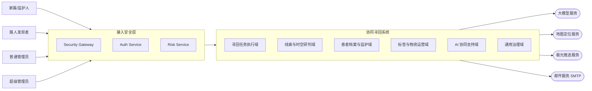
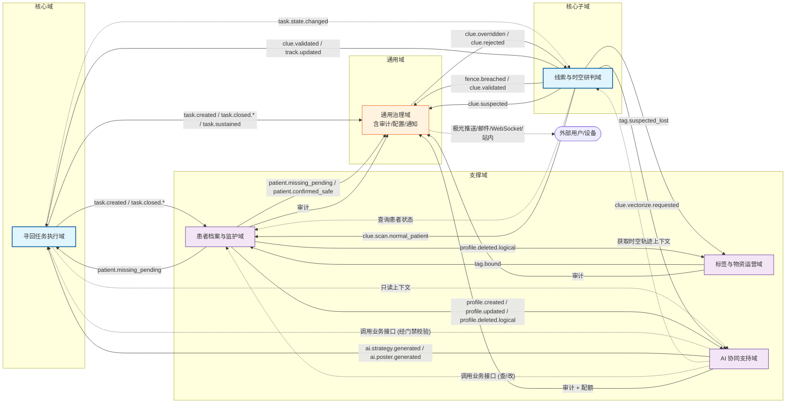
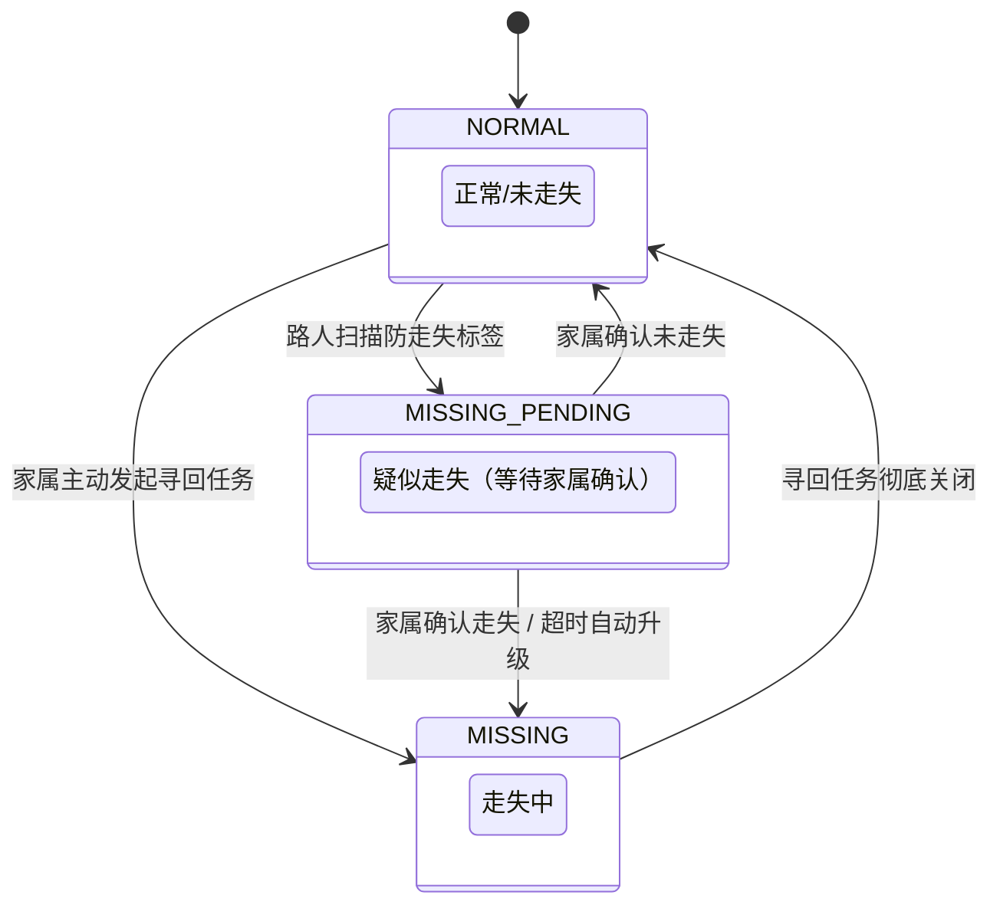
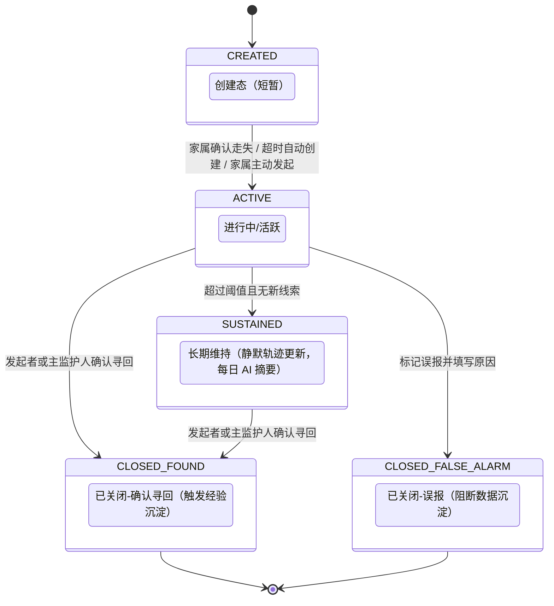
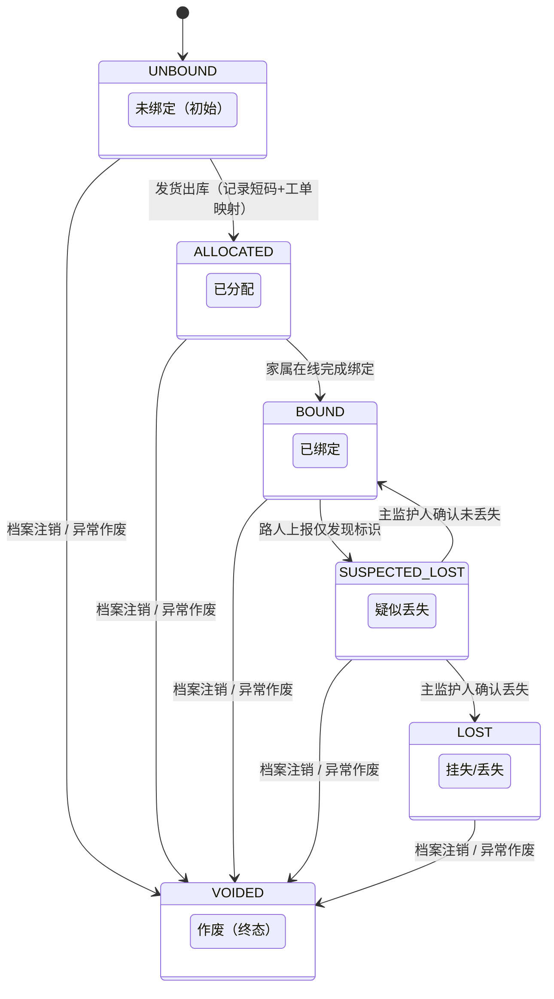
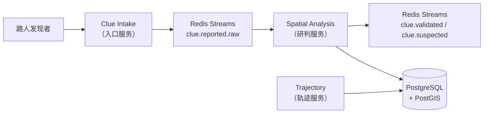
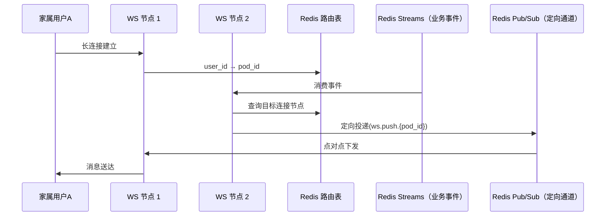

# 基于 AI 的阿尔兹海默症患者协同寻回系统

## 系统架构设计文档（SADD）

## 0. 文档信息

| 项目 | 内容 |
| :--- | :--- |
| 文档名称 | 系统架构设计文档（SADD） |
| 版本 | V2.0 |
| 日期 | 2026-04-12 |
| 基线来源 | SRS V2.0（2026-04-04） |
| 文档定位 | 定义系统级架构能力、边界和约束，作为研发、测试、运维统一基线 |

> 本版目标：全面对齐 SRS V2.0 基线，以单一主线串联业务、架构、一致性、治理与运维。

---

## 1. 文档定位与分层边界

### 1.1 本文回答的问题

1. 系统如何分层、分域、集成。
2. 关键链路如何保证一致性、可用性与可观测性。
3. 高并发与分布式异常下，系统如何避免级联故障。

### 1.2 与 LLD 的边界

- 本文保留：架构能力、职责边界、约束与验收口径。
- 本文不展开：SQL 语句、缓存键命名、算法步进、脚本实现参数。
- 具体实现细节统一下沉至 LLD 与编码规范。

### 1.3 全局硬约束（Hard Constraints）

| 编号 | 约束项 | 详细描述 | SRS 依据 |
| :--- | :--- | :--- | :--- |
| HC-01 | 状态权威性 | `TASK` 域是任务状态机唯一权威。AI 仅生成建议，严禁绕过 LUI 确认逻辑直接改写状态 | FR-AI-007, §5.3 |
| HC-02 | 变更原子性 | 核心状态变更必须采用 **Local Transaction + Outbox Pattern**，确保 DB 更新与事件发布原子性 | §6.2 |
| HC-03 | 接口幂等性 | 写接口必须支持 `X-Request-Id` 去重，后端基于 Redis 或 DB 唯一索引实现 | §7.2 |
| HC-04 | 全链路追踪 | 必须透传 `X-Trace-Id`。日志、内部调用、异步事件中必须包含追踪 ID | §7.2, FR-GOV-006 |
| HC-05 | 动态配置化 | 严禁硬编码。围栏半径、防漂移速度阈值、AI Token 限制、疑似走失超时阈值、信息展示时间等参数必须通过配置中心动态下发 | FR-GOV-008 |
| HC-06 | 匿名风险隔离 | 匿名入口必须执行"设备指纹 + 频率 + 地理位置"校验，非置信上报进入审计队列 | BR-001, FR-GOV-001 |
| HC-07 | 隐私脱敏规范 | 平台端与非属主视图在展示 PII（姓名、坐标）时，必须由架构基座执行强制脱敏；路人端照片资源必须叠加半透明时间戳水印 | FR-GOV-005, BR-010 |
| HC-08 | 通信约束 | 支持应用推送（极光推送）、邮件推送（SMTP）、站内通知及 WebSocket 定向下发。通知网关层预留短信服务接口扩展能力，当前阶段不启用。禁止全量广播 | FR-GOV-010, 项目约束 |

---

## 2. 业务主线与架构目标

### 2.1 端到端主线

1. 家属建档并建立监护关系，在线申领防走失物资，完成实体标签绑定与电子围栏配置（SRS §3.1 #1）。
2. **路人扫码触发流程**：路人扫描标签 → 系统判定患者处于 `NORMAL` → 患者进入 `MISSING_PENDING`（疑似走失）→ 系统向关联家属下发强提醒 → 家属确认走失后生成任务，患者升级为 `MISSING`；若超时未确认，系统自动升级并发送二次强提醒（SRS §3.1 #2, §5.2.1）。
3. **家属主动发起流程**：家属直接发起寻回任务 → 患者直接从 `NORMAL` 置为 `MISSING`（SRS §5.2.1）。
4. 路人通过扫码或手动填写短码上报线索（SRS §3.1 #3）。
5. 线索域进行有效性判断、防漂移校验与时空研判，产出状态事件（SRS §3.1 #4, FR-CLUE-005）。
6. 任务域收敛任务状态并触发通知（SRS §3.1 #5）。
7. AI 域基于实时线索与档案 RAG 输出策略建议，由 TASK 域决策采纳（SRS §3.1 #5, FR-AI-003）。
8. 家属或管理员完成处置后关闭任务，患者恢复 `NORMAL`（SRS §3.1 #6）。
9. 全链路写审计并纳入可观测体系（SRS §3.1 #7, FR-GOV-006）。

### 2.2 架构目标

| 编号 | 目标 | 对应 SRS 依据 |
| :--- | :--- | :--- |
| G-A | 高并发下保持状态一致和事件可恢复 | AC-04, §6.2 |
| G-B | 跨域协作不依赖高频同步调用 | §3.2 异常流 |
| G-C | 关键链路具备幂等、防乱序、防重放 | HC-03, BR-006 |
| G-D | 异常可降级、故障可定位、数据可追责 | FR-AI-010, AC-06 |
| G-E | 毕设场景最小可用复杂度，避免过度工程化 | 项目约束 |

---

## 3. 总体架构

### 3.1 参与者与外部依赖

| 类型 | 实体 | 说明 | SRS 依据 |
| :--- | :--- | :--- | :--- |
| 业务角色 | 家属/监护人 | 建档、发起/关闭任务、查看进展、AI 对话、物资申领、**绑定标签** | §2 |
| 业务角色 | 路人发现者 | 匿名线索上报（扫码/手动短码/海报扫码） | §2, FR-CLUE-002 |
| 管理角色 | 普通管理员 | 复核线索、处理工单、协查、管理用户与物资 | §2 |
| 管理角色 | 超级管理员 | 高危治理、系统级应急处置、参数配置 | §2 |
| 外部系统 | 大模型服务 | 推理与生成（通义千问等） | FR-AI-001 |
| 外部系统 | 地图定位服务 | 坐标解析与地理计算 | FR-CLUE-001 |
| 外部系统 | 极光推送服务（JPush） | App 后台实时通知推送 | FR-GOV-010 |
| 外部系统 | 邮件服务（SMTP） | 账号验证、密码重置、重要业务通知 | FR-GOV-002, FR-GOV-010 |

### 3.2 上下文总览



### 3.3 分层架构

| 层级 | 核心职责 | 关键约束 |
| :--- | :--- | :--- |
| 接入安全层 | 路由、鉴权透传、限流、幂等拦截、匿名风控（HC-06） | 轻量化，不承载复杂业务状态机 |
| 应用层 | 用例编排、事务边界、跨域协调 | 不承载核心领域规则 |
| 领域层 | 聚合、状态机、领域服务 | 状态迁移必须走聚合根 |
| 事件与集成层 | Redis Streams 解耦、Outbox 投递、Saga 协作 | 保证最终一致可证明 |
| 数据基础设施层 | 存储、缓存、消息、向量能力 | 选型与 SRS 口径一致 |
| 治理层 | 身份、权限、审计、配置（四维治理） | 全链路可观测与可追责 |

### 3.4 基础设施选型（架构层）

| 能力域 | 选型 | 架构要求 | 选型理由 |
| :--- | :--- | :--- | :--- |
| 主数据与事务 | PostgreSQL 16 | 支撑核心业务事务与 Outbox 发布基线 | 成熟可靠、生态完善 |
| 时空计算 | PostGIS | 围栏判定与邻近计算 | 与 PostgreSQL 同库，零额外运维 |
| 向量检索 | pgvector + HNSW | 支撑 RAG 低延迟召回 | 同库事务一致性，避免外部向量库运维（ADR-003） |
| 事件总线 | **Redis Streams** | 事件削峰、解耦、Consumer Group 可靠消费 | 毕设场景避免 Kafka 运维复杂度（ADR-006） |
| 分布式缓存 | Redis（Lua 脚本） | 幂等、配额、路由态与热数据 | 与事件总线共享实例，资源利用率高 |
| 通知背板 | Redis Pub/Sub | WebSocket 集群间消息定向转发 | 轻量级，满足单集群场景 |
| 发号能力 | 全局序列服务 + 缓存消费层 | 保证短码序列唯一、单调、不回退 | FR-PRO-003, FR-PRO-004, BR-009 |
| 对象存储 | 本地 / OSS | 照片、海报等静态资源存储 | AC-09 时效控制 |
| 应用推送 | 极光推送（JPush SDK） | App 后台实时通知推送（Android） | FR-GOV-010，HC-08 |
| 邮件服务 | SMTP（企业邮箱或云邮件服务） | 账号有效性校验、密码重置、重要业务通知 | FR-GOV-002, FR-GOV-010 |
| 通知网关 | 通知服务（应用层统一编排） | 多渠道路由（推送/邮件/站内/WebSocket）、降级策略、短信接口预留 | FR-GOV-010, HC-08 |

### 3.5 接入安全能力拆分

| 组件 | 主职责 | SRS 依据 |
| :--- | :--- | :--- |
| Security Gateway | 路由与策略执行、HTTPS 终结、`X-Trace-Id` 注入 | HC-04, AC-10 |
| Authentication Service | 注册用户验签、匿名设备指纹识别、Token 校验、重放拦截 | FR-GOV-001, BR-006 |
| Risk Service | 人机校验（滑块 CAPTCHA）、匿名频率限流（10 分钟 3 次）、地理位置异常拦截 | FR-CLUE-003, BR-001, HC-06 |

---

## 4. 领域架构（DDD）与职责边界

### 4.1 六域映射

| 领域 | 定位 | 核心职责 | SRS 依据 |
| :--- | :--- | :--- | :--- |
| 寻回任务执行域（TASK） | 核心域 | 任务生命周期（`CREATED` → `ACTIVE` → `SUSTAINED` → `CLOSED_FOUND` / `CLOSED_FALSE_ALARM`）、状态收敛与寻回闭环（HC-01 唯一权威） | §4.4, §5.2.2 |
| 线索与时空研判域（CLUE） | 核心子域 | 线索接入、防漂移校验、围栏判定、轨迹聚合、存疑线索复核 | §4.2, §5.2.4 |
| 患者档案与监护域（PROFILE） | 支撑域 | 患者档案 CRUD、走失状态（`NORMAL` / `MISSING_PENDING` / `MISSING`）管理、监护关系协同、围栏配置 | §4.3, §5.2.1, §5.2.6 |
| 标签与物资运营域（MAT） | 支撑域 | 标签主数据、绑定流程、物资申领工单闭环、批量发号与库存管理 | §4.5, §5.2.3, §5.2.5 |
| AI 协同支持域（AI） | 支撑域 | AI Agent 自然语言交互、Function Calling 编排、策略建议、海报文案生成、RAG 向量化管理（集成 Spring AI Alibaba） | §4.1, §5.3 |
| 通用治理域（GOV） | 通用域 | 身份、权限、审计、配置四维治理；Outbox 投递管理；通知网关（多渠道路由、降级策略、审计记录） | §4.6 |

### 4.2 域间协作



### 4.3 领域权威约束

1. **TASK 域**是任务状态唯一权威（HC-01）。任何域不得直接修改 `rescue_task` 的状态字段。
2. **PROFILE 域**是患者 `lost_status` 的持有方，其迁移规则为：TASK 域事件驱动（`task.created` → `MISSING`、`task.closed.*` → `NORMAL`）；路人扫码触发的 `NORMAL` → `MISSING_PENDING` 由 CLUE 域通知 PROFILE 域执行；家属确认未走失时 `MISSING_PENDING` → `NORMAL` 由 PROFILE 域自主执行。
3. **AI Agent** 通过 Function Calling 调用各域标准 REST API 执行业务操作，所有写操作经 Policy Guard 门禁校验后由目标域服务自身完成状态变更；AI 服务不直接写入域实体表。
4. `tag_asset` 写模型归属 MAT 域，PROFILE 域通过事件协作。
5. 跨域协作优先事件驱动，不允许跨域直接写库。
6. 冻结事件接口清单：`task.state.changed`、`clue.validated`、`fence.breached`、`track.updated`、`task.created`、`task.closed.found`、`task.closed.false_alarm`、`patient.missing_pending`、`patient.confirmed_safe`、`tag.bound`、`tag.suspected_lost`、`notification.sent`。变更需架构评审。
7. 接入安全层为基础设施，不计入业务领域。通知服务为通用治理域子能力，负责多渠道路由（极光推送、邮件、站内通知、WebSocket）与降级策略，不构成独立领域。

### 4.4 核心业务状态机

> 以下状态机严格对齐 SRS §5.2，是研发与测试的唯一基线。

#### 4.4.1 患者走失状态机（SRS §5.2.1）



| 当前状态 | 目标状态 | 触发条件 | 架构动作 |
| :--- | :--- | :--- | :--- |
| `NORMAL` | `MISSING_PENDING` | 路人扫描标签（患者为 `NORMAL`） | CLUE 域发布 `clue.scan.normal_patient` → PROFILE 域迁移状态 → 发布 `patient.missing_pending` → 通知服务推送家属强提醒 |
| `MISSING_PENDING` | `MISSING` | 家属确认走失 / 超时自动升级 | TASK 域创建任务 → 发布 `task.created` → PROFILE 域迁移状态 |
| `NORMAL` | `MISSING` | 家属主动发起寻回任务 | TASK 域创建任务 → 发布 `task.created` → PROFILE 域迁移状态 |
| `MISSING` | `NORMAL` | 寻回任务彻底关闭 | TASK 域发布 `task.closed.found` / `task.closed.false_alarm` → PROFILE 域迁移状态 |
| `MISSING_PENDING` | `NORMAL` | 家属确认未走失 | PROFILE 域直接迁移 → 发布 `patient.confirmed_safe` → 通知服务推送确认结果 |

**超时自动升级机制**：`MISSING_PENDING` 超时阈值由配置中心动态维护（HC-05）。调度器在超时到达后触发 TASK 域自动创建任务，并向家属发送二次强提醒。

**`MISSING_PENDING` 重复扫码场景**（FR-CLUE-004）：当患者已处于 `MISSING_PENDING` 且再有路人扫码时，系统正常接收并保存该线索（进入 `PENDING` 待判定状态），不重复触发状态迁移。前端展示策略与 `MISSING` 态相同（展示全量救援信息），以便路人提供即时援助。

#### 4.4.2 寻回任务状态机（SRS §5.2.2）



| 当前状态 | 目标状态 | 触发条件 | 架构动作 |
| :--- | :--- | :--- | :--- |
| `CREATED` | `ACTIVE` | 家属确认走失 / 超时自动 / 家属主动发起 | 同一用例内原子迁移，发布 `task.created`；同一患者仅允许一个非终态任务（FR-TASK-001，DB 唯一约束 + 幂等拦截） |
| `ACTIVE` | `SUSTAINED` | 超过阈值（如 24h）且无新线索 | 调度器检测 → TASK 域迁移 → 发布 `task.sustained`；停止主动推送，AI 降为每日摘要模式 |
| `ACTIVE` / `SUSTAINED` | `CLOSED_FOUND` | 发起者或主监护人确认寻回 | 权限校验（FR-TASK-005）→ 迁移 → 发布 `task.closed.found` → 异步沉淀轨迹至向量库 |
| `ACTIVE` | `CLOSED_FALSE_ALARM` | 标记误报并填写原因 | 强制填写关闭原因（FR-TASK-004）→ 发布 `task.closed.false_alarm` → 阻断数据进入 RAG 样本库（BR-003） |

#### 4.4.3 防走失标签状态机（SRS §5.2.3）



| 当前状态 | 目标状态 | 触发条件 | 架构动作 |
| :--- | :--- | :--- | :--- |
| `UNBOUND` | `ALLOCATED` | 发货出库 | MAT 域记录短码与工单映射（FR-MAT-002），发布 `tag.allocated` |
| `ALLOCATED` | `BOUND` | 家属在线绑定标签 | MAT 域迁移 → 发布 `tag.bound` → 工单仍为"已发货"时自动流转为"已签收"（FR-MAT-003） |
| `BOUND` | `SUSPECTED_LOST` | 路人上报仅发现标识（无人） | CLUE 域标记线索为 `tag_only` → 发布 `tag.suspected_lost` → MAT 域迁移；若患者 `MISSING`，线索同时进入审核流程 |
| `SUSPECTED_LOST` | `LOST` | 主监护人确认丢失 | MAT 域迁移 → 发布 `tag.loss.confirmed` |
| `SUSPECTED_LOST` | `BOUND` | 主监护人确认未丢失 | MAT 域迁移恢复 |
| 任意状态 | `VOIDED` | 档案注销 / 物资异常作废 | 强制置为 `VOIDED`（FR-PRO-009），作废标签不得进入紧急上报链路（BR-007） |

#### 4.4.4 线索与时空研判状态机（SRS §5.2.4）

| 当前状态 | 目标状态 | 触发条件 | 架构动作 |
| :--- | :--- | :--- | :--- |
| `SUBMITTED` | `PENDING` | 路人上报线索进入系统 | CLUE 域 Intake 接收 → 发布 `clue.reported.raw` → 进入研判 |
| `PENDING` | `PENDING_REVIEW` | 系统判定逻辑冲突 / 空间跨度异常 / 速率超限 | 防漂移校验（FR-CLUE-005）→ 发布 `clue.suspected` → 进入管理员复核队列 |
| `PENDING_REVIEW` | `VALID` | 管理员复核通过 | 管理复核服务 → 发布 `clue.overridden` → 进入核心轨迹集 |
| `PENDING_REVIEW` | `INVALID` | 管理员驳回 / 悬挂超时 | 发布 `clue.rejected`；存疑线索超时自动失效（BR-004） |
| `PENDING` | `VALID` | 系统自动校验无异常 | 发布 `clue.validated` → 进入核心轨迹集 → 触发 `track.updated` |

**防漂移速率计算**：基于最近一条审核通过的线索坐标作为时空基准点，计算移动速率。超过防漂移速度阈值（HC-05 动态配置）时自动阻断进入核心轨迹集。第一条线索创建任务，无需校验（FR-CLUE-005）。

**间接线索**：扫描寻人海报二维码时，系统解析 URL 中的 `task_id` 自动归集，标记为间接线索（`source_type = POSTER_SCAN`），在前端地图降维展示（FR-CLUE-008）。

#### 4.4.5 物资申领工单状态机（SRS §5.2.5）

| 当前状态 | 目标状态 | 触发条件 | 架构动作 |
| :--- | :--- | :--- | :--- |
| `PENDING_AUDIT` | `PENDING_SHIP` | 审核通过 | MAT 域迁移 → 发布 `material.order.approved` |
| `PENDING_AUDIT` | `REJECTED` | 审核驳回 | MAT 域迁移 → 留存驳回原因（FR-MAT-004） |
| `PENDING_AUDIT` | `CANCELLED` | 申领人主动取消 | MAT 域迁移 → 留存取消原因（FR-MAT-004） |
| `PENDING_SHIP` | `SHIPPED` | 物资出库并发货 | MAT 域记录短码映射（FR-MAT-002），标签 → `ALLOCATED` |
| `SHIPPED` | `RECEIVED` | 物流完结 / 用户绑定标签自动流转 | `tag.bound` 事件消费 → MAT 域自动迁移（FR-MAT-003） |
| `SHIPPED` | `EXCEPTION` | 物流阻滞 | MAT 域迁移，进入异常处置分支 |
| `EXCEPTION` | `RECEIVED` | 管理员补发并签收 | 异常闭环 → 留存操作原因（FR-MAT-004） |
| `EXCEPTION` | `VOIDED` | 管理员直接作废 | 异常闭环 → 留存操作原因（FR-MAT-004, BR-008） |

#### 4.4.6 监护权协同请求状态机（SRS §5.2.6）

| 当前状态 | 目标状态 | 触发条件 | 架构动作 |
| :--- | :--- | :--- | :--- |
| `CREATED` | `PENDING_CONFIRM` | 主监护人发起转移请求 | PROFILE 域创建请求 → 通知目标受方 |
| `PENDING_CONFIRM` | `COMPLETED` | 目标受方确认接收 | PROFILE 域迁移主监护权 → 审计记录（BR-005） |
| `PENDING_CONFIRM` | `REJECTED` | 目标受方拒绝 | PROFILE 域迁移 → 通知发起方 |
| `PENDING_CONFIRM` | `REVOKED` | 发起方主动撤销 | PROFILE 域迁移 |
| `PENDING_CONFIRM` | `EXPIRED` | 关联成员被移除 / 超时 | 调度器或事件驱动自动失效 → 被移除成员历史请求全部失效（BR-006） |

### 4.5 线索域高并发拆分边界



- **Intake** 仅做入参校验与削峰写入 Redis Streams，不做研判逻辑。
- **Spatial Analysis** 从 Redis Streams Consumer Group 消费，执行防漂移、围栏、时空校验。
- 职责分离确保上报峰值不因研判计算反压阻塞。

### 4.6 围栏抑制与跨域状态下发

| 机制 | 架构约束 | SRS 依据 |
| :--- | :--- | :--- |
| 状态下发 | TASK 迁移状态后发布 `task.state.changed`（含时序标识） | FR-CLUE-009 |
| 缓存层级 | CLUE 域采用 `L1` 本地缓存 + `L2` Redis 只读缓存 | — |
| 判定路径 | 先读 `L1`，未命中读 `L2`，禁止高频同步调用 TASK 域 | G-B |
| 防乱序 | 基于时序标识执行条件更新，禁止旧状态覆盖新状态 | HC-03 |
| 围栏告警抑制 | 患者处于 `MISSING` 时，围栏越界事件仅做轨迹静默更新，不产生告警风暴 | FR-CLUE-009 |
| 围栏被动判定 | 仅在患者 `NORMAL` 态时，扫码事件触发围栏越界判定并下发告警 | FR-CLUE-006 |
| 降级原则 | 仅当 `L1`/`L2` 同时不可用时才进入抑制分支 | — |

---

## 5. 事件驱动与一致性架构

### 5.1 接口契约基线

| 约束项 | 架构要求 | SRS 依据 |
| :--- | :--- | :--- |
| 幂等 | 写请求必须支持 `X-Request-Id` 幂等拦截（Redis SETNX 或 DB 唯一索引） | HC-03, §7.2 |
| 追踪 | 请求、响应与日志必须携带 `X-Trace-Id` | HC-04, FR-GOV-006 |
| 错误语义 | 业务错误与系统错误分层表达，匿名入口不暴露内部主键 | §7.2 |
| 防乱序 | 消费端必须基于时序标识执行条件更新，阻止陈旧事件覆盖最新状态 | G-C |

补充：
- 幂等键空间与命名规范由 LLD 定义。
- 围栏判定链路必须依赖状态事件下发后的缓存态，详见 §4.6。

### 5.1a 错误码架构规范

> 保证跨域错误语义一致性，统一前后端错误处理契约。

**编码规则**：`E_{DOMAIN}_{HTTP_STATUS}{SEQ}`

| 段 | 说明 | 示例 |
| :--- | :--- | :--- |
| `E_` | 固定前缀 | — |
| `{DOMAIN}` | 域前缀（见下表） | `TASK`、`CLUE` |
| `{HTTP_STATUS}` | 对应 HTTP 状态码（3 位） | `400`、`403`、`409` |
| `{SEQ}` | 域内顺序号（1~2 位） | `1`、`97` |

**域前缀分配**：

| 域前缀 | 领域 | 编码区间示例 |
| :--- | :--- | :--- |
| `TASK` | 寻回任务执行域 | `E_TASK_4001` ~ `E_TASK_5099` |
| `CLUE` | 线索与时空研判域 | `E_CLUE_4001` ~ `E_CLUE_5099` |
| `PROFILE` | 患者档案与监护域 | `E_PROFILE_4001` ~ `E_PROFILE_5099` |
| `MAT` | 标签与物资运营域 | `E_MAT_4001` ~ `E_MAT_5099` |
| `AI` | AI 协同支持域 | `E_AI_4001` ~ `E_AI_5099` |
| `GOV` | 通用治理域 | `E_GOV_4001` ~ `E_GOV_5099` |
| `SYS` | 系统级（跨域通用） | `E_SYS_4001` ~ `E_SYS_5099` |

**HTTP 状态码映射基线**：

| HTTP 状态码 | 语义 | 典型场景 |
| :--- | :--- | :--- |
| `400` | 请求参数非法 | 字段缺失、格式错误、枚举越界 |
| `401` | 身份未认证 | Token 缺失或过期 |
| `403` | 权限不足 | RBAC 拒绝、行级越权（IDOR）、Policy Guard 拦截 |
| `404` | 资源不存在 | 业务对象未找到（匿名入口不暴露内部主键，统一返回 `404`） |
| `409` | 业务冲突 | 幂等重复、状态机非法迁移、并发竞争失败 |
| `422` | 业务规则校验失败 | 围栏未开启、配额耗尽、短码非法 |
| `429` | 频率限流 | 匿名上报限流、AI 配额超限 |
| `500` | 系统内部错误 | 未预期异常、基础设施故障 |
| `503` | 服务降级 | AI 模型不可用、外部依赖超时 |

**已定义错误码速查**（Policy Guard）：

| 错误码 | HTTP | 语义 | 来源 |
| :--- | :--- | :--- | :--- |
| `E_GOV_4039` | `403` | 策略拒绝 | §6.6 Policy Guard |
| `E_GOV_4097` | `409` | 确认等级不足 | §6.6 Policy Guard |
| `E_GOV_4226` | `422` | 预检查失败 | §6.6 Policy Guard |
| `E_GOV_4231` | `403` | 人工专属操作被 Agent 调用 | §6.6 Policy Guard |

**统一响应体结构**：

```json
{
  "code": "E_TASK_4091",
  "message": "任务进行中，请勿重复发起",
  "trace_id": "abc-123-xyz",
  "timestamp": "2026-04-17T10:30:00Z",
  "detail": {}
}
```

**约束**：
1. 匿名入口（路人 H5）错误响应不暴露内部主键和域前缀详情，统一包装为通用提示。
2. 错误码注册表由 LLD 维护完整清单，本文仅定义编码规则与域前缀分配。
3. 新增业务错误码必须在对应域前缀区间内分配，禁止跨域复用。

### 5.2 核心事件清单

> 事件按业务链路分组。**Outbox** 列标识是否经 Outbox 模式保证原子性。非 Outbox 事件直接写入 Redis Streams。

#### 5.2.1 线索域事件

| 事件 | 生产方 | 消费方 | 语义 | Outbox |
| :--- | :--- | :--- | :--- | :--- |
| `clue.reported.raw` | 线索入口服务 | 线索研判服务 | 原始线索入站削峰 | 否（直入 Redis Streams） |
| `clue.scan.normal_patient` | 线索入口服务 | PROFILE 域 | 路人扫码且患者为 `NORMAL`，触发 `MISSING_PENDING` | 否（直入 Redis Streams） |
| `clue.validated` | 线索研判服务 | TASK 域、AI 域 | 有效线索进入任务与策略链路 | 是 |
| `clue.suspected` | 线索研判服务 | 管理复核服务 | 可疑线索进入人工复核队列 | 是 |
| `clue.overridden` | 管理复核服务 | 线索服务、TASK 域 | 管理员复核通过 | 是 |
| `clue.rejected` | 管理复核服务 | 线索服务 | 管理员驳回或悬挂超时失效 | 是 |
| `track.updated` | 线索研判服务 | TASK 域、AI 域 | 轨迹增量更新 | 是 |
| `fence.breached` | 线索研判服务 | 通知服务 | 围栏越界告警（仅 `NORMAL` 态） | 是 |
| `tag.suspected_lost` | 线索入口服务 | MAT 域 | 路人上报仅发现标识（无人） | 是 |

#### 5.2.2 任务域事件

| 事件 | 生产方 | 消费方 | 语义 | Outbox |
| :--- | :--- | :--- | :--- | :--- |
| `task.created` | TASK 域 | PROFILE 域、AI 域、通知服务 | 任务启动（含自动升级场景），PROFILE 域据此将患者置为 `MISSING` | 是 |
| `task.state.changed` | TASK 域 | CLUE 域 | 下发患者状态供围栏抑制缓存（含时序标识） | 是 |
| `task.sustained` | TASK 域 | AI 域、通知服务 | 任务进入长期维持态，AI 降为每日摘要模式 | 是 |
| `task.closed.found` | TASK 域 | PROFILE 域、CLUE 域、AI 域、通知服务 | 确认寻回闭环 → 患者恢复 `NORMAL` → 异步沉淀轨迹至向量库 | 是 |
| `task.closed.false_alarm` | TASK 域 | PROFILE 域、CLUE 域、AI 域、通知服务 | 误报关闭 → 患者恢复 `NORMAL` → AI 域清除豁免标记 + **阻断**数据进入 RAG 样本库 | 是 |

#### 5.2.3 档案域事件

| 事件 | 生产方 | 消费方 | 语义 | Outbox |
| :--- | :--- | :--- | :--- | :--- |
| `patient.missing_pending` | PROFILE 域 | TASK 域（启动超时调度器）、通知服务（推送家属强提醒） | 患者进入 `MISSING_PENDING` | 是 |
| `patient.confirmed_safe` | PROFILE 域 | 通知服务 | 家属否认走失，患者回 `NORMAL` | 是 |
| `profile.created` | PROFILE 域 | AI 向量化服务 | 新建档案触发向量化初始化 | 是 |
| `profile.updated` | PROFILE 域 | AI 向量化服务 | 档案更新触发向量重建 | 是 |
| `profile.deleted.logical` | PROFILE 域 | AI 向量化服务、MAT 域 | 注销 → 清理向量 + 标签强制 `VOIDED` | 是 |

#### 5.2.4 物资域事件

| 事件 | 生产方 | 消费方 | 语义 | Outbox |
| :--- | :--- | :--- | :--- | :--- |
| `tag.allocated` | MAT 域 | — | 标签出库分配 | 是 |
| `tag.bound` | MAT 域 | PROFILE 域（同步绑定关系）、MAT 域（工单自动签收） | 标签绑定完成 | 是 |
| `tag.loss.confirmed` | MAT 域 | — | 主监护人确认标签丢失 | 是 |
| `material.order.created` | MAT 域 | 管理端处理器 | 物资申领工单创建 | 是 |
| `material.order.approved` | MAT 域 | 管理端处理器 | 申领审核通过 | 是 |
| `material.order.shipped` | MAT 域 | — | 发货出库，标签状态 `UNBOUND → ALLOCATED` | 是 |

#### 5.2.5 AI 域事件

| 事件 | 生产方 | 消费方 | 语义 | Outbox |
| :--- | :--- | :--- | :--- | :--- |
| `ai.strategy.generated` | AI 域 | TASK 域 | 策略建议推送 | 否 |
| `ai.poster.generated` | AI 域 | TASK 域 | 海报文案 JSON 异步回写 | 否 |
| `clue.vectorize.requested` | 线索入口服务 | AI 向量化服务 | 线索文本向量化 | 否 |
| `memory.appended` | AI 域 | AI 向量化服务 | 记忆条目新增 | 否 |
| `memory.expired` | AI 域 | AI 向量化服务 | 记忆条目过期清理 | 否 |

#### 5.2.6 GOV 域事件

| 事件 | 生产方 | 消费方 | 语义 | Outbox |
| :--- | :--- | :--- | :--- | :--- |
| `notification.sent` | 通知服务 | 审计服务 | 通知发送完成（含渠道、目标、结果、`trace_id`），用于审计追踪 | 否（直入 Redis Streams） |

### 5.3 Outbox 强一致投递模型

1. 状态变更与 Outbox 记录在同一本地事务中提交（HC-02）。
2. 事务提交后，Outbox Poller 异步扫描并发布至 Redis Streams。
3. 投递失败进入重试队列，超过重试上限进入 DEAD 状态。
4. 消费端必须幂等并防乱序。
5. 消费端业务更新与本地幂等日志写入必须同事务提交。
6. Outbox 必须实施生命周期治理，防止表膨胀。

**适用边界**：
- Outbox 仅用于领域状态变更事件。
- Intake 原始事件（`clue.reported.raw`）先入 Redis Streams，再异步落库。

**生命周期要求**：

- Outbox 必须具备自动归档/清理机制（错峰限速，避免反压主库）。
- DEAD 事件必须具备受控人工干预入口（诊断、修复、重放），且修复前分区闸门持续生效。
- 干预动作必须全量审计并可追溯（`operator_user_id`、`reason`、`trace_id`、`before_phase`、`after_phase`）。

### 5.4 跨域长事务（Choreography Saga）

- 采用 Choreography，不引入中心编排器单点（ADR-001）。
- 主链以 TASK 状态收敛为准。
- 子链路失败走补偿，不回滚主状态。
- 典型 Saga 链路：`task.created` → PROFILE 域迁移 `lost_status` → AI 域初始化上下文 → 通知服务执行强提醒双通道策略（极光推送 + WebSocket 定向下发同时触达，WebSocket 离线时降级至应用推送 + 站内通知）。任一子链路失败由各自域补偿，TASK 状态不回退。

### 5.5 WebSocket 集群精准路由（防惊群）



**约束**（HC-08）：
- 禁止全节点 Global Topic 无差别广播。
- 必须先路由查询再定向下发。
- 路由缺失时降级到应用推送（极光推送）/ 站内通知。
- 路由心跳续期必须采用抖动窗口与阈值续期，禁止全连接同频写路由存储。
- 路由存储短暂不可用时，必须触发可观测降级并启用推送 / 站内通知兜底。

---

## 6. AI 架构

### 6.1 AI 执行边界

1. 接收用户自然语言输入并理解意图（FR-AI-001, FR-AI-002）。
2. 组装上下文（任务状态、线索轨迹、患者档案）（FR-AI-003）。
3. 执行检索增强（RAG），基于患者档案向量召回（FR-AI-004）。
4. 通过 Function Calling 调用域 API 完成业务操作（FR-AI-007, §5.3）。
5. 生成策略建议并发布事件，建议必须包含推理依据（FR-AI-006）。
6. 支持 SSE 流式输出（FR-AI-012）。
7. 记录审计与可观测信息（FR-AI-011）。

**边界约束**：
- AI Agent 通过 Spring AI Alibaba 的 `ChatClient` + `FunctionCallback` 实现 Tool-Use 编排。
- 所有 Function Calling 写操作必须经 Policy Guard 门禁校验后，由目标域服务自身完成状态变更。
- AI 服务不直接写入域实体表（`rescue_task`、`clue_record` 等），HC-01 不变。
- TASK 域仍是任务状态唯一权威；AI 的 `create_rescue_task` 调用实质是调用 `POST /api/v1/rescue/tasks`。
- 只读查询（如轨迹、快照）按 A0 等级允许 AI 自动执行，无需人工确认。
- Prompt 中 PII 必须在发送前执行正则匹配与自动脱敏替换（FR-AI-008, HC-07）。

**Agent 执行分级（架构级）**：

| 等级 | 执行语义 | 架构约束 | SRS 依据 |
| :--- | :--- | :--- | :--- |
| A0 | 自动观测 | 只读、聚合、预警，允许自动执行 | §5.3 "直接回答" |
| A1 | 智能助理 | 草稿与建议，写操作必须人工确认 | §5.3 "直接输出 JSON" |
| A2 | 受控执行 | 常规写操作可执行，要求 `CONFIRM_1` | §5.3 "生成待确认工单" |
| A3 | 高风险执行 | 状态变更治理操作可执行，要求 `CONFIRM_2/3` | §5.3 极高风险 |
| A4 | 人工专属 | 不可逆与合规敏感操作，`MANUAL_ONLY` | ADR-005 |

**硬边界**：
1. `A4` 操作永不允许 Agent 自动执行。
2. 任何 AI 触发写操作必须通过策略门禁（Policy Guard）与审计链路。
3. 对于生成工单类的 AI 建议，前端必须强制渲染"确认执行"按钮并展示预填信息摘要，系统必须记录 `trace_id` 关联至审计日志并标识为"AI 辅助操作"（FR-AI-015）。

### 6.2 RAG 路由约束

- 必须先注入患者维度隔离（`patient_id`），再执行向量召回（FR-AI-004）。
- 必须启用数据有效性过滤（失效/过期/替代数据不得召回）。
- 误报任务（`CLOSED_FALSE_ALARM`）产生的数据不得沉淀为可召回经验（BR-003, FR-TASK-004）。
- AI 回复中须包含至少一条线索记录 ID 或档案字段名称作为可验证引用（FR-AI-006）。
- 具体查询语句和索引参数由 LLD 定义。

### 6.3 AI 双账本配额（含走失豁免）

| 维度 | 架构要求 | SRS 依据 |
| :--- | :--- | :--- |
| 配额账本 | `user_id` 全局账本 + `patient_id` 全局账本，双维度独立计量 | FR-AI-009 |
| 预占机制 | 原子预占并写入待确认记录 | — |
| 确认机制 | 推理完成后异步对账并确认 | — |
| 超时补偿 | 待确认超时必须自动回滚预占 | — |
| 崩溃恢复 | 服务重启后必须恢复未决配额状态 | — |
| **走失豁免** | 当患者处于 `MISSING` 状态时，该患者关联家属的 AI 会话配额**自动豁免**，仅允许相关寻回对话，直至任务结束恢复正常配额 | FR-AI-009, AC-13 |

**走失豁免实现路径**：
1. TASK 域发布 `task.created` 事件时，AI 配额服务消费并在 Redis 中标记 `patient:{patient_id}:exempt = true`。
2. 配额校验前先读取豁免标记，若为 `true` 且请求上下文属于该患者的寻回对话，则跳过扣减。
3. TASK 域发布 `task.closed.*` 事件时，清除豁免标记，恢复正常配额控制。

### 6.4 上下文窗口防护（Context Overflow Guard）

| 环节 | 架构要求 | SRS 依据 |
| :--- | :--- | :--- |
| Token 预估 | 推理前必须完成 Token 统计与阈值校验 | FR-AI-005 |
| 截断优先级 | 系统角色 Prompt > 实时线索摘要 > 近 3 轮对话 > 历史对话轮次 | FR-AI-005 |
| 超限处理 | 超限请求必须进入确定性截断流程 | — |
| 可审计性 | 必须记录截断前后规模与策略命中路径 | FR-AI-011 |
| 失败语义 | 触发 `L2` 类错误并发布结构化事件 | — |

**硬约束**：严禁将超出模型上下文窗口的 Payload 直接下发模型。

### 6.5 AI 失败语义分级

| 等级 | 语义 | 处理策略 | SRS 依据 |
| :--- | :--- | :--- | :--- |
| L1 | 物理链路失败（超时/网络） | 快速重试 + 熔断 → 降级至基于规则推荐 | FR-AI-010, AC-06 |
| L2 | 推理逻辑失败（上下文溢出） | 模板降级 → 提示"AI 繁忙，请查看地图" | FR-AI-010 |
| L3 | 工具链失败（Function Calling 异常） | 降级动作 + 人工介入通知 | — |
| L4 | 内容安全阻断 | 强阻断 + 审计记录 | FR-AI-008 |

### 6.6 Agent 执行策略门禁（Policy Guard）

1. **入站识别**：`action_source`（`USER` / `AI_AGENT`）与 `agent_profile` 必须可识别。
2. **策略校验**：角色权限、数据归属、执行模式、确认等级必须全部通过。
3. **预检查**：支持 `dry_run`，仅校验不落副作用。
4. **失败语义**：
   - 策略拒绝 → `E_GOV_4039`
   - 确认等级不足 → `E_GOV_4097`
   - 预检查失败 → `E_GOV_4226`
   - 人工专属操作被 Agent 调用 → `E_GOV_4231`
5. **审计要求**：策略命中路径与拦截原因必须可回放（FR-AI-011, FR-GOV-006）。

### 6.7 Agent 能力包与 Function Calling 架构对齐

**能力包开关**（`sys_config.scope = ai_policy`）必须与 API 白名单同粒度：

| agent_profile | config_key | 职责说明 |
| :--- | :--- | :--- |
| RescueCommander | `agent.capability.rescue.enabled` | 寻回任务发起/关闭/查询 |
| ClueInvestigator | `agent.capability.clue.enabled` | 线索查询/轨迹检索 |
| GuardianCoordinator | `agent.capability.guardian.enabled` | 监护关系/围栏配置 |
| MaterialOperator | `agent.capability.material.enabled` | 物资申领/标签挂失 |
| AICaseCopilot | `agent.capability.ai_case.enabled` | 海报生成/档案修改 |

**Agent 策略配置键**（`sys_config.scope = ai_policy`）：

| config_key | 说明 |
| :--- | :--- |
| `agent.execution.max_level` | 允许执行上限（A0/A1/A2/A3） |
| `agent.confirmation.policy` | 确认级别策略映射 |
| `agent.manual_only.actions` | 人工专属接口白名单 |

**Function Calling 白名单**（`action` 必须命中白名单，并通过现有业务接口执行，禁止内部旁路写）：

**家属侧核心操作（A0-A2）**：

| action | 目标接口 | 执行等级 | 约束 | SRS 依据 |
| :--- | :--- | :--- | :--- | :--- |
| `create_rescue_task` | `POST /api/v1/rescue/tasks` | A2 (`CONFIRM_1`) | 家属确认后执行；引导补录当日着装（FR-TASK-003） | §5.3 任务启停 |
| `propose_close_found` | `POST /api/v1/rescue/tasks/{task_id}/close` | A3 (`CONFIRM_2`) | **极高风险**，必须物理点击确认并填写寻回地点备注 | §5.3 任务启停 |
| `submit_material_order` | `POST /api/v1/material/orders` | A2 (`CONFIRM_1`) | AI 辅助填写收货地址，家属确认 | §5.3 标签申领 |
| `report_tag_lost` | `POST /api/v1/tags/{tag_code}/loss/confirm` | A2 (`CONFIRM_1`) | 列出绑定标签供家属勾选 | §5.3 主动挂失 |
| `update_fence_config` | `PUT /api/v1/patients/{patient_id}/fence` | A2 (`CONFIRM_1`) | 严禁 AI 直接关闭围栏 | §5.3 电子围栏 |
| `update_daily_appearance` | `PUT /api/v1/patients/{patient_id}/appearance` | A2 (`CONFIRM_1`) | 当日着装为最高视觉锚点 | §5.3 档案管理 |
| `update_patient_profile` | `PUT /api/v1/patients/{patient_id}/profile` | A2 (`CONFIRM_1`) | 长期 RAG 素材，需家属确认 | §5.3 档案管理 |
| `generate_poster` | `POST /api/v1/ai/poster` | A1 | 输出 JSON 文案，经敏感词过滤 | §5.3 自然语言 |
| `query_task_snapshot` | `GET /api/v1/rescue/tasks/{task_id}/snapshot` | A0 | 只读 | — |
| `query_trajectory` | `GET /api/v1/rescue/tasks/{task_id}/trajectory/latest` | A0 | 只读 | — |
| `query_patient_profile` | `GET /api/v1/patients/{patient_id}` | A0 | 只读 | — |
| `query_clue_list` | `GET /api/v1/rescue/tasks/{task_id}/clues` | A0 | 只读 | — |

**管理与治理操作（A2-A4）**：

| action | 目标接口 | 最低确认 | 约束 | SRS 依据 |
| :--- | :--- | :--- | :--- | :--- |
| `clue_override` | `POST /api/v1/clues/{clue_id}/override` | `CONFIRM_2` | 管理员复核通过 | FR-CLUE-007 |
| `clue_reject` | `POST /api/v1/clues/{clue_id}/reject` | `CONFIRM_2` | 管理员驳回 | FR-CLUE-007 |
| `approve_material_order` | `POST /api/v1/material/orders/{order_id}/approve` | `CONFIRM_2` | 审核通过 | FR-MAT-001 |
| `force_close_task` | `POST /api/v1/admin/super/rescue/tasks/{task_id}/force-close` | `MANUAL_ONLY` | A4 动作，仅人工页面可执行 | ADR-005 |
| `replay_outbox_dead` | `POST /api/v1/admin/super/outbox/dead/{event_id}/replay` | `CONFIRM_3` | DEAD 事件受控重放 | — |

**执行回执要求**：
1. 若 action 执行成功，必须返回 `action_id`、`result_code`、`executed_at`。
2. 上述回执字段必须通过 AI 流式 `done` 事件透传，保证端到端可观测与可审计。

---

## 7. 数据与存储架构

### 7.1 概念实体基线

> 对齐 SRS §6.1 核心业务实体。字段细节由 LLD / DB Design 定义。

| 实体 | 核心属性 | SRS 依据 |
| :--- | :--- | :--- |
| 患者档案 | 基本信息、短码（6 位）、照片、健康描述、体貌特征标签、走失状态（`NORMAL` / `MISSING_PENDING` / `MISSING`） | §6.1, §5.2.1 |
| 监护关系 | 角色（主监护人/协同人）、关系状态、邀请与转移状态 | §6.1, §5.2.6 |
| 标签资产 | 标签编码、标签类型、标签状态（6 态）、关联患者（**1:N，多标签共享患者走失状态**）、关联工单、作废原因 | §6.1, §5.2.3, FR-PRO-005 |
| 寻回任务 | 患者、任务状态（5 态）、发起时间、结束时间、关闭类型、关闭原因、当日着装描述、**当日照片** | §6.1, §5.2.2, FR-TASK-003 |
| 线索记录 | 标签、患者、位置（PostGIS geometry）、描述、图片、来源类型（实体扫码/海报扫码/手动短码）、有效性状态（5 态）、`tag_only` 标记、复核结果 | §6.1, §5.2.4, FR-CLUE-008 |
| 轨迹数据 | 聚合结果（LineString）、窗口信息 | FR-CLUE-010 |
| 物资工单 | 申领人、收货信息、工单状态（6 态）、标签编码、物流信息、异常/作废原因 | §6.1, §5.2.5 |
| AI 会话与记忆 | 会话上下文、输入输出摘要、配额消耗（双账本）、处理结果、反馈（采纳/无用） | §6.1, FR-AI-014 |
| 审计日志 | `operator_user_id`、`operator_username`、`object_id`、`action`、`result`、`risk_level`、`detail`、`trace_id`、`request_id`、`action_source`、`agent_profile`、`ip`、变更前后快照 | §6.1, FR-GOV-006 |
| 系统配置 | `scope`、`config_key`、`config_value`、生效状态 | FR-GOV-008 |
| 通知记录 | 目标用户、渠道（推送/邮件/站内/WebSocket）、发送状态、关联事件、`trace_id` | FR-GOV-006, FR-GOV-010 |

### 7.2 时空与向量能力

- **时空能力**：PostGIS + WGS84 坐标体系。围栏判定使用 `ST_DWithin`，邻近查询使用 `ST_Distance`。
- **向量能力（向量空间）**：pgvector + HNSW 索引。患者档案长文本经 Embedding 模型转化为多维向量后存入同库向量空间，供 RAG 语义检索（ADR-003）。
- **检索隔离**：患者维度（`patient_id`）+ 数据有效性（`is_active`）+ 误报排除（`task.close_type != FALSE_ALARM`）。

### 7.3 短码能力

- 必须具备全局序列与短码映射能力（FR-PRO-003, FR-PRO-004, BR-009）。
- 短码长度固定 6 位，由服务端基于全局自增序列并经对称混淆算法生成，禁止客户端自定义。
- 发号必须采用"**数据库序列真源 + 服务节点号段预取**"模式，禁止纯随机短码。
- 必须保证主备切换后序列不回退、不重复。
- 节点故障后未消费号段必须可废弃，禁止回填导致短码碰撞。
- 批量发号导出用于物理制造（FR-MAT-005），新标签直接入库 `UNBOUND` 态。
- 具体发号步长、混淆算法与灾备 Runbook 由 LLD 定义。

### 7.4 Outbox 与本地幂等日志治理

| 对象 | 治理要求 |
| :--- | :--- |
| Outbox | 生命周期管理、防膨胀、错峰清理、可审计 |
| 本地幂等日志 | 唯一约束拦截重复消费（`request_id` + `event_id`） |
| 消费事务 | 业务更新与幂等日志同事务提交 |
| DEAD 干预 | 仅受控重放、保留分区闸门、全量审计（`operator_user_id`、`reason`、`trace_id`） |

### 7.5 删除与归档策略

- 业务对象以状态迁移为主，不做随意物理删除。
- 档案注销时必须对 PII 脱敏或物理擦除，关联标签强制 `VOIDED`，删除 AI 会话摘要及向量库中该患者的全部 Embedding 向量（FR-PRO-009）。
- 审计日志追加写入，按周期归档，至少保留 180 天防篡改存储（FR-GOV-007）。
- 历史数据清理应满足审计留存要求。

---

## 8. 安全、合规与治理

### 8.1 接入安全层职责

| 组件 | 主职责 | SRS 依据 |
| :--- | :--- | :--- |
| Security Gateway | 路由与策略执行、HTTPS/TLS 1.2+ 终结、`X-Trace-Id` / `X-Request-Id` 注入 | AC-10, HC-04 |
| Authentication Service | 注册用户验签（JWT）、匿名设备指纹识别、Token 校验、重放拦截（BR-006） | FR-GOV-001 |
| Risk Service | CAPTCHA 人机校验、匿名频率限流（10 分钟 3 次，BR-001）、地理位置异常拦截 | HC-06, FR-CLUE-003 |

**安全控制基线**：
- 接入层统一鉴权与反重放。
- 高危操作必须二次确认并审计。
- 业务服务只接收已验证内部标识，不信任外部传入的 `user_id`。
- 所有公网 API 必须 HTTPS（AC-10）。

### 8.2 治理域四维架构

> 对齐 SRS §4.6 四维治理需求。

#### 8.2.1 身份（Identity）

| 架构能力 | 说明 | SRS 依据 |
| :--- | :--- | :--- |
| 注册用户凭证管理 | 注册、登录、通过注册邮箱进行账号有效性校验与密码重置、账号注销与数据逻辑擦除 | FR-GOV-001, FR-GOV-002 |
| 匿名设备指纹标识 | 采集设备软硬件特征（OS、分辨率、User-Agent）生成全局唯一 Hash 标识串，作为免登录身份凭证 | FR-GOV-001 |
| 差异化会话管理 | 注册用户基于 JWT Token；匿名路人基于设备指纹 + 短时 Session | FR-GOV-001 |

#### 8.2.2 权限（Permission）

| 架构能力 | 说明 | SRS 依据 |
| :--- | :--- | :--- |
| RBAC 角色控制 | 路人（上报）→ 家属（管理）→ 普通管理员（治理）→ 超级管理员（高危） | FR-GOV-004, §2 |
| 行级权限（Row-Level Security） | 家属及协同人仅可访问与自身存在显式映射的患者、任务、线索数据，严防横向越权（IDOR） | FR-GOV-003 |
| 菜单与按钮级权限 | 平台端支持对内部操作员进行最小化权限分配 | FR-GOV-004 |
| 动态脱敏 | 非属主视图（平台普通管理员、路人端）展示 PII 时执行动态打码（姓名、联系方式、精确居住地），仅关联家属和超管可见明文 | FR-GOV-005, HC-07 |

#### 8.2.3 审计（Audit）

| 架构能力 | 说明 | SRS 依据 |
| :--- | :--- | :--- |
| 不可篡改日志链 | 所有状态变更与关键操作日志追加写入，覆盖身份、档案、任务、线索、物资、AI、**通知发送**全链路 | FR-GOV-006 |
| 日志字段基线 | `operator_user_id`、`operator_username`、`object_id`、`action`、`result`、`risk_level`、`detail`、`trace_id`、`request_id`、`action_source`（`USER` / `AI_AGENT`）、`agent_profile`、`ip`、变更前后快照 | FR-GOV-006, AC-14 |
| 防篡改存储 | 至少 180 天留存，支持结构化导出供审计员查询 | FR-GOV-007 |
| 完整性 | 覆盖率 100%，可检索、可回放、可归档 | BR-011 |

#### 8.2.4 配置（Configuration）

| 架构能力 | 说明 | SRS 依据 |
| :--- | :--- | :--- |
| 参数配置中心 | 统一管理围栏半径、防漂移速度阈值、AI 频率限制、疑似走失超时阈值、信息展示时间等。支持动态热更，拒绝硬编码 | FR-GOV-008, HC-05 |
| 业务字典管理 | 线索驳回原因、标签状态枚举、物资类型、物资介质、触达文案模板等可后台可视化配置 | FR-GOV-009 |
| AI 策略配置 | Agent 能力包开关、执行上限、确认策略映射均纳入配置中心 `ai_policy` 作用域 | §6.7 |

### 8.3 路人端信息时效与水印

| 架构能力 | 说明 | SRS 依据 |
| :--- | :--- | :--- |
| 信息展示时间控制 | 路人 H5 页面全量救援信息的展示时间由超管在配置中心维护。线索上报成功后，后端签发带 TTL 的临时访问 Token，前端凭此 Token 请求救援详情 API，Token 过期后接口拒绝返回敏感内容 | FR-CLUE-004, AC-09 |
| 照片时间戳水印 | 所有向路人端下发的照片资源，必须在应用层动态叠加半透明时间戳水印（格式如"2026-04-11 14:30 寻人专用"），防止截图滥用。原始照片不带水印存储 | BR-010, HC-07 |
| 最小信息暴露 | 匿名入口仅暴露最小必要信息，不暴露内部主键（`patient_id` 等），路人端使用短码作为外部标识 | §7.2 |

---

## 9. 非功能目标与运维基线

### 9.1 量化 SLO

> 端到端指标对齐 SRS §8；内部口径用于工程调优。

| 指标项 | 端到端目标（含 RTT） | 内部链路口径 | SRS 依据 |
| :--- | :--- | :--- | :--- |
| 核心读操作响应时间 | 平均 ≤ 500ms | 服务端 TP99 ≤ 200ms | §8 |
| 核心写操作响应时间 | 平均 ≤ 1200ms | 含时空计算 TP99 ≤ 600ms | §8 |
| SSE 流式首字耗时 | ≤ 3.5s | — | §8, FR-AI-012 |
| 并发处理能力 | 500VU 并发，P99 ≤ 3000ms，错误率 ≤ 0.1%，**持续 10 分钟** | — | §8 |
| 跨域一致性时延 | — | TP99 ≤ 3s（事件发布到状态收敛） | — |
| 告警触达时延 | — | TP99 ≤ 3s（WebSocket + 降级通道） | — |
| 审计覆盖率 | 100% | — | FR-GOV-006 |
| 网络链路安全 | 强制 HTTPS/TLS 1.2+ | — | §8, AC-10 |
| 资源负载限制 | CPU ≤ 70%，内存 ≤ 80%（500VU 压测期间） | — | §8 |

### 9.2 部署建议

- 应用服务多副本无状态部署。
- PostgreSQL（含 PostGIS + pgvector）高可用部署。
- Redis（承担缓存 + 事件总线 + 路由存储）高可用部署。
- WebSocket 必须启用路由存储与定向下发通道。
- 安全能力组件（Gateway / Auth / Risk）必须独立伸缩与故障隔离。
- 照片/海报静态资源建议开启 CDN 加速或客户端缓存策略（SRS §8）。

### 9.3 可观测指标

| 维度 | 指标 |
| :--- | :--- |
| 接口层 | 成功率、P95/P99、错误码分布 |
| 事件层 | Redis Streams 积压（`XLEN`）、消费延迟、死信量、定向下发失败率 |
| 一致性层 | Outbox 待投递量、清理负载、幂等冲突率、收敛时延 |
| AI 层 | L1-L4 失败占比、配额对账偏差、上下文溢出拦截率、走失豁免命中数 |
| 安全层 | 鉴权失败、风控命中、CAPTCHA 通过率、重放拦截 |

### 9.4 演练建议

1. WebSocket 多节点定向路由演练。
2. 幂等重放风暴演练。
3. Outbox 收敛与清理错峰演练。
4. AI 上下文超限防护演练。
5. DEAD 人工干预与分区闸门恢复演练。
6. `MISSING_PENDING` 超时自动升级端到端演练。
7. AI 配额耗尽 → 走失豁免恢复演练（AC-13）。

---

## 10. 验收映射（SRS AC-01 ~ AC-14 → SADD）

| SRS 验收编号 | 验收条目 | 架构落地点 |
| :--- | :--- | :--- |
| AC-01 | 主流程端到端闭环（建档→绑定→发起→上报→聚合→关闭） | §2.1 端到端主线 + TASK 域 + CLUE 域 + PROFILE 域 |
| AC-02 | 家属 LUI 自然语言交互，AI 返回 JSON 格式建议 | §6 AI 架构 + Function Calling 白名单（A0/A1） |
| AC-03 | 路人匿名扫码/短码上报（含拍照与地图选点） | §3.5 接入安全层 + §4.5 Clue Intake 削峰 + HC-06 |
| AC-04 | 同一患者并发发起任务仅成功 1 个 | §4.4.2 TASK 唯一约束 + HC-03 幂等拦截 |
| AC-05 | 主监护权转移竞态条件正确处理 | §4.4.6 监护权状态机 + DB 乐观锁 |
| AC-06 | AI 降级测试（断网/超时后自动切规则推荐） | §6.5 AI 失败语义分级 L1/L2 |
| AC-07 | 物资异常工单闭环（`EXCEPTION` → `RECEIVED` / `VOIDED`） | §4.4.5 物资工单状态机 + BR-008 |
| AC-08 | 误报关闭强制填原因，轨迹数据阻断进入 RAG | §4.4.2 `CLOSED_FALSE_ALARM` + §6.2 RAG 路由约束 |
| AC-09 | 照片时效性测试（超管配置 10 分钟后过期） | §8.3 信息展示时间控制（TTL Token）+ HC-05 |
| AC-10 | 全部 API 通信走 HTTPS | §8.1 Security Gateway TLS 终结 + §9.1 SLO |
| AC-11 | 20 并发上报线索 5 分钟，AVG ≤ 1200ms，错误率 = 0%（注：与 §9.1 的 500VU/0.1% 为不同场景，此为验收演示口径） | §9.1 量化 SLO + §4.5 Intake 削峰架构 |
| AC-12 | 弱网 SSE 首字节 ≤ 3.5s | §6.1 SSE 流式输出 + §9.1 SLO |
| AC-13 | AI 配额耗尽后走失豁免恢复 | §6.3 走失豁免机制（Redis 标记 + 事件驱动） |
| AC-14 | 后台可导出结构化操作日志（含操作人、动作、前后快照） | §8.2.3 审计日志字段基线 + FR-GOV-007 导出能力 |
| AC-15 | 邮箱验证与密码重置流程端到端可用 | §8.2.1 身份（邮箱校验） + §3.4 邮件服务基础设施 |

---

## 11. 风险与演进策略

| 风险点 | 当前策略 | 演进方向 |
| :--- | :--- | :--- |
| Outbox 膨胀拖慢主库 | 生命周期治理 + 错峰清理 | 分层存储与冷热归档 |
| Redis Streams 消息堆积 | Consumer Group + XACK + 积压监控 | 升级至 Kafka（当规模超出单 Redis 承载） |
| 消费幂等跨存储不一致 | 本地幂等日志同事务提交 | 幂等治理 SDK 化 |
| Intake 与 Outbox I/O 冲突 | 原始事件先入 Redis Streams | 分层容量与回压治理 |
| 围栏跨域状态依赖 | `task.state.changed` + L1/L2 缓存 | 状态快照预热与回补 |
| CLUE 冷启动缓存穿透 | 双层缓存与冷启动保护 | 快照回放与自动预热 |
| 短码发号漂移风险 | 全局序列真源 + 号段预取 | 分片号段与多活治理 |
| WebSocket 惊群效应 | 路由查询 + 定向下发 | 分片路由与多背板容灾 |
| DEAD 长驻阻塞分区 | 分区闸门 + 人工修复重放 | 干预自动化与审计编排 |
| AI 上下文溢出 | Token 预估 + 截断防线 | 上下文压缩与记忆分层 |
| 配额确认丢失 | 待确认超时回滚 | 跨日自动对账修复 |
| 物资链路遗漏 | `tag.bound` 自动收敛 | 异常回放与人工补偿 |
| `MISSING_PENDING` 超时调度器单点 | 应用层定时任务 + Redis 分布式锁 | 专用调度引擎 |

---

## 12. 实施落地检查清单

1. 是否落实 TASK 状态权威（HC-01）与 AI 建议边界（Policy Guard）。
2. 是否实现 Outbox 同事务发布与重试补偿（HC-02）。
3. 是否实现消费端本地幂等日志同事务提交。
4. 是否实现事件防乱序覆盖能力。
5. 是否区分 Intake 原始事件与领域状态变更事件。
6. 是否落地 `task.state.changed` 状态下发与 L1/L2 缓存。
7. 是否落地短码全局序列能力并保证不回退。
8. 是否启用 AI 双账本配额与超时回滚。
9. 是否实现走失状态配额自动豁免（FR-AI-009）。
10. 是否启用上下文超限阻断与确定性截断。
11. 是否完成 WebSocket 路由查询后的定向下发。
12. 是否启用 Outbox 生命周期清理并验证不反压主库。
13. 是否接入 L1-L4 失败语义监控与告警分流。
14. 是否验证 `tag.bound` 驱动物资自动闭环。
15. 是否实现三态患者走失状态机（`NORMAL` / `MISSING_PENDING` / `MISSING`）。
16. 是否实现 `MISSING_PENDING` 超时自动升级调度器。
17. 是否实现路人端信息展示时间 TTL Token 机制。
18. 是否实现路人端照片时间戳水印叠加。
19. 是否实现治理四维架构（身份/权限/审计/配置中心）。
20. 是否完成多节点路由、幂等风暴、Outbox 收敛联合演练。
21. 是否实现通知网关多渠道路由（极光推送 / 邮件 / 站内通知 / WebSocket）与降级策略。
22. 是否验证邮箱验证码发送与密码重置流程的端到端可用性。
23. 是否实现通知发送全链路审计（`notification.sent` 事件 → 审计服务）。
24. 是否禁止了全量广播，确保 WebSocket 推送先路由再定向下发（HC-08）。

---

## 13. 结论

本架构以 SRS V2.0 为唯一基线，形成"主线清晰、边界明确、状态机完备、事件一致性可证明、治理四维落地"的统一工程基线。核心变更包括：三态患者走失模型、五态任务生命周期、Redis Streams 替代 Kafka 降低运维复杂度、走失配额豁免机制、路人端信息时效与水印架构。可直接用于研发、测试、运维与答辩协同。

## 
