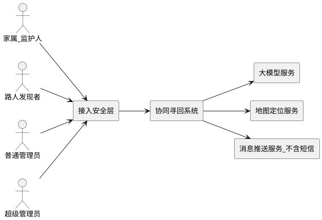
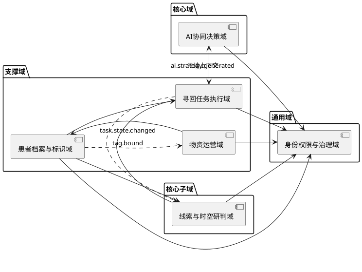
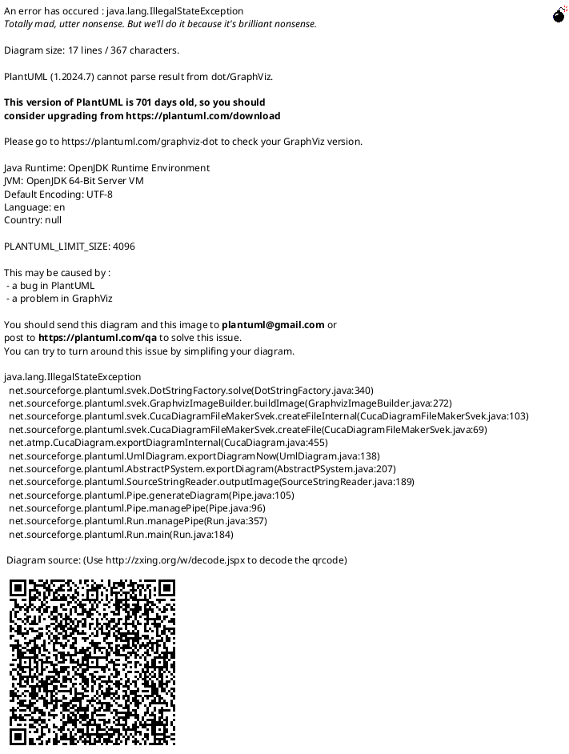
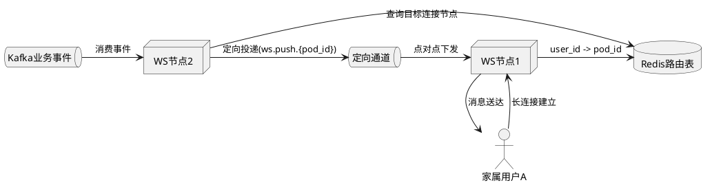

# 基于AI的阿尔兹海默症患者协同寻回系统
## 系统架构设计文档（SADD）

## 0. 文档信息

| 项目 | 内容 |
| :--- | :--- |
| 文档名称 | 系统架构设计文档（SADD） |
| 版本 | V1.0-R3（贯通重编排版） |
| 日期 | 2026-04-05 |
| 基线来源 | SRS_simplify.md（V1.0） |
| 文档定位 | 定义系统级架构能力、边界和约束，作为研发、测试、运维统一基线 |

> 本版目标：消除“补丁式拼接”，以单一主线串联业务、架构、一致性、运维与决策。

## 1. 文档定位与分层边界

### 1.1 本文回答的问题
1. 系统如何分层、分域、集成。
2. 关键链路如何保证一致性、可用性与可观测性。
3. 高并发和分布式异常下，系统如何避免级联故障。

### 1.2 与 LLD 的边界
- 本文保留：架构能力、职责边界、约束与验收口径。
- 本文不展开：SQL 语句、缓存键命名、算法步进、脚本实现参数。
- 具体实现细节统一下沉至 LLD 与编码规范。

### 1.3 全局硬约束（Hard Constraints）

| 编号 | 约束 |
| :--- | :--- |
| HC-01 | TASK 域是任务状态机唯一权威，AI 不得直接改写任务状态。 |
| HC-02 | 核心状态变更必须通过本地事务 + Outbox 发布。 |
| HC-03 | 写请求必须支持 `request_id` 幂等拦截。 |
| HC-04 | 全链路必须透传 `trace_id` 并可审计回放。 |
| HC-05 | WebSocket 多节点必须采用路由化精准下发，禁止全量广播。 |
| HC-06 | 通知链路不依赖外部短信能力，仅使用应用推送与站内通知。 |

## 2. 业务主线与架构目标

### 2.1 端到端主线
1. 家属建档并建立监护关系。
2. TASK 域发起寻回任务。
3. 路人通过匿名入口上报线索。
4. CLUE 域完成研判与时空处理，产出状态事件。
5. TASK 域收敛任务状态并触发通知。
6. AI 域输出策略建议，由 TASK 域决策采纳。
7. 任务闭环后完成轨迹归档与经验沉淀。
8. 全链路写审计并纳入可观测体系。

### 2.2 架构目标
- 目标 A：高并发下保持状态一致和事件可恢复。
- 目标 B：跨域协作不依赖高频同步 RPC。
- 目标 C：关键链路具备幂等、防乱序、防重放。
- 目标 D：异常可降级、故障可定位、数据可追责。

## 3. 总体架构

### 3.1 参与者与外部依赖

| 类型 | 实体 | 说明 |
| :--- | :--- | :--- |
| 业务角色 | 家属/监护人 | 建档、发起/关闭任务、查看进展、AI 对话、物资申领 |
| 业务角色 | 路人发现者 | 匿名线索上报 |
| 管理角色 | 普通管理员 | 复核、协查、工单处理、审计查询 |
| 管理角色 | 超级管理员 | 高危治理能力 |
| 外部系统 | 大模型服务 | 推理与生成 |
| 外部系统 | 地图定位服务 | 坐标与地理能力 |
| 外部系统 | 消息推送服务 | 应用推送触达（不含短信） |

### 3.2 上下文总览（PlantUML）

### 3.3 分层架构

| 层级 | 核心职责 | 关键约束 |
| :--- | :--- | :--- |
| 接入安全层 | 路由、鉴权透传、限流、幂等拦截 | 轻量化，不承载复杂业务状态机 |
| 应用层 | 用例编排、事务边界、跨域协调 | 不承载核心领域规则 |
| 领域层 | 聚合、状态机、领域服务 | 状态迁移必须走聚合根 |
| 事件与集成层 | Topic 解耦、Outbox 投递、Saga 协作 | 保证最终一致可证明 |
| 数据基础设施层 | 存储、缓存、消息、向量能力 | 选型必须与 SRS 口径一致 |
| 治理层 | 审计、追踪、监控、告警 | 全链路可观测与可追责 |

### 3.4 基础设施选型（架构层）

| 能力域 | 选型 | 架构要求 |
| :--- | :--- | :--- |
| 主数据与事务 | PostgreSQL 16 | 支撑核心业务事务与事件发布基线 |
| 时空计算 | PostGIS | 提供围栏与邻近判定能力 |
| 向量检索 | pgvector + HNSW | 支撑 RAG 低延迟召回 |
| 事件总线 | Kafka | 事件削峰、解耦、重试与重放 |
| 分布式缓存 | Redis + Lua | 幂等、配额、路由态与热数据 |
| 通知背板 | Redis Pub/Sub 或 Kafka Backplane | WebSocket 集群间消息转发 |
| 发号能力 | 全局序列服务 + 缓存消费层 | 保证短码序列唯一、单调、不回退 |

### 3.5 接入安全能力拆分

| 组件 | 主职责 |
| :--- | :--- |
| Security Gateway | 路由与策略执行 |
| Authentication Service | 验签、短码解码、重放校验 |
| Risk Service | CAPTCHA 与行为风控 |

## 4. 领域架构（DDD）与职责边界

### 4.1 六域映射

| 领域 | 定位 | 核心职责 |
| :--- | :--- | :--- |
| AI 协同决策域 | 核心域 | 策略计算、建议生成、会话能力（不直接改状态） |
| 线索与时空研判域 | 核心子域 | 线索接入、研判、围栏判定、轨迹处理 |
| 患者档案与标识域 | 支撑域 | 患者档案、关系与标签主数据 |
| 寻回任务执行域 | 支撑域 | 任务生命周期与状态收敛 |
| 物资运营域 | 支撑域 | 工单、发货、异常与闭环 |
| 身份权限与治理域 | 通用域 | 权限、审计、治理策略 |

### 4.2 域间协作（PlantUML）

### 4.3 领域权威约束
- TASK 域是状态唯一权威。
- AI 域仅产出建议事件，不直接改写业务状态。
- 跨域协作优先事件，不允许跨域直接写库。

### 4.4 线索域高并发拆分边界

### 4.5 围栏抑制跨域状态下发

| 机制 | 架构约束 |
| :--- | :--- |
| 状态下发 | TASK 迁移状态后发布 `task.state.changed`（含时序标识） |
| 缓存层级 | CLUE 采用 `L1` 本地缓存 + `L2` Redis 只读缓存 |
| 判定路径 | 先读 `L1`，未命中读 `L2`，禁止高频同步 RPC 拉 TASK |
| 防乱序 | 基于时序标识执行条件更新，禁止旧状态覆盖新状态 |
| 降级原则 | 仅当 `L1/L2` 同时不可用或均未命中才进入抑制分支 |

## 5. 事件驱动与一致性架构

### 5.1 接口契约基线

| 约束项 | 架构要求 |
| :--- | :--- |
| 幂等 | 写请求必须支持 `request_id` 幂等拦截 |
| 追踪 | 响应与日志必须携带 `trace_id` |
| 错误语义 | 业务错误与系统错误分层表达 |
| 防乱序 | 消费端必须阻止陈旧事件覆盖最新状态 |

补充：
- 幂等键空间与命名规范由 LLD 定义。
- 围栏判定链路必须依赖状态事件下发后的缓存态。

### 5.2 核心事件清单

| 事件 | 生产方 | 消费方 | 语义 |
| :--- | :--- | :--- | :--- |
| `clue.reported.raw` | Clue Intake | Spatial Analysis | 原始线索入站削峰，不走 Outbox |
| `clue.validated` | 线索服务 | 任务服务、AI服务 | 有效线索进入任务与策略链路 |
| `clue.suspected` | 线索服务 | 管理复核服务、任务服务 | 可疑线索进入人工复核分支并触发治理协同 |
| `track.updated` | 线索服务 | 任务服务、AI服务 | 轨迹增量更新 |
| `fence.breached` | 线索服务 | 任务服务 | 越界告警触发 |
| `task.state.changed` | 任务服务 | 线索服务 | 下发患者状态用于围栏抑制 |
| `task.created` | 任务服务 | 档案、AI、通知服务 | 任务启动 |
| `task.resolved` | 任务服务 | 档案、线索、通知、AI记忆 | 任务确认寻回闭环 |
| `task.false_alarm` | 任务服务 | 档案、线索、通知 | 误报关闭，不沉淀经验 |
| `ai.strategy.generated` | AI服务 | 任务服务 | 策略建议 |
| `ai.poster.generated` | AI服务 | 任务服务 | 海报异步回写 |
| `profile.created` | 档案服务 | AI向量化服务 | 新建档案后触发向量化初始化 |
| `tag.bound` | 档案服务 | 物资服务 | 标签绑定后驱动工单自动收敛 |
| `material.order.created` | 物资服务 | 管理端处理器 | 物资工单创建 |

### 5.3 Outbox 强一致投递模型

1. 状态变更与 Outbox 记录同一本地事务提交。
2. 事务提交后异步发布事件。
3. 投递失败进入重试与死信机制。
4. 消费端必须幂等并防乱序。
5. 消费端业务更新与本地幂等日志写入必须同事务提交。
6. Outbox 必须实施生命周期治理，防止表膨胀。

适用边界：
- Outbox 仅用于领域状态变更事件。
- Intake 原始事件先入 Kafka，再异步落库。

生命周期要求：
- Outbox 必须具备自动归档/清理机制。
- 清理必须错峰与限速，避免反压主库。
- DEAD 事件必须具备受控人工干预入口（诊断、修复、重放），且修复前分区闸门持续生效。
- 干预动作必须全量审计并可追溯（operator_user_id/operator_username、reason、trace_id、before_phase、after_phase）。

### 5.4 跨域长事务（Choreography Saga）
- 采用 Choreography，不引入中心编排器单点。
- 主链以 TASK 状态收敛为准。
- 子链路失败走补偿，不回滚主状态。

### 5.5 WebSocket 集群精准路由（防惊群）

约束：
- 禁止全节点 Global Topic 无差别广播。
- 必须先路由查询再定向下发。
- 路由缺失时降级到应用推送/站内通知。
- 路由心跳续期必须采用抖动窗口与阈值续期，禁止全连接同频写路由存储。
- 路由存储短暂不可用时，必须触发可观测降级并启用推送/站内通知兜底。

## 6. AI 架构

### 6.1 AI 执行边界
1. 组装上下文。
2. 执行检索增强。
3. 生成策略建议并发布事件。
4. 记录审计与可观测信息。

边界约束：
- AI 不拥有状态写入权。
- TASK 域决定建议采纳与状态推进。

Agent 执行分级（架构级）：

| 等级 | 执行语义 | 架构约束 |
| :--- | :--- | :--- |
| A0 | 自动观测 | 只读、聚合、预警，允许自动执行 |
| A1 | 智能助理 | 草稿与建议，写操作必须人工确认 |
| A2 | 受控执行 | 常规写操作可执行，要求 `CONFIRM_1` |
| A3 | 高风险执行 | 状态变更治理操作可执行，要求 `CONFIRM_2/3` |
| A4 | 人工专属 | 不可逆与合规敏感操作，`MANUAL_ONLY` |

硬边界：
1. `A4` 操作永不允许 Agent 自动执行。
2. 任何 AI 触发写操作必须通过策略门禁（Policy Guard）与审计链路。

### 6.2 RAG 路由约束
- 必须先注入患者维度隔离，再执行向量召回。
- 必须启用数据有效性过滤（失效/过期/替代数据不得召回）。
- 误报任务不得沉淀为可召回经验。
- 具体查询语句和索引参数由 LLD 定义。

### 6.3 AI 双账本配额

| 维度 | 架构要求 |
| :--- | :--- |
| 配额账本 | `user_id` 全局账本 + `patient_id` 全局账本 |
| 预占机制 | 原子预占并写入待确认记录 |
| 确认机制 | 推理完成后异步对账并确认 |
| 超时补偿 | 待确认超时必须自动回滚预占 |
| 崩溃恢复 | 网关重启后必须恢复未决配额状态 |

### 6.4 上下文窗口防护（Context Overflow Guard）

| 环节 | 架构要求 |
| :--- | :--- |
| Token 预估 | 推理前必须完成 Token 统计与阈值校验 |
| 超限处理 | 超限请求必须进入确定性截断流程 |
| 可审计性 | 必须记录截断前后规模与策略命中路径 |
| 失败语义 | 触发 `L2` 类错误并发布结构化事件 |

硬约束：
- 严禁将超出模型上下文窗口的 Payload 直接下发模型。

### 6.5 AI 失败语义分级

| 等级 | 语义 | 处理策略 |
| :--- | :--- | :--- |
| L1 | 物理链路失败 | 快速重试 + 熔断 |
| L2 | 推理逻辑失败 | 模板降级 |
| L3 | 工具链失败 | 降级动作 + 人工介入 |
| L4 | 内容安全阻断 | 强阻断 + 审计 |

### 6.6 Agent 执行策略门禁（Policy Guard）

1. 入站识别：`action_source`（USER/AI_AGENT）与 `agent_profile` 必须可识别。
2. 策略校验：角色权限、数据归属、执行模式、确认等级必须全部通过。
3. 预检查：支持 `dry_run`，仅校验不落副作用。
4. 失败语义：
  - 策略拒绝 -> `E_GOV_4039`
  - 确认等级不足 -> `E_GOV_4097`
  - 预检查失败 -> `E_GOV_4226`
  - 人工专属操作被 Agent 调用 -> `E_GOV_4231`
5. 审计要求：策略命中路径与拦截原因必须可回放。

### 6.7 Agent 能力包与 Function Calling 架构对齐

能力包开关（`sys_config.scope=ai_policy`）必须与 API 白名单同粒度：

| agent_profile | config_key |
| :--- | :--- |
| RescueCommander | `agent.capability.rescue.enabled` |
| ClueInvestigator | `agent.capability.clue.enabled` |
| GuardianCoordinator | `agent.capability.guardian.enabled` |
| MaterialOperator | `agent.capability.material.enabled` |
| AICaseCopilot | `agent.capability.ai_case.enabled` |
| GovernanceSentinel | `agent.capability.governance.enabled` |
| OutboxReliabilityAgent | `agent.capability.outbox_reliability.enabled` |

Agent 策略配置键（`sys_config.scope=ai_policy`）：

| config_key | 说明 |
| :--- | :--- |
| `agent.execution.max_level` | 允许执行上限（A0/A1/A2/A3） |
| `agent.confirmation.policy` | 确认级别策略映射 |
| `agent.manual_only.actions` | 人工专属接口白名单 |

说明：上述策略键与能力包开关键共同构成 `ai_policy` 作用域下的完整 Agent 治理键集。

Function Calling 的 `action` 必须命中白名单，并通过现有业务接口执行（禁止内部旁路写）：

| action | 目标接口 | 最低确认 | 约束 |
| :--- | :--- | :--- | :--- |
| `propose_close` | `POST /api/v1/rescue/tasks/{task_id}/close` | `CONFIRM_1` | 可执行 |
| `clue_override` | `POST /api/v1/clues/{clue_id}/override` | `CONFIRM_2` | 可执行 |
| `clue_reject` | `POST /api/v1/clues/{clue_id}/reject` | `CONFIRM_2` | 可执行 |
| `approve_material_order` | `PUT /api/v1/admin/material/orders/{order_id}/approve` | `CONFIRM_2` | 可执行 |
| `archive_session` | `POST /api/v1/ai/sessions/{session_id}/archive` | `CONFIRM_1` | 可执行 |
| `replay_outbox_dead` | `POST /api/v1/admin/super/outbox/dead/{event_id}/replay` | `CONFIRM_3` | 可执行 |
| `request_evidence` | `POST /api/v1/admin/clues/{clue_id}/request-evidence` | `MANUAL_ONLY` | 毕设版本暂不开放，仅可建议 |
| `force_close_task` | `POST /api/v1/admin/super/rescue/tasks/{task_id}/force-close` | `MANUAL_ONLY` | A4 动作，仅人工可执行 |

执行回执要求：
1. 若 action 执行成功，必须返回 `action_id`、`result_code`、`executed_at`。
2. 上述回执字段必须通过 AI 流式 `done` 事件透传，保证端到端可观测与可审计。

## 7. 数据与存储架构

### 7.1 概念实体基线

| 实体 | 核心属性 |
| :--- | :--- |
| 患者档案 | 基本信息、走失状态 |
| 监护关系 | 角色与关系状态 |
| 标签资产 | 标签状态与绑定关系 |
| 寻回任务 | 生命周期状态 |
| 线索记录 | 时空信息、有效性与复核状态 |
| 轨迹数据 | 聚合结果与窗口信息 |
| AI 会话与记忆 | 摘要、配额、记忆状态 |
| 审计日志 | 主体、动作、结果、追踪标识 |

### 7.2 时空与向量能力
- 时空能力：PostGIS + 标准坐标体系。
- 向量能力：pgvector + HNSW。
- 检索隔离：患者维度 + 数据有效性 + 版本约束。

### 7.3 短码能力
- 必须具备全局序列与短码映射能力。
- 必须保证主备切换后序列不回退、不重复。
- 发号必须采用“数据库序列真源 + 服务节点号段预取”模式，禁止纯随机短码。
- 节点故障后未消费号段必须可废弃，禁止回填导致短码碰撞。
- 必须定义短码发号灾备 Runbook（主备切换、水位校准、回退禁止）。
- 具体发号步长与映射算法由 LLD 定义。

### 7.4 Outbox 与本地幂等日志治理

| 对象 | 治理要求 |
| :--- | :--- |
| Outbox | 生命周期管理、防膨胀、可清理、可审计 |
| 本地幂等日志 | 唯一约束拦截重复消费 |
| 消费事务 | 业务更新与幂等日志同事务提交 |
| DEAD 干预 | 仅受控重放、保留分区闸门、全量审计 |

### 7.5 删除与归档策略
- 业务对象以状态迁移为主，不做随意物理删除。
- 审计日志追加写入，按周期归档。
- 历史数据清理应满足审计留存要求。

## 8. 安全、合规与审计

### 8.1 接入安全层职责

| 组件 | 主职责 |
| :--- | :--- |
| Security Gateway | 路由与策略执行 |
| Authentication Service | 验签、短码解码、重放校验 |
| Risk Service | 风控评分与挑战机制 |

### 8.2 安全控制基线
- 接入层统一鉴权与反重放。
- 高危操作必须二次确认并审计。
- 业务服务只接收已验证内部标识。

### 8.3 审计规范

| 维度 | 要求 |
| :--- | :--- |
| 审计范围 | 身份、档案、任务、线索、物资、AI 全链路 |
| 审计字段 | `operator_user_id`、`operator_username`、`object_id`、`action`、`result`、`risk_level`、`detail`、`trace_id`、`request_id`、`action_source`、`agent_profile`、`execution_mode`、`confirm_level`、`blocked_reason`、`action_id`、`result_code`、`executed_at` |
| 完整性 | 可检索、可回放、可归档，覆盖率必须 100% |

## 9. 非功能目标与运维基线

### 9.1 量化 SLO

| 指标项 | 目标值 | 口径 |
| :--- | ---: | :--- |
| 纯事务写链路延迟 | `TP99 <= 200 ms` | 状态变更与事务提交链路 |
| 含时空计算写链路延迟 | `TP99 <= 600 ms` | 含时空计算同步链路 |
| 线索上报吞吐 | 单节点峰值 `QPS >= 3000` | 入站削峰后的系统口径 |
| 跨域一致性时延 | `TP99 <= 3 s` | 事件发布到状态收敛 |
| 告警触达时延 | `TP99 <= 3 s` | WebSocket 主通道 + 降级通道 |
| 审计覆盖率 | `100%` | 关键动作不可缺失 |

### 9.2 部署建议
- 应用服务多副本无状态部署。
- PostgreSQL、Kafka、Redis 高可用部署。
- WebSocket 必须启用路由存储与定向下发通道。
- 安全能力组件必须独立伸缩与故障隔离。

### 9.3 可观测指标

| 维度 | 指标 |
| :--- | :--- |
| 接口层 | 成功率、P95/P99、错误码分布 |
| 事件层 | 积压、消费延迟、死信量、定向下发失败率 |
| 一致性层 | Outbox 待投递量、清理负载、幂等冲突率、收敛时延 |
| AI 层 | L1-L4 占比、配额对账偏差、上下文溢出拦截率 |
| 安全层 | 鉴权失败、风控命中、重放拦截 |

### 9.4 演练建议
1. WebSocket 多节点定向路由演练。
2. 幂等重放风暴演练。
3. Outbox 收敛与清理错峰演练。
4. AI 上下文超限防护演练。
5. DEAD 人工干预与分区闸门恢复演练。

## 10. 验收映射（SRS -> SADD）

| SRS 验收条目 | 架构落地点 |
| :--- | :--- |
| 闭环演示可完成 | 任务域 + 线索域 + AI 域 + 审计治理 |
| 路人匿名可上报 | 接入安全层 + Intake 削峰 |
| 无重复进行中任务 | 幂等拦截 + 状态机约束 |
| 存疑线索可闭环 | 复核分支 + 任务收敛 |
| 误报不污染经验 | `task.false_alarm` 语义约束 |
| 物资自动闭环 | `tag.bound` 事件驱动 |
| 关键操作可追溯 | `trace_id` + 审计规范 |

## 11. 风险与演进策略

| 风险点 | 当前策略 | 演进方向 |
| :--- | :--- | :--- |
| Outbox 膨胀拖慢主库 | 生命周期治理 + 错峰清理 | 分层存储与冷热归档 |
| 消费幂等跨存储不一致 | 本地幂等日志同事务提交 | 幂等治理 SDK 化 |
| Intake 与 Outbox I/O 冲突 | 原始事件先入 Kafka | 分层容量与回压治理 |
| 围栏跨域状态依赖 | `task.state.changed` + L1/L2 缓存 | 状态快照预热与回补 |
| CLUE 冷启动缓存穿透 | 双层缓存与冷启动保护 | 快照回放与自动预热 |
| 短码发号漂移风险 | 全局序列真源 + 缓存消费 | 分片号段与多活治理 |
| WebSocket 惊群效应 | 路由查询 + 定向下发 | 分片路由与多背板容灾 |
| DEAD 长驻阻塞分区 | 分区闸门 + 人工修复重放 | 干预自动化与审计编排 |
| AI 上下文溢出 | Token 预估 + 截断防线 | 上下文压缩与记忆分层 |
| 配额确认丢失 | 待确认超时回滚 | 跨日自动对账修复 |
| 物资链路遗漏 | `tag.bound` 自动收敛 | 异常回放与人工补偿 |

## 12. 实施落地检查清单

1. 是否落实 TASK 状态权威与 AI 建议边界。
2. 是否实现 Outbox 同事务发布与重试补偿。
3. 是否实现消费端本地幂等日志同事务提交。
4. 是否实现事件防乱序覆盖能力。
5. 是否区分 Intake 原始事件与领域状态变更事件。
6. 是否落地 `task.state.changed` 状态下发与 L1/L2 缓存。
7. 是否落地短码全局序列能力并保证不回退。
8. 是否启用 AI 双账本配额与超时回滚。
9. 是否启用上下文超限阻断与确定性截断。
10. 是否完成 WebSocket 路由查询后的定向下发。
11. 是否启用 Outbox 生命周期清理并验证不反压主库。
12. 是否接入 L1-L4 失败语义监控与告警分流。
13. 是否验证 `tag.bound` 驱动物资自动闭环。
14. 是否完成多节点路由、幂等风暴、Outbox 收敛联合演练。

## 13. 结论

本架构已形成“主线清晰、边界明确、事件一致性可证明、运行稳定性可治理”的统一工程基线，可直接用于研发、测试、运维与答辩协同。

## 14. Architecture Decision Records（ADR）

### 14.1 ADR 索引

| ADR 编号 | 决策主题 | 状态 |
| :--- | :--- | :--- |
| ADR-001 | 为什么选择 Choreography Saga | Accepted |
| ADR-002 | 为什么 AI 不拥有状态权威 | Accepted |
| ADR-003 | 为什么使用 pgvector 而非外部向量数据库 | Accepted |
| ADR-004 | 为什么采用 Outbox 而非 CDC-only | Accepted |
| ADR-005 | 为什么 A4 操作必须 MANUAL_ONLY | Accepted |

### 14.2 ADR-001 为什么选择 Choreography Saga

| 维度 | 内容 |
| :--- | :--- |
| 背景 | 多域协作链路长，中心编排器易形成单点瓶颈。 |
| 决策 | 采用 Choreography，以事件协作实现最终一致。 |
| 影响 | 提升解耦与扩展性，补偿治理复杂度上升。 |
| 回看条件 | 当补偿分支复杂度持续上升时评估局部编排器。 |

### 14.3 ADR-002 为什么 AI 不拥有状态权威

| 维度 | 内容 |
| :--- | :--- |
| 背景 | AI 输出非确定性，不适合承担状态机写入权。 |
| 决策 | TASK 域保持状态权威，AI 仅发布建议事件。 |
| 影响 | 状态一致性更强，但需采纳规则与审计闭环。 |
| 回看条件 | 模型可验证能力显著提升后再评估授权边界。 |

### 14.4 ADR-003 为什么使用 pgvector 而非外部向量数据库

| 维度 | 内容 |
| :--- | :--- |
| 背景 | 检索与业务隔离、有效性过滤、审计链路强耦合。 |
| 决策 | 当前阶段采用 pgvector 同库检索。 |
| 影响 | 一致性与运维成本更优，超大规模弹性相对受限。 |
| 回看条件 | 当容量或延迟长期超 SLO 时评估混合架构。 |

### 14.5 ADR-004 为什么采用 Outbox 而非 CDC-only

| 维度 | 内容 |
| :--- | :--- |
| 背景 | 关键业务要求“状态提交与事件发布”一致性可证明。 |
| 决策 | Outbox 作为发布基线，提交后异步投递。 |
| 影响 | 消除幽灵事件风险，增加投递与清理治理成本。 |
| 回看条件 | 当平台原生事务事件能力可替代时再评估。 |

### 14.6 ADR-005 为什么 A4 操作必须 MANUAL_ONLY

| 维度 | 内容 |
| :--- | :--- |
| 背景 | 超管导出、日志清理、强制闭环等操作具备不可逆或强合规属性。 |
| 决策 | 将该类动作定义为 `A4`，仅允许人工页面触发，Agent 仅可给建议与预检。 |
| 影响 | 降低自动化误操作与越权风险，增加人工确认成本。 |
| 回看条件 | 当法规、审计自动化能力与二人复核机制成熟后再评估。 |
