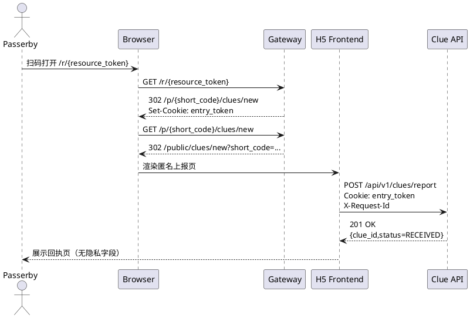

# 基于AI Agent的阿尔兹海默症患者协同寻回系统
## 路人 H5 前端开发手册（Vue + TypeScript）

## 0. 文档信息

| 项目 | 内容 |
| :--- | :--- |
| 文档名称 | 路人 H5 前端开发手册（Vue + TypeScript） |
| 版本 | V1.0 |
| 日期 | 2026-04-07 |
| 输入基线 | SRS_simplify.md、SADD_from_SRS_simplify.md、LLD_from_SRS_SADD.md、API_from_SRS_SADD_LLD.md、backend_handbook.md |
| 适用对象 | H5 前端开发、测试、联调、安全评审 |

说明：
1. 本手册仅覆盖匿名路人 H5 链路，不包含 Android 原生与 Web 管理端页面。
2. 接口字段、鉴权边界、错误码以上游 API 文档为准，本手册定义前端落地方式。
3. 匿名链路必须遵守最小暴露原则：不返回患者隐私信息，不持久化敏感凭据。
4. 通知能力不依赖短信；路人端仅展示受理回执，不参与任务通知触达编排。
5. 本手册以手机端浏览器为主要适配目标，桌面端仅作为联调与应急访问兜底，不作为验收主口径。

## 1. 目标与范围

### 1.1 目标

1. 基于基线文档给出可直接落地的路人 H5 实施规范，减少联调偏差。
2. 固化匿名链路关键约束：`resource_token -> entry_token -> clue report`。
3. 保证风控与可观测闭环：频控、冷却、`trace_id/request_id` 全链路可追踪。
4. 以“最小可用复杂度”交付：先确保核心上报链路稳定，再按需启用增强能力。

### 1.2 范围

1. 前端工程架构（Vue 3 + TypeScript + Vite）。
2. 匿名路由、接口契约、错误分层处理与重试策略。
3. 页面布局、移动端交互、字段级校验与空态/错误态规范。
4. 本地持久化、隐私约束、离线与弱网容错。
5. 联调矩阵、测试门禁、发布与回滚。

### 1.3 终端适配边界（手机优先）

| 终端类型 | 策略 | 说明 |
| :--- | :--- | :--- |
| 手机浏览器 | 主适配（验收口径） | iOS Safari、Android Chrome、主流内置 WebView |
| 微信内置浏览器 | 主适配（验收口径） | 视作手机 WebView，同步验证扫码与表单链路 |
| 平板浏览器 | 兼容适配（非主验收） | 使用手机布局放大策略，不单独设计平板信息架构 |
| 桌面浏览器 | 降级可用（非验收） | 保障可访问与可提交，不承诺完整触控体验 |

### 1.4 路人 H5 页面范围（7 页）

| 页面 ID | 页面名称 | 路由 |
| :--- | :--- | :--- |
| PUB-01 | 扫码解析中转页 | `/scan/resolve` |
| PUB-02 | 手动录入页 | `/manual-entry` |
| PUB-03 | 匿名普通线索上报页 | `/public/clues/new` |
| PUB-04 | 匿名紧急上报页 | `/public/emergency/report` |
| PUB-05 | 匿名上报回执页 | `/public/clues/receipt` |
| PUB-06 | 无效标签拦截页 | `/public/invalid` |
| PUB-07 | 风控冷却提示页 | `/public/rate-limit` |

### 1.5 需求追踪矩阵（SRS -> H5）

| SRS 需求 | H5 落地点 |
| :--- | :--- |
| FR-CLUE-001 匿名上报 | `PUB-03/PUB-04 + POST /api/v1/clues/report` |
| FR-CLUE-002 扫码 + 短码兜底 | `GET /r/{resource_token}` + `PUB-02` |
| FR-CLUE-003 短码+口令+人机校验 | `PUB-02 + POST /api/v1/public/clues/manual-entry` |
| FR-CLUE-008 扫码动态路由 | 网关 302 到 `/p/{short_code}/...` 后进入对应 H5 页面 |
| BR-001 匿名链路不强制注册 | 全链路无账号登录态 |
| BR-007 作废标签不得进入紧急链路 | `PUB-06` 拦截，禁止进入 `PUB-04` |
| BR-010 关键操作可追踪 | 统一 `X-Trace-Id`、`X-Request-Id`、前端埋点 |

### 1.6 统一入口目标（扫码与 NFC）

1. 路人扫码必须直接打开网站统一入口：`https://<h5-domain>/r/{resource_token}`。
2. 后续扩展 NFC 时，NFC 标签写入同一入口 URL，感应后同样直接打开：`https://<h5-domain>/r/{resource_token}`。
3. `resource_token` 作为载体无关标识（QR/NFC 共用），后续业务路由复用 `GET /r/{resource_token}` 动态分流。
4. 当前版本先交付二维码直达；NFC 作为 VNext 能力预留，不改变现有 H5 页面与 API 契约。

## 2. 技术栈与第三方库策略

### 2.1 基础栈

| 类别 | 选型 | 说明 |
| :--- | :--- | :--- |
| 语言 | TypeScript 5.x | 全量 TS，禁止核心业务逻辑退化为 JS |
| 框架 | Vue 3.5+ | 组合式 API + `<script setup>` |
| 构建 | Vite 6.x | H5 快速打包，支持多环境配置 |
| 目标终端 | Mobile First | 主要覆盖手机浏览器与手机 WebView |
| 路由 | Vue Router 4.x | 路由守卫 + 查询参数校验 |
| 状态 | Pinia 3.x | 匿名会话态、页面态、风控态 |
| 网络 | Axios 1.x | 统一拦截器、超时、错误码映射 |
| 请求编排 | @tanstack/vue-query | 请求状态、重试、缓存治理 |

### 2.2 UI 与地图能力

| 类别 | 选型 | 使用边界 |
| :--- | :--- | :--- |
| 移动 UI | Vant 4.x | 表单、弹层、通知条、按钮 |
| 图标 | @iconify/vue | 统一图标库 |
| 样式 | UnoCSS + SCSS | 原子样式 + 主题令牌 |
| 地图 | AMap JS API 2.x | 定位与点位拾取（来源坐标 `GCJ-02`） |
| 手势 | @vueuse/gesture（可选） | 地图手势冲突处理 |

### 2.3 推荐第三方库（按需启用）

| 能力域 | 推荐库 | 目的 |
| :--- | :--- | :--- |
| 运行时校验 | zod | 入参/响应运行时校验 |
| 时间处理 | dayjs | 冷却倒计时、时间格式化 |
| 工具函数 | lodash-es | 防抖、节流、深拷贝 |
| 本地数据库 | idb | IndexedDB 封装 |
| 异常采集 | @sentry/vue | 前端异常 + 性能追踪 |
| E2E 测试 | Playwright | 核心匿名链路自动化回归 |
| Mock | msw | 联调前契约模拟 |

治理规则：
1. 允许引入第三方库，但必须通过 `adapter` 封装，页面不直接耦合库实现。
2. 新库引入需提供替代方案与回滚计划。
3. 默认最小可用集上线，后续按压测与业务复杂度逐步增强。

## 3. 工程结构（推荐）

```text
public-h5/
  src/
    app/
      main.ts
      App.vue
      router/
      guards/
      providers/
    core/
      api/                 # axios 实例、拦截器、错误映射
      auth/                # 匿名会话态（非账号体系）
      risk/                # 频控、冷却、重试策略
      location/            # 坐标采集与转换声明
      storage/             # sessionStorage + IndexedDB 封装
      telemetry/           # 埋点与日志
      constants/
      types/
    modules/
      scan-resolve/        # PUB-01
      manual-entry/        # PUB-02
      clue-normal/         # PUB-03
      clue-emergency/      # PUB-04
      clue-receipt/        # PUB-05
      invalid-tag/         # PUB-06
      rate-limit/          # PUB-07
    shared/
      components/
      composables/
      utils/
      styles/
```

## 4. API 核心契约

### 4.1 全局 Header 与响应契约

| 维度 | 规则 |
| :--- | :--- |
| Trace | 每个请求必须携带 `X-Trace-Id`，用于跨层排障 |
| 幂等 | 所有写请求必须携带 `X-Request-Id`，避免重复提交 |
| 匿名鉴权 | 浏览器场景依赖 HttpOnly Cookie `entry_token` 自动携带 |
| 统一响应 | `{ message, code, data, trace_id }` |

前端强约束：
1. 不在 URL、LocalStorage、日志中写入 `entry_token`。
2. 不通过 JavaScript 尝试写入或读取 HttpOnly Cookie。
3. 所有错误展示需同时保留业务码，便于客服与联调定位。

### 4.2 匿名凭据约束（浏览器场景）

1. `GET /r/{resource_token}` 成功后由网关通过 `Set-Cookie` 下发 `entry_token`（`HttpOnly; Secure; SameSite=Strict; Max-Age<=120`）。
2. `GET /p/{short_code}/clues/new`、`GET /p/{short_code}/emergency/report` 依赖该 Cookie 完成入口鉴权。
3. 浏览器 H5 不主动设置 `X-Anonymous-Token`；该头主要用于非浏览器端。
4. 若服务端返回 `HTTP 401 + E_CLUE_4012`，视为匿名凭据失效，必须引导重新扫码或重新手动录入。

### 4.3 Axios 实现模板

```ts
import axios from 'axios';
import { v4 as uuidv4 } from 'uuid';

export const http = axios.create({
  baseURL: '/',
  timeout: 10000,
  withCredentials: true,
});

http.interceptors.request.use((config) => {
  config.headers['X-Trace-Id'] = `trc_${Date.now()}_${uuidv4()}`;
  if (['post', 'put', 'patch', 'delete'].includes((config.method ?? '').toLowerCase())) {
    config.headers['X-Request-Id'] = `req_${Date.now()}_${uuidv4()}`;
  }
  return config;
});

http.interceptors.response.use(
  (res) => res,
  (error) => {
    const status = error?.response?.status;
    const code = error?.response?.data?.code;

    if (status === 401 && code === 'E_CLUE_4012') {
      window.dispatchEvent(new CustomEvent('anon-token-invalid'));
    }

    if (status === 429 && ['E_GOV_4291', 'E_GOV_4292'].includes(code)) {
      const retryAfter = Number(error?.response?.headers?.['retry-after'] ?? 30);
      window.dispatchEvent(new CustomEvent('anon-rate-limited', { detail: { retryAfter, code } }));
    }

    return Promise.reject(error);
  },
);
```

### 4.4 路人 H5 API 核心清单

#### 4.4.1 统一入口（扫码/NFC）与动态路由

> 注意：以下 `/r/{resource_token}` 与 `/p/{short_code}/*` 均为**网关级重定向路由**（302 跳转），不是 REST 业务接口。实际线索提交走 §4.4.2 中的 `POST /api/v1/clues/report`。

| 方法 | 完整路径 | 用途 | 成功断言 | 失败断言 |
| :--- | :--- | :--- | :--- | :--- |
| GET | `/r/{resource_token}` | 扫码入口验签并动态路由 | `HTTP 302` + `Set-Cookie: entry_token` | `HTTP 400 E_MAT_4002` / `HTTP 404 E_CLUE_4041` / `HTTP 422 E_MAT_4223` |
| GET | `/p/{short_code}/clues/new` | 网关重定向：普通匿名上报 | `HTTP 302` 到 `/public/clues/new?short_code=...` | `HTTP 400 E_CLUE_4005` / `HTTP 401 E_CLUE_4012` / `HTTP 404 E_CLUE_4042` |
| GET | `/p/{short_code}/emergency/report` | 网关重定向：紧急匿名上报 | `HTTP 302` 到 `/public/emergency/report?short_code=...` | `HTTP 400 E_REQ_4001` |

说明：
1. 二维码与后续 NFC 感应都应先进入 `/r/{resource_token}`，再由网关统一分流。
2. 不允许为 NFC 额外新增匿名页面路由，避免双链路分叉。

#### 4.4.2 手动兜底与匿名上报

| 方法 | 完整路径 | 用途 | 成功断言 | 失败断言 |
| :--- | :--- | :--- | :--- | :--- |
| POST | `/api/v1/public/clues/manual-entry` | 短码+口令+验证码兜底 | `HTTP 201 + code=OK`，响应含 `manual_entry_token` | `HTTP 400 E_CLUE_4005/E_CLUE_4006/E_GOV_4004`，`HTTP 403 E_GOV_4038`，`HTTP 429 E_GOV_4291/E_GOV_4292` |
| POST | `/api/v1/clues/report` | 匿名线索上报 | `HTTP 201 + code=OK + status=RECEIVED` | `HTTP 400 E_CLUE_4001/4002/4003/4004/4007`，`HTTP 401 E_CLUE_4012`，`HTTP 404 E_CLUE_4041` |

### 4.5 错误码分层处理

| 层级 | 代表错误码 | 前端动作 |
| :--- | :--- | :--- |
| 参数层 | `E_CLUE_4001/4002/4003/4004/4005/4006/4007` | 字段级提示 + 保留草稿 |
| 鉴权层 | `E_CLUE_4012` | 清理临时页面态，回到扫码/手动录入入口 |
| 可见性层 | `E_CLUE_4041/E_CLUE_4042` | 跳转 `PUB-06`，提示标签不可用 |
| 风控层 | `E_GOV_4291/E_GOV_4292` | 跳转 `PUB-07` 或弹层倒计时，禁用提交 |
| 治理层 | `E_GOV_4038` | 提示校验失败并限制重试频次 |

## 5. 路由设计

### 5.1 路由树（前端可见）

```text
/
├─ /scan/resolve                     # PUB-01
├─ /manual-entry                     # PUB-02
├─ /public/clues/new                # PUB-03
├─ /public/emergency/report         # PUB-04
├─ /public/clues/receipt            # PUB-05
├─ /public/invalid                  # PUB-06
└─ /public/rate-limit               # PUB-07
```

### 5.2 网关跳转到 H5 的入口映射

| 扫码结果 | 网关中间路由 | 前端落地路由 |
| :--- | :--- | :--- |
| `BOUND` | `/p/{short_code}/clues/new` | `/public/clues/new?short_code={short_code}` |
| `LOST` | `/p/{short_code}/emergency/report` | `/public/emergency/report?short_code={short_code}` |
| `UNBOUND/ALLOCATED/VOID` | 无效页 | `/public/invalid?reason={code}` |

### 5.3 统一入口规范（二维码与 NFC）

| 载体 | 当前状态 | 入口 URL 规范 | 说明 |
| :--- | :--- | :--- | :--- |
| QR 二维码 | 已上线 | `https://<h5-domain>/r/{resource_token}` | 路人扫码后直接打开网站 |
| NFC 标签 | 后续扩展 | `https://<h5-domain>/r/{resource_token}` | 路人感应后直接打开同一网站 |

约束：
1. 统一入口域名必须可配置（如 `PUBLIC_ENTRY_BASE_URL`），支持多环境切换。
2. 任何载体都不得直达 `/public/*` 页面，必须经过 `/r/{resource_token}` 验签与路由。
3. 若终端不支持自动拉起浏览器，需展示“点击打开网站”兜底按钮。

### 5.4 Route Meta 规范

| 字段 | 类型 | 说明 |
| :--- | :--- | :--- |
| `requiresShortCode` | boolean | 页面是否要求 `short_code` |
| `allowAnonymousOnly` | boolean | 路由仅允许匿名链路访问 |
| `riskControlled` | boolean | 是否受风控冷却门禁影响 |
| `analyticsPageId` | string | 埋点页面标识（`PUB-*`） |

### 5.5 路由守卫示例

```ts
router.beforeEach((to, _from, next) => {
  const shortCode = String(to.query.short_code ?? '');

  if (to.meta.requiresShortCode && !/^[A-Z0-9]{6}$/.test(shortCode)) {
    return next({ path: '/public/invalid', query: { reason: 'SHORT_CODE_INVALID' } });
  }

  if (to.meta.riskControlled && riskStore.isCoolingDown) {
    return next({ path: '/public/rate-limit' });
  }

  return next();
});
```

## 6. 本地信息持久化设计

### 6.1 存储分层

| 层级 | 介质 | 存储内容 | TTL |
| :--- | :--- | :--- | :--- |
| 页面临时态 | 内存（Pinia） | loading、校验状态、倒计时 | 页面生命周期 |
| 草稿态 | `sessionStorage` | 描述、图片 URL、坐标草稿 | <= 30 分钟 |
| 弱网重试队列 | IndexedDB | 待重试请求快照（脱敏） | <= 120 秒 |

### 6.2 键命名规范

| Key | 说明 |
| :--- | :--- |
| `h5:clue:draft:{short_code}` | 普通/紧急上报草稿 |
| `h5:manual-entry:cooldown:{short_code}` | 短码连续失败冷却信息 |
| `h5:report:retry-queue` | 匿名上报短时重试队列 |

### 6.3 强制禁止持久化项

1. 禁止存储 `entry_token`、`manual_entry_token`、`pin_code`、`captcha_token`。
2. 禁止在客户端日志中输出完整 `resource_token` 与患者标识。
3. 禁止长期缓存精确定位历史；仅保留当前上报必需坐标。

### 6.4 IndexedDB 最小模型（弱网重试）

| 表 | 字段 | 说明 |
| :--- | :--- | :--- |
| `submission_journal` | `request_id`、`created_at`、`status` | 上报请求执行轨迹 |
| `submission_payload` | `request_id`、`short_code`、`payload_hash`、`payload` | 脱敏请求快照 |

约束：
1. `entry_token` TTL 短，重试仅允许在 120 秒窗口内执行。
2. 超过窗口必须废弃队列并提示用户重新扫码。

## 7. 页面布局与样式规范

### 7.1 移动端布局基线

1. 设计稿宽度按 375 适配，兼容 320-430。
2. 顶部固定风险提示条，底部固定主操作按钮。
3. 关键动作按钮最小触控区不低于 `44px`。
4. 适配安全区：`env(safe-area-inset-top)`、`env(safe-area-inset-bottom)`。
5. 首选竖屏交互；横屏仅保证可访问，不作为主流程验收口径。
6. 输入场景需处理软键盘顶起，主按钮与错误提示不得被遮挡。

### 7.2 主题令牌（建议）

| 令牌 | 值 | 语义 |
| :--- | :--- | :--- |
| `--h5-color-primary` | `#1f6feb` | 普通链路主色 |
| `--h5-color-danger` | `#d93025` | 紧急链路主色 |
| `--h5-color-warning` | `#f9ab00` | 风控与校验告警 |
| `--h5-color-success` | `#1a7f37` | 受理成功回执 |
| `--h5-color-text` | `#1f2328` | 正文文本 |
| `--h5-color-muted` | `#6e7781` | 次级文本 |

### 7.3 文案与反馈规范

1. 错误提示优先“可执行动作”文案，例如“请重新扫码后再提交”。
2. 紧急页面文案必须突出“立即上报”语义，不允许弱化风险等级。
3. 回执页只展示受理信息，不显示患者身份信息。

### 7.4 手机端交互与性能基线

1. 单手优先：高频操作区放在屏幕下半区，危险操作需二次确认。
2. 触控反馈：按钮按下态在 100ms 内可感知，避免重复点击。
3. 首屏性能：4G 网络下首屏可交互时间目标 <= 3 秒。
4. 提交反馈：提交后 300ms 内必须出现加载态或禁用态。
5. 弱网兜底：请求超时后提供“重试”与“返回入口”双动作。

## 8. 页面交互逻辑（7 页）

### 8.1 页面与 API 映射

| 页面 ID | 页面名称 | 关键 API |
| :--- | :--- | :--- |
| PUB-01 | 扫码解析中转页 | `GET /r/{resource_token}` |
| PUB-02 | 手动录入页 | `POST /api/v1/public/clues/manual-entry` |
| PUB-03 | 匿名普通线索上报页 | `GET /p/{short_code}/clues/new`、`POST /api/v1/clues/report` |
| PUB-04 | 匿名紧急上报页 | `GET /p/{short_code}/emergency/report`、`POST /api/v1/clues/report` |
| PUB-05 | 匿名上报回执页 | 上报成功响应承接 |
| PUB-06 | 无效标签拦截页 | 扫码/入口失败承接 |
| PUB-07 | 风控冷却提示页 | `429 + Retry-After` 承接 |

### 8.2 PUB-01 扫码解析中转页

1. 从扫码 URL 或 NFC 打开 URL 提取 `resource_token` 后请求 `GET /r/{resource_token}`。
2. 成功依赖网关 302 自动跳转，不在前端二次拼接业务路由。
3. 失败时根据错误码跳转 `PUB-06` 或 `PUB-07`。

### 8.3 PUB-02 手动录入页

1. 字段：`short_code`、`pin_code`、`captcha_token`、`device_fingerprint`。
2. 提交成功后不展示 `manual_entry_token`，只执行“继续上报”路由。
3. 命中 `429` 时记录 `Retry-After`，禁用提交并显示倒计时。

### 8.4 PUB-03 匿名普通线索上报页

1. 必填：`tag_code`、`coord_system`、`location.lat`、`location.lng`。
2. 可选：`description`、`photo_url`。
3. 浏览器 `navigator.geolocation` API 返回的坐标为 `WGS84`；若调用高德 JS API 获取定位则为 `GCJ-02`。前端必须根据实际定位源正确声明 `coord_system`，网关负责转换为 WGS84 后入库。
3. 提交成功跳转 `PUB-05`，并清空草稿缓存。
4. `E_CLUE_4012` 时提示匿名凭据失效并返回入口页。

### 8.5 PUB-04 匿名紧急上报页

1. 与 `PUB-03` 共享提交接口，但 UI 使用紧急语义（主按钮与提示色切换为 danger）。
2. 强制优先展示定位区与一键提交按钮，减少操作路径。
3. 失败重试逻辑与 `PUB-03` 一致，但重试提示文案更直接。

### 8.6 PUB-05 匿名上报回执页

1. 展示字段：`clue_id`、`status=RECEIVED`、`reported_at`。
2. 不展示任何患者身份字段。
3. 页面保留“继续协助上报”与“返回首页”两个动作。

### 8.7 PUB-06 无效标签拦截页

1. 承接 `UNBOUND/ALLOCATED/VOID`、`404`、短码非法等情况。
2. 根据 `reason` 显示差异化提示文案。
3. 仅提供“重新扫码”与“手动录入”入口，不允许继续提交线索。

### 8.8 PUB-07 风控冷却提示页

1. 显示剩余秒数、触发原因（`E_GOV_4291` 或 `E_GOV_4292`）。
2. 到期后自动恢复可提交状态。
3. 冷却期间禁用所有上报提交动作。

## 9. 字段级页面约束表（7 页逐页联调版）

### 9.1 PUB-01 扫码解析中转页

| 字段/区域 | 交互约束 | 校验规则 | 错误码/状态断言 | 空态/异常态 |
| :--- | :--- | :--- | :--- | :--- |
| `resource_token` | 首屏自动解析并发起请求 | 非空，Base64URL 形式 | `HTTP 400 + E_MAT_4002` | 展示“二维码无效”并引导重扫 |
| 跳转控制 | 仅接受后端 302 结果 | 不允许前端自行猜测标签状态 | `HTTP 302` 必须有 `Location` | 缺失 `Location` 视为网关异常 |
| 会话建立 | 依赖 `Set-Cookie` | 前端不可读写 Cookie | 若后续 401 判定会话失败 | 跳 `PUB-06` |

### 9.2 PUB-02 手动录入页

| 字段 | 控件 | 必填 | 校验规则 | 失败断言 |
| :--- | :--- | :---: | :--- | :--- |
| `short_code` | 文本输入 | 是 | `^[A-Z0-9]{6}$` | `HTTP 400 + E_CLUE_4005` |
| `pin_code` | 密码输入 | 是 | 固定 6 位数字 | `HTTP 400 + E_CLUE_4006` |
| `captcha_token` | 人机校验组件 | 是 | 必须存在且未过期 | `HTTP 403 + E_GOV_4038` |
| `device_fingerprint` | 隐式采集 | 是 | 长度 16-128 | `HTTP 400 + E_GOV_4004` |
| 提交按钮 | 主操作按钮 | - | 冷却中禁用 | `HTTP 429 + E_GOV_4291/E_GOV_4292` |

### 9.3 PUB-03 匿名普通线索上报页

| 字段 | 控件 | 必填 | 校验规则 | 失败断言 |
| :--- | :--- | :---: | :--- | :--- |
| `tag_code` | 文本输入/只读回填 | 是 | 长度 8-100，且与匿名凭据绑定一致 | `HTTP 400 + E_CLUE_4001/4002` |
| `coord_system` | 枚举选择 | 是 | `WGS84/GCJ-02/BD-09` | `HTTP 400 + E_CLUE_4007` |
| `location.lat/lng` | 地图选点 | 是 | 合法范围 | `HTTP 400 + E_CLUE_4003/4004` |
| `description` | 多行输入 | 否 | `<= 2000` | 超长前端拦截 |
| `photo_url` | 上传回填 | 否 | 白名单域名 | `HTTP 400 + E_CLUE_4004` |
| 提交动作 | 主按钮 | - | 防抖 + 幂等 `X-Request-Id` | `HTTP 401 + E_CLUE_4012` |

### 9.4 PUB-04 匿名紧急上报页

| 字段/区域 | 交互约束 | 校验规则 | 失败断言 | 空态/异常态 |
| :--- | :--- | :--- | :--- | :--- |
| 紧急提示条 | 首屏必显 | 文案强调“立即上报” | - | 文案加载失败使用本地兜底 |
| 定位区 | 首屏上半区优先 | 坐标必填 | `HTTP 400 + E_CLUE_4003/4004/4007` | 定位失败可手动选点 |
| 快速描述 | 快捷标签可选 | 最终合成文案 `<=2000` | 超长前端截断 | 允许空描述 |
| 一键上报 | 主按钮固定底部 | 风控冷却时禁用 | `HTTP 429 + E_GOV_4291/4292` | 跳 `PUB-07` |

### 9.5 PUB-05 匿名上报回执页

| 字段 | 展示规则 | 断言 |
| :--- | :--- | :--- |
| `clue_id` | 必显，支持复制 | 来源 `POST /api/v1/clues/report` 成功响应 |
| `status` | 固定展示 `RECEIVED` | 不映射为持久化终态，仅代表受理回执 |
| `reported_at` | 本地时区格式化展示 | 为空时展示 `--` 并记录日志 |
| 隐私字段 | 一律不展示 | 响应中即便包含也不渲染 |

### 9.6 PUB-06 无效标签拦截页

| 场景 | 触发条件 | 页面动作 |
| :--- | :--- | :--- |
| 未绑定标签 | `UNBOUND` | 提示“标签未绑定，暂不可上报” |
| 已分配未绑定 | `ALLOCATED` | 提示“标签待绑定，请联系监护人” |
| 已作废标签 | `VOID` | 提示“标签已作废，请重新确认标签” |
| 不可见资源 | `HTTP 404 + E_CLUE_4041/E_CLUE_4042` | 提示“入口无效或已失效” |

### 9.7 PUB-07 风控冷却提示页

| 字段/区域 | 规则 | 断言 |
| :--- | :--- | :--- |
| `retry_after` | 优先取响应头 `Retry-After` | 缺失时默认 30 秒 |
| 冷却倒计时 | 每秒刷新 | 归零后恢复可提交流程 |
| 重试入口 | 冷却结束才可点击 | 冷却中点击必须拦截 |
| 风控原因 | 展示业务码 | `E_GOV_4291` 与 `E_GOV_4292` 文案区分 |

## 10. 前端状态机守卫

### 10.1 匿名凭据状态机

| 当前状态 | 事件 | 下一状态 | 客户端动作 |
| :--- | :--- | :--- | :--- |
| `INIT` | 扫码成功并 302 | `TOKEN_READY` | 等待网关 Cookie 生效 |
| `TOKEN_READY` | 打开上报页 | `FORM_READY` | 允许输入与提交 |
| `FORM_READY` | 提交成功 | `CONSUMED` | 跳回执页并清草稿 |
| `FORM_READY` | `401 E_CLUE_4012` | `EXPIRED` | 提示失效，返回入口 |
| `EXPIRED` | 重新扫码/手动录入成功 | `TOKEN_READY` | 重建匿名会话 |

### 10.2 上报提交流程状态机

| 当前状态 | 事件 | 下一状态 | 约束 |
| :--- | :--- | :--- | :--- |
| `IDLE` | 点击提交 | `VALIDATING` | 本地校验字段 |
| `VALIDATING` | 校验通过 | `SUBMITTING` | 生成 `X-Request-Id` |
| `SUBMITTING` | `201 OK` | `SUCCESS` | 跳转回执 |
| `SUBMITTING` | `400` | `FAIL_VALIDATION` | 字段级提示 |
| `SUBMITTING` | `429` | `COOLING_DOWN` | 锁提交 + 倒计时 |
| `SUBMITTING` | `401` | `TOKEN_INVALID` | 引导重新建链 |

### 10.3 手动录入冷却状态机

| 当前状态 | 事件 | 下一状态 | 客户端动作 |
| :--- | :--- | :--- | :--- |
| `READY` | 提交失败次数+1 | `READY` | 普通错误提示 |
| `READY` | 触发 `429` | `COOLDOWN` | 展示剩余秒数 |
| `COOLDOWN` | 倒计时归零 | `READY` | 恢复提交 |
| `COOLDOWN` | 用户刷新页面 | `COOLDOWN` | 从持久化恢复倒计时 |

## 11. API 契约与前端类型模型

```ts
export type ApiEnvelope<T> = {
  message: 'success' | 'error';
  code: string;
  data: T;
  trace_id: string;
};

export type ManualEntryRequest = {
  short_code: string;
  pin_code: string;
  captcha_token: string;
  device_fingerprint: string;
};

export type ManualEntryResponse = {
  manual_entry_token: string;
};

export type ClueReportRequest = {
  tag_code: string;
  coord_system: 'WGS84' | 'GCJ-02' | 'BD-09';
  location: {
    lat: number;
    lng: number;
  };
  description?: string;
  photo_url?: string;
};

export type ClueReportResponse = {
  clue_id: string;
  status: 'RECEIVED';
  reported_at: string;
};
```

## 12. 事件语义与前端消费边界（对齐 EDA/Outbox）

1. `POST /api/v1/clues/report` 成功仅代表入口受理成功，响应 `status=RECEIVED`。
2. 后端会异步发布 `clue.reported.raw`、`clue.vectorize.requested`，H5 不阻塞等待异步处理结果。
3. 前端不得假设“受理成功 = 研判完成/任务状态已更新”。
4. 若需要追踪后续进展，由家属端/管理端通过对应任务链路承接，不在匿名 H5 扩展展示。

## 13. 可观测性与线上诊断

### 13.1 前端埋点最小集

| 事件名 | 触发时机 | 关键字段 |
| :--- | :--- | :--- |
| `h5_scan_resolve_start` | 开始解析二维码 | `trace_id`、`resource_token_hash` |
| `h5_scan_resolve_result` | 解析完成 | `result`、`http_status`、`biz_code` |
| `h5_manual_entry_submit` | 手动录入提交 | `short_code_masked`、`request_id` |
| `h5_clue_report_submit` | 线索上报提交 | `mode(normal/emergency)`、`request_id` |
| `h5_clue_report_result` | 上报结果 | `http_status`、`biz_code`、`clue_id` |
| `h5_risk_cooldown` | 命中风控 | `retry_after`、`biz_code` |

### 13.2 日志脱敏规则

1. `resource_token`、`short_code` 仅记录哈希或掩码值。
2. 不记录 `pin_code`、`entry_token`、精确经纬度原值。
3. 任何异常日志必须附带 `trace_id` 与页面 ID。

## 14. 测试与质量门禁

### 14.1 必测清单

1. 扫码链路：`BOUND`、`LOST`、`UNBOUND/ALLOCATED/VOID` 全分支。
2. 手动录入：成功、参数错误、验证码失败、冷却触发与恢复。
3. 匿名上报：普通与紧急双路径，`400/401/404/429` 全覆盖。
4. 回执页隐私：仅展示受理回执字段。
5. 弱网：超时重试、重复提交幂等、防抖有效性。
6. 手机机型：至少覆盖 iPhone 小屏（如 375 宽）与 Android 常见宽度（360/390）。
7. 手机浏览器：Safari 与 Chrome 至少各一条完整链路回归。

### 14.2 推荐测试栈

| 类型 | 工具 |
| :--- | :--- |
| 单元测试 | Vitest + Vue Test Utils |
| 组件测试 | Testing Library |
| E2E | Playwright |
| 接口契约 Mock | MSW |

### 14.3 CI 门禁

1. TypeScript `strict` 无错误。
2. 核心模块单测覆盖率 >= 80%。
3. `PUB-02/03/04/07` 的 E2E 用例全部通过。
4. Lighthouse Mobile Performance >= 80，Accessibility >= 90。
5. 关键页面在 360/375/390 宽度下无主按钮遮挡与横向滚动。

## 15. 联调用例矩阵（核心）

| 用例 ID | 场景 | 前置条件 | 期望结果 |
| :--- | :--- | :--- | :--- |
| H5-IT-001 | 扫码进入普通上报 | 标签状态 `BOUND` | 302 到 `/public/clues/new`，可提交 |
| H5-IT-002 | 扫码进入紧急上报 | 标签状态 `LOST` | 302 到 `/public/emergency/report`，可提交 |
| H5-IT-003 | 扫码无效标签 | 标签状态 `VOID` | 进入 `PUB-06`，禁止提交 |
| H5-IT-004 | 手动录入成功 | 短码+口令+验证码正确 | `HTTP 201 + OK`，进入上报页 |
| H5-IT-005 | 手动录入触发限流 | 连续失败达到阈值 | `HTTP 429 + Retry-After`，进入 `PUB-07` |
| H5-IT-006 | 上报鉴权失效 | `entry_token` 过期 | `HTTP 401 + E_CLUE_4012`，引导重建链路 |
| H5-IT-007 | 上报成功回执 | 请求合法 | 展示 `clue_id/status/reported_at`，无隐私字段 |
| H5-IT-008 | NFC 直达入口（VNext） | NFC 标签写入统一 URL | 感应后直接打开 `https://<h5-domain>/r/{resource_token}` 并进入同一分流链路 |

## 16. 安全与隐私规范

1. 浏览器链路仅依赖 HttpOnly Cookie，前端代码不得接管匿名凭据。
2. 入口 URL 禁止拼接敏感信息，禁止透传 `entry_token`。
3. 所有写请求必须携带 `X-Request-Id`，防止重放与重复提交。
4. 图片上传 URL 必须来自白名单域名。
5. 同端连续失败触发冷却时，必须严格按 `Retry-After` 执行门禁。

## 17. 构建、发布与回滚

### 17.1 发布策略

1. 采用灰度发布：先 5%，观察匿名链路错误率后逐步放量。
2. 关键监控：`401(E_CLUE_4012)`、`429(E_GOV_4291/4292)`、提交成功率、回执页到达率。
3. 若 `5xx` 或匿名上报成功率异常下降，立即触发回滚。

### 17.2 回滚策略

1. 回滚到上一个稳定前端构建版本。
2. 保持 API 兼容，不回滚网关鉴权策略。
3. 回滚后执行冒烟：扫码、手动录入、普通上报、紧急上报、冷却恢复。

## 18. 开发完成定义（DoD）

1. 7 个页面均具备字段级校验、错误码断言、空态与异常态。
2. 匿名凭据链路符合“浏览器 Cookie 优先”规则，无 token 泄露风险。
3. `400/401/404/429` 分层处理完整，`Retry-After` 冷却可恢复。
4. 联调用例矩阵全通过，核心流程 E2E 通过率 100%。
5. 埋点与日志满足脱敏与可追踪要求，线上可按 `trace_id` 追查。

## 19. 附录

### 19.1 匿名链路时序图（PlantUML）



### 19.2 动态路由矩阵（FR-CLUE-008）

| 标签状态 | 网关动作 | H5 页面动作 | 禁止行为 |
| :--- | :--- | :--- | :--- |
| `BOUND` | 302 到普通上报入口 | 渲染 `PUB-03` | 禁止进入紧急页 |
| `LOST` | 302 到紧急上报入口 | 渲染 `PUB-04` | 禁止降级为普通页 |
| `UNBOUND` | 拦截 | 渲染 `PUB-06` | 禁止提交线索 |
| `ALLOCATED` | 拦截 | 渲染 `PUB-06` | 禁止提交线索 |
| `VOID` | 拦截 | 渲染 `PUB-06` | 禁止进入上报链路 |

### 19.3 统一入口载体规范（QR/NFC）

| 项目 | 规范 |
| :--- | :--- |
| 统一入口 | `https://<h5-domain>/r/{resource_token}` |
| 当前载体 | QR 二维码（直接跳转网站） |
| 后续载体 | NFC NDEF URL（感应后直接跳转同一网站） |
| 路由要求 | 必须先到 `/r/{resource_token}`，再动态路由到 `/p/{short_code}/...` |
| 禁止项 | 不得把 `/public/*` 作为二维码或 NFC 直链入口 |
