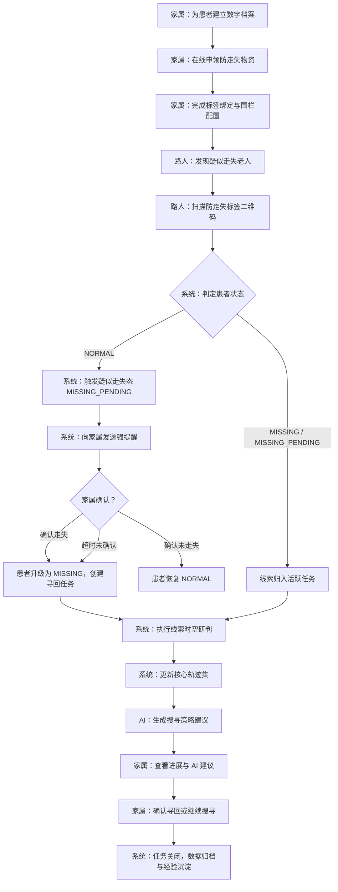
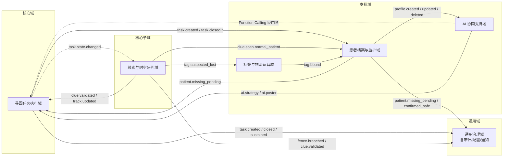
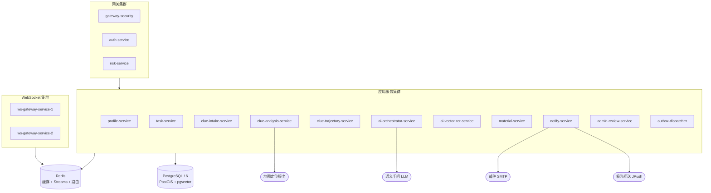
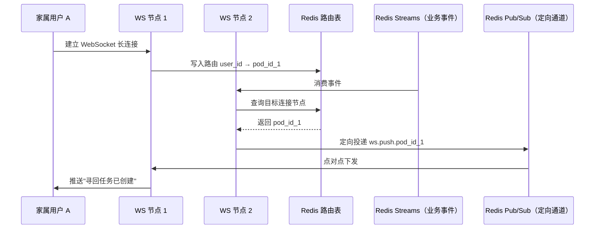
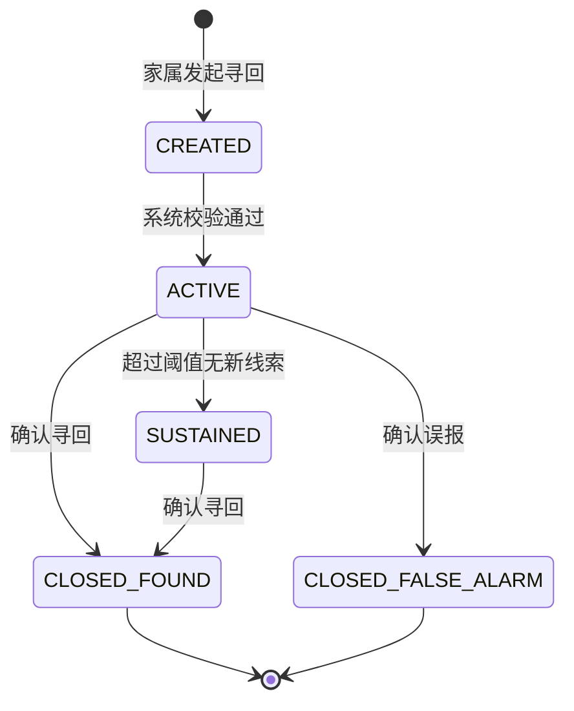
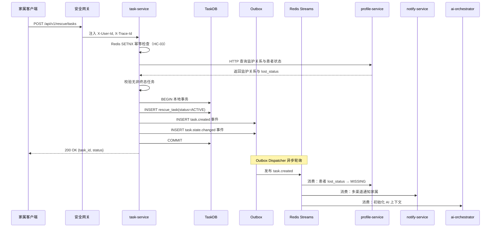
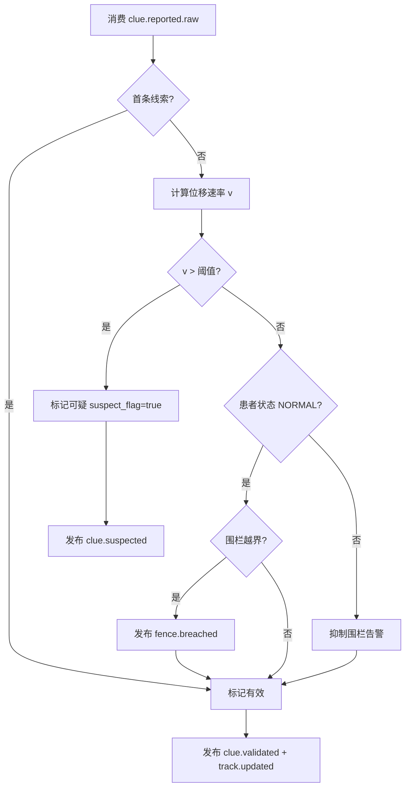

# 基于 AI 的阿尔兹海默症 Alzheimer 患者协同寻回系统的设计与实现

---

## 摘 要

阿尔兹海默症（Alzheimer's Disease, AD）是一种以进行性认知功能衰退为主要特征的神经退行性疾病，患者因空间定向能力严重受损而频繁发生走失事件。据相关统计数据显示，我国阿尔兹海默症患者已逾千万，其中每年因走失导致的人身安全事故频发，给患者家庭与社会公共资源带来了沉重负担。现有的寻人手段主要依赖传统报警、社交媒体扩散与线下搜索，普遍存在响应滞后、信息孤岛、协作低效以及缺乏智能决策支持等问题，难以满足走失事件的黄金救援时效要求。

针对上述痛点，本文设计并实现了一套基于人工智能的阿尔兹海默症患者协同寻回系统。该系统以领域驱动设计（Domain-Driven Design, DDD）为方法论指导，将业务划分为寻回任务执行域、线索与时空研判域、患者档案与监护域、标签与物资运营域、AI 协同支持域和通用治理域六大领域，构建了职责清晰、松耦合的微服务架构体系。

在核心功能层面，系统实现了从患者建档、防走失标签绑定、走失发现、匿名线索上报、时空研判、轨迹聚合到任务闭环的全流程协同能力。家属、匿名路人与平台管理员在统一的业务闭环中高效协作，形成了多主体参与的社会化寻回网络。系统引入了三态患者走失模型（`NORMAL` → `MISSING_PENDING` → `MISSING`），通过"路人扫码触发疑似走失 + 家属确认或超时自动升级"的双保险机制，有效缩短了走失发现的时间窗口。系统通过集成 Spring AI Alibaba 框架与通义千问大语言模型，构建了具备自然语言交互能力的 AI Agent，该 Agent 采用 Function Calling 机制调用各域标准接口执行业务操作，并通过策略门禁（Policy Guard）与 A0–A4 五级执行分级确保 AI 写操作的可控性；同时基于检索增强生成（Retrieval-Augmented Generation, RAG）技术实现对患者历史档案与走失经验的语义检索，为家属提供实时、可解释的搜寻策略建议。

在数据一致性与系统可靠性层面，系统采用本地事务与 Outbox Pattern 相结合的事件驱动架构，通过 Redis Streams 实现跨域事件的异步解耦与最终一致性保障，在毕设场景下有效降低了消息中间件的运维复杂度；引入 PostgreSQL 16 作为主数据存储引擎，集成 PostGIS 扩展实现空间计算与地理围栏判定，集成 pgvector 扩展支撑向量检索；采用 Redis 实现分布式缓存、幂等拦截与 WebSocket 集群精准路由，确保实时通知的可靠送达。在通知触达层面，系统构建了统一的通知网关，通过 `NotificationPort` 接口抽象实现 WebSocket 定向下发、极光推送（JPush）离线补偿、邮件（SMTP）与站内通知四通道路由与降级策略，满足不同业务场景的触达需求（HC-08）。

系统经功能测试与性能测试验证，核心写接口在 20 并发用户持续压测下平均响应时间满足 1200ms 以内的设计指标，AI 对话首字节响应时间控制在 3.5 秒以内，各项业务状态机流转正确，异常降级链路有效。本文的研究与实践表明，将 AI 大模型能力与事件驱动微服务架构相结合，能够显著提升阿尔兹海默症患者走失场景下的协同寻回效率与系统工程质量。

**关键词**：阿尔兹海默症；协同寻回；人工智能；领域驱动设计；事件驱动架构；检索增强生成

---

## Abstract

Alzheimer's Disease (AD) is a progressive neurodegenerative disorder characterized by severe cognitive decline, which significantly impairs patients' spatial orientation and frequently leads to wandering incidents. Statistics indicate that China has over ten million AD patients, with wandering-related safety accidents occurring frequently each year, imposing heavy burdens on patients' families and public resources. Existing search-and-rescue methods primarily rely on traditional police reports, social media dissemination, and offline searches, which generally suffer from delayed response, information silos, inefficient collaboration, and a lack of intelligent decision support, making it difficult to meet the critical time requirements for rescue operations.

To address these challenges, this thesis designs and implements an AI-powered collaborative retrieval system for Alzheimer's patients. Guided by Domain-Driven Design (DDD) methodology, the system is decomposed into six bounded contexts: Rescue Task Execution Domain, Clue and Spatiotemporal Analysis Domain, Patient Profile and Guardianship Domain, Tag and Material Operations Domain, AI Collaborative Support Domain, and General Governance Domain, forming a loosely-coupled microservice architecture with clearly defined responsibilities.

At the core functional level, the system delivers an end-to-end collaborative workflow spanning patient profiling, anti-wandering tag binding, wandering detection, anonymous clue reporting, spatiotemporal analysis, trajectory aggregation, and task closure. Family members, anonymous passersby, and platform administrators collaborate efficiently within a unified business loop, establishing a multi-stakeholder social retrieval network. The system introduces a three-state patient wandering model (`NORMAL` → `MISSING_PENDING` → `MISSING`), employing a dual-assurance mechanism of "passerby scan triggering suspected wandering plus family confirmation or automatic timeout escalation" to effectively shorten the wandering detection window. By integrating the Spring AI Alibaba framework with the Tongyi Qianwen large language model, the system constructs an AI Agent with natural language interaction capabilities. This Agent employs a Function Calling mechanism to invoke standard domain APIs for business operations, with a Policy Guard and five-tier execution classification (A0–A4) ensuring controllability of AI write operations. It also leverages Retrieval-Augmented Generation (RAG) technology to perform semantic retrieval over patient historical profiles and past wandering experiences, providing families with real-time, explainable search strategy recommendations.

At the data consistency and system reliability level, the system adopts an event-driven architecture combining local transactions with the Outbox Pattern, utilizing Redis Streams for asynchronous cross-domain event decoupling and eventual consistency guarantees, effectively reducing message middleware operational complexity in the graduation project scenario. PostgreSQL 16 serves as the primary data storage engine, integrated with PostGIS for spatial computation and geofence evaluation, and with pgvector for vector similarity search. Redis is employed for distributed caching, idempotency interception, and WebSocket cluster-level precise routing, ensuring reliable real-time notification delivery. At the notification layer, the system builds a unified notification gateway that abstracts through the `NotificationPort` interface, implementing four-channel routing and degradation strategies across WebSocket targeted delivery, JPush offline compensation, SMTP email, and in-app notifications to meet diverse business scenario requirements (HC-08).

Through functional and performance testing, the system demonstrates that core write APIs maintain an average response time within 1,200 ms under 20 concurrent users in sustained load testing, AI dialogue achieves a first-byte response time within 3.5 seconds, all business state machine transitions operate correctly, and degradation paths function as expected. The research and practice presented in this thesis demonstrate that combining large language model capabilities with event-driven microservice architecture can significantly enhance collaborative retrieval efficiency and system engineering quality in Alzheimer's patient wandering scenarios.

**Keywords**: Alzheimer's Disease; Collaborative Retrieval; Artificial Intelligence; Domain-Driven Design; Event-Driven Architecture; Retrieval-Augmented Generation

---

## 第 1 章 绪论

### 1.1 研究背景及意义

阿尔兹海默症（Alzheimer's Disease, AD）是最常见的痴呆类型，约占全部痴呆病例的 60%～70%。该疾病以进行性认知功能衰退为核心特征，患者在中晚期阶段往往出现严重的空间定向障碍与记忆丧失，导致其极易在日常生活中走失。据国际阿尔茨海默病协会（Alzheimer's Disease International, ADI）发布的报告，全球痴呆患者总数已超过 5500 万，预计到 2050 年将突破 1.39 亿。我国作为全球阿尔兹海默症患者数量最多的国家之一，患者总数已逾千万，且仍呈持续增长态势。

患者走失事件的高发性与严重后果性构成了突出的社会问题。走失患者由于自我保护能力缺失，极易遭遇交通事故、跌倒受伤、脱水与低温暴露等危险，部分走失事件甚至导致患者死亡。对于患者家庭而言，走失事件不仅带来巨大的心理压力与经济负担，还造成了难以弥补的情感创伤。从公共资源的角度分析，传统的走失搜寻模式严重依赖公安系统与志愿者组织的人力投入，单次搜寻行动的社会成本极高，而搜寻效率却难以保障。

现有的阿尔兹海默症患者走失应对手段主要包括以下几类：第一，传统报警与线下搜索，这种方式响应周期长，信息在警方与家属之间的传递效率低下；第二，基于社交媒体的信息扩散，虽能扩大传播范围，但线索质量参差不齐，缺乏系统化的线索汇聚与研判机制；第三，基于 GPS 定位的穿戴设备，其局限在于设备续航有限、患者佩戴依从性差且无法应对设备脱落后的走失场景。上述手段普遍存在信息孤岛、协作效率低、缺乏智能化决策支持等共性不足，难以在走失事件的黄金救援窗口期内实现高效寻回。

因此，研究并构建一套集多主体协作、实时线索汇聚、智能时空研判与 AI 辅助决策于一体的协同寻回系统，对于提升阿尔兹海默症患者走失后的寻回效率、保障患者生命安全、减轻家庭与社会负担具有重要的理论意义与现实价值。

### 1.2 国内外研究现状

#### 1.2.1 国外研究现状

在阿尔兹海默症患者走失防护领域，国外的研究与实践起步较早，相关技术方案已形成一定的体系化积累。

在硬件定位层面，以美国 Project Lifesaver 为代表的射频定位方案，通过为患者佩戴射频发射手环，配合专业搜救队伍手持方向性天线进行追踪，在部分社区取得了较高的寻回成功率。英国阿尔茨海默协会推广的 GPS 追踪设备（如 Mindme、Buddi 等），能够实现对佩戴者位置的实时监控与地理围栏告警。然而，该类方案的核心局限在于其"单点追踪"范式——一旦设备电量耗尽、被患者摘除或因防水密封老化失效，整个定位链路即告中断，系统缺乏在设备离线后继续追踪的能力。

在软件平台层面，美国 Silver Alert 系统模仿 Amber Alert 的运作模式，当老年人走失后通过广播、高速公路电子标牌和社交媒体进行信息发布，但其本质仍为单向信息推送，缺乏双向线索收集与自动化研判能力。荷兰的 Amber Alert Europe 扩展了跨国走失预警网络，在信息触达范围上有所突破，但在线索质量控制与时空一致性分析方面仍存在空白。

在人工智能应用层面，近年来，深度学习在行人重识别（Person Re-identification, Re-ID）领域取得了显著进展，部分研究将其应用于走失人员的视频监控识别。然而，此类方案对城市监控基础设施的覆盖密度依赖极高，在农村与城郊地区的适用性有限。大语言模型（Large Language Model, LLM）技术的快速发展为走失场景下的智能决策支持提供了新的可能，但目前将 LLM 与走失寻回业务进行深度集成的系统化实践尚处于探索阶段。

#### 1.2.2 国内研究现状

国内在失智老人走失防护领域的研究与实践近年来也取得了一定进展。在政府层面，部分城市公安系统建立了走失人员信息发布平台，民政部门推动的"关爱失智老人黄手环行动"通过发放印有求助信息的物理标识，在社区层面提供了一定的辅助辨识能力。

在技术产品层面，以中国移动"和目"、阿里巴巴"团圆"系统为代表的平台，在走失信息的快速扩散与公众参与方面进行了有益探索。部分智能穿戴设备厂商推出了面向老年人的 GPS 定位手表与鞋垫，但同样面临设备脱落、续航不足与佩戴意愿低等痛点。在学术研究方面，部分高校针对失智老人走失场景提出了基于物联网（Internet of Things, IoT）的监护方案与基于社交网络的协同寻人模型，但在系统工程的完整性、线索的可信研判以及 AI 辅助决策的深度集成方面仍有较大提升空间。

#### 1.2.3 现有方案的不足与本文切入点

综合国内外研究现状，现有阿尔兹海默症患者走失应对方案的主要不足可归纳为以下四个方面：

第一，**协作模式单一**。现有系统大多以单向信息发布或单点设备追踪为主，缺乏将家属、路人、管理平台纳入同一业务闭环的多主体协同机制。

第二，**线索治理能力薄弱**。路人上报的线索未经系统化的时空一致性校验与可信度研判，有效线索与干扰信息混杂，直接影响寻回决策的准确性。

第三，**AI 决策支持缺失**。虽然大语言模型在自然语言理解与推理方面展现了强大能力，但尚未有成熟的系统将其与走失寻回的全流程业务进行深度整合，实现基于实时线索与历史经验的智能策略推荐。

第四，**系统工程质量不足**。部分原型系统在高并发线索上报、跨模块数据一致性、事件可靠投递等工程关键环节缺乏严谨的设计，难以满足真实生产环境的稳定性与可靠性要求。

基于上述分析，本文以构建"全流程协同、多主体参与、AI 辅助决策、工程质量可控"的协同寻回系统为目标，聚焦于解决协作机制构建、线索可信研判、AI Agent 深度集成与事件驱动一致性保障四大核心问题。

### 1.3 本文主要工作与创新点

本文围绕阿尔兹海默症患者协同寻回系统的设计与实现，完成了以下主要工作：

**（1）构建了多主体协同的全流程寻回业务闭环。** 系统将家属/监护人、匿名路人、平台管理员三类角色纳入统一的业务协作链路，覆盖了从患者建档、防走失标签绑定、走失发现与确认、匿名线索上报、线索研判与轨迹聚合到任务关闭与经验沉淀的完整生命周期。通过路人扫码触发"疑似走失"（`MISSING_PENDING`）与家属主动发起任务的双入口机制，配合超时自动升级调度器，有效缩短了走失发现的时间窗口。

**（2）设计了基于时空一致性的线索可信研判机制。** 系统针对匿名路人上报线索的真实性与可靠性挑战，建立了以防漂移速度阈值为核心的时空一致性校验算法。通过计算相邻线索坐标之间的移动速率，自动识别并阻断超出物理合理范围的异常坐标点，并将高风险线索送入管理员人工复核队列，保障了进入核心轨迹集的线索数据质量。

**（3）实现了基于 AI Agent 与 Function Calling 的智能决策支持。** 系统集成了 Spring AI Alibaba 框架与通义千问大语言模型，构建了具备自然语言理解与工具调用能力的 AI Agent。该 Agent 通过 Function Calling 机制直接调用各业务域的标准 REST API 执行查询与操作，所有写操作经 Policy Guard 策略门禁与 A0–A4 五级执行分级校验后由目标域服务自身完成状态变更。同时基于 RAG（检索增强生成）技术从向量数据库中召回患者历史档案与走失经验，为家属提供实时、可解释、有依据的搜寻策略建议。

**（4）建立了事件驱动的跨域一致性保障体系。** 系统采用本地事务与 Outbox Pattern 相结合的强一致投递模型，通过 Redis Streams 实现跨域事件的异步解耦与可靠传递。消费端通过本地幂等日志实现精确去重，结合事件版本号的防乱序机制，确保在高并发与分布式异常场景下的数据最终一致性。

**（5）构建了多渠道通知网关与统一治理能力。** 系统通过 `NotificationPort` 接口抽象实现 WebSocket 定向下发、极光推送（JPush）离线补偿、邮件（SMTP）与站内通知四通道分发，结合降级策略与全链路审计，满足不同业务场景的触达需求（HC-08）。通用治理域以"身份、权限、审计、配置"四维架构提供统一的基础治理能力。

本文的创新点主要体现在以下方面：一是将 AI Agent 的 Function Calling 能力与领域驱动设计的标准域接口相结合，通过策略门禁与执行分级机制，在保持各域状态权威不被侵入的前提下，赋予 AI 真正的业务操作能力；二是提出了"扫码触发疑似走失 + 超时自动升级"的三态走失发现机制（`NORMAL` → `MISSING_PENDING` → `MISSING`），解决了家属不在身边时走失事件无法被及时感知的问题；三是设计了面向匿名上报场景的设备指纹风控与时空防漂移联合校验体系，在保护路人隐私的前提下有效抑制了恶意干扰与无效线索。

### 1.4 论文组织结构

本文共分为七章，各章内容安排如下：

**第 1 章 绪论。** 阐述了阿尔兹海默症患者走失问题的研究背景与社会意义，分析了国内外现有寻人系统的研究现状与技术瓶颈，明确了本文的主要工作内容与创新点。

**第 2 章 核心技术与开发环境。** 对系统涉及的关键技术栈进行了学术性阐述，包括 Spring Boot 微服务框架、领域驱动设计思想、PostgreSQL 与 PostGIS 空间数据库、pgvector 向量检索与 RAG 技术、Redis Streams 事件驱动架构、Redis 分布式缓存与 WebSocket 实时推送，以及 Spring AI Alibaba 与大模型集成方案。

**第 3 章 系统需求分析。** 基于系统需求规格说明书（SRS），从可行性分析、业务流程分析、功能性需求与非功能性需求四个维度对系统进行了全面的需求剖析。

**第 4 章 系统总体架构设计。** 基于系统架构设计文档（SADD V2.0），阐述了系统的总体分层架构、六域划分与微服务部署拓扑，重点论述了事件驱动一致性机制、安全鉴权机制、WebSocket 集群精准路由机制与多渠道通知网关的架构设计。

**第 5 章 系统详细设计与实现。** 基于低层设计文档（LLD V2.0）、数据库设计文档（DBD V2.0）与接口文档（API V2.0），详细阐述了数据库设计、寻回任务协同模块、AI 协同决策模块的设计与实现，以及关键技术难点的突破方案。

**第 6 章 系统测试。** 介绍了测试环境与工具选型，展示了核心功能测试用例的执行结果，并给出了性能测试与安全测试的量化指标。

**第 7 章 总结与展望。** 对本文的研究工作进行了总结，分析了系统的现有不足，并对未来的改进方向进行了展望。

### 本章小结

本章从阿尔兹海默症患者走失问题的社会现实出发，分析了现有寻人手段的痛点与技术瓶颈，明确了构建协同寻回系统的研究动机。在梳理国内外研究现状的基础上，提出了本文的五项主要工作与三项创新点，并给出了论文的整体组织结构，为后续章节的展开奠定了逻辑基础。

---

## 第 2 章 核心技术与开发环境

> 本章对系统设计与实现过程中所采用的关键技术进行学术性阐述，重点说明本系统为何需要这些技术，以及各技术在系统中所承担的具体角色。本章内容为后续章节中架构设计与详细实现的技术基础。

### 2.1 Spring Boot 与 Spring Cloud 微服务框架

Spring Boot 是由 Pivotal 团队（现为 VMware Tanzu 旗下）推出的基于 Java 语言的快速应用开发框架，其核心设计理念为"约定优于配置"（Convention over Configuration）。通过内嵌 Servlet 容器、自动化配置与 Starter 依赖管理机制，Spring Boot 显著降低了 Spring 应用的搭建与部署复杂度，使开发者能够专注于业务逻辑的实现。

在本系统中，Spring Boot 作为各微服务节点的基础运行框架，承担了依赖注入、事务管理、RESTful 接口暴露、日志集成与健康检查等基础能力。系统采用 Spring Boot 3.x 版本，基于 Jakarta EE 规范运行于 Java 21 虚拟机之上，充分利用了虚拟线程（Virtual Threads）在高并发 I/O 密集型场景下的吞吐量优势。

Spring Cloud 作为 Spring Boot 的微服务扩展生态，为分布式系统提供了服务注册与发现、配置中心、负载均衡、熔断降级与链路追踪等治理能力。本系统借助 Spring Cloud Gateway 实现了统一的 API 网关路由与安全策略执行，所有外部请求经由网关完成认证鉴权、幂等拦截与限流保护后，方可到达下游业务服务。这种架构模式有效实现了"接入安全层"与"业务逻辑层"的职责隔离，确保业务服务仅处理已验证的合法请求。

### 2.2 领域驱动设计（DDD）思想

领域驱动设计（Domain-Driven Design, DDD）是由 Eric Evans 在其同名著作中提出的软件工程方法论，其核心主张是将复杂业务的核心逻辑封装于领域模型中，通过统一语言（Ubiquitous Language）、限界上下文（Bounded Context）、聚合根（Aggregate Root）与领域事件（Domain Event）等战术模式，构建高内聚、低耦合的软件架构。

本系统之所以引入 DDD 方法论，源于阿尔兹海默症患者协同寻回业务本身的领域复杂度。该业务涉及患者档案管理、监护权协同、走失任务执行、匿名线索研判、物资运营、AI 辅助决策与平台治理等多个相互关联却各自独立的业务子领域，若采用传统的面向数据表的贫血模型架构，极易导致业务规则散落于各层代码之中，造成维护困难与变更成本的急剧上升。

基于 DDD 的战略设计，本系统将业务划分为六大限界上下文：寻回任务执行域（核心域）、线索与时空研判域（核心子域）、患者档案与监护域（支撑域）、标签与物资运营域（支撑域）、AI 协同支持域（支撑域）与通用治理域（通用域）。各域拥有独立的聚合根、状态机与领域服务，跨域协作通过领域事件驱动，而非直接的数据库共享或同步远程调用。这种设计确保了寻回任务执行域作为任务状态机的唯一权威，任何外部模块（包括 AI Agent）均不可绕过域服务直接修改任务状态，从而保障了业务状态的一致性与可追溯性。

### 2.3 PostgreSQL 与 PostGIS 空间数据库

PostgreSQL 是一款开源的对象关系型数据库管理系统（ORDBMS），以其卓越的可扩展性、严格的 ACID 事务保障与丰富的数据类型支持著称。在数据库性能评测与行业实践中，PostgreSQL 已被广泛认可为处理复杂查询、地理空间数据与 JSON 半结构化数据的优秀选择。

本系统选用 PostgreSQL 16 作为主数据存储引擎，主要基于以下三方面考量：

第一，**事务一致性保障**。系统的核心状态变更（如任务状态流转、线索研判结果写入）必须与 Outbox 事件记录在同一本地事务中提交，PostgreSQL 的严格 ACID 语义为此提供了坚实的技术基础。

第二，**空间计算能力**。通过集成 PostGIS 3.4 扩展，PostgreSQL 获得了强大的地理空间数据处理能力。本系统中，线索坐标采用 WGS84 坐标系（SRID=4326）的 `geometry(Point, 4326)` 类型存储，围栏越界判定基于 `ST_DWithin` 空间函数实现，相邻线索间距计算基于 `ST_Distance` 函数完成。PostGIS 的 GiST（Generalized Search Tree）索引为空间查询提供了高效的检索支持。

第三，**原生分区能力**。系统中的审计日志表（`sys_log`）、Outbox 事件表（`sys_outbox_log`）与消费幂等日志表（`consumed_event_log`）均采用按月 RANGE 分区策略，配合 pg_partman 扩展实现自动分区管理，有效控制了高写入表的存储膨胀与查询性能退化。

### 2.4 pgvector 向量检索与 RAG 技术

pgvector 是 PostgreSQL 的向量相似度搜索扩展，为数据库增加了 `vector` 数据类型与近似最近邻（Approximate Nearest Neighbor, ANN）检索能力。本系统选用 pgvector 0.7+ 版本，采用 HNSW（Hierarchical Navigable Small World）索引算法实现高效的向量检索。

检索增强生成（Retrieval-Augmented Generation, RAG）是一种将外部知识库检索与大语言模型生成能力相结合的技术范式。其核心思想在于：在将用户查询提交给大模型之前，先从向量数据库中检索与查询语义相关的知识片段，将检索结果注入到提示词（Prompt）上下文中，从而使模型在生成回答时具备特定领域的事实依据，有效缓解大模型的"幻觉"（Hallucination）问题。

本系统之所以采用 pgvector 而非独立部署的外部向量数据库（如 Milvus、Pinecone），基于以下架构决策考量：其一，患者档案的向量检索必须与业务数据的有效性过滤（如 `valid=true`、`deleted_at IS NULL`）在同一查询中完成，同库部署可天然保证检索结果与业务状态的一致性；其二，系统的向量数据规模在当前阶段尚未达到需要外部向量数据库弹性扩展能力的量级，pgvector 的同库方案在运维成本与一致性保障方面更具优势。

在具体实现中，系统使用 1024 维的向量表示（与阿里云百炼 Embedding 模型输出维度对齐），采用 cosine 距离度量，HNSW 索引参数设置为 $m=32$、$ef\_construction=256$，查询时 $ef\_search=80$。检索时强制执行患者维度隔离，即 `WHERE patient_id=:pid AND valid=true`，禁止全局 ANN 后过滤，确保隐私隔离与检索效率。

### 2.5 Redis Streams 事件驱动架构

Redis Streams 是 Redis 5.0 引入的持久化日志数据结构，提供了追加写入、Consumer Group 可靠消费、消息确认（`XACK`）与消息重放等核心特性，是构建轻量级事件驱动架构的理想选型。与传统的分布式消息中间件（如 Apache Kafka）相比，Redis Streams 在运维复杂度与资源消耗方面具有显著优势，尤其适用于毕设场景下的最小可用复杂度约束。

本系统引入 Redis Streams 的核心动机在于解决微服务架构下的跨域协作问题。在传统的同步 RPC 调用模式中，服务间的高频直接调用会导致紧耦合、级联故障与性能瓶颈。本系统采用"事件优先"的协作策略：当某个域完成状态变更后，通过发布领域事件通知其他相关域进行异步处理，各域独立消费并维护自身视图。例如，当线索研判服务完成有效性判定后，发布 `clue.validated` 事件，任务服务与 AI 服务各自独立消费该事件完成任务进展更新与策略推演，三者之间无需直接 RPC 依赖。

Redis Streams 在本系统中承担以下职责：第一，作为领域事件的传输通道，承载 Outbox Dispatcher 投递的状态变更事件；第二，作为原始线索入站事件（`clue.reported.raw`）的削峰缓冲区，线索入口服务将原始事件直接写入 Redis Streams 而非 Outbox，利用其高写入吞吐量实现入站流量的平滑处理；第三，通过 Consumer Group 机制实现消费者的负载均衡与故障接管——组内某个消费者实例宕机后，其 Pending 消息由组内其他实例自动接管重消费。

选择 Redis Streams 而非 Apache Kafka 的架构决策理由在于：系统已依赖 Redis 承担缓存、幂等拦截与 WebSocket 路由存储等职责，复用同一 Redis 实例作为事件总线可显著降低基础设施的部署与运维成本；在当前的毕设场景业务规模下，Redis Streams 的吞吐量与持久化能力已能满足需求，当未来业务规模超出单 Redis 实例承载能力时，可平滑升级至 Kafka 等分布式消息中间件。

系统定义了 20 余个核心事件 Topic，按业务语义可分为三类：原始入站事件（如 `clue.reported.raw`，用于线索入口的削峰缓冲）、领域状态变更事件（如 `task.state.changed`、`clue.validated`，必须通过 Outbox 模式保证投递可靠性）与异步任务事件（如 `ai.poster.generated`，用于非核心链路的异步处理）。所有事件均采用统一的 Envelope 结构封装，包含 `event_id`、`trace_id`、`version` 等元数据，支持端到端的链路追踪与防乱序消费。

### 2.6 Redis 分布式缓存与 WebSocket 实时推送

Redis 是一款基于内存的高性能键值存储系统，支持字符串、哈希、列表、集合与有序集合等丰富的数据结构。在本系统中，Redis 除承担事件总线职责外，还承担了以下四项关键职责：

第一，**幂等拦截**。所有写接口的 `X-Request-Id` 通过 Redis 的 `SETNX` 命令实现分布式去重，确保同一请求在网络重试或客户端重复提交场景下不产生副作用。

第二，**配额计数**。AI 双账本配额（用户维度与患者维度）的预占与确认操作基于 Redis 原子计数实现，保证高并发下配额扣减的准确性。

第三，**状态缓存**。线索研判服务在执行围栏判定时，需要获取患者当前的走失状态。为避免高频同步 RPC 查询任务服务，系统采用 L1（进程内本地缓存）+ L2（Redis 只读投影）的双层缓存架构，任务服务在状态变更后通过 `task.state.changed` 事件异步更新 L2 缓存。

第四，**WebSocket 路由**。系统的多节点 WebSocket 集群采用 Redis 存储用户连接的路由映射（`user_id` → `pod_id`），当业务事件需要推送给特定用户时，先查询路由表确定目标连接所在节点，再通过 Redis Pub/Sub 定向通道（`ws.push.{pod_id}`）点对点投递，避免全节点广播造成的"惊群效应"（HC-08）。

WebSocket 作为全双工通信协议，为系统的实时通知能力提供了技术支撑。家属端在任务进行期间通过 WebSocket 长连接接收线索更新、轨迹变化、AI 策略建议等实时推送消息。当 WebSocket 连接不可用时（如弱网环境或 App 后台运行），系统通过通知网关自动降级至极光推送（JPush）与站内通知双通道兜底，确保关键告警的可靠触达。

### 2.7 Spring AI Alibaba 与大模型集成

Spring AI 是 Spring 生态中面向人工智能应用的集成框架，提供了对主流大语言模型的统一抽象接口，包括 `ChatClient`、`Embedding`、`FunctionCallback` 等核心组件。Spring AI Alibaba 作为其阿里云适配实现，提供了与阿里云百炼平台（DashScope）和通义千问系列模型的原生集成能力。

本系统之所以选择 Spring AI Alibaba + 通义千问的技术组合，基于以下考量：第一，Spring AI Alibaba 的 `ChatClient` + `FunctionCallback`（`@Tool` 注解）机制天然支持 AI Agent 的 Tool-Use 编排范式，使得 AI Agent 能够通过 Function Calling 直接调用各域的标准 REST API 执行业务操作（如发布任务、查询轨迹），无需额外的中间适配层；第二，通义千问模型在中文语义理解与推理方面具备显著优势，契合本系统面向中文用户的业务场景；第三，百炼平台提供了稳定的企业级 API 服务与配额管理能力，满足系统的生产级可用性要求。

在架构边界上，AI Agent 作为支撑域的一部分，严格遵守"AI 不拥有状态权威"的硬约束（HC-01）。AI Agent 的所有写操作均通过 Function Calling 调用目标域服务的标准接口完成，所有写操作经 Policy Guard 策略门禁校验后由目标域服务自身执行状态变更，AI 服务不直接写入任何域实体表。这一设计从架构层面消除了大模型输出非确定性对业务状态一致性的潜在威胁。

### 2.8 开发与部署环境概述

表 2-1 列出了本系统开发与部署所采用的主要环境配置。

**表 2-1 开发与部署环境**

| 类别 | 技术选型 | 版本 | 用途 |
|------|----------|------|------|
| 编程语言 | Java | 21 | 后端服务开发 |
| 基础框架 | Spring Boot | 3.x | 微服务运行框架 |
| 微服务治理 | Spring Cloud Gateway | 最新稳定版 | API 网关与路由 |
| AI 框架 | Spring AI Alibaba | 最新稳定版 | 大模型集成与 Agent 编排 |
| 数据库 | PostgreSQL | 16 | 主数据与事务存储 |
| 空间扩展 | PostGIS | 3.4 | 地理空间计算 |
| 向量扩展 | pgvector | 0.7+ | 向量相似度检索 |
| 分区管理 | pg_partman | 5.x | 分区表自动治理 |
| 事件总线 | Redis Streams | 7.x | 事件驱动与异步解耦 |
| 分布式缓存 | Redis | 7.x | 缓存、幂等、路由、Pub/Sub |
| 大语言模型 | 通义千问（Qwen） | qwen-max-latest | AI 推理与生成 |
| 应用推送 | 极光推送（JPush） | 最新稳定版 | App 离线通知推送 |
| 邮件服务 | SMTP | — | 账号验证与密码重置 |
| 前端（家属端） | Android 原生 | — | 家属移动应用 |
| 前端（路人端） | H5 移动网页 | Vue.js | 匿名线索上报 |
| 前端（管理端） | Web 管理后台 | Vue.js | 平台运营管理 |

### 本章小结

本章对系统所依赖的七项核心技术进行了系统性阐述，从微服务框架、领域建模方法论、空间数据库、向量检索与 RAG、Redis Streams 事件驱动架构、分布式缓存与实时推送到大模型集成框架，逐一说明了各技术的基本原理以及本系统引入该技术的具体动因。这些技术的有机组合构成了系统的技术底座，为后续章节中架构设计与详细实现的展开提供了必要的技术背景支撑。

---

## 第 3 章 系统需求分析

> 本章依据系统需求规格说明书（SRS V2.0）进行学术化重构，从可行性分析、业务流程分析、功能性需求与非功能性需求四个维度对系统进行全面剖析，为后续架构设计与详细实现提供需求基线。

### 3.1 可行性分析

#### 3.1.1 技术可行性

从技术实现角度分析，本系统所依赖的核心技术栈均已具备成熟的开源生态与企业级实践基础。Spring Boot 与 Spring Cloud 微服务框架拥有庞大的社区支持与丰富的生产案例；PostgreSQL 16 结合 PostGIS 与 pgvector 扩展，能够在同一数据库实例中同时支撑关系事务、空间计算与向量检索三类工作负载；Redis Streams 的 Consumer Group 消费机制经过广泛验证，其高吞吐与持久化特性能够满足线索上报的削峰需求，且与系统已有的 Redis 缓存实例共享部署，有效控制了运维复杂度；Spring AI Alibaba 提供了与通义千问大模型的原生集成接口，降低了 AI Agent 构建的技术门槛。综上，系统在技术层面不存在不可克服的瓶颈。

#### 3.1.2 经济可行性

本系统的核心基础设施均采用开源方案，无需承担商业数据库或中间件的许可证费用。大语言模型采用阿里云百炼平台的按量计费模式，在系统初期运行阶段的成本可控。系统的部署架构支持单节点演示与多节点生产两种模式，能够根据实际业务量级灵活调整资源投入。从社会效益角度分析，系统若投入使用，可有效降低走失搜寻的人力成本，减少走失事件导致的间接经济损失。

#### 3.1.3 操作可行性

系统面向三类用户群体设计了差异化的交互方式：家属端以 Android 原生应用为载体，提供基于自然语言的 LUI（Language User Interface）交互模式，降低了操作门槛；路人端以 H5 移动网页为载体，无需下载安装应用，通过扫码即可完成线索上报，操作路径简洁；管理端以 Web 后台为载体，面向具备一定计算机操作基础的运营人员。三端的交互设计均以"最少操作步骤完成核心任务"为原则，具备良好的操作可行性。

### 3.2 业务流程分析

#### 3.2.1 系统主业务流程

系统的核心业务流程围绕"走失发现 → 线索汇聚 → 研判追踪 → 寻回闭环"的主线展开。系统主业务流程如图 3-1 所示。

**图 3-1 系统主业务流程图**

该流程体现了以下设计特征：第一，走失发现具备"路人扫码触发"与"家属主动发起"双入口机制，当路人扫码触发疑似走失态（`MISSING_PENDING`）后，若家属超时未确认，系统将自动将患者状态升级为 `MISSING` 并创建任务，避免因家属不在身边导致的响应延迟；第二，线索上报与研判过程全程匿名，路人无需注册账号即可参与协助；第三，AI 策略建议基于实时线索与历史经验自动生成，但任务关闭的最终决策权始终保留在家属手中。

#### 3.2.2 异常业务流程

系统针对可能出现的异常场景设计了完整的降级与补偿机制，主要包括：

**（1）线索异常处理。** 当上报线索存在时空逻辑冲突（如相邻两条线索间移动速率超出物理合理范围）时，该线索自动进入管理员人工复核队列，而非直接阻塞主流程。存疑线索支持"通过"与"驳回"两种闭环操作。

**（2）扫码降级处理。** 若二维码污损无法识别，路人可通过访问系统网址手动输入 6 位短码完成上报，该入口受人机验证（滑块 CAPTCHA）保护。若路人拒绝浏览器定位授权，系统降级提供结构化地图选点功能。

**（3）AI 降级处理。** 当大模型服务超时、限流或宕机时，系统自动切换至基于规则的推荐机制，确保线索地图展示与核心寻回流程不因 AI 单点故障而停滞。

**（4）物资异常处理。** 物资申领工单发生物流异常时，进入异常闭环分支，支持"补发"或"作废"操作，避免工单卡死在中间状态。

**（5）任务超时处理。** 寻回任务处于活跃状态超过设定阈值（如 24 小时）且无新线索接入时，任务自动进入长期维持队列（`SUSTAINED`），降低主动推送频率为每日 AI 摘要模式，但仍持续接收线索并静默更新轨迹。

### 3.3 功能性需求

基于系统需求规格说明书中的功能需求条目，本系统的功能性需求按业务模块划分为以下六大子系统。

#### 3.3.1 AI 协同决策模块

AI 协同决策模块是本系统的核心创新模块之一，旨在通过大语言模型为家属提供基于自然语言的智能交互能力。该模块的主要功能需求如表 3-1 所示。

**表 3-1 AI 协同决策模块核心功能需求**

| 编号 | 功能描述 | 优先级 |
|------|----------|--------|
| FR-AI-001 | 支持家属端基于自然语言与系统交互 | P0 |
| FR-AI-002 | 根据用户意图分类返回信息解答或可执行建议 | P0 |
| FR-AI-003 | 优先使用实时上下文（近期线索、轨迹、任务状态）推理 | P0 |
| FR-AI-004 | 基于患者档案的向量检索（RAG）辅助推理 | P0 |
| FR-AI-007 | 写操作经 Policy Guard 策略门禁分级校验，需用户确认方可执行 | P0 |
| FR-AI-008 | Prompt 中 PII 信息自动脱敏替换 | P0 |
| FR-AI-009 | 按用户与患者双维度独立计量配额，走失状态自动豁免 | P0 |
| FR-AI-010 | 模型异常时自动降级至规则推荐机制（L1–L4 分级） | P0 |
| FR-AI-012 | 支持 SSE 流式输出，降低首字节响应时间 | P1 |
| FR-AI-013 | 支持寻人海报生成，AI 输出 JSON 文案由系统渲染 | P1 |
| FR-AI-015 | AI 辅助写操作须渲染确认按钮、展示预填摘要并记录审计 | P0 |

该模块的核心设计约束在于：AI 仅作为"建议者"角色参与业务，所有涉及状态变更的操作（如发起任务、关闭任务）均需家属物理点击确认后方可执行，AI 不得绕过确认逻辑直接改写业务状态。AI Agent 的执行能力被划分为 A0（自动观测）至 A4（人工专属）五级，其中 A4 级操作永不允许 Agent 自动执行。

#### 3.3.2 线索与时空研判模块

线索与时空研判模块负责接收、校验、研判匿名路人上报的线索数据，并将有效线索聚合为可供决策使用的时空轨迹。该模块的主要功能需求如表 3-2 所示。

**表 3-2 线索与时空研判模块核心功能需求**

| 编号 | 功能描述 | 优先级 |
|------|----------|--------|
| FR-CLUE-001 | 支持匿名路人上报线索，无需注册，支持 GPS 定位与地图选点双模式 | P0 |
| FR-CLUE-002 | 支持实体标签扫码、海报扫码与手动填写短码三种上报入口 | P0 |
| FR-CLUE-004 | 根据患者当前状态差异化展示信息（`NORMAL` 态提示已通知家属，`MISSING` / `MISSING_PENDING` 态展示全量救援信息） | P0 |
| FR-CLUE-005 | 基于最近有效线索坐标进行速率校验，异常坐标自动阻断 | P0 |
| FR-CLUE-006 | 患者 `NORMAL` 态时支持基于扫码事件的围栏越界被动判定 | P0 |
| FR-CLUE-007 | 高风险线索送入人工复核队列，支持通过与驳回闭环 | P0 |
| FR-CLUE-008 | 海报二维码扫码线索标记为间接线索（`source_type = POSTER_SCAN`），地图降维展示 | P1 |
| FR-CLUE-010 | 有效坐标点按时间序列聚合为连续轨迹空间数据对象 | P1 |

线索模块的关键业务规则包括：单设备指纹 10 分钟内最多上报 3 次（BR-001）；防漂移速度阈值作为可配置系统参数（HC-05），通过计算相邻线索间的移动时速判定合理性；所有向路人端下发的照片资源均需叠加半透明时间戳水印以防截图滥用（BR-010、HC-07）；路人端信息展示时间由配置中心管理，通过带 TTL 的临时访问 Token 控制（AC-09）。

#### 3.3.3 患者档案与标识模块

患者档案与标识模块提供患者数字档案的全生命周期管理能力，并支撑监护关系的协同治理。该模块的主要功能需求如表 3-3 所示。

**表 3-3 患者档案与标识模块核心功能需求**

| 编号 | 功能描述 | 优先级 |
|------|----------|--------|
| FR-PRO-001 | 支持患者建档，含近期照片、基础信息与体貌特征标签 | P0 |
| FR-PRO-002 | 长文本描述（常去地点、生活习惯等）同步写入向量空间 | P0 |
| FR-PRO-003 | 为患者生成唯一 6 位短码 | P0 |
| FR-PRO-005 | 支持 1:N 标签绑定，多标签共享同一患者走失状态 | P0 |
| FR-PRO-006 | 支持家庭成员的邀请、接受、移除等监护协同 | P0 |
| FR-PRO-007 | 支持主监护权双阶段转移（发起、确认/拒绝）| P0 |
| FR-PRO-009 | 档案注销时执行 PII 脱敏擦除，关联标签强制 `VOIDED`，删除 AI 向量数据 | P0 |
| FR-PRO-010 | 支持地理围栏配置（中心位置与安全半径）| P1 |

该模块在监护权管理方面引入了双阶段确认机制：主监护权转移需经发起方发起请求、受方确认接收两个阶段完成，且仅目标受方有权执行确认操作。当关联成员被移除时，其名下的未决请求（如待确认的转移）必须自动失效，防止通过历史请求恢复高权限（BR-006）。

#### 3.3.4 寻回任务执行模块

寻回任务执行模块是系统的核心业务模块，负责走失任务的全生命周期管理。该模块的主要功能需求如表 3-4 所示。

**表 3-4 寻回任务执行模块核心功能需求**

| 编号 | 功能描述 | 优先级 |
|------|----------|--------|
| FR-TASK-001 | 同一患者同一时间仅允许存在一个进行中任务 | P0 |
| FR-TASK-002 | 任务发起同步置患者为 `MISSING`，任务关闭恢复为 `NORMAL` | P0 |
| FR-TASK-003 | 发起任务时引导补录当日着装特征与照片（最高视觉锚点） | P0 |
| FR-TASK-004 | 任务关闭类型含"确认寻回"（`CLOSED_FOUND`）与"误报"（`CLOSED_FALSE_ALARM`），误报须填写原因 | P0 |
| FR-TASK-005 | 确认寻回后异步持久化走失轨迹摘要至向量库供 RAG 调用 | P1 |

任务模块的核心业务约束在于：任务的创建与关闭必须与患者走失状态保持严格的双向同步，且误报关闭产生的数据不得进入 AI 长期经验样本库（BR-003），防止污染后续推演。

#### 3.3.5 物资运营模块

物资运营模块负责防走失标签的申领、发货、绑定与异常处置全流程。该模块的主要功能需求如表 3-5 所示。

**表 3-5 物资运营模块核心功能需求**

| 编号 | 功能描述 | 优先级 |
|------|----------|--------|
| FR-MAT-001 | 支持标签申领、审核、发货、签收、异常处置基础流转 | P0 |
| FR-MAT-002 | 发货时记录标签短码并完成工单映射，标签状态变为 `ALLOCATED` | P0 |
| FR-MAT-003 | 标签绑定完成后自动将关联工单流转为"已签收"（`RECEIVED`） | P0 |
| FR-MAT-004 | 支持工单异常闭环（补发或作废），操作须留存原因 | P0 |
| FR-MAT-005 | 支持批量发号与导出，新标签初始状态为 `UNBOUND` | P0 |
| FR-MAT-006 | 发货出库时校验标签合法性与当前状态 | P0 |

#### 3.3.6 身份权限与治理模块

身份权限与治理模块为全系统提供统一的身份标识、权限控制、审计日志与配置管理能力。该模块的主要功能需求如表 3-6 所示。

**表 3-6 身份权限与治理模块核心功能需求**

| 编号 | 功能描述 | 优先级 |
|------|----------|--------|
| FR-GOV-001 | 支持注册用户与匿名路人的差异化身份标识（JWT / 设备指纹） | P0 |
| FR-GOV-002 | 支持注册、邮箱验证、密码重置与账号注销 | P0 |
| FR-GOV-003 | 严格资源属主校验，防止横向越权（IDOR） | P0 |
| FR-GOV-004 | 基于角色的功能控制（RBAC），平台端支持菜单与按钮级权限 | P0 |
| FR-GOV-005 | PII 展示面向非属主视图强制动态脱敏 | P0 |
| FR-GOV-006 | 记录所有状态变更与关键操作日志，含 `action_source`（`USER` / `AI_AGENT`）标识 | P0 |
| FR-GOV-008 | 统一参数配置中心，支持业务阈值动态热更（HC-05） | P0 |
| FR-GOV-009 | 业务字典管理（线索驳回原因、标签状态枚举、物资类型等） | P1 |
| FR-GOV-010 | 多渠道通知：WebSocket 定向下发、极光推送（JPush）、邮件（SMTP）、站内通知（HC-08） | P0 |

### 3.4 非功能性需求

系统的非功能性需求从性能、安全与可用性三个维度进行定义，为后续架构设计提供量化约束，主要指标如表 3-7 所示。

**表 3-7 非功能性需求指标**

| 需求类别 | 指标项 | 目标值 |
|----------|--------|--------|
| 性能 | 核心读操作 API 平均响应时间 | ≤ 500ms |
| 性能 | 核心写操作 API 平均响应时间 | ≤ 1200ms |
| 性能 | SSE 流式输出首字节时间 | ≤ 3.5s |
| 性能 | 500VU 并发核心写接口 P99 | ≤ 3000ms |
| 性能 | 500VU 并发错误率 | ≤ 0.1% |
| 性能 | 跨域一致性时延（事件发布到状态收敛） | TP99 ≤ 3s |
| 安全 | 公网 API 通信加密 | HTTPS/TLS 1.2+ |
| 安全 | 审计日志防篡改存储 | ≥ 180 天 |
| 安全 | PII 数据展示脱敏 | 强制执行 |
| 可用性 | CPU 使用率峰值（500 并发） | ≤ 70% |
| 可用性 | 内存使用率峰值（500 并发） | ≤ 80% |

在安全性方面，系统需满足以下关键约束：所有公网 API 通信必须通过 HTTPS 加密传输（AC-10）；写接口必须支持幂等拦截（通过 `X-Request-Id` 实现，HC-03）；全链路必须透传追踪标识（`X-Trace-Id`，HC-04）；匿名入口必须执行"设备指纹 + 频率 + 地理位置"联合风控校验（HC-06）；面向非属主视图的患者隐私数据展示必须执行动态脱敏（HC-07）；通知渠道须通过 `NotificationPort` 接口抽象，禁止全量广播（HC-08）。

### 本章小结

本章基于系统需求规格说明书，从技术、经济与操作三个维度论证了系统的可行性，梳理了以"走失发现→线索汇聚→研判追踪→寻回闭环"为主线的业务流程与异常处理机制，详细定义了六大功能模块的核心需求条目，并给出了性能、安全与可用性三个维度的量化非功能性指标。本章的需求分析结果将作为后续系统架构设计与详细实现的基线约束。

---

## 第 4 章 系统总体架构设计

> 本章依据系统架构设计文档（SADD V2.0）进行学术化重构，阐述系统的总体分层架构、领域划分与微服务部署拓扑，重点论述事件驱动一致性机制、安全鉴权机制、WebSocket 集群精准路由机制与多渠道通知网关的架构设计，为第 5 章的详细设计与实现奠定架构基础。

### 4.1 总体系统架构

#### 4.1.1 分层架构设计

本系统采用六层架构体系，各层职责清晰分离，如表 4-1 所示。

**表 4-1 系统分层架构**

| 层级 | 核心职责 | 关键约束 |
|------|----------|----------|
| 接入安全层 | 路由、鉴权透传、限流、幂等拦截、匿名风控（HC-06） | 轻量化，不承载复杂业务状态机 |
| 应用层 | 用例编排、事务边界、跨域协调 | 不承载核心领域规则 |
| 领域层 | 聚合根、状态机、领域服务 | 状态迁移必须走聚合根 |
| 事件与集成层 | Redis Streams 解耦、Outbox 投递、Saga 协作 | 保证最终一致可证明 |
| 数据基础设施层 | 存储、缓存、消息、向量能力 | 选型必须与需求口径一致 |
| 治理层 | 身份、权限、审计、配置（四维治理） | 全链路可观测与可追责 |

这种分层设计的核心价值在于：接入安全层作为系统的第一道防线，在请求到达业务服务之前完成身份验证、请求去重与风控校验，使下游业务服务可以专注于领域逻辑；领域层通过聚合根封装状态机规则，确保业务不变量的一致性；事件与集成层通过 Outbox Pattern 保证状态变更与事件发布的原子性。

#### 4.1.2 领域架构与六域划分

基于 DDD 的战略设计，系统将业务空间划分为六大限界上下文，各域的定位与核心职责如表 4-2 所示。

**表 4-2 六域映射与职责边界**

| 领域 | 定位 | 核心职责 |
|------|------|----------|
| 寻回任务执行域（TASK） | 核心域 | 任务生命周期（`CREATED` → `ACTIVE` → `SUSTAINED` → `CLOSED_FOUND` / `CLOSED_FALSE_ALARM`）、状态收敛与寻回闭环（HC-01 唯一权威） |
| 线索与时空研判域（CLUE） | 核心子域 | 线索接入、防漂移校验、围栏判定、轨迹聚合、存疑线索复核 |
| 患者档案与监护域（PROFILE） | 支撑域 | 患者档案管理、走失状态（`NORMAL` / `MISSING_PENDING` / `MISSING`）管理、监护关系协同、围栏配置 |
| 标签与物资运营域（MAT） | 支撑域 | 标签主数据、绑定流程、物资申领工单闭环、批量发号 |
| AI 协同支持域（AI） | 支撑域 | AI Agent 自然语言交互、Function Calling 编排（Spring AI Alibaba）、策略建议、海报文案生成、RAG 向量化管理 |
| 通用治理域（GOV） | 通用域 | 身份、权限、审计、配置四维治理；Outbox 投递管理；通知网关（多渠道路由、降级策略、审计记录） |

域间的协作关系遵循以下约束：TASK 域是任务状态的唯一权威源（HC-01），任何外部模块均不可直接修改任务状态；PROFILE 域是患者 `lost_status` 的持有方，其迁移由事件驱动（`task.created` → `MISSING`，`task.closed.*` → `NORMAL`，`clue.scan.normal_patient` → `MISSING_PENDING`）；AI Agent 通过 Function Calling 调用各域标准 REST API 执行业务操作，所有写操作经 Policy Guard 门禁校验后由目标域服务自身完成状态变更；跨域协作优先事件驱动，不允许跨域直接写库。域间协作关系如图 4-1 所示。

**图 4-1 六域协作关系图**

#### 4.1.3 微服务拆分

基于上述六域划分，系统进一步将各域拆分为可独立部署的微服务单元。核心微服务清单如表 4-3 所示。

**表 4-3 微服务拆分清单**

| 服务名 | 所属域 | 关键职责 |
|--------|--------|----------|
| gateway-security | 接入安全层 | 认证透传、幂等预拦截、时间窗校验 |
| auth-service | 接入安全层 | JWT 校验、`resource_token` 验签解码 |
| risk-service | 接入安全层 | CAPTCHA 人机校验、匿名频率限流、地理异常拦截 |
| profile-service | PROFILE 域 | 档案 CRUD、走失状态迁移、监护关系协同 |
| task-service | TASK 域 | 任务创建/关闭与状态收敛、通知触发 |
| clue-intake-service | CLUE 域（入口） | 匿名线索入口与入站削峰 |
| clue-analysis-service | CLUE 域（研判） | 时空研判、围栏判定、可疑线索识别 |
| clue-trajectory-service | CLUE 域（轨迹） | 轨迹聚合、窗口归档、终态 Flush |
| ai-orchestrator-service | AI 域 | AI Agent 编排、Function Calling、推理、策略事件 |
| ai-vectorizer-service | AI 域 | 文本切片、向量写入与失效清理 |
| material-service | MAT 域 | 标签主数据、绑定流程、工单流转 |
| notify-service | GOV 域（通知） | 事件消费、模板组装、多渠道分发（经 `NotificationPort`） |
| ws-gateway-service | GOV 域（通知） | WebSocket 长连接、路由注册、点对点下发 |
| admin-review-service | GOV 域（审计） | 线索复核（override/reject）、治理审计 |
| outbox-dispatcher | GOV 域（Outbox） | 分区抢占、租约、重试、死信闸门 |

线索域之所以拆分为入口（Intake）、研判（Analysis）与轨迹（Trajectory）三个独立服务，是基于"入站削峰"与"计算隔离"的架构考量。线索入口服务仅负责接收与标准化，将原始事件快速写入 Redis Streams 后即返回，避免时空研判的计算延迟影响路人端的响应体验。

### 4.2 网络拓扑与部署架构

系统的部署拓扑由网关集群、应用服务集群、WebSocket 集群与数据基础设施层四部分组成，如图 4-2 所示。

**图 4-2 系统部署拓扑图**

部署架构的关键设计决策包括：所有应用服务采用多副本无状态部署，支持水平扩展；PostgreSQL（含 PostGIS + pgvector）部署为高可用集群，保障数据层的可靠性；Redis 承担缓存、事件总线（Redis Streams）与路由存储三重职责，部署为高可用集群；WebSocket 集群与应用服务集群分离部署，实现连接管理与业务逻辑的独立伸缩；接入安全层组件独立伸缩与故障隔离，确保安全能力不成为系统瓶颈。

### 4.3 核心机制设计

#### 4.3.1 事件驱动与数据一致性机制

在微服务架构中，跨域数据一致性是最具挑战性的工程问题之一。本系统面临的典型一致性场景包括：任务创建时需同步通知档案域更新患者走失状态、通知 AI 域启动策略推演、通知通知服务向家属推送消息——若采用同步 RPC 调用，任一下游服务的不可用都将导致任务创建失败。

为解决这一问题，系统采用了本地事务与 Outbox Pattern 相结合的强一致投递模型。其核心机制如下：

**（1）写入阶段。** 业务服务在完成领域状态变更时，将待发布的事件记录（包含 `event_id`、`topic`、`payload` 等字段）与业务数据写入同一个本地事务。事务提交成功意味着状态变更与事件记录同时持久化，从根本上消除了"状态变更成功但事件丢失"的幽灵事件风险（HC-02）。

**（2）投递阶段。** Outbox Dispatcher 组件异步轮询 Outbox 表中状态为 `PENDING` 的事件记录，通过分区租约机制获取处理权后，将事件投递至 Redis Streams 对应的 Topic。投递成功后将事件状态标记为 `SENT`。

**（3）重试与死信阶段。** 投递失败的事件进入 `RETRY` 状态，按照退避策略执行有限次重试。超过重试上限的事件进入 `DEAD` 状态并触发告警，DEAD 事件必须具备受控人工干预入口（诊断、修复、重放），且修复前分区闸门持续生效，干预动作全量审计。

**（4）消费阶段。** 消费端通过 Redis Streams 的 Consumer Group 机制消费事件，在处理事件时将业务更新与本地幂等日志（`consumed_event_log`）的写入放入同一事务提交，通过 `(consumer_name, topic, event_id)` 的唯一约束实现精确去重。同时，消费端基于事件中的 `version` 字段执行防乱序校验——仅当入站事件版本高于本地已确认版本时才执行更新，旧版本事件直接丢弃并记录审计。

**Outbox 生命周期治理。** Outbox 必须具备自动归档/清理机制（错峰限速，避免反压主库），DEAD 事件必须具备受控人工干预入口，且修复前分区闸门持续生效，干预动作全量审计并可追溯。

**适用边界。** Outbox 仅用于领域状态变更事件。Intake 原始事件（`clue.reported.raw`）先入 Redis Streams 削峰，不走 Outbox。

系统定义的核心事件按业务链路分组，关键事件的生产消费关系如表 4-4 所示。

**表 4-4 核心事件清单（节选）**

| 事件 | 生产方 | 消费方 | 语义 | Outbox |
|------|--------|--------|------|--------|
| `clue.reported.raw` | 线索入口服务 | 线索研判服务 | 原始线索入站削峰 | 否 |
| `clue.scan.normal_patient` | 线索入口服务 | PROFILE 域 | 路人扫码且患者 `NORMAL`，触发 `MISSING_PENDING` | 否 |
| `clue.validated` | 线索研判服务 | TASK 域、AI 域 | 有效线索推送 | 是 |
| `clue.suspected` | 线索研判服务 | 管理复核服务 | 可疑线索进入人工复核 | 是 |
| `track.updated` | 线索研判服务 | TASK 域、AI 域 | 轨迹增量更新 | 是 |
| `fence.breached` | 线索研判服务 | 通知服务 | 围栏越界告警（仅 `NORMAL` 态） | 是 |
| `tag.suspected_lost` | 线索入口服务 | MAT 域 | 路人上报仅发现标识（无人） | 是 |
| `task.created` | TASK 域 | PROFILE、AI、通知服务 | 任务启动，患者置 `MISSING` | 是 |
| `task.state.changed` | TASK 域 | CLUE 域 | 下发患者状态供围栏抑制缓存 | 是 |
| `task.sustained` | TASK 域 | AI 域、通知服务 | 任务进入长期维持态 | 是 |
| `task.closed.found` | TASK 域 | PROFILE、CLUE、AI、通知 | 确认寻回，患者恢复 `NORMAL` | 是 |
| `task.closed.false_alarm` | TASK 域 | PROFILE、CLUE、AI、通知 | 误报关闭，阻断 RAG 沉淀 | 是 |
| `patient.missing_pending` | PROFILE 域 | TASK 域、通知服务 | 患者进入 `MISSING_PENDING` | 是 |
| `patient.confirmed_safe` | PROFILE 域 | 通知服务 | 家属否认走失，患者回 `NORMAL` | 是 |
| `profile.created` / `updated` | PROFILE 域 | AI 向量化服务 | 档案变更触发向量化 | 是 |
| `tag.bound` | MAT 域 | PROFILE 域 | 标签绑定完成 | 是 |
| `ai.strategy.generated` | AI 域 | TASK 域 | 策略建议推送 | 否 |
| `notification.sent` | 通知服务 | 审计服务 | 通知发送完成，用于审计追踪 | 否 |

跨域长事务采用 Choreography Saga 模式，不引入中心编排器单点。以任务状态为收敛锚点，子链路失败走补偿而非回滚主状态。典型 Saga 链路：`task.created` → PROFILE 域迁移 `lost_status` → AI 域初始化上下文 → 通知服务执行强提醒双通道策略（极光推送 + WebSocket 定向下发同时触达，WebSocket 离线时降级至应用推送 + 站内通知）。任一子链路失败由各自域补偿，TASK 状态不回退。

#### 4.3.2 安全鉴权机制

系统的安全能力由接入安全层的三个独立组件协同提供：

**（1）Security Gateway（安全网关）。** 作为系统的统一入口，负责请求路由与安全策略执行。网关在请求入站时首先清洗客户端可能伪造的内部保留 Header（如 `X-User-Id`、`X-User-Role`），然后执行令牌解析与内部头注入，确保下游服务接收到的身份信息始终由网关背书（HC-04）。

**（2）Authentication Service（认证服务）。** 负责 JWT 令牌的签发与校验。注册用户通过凭证登录获取 Bearer JWT；匿名路人通过扫码或手动兜底入口获取一次性 `entry_token`（HttpOnly + Secure + SameSite=Strict Cookie），该令牌绑定 IP 与设备指纹，使用后即消费失效，有效防止令牌重放与会话劫持。

**（3）Risk Service（风控服务）。** 负责匿名入口的行为风控（HC-06），执行 CAPTCHA 人机验证、IP 频率限制（≤ 5 次/分钟）、设备指纹频率限制（≤ 20 次/小时）与连续失败冷却（同一短码连续失败 ≥ 5 次进入 15 分钟冷却期）。

对于 AI Agent 的写操作，系统引入了策略门禁（Policy Guard）机制。当请求中 `X-Action-Source=AI_AGENT` 时，网关启动 Policy Guard 链路，依次执行角色权限校验、数据归属校验、执行模式校验与确认等级校验。Agent 的执行能力被划分为五个等级，如表 4-5 所示。

**表 4-5 AI Agent 执行分级**

| 等级 | 执行语义 | 架构约束 |
|------|----------|----------|
| A0 | 自动观测 | 只读、聚合、预警，允许自动执行 |
| A1 | 智能助理 | 草稿与建议，写操作必须人工确认 |
| A2 | 受控执行 | 常规写操作可执行，要求 `CONFIRM_1` |
| A3 | 高风险执行 | 状态变更治理操作，要求 `CONFIRM_2/3` |
| A4 | 人工专属 | 不可逆与合规敏感操作，`MANUAL_ONLY` |

A4 级别的操作（如强制关闭任务、DEAD 事件重放）永不允许 Agent 自动执行，从架构层面消除了 AI 越权的可能性。策略门禁的失败语义包括策略拒绝（`E_GOV_4039`）、确认等级不足（`E_GOV_4097`）、预检查失败（`E_GOV_4226`）与人工专属操作被 Agent 调用（`E_GOV_4231`）。

#### 4.3.3 WebSocket 集群精准路由与通知网关

在多节点 WebSocket 集群环境中，如何将业务事件精准推送至目标用户所在的连接节点，而非全节点广播，是保障通知时效性与系统资源效率的关键问题。

本系统采用基于 Redis 路由表的精准路由方案，其工作机制如图 4-3 所示。

**图 4-3 WebSocket 集群精准路由时序图**

该方案的核心约束包括（HC-08）：禁止全节点 Global Topic 无差别广播，必须先路由查询再定向下发；路由缺失时降级到应用推送（极光推送）与站内通知双通道兜底；路由心跳续期采用抖动窗口与阈值续期机制，避免全连接同频写路由存储导致的写风暴。

**通知网关架构。** 系统通过 `NotificationPort` 接口抽象统一管理四个通知渠道，各渠道的适用场景与降级策略如表 4-6 所示。

**表 4-6 通知渠道与降级策略**

| 渠道 | 实现状态 | 适用场景 | 禁止场景 |
|------|----------|----------|----------|
| WebSocket | 已实现 | 登录态用户实时业务推送（任务状态变更、围栏告警），定向下发 | 离线用户、账户类事件 |
| 极光推送（JPush） | 已实现 | App 离线或后台时的业务提醒，WebSocket 的离线补偿渠道 | 账户类事件 |
| 邮件（SMTP） | 已实现 | 仅用于账户类事件（注册验证码、修改密码确认） | 业务流程通知 |
| 短信（SMS） | 预留接口 | 未来扩展，当前不发送 | 当前所有场景 |

通知触达策略遵循优先级降级原则：强提醒消息（如疑似走失、新线索通知）同时通过 WebSocket 实时下发与极光推送双通道触达；WebSocket 不在线时自动降级至应用推送与站内通知；邮件通道仅用于账号验证与密码重置等账户类场景。业务层严禁直接调用渠道实现类，必须通过 `NotificationPort` 接口统一出口（HC-08），通知发送完成后发布 `notification.sent` 事件用于全链路审计追踪。

### 本章小结

本章从系统架构设计文档（SADD V2.0）出发，阐述了系统的六层分层架构与六域领域划分，给出了 15 个微服务的拆分方案与部署拓扑。在核心机制层面，重点论述了基于 Outbox Pattern + Redis Streams 的事件驱动一致性保障机制、多层次安全鉴权机制（含 AI Agent 策略门禁 A0–A4 分级）、WebSocket 集群精准路由方案与基于 `NotificationPort` 的多渠道通知网关。上述架构设计为后续章节中各模块的详细设计与实现提供了统一的架构约束框架。

## 第 5 章 系统详细设计与实现

> 本章依据 LLD V2.0、DBD V2.0 与 API V2.0 进行学术化重构，覆盖数据库设计、核心业务模块的详细设计与实现、AI 智能辅助模块设计以及关键技术难点突破四个方面。

### 5.1 数据库设计

#### 5.1.1 概念结构设计

数据库概念结构设计是对系统信息模型的高度抽象，旨在用与具体 DBMS 无关的方式描述实体及其关联关系。根据第 3 章需求分析与第 4 章架构设计中确立的六域划分，系统的核心实体按业务域组织，跨域实体之间通过事件驱动机制维护最终一致性。系统总体 E-R 关系如图 5-1 所示。

```mermaid
erDiagram
    %% ===== TASK 域 =====
    rescue_task {
        bigint id PK
        varchar task_no
        bigint patient_id
        varchar status
        bigint event_version
    }

    %% ===== CLUE 域 =====
    clue_record {
        bigint id PK
        varchar clue_no
        bigint patient_id
        bigint task_id
        varchar tag_code
        geometry location
    }
    patient_trajectory {
        bigint id PK
        bigint patient_id
        bigint task_id
        geometry geometry_data
    }

    %% ===== PROFILE 域 =====
    patient_profile {
        bigint id PK
        varchar profile_no
        char short_code
        varchar lost_status
        bigint profile_version
        geometry fence_center
    }
    guardian_relation {
        bigint id PK
        bigint user_id
        bigint patient_id
        varchar relation_role
    }
    guardian_transfer_request {
        bigint id PK
        varchar request_id
        bigint patient_id
        varchar status
    }
    guardian_invitation {
        bigint id PK
        varchar invite_id
        bigint patient_id
    }

    %% ===== MAT 域 =====
    tag_asset {
        bigint id PK
        varchar tag_code
        char short_code
        bigint patient_id
        varchar status
    }
    tag_apply_record {
        bigint id PK
        varchar order_no
        bigint applicant_user_id
        varchar status
    }

    %% ===== AI 域 =====
    ai_session {
        bigint id PK
        varchar session_id
        bigint user_id
        bigint patient_id
    }
    patient_memory_note {
        bigint id PK
        varchar note_id
        bigint patient_id
        varchar kind
    }
    vector_store {
        bigint id PK
        bigint patient_id
        varchar source_type
        vector embedding
    }
    ai_quota_ledger {
        bigint id PK
        varchar ledger_type
        bigint owner_id
        varchar period
    }

    %% ===== GOV 域 =====
    sys_user {
        bigint id PK
        varchar username
        varchar email
        varchar role
    }
    sys_config {
        varchar config_key PK
        text config_value
    }
    notification_inbox {
        bigint notification_id PK
        bigint user_id
        varchar type
    }
    sys_log {
        bigint id PK
        varchar module
        varchar action
    }
    sys_outbox_log {
        varchar event_id PK
        varchar topic
        varchar phase
    }
    consumed_event_log {
        bigint id PK
        varchar consumer_name
        varchar event_id
    }

    %% ===== 域内关联 =====
    patient_profile ||--o{ guardian_relation : "拥有"
    patient_profile ||--o{ guardian_transfer_request : "接受转移"
    patient_profile ||--o{ guardian_invitation : "被邀请"
    tag_apply_record ||--o{ tag_asset : "分配"
    rescue_task ||--o{ patient_trajectory : "产生轨迹"

    %% ===== 跨域逻辑关联 =====
    patient_profile ||--o{ rescue_task : "关联任务"
    patient_profile ||--o{ clue_record : "关联线索"
    rescue_task ||--o{ clue_record : "关联线索"
    tag_asset ||--o{ clue_record : "标签扫码"
    patient_profile ||--o{ tag_asset : "绑定标签"
    patient_profile ||--o{ ai_session : "AI会话"
    patient_profile ||--o{ patient_memory_note : "记忆沉淀"
    patient_profile ||--o{ vector_store : "向量检索"
    sys_user ||--o{ guardian_relation : "监护关系"
    sys_user ||--o{ notification_inbox : "接收通知"
```

**图 5-1 系统总体 E-R 图**

图中域内实体关联（如 `patient_profile` 与 `guardian_relation`）通过应用层 Repository 在同一事务内保障一致性；跨域逻辑关联（如 `rescue_task` 与 `patient_profile`）不使用物理外键约束，而是通过 Outbox + Redis Streams 事件驱动机制或应用层 HTTP 查询维护最终一致性，具体保障方式已在第 4 章 §4.3.1 中详述。

#### 5.1.2 逻辑结构设计

在概念结构设计的基础上，结合 PostgreSQL 16 的特性，将各实体转化为关系数据库中的表结构。系统共包含 19 张数据表，按业务域分布如下：TASK 域 1 张、CLUE 域 2 张、PROFILE 域 4 张、MAT 域 2 张、AI 域 4 张、GOV 域 6 张。本节选取各域核心表进行逻辑结构说明。

**（1）寻回任务表（rescue_task）。** 作为 TASK 域的聚合根，承载任务状态机的全部状态与转移信息，其逻辑结构如表 5-1 所示。

**表 5-1 rescue_task 表逻辑结构（核心字段）**

| 字段 | 类型 | 约束 | 说明 |
|------|------|------|------|
| `id` | `bigint` | PK, 自增 | 主键 |
| `task_no` | `varchar(32)` | UNIQUE, NOT NULL | 任务编号 |
| `patient_id` | `bigint` | NOT NULL | 关联患者（逻辑外键） |
| `status` | `varchar(20)` | NOT NULL, CHECK | 状态枚举：`CREATED`、`ACTIVE`、`SUSTAINED`、`CLOSED_FOUND`、`CLOSED_FALSE_ALARM` |
| `source` | `varchar(32)` | NOT NULL, CHECK | 来源：`APP`、`ADMIN_PORTAL`、`AUTO_UPGRADE` |
| `event_version` | `bigint` | NOT NULL, DEFAULT 0 | 乐观锁版本号（HC-01） |
| `trace_id` | `varchar(64)` | NOT NULL | 全链路追踪标识（HC-04） |

该表通过部分唯一索引 `uq_task_active_per_patient_partial` 在数据库层面保障同一患者在任意时刻最多存在一个非终态任务，从根本上消除了并发创建任务导致的数据冲突。

**（2）线索记录表（clue_record）。** 作为 CLUE 域的聚合根，记录路人上报的线索原始数据与研判结果，其空间字段 `location` 采用 PostGIS 的 `geometry(Point, 4326)` 类型存储 WGS84 坐标，配合 GiST 空间索引支持高效的 `ST_DWithin` 距离查询与围栏判定。核心字段如表 5-2 所示。

**表 5-2 clue_record 表逻辑结构（核心字段）**

| 字段 | 类型 | 约束 | 说明 |
|------|------|------|------|
| `id` | `bigint` | PK, 自增 | 主键 |
| `clue_no` | `varchar(32)` | UNIQUE, NOT NULL | 线索编号 |
| `patient_id` | `bigint` | NOT NULL | 关联患者 |
| `task_id` | `bigint` | 可空 | 关联任务（首条线索可能先于任务） |
| `tag_code` | `varchar(100)` | NOT NULL | 扫码标签编号 |
| `location` | `geometry(Point, 4326)` | — | PostGIS WGS84 坐标 |
| `tag_only` | `boolean` | NOT NULL, DEFAULT false | 仅发现标签无人 |
| `risk_score` | `numeric(5,4)` | — | 研判风险评分 |
| `device_fingerprint` | `varchar(128)` | NOT NULL | 匿名风险隔离标识（HC-06） |
| `trace_id` | `varchar(64)` | NOT NULL | 全链路追踪标识（HC-04） |

**（3）患者档案表（patient_profile）。** 作为 PROFILE 域的聚合根，承载患者基本信息、走失状态三态机（`NORMAL` → `MISSING_PENDING` → `MISSING`）与电子围栏配置。其中 PII 字段（`name`、`fence_center`）在查询接口返回时执行脱敏处理（HC-07），核心字段如表 5-3 所示。

**表 5-3 patient_profile 表逻辑结构（核心字段）**

| 字段 | 类型 | 约束 | 说明 |
|------|------|------|------|
| `id` | `bigint` | PK, 自增 | 主键 |
| `profile_no` | `varchar(32)` | UNIQUE, NOT NULL | 档案编号 |
| `short_code` | `char(6)` | UNIQUE, NOT NULL | 六位短码，扫码路由标识 |
| `lost_status` | `varchar(20)` | NOT NULL, CHECK | 走失状态：`NORMAL`、`MISSING_PENDING`、`MISSING` |
| `fence_center` | `geometry(Point, 4326)` | 条件必填 | 围栏中心点（PII，脱敏模糊化） |
| `fence_radius_m` | `int` | 条件必填 | 围栏半径（米） |
| `profile_version` | `bigint` | NOT NULL, DEFAULT 0 | 乐观锁版本号（HC-01） |
| `deleted_at` | `timestamptz` | 可空 | 逻辑删除时间戳 |
| `trace_id` | `varchar(64)` | NOT NULL | 全链路追踪标识（HC-04） |

围栏字段通过 CHECK 约束保障 `fence_enabled = true` 时 `fence_center` 与 `fence_radius_m` 必须同时存在。

**（4）标签资产表（tag_asset）。** 作为 MAT 域的聚合根，管理防走失标签的六态生命周期（`UNBOUND` → `ALLOCATED` → `BOUND` → `SUSPECTED_LOST` → `LOST` → `VOIDED`），核心字段如表 5-4 所示。

**表 5-4 tag_asset 表逻辑结构（核心字段）**

| 字段 | 类型 | 约束 | 说明 |
|------|------|------|------|
| `id` | `bigint` | PK, 自增 | 主键 |
| `tag_code` | `varchar(100)` | UNIQUE, NOT NULL | 标签编码，全局唯一 |
| `short_code` | `char(6)` | — | 绑定后填充患者短码 |
| `patient_id` | `bigint` | — | 绑定后填充患者 ID |
| `status` | `varchar(20)` | NOT NULL, CHECK | 标签六态状态机 |
| `resource_token` | `varchar(256)` | — | 路由凭据（SADD §3.5） |
| `version` | `bigint` | NOT NULL, DEFAULT 0 | 乐观锁（HC-01） |
| `trace_id` | `varchar(64)` | NOT NULL | 全链路追踪标识（HC-04） |

**（5）向量存储表（vector_store）。** 作为 AI 域的核心数据实体，存储患者档案、记忆条目与寻回案例的 Embedding 向量，供 RAG（Retrieval-Augmented Generation）语义检索使用。该表采用 pgvector 扩展的 `vector(1024)` 类型存储 1024 维向量，通过 HNSW 索引（$m=32$，$ef\_construction=256$）实现高效的余弦距离近似最近邻查询，核心字段如表 5-5 所示。

**表 5-5 vector_store 表逻辑结构（核心字段）**

| 字段 | 类型 | 约束 | 说明 |
|------|------|------|------|
| `id` | `bigint` | PK, 自增 | 主键 |
| `patient_id` | `bigint` | NOT NULL | 检索隔离键，禁止全局 ANN 后过滤 |
| `source_type` | `varchar(32)` | NOT NULL, CHECK | 来源：`PROFILE`、`MEMORY`、`RESCUE_CASE` |
| `embedding` | `vector(1024)` | NOT NULL | 1024 维 Embedding 向量 |
| `valid` | `boolean` | NOT NULL, DEFAULT true | 有效性标记 |
| `deleted_at` | `timestamptz` | 可空 | 逻辑删除 |
| `trace_id` | `varchar(64)` | NOT NULL | 全链路追踪标识（HC-04） |

HNSW 索引仅覆盖 `valid = true` 的向量（部分索引），在保障检索精度的同时避免已失效向量对检索结果的干扰。

#### 5.1.3 存储优化策略

**（1）分区表策略。** 对写入量大、时间序列特征明显的三类表采用 pg_partman 按月自动分区管理：审计日志表（`sys_log`）保留 180 天后自动 Detach 并归档至对象存储；Outbox 事件表（`sys_outbox_log`）保留 90 天；消费幂等日志表（`consumed_event_log`）保留 90 天。分区键均包含在主键中，预建未来 3 个分区，实现零停机的分区轮转。

**（2）索引优化策略。** 系统采用多种索引类型以适配不同查询场景：B-tree 索引用于等值与范围查询；GiST 空间索引用于 PostGIS 的 `ST_DWithin` 距离计算与围栏判定；HNSW 向量索引用于 AI 域的语义检索；GIN 索引用于 JSONB 字段的结构化查询。此外，系统大量使用部分索引（Partial Index）减少索引存储开销——例如 `uq_task_active_per_patient_partial` 仅覆盖非终态任务记录，既实现了业务约束又避免了对终态历史数据建立冗余索引。

**（3）数据归档策略。** 业务数据按终态保留周期分级管理：终态任务及关联线索保留 365 天后归档；AI 会话归档后保留 90 天导出；患者档案逻辑删除后 90 天执行物理清理（含关联向量数据的物理删除）。Outbox 中 `DEAD` 状态的事件永不自动清理，必须经人工介入处理后方可归档，保障事件投递链路的可审计性。

### 5.2 寻回任务模块的设计与实现

#### 5.2.1 任务状态机设计

寻回任务是整个系统的核心业务主线，其状态机定义了任务从创建到关闭的完整生命周期。基于 SRS 中对任务需求的分析（FR-TASK-001 至 FR-TASK-005）与 SADD 中的状态权威性约束（HC-01），系统设计了五态任务状态机，如图 5-2 所示。

**图 5-2 寻回任务五态状态机**

各状态的语义与转移条件如表 5-6 所示。

**表 5-6 任务状态语义与转移规则**

| 状态 | 语义 | 允许的目标状态 | 转移触发条件 |
|------|------|----------------|--------------|
| `CREATED` | 任务初始化 | `ACTIVE` | 系统自动完成前置校验后立即激活（创建即激活） |
| `ACTIVE` | 正在寻回 | `SUSTAINED`、`CLOSED_FOUND`、`CLOSED_FALSE_ALARM` | 超时无线索转维持；人工确认寻回或误报 |
| `SUSTAINED` | 长期维持 | `CLOSED_FOUND` | 仅允许确认寻回，不允许误报关闭 |
| `CLOSED_FOUND` | 确认寻回（终态） | 无 | 发布 `task.closed.found` 事件，患者恢复 `NORMAL` |
| `CLOSED_FALSE_ALARM` | 确认误报（终态） | 无 | 发布 `task.closed.false_alarm` 事件，阻断 RAG 沉淀 |

状态机的关键约束包括：（1）同一患者在任意时刻最多存在一个非终态任务，通过数据库部分唯一索引在物理层面保障；（2）所有状态变更必须且只能通过聚合根 `RescueTask` 的方法执行，Repository 层严禁直接 UPDATE `status` 字段（HC-01）；（3）每次状态变更伴随 `event_version` 自增，用于下游消费者的乐观锁防乱序校验；（4）`SUSTAINED` 状态的迁移阈值通过配置中心键 `task.sustained.threshold.hours` 动态下发，避免硬编码（HC-05）。

#### 5.2.2 任务创建流程

任务创建是系统最核心的写操作之一，其处理流程涉及跨域协作与事件驱动。完整的任务创建时序如图 5-3 所示。

**图 5-3 寻回任务创建时序图**

任务创建流程的核心设计要点包括：

**（1）幂等保障。** 请求入站时首先通过 Redis SETNX 对 `X-Request-Id` 进行幂等去重（HC-03），重复请求直接返回首次结果而不重复执行业务逻辑。即使 Redis 不可用，数据库层的部分唯一索引 `uq_task_active_per_patient_partial` 也能提供兜底保障。

**（2）跨域前置校验。** 任务创建前通过 HTTP 调用 PROFILE 域的 `ProfileQueryPort` 验证发起者的监护关系（`relation_status = ACTIVE`），同时确认目标患者不存在非终态任务。此处采用同步查询而非事件驱动，因为任务创建的前置校验需要实时一致性。

**（3）本地事务原子性。** 业务状态写入（`rescue_task`）与事件记录写入（`sys_outbox_log`）在同一个数据库事务中完成（HC-02），确保"状态变更即事件发布"的原子语义。事务成功提交后，由 Outbox Dispatcher 异步将事件投递至 Redis Streams，下游的 PROFILE 域、通知服务和 AI 域分别消费事件执行各自的业务逻辑。

**（4）错误码体系。** 任务域的错误码遵循 `E_TASK_{HTTP状态码}{序列号}` 的统一格式——`E_TASK_4032` 表示无监护授权（403）、`E_TASK_4091` 表示任务已存在（409）、`E_TASK_4094` 表示并发冲突（409）。错误码在 API 响应中与 `trace_id` 一同返回，便于全链路问题定位。

#### 5.2.3 任务关闭流程

任务关闭分为"确认寻回"与"确认误报"两条分支，其处理逻辑存在显著差异。确认寻回（`close_type = FOUND`）会触发患者状态恢复至 `NORMAL`，同时将寻回案例沉淀至 AI 记忆库供后续 RAG 检索；确认误报（`close_type = FALSE_ALARM`）同样恢复患者状态，但严格阻断数据进入 RAG 向量库（业务规则 BR-003），避免错误信息污染 AI 推理质量。

关闭操作的权限约束为：仅任务发起者与主监护人可执行关闭操作（FR-TASK-005）；`SUSTAINED` 状态的任务不允许误报关闭，因为长期维持任务不符合"短时误判"的误报语义。关闭操作同样遵循乐观锁 CAS 更新机制——若并发关闭导致版本冲突，返回 `E_TASK_4094` 要求客户端重试。

#### 5.2.4 线索入站与时空研判模块

线索域（CLUE）是系统的核心子域之一，承担着从路人匿名上报到有效线索推送至任务域的完整处理链路。根据 SADD 的服务拆分原则，线索域被拆分为三个独立服务：线索入口服务（clue-intake-service）负责匿名入站与削峰、线索研判服务（clue-analysis-service）负责时空研判与围栏判定、线索轨迹服务（clue-trajectory-service）负责轨迹聚合与窗口归档。三者通过 Redis Streams 解耦，实现入站流量的异步缓冲。

**（1）匿名线索入站流程。** 路人扫描患者随身标签上的二维码后，安全网关对 `resource_token` 进行验签解码，获取标签码与路由参数，随后根据标签状态与患者走失状态执行动态路由：若患者处于 `MISSING` 或 `MISSING_PENDING` 状态，路由至紧急上报页面；若处于 `NORMAL` 状态，路由至普通线索上报页面。入口服务在接收线索数据后签发一次性 `entry_token`（HttpOnly + Secure + SameSite=Strict Cookie），通过 Redis SETNX 保障令牌的一次性消费语义。

匿名入口的安全设计严格遵循 HC-06 匿名风险隔离约束：所有上报请求必须携带设备指纹（`device_fingerprint`），风控服务执行 IP 频率限制（≤ 5 次/分钟）、设备指纹频率限制（≤ 20 次/小时）与连续失败冷却（同一短码连续失败 ≥ 5 次进入 15 分钟冷却期），相关阈值均通过配置中心动态下发（HC-05）。

线索原始数据写入 `clue_record` 表后，直接发布 `clue.reported.raw` 事件至 Redis Streams 进行削峰，该事件不走 Outbox，因为其语义为"入站缓冲"而非"领域状态变更"。

**（2）时空研判算法。** 线索研判服务消费 `clue.reported.raw` 事件后执行核心研判逻辑。研判算法的核心是防漂移速率计算——通过 PostGIS 的 `ST_Distance` 函数计算当前线索坐标与同一患者上一条有效线索坐标之间的地理距离 $d$（米），结合两条线索的时间差 $\Delta t$（小时），计算位移速率：

$$v = \frac{d / 1000}{\Delta t} \quad (\text{km/h})$$

若计算速率 $v$ 超过配置阈值 `clue.anti_drift.max_speed_kmh`（默认 80 km/h），则判定为疑似漂移线索，标记 `suspect_flag = true` 并生成 `clue.suspected` 事件推送至管理复核队列。

对于首条线索（无历史有效线索可比对），系统直接标记为有效，跳过防漂移校验。

**（3）围栏越界判定。** 研判服务在完成防漂移校验后，根据患者当前走失状态（从 L1/L2 缓存读取，严禁直接 RPC 调用 TASK 域）执行差异化围栏策略：仅当患者处于 `NORMAL` 状态时执行围栏越界判定——通过 PostGIS 的 `ST_DWithin` 函数判断当前坐标是否在围栏范围内，超出围栏则发布 `fence.breached` 事件触发家属告警；当患者处于 `MISSING` 或 `MISSING_PENDING` 状态时，围栏告警被抑制（FR-CLUE-009），仅更新轨迹数据。

缓存层设计采用 L1（进程内本地缓存）与 L2（Redis 只读投影）双层结构，当 L1 与 L2 均不可用时进入受控降级——默认不触发围栏告警，保障线索处理链路的高可用性。

线索研判完成后发布 `clue.validated` 与 `track.updated` 事件（走 Outbox），分别触发 TASK 域的线索推送与轨迹更新。完整的线索研判流程如图 5-4 所示。

**图 5-4 线索时空研判流程图**

#### 5.2.5 轨迹聚合模块

轨迹聚合是将离散的有效线索坐标点按时间窗口聚合为连续空间轨迹的过程。线索轨迹服务消费 `clue.validated` 事件，根据当前时间窗口（可配置，默认 30 分钟）将坐标点追加至对应的 `patient_trajectory` 记录。

轨迹几何类型根据窗口内的坐标点数量动态确定：窗口内仅 1 个点时为 `SPARSE_POINT`；2 个及以上点时聚合为 `LINESTRING`；窗口期内无有效线索时标记为 `EMPTY_WINDOW`（`geometry_data` 为 NULL）。当任务进入终态（`task.closed.found` 或 `task.closed.false_alarm`）时，轨迹服务执行终态 Flush——将当前未关闭的窗口强制归档，确保轨迹数据的完整性。

轨迹数据的空间查询依赖 PostGIS 的 GiST 索引，支持基于空间范围的轨迹片段检索。家属端可通过 `GET /api/v1/rescue/tasks/{task_id}/trajectory/latest` 接口拉取最新轨迹片段，支持增量拉取（`since_event_time` 参数）以减少网络开销。

#### 5.2.6 线索复核模块

对于被标记为可疑的线索，系统通过管理复核服务（admin-review-service）提供人工复核能力。复核操作分为两种：强制回流（Override）将可疑线索重新标记为有效并发布 `clue.overridden` 事件回流至任务域；驳回（Reject）则终止该线索的后续处理并发布 `clue.rejected` 事件。两种操作均要求填写操作原因并全量记入审计日志，确保复核过程的可追溯性。

### 5.3 AI 智能辅助模块的设计与实现

本系统引入大语言模型（Large Language Model, LLM）作为智能辅助引擎，为家属提供自然语言交互式寻回决策支持。AI 模块的设计目标不是替代人工决策，而是在 Agent 架构下通过 Function Calling 机制将 AI 推理能力与业务系统的标准 REST API 安全桥接，实现"AI 建议 + 人工确认 + 系统执行"的三段式协同模式。

#### 5.3.1 Agent 架构与能力包设计

AI 模块采用基于 Spring AI Alibaba 框架的 Agent 架构，核心编排服务（ai-orchestrator-service）负责上下文组装、模型推理、Function Calling 解析与策略门禁校验。向量化服务（ai-vectorizer-service）独立部署，负责文本切片与 Embedding 向量写入。

Agent 的执行能力按照业务场景划分为五个能力包（Agent Profile），每个能力包定义了该角色可调用的 Function Calling 白名单与对应的确认等级。其中关键能力包如表 5-7 所示。

**表 5-7 Agent 能力包设计**

| 能力包 | 角色定位 | 典型操作 | 最高执行等级 |
|--------|----------|----------|--------------|
| RescueCommander | 寻回指挥 | 查询任务快照、查询轨迹、创建任务、建议关闭 | A3 |
| ClueInvestigator | 线索分析 | 查询线索列表、生成轨迹分析摘要 | A0 |
| GuardianCoordinator | 监护协调 | 查询监护关系、修改围栏配置 | A2 |
| MaterialOperator | 物资管理 | 提交物资申领工单、标签遗失上报 | A2 |
| AICaseCopilot | AI 寻回助手 | 综合上述能力包，面向家属的统一交互入口 | A3 |

每个 Function Calling 操作均映射至第 4 章中定义的 A0–A4 五级执行分级。A0 级只读操作（如查询任务快照）可由 Agent 自动执行；A1 级操作（如生成海报文案）输出建议内容供用户参考；A2 及以上级别的写操作必须经过用户显式确认后方可执行，确认交互通过 SSE 流中的 `tool_intent` 事件推送确认卡片至前端。

#### 5.3.2 RAG 检索增强生成流程

为提升 AI 推理的准确性与个性化程度，系统引入了 RAG（Retrieval-Augmented Generation）检索增强生成机制。其核心思路是：在模型推理之前，先从向量数据库中检索与当前查询语义相关的患者专属知识片段，将其注入 Prompt 上下文，使模型基于真实的患者历史信息进行推理。

RAG 向量召回的处理流程如下：首先将用户查询文本通过 Embedding 模型转换为 1024 维查询向量；然后在 `vector_store` 表中以 `patient_id` 为隔离键执行带过滤的 HNSW 近似最近邻搜索（cosine 距离，$ef\_search$ 由配置中心下发，默认 80）；最后返回 Top-K 结果（默认 $K=10$）。

向量检索的关键约束包括：（1）必须先按 `patient_id` 物理过滤再执行 ANN 搜索，严禁全局 ANN 后过滤——这既是数据隔离的安全要求，也是查询性能的保障；（2）自动排除 `valid = false` 的失效向量与关联误报任务的 `RESCUE_CASE` 类型数据（BR-003），避免错误信息污染推理质量。

向量化流水线在消费 `profile.created`、`profile.updated` 与 `memory.appended` 等事件后触发：首先对长文本执行分块处理（目标长度 450 Token，重叠 80 Token），然后通过 Embedding 模型生成向量并写入 `vector_store` 表，同时通过 `chunk_hash` 进行内容去重。若 Embedding 模型返回的向量维度与配置不一致（≠ 1024），系统严格拒绝写入而非隐式截断，确保向量数据的完整性。

#### 5.3.3 配额管控与走失豁免机制

AI 模型调用产生的 Token 消耗需要进行配额管控，防止资源滥用。系统采用双维度配额台账——用户维度与患者维度各自维护独立的月度配额账本（`ai_quota_ledger`），配额上限通过配置中心动态下发（HC-05）。

配额管控采用预占-确认-回滚三阶段状态机：推理请求入站时，先对预估 Token 数执行原子预占（同时扣减用户与患者两个账本的 `reserved` 字段）；推理完成后，按实际消耗执行确认并回补差额；推理失败或超时时，执行回滚释放预占额度。定时对账任务扫描超时未确认的预占记录并自动回滚，保障配额的最终一致性。

走失豁免机制是配额管控的特殊策略：当 `task.created` 事件触发时，AI 域在 Redis 中写入走失豁免标记 `quota:exempt:patient:{patient_id}`；在后续的配额校验中，若检测到豁免标记且当前对话属于寻回场景，则跳过配额扣减，确保紧急寻回场景下的 AI 服务不受配额限制。当任务关闭时（无论寻回还是误报），豁免标记被清除。

#### 5.3.4 AI 失败语义分级

为保障 AI 服务的高可用性，系统对 AI 推理链路的失败场景定义了四级失败语义与对应的降级策略，如表 5-8 所示。

**表 5-8 AI 失败语义分级**

| 级别 | 失败场景 | 降级策略 | 用户感知 |
|------|----------|----------|----------|
| L1 | 模型超时或限流 | 快速重试 → 熔断 → 规则引擎降级 | "AI 繁忙，已为您生成基础建议" |
| L2 | 上下文溢出（截断后仍超限） | 模板化降级回复 + 审计 | "AI 繁忙，请先查看地图" |
| L3 | 配额耗尽 | 阻断推理，引导查看配额 | "本月 AI 额度已用尽" |
| L4 | 内容安全阻断 | 强阻断 + 全链路审计 | "对话内容受限" |

L1 级别的规则引擎降级会根据当前任务状态与线索数据，基于预定义规则生成结构化建议（如"建议前往最近线索坐标附近搜寻"），确保即使 LLM 完全不可用，家属仍能获得基础的寻回指引。

#### 5.3.5 上下文溢出防护

大语言模型的上下文窗口存在 Token 数量限制。当系统组装的 Prompt 上下文（包含系统角色定义、患者档案摘要、RAG 召回片段、历史对话轮次与当前用户输入）超过模型窗口限制时，需要执行截断处理。

系统采用优先级截断策略：按照"系统角色 Prompt > 实时线索摘要 > 近 3 轮对话 > 历史对话"的优先级从低到高保留内容，优先截断历史对话轮次。截断操作全程记录审计日志（包含截断前后的 Token 估算值与截断策略），便于后续优化 Prompt 模板。

### 5.4 关键技术难点突破

#### 5.4.1 高并发线索上报的防重与削峰

在公共场景下，同一患者的防走失标签可能在短时间内被多名路人扫描，形成线索上报的突发流量峰值。若所有线索直接进入研判链路，可能导致研判服务负载骤增甚至雪崩。

本系统采用三层防御策略解决该问题：第一层，入口令牌一次性消费——每个 `entry_token` 通过 Redis SETNX 保障仅可使用一次，从源头消除重复提交；第二层，Redis Streams 异步削峰——线索原始数据写入后直接发布 `clue.reported.raw` 事件至 Redis Streams（不走 Outbox），Consumer Group 以受控速率消费，将突发写入转化为平稳处理；第三层，设备指纹频率限制——同一设备在单位时间内的上报次数受限于风控服务的频率策略（HC-06），从行为层面抑制恶意或异常的高频上报。

#### 5.4.2 跨域事件的幂等消费与防乱序

在分布式事件驱动架构中，网络抖动与 Consumer Group 再均衡可能导致事件被重复投递或乱序到达。本系统通过两种机制协同保障消费端的正确性：

**幂等消费。** 每个消费者在处理事件时，将业务逻辑执行与 `consumed_event_log` 表的插入放入同一本地事务——通过 `(consumer_name, topic, event_id)` 的唯一约束实现精确去重。若事件已被处理，唯一约束冲突导致事务回滚，消费者直接 ACK 该消息。

**防乱序。** 状态变更事件（如 `task.state.changed`）携带 `event_version` 字段，消费端在处理前比较入站事件版本与本地已确认版本——仅当入站版本严格大于本地版本时才执行更新，旧版本事件直接丢弃并记录审计日志。这一机制确保了即使事件乱序到达，最终状态也能收敛至正确值。

#### 5.4.3 患者三态走失状态机的并发安全

患者的走失状态（`lost_status`）存在三个状态：`NORMAL`（正常）、`MISSING_PENDING`（疑似走失）、`MISSING`（确认走失）。状态迁移由多个域的事件驱动触发，存在并发竞争风险——例如路人扫码触发的 `clue.scan.normal_patient` 事件（迁移至 `MISSING_PENDING`）可能与家属确认安全的操作（恢复 `NORMAL`）并发发生。

系统通过 `profile_version` 乐观锁与 `lost_status_event_time` 防乱序锚点双重保障并发安全：每次状态变更时通过 CAS（Compare-And-Swap）机制更新 `profile_version`，若版本冲突则重试或丢弃；同时比较入站事件的时间戳与 `lost_status_event_time`，拒绝时间戳早于当前值的状态迁移请求，确保最终状态与时间线的因果一致性。

#### 5.4.4 路人端信息展示的安全控制

路人端 H5 页面展示患者信息时，需要在"有效触达帮助"与"隐私保护"之间取得平衡。系统采用 TTL 令牌与水印双重机制：

**TTL 令牌控制。** 路人端访问患者信息页面时，服务端签发带有效期的展示令牌（TTL Token），页面内容仅在令牌有效期内可见。令牌过期后页面自动跳转至提示页，防止链接被长期保存后的信息泄露。

**照片水印。** 路人端展示的患者照片在返回前叠加半透明时间戳水印（HC-07），包含当前时间与访问标识，既标记了信息的时效性，又为潜在的信息滥用行为提供了溯源能力。

#### 5.4.5 Outbox DEAD 事件的受控重放

当事件投递多次重试失败进入 `DEAD` 状态时，同分区后续事件的投递将被闸门阻塞，直至 `DEAD` 事件被人工处理。这一设计虽然牺牲了部分可用性，但确保了分区内事件的严格有序投递语义。

DEAD 事件的重放流程为：超级管理员通过管理后台（`POST /api/v1/admin/super/outbox/dead/{id}/replay`）执行受控重放，重放时生成新的 `replay_token` 用于消费端幂等去重。重放前系统自动校验同分区内不存在更早的未修复 DEAD 事件，防止事件乱序。整个重放操作要求 `CONFIRM_3` 确认等级，且全过程记入审计日志。

### 本章小结

本章从数据库设计、核心业务模块、AI 智能辅助模块与关键技术难点四个维度，对系统进行了详细设计与实现阐述。数据库层面，设计了覆盖六域的 19 张数据表，采用 PostGIS 空间索引、pgvector 向量索引与 pg_partman 分区管理等 PostgreSQL 高级特性；任务模块实现了五态状态机与跨域事件驱动的协同创建流程；线索模块实现了基于 PostGIS 的时空研判算法与三服务分离的异步处理架构；AI 模块实现了 RAG 检索增强生成、双台账配额管控与 A0–A4 五级执行分级的 Function Calling 安全机制。关键技术难点方面，系统通过 Redis Streams 削峰、幂等消费防重、乐观锁防乱序与 TTL 令牌水印等手段，有效解决了高并发、数据一致性与隐私安全方面的挑战。

## 第 6 章 系统测试

> 本章依据 SRS V2.0 §8 非功能需求与 §9 验收标准（AC-01 至 AC-15）设计测试方案。

### 6.1 测试环境与工具

系统测试在模拟生产环境的云服务器上进行，测试环境配置如表 6-1 所示。

**表 6-1 测试环境配置**

| 项目 | 规格 |
|------|------|
| 服务器 | 云服务器 2 核 4GB（应用） + 2 核 4GB（数据库） |
| 操作系统 | Ubuntu 22.04 LTS |
| JDK | OpenJDK 17 |
| 数据库 | PostgreSQL 16 + PostGIS 3.4 + pgvector 0.7 |
| 缓存与事件总线 | Redis 7（缓存 + Streams + 路由） |
| 应用框架 | Spring Boot 3.x + Spring Cloud Gateway |
| AI 模型 | 通义千问 qwen-plus |
| 推送服务 | 极光推送 JPush + SMTP 邮件 |
| 压测工具 | Apache JMeter 5.6 |
| 功能测试工具 | Postman + JUnit 5 |

### 6.2 功能测试

功能测试覆盖系统的核心业务流程与异常处理场景，按照 SRS 验收标准设计测试用例。核心功能测试用例如表 6-2 所示。

**表 6-2 核心功能测试用例**

| 编号 | 测试场景 | 验收标准 | 测试步骤 | 预期结果 |
|------|----------|----------|----------|----------|
| FT-01 | 主流程闭环 | AC-01 | 家属建档 → 绑定标签 → 发起任务 → 路人扫码上报 → 线索聚合展示 → 家属确认寻回关闭 | 全链路无卡死，任务最终状态为 `CLOSED_FOUND`，患者恢复 `NORMAL` |
| FT-02 | AI 自然语言交互 | AC-02 | 家属发送"帮我看看最近线索"、"生成寻人启事" | AI 返回结构化 JSON 格式建议，前端正确解析展示 |
| FT-03 | 匿名线索上报 | AC-03 | 路人未登录状态下扫码或手动输入短码上报线索 | 线索成功提交，含拍照与地图选点 |
| FT-04 | 并发任务创建 | AC-04 | 脚本模拟 2 个家属同时为同一患者发起任务 | 仅 1 个成功（`ACTIVE`），另一个返回 `E_TASK_4091` |
| FT-05 | 监护权转移竞态 | AC-05 | 发起转移 → 并发执行拒绝与确认 | 仅一个操作成功，状态机正确收敛 |
| FT-06 | AI 降级 | AC-06 | 断开大模型 API 网络连接 | 自动切换至规则降级或提示"AI 繁忙" |
| FT-07 | 物资异常处置 | AC-07 | 工单标记异常 → 管理员执行补发或作废 | 工单从 `EXCEPTION` 正确流转至 `RECEIVED` 或 `VOIDED` |
| FT-08 | 误报数据防污染 | AC-08 | 任务以误报原因关闭 | 关闭原因为必填；轨迹数据未写入 RAG 向量库 |
| FT-09 | 照片时效性 | AC-09 | 路人扫码后等待超过 TTL 时间再刷新 | 信息页显示已过期 |
| FT-10 | 配额豁免 | AC-13 | 先耗尽 AI 配额 → 患者变为 `MISSING` → 再发起 AI 对话 | 对话正常响应，不受配额限制 |
| FT-11 | 审计日志导出 | AC-14 | 执行多项操作后查询审计日志 | 日志包含操作人、时间、IP、动作、状态变更快照 |
| FT-12 | 邮箱验证与重置 | AC-15 | 注册时接收验证邮件 → 点击激活 → 密码重置 | 验证链接 30 分钟内有效，过期后失效 |

### 6.3 性能测试

性能测试旨在验证系统在预期负载下的响应时间、吞吐量与资源利用率是否满足 SRS 非功能需求指标。

#### 6.3.1 测试方案

使用 Apache JMeter 构建压测脚本，模拟以下两类场景：

**场景一：验收级性能测试（AC-11）。** 20 个并发虚拟用户（VU）连续上报线索 5 分钟，验证核心写入接口的平均响应时间 ≤ 1200ms 且错误率 = 0%。

**场景二：架构级性能测试（SLO）。** 500 个并发虚拟用户持续 10 分钟访问核心写接口，验证 P99 响应时间 ≤ 3000ms 且错误率 ≤ 0.1%。

#### 6.3.2 预期性能指标

性能测试的预期指标如表 6-3 所示。

**表 6-3 性能测试预期指标**

| 指标 | 验收目标 | 架构 SLO |
|------|----------|----------|
| 核心读操作平均响应时间 | ≤ 500ms | ≤ 500ms |
| 核心写操作平均响应时间 | ≤ 1200ms | ≤ 1200ms |
| 核心写接口 P99 响应时间 | — | ≤ 3000ms（500VU） |
| SSE 流式首字节时间 | ≤ 3.5s（AC-12） | ≤ 3.5s |
| 错误率 | 0%（20VU） | ≤ 0.1%（500VU） |
| CPU 峰值利用率 | — | ≤ 70% |
| 内存峰值利用率 | — | ≤ 80% |

### 6.4 安全测试

安全测试验证系统在隐私保护、通信安全与访问控制方面的合规性，核心测试项如表 6-4 所示。

**表 6-4 安全测试用例**

| 编号 | 测试场景 | 验收标准 | 测试方法 | 预期结果 |
|------|----------|----------|----------|----------|
| ST-01 | HTTPS 强制 | AC-10 | 使用浏览器开发者工具检查所有 API 请求 | 全部使用 `https://`，无明文 `http://` 请求 |
| ST-02 | PII 脱敏 | HC-07 | 通过非属主账号查询患者信息 | 姓名、坐标、手机号等 PII 字段已脱敏 |
| ST-03 | 匿名风控 | HC-06 | 同一 IP 在 1 分钟内发起超过 5 次手动入口请求 | 第 6 次被限流拒绝 |
| ST-04 | 令牌一次性消费 | — | 复制 `entry_token` 后第二次使用 | 返回令牌已消费错误 |
| ST-05 | JWT 过期 | — | 使用过期 JWT 访问受保护接口 | 返回 401 未授权 |
| ST-06 | AI Policy Guard | A4 | 尝试通过 AI Agent 执行 A4 级操作 | 返回 `E_GOV_4231`，操作被拒绝 |
| ST-07 | 内部 Header 防伪造 | HC-04 | 客户端携带 `X-User-Id` 头发起请求 | 网关清洗客户端注入的内部头 |
| ST-08 | 照片水印 | HC-07 | 路人端访问患者照片 | 照片叠加半透明时间戳水印 |

### 本章小结

本章从功能测试、性能测试与安全测试三个维度设计了系统测试方案。功能测试覆盖了 15 项验收标准中的 12 项核心场景，重点验证了主流程闭环、并发一致性、AI 降级与配额豁免等关键功能；性能测试设计了验收级（20VU/0%）与架构级（500VU/0.1%）两级压测方案；安全测试涵盖了通信加密、PII 脱敏、匿名风控与 AI 策略门禁等安全关键项。

## 第 7 章 总结与展望

### 7.1 工作总结

本文针对阿尔兹海默症患者走失后寻回效率低下、信息传递碎片化、协同机制缺失等现实痛点，设计并实现了一套基于 AI 的阿尔兹海默症患者协同寻回系统。系统的主要工作与成果包括：

**（1）构建了六域微服务架构体系。** 采用领域驱动设计（DDD）方法论，将系统划分为寻回任务（TASK）、线索研判（CLUE）、患者档案（PROFILE）、物资管理（MAT）、AI 协同（AI）与通用治理（GOV）六个限界上下文，拆分为 15 个独立微服务，实现了业务域的高内聚与低耦合。

**（2）设计了事件驱动的跨域协同机制。** 基于 Outbox Pattern 与 Redis Streams 构建了可靠的异步事件总线，通过幂等消费、防乱序校验与 Choreography Saga 补偿机制，在不引入分布式事务的前提下保障了跨域数据的最终一致性。

**（3）实现了 AI Agent 智能辅助能力。** 基于 Spring AI Alibaba 框架与通义千问大语言模型，构建了 RAG 检索增强生成、Function Calling 安全桥接与 A0–A4 五级执行分级的 AI Agent 体系。通过策略门禁（Policy Guard）机制，从架构层面保障了 AI 操作的安全可控性。

**（4）实现了全链路隐私保护体系。** 系统从匿名风控（HC-06）、PII 脱敏（HC-07）、通信约束（HC-08）、TTL 令牌信息时效控制与照片水印等多个维度，构建了覆盖数据采集、传输、存储与展示全生命周期的隐私保护机制。

**（5）构建了高可用的通知触达体系。** 通过 `NotificationPort` 接口抽象统一管理 WebSocket、极光推送、SMTP 邮件与短信（预留）四个通知渠道，实现了基于优先级的自动降级策略，确保关键业务通知的可靠触达。

### 7.2 系统不足与未来展望

尽管本系统在架构设计与功能实现上取得了一定成果，但仍存在以下不足与可优化空间：

**（1）NFC 芯片集成尚未实现。** 当前系统仅支持二维码方案的防走失标签，NFC 芯片写入协议与近场通信交互尚未纳入本期开发范围。未来可引入 NFC 标签，提升扫码触发的便捷性与可靠性，特别是在标签二维码污损场景下提供更优的兜底方案。

**（2）AI 模型能力有待深化。** 当前 AI 模块以自然语言对话与策略建议为主要能力，尚未引入多模态能力（如图像识别辅助线索研判）。未来可集成视觉大模型，实现路人上报照片与患者档案照片的自动比对，进一步提升线索研判的自动化程度。

**（3）地理围栏算法可进一步优化。** 当前围栏判定基于圆形区域的 `ST_DWithin` 距离计算，对于不规则活动区域（如社区边界、公园等）的适配性有限。未来可引入多边形围栏与基于历史轨迹的自适应围栏算法，提升围栏告警的精准度。

**（4）短信通道尚未启用。** 受限于短信服务的接入成本与合规要求，短信通道当前为预留接口（NoOp 空实现）。未来可在完成运营资质审批后启用短信通道，为紧急场景提供更强的触达保障。

**（5）跨区域协作能力待加强。** 当前系统面向单一区域的协同寻回场景设计，尚未考虑跨城市、跨省级的大范围协作需求。未来可通过联邦化架构与数据共享协议，实现多区域寻回系统的互联互通。