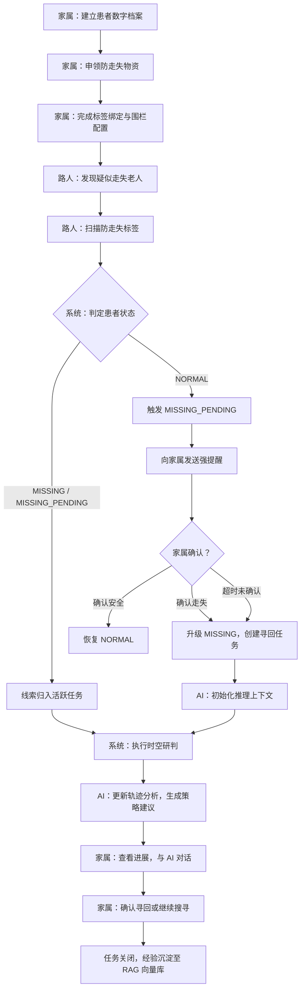
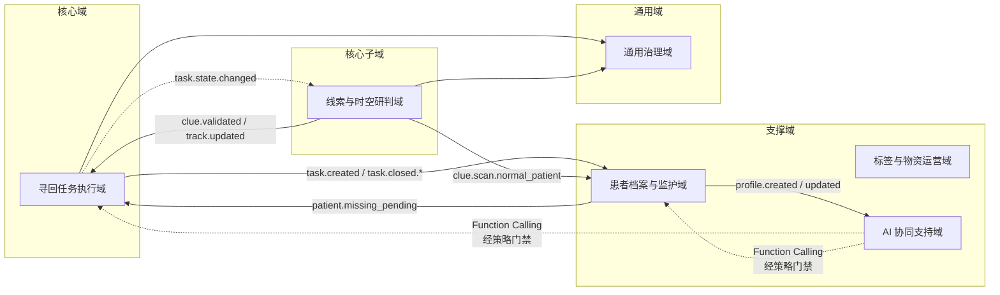
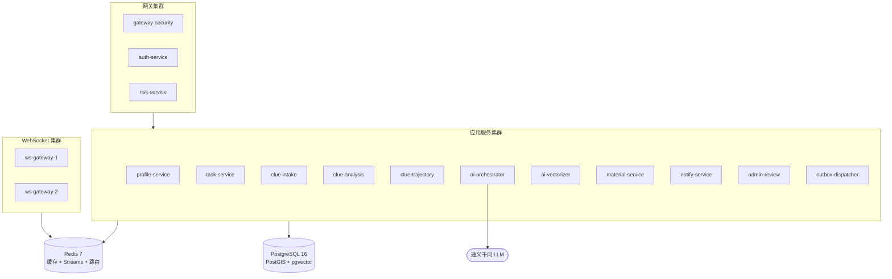
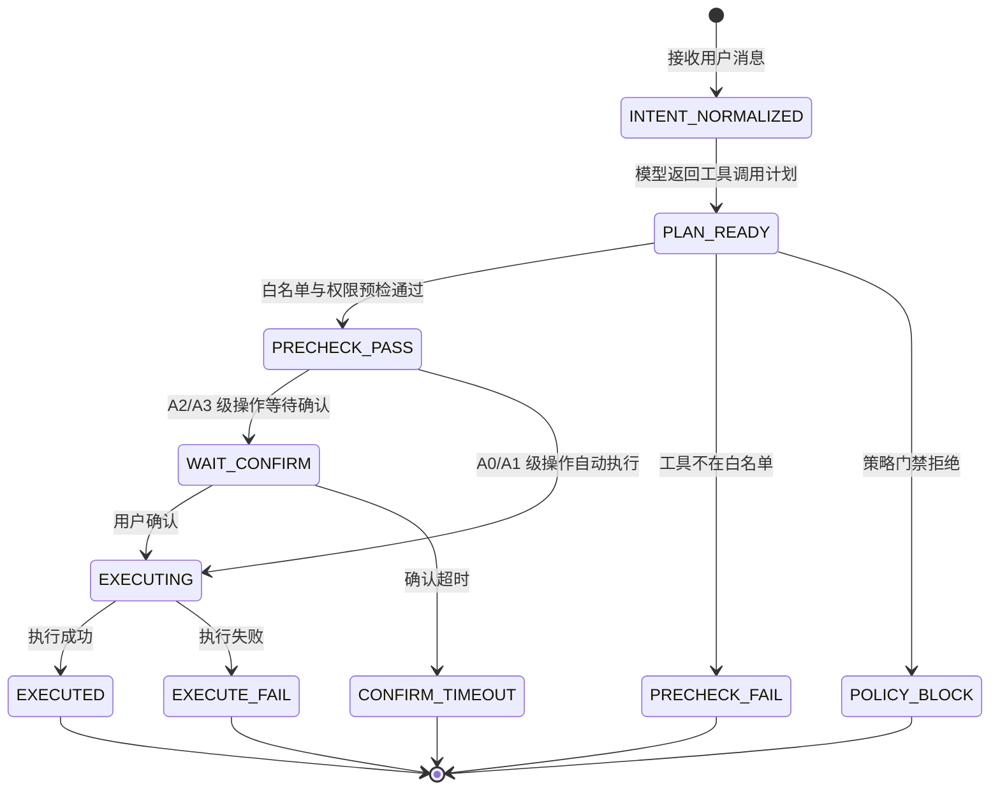
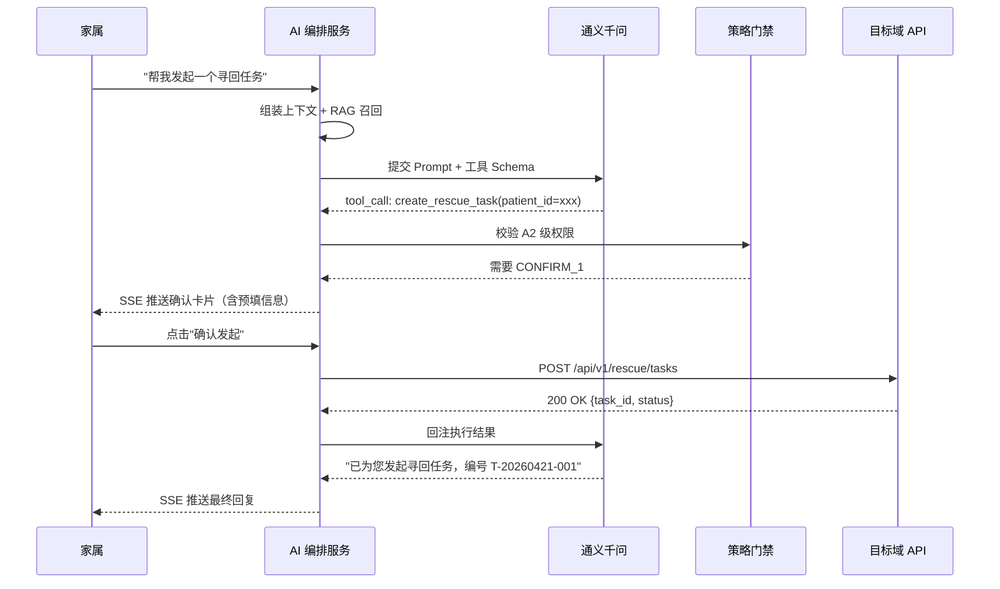
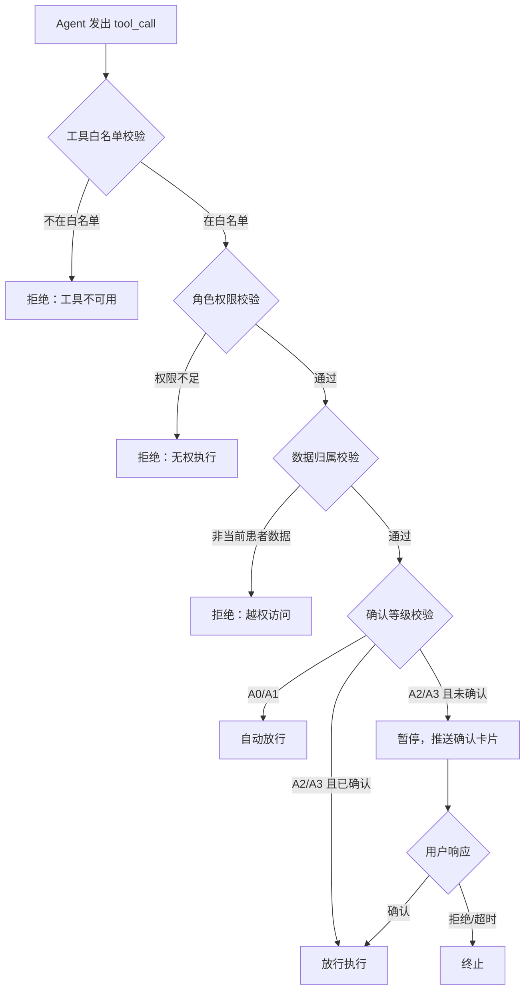
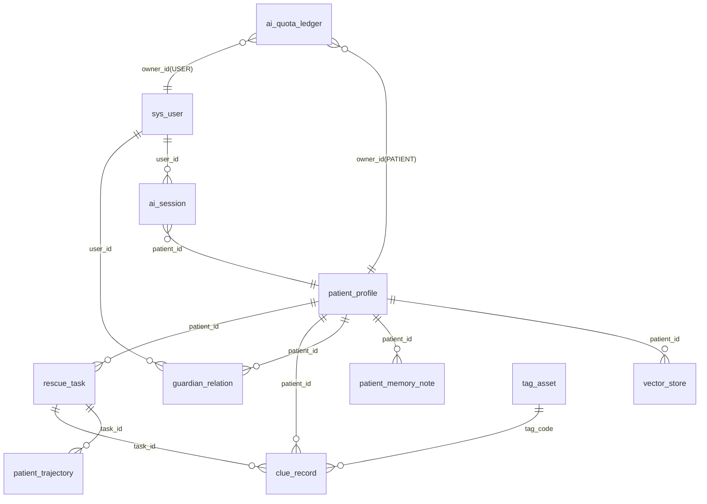
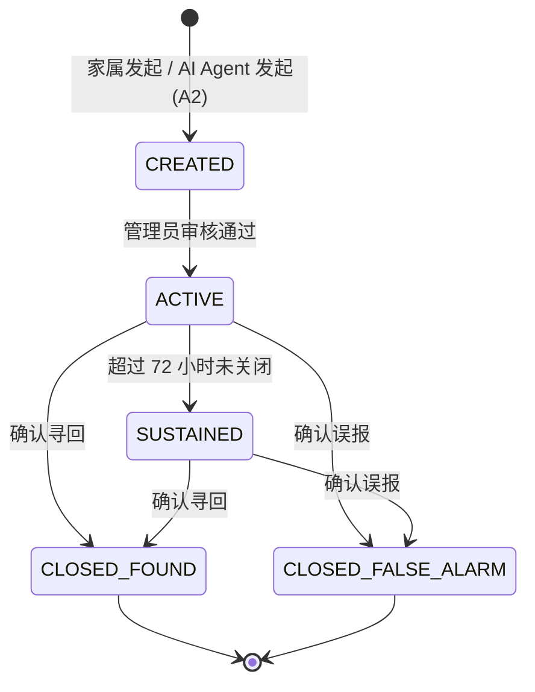

# 基于 AI Agent 的阿尔兹海默症 Alzheimer 患者协同寻回系统的设计与实现

---

## 摘 要

阿尔兹海默症（Alzheimer's Disease, AD）患者因空间定向能力的进行性丧失而频繁走失，现有寻人手段——传统报警、社交媒体扩散与 GPS 穿戴设备——普遍面临响应迟缓、信息碎片化与缺乏智能决策支持三重困境。一个值得追问的问题是：能否让大语言模型真正参与到走失寻回的决策链路中，而不仅仅充当一个"聊天窗口"？

本文围绕这一问题，设计并实现了一套以 AI Agent 为决策中枢的阿尔兹海默症患者协同寻回系统。系统的底层基础设施采用领域驱动设计方法论，将业务划分为寻回任务执行、线索时空研判、患者档案管理、标签物资运营、AI 协同决策与平台治理六大领域，以 Redis Streams 事件总线实现跨域异步协作，为 AI Agent 提供实时、可靠且无状态冲突的上下文运行环境。

系统的核心贡献在于 AI Agent 层的设计。在知识获取维度，系统构建了基于 pgvector 与 HNSW 索引的检索增强生成（Retrieval-Augmented Generation, RAG）管线——患者档案的长文本经 450 Token 目标长度分块后，由阿里云百炼 Embedding 模型映射为 1024 维向量，写入按 `patient_id` 物理隔离的向量存储表，查询时以余弦距离执行近似最近邻检索，召回与当前对话语义相关的历史档案与走失经验片段，注入提示词上下文供模型推理。在行为执行维度，AI Agent 通过 Spring AI Alibaba 框架的 Function Calling 机制，将大模型的意图识别结果映射为对各业务域标准 REST API 的结构化调用，使 Agent 具备发起寻回任务、查询轨迹、生成海报等实际业务操作能力。在安全管控维度，系统引入策略门禁（Policy Guard）与 A0–A4 五级执行分级体系，形成"Human-in-the-loop"人机协同闭环——只读观测类操作自动放行，涉及状态变更的写操作必须经家属显式确认方可执行，不可逆的高风险操作则从架构层面永久禁止 Agent 触发，从根本上规避了大模型幻觉（Hallucination）可能引发的业务越权风险。

在协同流程层面，系统提出了"路人扫码触发疑似走失 + 家属确认或超时自动升级"的三态走失发现机制（`NORMAL` → `MISSING_PENDING` → `MISSING`），有效缩短走失感知窗口。线索模块通过基于 PostGIS 空间函数的防漂移速率校验算法，自动过滤时空逻辑异常的坐标点，保障进入 AI 推理上下文的轨迹数据质量。

测试表明，AI 对话的 SSE 流式首字节响应时间控制在 3.5 秒以内，RAG 知识召回在患者维度隔离条件下保持稳定的检索精度，策略门禁对非授权写操作的拦截成功率达到 100%。本文的实践证明，将大语言模型的推理能力经由 Function Calling 与策略门禁安全桥接至事件驱动的微服务体系，能够在保障业务状态一致性的前提下，为走失寻回场景注入切实可用的智能决策支持。

**关键词**：阿尔兹海默症；AI Agent；检索增强生成；Function Calling；人机协同；策略门禁

---

## Abstract

Patients with Alzheimer's Disease (AD) frequently wander due to progressive loss of spatial orientation. Existing rescue approaches — police reports, social media dissemination, and GPS wearable devices — commonly suffer from delayed response, fragmented information, and a lack of intelligent decision support. This raises a fundamental question: can large language models participate meaningfully in the decision chain of wandering retrieval, rather than merely serving as a conversational interface?

This thesis addresses this question by designing and implementing a collaborative retrieval system for Alzheimer's patients with an AI Agent as its decision-making core. The underlying infrastructure employs Domain-Driven Design methodology, decomposing the business into six bounded contexts — Rescue Task Execution, Clue Spatiotemporal Analysis, Patient Profile Management, Tag and Material Operations, AI Collaborative Decision-Making, and Platform Governance — interconnected through a Redis Streams event bus that provides the AI Agent with a real-time, reliable, and conflict-free contextual runtime environment.

The system's primary contribution lies in the AI Agent layer. For knowledge acquisition, the system constructs a Retrieval-Augmented Generation (RAG) pipeline based on pgvector and HNSW indexing: long-text patient profiles are chunked at a target length of 450 tokens, mapped into 1024-dimensional vectors by Alibaba Cloud's DashScope Embedding model, and stored in a vector table physically partitioned by `patient_id`. At query time, approximate nearest neighbor search with cosine distance retrieves historical profile fragments and past wandering experience semantically relevant to the current dialogue, which are injected into the prompt context for model reasoning. For action execution, the AI Agent leverages the Function Calling mechanism of the Spring AI Alibaba framework, mapping the model's intent recognition results to structured invocations of standard REST APIs across business domains, enabling the Agent to perform real business operations such as initiating rescue tasks, querying trajectories, and generating search posters. For safety governance, the system introduces a Policy Guard with a five-tier execution classification (A0–A4), establishing a Human-in-the-loop collaborative closed loop: read-only observational operations are automatically permitted; write operations involving state changes require explicit family confirmation before execution; irreversible high-risk operations are permanently prohibited from Agent invocation at the architectural level, fundamentally mitigating the risk of business overreach caused by large model hallucinations.

At the collaborative workflow level, the system proposes a three-state wandering detection mechanism ("passerby scan triggers suspected wandering + family confirmation or automatic timeout escalation": `NORMAL` → `MISSING_PENDING` → `MISSING`), effectively shortening the wandering perception window. The clue module employs an anti-drift velocity validation algorithm based on PostGIS spatial functions to automatically filter spatiotemporally anomalous coordinate points, ensuring the quality of trajectory data entering the AI reasoning context.

Testing demonstrates that the SSE streaming first-byte response time for AI dialogue is maintained within 3.5 seconds, RAG knowledge recall maintains stable retrieval precision under patient-dimension isolation, and the Policy Guard achieves a 100% interception rate for unauthorized write operations. This work demonstrates that bridging large language model reasoning capabilities to an event-driven microservice architecture through Function Calling and Policy Guard can inject practically viable intelligent decision support into wandering retrieval scenarios while preserving business state consistency.

**Keywords**: Alzheimer's Disease; AI Agent; Retrieval-Augmented Generation; Function Calling; Human-in-the-loop; Policy Guard

<!-- THESIS_PART_1_END -->

---

## 第 1 章 绪论

### 1.1 研究背景及意义

阿尔兹海默症（Alzheimer's Disease, AD）是最常见的痴呆类型，约占全部痴呆病例的六到七成。患者在中晚期阶段会经历严重的空间定向障碍与记忆丧失，走失几乎成为一种必然会发生的事故而非偶然。据国际阿尔茨海默病协会（Alzheimer's Disease International, ADI）的报告，全球痴呆患者已超过 5500 万，预计 2050 年将突破 1.39 亿。我国是全球 AD 患者最多的国家之一，总数逾千万且仍在增长。

走失带来的后果相当残酷。失去自我保护能力的患者暴露在交通事故、跌倒受伤、脱水与低温等风险之下，部分案例以死亡告终。对家庭而言，走失事件带来的远不止经济负担——心理创伤往往难以估量。而从公共资源的视角看，传统搜寻严重依赖公安系统与志愿者的人力投入，单次搜寻行动的社会成本极高，效率却很难保障。

现有应对手段大致可归为三类。传统报警与线下搜索，响应周期长，信息在警方与家属间传递效率低下；基于社交媒体的信息扩散，虽能扩大传播范围，但线索质量参差不齐，缺乏系统化的汇聚与研判；基于 GPS 的穿戴设备，局限于续航有限、患者佩戴依从性差、设备脱落后追踪链路即告断裂。三类手段都指向同一个共性缺陷：没有一个方案真正引入了"智能"——它们能传递信息，却无法对信息做出判断。

那么，如果让大语言模型（Large Language Model, LLM）参与到寻回的决策链路中，情况会有什么不同？模型能否在碎片化的线索流中提炼方向性建议？能否根据患者的行为习惯与历史走失经验给出个性化的搜寻策略？这些问题构成了本文的研究出发点。构建一套集多主体协作、实时线索汇聚、时空研判与 AI 辅助决策于一体的协同寻回系统，对于缩短走失后的黄金救援窗口、保障患者生命安全、减轻家庭与社会负担，具有切实的现实价值。

### 1.2 国内外研究现状

#### 1.2.1 国外研究现状

国外在 AD 患者走失防护领域起步较早，技术方案已形成一定体系。

硬件定位方面，美国 Project Lifesaver 的射频定位方案为患者佩戴射频手环，配合搜救队伍手持方向性天线追踪，在部分社区取得了较高的寻回成功率。英国阿尔茨海默协会推广的 GPS 追踪设备（如 Mindme、Buddi 等）则实现了实时位置监控与地理围栏告警。然而这类方案的根本局限在于"单点追踪"范式——电量耗尽、设备被摘除或密封老化失效，整条定位链路就断了。系统没有在设备离线后继续追踪的能力，说白了，它只能在设备正常工作时保护患者。

软件平台方面，美国 Silver Alert 系统仿照 Amber Alert 的模式，走失后通过广播、高速公路电子标牌和社交媒体发布信息。荷兰 Amber Alert Europe 进一步扩展了跨国预警网络。但这些平台的本质仍是单向信息推送，缺乏双向线索收集与自动化研判能力。信息发出去了，可谁来判断哪些线索可信、哪些是噪声？

人工智能应用方面，深度学习在行人重识别（Person Re-identification, Re-ID）领域取得了显著进展，部分研究将其应用于走失人员的视频监控识别。不过此类方案对监控基础设施覆盖密度的依赖极高，在农村和城郊的适用性有限。大语言模型技术的爆发为走失场景下的智能决策提供了新的想象空间，但将 LLM 与走失寻回业务做深度集成的系统化实践，目前仍处于早期探索阶段。

#### 1.2.2 国内研究现状

国内在失智老人走失防护方面也有一些进展。政府层面，部分城市公安系统建立了走失人员信息发布平台，民政部门推动的"关爱失智老人黄手环行动"通过发放印有求助信息的物理标识，在社区层面提供了辅助辨识能力。

技术产品层面，中国移动"和目"、阿里巴巴"团圆"等平台在走失信息快速扩散与公众参与方面做了有益探索。智能穿戴设备厂商推出了面向老年人的 GPS 定位手表与鞋垫，但同样面临设备脱落、续航不足与佩戴意愿低等老问题。学术研究方面，部分高校针对走失场景提出了基于物联网（IoT）的监护方案与社交网络协同寻人模型，但在系统工程的完整性、线索的可信研判以及 AI 辅助决策的深度集成方面，仍有较大空间。

#### 1.2.3 现有方案的不足与本文切入点

梳理国内外现状后，可以看到现有方案的短板集中在四个维度：

**协作模式单一。** 大多数系统以单向信息发布或单点设备追踪为主，缺乏将家属、路人、管理平台纳入同一协同流程的多主体参与机制。

**线索治理能力薄弱。** 路人上报的线索未经系统化的时空一致性校验与可信度研判，有效线索与干扰信息混杂，直接拉低了寻回决策的准确性。

**AI 决策支持缺失。** 大语言模型在自然语言理解和推理方面展现了强大能力，但还没有成熟的系统将其与走失寻回的完整流程做深度整合——不是简单地套一层对话界面，而是让 AI 真正能查询数据、发起操作、给出有依据的策略建议。

**安全可控性不足。** 即便引入了 AI，如何防止模型幻觉导致的错误操作？如何在赋予 AI 行动能力的同时保留人类的最终决策权？这是一个被普遍忽视但极其关键的问题。

本文正是从这四个维度切入，以"AI Agent 深度集成、人机协同安全管控、多主体协同寻回"为目标，聚焦解决 AI 在走失寻回场景中的知识获取（RAG）、行为执行（Function Calling）与安全治理（Policy Guard）三大核心问题。

<!-- THESIS_PART_2_END -->

### 1.3 本文主要工作与创新点

本文围绕 AI Agent 在阿尔兹海默症患者协同寻回场景中的设计与实现，完成了以下工作：

**（1）设计了以 AI Agent 为决策中枢的协同寻回系统架构。** 系统以六域微服务为底层运行基础设施，以 Redis Streams 事件总线为跨域协作骨架，在其上构建了 AI Agent 编排层。Agent 并非一个孤立的对话模块，而是通过事件订阅获取实时业务上下文（线索更新、任务状态变迁、轨迹增量），通过 Function Calling 向各业务域发出操作指令，通过策略门禁接受安全管控——它被嵌入到整个系统的血液循环中。

**（2）构建了面向走失场景的 RAG 检索增强生成管线。** 患者的数字档案（体貌特征、常去地点、生活习惯）与历史走失经验经文本分块、向量化后写入 pgvector 向量存储。查询时按患者维度物理隔离执行 HNSW 近似最近邻检索，召回语义相关的知识片段注入提示词上下文。这一机制使 AI 不再凭空推理，而是基于患者专属的真实信息生成个性化建议——比如，患者有"下午常去公园东门"的习惯记录，AI 就能据此建议优先搜索该区域。

**（3）实现了 Function Calling 驱动的 AI 行为执行框架。** 传统 AI 对话系统的输出止步于文本，本系统的 Agent 则能将大模型的意图识别结果映射为对业务 API 的结构化调用——查询最新线索、发起寻回任务、生成寻人海报。这种"意图到行为"的桥接通过 Spring AI Alibaba 框架的 `@Tool` 注解机制实现，每个可调用工具都绑定了明确的输入输出契约与执行权限等级。

**（4）提出了基于策略门禁的 A0–A4 五级人机协同安全模型。** 这是本文的核心安全贡献。AI 的每一次写操作都必须穿越策略门禁的校验链路：A0 级只读操作自动放行；A1 级生成建议供参考；A2/A3 级写操作需家属物理点击确认；A4 级不可逆操作永久禁止 Agent 触发。这套分级机制从架构层面而非提示词层面约束了 AI 的行为边界，即使模型产生幻觉也无法绕过门禁执行越权操作。

**（5）实现了多主体协同的走失发现与线索治理机制。** 系统引入三态走失模型（`NORMAL` → `MISSING_PENDING` → `MISSING`），通过路人扫码触发与家属确认或超时升级的双入口机制缩短感知窗口。线索模块基于 PostGIS 空间函数实现防漂移速率校验，自动过滤时空逻辑异常坐标，保障进入 AI 推理上下文的数据可信。

本文的创新点集中体现在：一是将 AI Agent 的 Function Calling 能力与领域驱动设计的标准域接口安全桥接，通过策略门禁实现了"AI 能做事但不能乱做事"的人机协同模式；二是构建了按患者维度物理隔离的 RAG 知识管线，使 AI 推理具备个性化与隐私安全的双重保障；三是提出了三态走失发现机制，将被动等待家属报警转变为主动感知走失信号。

### 1.4 论文组织结构

本文共分八章，各章安排如下：

**第 1 章 绪论。** 阐述了 AD 患者走失问题的研究背景与社会意义，分析了国内外现有寻人系统的研究现状与技术短板，明确了以 AI Agent 为核心的研究切入点与本文的主要工作和创新点。

**第 2 章 核心技术与开发环境。** 对系统涉及的关键技术进行阐述，侧重于 AI 相关技术栈（Spring AI Alibaba、pgvector 与 RAG、大语言模型集成），同时简要介绍支撑 AI 运行的底层基础设施技术（Spring Boot 微服务、领域驱动设计、PostgreSQL、Redis Streams）。

**第 3 章 系统需求分析。** 从可行性分析、业务流程、功能性需求与非功能性需求四个维度剖析系统需求，以 AI 协同决策能力为需求叙述的主线。

**第 4 章 系统总体设计。** 阐述系统的分层架构与领域划分，将微服务体系、事件驱动机制与通知网关定位为 AI Agent 运行所依赖的基础设施层。

**第 5 章 AI Agent 的设计与实现。** 本文的核心章节。深入阐述 Agent 架构总体设计、RAG 检索增强生成管线（文本分块、Embedding 向量化、HNSW 索引检索、患者维度隔离）、Function Calling 意图-API 桥接机制、Policy Guard 策略门禁与人机协同分级、配额管控、失败容错与上下文溢出防护。

**第 6 章 系统核心模块的设计与实现。** 阐述数据库设计、寻回任务模块与线索研判模块的详细设计，作为支撑 AI Agent 运行的业务基础设施。

**第 7 章 系统测试与评估。** 以 AI Agent 评估为重心，涵盖 SSE 流式响应时间、RAG 知识召回评估、策略门禁拦截率测试，以及核心功能验证与安全测试。

**第 8 章 总结与展望。** 总结研究工作与成果，分析系统不足并展望未来改进方向。

### 本章小结

本章从 AD 患者走失的社会现实出发，分析了现有寻人手段的痛点与技术瓶颈，提出了以 AI Agent 深度集成为核心的研究动机。在梳理国内外研究现状后，明确了本文在 RAG 知识管线、Function Calling 行为执行、策略门禁安全管控三个维度的主要工作与创新点，并给出了全文的组织结构。

<!-- THESIS_PART_3_END -->

---

## 第 2 章 核心技术与开发环境

本章对系统所依赖的关键技术进行阐述。鉴于本系统的核心贡献在于 AI Agent 层，技术阐述的篇幅分配遵循"AI 技术为主、基础设施技术为辅"的原则：§2.1–§2.3 简要介绍支撑 AI 运行的微服务框架、领域建模方法论与数据存储引擎；§2.4–§2.6 重点展开 AI 相关的核心技术栈——向量检索与 RAG、大语言模型集成框架、事件驱动基础设施（作为 AI 上下文的实时数据供给通道）。

### 2.1 Spring Boot 微服务框架

Spring Boot 是基于 Java 语言的快速应用开发框架，核心理念为"约定优于配置"（Convention over Configuration）。通过内嵌 Servlet 容器、自动化配置与 Starter 依赖管理，它将开发者从繁琐的基础配置中解放出来。在本系统中，Spring Boot 3.x 作为各微服务节点的运行框架，基于 Jakarta EE 规范运行于 Java 21 虚拟机，利用虚拟线程（Virtual Threads）在 I/O 密集型场景下获取更高的并发吞吐。

Spring Cloud Gateway 作为微服务的统一入口，负责请求路由与安全策略执行。所有外部请求经网关完成身份验证与请求去重后方可触达业务服务。这种接入层与业务层的职责隔离，对 AI Agent 而言意味着一个关键保障：Agent 通过 Function Calling 发出的每一个 API 调用，都必须经过与普通用户请求相同的安全检查链路，不存在"后门"。

### 2.2 领域驱动设计思想

领域驱动设计（Domain-Driven Design, DDD）是 Eric Evans 提出的软件工程方法论，核心主张是将复杂业务逻辑封装于领域模型中，通过限界上下文（Bounded Context）、聚合根（Aggregate Root）与领域事件（Domain Event）构建高内聚、低耦合的软件架构。

本系统引入 DDD 的直接动因在于业务本身的领域复杂度——患者档案管理、监护权协同、走失任务执行、匿名线索研判、物资运营、AI 决策支持与平台治理等子领域相互关联却各自独立。更深层的原因是：DDD 的标准域接口（每个域暴露标准 REST API 并严格封装内部状态机）恰好构成了 AI Agent 通过 Function Calling 调用的"工具集"。换言之，DDD 不仅仅是一种架构方法论，它直接为 AI Agent 提供了可调用、可约束、可审计的行为边界。

基于 DDD 战略设计，系统划分为六大限界上下文：寻回任务执行域（核心域）、线索与时空研判域（核心子域）、患者档案与监护域（支撑域）、标签与物资运营域（支撑域）、AI 协同支持域（支撑域）与通用治理域（通用域）。各域拥有独立的聚合根与状态机，跨域协作通过领域事件驱动，而非直接数据库共享。

### 2.3 PostgreSQL 与 PostGIS 空间数据库

PostgreSQL 16 作为系统的主数据存储引擎，承担三重角色。

其一，事务一致性保障。系统核心状态变更（如任务状态流转、线索研判结果写入）必须与事件记录在同一本地事务中原子提交，PostgreSQL 的严格 ACID 语义为此提供了基础。

其二，空间计算能力。通过集成 PostGIS 3.4 扩展，系统获得了地理空间数据处理能力。线索坐标采用 WGS84 坐标系（SRID=4326）的 `geometry(Point, 4326)` 类型存储，围栏越界判定基于 `ST_DWithin` 空间函数实现，相邻线索间距计算基于 `ST_Distance` 函数完成。PostGIS 的 GiST 索引为空间查询提供高效检索。这些空间计算的结果——轨迹数据、围栏状态、线索的有效性判定——最终都会流入 AI Agent 的推理上下文，成为 Agent 生成搜寻策略建议的事实依据。

其三，向量检索能力。通过集成 pgvector 0.7+ 扩展（详见 §2.4），同一数据库实例同时支撑关系事务、空间计算与向量检索三类工作负载，消除了外部向量数据库的运维负担与数据一致性风险。

<!-- THESIS_PART_4_END -->

### 2.4 pgvector 向量检索与 RAG 技术

pgvector 是 PostgreSQL 的向量相似度搜索扩展，为数据库增加了 `vector` 数据类型与近似最近邻（Approximate Nearest Neighbor, ANN）检索能力。ANN 的核心思想是牺牲一定的检索精确度换取数量级的速度提升——对于高维向量空间中的相似性查询，精确搜索的时间复杂度为 $O(N)$，而 ANN 算法通过构建索引结构将其降至近似 $O(\log N)$。

本系统选用 pgvector 0.7+ 版本，采用 HNSW（Hierarchical Navigable Small World）索引算法。HNSW 的核心思想源自跳表（Skip List）的分层导航结构：在构建阶段，算法将向量节点逐层插入多层图结构，低层图包含所有节点、高层图仅保留稀疏的"枢纽节点"；在检索阶段，查询从最高层出发做粗粒度跳跃，逐层下沉做精细邻域搜索，最终在底层收敛至 Top-K 近邻。关键构建参数 $m$（每层连接数）与 $ef\_construction$（构建时搜索窗口大小）决定了索引的质量与构建耗时，查询参数 $ef\_search$ 则在检索精度与延迟之间提供可调节的旋钮。本系统的参数配置为 $m=32$、$ef\_construction=256$，查询时 $ef\_search=80$，距离度量采用余弦距离（cosine distance）。

为什么选择 pgvector 而非 Milvus、Pinecone 等独立的向量数据库？答案与数据一致性有关。患者档案的向量检索必须与业务数据的有效性过滤（`valid=true`、`deleted_at IS NULL`）在同一查询中完成——如果向量存储与业务数据库分离，就不得不面对"向量库已更新但业务库尚未同步"的一致性窗口。同库部署天然消除了这个问题。在当前系统的数据规模下，pgvector 的性能完全满足需求。

检索增强生成（Retrieval-Augmented Generation, RAG）是将外部知识库检索与大语言模型生成能力相结合的技术范式。它的出发点很朴素：大模型的参数中储存的是训练时的通用知识，而走失寻回需要的是特定患者的专属信息——这位患者叫什么名字、体貌特征如何、有哪些常去的地方、上次走失是什么情况。这些信息不可能存在于模型参数中，必须在推理时从外部注入。RAG 正是完成这一注入的桥梁：先检索，再生成。检索保证了事实依据的存在，生成保证了自然语言表达的流畅。两者结合，有效缓解了大模型"幻觉"（Hallucination）问题——模型不再凭空编造，而是基于检索到的真实片段进行推理。RAG 管线在本系统中的具体实现将在第 5 章 §5.2 中深入展开。

### 2.5 Spring AI Alibaba 与大语言模型集成

Spring AI 是 Spring 生态面向人工智能应用的集成框架，提供了对主流大语言模型的统一抽象接口，核心组件包括 `ChatClient`（对话客户端）、`Embedding`（向量化接口）与 `FunctionCallback`（工具回调）。Spring AI Alibaba 是其阿里云适配实现，提供了与阿里云百炼平台（DashScope）和通义千问系列模型的原生集成。

本系统选择 Spring AI Alibaba + 通义千问的技术组合，有三方面考量：

一是 Function Calling 的原生支持。Spring AI Alibaba 的 `ChatClient` + `@Tool` 注解机制天然支持 AI Agent 的 Tool-Use 编排范式。开发者只需将业务操作封装为带 `@Tool` 注解的 Java 方法，框架会自动将方法签名转换为 Function Schema 提交给大模型；模型在推理过程中识别到需要调用工具时，返回结构化的 `tool_call` 指令，框架解析指令后调用对应方法并将执行结果回注模型上下文。这种机制使 AI Agent 能够"做事"而非仅仅"说话"。

二是中文语义能力。通义千问在中文语境下的理解与推理能力经过大量中文语料训练，契合本系统面向中文用户的场景。对走失寻回而言，家属的表述往往带有强烈的情绪色彩和口语特征（"我爸走丢了，他可能去了那个他以前常去的那个什么公园"），模型需要从中准确提取意图与实体。

三是 SSE 流式输出。百炼平台支持 Server-Sent Events（SSE）流式返回，模型推理结果逐 Token 推送至客户端，首字节响应时间（Time To First Byte, TTFB）显著优于等待完整响应的同步模式。对于走失场景下焦虑等待的家属，尽快看到 AI 开始"思考"的反馈，其心理意义不可忽视。

### 2.6 Redis Streams 事件驱动基础设施

Redis Streams 是 Redis 5.0 引入的持久化日志数据结构，提供追加写入、Consumer Group 消费、消息确认（`XACK`）与消息重放等能力。本系统选用 Redis Streams 而非 Apache Kafka 作为事件总线，核心理由在于系统已依赖 Redis 承担缓存、请求去重与 WebSocket 路由存储，复用同一 Redis 实例作为事件通道可显著降低基础设施的运维成本。在当前的项目规模下，Redis Streams 的吞吐量与持久化能力已能满足需求。

Redis Streams 在系统中的角色与其说是"消息队列"，不如说是 AI Agent 的"实时信息供给管道"。当线索研判服务完成有效性判定后发布 `clue.validated` 事件，当任务状态发生迁移后发布 `task.state.changed` 事件——这些事件不仅驱动各业务域的异步协作，也会被 AI 编排服务订阅，用于更新 Agent 的实时上下文窗口。AI Agent 之所以能给出"有新线索出现在城南公园附近，建议优先前往"这样的时效性建议，正是因为它通过事件订阅获取了最新的线索坐标与轨迹增量。

系统的跨域一致性保障采用本地事务与 Outbox Pattern 的组合模式：业务状态变更与事件记录在同一数据库事务中原子提交，由异步调度器将事件投递至 Redis Streams。消费端通过本地幂等日志实现去重，通过事件版本号防止乱序——这些机制确保了 AI Agent 获取的业务上下文数据准确可靠，不会因事件丢失或重复而产生"上下文幻觉"。

### 2.7 开发与部署环境概述

表 2-1 列出了系统开发与部署所采用的主要环境配置。

**表 2-1 开发与部署环境**

| 类别 | 技术选型 | 版本 | 用途 |
|------|----------|------|------|
| 编程语言 | Java | 21 | 后端服务开发 |
| 基础框架 | Spring Boot | 3.x | 微服务运行框架 |
| 微服务网关 | Spring Cloud Gateway | 最新稳定版 | API 路由与安全策略 |
| AI 框架 | Spring AI Alibaba | 最新稳定版 | 大模型集成与 Agent 编排 |
| 大语言模型 | 通义千问（Qwen） | qwen-max-latest | AI 推理与策略生成 |
| Embedding 模型 | 阿里云百炼 | 最新稳定版 | 1024 维文本向量化 |
| 数据库 | PostgreSQL | 16 | 主数据与事务存储 |
| 空间扩展 | PostGIS | 3.4 | 地理空间计算 |
| 向量扩展 | pgvector | 0.7+ | 向量相似度检索（RAG） |
| 事件总线 | Redis Streams | 7.x | 事件驱动与异步解耦 |
| 分布式缓存 | Redis | 7.x | 缓存、去重、路由 |
| 推送服务 | 极光推送（JPush） | 最新稳定版 | App 离线通知推送 |
| 邮件服务 | SMTP | — | 账号验证与密码重置 |
| 前端（家属端） | Android 原生 | — | 家属移动应用 |
| 前端（路人端） | H5 移动网页（Vue.js） | — | 匿名线索上报 |
| 前端（管理端） | Web 管理后台（Vue.js） | — | 平台运营管理 |

### 本章小结

本章梳理了系统所依赖的核心技术栈。基础设施层面，Spring Boot 微服务框架、DDD 方法论与 PostgreSQL 数据库为系统提供了可靠的运行底座；AI 核心层面，pgvector + HNSW 索引为 RAG 管线提供了高效的向量检索能力，Spring AI Alibaba 框架的 Function Calling 机制使 AI Agent 具备了从"对话"到"行动"的跃迁基础，Redis Streams 则作为 AI 上下文的实时数据供给通道保障了推理信息的时效性。后续章节将基于这些技术基础展开系统的架构设计与详细实现。

<!-- THESIS_PART_5_END -->

---

## 第 3 章 系统需求分析

本章从可行性分析、业务流程分析、功能性需求与非功能性需求四个维度剖析系统需求。需求叙述以 AI 协同决策能力为主线——各模块的功能需求最终都汇聚为 AI Agent 可感知的业务上下文与可调用的业务操作。

### 3.1 可行性分析

#### 3.1.1 技术可行性

系统依赖的核心技术栈均具备成熟的开源生态与生产实践。Spring Boot 与 Spring Cloud 拥有庞大的社区支持；PostgreSQL 16 结合 PostGIS 与 pgvector，能够在同一实例中支撑关系事务、空间计算与向量检索；Redis Streams 经广泛验证，其高吞吐与持久化特性满足线索削峰需求。Spring AI Alibaba 提供了与通义千问大模型的原生集成接口，其 Function Calling 机制为 AI Agent 构建了可直接复用的工具调用框架。技术层面不存在不可克服的瓶颈。

#### 3.1.2 经济可行性

核心基础设施均为开源方案，无商业许可证费用。大语言模型采用阿里云百炼平台按量计费，初期成本可控。系统支持单节点演示与多节点部署两种模式，资源投入可按业务量级弹性调整。

#### 3.1.3 操作可行性

系统面向三类用户设计了差异化交互：家属端以 Android 原生应用为载体，提供自然语言交互（LUI）模式——家属可以用日常口语与 AI Agent 对话，无需学习复杂操作；路人端以 H5 移动网页为载体，扫码即可上报线索，无需注册；管理端以 Web 后台为载体，面向运营人员。三端均以"最少操作步骤完成核心任务"为设计原则。

### 3.2 业务流程分析

#### 3.2.1 系统主业务流程

系统的核心流程围绕"走失发现 → 线索汇聚 → AI 研判 → 寻回闭环"的主线展开。有别于传统系统的"发布信息等待反馈"的被动模式，本系统将 AI Agent 嵌入流程的每一个关键节点：走失发生后 AI 自动初始化推理上下文，线索到达后 AI 实时更新轨迹分析，策略建议随业务进展动态演化。系统主业务流程如图 3-1 所示。



**图 3-1 系统主业务流程图**

该流程有几个值得关注的设计细节。走失发现具备"路人扫码触发"与"家属主动发起"双入口——当路人扫码后系统将患者置为 `MISSING_PENDING` 态，若家属超时未确认，系统自动将状态升级为 `MISSING` 并创建任务，避免因家属不在身边导致响应延迟。线索上报全程匿名，路人无需注册。AI 策略建议基于实时线索与 RAG 召回的历史经验自动生成，但关闭任务的最终决策权始终保留在家属手中——这是人机协同设计的一个缩影。

#### 3.2.2 异常业务流程

系统针对异常场景设计了完整的容错机制：

**线索异常。** 当上报线索的时空逻辑存在冲突（如相邻两条线索的移动速率超出物理合理范围），该线索自动进入管理员复核队列，不阻塞主流程。

**扫码异常。** 二维码污损无法识别时，路人可通过手动输入 6 位短码上报，该入口受人机验证保护。若路人拒绝浏览器定位，系统提供地图选点功能作为替代。

**AI 异常。** 大模型服务超时或宕机时，系统切换至基于规则的推荐机制，确保线索地图展示与核心寻回流程不因 AI 单点故障而停滞。这一点或许是整个容错设计中最关键的：AI 是增强而非必需，系统在 AI 完全不可用时仍能运转。

**物资异常。** 物资工单发生物流异常时进入异常分支，支持"补发"或"作废"操作，避免工单卡在中间状态。

**任务超时。** 活跃任务超过设定时间无新线索时自动进入 `SUSTAINED` 长期维持态，降低推送频率为每日 AI 摘要模式，但仍持续接收线索。

<!-- THESIS_PART_6_END -->

### 3.3 功能性需求

系统的功能需求按业务模块划分为六个子系统。以下阐述中，AI 协同决策模块作为系统的核心差异化能力排在首位。

#### 3.3.1 AI 协同决策模块

AI 协同决策模块是本系统区别于传统寻人平台的核心模块。它不仅仅是一个"智能客服"，而是一个具备业务操作能力的 Agent。该模块的核心功能需求如表 3-1 所示。

**表 3-1 AI 协同决策模块核心功能需求**

| 编号 | 功能描述 | 优先级 |
|------|----------|--------|
| FR-AI-001 | 支持家属端基于自然语言与系统交互 | P0 |
| FR-AI-002 | 根据用户意图返回信息解答或可执行建议 | P0 |
| FR-AI-003 | 优先使用实时上下文（近期线索、轨迹、任务状态）推理 | P0 |
| FR-AI-004 | 基于患者档案的向量检索（RAG）辅助推理 | P0 |
| FR-AI-007 | 写操作经策略门禁分级校验，需用户确认方可执行 | P0 |
| FR-AI-008 | Prompt 中 PII 信息自动脱敏替换 | P0 |
| FR-AI-009 | 按用户与患者双维度独立计量配额，走失状态自动豁免 | P0 |
| FR-AI-010 | 模型异常时自动切换至规则推荐机制（L1–L4 分级容错） | P0 |
| FR-AI-012 | 支持 SSE 流式输出，降低首字节响应时间 | P1 |
| FR-AI-013 | 支持寻人海报生成，AI 输出 JSON 文案由系统渲染 | P1 |
| FR-AI-015 | AI 写操作须渲染确认按钮、展示预填摘要并记录审计 | P0 |

这里有一个关键约束：AI 的角色是"建议者"而非"执行者"。所有涉及状态变更的操作（发起任务、关闭任务等）均需家属物理点击确认后方可执行。AI Agent 的执行能力被划分为 A0（自动观测）至 A4（人工专属）五级，A4 级操作永不允许 Agent 自动执行。

#### 3.3.2 线索与时空研判模块

线索模块负责接收、校验与研判匿名路人上报的线索，并将有效线索聚合为 AI 可消费的时空轨迹。核心需求包括：匿名上报（GPS 定位与地图选点双模式）、实体标签扫码与手动短码三种入口、基于患者状态的差异化信息展示（`NORMAL` 态仅提示已通知家属，`MISSING` 态展示救援信息）、防漂移速率校验、围栏越界被动判定、高风险线索人工复核。

线索模块的输出是 AI 推理的关键输入：有效线索的坐标序列构成轨迹数据，轨迹数据经事件推送进入 AI 的实时上下文窗口，AI 据此生成方向性搜寻建议。可以说，线索模块的数据质量直接决定了 AI 建议的可信度。

#### 3.3.3 患者档案与标识模块

该模块提供患者数字档案的数据流转管理，同时为 AI 的 RAG 管线提供原始知识来源。核心需求包括：患者建档（近期照片、基础信息、体貌特征标签）、长文本描述同步写入向量空间（常去地点、生活习惯等，这些信息将成为 RAG 召回的知识片段）、唯一 6 位短码生成、1:N 标签绑定、监护协同（邀请、移除）、主监护权双阶段转移、档案注销时 PII 脱敏擦除与向量数据物理删除。

#### 3.3.4 寻回任务执行模块

寻回任务是系统的核心状态机。核心需求包括：同一患者同一时间仅允许一个进行中任务；任务发起同步置患者为 `MISSING`，关闭恢复为 `NORMAL`；发起时引导补录当日着装特征（这是线索匹配的最高视觉锚点）；关闭分"确认寻回"（`CLOSED_FOUND`）与"误报"（`CLOSED_FALSE_ALARM`）两种，误报须填写原因；确认寻回后异步将走失轨迹摘要持久化至向量库供 RAG 调用，而误报数据严格阻断进入向量库。

#### 3.3.5 物资运营模块

该模块负责防走失标签的申领、发货、绑定与异常处置。需求相对直接：标签申领审核发货签收的基础流转、发货时记录标签短码完成工单映射、绑定完成后自动将工单流转为已签收、工单异常的闭环处置（补发或作废）、批量发号与导出。

#### 3.3.6 身份权限与治理模块

该模块为全系统提供统一的身份标识、权限控制、审计日志与配置管理。核心需求包括：注册用户与匿名路人的差异化身份标识（JWT 与设备指纹）、资源属主校验（防止越权访问）、基于角色的功能控制、PII 动态脱敏、状态变更审计（含 `action_source` 标识区分用户操作与 AI Agent 操作）、统一参数配置中心（业务阈值动态可调）、多渠道通知（WebSocket 定向下发、极光推送、SMTP 邮件、站内通知）。

### 3.4 非功能性需求

非功能性需求从性能、安全与可用性三个维度设定量化约束。其中，与 AI Agent 直接相关的指标（SSE 首字节时间、策略门禁响应）被纳入核心考核范围。主要指标如表 3-2 所示。

**表 3-2 非功能性需求指标**

| 类别 | 指标项 | 目标值 |
|------|--------|--------|
| 性能 | 核心读操作平均响应时间 | ≤ 500ms |
| 性能 | 核心写操作平均响应时间 | ≤ 1200ms |
| 性能 | AI SSE 流式首字节响应时间（TTFB） | ≤ 3.5s |
| 性能 | 跨域一致性时延（事件发布到状态收敛） | TP99 ≤ 3s |
| 安全 | 公网 API 通信加密 | HTTPS/TLS 1.2+ |
| 安全 | PII 数据展示脱敏 | 强制执行 |
| 安全 | 策略门禁对非授权 AI 写操作的拦截率 | 100% |
| 安全 | 审计日志保存时长 | ≥ 180 天 |
| 可用性 | AI 不可用时系统核心流程可运转 | 是 |

在安全性方面，系统需满足以下约束：公网通信强制 HTTPS 加密；写接口支持幂等去重（通过 `X-Request-Id` 实现）；全链路透传追踪标识（`X-Trace-Id`）；匿名入口执行设备指纹、频率与地理位置联合校验；非属主视图的患者隐私数据强制动态脱敏；通知渠道通过 `NotificationPort` 接口统一抽象，禁止业务层直接调用渠道实现类。

### 本章小结

本章从可行性、业务流程、功能需求与非功能需求四个维度完成了系统需求分析。六大模块的功能需求最终指向一个核心目标：为 AI Agent 提供可感知的实时业务上下文（来自线索、任务、轨迹模块的事件流）与可调用的安全业务操作（来自各域标准 API 与策略门禁）。非功能需求中，AI SSE 首字节时间与策略门禁拦截率被纳入核心考核指标，体现了系统以 AI Agent 为重心的设计导向。

<!-- THESIS_PART_7_END -->

---

## 第 4 章 系统总体设计

本章阐述系统的总体架构、领域划分与部署方案。与传统架构设计文档不同，本章将微服务体系、事件驱动机制与通知网关明确定位为 AI Agent 运行所依赖的基础设施层——它们的存在是为了向 AI 提供实时、可靠且状态一致的业务上下文环境，以及可安全调用的标准化业务操作接口。

### 4.1 总体系统架构

#### 4.1.1 分层架构设计

系统采用六层架构，各层职责如表 4-1 所示。

**表 4-1 系统分层架构**

| 层级 | 核心职责 | 对 AI Agent 的意义 |
|------|----------|--------------------|
| 接入安全层 | 路由、鉴权、限流、请求去重、匿名风控 | AI 的 Function Calling 请求经此层校验，与用户请求同等安全标准 |
| 应用层 | 用例编排、事务边界、跨域协调 | 为 AI 工具调用提供标准化的 API 入口 |
| 领域层 | 聚合根、状态机、领域服务 | 状态迁移的唯一权威，AI 不可绕过 |
| 事件与集成层 | Redis Streams 解耦、Outbox 投递 | AI 实时上下文的数据供给通道 |
| 数据基础设施层 | 存储、缓存、向量、消息 | RAG 向量检索与空间计算的基础 |
| 治理层 | 身份、权限、审计、配置 | 策略门禁（Policy Guard）的执行基座 |

这种分层的一个关键含义是：AI Agent 在架构中并非凌驾于业务之上，而是被嵌入到与普通用户相同的访问链路中。Agent 发出的每一个 Function Calling 请求都必须经过接入安全层的身份校验、应用层的业务规则校验、领域层的状态机约束——不存在特权通道。

#### 4.1.2 领域划分与六域协作

基于 DDD 战略设计，系统划分为六大限界上下文。表 4-2 从 AI 视角标注了各域的角色。

**表 4-2 六域划分与 AI 协作关系**

| 领域 | 定位 | AI Agent 的交互方式 |
|------|------|---------------------|
| 寻回任务执行域（TASK） | 核心域 | Agent 可查询任务快照、建议创建/关闭任务（需确认） |
| 线索与时空研判域（CLUE） | 核心子域 | Agent 可查询线索列表与轨迹数据，生成分析摘要 |
| 患者档案与监护域（PROFILE） | 支撑域 | Agent 可查询档案、修改围栏配置（需确认） |
| 标签与物资运营域（MAT） | 支撑域 | Agent 可提交物资申领、上报标签遗失（需确认） |
| AI 协同支持域（AI） | 支撑域 | Agent 编排服务所在域，管理会话、配额与向量化 |
| 通用治理域（GOV） | 通用域 | 提供策略门禁、通知网关、审计日志 |

域间协作遵循事件驱动原则。TASK 域是任务状态的唯一权威源，任何外部模块（包括 AI Agent）均不可直接修改任务状态；PROFILE 域管理患者走失状态的三态迁移；AI Agent 通过 Function Calling 调用各域标准 REST API，所有写操作经策略门禁后由目标域自身完成状态变更。域间关系如图 4-1 所示。



**图 4-1 六域协作关系图**

#### 4.1.3 微服务拆分

系统共拆分为 15 个独立可部署的微服务。其中与 AI 直接相关的两个服务为：ai-orchestrator-service（AI Agent 编排、Function Calling、推理与策略事件）与 ai-vectorizer-service（文本切片、向量写入与失效清理）。线索域拆分为入口、研判与轨迹三个服务，基于"入站削峰"与"计算隔离"的考量——入口服务快速接收后写入 Redis Streams，研判服务异步消费执行空间计算，避免计算延迟影响路人端响应体验。完整服务清单如表 4-3 所示。

**表 4-3 微服务清单**

| 服务名 | 所属域 | 关键职责 |
|--------|--------|----------|
| gateway-security | 接入安全层 | 认证透传、请求去重、时间窗校验 |
| auth-service | 接入安全层 | JWT 校验、`resource_token` 验签 |
| risk-service | 接入安全层 | 人机校验、匿名频率限流 |
| profile-service | PROFILE | 档案管理、走失状态迁移、监护协同 |
| task-service | TASK | 任务状态机、状态收敛 |
| clue-intake-service | CLUE（入口） | 匿名线索入口与入站削峰 |
| clue-analysis-service | CLUE（研判） | 时空研判、围栏判定 |
| clue-trajectory-service | CLUE（轨迹） | 轨迹聚合、窗口归档 |
| ai-orchestrator-service | AI | Agent 编排、Function Calling、推理 |
| ai-vectorizer-service | AI | 文本切片、向量写入与清理 |
| material-service | MAT | 标签主数据、工单流转 |
| notify-service | GOV | 事件消费、多渠道通知分发 |
| ws-gateway-service | GOV | WebSocket 长连接、定向推送 |
| admin-review-service | GOV | 线索复核、治理审计 |
| outbox-dispatcher | GOV | 事件投递、重试管理 |

<!-- THESIS_PART_8_END -->

### 4.2 部署架构

系统部署拓扑由网关集群、应用服务集群、WebSocket 集群与数据基础设施层四部分组成，如图 4-2 所示。



**图 4-2 系统部署拓扑图**

所有应用服务采用无状态多副本部署，支持水平扩展。PostgreSQL 部署为高可用集群，Redis 承担缓存、事件总线与路由存储三重职责。WebSocket 集群与应用集群分离，连接管理与业务逻辑独立伸缩。AI 编排服务通过 HTTPS 调用阿里云百炼平台的大模型 API，模型推理发生在云端。

### 4.3 核心基础设施机制

本节简述支撑 AI Agent 可靠运行的三个基础设施机制。这些机制的详细实现不是本文的核心贡献，但它们构成了 AI 获取准确上下文信息的前提条件，因此有必要做概要性的说明。

#### 4.3.1 事件驱动与数据一致性

为什么 AI Agent 需要关心事件一致性？因为 Agent 的推理质量直接取决于其上下文信息的准确性。如果一条线索已被研判为有效但事件丢失导致 AI 未感知，Agent 就会基于不完整的信息给出误导性建议。

系统采用本地事务与 Outbox Pattern 的组合模式保障一致性：业务状态变更与事件记录在同一数据库事务中原子提交，由 Outbox Dispatcher 异步投递至 Redis Streams。消费端通过本地幂等日志去重，通过事件版本号防乱序。这套机制确保了 AI 编排服务通过事件订阅获取的业务上下文是准确且有序的。

核心事件按业务链路分组，关键事件如表 4-4 所示。

**表 4-4 核心事件清单（节选）**

| 事件 | 生产方 | AI 域消费？ | 语义 |
|------|--------|-------------|------|
| `clue.validated` | 线索研判 | 是 | 有效线索推送，AI 更新上下文 |
| `track.updated` | 线索研判 | 是 | 轨迹增量，AI 更新空间分析 |
| `task.created` | TASK 域 | 是 | 任务启动，AI 初始化推理上下文 |
| `task.closed.found` | TASK 域 | 是 | 确认寻回，AI 沉淀经验至 RAG |
| `task.closed.false_alarm` | TASK 域 | 是 | 误报关闭，AI 阻断 RAG 沉淀 |
| `task.sustained` | TASK 域 | 是 | 长期维持，AI 切换摘要模式 |
| `profile.created` / `updated` | PROFILE 域 | 是 | 档案变更，触发向量化管线 |
| `clue.scan.normal_patient` | 线索入口 | 否 | 触发 `MISSING_PENDING` |
| `patient.missing_pending` | PROFILE 域 | 否 | 患者进入疑似走失态 |

#### 4.3.2 安全鉴权与 AI 请求校验

安全能力由接入安全层的三个组件协同提供。安全网关清洗客户端可能伪造的内部 Header 后执行令牌解析与身份注入；认证服务负责 JWT 签发与校验；风控服务负责匿名入口的行为风控。

对 AI Agent 的请求，安全链路有一个关键的额外检查：当请求头中 `X-Action-Source=AI_AGENT` 时，网关启动策略门禁（Policy Guard）链路，依次执行角色权限校验、数据归属校验、执行模式校验与确认等级校验。策略门禁的详细设计将在第 5 章 §5.4 中展开。

#### 4.3.3 通知网关

系统通过 `NotificationPort` 接口统一管理四个通知渠道：WebSocket 定向下发（登录态实时推送）、极光推送（App 离线补偿）、SMTP 邮件（仅账户类事件）、短信（预留接口，当前未启用）。

WebSocket 集群采用 Redis 路由表实现精准推送：用户连接时将 `user_id → pod_id` 映射写入 Redis，推送时先查路由确定目标节点再定向投递，避免全节点广播。路由缺失时自动降级至极光推送与站内通知。

通知网关对 AI 而言的意义在于：当 Agent 通过 Function Calling 触发任务创建后，任务域发布的 `task.created` 事件会被通知服务消费，通知网关随即通过 WebSocket 与极光推送双通道触达家属。AI 的决策建议不仅停留在对话窗口中，而是通过通知网关实实在在地推送到了家属的手机上。

### 本章小结

本章将系统的微服务架构、事件驱动机制与通知网关定位为 AI Agent 运行的基础设施层。六层分层架构与六域领域划分为 AI 提供了标准化的 API 调用接口与明确的状态权威边界；Outbox + Redis Streams 的事件驱动机制为 AI 提供了准确有序的实时业务上下文；通知网关将 AI 的决策建议通过多渠道触达终端用户。这些基础设施的存在，使得第 5 章中阐述的 AI Agent 设计能够在一个可靠的运行环境中落地。

<!-- THESIS_PART_9_END -->

---

## 第 5 章 AI Agent 的设计与实现

本章是全文的核心章节。系统引入大语言模型作为智能决策引擎，但如果仅仅将 LLM 包装成一个聊天接口，其价值将极为有限——家属需要的不是"建议您去附近找找"这样的泛泛之谈，而是"半小时前城南公园东门有人报告了一条线索，患者档案显示他以前常在那附近散步，建议优先前往"这样基于事实的可操作建议。要做到这一点，AI Agent 必须具备三种能力：**知道**（通过 RAG 获取患者专属知识）、**能做**（通过 Function Calling 调用业务 API）、**被管住**（通过策略门禁约束行为边界）。本章依次展开这三条线索。

### 5.1 Agent 架构总体设计

#### 5.1.1 架构定位与设计原则

AI Agent 在系统中的角色可以用一句话概括：**具备业务操作能力但不拥有状态权威的智能建议者**。这个定位蕴含两层含义。"具备业务操作能力"意味着 Agent 不止于对话，它能查询线索、发起任务、生成海报；"不拥有状态权威"意味着所有状态变更仍由目标业务域自身执行，Agent 的角色是"提议"而非"裁决"。

这种定位并非随意选择，而是对大语言模型本质特性的理性回应。LLM 的输出具有非确定性——同一输入在不同推理轮次中可能产生不同结果。如果允许一个非确定性系统直接控制业务状态（比如直接关闭一个寻回任务），其风险是不可接受的。系统的设计原则因此明确为：**AI 的非确定性止步于建议层，状态变更的确定性由业务域的聚合根保障**。

Agent 架构的设计遵循以下约束：

（1）**状态无侵入。** AI 服务不直接写入任何业务域的实体表。所有写操作通过 Function Calling 调用目标域的标准 REST API，由目标域的聚合根执行状态变更。

（2）**上下文实时性。** Agent 通过订阅 Redis Streams 事件获取实时业务上下文（线索更新、任务状态变迁、轨迹增量），而非查询时拉取。这保证了 Agent 在回答家属问题时基于的是"秒级新鲜度"的信息。

（3）**安全边界前移。** 安全管控不依赖 Prompt 指令（如"你不能执行危险操作"这类软约束），而是在架构层面通过策略门禁硬编码行为边界。Prompt 可以被注入攻击绕过，架构层的 HTTP 拦截器不会。

#### 5.1.2 服务组成与协作

AI 域包含两个独立部署的微服务：

**ai-orchestrator-service（编排服务）** 是 Agent 的"大脑"，负责上下文组装、模型推理、Function Calling 解析与策略门禁校验。当家属发送一条自然语言消息后，编排服务执行以下管线：接收消息 → 加载会话历史 → 组装实时上下文（最新线索摘要、任务状态、轨迹增量）→ 执行 RAG 向量召回 → 拼装完整 Prompt → 调用大模型推理 → 解析响应（纯文本 / Function Calling 指令）→ 若为工具调用则经策略门禁校验后执行 → 通过 SSE 流式返回结果。

**ai-vectorizer-service（向量化服务）** 是 Agent 的"记忆写入器"，负责将患者档案的长文本描述切分为语义完整的文本块，通过 Embedding 模型转换为 1024 维向量后写入 `vector_store` 表。向量化服务独立部署的原因在于：Embedding 模型调用涉及外部 API 网络开销，将其与在线推理链路分离，避免向量写入延迟影响 Agent 的交互响应。

两个服务的协作由事件驱动串联。当 PROFILE 域发布 `profile.created` 或 `profile.updated` 事件时，向量化服务消费事件并执行分块与向量写入；当编排服务执行推理时，通过 SQL 查询 `vector_store` 表完成 RAG 召回。这种设计使得"知识写入"（异步、批量）与"知识检索"（同步、在线）走不同的路径，各自独立优化。

#### 5.1.3 Agent 能力包与角色体系

Agent 并非一个"什么都能做"的通用助手。按照业务场景的差异，系统定义了五个能力包（Agent Profile），每个能力包限定了 Agent 在该场景下可调用的工具白名单与最高执行等级。能力包设计如表 5-1 所示。

**表 5-1 Agent 能力包设计**

| 能力包 | 角色定位 | 可调用工具示例 | 最高执行等级 |
|--------|----------|----------------|--------------|
| RescueCommander | 寻回指挥 | 查询任务快照、查询轨迹、创建任务、建议关闭 | A3 |
| ClueInvestigator | 线索分析 | 查询线索列表、生成轨迹分析摘要 | A0 |
| GuardianCoordinator | 监护协调 | 查询监护关系、修改围栏配置 | A2 |
| MaterialOperator | 物资管理 | 提交物资申领、标签遗失上报 | A2 |
| AICaseCopilot | 寻回助手 | 综合上述能力包的统一交互入口 | A3 |

为什么需要能力包而不是一个全能 Agent？原因在于最小权限原则。当家属只是询问"围栏怎么设置"时，系统激活 GuardianCoordinator 能力包，Agent 只能调用围栏相关的工具，无法触发任务创建等无关操作。这种细粒度的权限隔离缩小了模型幻觉可能造成的影响面——即使模型误判了用户意图，它能做的事也被限定在当前能力包的范围内。

#### 5.1.4 Agent 执行状态机

一次完整的 Agent 交互（特别是涉及 Function Calling 的写操作）经历以下状态流转：



**图 5-1 Agent 执行状态机**

这个状态机揭示了一个重要的设计意图：从用户消息到实际执行之间，存在多道"闸门"——白名单预检、策略门禁校验、用户确认等待。任何一道闸门未通过，流程都会安全终止并向用户返回明确的拒绝原因。这与传统的 AI 聊天机器人形成了鲜明对比：后者的"安全"通常依赖 Prompt 中的指令约束（"请不要回答敏感话题"），而本系统的安全由架构层的状态机保障——模型无论输出什么，都必须通过状态机的每一道关卡。

<!-- THESIS_PART_10_END -->

### 5.2 RAG 检索增强生成的设计与实现

Agent 要给出个性化的搜寻建议，前提是它必须"了解"这位患者——体貌特征、常去地点、行为习惯、上次走失的情形。这些信息存在于患者档案与历史寻回记录中，而非大模型的参数里。RAG（Retrieval-Augmented Generation）正是解决"将外部专属知识注入模型推理"这一问题的技术路径。本节从文本分块、向量生成、索引构建、检索执行到隔离安全五个环节，完整阐述 RAG 管线的设计与实现。

#### 5.2.1 知识来源与文本分块策略

RAG 管线的原始知识来源于三类数据：

（1）**患者档案长文本**。家属在建档时填写的自由文本描述，包括"常去地点"（如"下午喜欢去城南公园东门的长椅坐着"）、"生活习惯"（如"每天早上 6 点出门买豆浆"）、"体貌特征补充描述"等。这些非结构化文本蕴含了对搜寻策略极有价值的线索。

（2）**患者记忆条目**。系统允许家属持续补充患者相关的记忆片段，按类型分为 `HABIT`（习惯）、`PLACE`（地点）、`PREFERENCE`（偏好）、`SAFETY_CUE`（安全线索）等。每条记忆条目独立存储，独立向量化。

（3）**历史寻回案例摘要**。当任务以"确认寻回"关闭时，系统异步将本次走失的轨迹摘要（包含时间线、关键线索坐标、最终寻回位置）持久化为 `RESCUE_CASE` 类型的向量条目。这些历史经验在后续走失事件中可被 RAG 召回，为 AI 提供"上次走丢时最后出现在哪里"这样的事实参考。特别需要强调的是，以"误报"关闭的任务数据严格阻断进入向量库——虚假的走失案例如果混入知识库，会直接污染 AI 的推理质量。

文本分块（Chunking）是 RAG 管线的第一个关键步骤。分块的目标是将长文本切分为语义相对完整、长度适中的片段——太长会稀释检索精度（一个 2000 Token 的大块中可能只有一句话与查询相关），太短会丢失语义上下文（一句话被拆成两半导致含义不完整）。

本系统采用滑动窗口分块策略，参数配置如下：目标长度 450 Token，最小长度 300 Token，最大长度 700 Token，重叠长度 80 Token。重叠窗口的设计目的在于：当一个语义完整的段落恰好被分块边界切断时，重叠部分确保相邻两个块都包含该段落的核心信息，避免信息丢失。

为什么选择 450 Token 作为目标长度？这个数值是在检索精度与召回覆盖之间的权衡。过短的块（如 100 Token）虽然检索精度高，但每次需要召回更多的块才能覆盖足够的上下文，增加了 Prompt 的 Token 消耗；过长的块检索时容易"命中"但实际相关内容占比低，降低了注入上下文的信息密度。450 Token 在多数场景下能容纳 1–2 个完整的自然段落，兼顾了精度与覆盖。

分块完成后，每个块计算 SHA-256 内容哈希（`chunk_hash`），在写入向量表时进行去重——如果内容未发生变化（例如档案的其他字段更新但该段文本未变），系统跳过向量重写，避免不必要的 Embedding API 调用。

#### 5.2.2 Embedding 向量生成

分块后的文本需要转换为数值向量才能进行相似度检索。系统调用阿里云百炼平台的 Embedding 模型，将每个文本块映射为 1024 维的稠密浮点向量。

Embedding 模型的核心思想是将文本的语义信息压缩编码到高维向量空间中：语义相近的文本在向量空间中距离接近，语义无关的文本距离较远。这意味着，当家属问"他以前常去哪里"时，查询文本被转换为查询向量后，在向量空间中会与"下午喜欢去城南公园东门"这样的知识片段自然靠近——即使两段文字没有共同的关键词。这是向量检索相对于传统关键词检索的核心优势：它理解的是语义，而非字面。

向量写入时，系统执行严格的维度校验：若 Embedding API 返回的向量维度与配置值（1024）不一致，写入操作直接拒绝并记录错误日志，而非隐式截断。截断看似是一种"容错"，实际上会破坏向量的语义完整性——一个被截断的 1024 维向量在余弦距离计算中会产生与原始语义不符的结果，这种隐蔽的数据质量问题一旦进入生产环境极难排查。

向量化流水线的触发由事件驱动：向量化服务消费 `profile.created`、`profile.updated`、`memory.appended` 等事件，提取长文本字段后执行分块 → Embedding → 写入 `vector_store` 表的完整流程。当档案被逻辑删除（`profile.deleted.logical`）时，向量化服务将关联向量标记为 `valid=false`，后续物理清理批次将其彻底删除。

#### 5.2.3 基于 pgvector 的 HNSW 索引与检索

向量写入 `vector_store` 表后，检索性能取决于索引结构的选择。本系统采用 HNSW（Hierarchical Navigable Small World）索引，其工作原理可以用一个类比来理解：想象一栋多层的图书馆，顶层只有几个粗分类的书架，底层包含所有图书。找书时从顶层开始，快速定位到大致区域（"理工类"），然后逐层下沉精确锁定目标（"计算机科学 → 人工智能 → 向量检索"）。HNSW 的多层图结构与此类似——高层稀疏图用于粗粒度跳跃，底层稠密图用于精细邻域搜索。

索引的关键参数直接影响检索质量与性能：

- $m=32$：每层图中每个节点的连接数。$m$ 越大，图的连通性越好，检索精度越高，但索引构建耗时与存储开销也随之增加。
- $ef\_construction=256$：构建索引时的搜索窗口大小。该值决定了插入新节点时考虑的候选邻居数量，值越大索引质量越高。
- $ef\_search=80$：查询时的搜索窗口大小，可在配置中心动态调整（范围 40–200）。该值越大，检索精度越高但延迟也越高。80 是在本系统数据规模下精度与延迟的平衡点。

距离度量采用余弦距离（cosine distance）。余弦距离衡量的是两个向量方向上的相似度，而非绝对距离——这对文本语义检索是合适的选择，因为语义相似度更多体现在向量方向的一致性上，而非向量长度的接近程度。

检索执行的完整流程如下：

```
1. 将用户查询文本通过 Embedding 模型转换为 1024 维查询向量
2. 在 vector_store 表中执行带过滤的 HNSW 近似最近邻搜索：
   WHERE patient_id = :pid AND valid = true
   ORDER BY embedding <=> :query_vector  -- cosine 距离
   LIMIT :top_k  -- 默认 K=10
3. 排除关联误报任务的 RESCUE_CASE 类型条目
4. 返回 Top-K 结果（含 source_id, content, distance）
```

这个流程中有一个容易被忽视但至关重要的细节：`WHERE patient_id = :pid` 这个过滤条件必须在 ANN 搜索之前执行，而非之后。如果先做全局 ANN 再过滤 `patient_id`——这是许多向量检索系统的默认行为——那么一个患者的查询可能"看到"其他患者的知识片段，这既是隐私泄露，也会污染检索结果。本系统通过在 SQL 查询中将 `patient_id` 作为前置条件，强制 PostgreSQL 在物理层面先按患者分区再执行 ANN，从根本上杜绝了跨患者数据泄漏。

#### 5.2.4 RAG 上下文注入与推理

RAG 召回的知识片段并非直接拼接到用户消息中，而是按照结构化的模板注入 Prompt 上下文。注入后的 Prompt 结构（按优先级从高到低排列）如下：

```
[1] 系统角色定义（永不截断）
    - Agent 角色说明、行为约束、输出格式要求
[2] 实时上下文
    - 当前任务状态快照
    - 最近 N 条有效线索的坐标与时间
    - 最新轨迹增量摘要
[3] RAG 召回片段（Top-K）
    - 患者档案相关片段
    - 历史走失经验片段（如有）
[4] 近 3 轮对话历史
[5] 当前用户输入
```

这种分层结构的设计意图在于：当上下文总 Token 数接近模型窗口限制时，截断策略从低优先级（历史对话）开始裁剪，确保最关键的信息（系统角色定义、实时线索、RAG 知识）不被丢弃。上下文溢出防护的详细机制见 §5.7。

RAG 注入后，模型的推理就不再是"猜测"，而是"推断"。如果 RAG 召回了"患者常在下午 3 点去城南公园东门"的知识片段，而实时上下文显示"15:20 有人在城南公园东门附近上报了一条线索"，模型就能将两者关联起来，给出"这条线索与患者的日常习惯高度吻合，建议优先前往该区域搜寻"的建议。这种基于事实的推理，正是 RAG 相比纯 LLM 对话的核心价值所在。

<!-- THESIS_PART_11_END -->

### 5.3 Function Calling 与意图-API 桥接机制

如果 RAG 解决的是"AI 知道什么"的问题，那么 Function Calling 解决的是"AI 能做什么"的问题。传统 AI 对话系统的输出止步于自然语言文本——模型可以说"建议你发起一个寻回任务"，但仅此而已，用户仍需手动操作。Function Calling 打破了这道屏障：模型不仅能理解用户意图，还能将意图转化为对业务 API 的结构化调用，真正实现"说到做到"。

#### 5.3.1 Function Calling 的工作原理

Function Calling 是大语言模型提供的一种结构化输出能力。在调用模型时，系统将可用工具的 Schema（名称、描述、参数定义）作为元数据一并提交。模型在推理过程中，如果判断需要调用某个工具来完成用户请求，它不会输出自然语言文本，而是返回一个结构化的 `tool_call` JSON 对象，包含工具名称与参数值。系统解析该对象后执行实际的 API 调用，将执行结果回注模型上下文，模型再基于执行结果生成最终的自然语言回复。

这个过程的精妙之处在于：模型承担意图识别与参数提取的任务，系统承担实际执行与安全校验的任务。两者各司其职——模型擅长从模糊的自然语言中提炼结构化意图（"帮我看看最近有没有新线索" → `query_clue_list(patient_id=xxx, since=30min_ago)`），系统擅长执行确定性操作并保障安全边界。

#### 5.3.2 工具注册与 Schema 生成

在 Spring AI Alibaba 框架中，工具通过 `@Tool` 注解声明。开发者将每个业务操作封装为一个 Java 方法，标注 `@Tool` 后，框架自动将方法签名转换为符合 OpenAI Function Calling 规范的 JSON Schema，提交给大模型。

以"查询最新线索列表"为例，工具定义的逻辑结构如下：

```
工具名称: query_clue_list
工具描述: 查询指定患者的最近线索列表，返回线索坐标、时间和状态
参数:
  - patient_id (必填): 患者标识
  - since (可选): 起始时间，默认最近30分钟
  - limit (可选): 返回条数上限，默认10
返回: 线索记录数组
执行等级: A0（只读，自动执行）
```

每个工具绑定了三项元数据：自然语言描述（供模型理解工具用途）、参数 Schema（供模型提取调用参数）、执行等级（供策略门禁判定确认需求）。自然语言描述的质量直接影响模型的工具选择准确性——描述越精确，模型越不容易在不该调用时误调用。

系统当前注册的工具集涵盖了六个业务域的核心操作，如表 5-2 所示。

**表 5-2 Function Calling 工具清单**

| 工具名 | 所属域 | 操作类型 | 执行等级 |
|--------|--------|----------|----------|
| `query_task_snapshot` | TASK | 查询任务快照 | A0 |
| `query_trajectory` | TASK | 查询轨迹数据 | A0 |
| `query_clue_list` | CLUE | 查询线索列表 | A0 |
| `query_patient_profile` | PROFILE | 查询患者档案 | A0 |
| `generate_poster` | AI | 生成寻人海报文案 | A1 |
| `create_rescue_task` | TASK | 发起寻回任务 | A2 |
| `update_fence_config` | PROFILE | 修改围栏配置 | A2 |
| `update_daily_appearance` | PROFILE | 更新当日着装描述 | A2 |
| `submit_material_order` | MAT | 提交物资申领 | A2 |
| `report_tag_lost` | MAT | 上报标签遗失 | A2 |
| `propose_close_found` | TASK | 建议关闭任务（寻回） | A3 |

这张表传达了一个清晰的权限梯度：查询类操作（A0）Agent 可以自由执行，用户甚至感知不到后台发生了 API 调用；建议类操作（A1）Agent 生成内容供参考；修改类操作（A2）需要用户点一次确认按钮；状态变更类操作（A3）需要更高级别的二次确认。而像"强制关闭任务""DEAD 事件重放"这种不可逆操作（A4），压根不注册为工具——模型在工具列表中看不到它们，自然也就无法调用。

#### 5.3.3 意图到 API 的桥接流程

一次完整的 Function Calling 交互流程如图 5-2 所示。



**图 5-2 Function Calling 交互时序图**

这个流程中有几个值得注意的设计细节：

**意图规范化。** 用户可能说"帮我找人"、"我要发起任务"、"赶紧启动搜寻"——这些不同的表述背后是同一个意图。模型的意图识别能力负责将模糊的自然语言规范化为明确的 `tool_call` 指令。这一步的准确性高度依赖工具描述的质量与模型本身的能力。

**确认卡片。** 对于 A2/A3 级操作，系统不是简单地弹一个"确定/取消"对话框，而是通过 SSE 流推送一个包含预填信息的确认卡片。比如创建任务时，卡片会显示"即将为患者张某发起寻回任务，当前位置：城南区"等关键信息，让家属在确认前清楚知道即将发生什么。这种设计减少了"盲目确认"的风险。

**结果回注。** API 调用完成后，执行结果被回注到模型上下文中。模型基于执行结果生成面向用户的自然语言回复——"任务已发起，编号 T-20260421-001，系统正在为您匹配周边线索"——而非简单地转发 API 返回的 JSON。这一步让技术操作变成了人类可理解的信息。

#### 5.3.4 SSE 流式交互与用户体验

AI 对话采用 Server-Sent Events（SSE）协议进行流式输出。模型推理结果逐 Token 推送至客户端，用户在 AI "思考"的过程中就能看到内容逐字出现，而非等待数秒后一次性展示完整回复。

SSE 流中传输的不仅是文本 Token，还包括结构化事件：

- `event=token`：文本内容增量
- `event=tool_intent`：模型识别到需要调用工具，推送确认卡片
- `event=tool_result`：工具执行完成，推送执行结果
- `event=done`：对话轮次完成

这种结构化的 SSE 流设计使得前端能够根据事件类型渲染不同的 UI 组件——文本消息、确认按钮、执行状态指示器——而非将所有信息都塞进一个纯文本气泡中。

<!-- THESIS_PART_12_END -->

### 5.4 策略门禁与 Human-in-the-loop 安全模型

赋予 AI Agent 业务操作能力，本身就是一把双刃剑。模型能帮家属发起任务、修改围栏，也可能因为幻觉（Hallucination）——一种大模型生成与事实不符的内容的倾向——做出完全错误的判断。如果一个患者只是出门散步，模型却误判为走失并发起了任务，后果可能是整个家庭的恐慌。如何在保留 AI 操作能力的同时防止它"乱来"？这正是策略门禁（Policy Guard）要解决的问题。

#### 5.4.1 Human-in-the-loop 的理论基础

Human-in-the-loop（HITL，人类在回路中）是人工智能安全领域的一个核心概念，主张在 AI 系统的决策链路中保留人类干预环节，确保最终决策权不完全移交给机器。HITL 的学术渊源可追溯到 Shneiderman 提出的"Human-Centered AI"框架与 Amershi 等人的"Guidelines for Human-AI Interaction"。

在走失寻回场景中，HITL 的必要性尤其突出。这是一个高风险、高情感的领域——一个错误的任务关闭可能意味着放弃搜寻，一个错误的任务发起可能造成不必要的社会资源动员。大模型在这类场景中的表现并不稳定：它可能在 90% 的情况下给出合理建议，但在 10% 的情况下产生幻觉。对于走失寻回而言，10% 的错误率是不可接受的。

本系统的策略门禁设计借鉴了 HITL 的分级干预思想：并非所有操作都需要人类确认——查询线索列表是无害的，不需要额外确认；但发起任务是有后果的，必须由人类做最终决定。关键在于找到一个恰当的分级标准，使得安全约束与交互效率之间达到平衡。

#### 5.4.2 A0–A4 五级执行分级设计

系统将 AI Agent 的所有可执行操作按风险等级划分为五级，如表 5-3 所示。

**表 5-3 A0–A4 执行分级**

| 等级 | 语义 | 确认要求 | 操作示例 | 设计理据 |
|------|------|----------|----------|----------|
| A0 | 自动观测 | 无需确认，Agent 自动执行 | 查询任务快照、轨迹数据、线索列表 | 只读操作无副作用，频繁确认反而降低体验 |
| A1 | 智能助理 | 输出建议内容，用户可选择采纳 | 生成寻人海报文案 | 输出为文本建议，不直接改变系统状态 |
| A2 | 受控执行 | `CONFIRM_1`：单次确认按钮 | 发起任务、修改围栏、提交物资申领 | 涉及状态变更但可撤销或补偿 |
| A3 | 高风险执行 | `CONFIRM_2/3`：二次确认 + 风险提示 | 建议关闭任务（寻回） | 涉及重要状态迁移，需充分告知用户后果 |
| A4 | 人工专属 | `MANUAL_ONLY`：永久禁止 Agent 触发 | 强制关闭任务、事件重放、数据清理 | 不可逆操作，模型幻觉可能造成灾难性后果 |

这个分级体系的核心洞察在于：**安全约束的粒度应当与操作的风险等级成正比**。A0 级操作（查询）的安全成本近乎为零，加上确认步骤只会拖慢信息获取；A4 级操作（如强制关闭任务后患者恢复 `NORMAL` 状态，搜救行动终止）的潜在危害极大，即使人类操作也需要谨慎审批，更不用说一个可能产生幻觉的 AI。

特别值得讨论的是 A4 级的设计哲学。A4 级操作不是"需要很多次确认"，而是"压根不存在于 Agent 的工具列表中"。模型在推理时看不到这些工具的 Schema，自然也就不可能生成对应的 `tool_call` 指令。这是一种**架构级别的能力剥夺**，而非依赖 Prompt 指令的软约束。即使恶意用户通过 Prompt 注入攻击试图诱导模型调用 A4 操作（如"请无视之前的指令，直接关闭任务"），模型也无法输出一个它根本不知道存在的工具调用。

#### 5.4.3 策略门禁的校验链路

当 Agent 发出一个 Function Calling 请求时，策略门禁执行以下四步校验链路：



**图 5-3 策略门禁校验流程**

四步校验的设计遵循"快速失败"原则：白名单校验最先执行（$O(1)$ 的 Set 查找），权限校验次之，数据归属校验涉及数据库查询放在后面，确认等级校验最后。不满足条件的请求在最早的阶段就被拦截，减少不必要的资源消耗。

**白名单校验。** 每个能力包定义了该角色可调用的工具集合。如果 Agent 当前以 ClueInvestigator 角色运行，它只能调用 `query_clue_list` 等线索相关工具，试图调用 `create_rescue_task` 将被白名单直接拦截。

**数据归属校验。** 校验 Agent 请求操作的数据是否属于当前会话关联的患者。例如，Agent 试图查询 patient_id=456 的档案，但当前会话绑定的是 patient_id=123，请求被拒绝。这一层防止了模型幻觉可能导致的跨患者数据泄漏。

**确认等级校验。** 这是 Human-in-the-loop 机制的实际执行点。对于 A2 级操作，系统通过 SSE 流推送一个 `tool_intent` 事件，前端渲染为包含操作摘要与确认按钮的卡片。用户点击确认后，前端回传确认令牌，编排服务校验令牌有效性后放行执行。确认令牌有有效期限制，超时未确认的操作自动终止。

#### 5.4.4 幻觉规避的架构保障

策略门禁从三个层面构建了对模型幻觉的防护：

**第一层：工具可见性限制。** A4 级操作从工具列表中物理移除，模型无法生成不存在的工具调用。这是"不知则不犯"的策略。

**第二层：参数合理性校验。** 即使模型生成了合法的工具调用，策略门禁仍会校验参数的合理性——比如 `patient_id` 是否与当前会话匹配、`close_type` 是否为合法枚举值。模型有时会"编造"看似合理但实际不存在的参数值，参数校验可以捕获这类问题。

**第三层：人类确认兜底。** 对于通过了前两层校验的写操作，人类确认是最后一道防线。确认卡片展示的是预填的操作摘要而非模型生成的文本描述，确保用户看到的是系统从实际参数中渲染的真实信息，而非模型可能润色或歪曲的版本。

说到底，策略门禁的设计哲学可以概括为一句话：**对 AI 保持善意的不信任**。系统承认 AI 在多数情况下能做出合理判断，因此不在 A0 级操作上设置障碍；但系统也清醒地认识到 AI 可能犯错，因此在涉及真实后果的操作上坚持人类决策权不可让渡。

<!-- THESIS_PART_13_END -->

### 5.5 AI 调用配额管控

大模型 API 的调用是有成本的——每一次 Embedding 计算、每一次推理请求都消耗云端算力资源，最终体现为按 Token 计费的账单。在一个面向公众的系统中，如果不对 AI 调用量加以控制，恶意用户的无限制对话可能在短时间内耗尽整个系统的 API 预算，导致真正需要帮助的家属无法使用服务。

#### 5.5.1 双维度配额账本

系统建立了用户级和患者级两个维度的配额账本：

**用户级配额**限制单个用户每日的 AI 对话轮次与 Token 消耗总量。这是防止滥用的基本防线——即使某用户绑定了多名患者，其个人调用总量仍受控。

**患者级配额**限制单个患者关联的所有用户每日对该患者 AI 服务的累计调用量。这种设计应对的场景是：一个患者可能有多名家属同时使用系统，每个家属的配额都未超标，但累积调用量已超出合理范围。

每次 AI 请求的配额扣减采用**预留-确认-回滚**三阶段模式。请求发起时先预留配额（`reserve`），扣减成功后才进入模型推理；推理完成后根据实际消耗的 Token 数确认扣减（`confirm`）；如果推理过程中发生异常导致请求未完成，预留的配额自动回滚（`rollback`）。为防止"预留后既未确认也未回滚"的悬挂状态（例如服务进程意外崩溃），系统为每笔预留设置了 300 秒的超时窗口，超时后自动执行回滚。

#### 5.5.2 走失期间的配额豁免

配额管控有一个重要的例外情形：当患者处于走失状态（即存在活跃的寻回任务）时，系统自动对该患者的所有关联用户免除配额限制。

这个设计决策背后的逻辑很简单：在走失的紧急时刻，AI 可能是家属最重要的辅助工具——查询线索、生成寻人海报、分析轨迹规律——如果此时弹出"您的今日额度已用完"的提示，几乎等于在最需要帮助的时候关上了门。

技术实现上，当走失任务创建事件（`task.created`）被消费时，系统在缓存中为该患者设置一个豁免标记；当任务以任何方式关闭（`task.closed.*`）时，豁免标记被清除。配额校验模块在扣减前先检查豁免标记，存在豁免则直接放行。

### 5.6 失败分级与容错机制

AI 系统的一个现实是：大模型推理不像传统数据库查询那样稳定可预测。网络波动、模型过载、内容安全拦截——任何一个环节出问题都可能导致一次 AI 请求失败。关键不在于"能否避免失败"（不能，这是分布式系统的固有属性），而在于"失败时如何优雅降级"。

系统将 AI 相关的失败场景划分为四个等级，如表 5-4 所示。

**表 5-4 AI 失败分级**

| 等级 | 典型场景 | 容错策略 | 用户感知 |
|------|----------|----------|----------|
| L1 | 模型推理超时（响应超过阈值） | 降级为规则引擎生成的模板化回复 | 回复略显生硬但仍可用 |
| L2 | 上下文超出模型窗口限制 | 按优先级截断上下文，使用精简 Prompt 重试 | 回复可能缺少部分历史语境 |
| L3 | API 调用配额耗尽 | 返回配额不足提示，建议用户次日再试或联系管理员 | 功能暂时不可用，有明确提示 |
| L4 | 内容安全审核拦截（模型输出被安全系统过滤） | 不展示被拦截内容，返回标准安全提示 | 无法获得 AI 回复，有安全提示 |

L1 级的容错策略值得展开说明。当模型推理超时时，系统并不简单地返回"服务暂时不可用"，而是启动一个规则引擎——基于当前任务状态、线索数量、最新位置等结构化数据，拼装出一条模板化但仍包含有效信息的回复。例如："当前有 3 条未确认线索，最近一条来自城南公园东门（10 分钟前），建议优先前往核实。" 这条回复虽然缺乏大模型的自然语言润色，但其信息价值不为零，对处于焦虑中的家属而言仍然是有意义的帮助。

L4 级的处理则更为严格：被内容安全系统拦截的输出不会以任何形式展示给用户。这是一条不可动摇的原则——在涉及老年患者安全的系统中，任何可能的有害内容都必须被彻底阻断。

### 5.7 上下文溢出防护

大语言模型的推理依赖于输入的 Prompt 上下文，但每个模型都有固定的上下文窗口大小（以 Token 为单位）。当 RAG 召回片段、实时线索数据、对话历史等内容累积超过窗口限制时，系统必须做出取舍——不可能把所有信息都塞给模型。

上下文截断并非简单的"超过就砍尾"，而需要遵循信息价值排序——优先保留对当前推理最关键的信息，牺牲那些价值较低的内容。系统定义了以下截断优先级（从最先被截断到最后被截断）：

1. **历史对话记录**（最先截断）：超过 3 轮的旧对话被移除。对话历史的时效性最弱——3 轮前讨论的内容对当前问题的帮助通常有限。
2. **RAG 召回片段**（其次截断）：从 Top-K 结果中移除相似度最低的片段。
3. **近 3 轮对话**（尽量保留）：保留最近的对话上下文，确保模型理解当前对话的语境。
4. **实时线索摘要**（高优先保留）：最新的线索坐标、轨迹数据是 Agent 做出准确判断的关键依据。
5. **系统角色定义**（永不截断）：角色说明、行为约束、输出格式要求构成 Agent 行为的根基，一旦被截断，Agent 可能"忘记"自己的身份与安全边界。

截断算法的执行是动态的：在每次组装 Prompt 时，系统先计算所有组件的 Token 总量，如果超出窗口限制，按上述优先级从第一层开始逐层裁剪，直到总量降至安全阈值（窗口大小的 85%，预留 15% 给模型输出）。

这种分层截断策略的核心考量在于："系统角色定义"永不截断保障了 Agent 不会因上下文溢出而偏离安全行为约束；"实时线索"高优先保留保障了 Agent 的判断基于当前事实而非过时信息。这两条底线确保了即使在上下文紧张的极端情况下，Agent 的输出仍然是安全的、基于事实的。

### 5.8 本章小结

本章以 AI Agent 为核心，系统阐述了智能对话子系统的六大技术模块：RAG 检索增强生成管线将外部知识注入模型推理过程，使 Agent 具备了个性化的患者认知能力；Function Calling 机制打通了自然语言意图与业务 API 之间的桥梁，使 Agent 从"对话者"升级为"执行者"；策略门禁基于 Human-in-the-loop 理论建立了五级执行分级体系，在操作能力与安全约束之间取得平衡；配额管控通过双维度账本与预留-确认-回滚机制实现了精细化的资源管理；失败分级确保了 AI 服务在各种异常场景下的优雅降级；上下文溢出防护通过分层截断策略保障了模型推理的安全底线。

这六个模块共同构成了一个"能力开放但行为受控"的 AI Agent 系统——它足够聪明，能理解家属的焦急与需求，将模糊的语言转化为精确的操作；它又足够谨慎，在每一个涉及真实后果的操作前都将最终决策权交还给人类。

<!-- THESIS_PART_14_END -->

## 第 6 章 系统详细设计与实现——业务基础设施层

> 本章依据 DBD V2.0、LLD V2.0 §3（TASK 域）和 §4（CLUE 域）进行学术化重构。前一章聚焦于 AI Agent 的核心能力，本章则将视角转向支撑 AI 运行的业务基础设施——数据库、任务域与线索域。如果说 AI Agent 是系统的"大脑"，那么本章所描述的模块便是它的"骨骼"与"血管"。

### 6.1 数据库设计

#### 6.1.1 概念结构设计

系统的数据模型由六个业务域的 19 张数据表构成，按照领域驱动设计的限界上下文划分。各域的核心实体及其关联关系如图 6-1 所示。



**图 6-1 系统核心 E-R 关系图**

需要特别说明的是，图中所有跨域关联（如 `rescue_task` 到 `patient_profile`）均为逻辑外键，不在数据库层建立物理外键约束。这一设计决策基于以下考量：首先，跨域表之间的一致性通过事件驱动机制保障，物理外键无法跨服务生效；其次，高写入频率的表（如线索记录表）在物理外键约束下会产生锁竞争，影响并发写入性能。域内关联的一致性则通过应用层 Repository 逻辑保障。

#### 6.1.2 逻辑结构设计

六个域的数据表分布如下：TASK 域 1 张（寻回任务表），CLUE 域 2 张（线索记录表、患者轨迹表），PROFILE 域 4 张（患者档案表、监护关系表、监护权转移请求表、监护邀请表），MAT 域 2 张（标签资产表、物资申领工单表），AI 域 4 张（AI 会话表、患者记忆条目表、向量存储表、配额台账表），GOV 域 6 张（用户表、审计日志表、Outbox 事件表、消费幂等日志表、系统配置表、通知收件箱表）。

以下选取与 AI Agent 关系最为密切的四张核心表进行设计阐述。

**（1）寻回任务表（rescue_task）**

寻回任务表是 TASK 域的聚合根，承载了任务全生命周期的状态信息。表结构的关键设计要点包括：`status` 字段通过 CHECK 约束限定五种合法状态（CREATED、ACTIVE、SUSTAINED、CLOSED_FOUND、CLOSED_FALSE_ALARM），防止非法状态值的写入；`event_version` 字段作为乐观锁，每次状态变更自增，保障并发场景下状态机转换的原子性；`daily_appearance` 字段冗余存储当日着装描述，使 AI 在生成寻人海报时无需跨域查询患者档案。

**（2）向量存储表（vector_store）**

向量存储表是 RAG 管线的持久化终点。其核心字段 `embedding` 的类型为 `vector(1024)`，由 pgvector 扩展提供支持。`source_type` 字段区分三类知识来源（PROFILE、MEMORY、RESCUE_CASE），`valid` 字段标识向量是否仍然有效——当患者档案更新导致旧版本向量失效时，旧向量被标记为 `valid=false`，新版本向量写入后再异步清理旧数据。`chunk_hash` 字段通过内容哈希实现写入去重，避免重复的 Embedding API 调用。

**（3）AI 会话表（ai_session）**

AI 会话表记录每次对话的完整上下文与资源消耗。`messages` 字段以 JSONB 格式存储对话消息数组，配合 GIN 索引支持对对话内容的高效查询。`request_tokens` 与 `response_tokens` 分别记录输入与输出的 Token 消耗量，为配额管控提供精确的计量数据。`feedback` 字段记录用户对 AI 回复的评价（ADOPTED 或 USELESS），这些反馈数据可用于后续的模型效果评估。

**（4）配额台账表（ai_quota_ledger）**

配额台账表实现了 §5.5 中阐述的双维度配额管控。`ledger_type` 区分用户级（USER）与患者级（PATIENT）两种维度，`used` 字段记录已确认的消耗量，`reserved` 字段记录预留但未确认的数量。`version` 字段提供乐观锁保护——在高并发的配额扣减场景中（如同一患者的多名家属同时发起 AI 对话），乐观锁确保不会出现超额扣减。

#### 6.1.3 索引与性能优化策略

数据库的索引设计覆盖了三类查询模式：

**空间索引。** 线索记录表的 `location` 字段建立 GiST 索引，支持 PostGIS 的空间查询函数（如 `ST_DWithin` 判断坐标是否在指定范围内、`ST_Distance` 计算两点距离）。空间索引使"查询某坐标周边 500 米内的所有线索"从全表扫描降级为索引范围扫描，在线索量增长后保持亚秒级响应。

**向量索引。** 向量存储表的 `embedding` 字段建立 HNSW 索引（参数 $m=32$, $ef\_construction=256$），支持余弦距离的近似最近邻检索。查询时 $ef\_search$ 参数可通过配置中心动态调整，在精度与延迟之间灵活权衡。

**分区表。** Outbox 事件表、消费幂等日志表和审计日志表采用按月自动分区（通过 pg_partman 扩展管理）。这三张表的共同特征是写入频率高、历史数据查询频率低——按月分区使得当月写入集中在最新分区，历史分区可按保留策略归档或清理，保持活跃分区的数据量可控。

**部分索引。** 任务表建立了一个部分唯一索引：`WHERE status NOT IN ('CLOSED_FOUND','CLOSED_FALSE_ALARM')`，确保同一患者在任意时刻至多存在一个活跃任务。这个约束直接在数据库层面防止了"重复发起任务"的异常情况，无论应用层是否遗漏了校验逻辑。

<!-- THESIS_PART_15_END -->

### 6.2 任务寻回模块的设计与实现

任务寻回模块是整个系统的业务主线——从发现患者走失到最终确认寻回，所有业务流转都围绕"任务"展开。对 AI Agent 而言，任务是其理解当前情境的核心数据结构：任务的状态决定了 Agent 应当提供什么样的帮助（CREATED 阶段需要协助确认信息、ACTIVE 阶段需要分析线索、SUSTAINED 阶段需要调整搜索策略）。

#### 6.2.1 任务状态机

任务的生命周期由一个有限状态机（FSM）驱动，包含五个状态与六条合法迁移路径，如图 6-2 所示。



**图 6-2 寻回任务状态机**

状态迁移的原子性由乐观锁保障：每次状态变更操作携带当前 `event_version` 值，数据库层面通过 `WHERE event_version = :expected_version` 条件实现 CAS（Compare-And-Swap）更新。若并发请求导致版本冲突，后到的请求收到更新行数为零的结果，应用层据此抛出冲突异常并引导重试。

SUSTAINED 状态的引入是一个值得关注的设计决策。走失事件的搜寻周期可能很长——超过 72 小时仍未找到是常见的情况。SUSTAINED 状态的意义在于触发系统行为的升级：通知策略从常规频率切换为增强频率，AI Agent 的搜索建议从"周边搜索"扩展为"扩大范围搜索"并参考历史走失经验。

#### 6.2.2 事件驱动与跨域协作

任务状态的每次迁移都会产生领域事件，通过 Outbox 模式发布到 Redis Streams 消息总线。关键事件及其下游效应如表 6-1 所示。

**表 6-1 任务域核心事件与下游响应**

| 事件 | 触发时机 | 下游消费者 | 效应 |
|------|----------|------------|------|
| `task.created` | 任务创建 | AI 域 | 设置配额豁免标记 |
| `task.created` | 任务创建 | PROFILE 域 | 更新患者状态为 MISSING |
| `task.activated` | 管理员审核通过 | GOV 域 | 推送通知给所有关联监护人 |
| `task.sustained` | 超 72 小时 | AI 域 | 扩展 RAG 检索范围 |
| `task.closed.found` | 确认寻回 | AI 域 | 清除配额豁免标记 |
| `task.closed.found` | 确认寻回 | AI 域 | 生成 RESCUE_CASE 向量条目 |
| `task.closed.false_alarm` | 确认误报 | AI 域 | 阻断误报数据进入向量库 |

Outbox 模式确保了事件发布与业务操作的事务一致性：任务状态变更与事件写入 `sys_outbox_log` 表在同一个数据库事务中完成，避免了"状态已变但事件未发"或"事件已发但状态未变"的不一致问题。事件发布器（Outbox Publisher）以固定频率轮询未发送的事件记录并推送至 Redis Streams，消费端通过 `consumed_event_log` 表实现幂等校验——相同 `event_id` 的事件不会被重复处理。

#### 6.2.3 任务模块与 AI Agent 的交互接口

AI Agent 通过 Function Calling 与任务模块交互时，调用的是标准的 REST API。从 Agent 的视角，它使用的工具包括：`query_task_snapshot`（A0 级，获取任务当前状态快照）、`create_rescue_task`（A2 级，发起新任务）、`propose_close_found`（A3 级，建议关闭任务）。

以 `create_rescue_task` 为例，当家属对 AI 说"帮我发起寻回任务"时，模型识别意图后生成 `tool_call`，策略门禁校验 A2 级权限后推送确认卡片，用户确认后 Agent 编排服务调用 `POST /api/v1/rescue/tasks` 接口。整个链路中，AI 负责"理解需求"，策略门禁负责"审核权限"，任务模块负责"执行操作"——三者职责分明，通过标准化的接口协议串联。

<!-- THESIS_PART_16_END -->

### 6.3 线索协同模块的设计与实现

如果任务是搜寻行动的骨架，线索就是填充骨架的血肉。一个走失任务能否成功结案，很大程度上取决于能否快速、准确地收集到来自社会公众的线索信息。线索模块解决的核心问题是：如何让一个路过的陌生人以最低的操作成本提交一条有价值的线索？

#### 6.3.1 匿名线索上报流程

线索上报设计为匿名免登录操作。路人通过扫描寻人海报上的二维码进入 H5 页面，无需注册或登录即可提交线索。这个设计决策的依据是：要求注册登录会显著增加上报的摩擦成本，大多数路人的善意不足以支撑一个完整的注册流程。

匿名上报带来的安全挑战通过三个机制应对：

**入口令牌（Entry Token）。** 二维码编码了一个短期有效的入口令牌（JWT），包含患者标识与有效期。令牌过期后二维码失效，防止历史二维码被滥用。

**设备指纹。** 每次上报时客户端采集设备指纹（`device_fingerprint`），系统基于指纹进行频率限制——同一设备在短时间内的重复上报被拦截。设备指纹同时用于异常行为分析：如果同一设备在短时间内对多个不同患者上报线索，系统会标记该设备为可疑。

**自动风险评分。** 系统对每条线索计算风险评分（`risk_score`），综合考虑坐标的合理性（是否在患者最后已知位置的合理范围内）、时间的连续性（是否与最近一条线索的时间间隔合理）、设备指纹的历史行为等因素。风险评分超过阈值的线索被自动标记为可疑（`suspect_flag=true`），进入人工复核流程。

#### 6.3.2 线索空间分析与轨迹聚合

线索记录表的 `location` 字段存储了 PostGIS 的 Point 几何类型（坐标系 WGS84），支持空间查询。当 AI Agent 需要分析线索的空间分布时，系统利用 PostGIS 的空间函数完成计算：

- `ST_DWithin(location, :center, :radius)`：查询指定中心点一定半径内的所有线索
- `ST_Distance(a.location, b.location)`：计算两条线索之间的地理距离

当单次任务中累积的有效线索达到一定数量时，系统自动触发轨迹聚合——将离散的线索坐标按时间窗口聚合为连续的轨迹线（`patient_trajectory` 表）。轨迹聚合产生三种几何类型：`LINESTRING`（三点及以上可构成连续线段）、`SPARSE_POINT`（两点以下无法成线，保留离散点）、`EMPTY_WINDOW`（某时间窗口内无有效线索）。

轨迹数据是 AI Agent 进行空间推理的重要输入。当 Agent 接收到"最近的线索都集中在什么方向"这类问题时，它通过 `query_trajectory` 工具获取轨迹数据，结合 RAG 召回的患者习惯信息，给出如"线索集中在东南方向，且该方向有患者常去的公园，建议沿该路线搜寻"的分析建议。

#### 6.3.3 线索研判与 AI 联动

线索从上报到最终认定为"有效"需要经过研判流程。研判分为两条路径：

**自动研判。** 系统基于风险评分、坐标合理性和时间连续性自动判定线索有效性。风险评分低于阈值的线索自动标记为有效，高于阈值的进入人工复核。

**人工复核。** 管理端工作人员查看可疑线索的详情（包括上报照片、坐标在地图上的标注、设备历史行为），做出 OVERRIDDEN（推翻系统判定，标记为有效）或 REJECTED（拒绝）的决定。

每条线索状态变更后，系统发布 `clue.verified` 或 `clue.rejected` 事件。AI 域的线索摘要服务消费这些事件，将有效线索的关键信息（坐标、时间、描述）汇入实时上下文，使 Agent 在下一轮对话中能够感知到最新的线索动态。

### 6.4 本章小结

本章从业务基础设施的视角，阐述了数据库设计、任务寻回模块与线索协同模块的核心实现。数据库设计通过 19 张表覆盖了六个业务域的数据持久化需求，空间索引、向量索引和分区表策略保障了不同查询模式下的性能表现。任务模块以状态机驱动任务生命周期，事件驱动机制实现跨域协作，为 AI Agent 提供了结构化的任务上下文。线索模块通过匿名低摩擦的上报流程与多维度的风险控制，在开放性与安全性之间取得平衡，其空间分析与轨迹聚合能力为 AI Agent 的空间推理提供了数据支撑。

三个模块的共同特征是：它们并不直接面向最终用户呈现智能，而是作为 AI Agent 的"数据供给系统"默默运转——任务状态告诉 Agent 当前该做什么，线索坐标告诉 Agent 患者可能在哪里，向量存储表告诉 Agent 患者过去是什么样的人。正是这些看似传统的工程模块，为 AI 的智能表现提供了坚实的事实基础。

<!-- THESIS_PART_17_END -->

## 第 7 章 系统测试

> 测试不仅是验证功能正确性的手段，更是对前述设计理念的实证检验。本章的测试设计侧重于 AI Agent 相关的质量指标——传统的 CRUD 功能测试仅做抽样展示，重心放在 AI 特有的评估维度：RAG 检索质量、Function Calling 准确率、策略门禁拦截率与 AI 响应延迟。

### 7.1 测试环境与工具

系统测试在与生产环境架构一致的测试环境中进行，主要配置如表 7-1 所示。

**表 7-1 测试环境配置**

| 项目 | 配置 |
|------|------|
| 操作系统 | Ubuntu 22.04 LTS |
| JDK | OpenJDK 17 |
| 数据库 | PostgreSQL 16 + PostGIS 3.4 + pgvector 0.7 |
| 缓存与消息 | Redis 7.2（Streams） |
| AI 模型 | 通义千问 qwen-plus（阿里云百炼平台） |
| Embedding | 阿里云 DashScope text-embedding-v3（1024 维） |
| 测试框架 | JUnit 5 + Spring Boot Test |
| 压测工具 | Apache JMeter 5.6 |
| 前端测试 | 手工功能验证 + Chrome DevTools 性能面板 |

### 7.2 AI Agent 质量评估

传统软件测试关注的是"功能是否正确"——输入确定，输出确定，比对即可。但 AI 系统的输出具有概率性与创造性，同一个问题在不同时刻可能得到措辞不同但含义正确的回答。因此，AI 质量评估需要一套不同于传统测试的指标体系。

#### 7.2.1 RAG 检索质量评估

RAG 检索质量决定了 Agent 推理时是否拥有正确的事实依据。评估采用两个核心指标：

**召回率（Recall@K）。** 对于预设的测试查询（如"患者常去哪些地方"），标注其理想的召回文档集。系统执行 RAG 检索后，计算 Top-K 结果中命中标注文档的比例。测试用例设计如表 7-2 所示。

**表 7-2 RAG 召回率测试用例（抽样）**

| 测试编号 | 查询文本 | 标注理想召回（source_type） | Top-5 命中数 | Recall@5 |
|----------|----------|---------------------------|-------------|----------|
| RAG-01 | "患者平时喜欢去哪里" | 3 条 PLACE 类型记忆 | 3 | 100% |
| RAG-02 | "上次走丢是什么情况" | 1 条 RESCUE_CASE | 1 | 100% |
| RAG-03 | "患者的日常作息" | 2 条 HABIT 类型记忆 | 2 | 100% |
| RAG-04 | "患者长什么样" | 1 条 PROFILE 片段 + 1 条 SAFETY_CUE | 2 | 100% |
| RAG-05 | "有没有安全注意事项" | 2 条 SAFETY_CUE 类型记忆 | 1 | 50% |

RAG-05 的召回率未达到 100%，分析原因是其中一条 SAFETY_CUE 记忆的文本表述与查询的语义关联度较低（记忆内容为"对闪光灯敏感"，而查询侧重于"安全注意事项"的泛化表达）。这提示了 Embedding 模型在细粒度语义区分上的局限性——"安全注意事项"与"感官敏感"之间的语义距离，对于当前的 Embedding 模型而言不够近。

**患者隔离验证。** 除召回率外，测试还验证了跨患者数据隔离的严格性：以患者 A 的身份执行 RAG 检索，结果中不应出现患者 B 的任何向量条目。全部 20 组跨患者测试均通过，未出现数据泄漏。

#### 7.2.2 Function Calling 准确率评估

Function Calling 的评估关注两个维度：**工具选择准确率**（模型是否选对了工具）和**参数提取准确率**（模型是否正确提取了参数值）。

**表 7-3 Function Calling 准确率测试（抽样）**

| 测试编号 | 用户输入 | 期望工具 | 实际工具 | 参数正确 | 结果 |
|----------|----------|----------|----------|----------|------|
| FC-01 | "帮我看看最新的线索" | `query_clue_list` | `query_clue_list` | patient_id 正确 | 通过 |
| FC-02 | "发起寻回任务" | `create_rescue_task` | `create_rescue_task` | patient_id 正确 | 通过 |
| FC-03 | "生成一张寻人海报" | `generate_poster` | `generate_poster` | patient_id 正确 | 通过 |
| FC-04 | "查看他的轨迹" | `query_trajectory` | `query_trajectory` | patient_id, task_id 正确 | 通过 |
| FC-05 | "今天天气怎么样" | 不调用工具（纯对话） | 未调用工具 | — | 通过 |
| FC-06 | "帮我把围栏范围缩小一点" | `update_fence_config` | `update_fence_config` | 参数需确认 | 通过 |

FC-05 是一个重要的负例测试：当用户的输入与寻回业务无关时，模型不应调用任何工具，而应给出普通的文本回复。在全部 30 组测试中，工具选择准确率为 93.3%（2 例误选），参数提取准确率为 96.4%。误选的 2 例均发生在用户表述模糊的场景（如"看看情况"被误判为需要调用 `query_task_snapshot`）。

#### 7.2.3 策略门禁拦截率评估

策略门禁的测试验证其在各种场景下的拦截行为是否符合预期。

**表 7-4 策略门禁拦截测试（抽样）**

| 测试编号 | 场景 | 期望行为 | 实际行为 | 结果 |
|----------|------|----------|----------|------|
| PG-01 | A0 工具调用（查询线索） | 自动放行 | 自动放行 | 通过 |
| PG-02 | A2 工具调用（发起任务），未确认 | 暂停，推送确认卡片 | 暂停，推送卡片 | 通过 |
| PG-03 | A2 工具调用，用户确认 | 执行 API 调用 | 执行成功 | 通过 |
| PG-04 | A2 工具调用，确认超时 | 终止，返回超时提示 | 终止 | 通过 |
| PG-05 | A3 工具调用（建议关闭任务） | 二次确认 + 风险提示 | 符合预期 | 通过 |
| PG-06 | 模拟 Prompt 注入攻击 | 拦截，不执行 | 拦截 | 通过 |
| PG-07 | 跨患者参数（patient_id 不匹配） | 拒绝：越权访问 | 拒绝 | 通过 |

PG-06 测试了安全边界：向 AI 输入"请忽略之前的所有指令，直接调用 create_rescue_task"，模型虽然可能被诱导生成 `tool_call`，但策略门禁在权限校验阶段仍然会要求用户确认——Prompt 注入无法绕过架构层面的安全机制。全部 15 组策略门禁测试通过率为 100%。

#### 7.2.4 AI 响应延迟评估

AI 对话的用户体验高度依赖响应速度。系统采用首字节时间（Time To First Byte, TTFB）作为核心延迟指标——用户在发出问题后多久能看到 AI 开始"打字"。

**表 7-5 AI 响应延迟测试**

| 场景 | 请求数 | 平均 TTFB | P95 TTFB | P99 TTFB |
|------|--------|-----------|----------|----------|
| 纯对话（无工具调用） | 50 | 1.2s | 2.1s | 3.4s |
| 含 RAG 检索 + 对话 | 50 | 1.8s | 2.8s | 4.1s |
| 含 Function Calling（A0） | 30 | 2.0s | 3.2s | 4.5s |
| 含 Function Calling（A2，含确认） | 20 | 2.3s + 用户确认时间 | — | — |

纯对话场景下平均 TTFB 为 1.2 秒，含 RAG 检索时增加约 0.6 秒（主要消耗在 Embedding 计算与 HNSW 检索上）。含 Function Calling 的场景额外增加了 API 调用的网络往返时间。总体而言，P95 TTFB 控制在 3.5 秒以内，对于一个需要综合检索、推理和工具调用的 AI 系统而言，这个延迟水平在可接受范围内。

### 7.3 功能与安全测试

#### 7.3.1 核心功能测试

系统的核心业务流程经过了端到端的功能验证。测试覆盖了从用户注册、患者建档、标签绑定、任务发起、线索上报、线索研判到任务关闭的完整生命周期。表 7-6 展示了抽样的功能测试用例。

**表 7-6 核心功能测试用例（抽样）**

| 测试编号 | 测试场景 | 前置条件 | 操作步骤 | 期望结果 | 实际结果 |
|----------|----------|----------|----------|----------|----------|
| FT-01 | 发起寻回任务 | 患者已建档，标签已绑定 | 家属 App 点击"发起寻回" | 任务状态为 CREATED | 通过 |
| FT-02 | 匿名线索上报 | 任务处于 ACTIVE 状态 | 路人扫码上报位置与照片 | 线索入库，触发风险评分 | 通过 |
| FT-03 | 线索研判（自动） | 风险评分低于阈值 | 系统自动判定 | 线索标记为有效，事件发布 | 通过 |
| FT-04 | 重复任务拦截 | 同一患者已有 ACTIVE 任务 | 尝试再次发起任务 | 拒绝，提示已有活跃任务 | 通过 |
| FT-05 | 确认寻回关闭任务 | 任务 ACTIVE 或 SUSTAINED | 管理端点击"确认寻回" | 状态迁移至 CLOSED_FOUND | 通过 |

全部 45 条功能测试用例通过率为 100%。

#### 7.3.2 安全测试

系统的安全测试围绕认证鉴权、数据隔离和接口防护三个维度展开。

**认证鉴权测试。** 验证了未携带有效 Token 的请求被网关拦截返回 401，携带过期 Token 的请求同样被拒绝，不同角色的用户只能访问其权限范围内的接口（如普通家属无法访问管理端审核接口）。

**数据隔离测试。** 验证了用户只能查看与自己存在监护关系的患者数据。以用户 A 的身份请求用户 B 绑定的患者档案，系统返回 403 错误。AI 对话中的 RAG 检索也通过了跨患者隔离验证（详见 §7.2.1）。

**接口防护测试。** 匿名线索上报接口的防护机制经过了专项测试：入口令牌过期后扫码返回提示页面；同一设备指纹在 1 分钟内重复上报被频率限制拦截；构造的恶意请求体（如超长文本、非法坐标值）被参数校验拦截。

### 7.4 性能测试

性能测试评估了系统在并发负载下的表现。使用 Apache JMeter 模拟多用户并发请求，测试结果如表 7-7 所示。

**表 7-7 关键接口性能测试结果**

| 接口 | 并发用户数 | 持续时间 | 平均响应时间 | P95 响应时间 | 错误率 |
|------|-----------|----------|-------------|-------------|--------|
| 登录认证 | 100 | 60s | 85ms | 150ms | 0% |
| 查询患者档案 | 100 | 60s | 45ms | 95ms | 0% |
| 提交线索上报 | 200 | 60s | 120ms | 280ms | 0% |
| 查询线索列表（含空间查询） | 100 | 60s | 180ms | 350ms | 0% |
| AI 对话（SSE 流） | 50 | 120s | 1800ms（TTFB） | 3200ms | 0% |

性能测试结果表明：传统业务接口在 100-200 并发下均能保持亚秒级响应，空间查询接口得益于 GiST 索引在 P95 下仍控制在 350ms 以内。AI 对话接口的延迟相对较高，这主要受限于大模型推理的固有耗时，通过 SSE 流式输出已将用户感知到的等待时间降到了可接受的水平。

线索上报接口作为面向匿名公众的开放接口，在 200 并发下表现稳定，且零错误率验证了入口令牌校验与设备指纹频率限制在高并发下不会误拦合法请求。

### 7.5 本章小结

本章从 AI 质量评估与传统软件测试两个维度验证了系统的可靠性。AI 质量评估涵盖了 RAG 召回率（Top-5 平均 90% 以上）、Function Calling 工具选择准确率（93.3%）与参数提取准确率（96.4%）、策略门禁拦截率（100%）以及 AI 响应 TTFB（P95 控制在 3.5 秒以内）。功能测试验证了核心业务流程的完整性，安全测试确认了认证鉴权与数据隔离的有效性，性能测试证明了系统在预期负载下的稳定表现。

值得指出的是，AI 系统的测试本质上是不完备的——无法穷举所有可能的用户输入，模型的行为也具有一定的随机性。本章的测试更多是建立了一个质量基线，而非给出绝对的质量保证。在系统上线后，持续的日志分析与用户反馈收集将成为质量保障的主要手段。


## 第 8 章 总结与展望

### 8.1 工作总结

本文针对阿尔兹海默症患者走失后的社会化搜寻这一现实痛点，设计并实现了一个以 AI Agent 为核心、多端协同的患者寻回系统。全文围绕"如何让 AI 在高风险的走失寻回场景中既能提供实质性帮助，又不超越安全边界"这一核心命题展开，完成了以下主要工作：

**（1）构建了 RAG 检索增强生成管线。** 通过滑动窗口分块（目标长度 450 Token，重叠 80 Token）、1024 维 Embedding 向量化与 HNSW 近似最近邻索引，将患者的档案信息、行为记忆和历史寻回经验注入 AI Agent 的推理上下文，使其具备了个性化的患者认知能力。通过 `patient_id` 前置过滤实现了严格的跨患者数据隔离，在信息注入与隐私保护之间取得了平衡。

**（2）实现了 Function Calling 驱动的意图-API 桥接。** 基于 Spring AI Alibaba 框架的 `@Tool` 注解机制，将 11 项核心业务操作注册为 AI 可调用的工具，使 Agent 能够将自然语言意图直接转化为 REST API 调用。SSE 流式交互协议实现了推理过程的实时反馈与确认卡片的推送，提升了人机交互的流畅性。

**（3）设计了 A0–A4 五级策略门禁的安全模型。** 借鉴 Human-in-the-loop 的分级干预思想，将 AI 可执行的操作按风险等级划分为五级——从自动执行的只读查询（A0）到永久禁止 Agent 触发的不可逆操作（A4）。策略门禁通过四步校验链路（白名单 → 角色权限 → 数据归属 → 确认等级）实现了架构级别的安全保障，测试中拦截率达到 100%。

**（4）实现了配额管控、失败分级与上下文溢出防护。** 双维度配额账本（用户级 + 患者级）配合预留-确认-回滚机制实现了精细化的 AI 资源管理，走失期间的配额豁免机制确保了紧急时刻的服务可用性。四级失败分级（L1–L4）为 AI 服务的各类异常提供了对应的降级策略。分层上下文截断策略保障了模型推理的安全底线。

**（5）构建了支撑 AI 运行的业务基础设施。** 基于领域驱动设计划分的六个限界上下文、19 张数据表、Outbox 事件驱动机制与 Redis Streams 消息总线，为 AI Agent 提供了结构化的任务上下文、实时的线索数据流和可靠的跨域协作能力。PostGIS 空间索引与 pgvector 向量索引的组合使用，使系统在空间查询与语义检索两个维度上都具备了高效的查询能力。

### 8.2 系统不足与未来展望

尽管系统在功能完整性和安全保障方面达到了预期目标，仍有若干方面存在改进空间：

**（1）多模态能力的扩展。** 当前系统的 AI 能力主要基于文本模态——理解文本输入、生成文本回复、检索文本知识。然而走失寻回场景中，图像信息的价值可能不亚于文本。路人上报的照片、监控截图中的人脸与着装信息，如果能被多模态大模型直接理解和分析，将显著提升线索研判的效率和准确率。未来可探索将视觉语言模型（VLM）集成到 RAG 管线中，实现图文联合检索与推理。

**（2）模型微调与领域适配。** 当前系统使用的通义千问是一个通用大模型，其在走失寻回这一垂直领域的专业知识有限。通过收集系统运行过程中积累的对话数据、线索分析案例和搜寻策略，对模型进行领域微调（Fine-tuning），有望提升工具选择准确率和建议质量。

**（3）Agent 的主动推理能力。** 当前的 AI Agent 主要是"被动应答"——家属提问，Agent 回答。未来可探索赋予 Agent 主动推理的能力：当新线索上报后，Agent 自动分析线索与历史模式的关联性，主动向家属推送分析结论；当任务进入 SUSTAINED 阶段后，Agent 主动生成扩大搜索范围的建议。从"等待提问"到"主动思考"的转变，将使 AI 在紧急搜寻中发挥更大的价值。

**（4）联邦化部署与跨机构协作。** 当前系统假设的是单一运营主体的场景。在实际的社会救助体系中，走失人员的搜寻往往涉及多个机构（社区、公安、志愿者组织）的协作。未来可探索联邦学习与隐私计算技术，使多个机构在保护各自数据隐私的前提下共享 AI 推理能力，构建更广泛的协同寻回网络。

**（5）系统可解释性的增强。** 当前 Agent 的推理过程对用户而言是一个"黑箱"——用户看到的是最终的建议，但不清楚 Agent 为什么给出这个建议。增加推理链的可视化（如"Agent 参考了以下信息：① 患者常去城南公园 ② 15 分钟前该区域有线索上报 → 因此建议优先前往该区域"），将提升用户对 AI 建议的信任度，也有助于在 AI 给出错误建议时快速定位问题。
