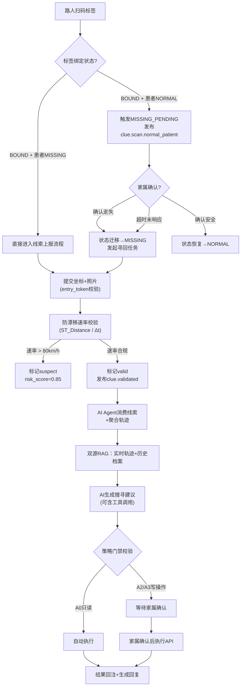
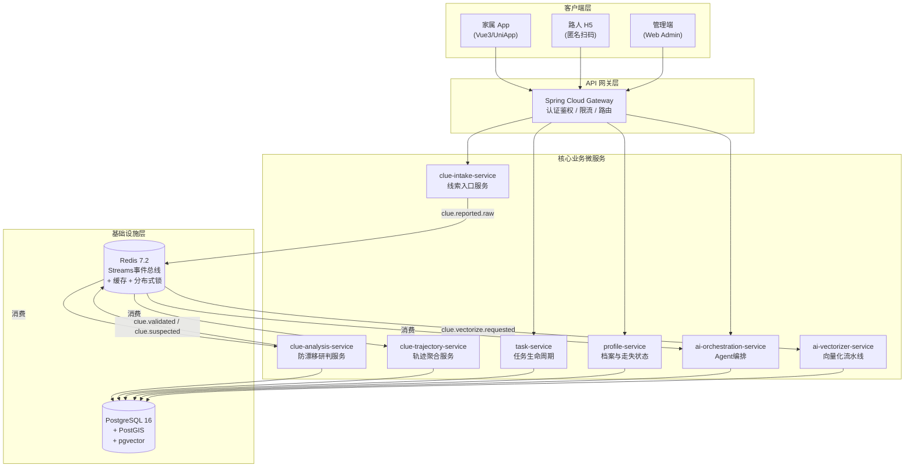
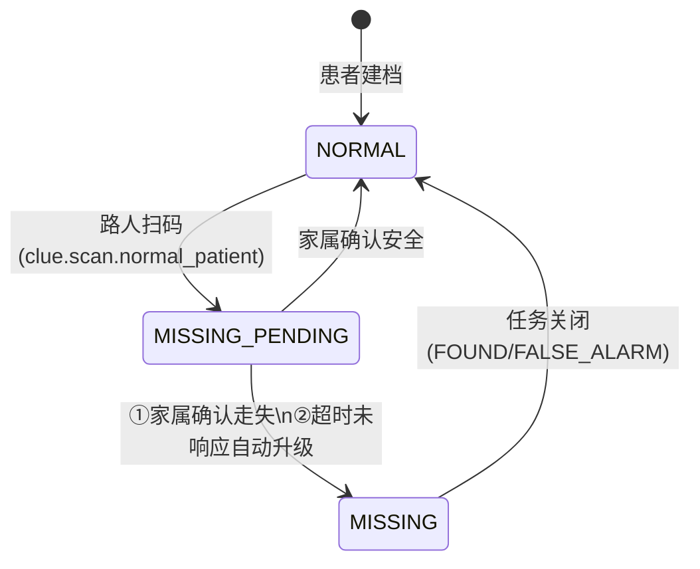
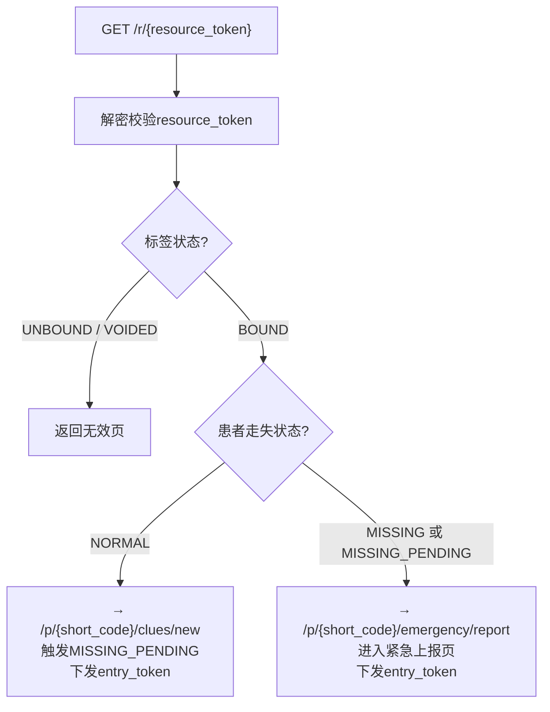
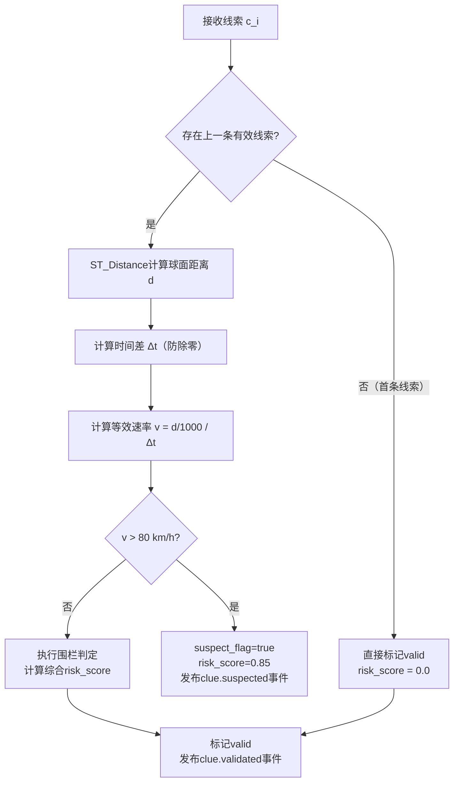
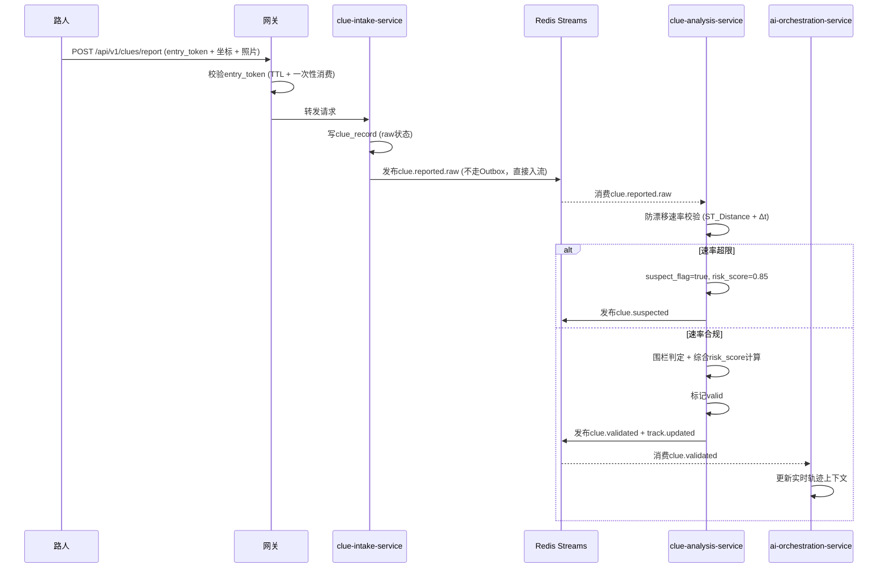
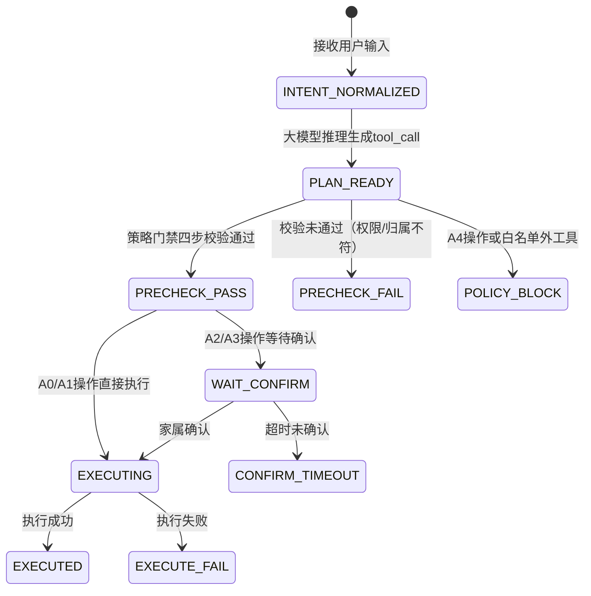
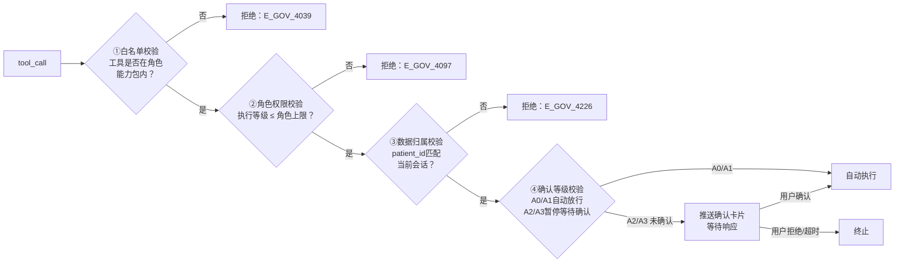
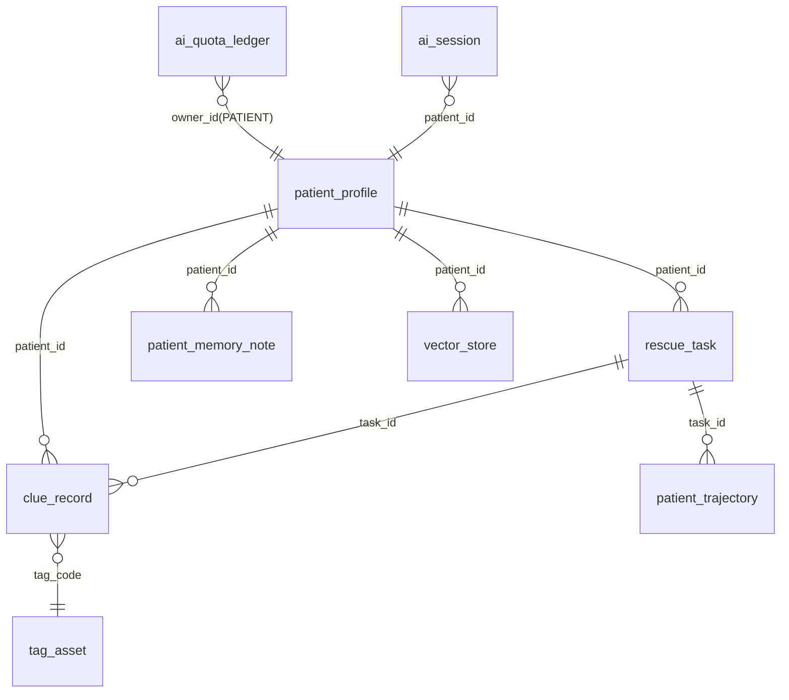

# 基于 AI Agent 的阿尔兹海默症患者协同寻回系统的设计与实现

---

## 摘 要

阿尔兹海默症（Alzheimer's Disease, AD）患者因空间定向能力的进行性丧失而频繁走失，现有寻人手段——传统报警、社交媒体扩散与 GPS 穿戴设备——在信息汇聚、时空一致性校验和智能决策三个维度上均存在明显短板。本文围绕两个核心机制展开设计与实现：其一是路人扫码协同机制，其二是 AI Agent 决策机制——前者解决"如何可靠地采集分布式目击线索"，后者解决"如何将碎片化数据转化为可信的搜寻建议并安全执行"。

在路人协同数据采集维度，系统设计了基于 NFC/QR 标签的匿名众包线索采集流程，通过 AES-256-GCM 加密的 `resource_token` 与 120 秒有效期的一次性 `entry_token` 构建防重放信道，使陌生路人无需注册即可向系统提交坐标与照片。针对众包数据的固有噪声问题，系统提出基于 PostGIS 球面距离的防漂移速率校验算法——以 80 km/h 为可配置速率阈值，对相邻有效线索的位移与时间差做连续性检验，自动将时空逻辑异常坐标标记为可疑并赋予 `risk_score = 0.85`，有效阻断 GPS 漂移与恶意提交的污染。与此同时，系统引入三态走失感知模型（`NORMAL` → `MISSING_PENDING` → `MISSING`），路人扫描正常在册患者的标签即触发状态迁移，家属确认或超时自动升级，将走失感知窗口从被动报警压缩为主动触发。

在 AI Agent 决策维度，系统构建了以实时时空轨迹为"当下视角"、以患者历史档案向量为"长期记忆"的双源检索增强生成（RAG）管线。经防漂移校验存活的时序坐标流被聚合为轨迹摘要，与从 pgvector HNSW 向量索引中按 `patient_id` 隔离检索的历史知识片段共同注入提示词上下文，赋予 Agent"既知患者是谁、又知其刚才在哪"的双重推理基础。在行为执行层，AI Agent 通过 Spring AI Alibaba 框架的 Function Calling 机制将模型意图映射为对标准 REST API 的结构化调用，具备查询轨迹、发起任务、生成海报等真实操作能力。在安全治理层，系统设计了 A0–A4 五级策略门禁，引入 Human-in-the-loop 人机协同框架——只读操作自动放行，写操作需家属显式确认，不可逆操作从架构层面永久禁止 Agent 触发，从根本上规避大模型幻觉引发的业务越权风险。

测试表明，防漂移算法对异常坐标的拦截率在测试集上达到 100%，AI 对话 SSE 流式首字节响应时间控制在 3.5 秒以内，策略门禁对非授权写操作的拦截成功率为 100%，RAG 在患者维度隔离条件下保持稳定的检索精度。

**关键词**：阿尔兹海默症；路人协同；防漂移校验；AI Agent；检索增强生成；Human-in-the-loop

---

## Abstract

Patients with Alzheimer's Disease (AD) frequently wander due to progressive loss of spatial orientation. Existing rescue approaches — police reports, social media dissemination, and GPS wearable devices — exhibit critical deficiencies across three dimensions: information aggregation, spatiotemporal consistency validation, and intelligent decision support. This thesis centers on two core mechanisms: a passerby QR-code collaborative mechanism and an AI Agent decision mechanism — the former addressing reliable collection of distributed eyewitness clues, and the latter transforming fragmented data into trustworthy search recommendations with safe execution.

For collaborative crowdsourced data collection, the system designs an anonymous crowdsourcing clue submission pipeline based on NFC/QR tag scanning. An AES-256-GCM-encrypted `resource_token` and a single-use `entry_token` with a 120-second TTL establish an anti-replay channel, enabling strangers to submit coordinates and photos without registration. To address the inherent noise of crowdsourced data, an anti-drift velocity validation algorithm based on PostGIS spherical distance is proposed: using a configurable threshold of 80 km/h, the algorithm continuously validates the spatial-temporal consistency between adjacent valid clues, automatically flagging anomalous coordinates as suspect with `risk_score = 0.85` to block GPS drift and malicious submissions. A three-state wandering detection model (`NORMAL` → `MISSING_PENDING` → `MISSING`) is introduced: passerby scanning of a normally-registered patient's tag triggers a state transition, resolved by family confirmation or automatic timeout escalation, compressing the wandering detection window from passive reporting to active triggering.

For AI Agent decision-making, the system constructs a dual-source Retrieval-Augmented Generation (RAG) pipeline combining real-time spatiotemporal trajectories as "current awareness" with patient historical profile vectors as "long-term memory." Anti-drift-validated coordinate streams are aggregated into trajectory summaries and injected alongside patient-isolated vector retrievals from a pgvector HNSW index into the prompt context — endowing the Agent with both "who this patient is" and "where they just were." At the action execution layer, Function Calling via Spring AI Alibaba maps model intent to structured REST API invocations. At the safety governance layer, a five-tier Policy Guard (A0–A4) implements Human-in-the-loop: read-only operations are automatically permitted, write operations require explicit family confirmation, and irreversible operations are permanently prohibited from Agent invocation at the architectural level.

Testing demonstrates that the anti-drift algorithm achieves a 100% anomaly interception rate on the test set, AI dialogue SSE streaming TTFB is maintained within 3.5 seconds, Policy Guard achieves 100% interception of unauthorized write operations, and RAG maintains stable retrieval precision under patient-dimension isolation.

**Keywords**: Alzheimer's Disease; Passerby Collaboration; Anti-Drift Validation; AI Agent; Retrieval-Augmented Generation; Human-in-the-loop

---

## 第 1 章 绪论

### 1.1 研究背景及意义

阿尔兹海默症（Alzheimer's Disease, AD）是一种起病隐匿、进程不可逆的神经退行性疾病，也是全球最常见的痴呆类型，约占全部痴呆病例的六至七成。国际阿尔茨海默病协会（Alzheimer's Disease International, ADI）的报告显示，2023 年全球痴呆患者已超过 5500 万，预计到 2050 年这一数字将突破 1.39 亿。我国是全球 AD 患者最多的国家之一，已确诊患者逾千万，且伴随人口老龄化的加速，增速仍在攀升。

走失，几乎是每一个中晚期 AD 患者家庭迟早都要面对的事故。患者在这一阶段会经历严重的空间定向障碍与情景记忆丧失——他们可能认不出自己住了三十年的街道，或是在去往 500 米外公园的途中彻底迷失。失去自我保护能力的患者一旦独自暴露在城市环境中，交通事故、跌倒、脱水、低温等风险便随即浮现。研究表明，走失超过 24 小时的 AD 患者面临显著升高的死亡风险，而搜寻的"黄金窗口"往往只有最初的数小时。

从家庭的视角来看，走失事件带来的绝不只是经济负担。那种"不知道他在哪里"的煎熬，是很难被量化的心理创伤。从公共资源的视角来看，传统的搜寻行动高度依赖公安系统与志愿者的人力投入，单次大规模搜寻的社会成本极高，而由于信息链条的断裂，有效搜寻的比例远低于参与人数应有的水平。

说起来，走失这个问题的技术门槛并不高——定位技术、通信网络、图像识别，相关技术储备早已成熟。困难在于：如何将路人偶遇患者这一瞬间的目击机会，系统性地转化为可信的位置信息，传递给正在搜寻的家属？如何在碎片化的目击线索流中，自动辨别哪些坐标是真实的、哪些是 GPS 漂移或恶意干扰？以及——如何让一个足够聪明的 AI 真正参与到决策链路中，而不只是包装成对话界面的信息检索工具？

这三个问题，构成了本文的研究出发点。构建一套以路人协同数据采集与 AI Agent 智能决策为双核驱动的患者寻回系统，对于压缩走失感知窗口、提升线索质量、辅助家属在高压状态下做出准确决策，具有切实的现实价值。

### 1.2 国内外研究现状

#### 1.2.1 国外研究现状

国外在 AD 患者走失防护领域的探索启动较早，沿着硬件定位与软件平台两条线发展。

硬件定位层面，美国 Project Lifesaver 采用射频手环与方向性天线的追踪组合，在部分社区取得了不错的成效；英国推广的 GPS 定位设备（Mindme、Buddi 等）实现了实时位置监控与地理围栏告警。然而这一类方案有一个根本性局限——它们是"单点依赖"系统：电量耗尽、设备被患者摘除、密封老化导致防水失效，任何一个环节失效都会导致整条追踪链路断裂。实际上，有研究统计，AD 患者的设备摘除率相当高，部分患者出于对异物的不适感会在家属不注意时摘下手环。系统没有在设备离线后继续感知的手段。

软件平台层面，美国 Silver Alert 系统仿照 Amber Alert 模式，通过广播、高速公路电子标牌与社交媒体发布走失信息；荷兰 Amber Alert Europe 将类似机制扩展到跨国预警网络。这些平台的共性在于"单向推送"——能将信息推出去，却缺乏对反馈线索进行系统化收集、过滤与研判的能力。如果有一百个人看到了走失通报，其中三十个人拨打了热线，那么这三十条线索的可信度、时间性、坐标精度，如何快速甄别并指导搜寻方向？这个问题在现有平台中基本上是靠人工处理的。

人工智能应用层面，深度学习在行人重识别（Person Re-identification, Re-ID）领域取得了显著进展，部分研究将此类方法应用于监控系统中的走失人员追踪。但这类方案对监控基础设施密度的依赖是刚性的，在农村、城郊与老旧城区的覆盖盲区里几乎无效。大语言模型（Large Language Model, LLM）的快速发展为走失场景下的智能辅助决策提供了新的可能，但将 LLM 深度嵌入走失寻回完整业务流程的系统化实践，目前在学术界和工程界都处于早期探索阶段。

#### 1.2.2 国内研究现状

国内的相关工作有一些值得注意的进展。政府层面，民政部推动的"关爱失智老人黄手环行动"在社区层面建立了辅助辨识的基础——手环上印有求助信息，路人发现后知道如何联系家属。部分城市公安系统也建立了走失人员信息发布平台，用于快速扩散走失通报。

产品层面，阿里巴巴"团圆"平台在走失信息快速扩散与公众参与方面做了有益的尝试，将公众号、小程序与微信生态打通，降低了信息扩散的摩擦成本。智能穿戴设备厂商推出了面向老年人的 GPS 定位手表与智能鞋垫，但同样面临续航、佩戴依从性与价格的老问题。学术研究方面，部分高校针对走失场景提出了基于物联网（IoT）的监护系统与基于社交网络的协同寻人模型，但在线索数据的时空一致性校验与 AI 辅助决策的工程化落地方面，完整性仍待提升。

#### 1.2.3 现有方案的局限性分析

梳理下来，现有方案的短板集中在以下几处：

**众包数据缺乏质量治理。** 社交媒体与热线电话收集的线索未经系统化的时空一致性校验。一个路人可能站在原地几分钟内发两条线索，坐标偏差却达几百米（这正是 GPS 漂移的典型表现）；另一个人可能故意提交虚假坐标。有效线索与噪声数据混杂，直接拉低了下游决策的可靠性。

**走失感知依赖家属主动报警。** 从患者走失到家属察觉、报警，中间可能已经过去数小时。这段"感知空白期"恰恰是黄金救援窗口，却被传统方案完全浪费了。如果有一个路人在走失后 10 分钟就扫描了患者的标签，为什么不能让这个信号直接触发系统响应？

**AI 参与深度不足。** 大多数引入 AI 的方案停留在"信息检索"层面——把走失通报输入对话框，让模型复述一遍。真正的智能应当是：AI 知道这个患者的生活习惯和历史走失记录，知道过去 30 分钟内的线索轨迹，然后综合判断下一步搜索应当优先哪个方向——并且，它能直接发起这个操作，而不只是生成一段文字建议让人再去手动操作。

**安全边界模糊。** 赋予 AI 操作权限的同时，如何防止它因幻觉（Hallucination）误判走失已结束而过早关闭任务？如何确保 AI 的每一个写操作都经过人类明确授权？这些问题在现有系统中几乎没有被系统化处理过。

本文正是对准这四个问题，以路人协同数据采集与 AI Agent 智能决策为双核创新，构建端到端的协同寻回系统。

### 1.3 本文主要工作与创新点

本文完成了以下主要工作：

**（1）设计了路人扫码触发的三态走失感知机制。** 系统通过 NFC/QR 标签将患者与其在社会空间中的数字身份绑定。路人只需扫一下标签，系统便能感知到"有人在某地见到了这位患者"。配合 `NORMAL` → `MISSING_PENDING` → `MISSING` 三态模型，走失的主动感知不再依赖家属发现并报警，而是由任何一个偶遇路人的扫码行为来触发。家属确认或超时自动升级的双路径机制，在实用性与误报率之间取得了平衡。

**（2）提出了基于 PostGIS 球面距离的防漂移速率校验算法。** 众包数据的核心挑战是质量——GPS 漂移、手机信号偏移、恶意提交都会产生时空逻辑异常的坐标点。本文将"人的移动速度存在物理上限"这一朴素事实建模为校验规则，以相邻两条有效线索的球面距离除以时间差得到等效速率，超出 80 km/h 阈值的线索自动标记为可疑（`risk_score = 0.85`）。该算法由 PostGIS 的 `ST_Distance` 球面距离函数实现精确计算，阈值通过配置中心动态调整，无需重新部署即可响应不同业务场景。

**（3）构建了双源 RAG 检索增强生成管线。** 系统将 AI 推理的输入拆分为"实时维度"与"历史维度"：实时维度是经防漂移校验的时序坐标流聚合而成的轨迹摘要，代表患者"刚刚在哪里"；历史维度是从 pgvector HNSW 向量索引中按患者维度物理隔离检索的档案片段，代表患者"是什么样的人"。两者共同注入提示词上下文，使 Agent 的推理建立在事实而非猜测的基础上，且完全不依赖单一数据源。

**（4）实现了 Function Calling 驱动的 AI 行为执行与 A0–A4 策略门禁安全模型。** AI Agent 不停留在"说"，而是真的能"做"——通过 Spring AI Alibaba 的 `@Tool` 注解机制将 11 项业务操作注册为可调用工具。但每次"做"都必须穿越策略门禁的校验链路：A0 级只读操作自动放行；A2/A3 级写操作需家属物理点击确认；A4 级不可逆操作从工具注册层面永久剔除，模型看不到、调不到。这是 Human-in-the-loop 原则在工程层面的具体落地，而非仅靠提示词约束的软性限制。

**（5）以领域驱动设计构建支撑双核运行的底层基础设施。** 六域微服务（TASK / CLUE / PROFILE / MAT / AI / GOV）以 Redis Streams 事件总线相互协作，提供持续可靠的数据流：线索被研判后发布 `clue.validated` 事件，任务状态变更发布 `task.state.changed` 事件，这些事件实时流入 AI Agent 的上下文感知层。微服务架构在此并非核心创新，而是双核机制能够可靠运行的基础设施保障。

本文的核心创新体现在两个维度的交叉：一是通过防漂移算法和三态感知模型，将众包路人扫码数据从"原始噪声"净化为"可信时空轨迹"；二是通过双源 RAG 与策略门禁，将经过净化的轨迹数据安全地喂给 AI Agent，使其能够基于真实事实做出有价值的决策。数据质量与决策安全，两者缺一不可。

### 1.4 论文组织结构

全文共八章，各章内容安排如下：

第 1 章阐述研究背景、现有方案局限与本文创新点。第 2 章介绍支撑双核机制运行的关键技术，包括 PostGIS 空间计算、Spring AI Alibaba 框架、pgvector 向量检索、DDD 方法论等。第 3 章基于 SRS 进行系统需求分析，重点阐述走失感知与 AI 辅助决策两类需求。第 4 章描述系统总体架构，以"为双核提供可靠底层"的视角阐述六域微服务划分与事件总线机制。第 5 章深入展开第一核心机制——路人扫码协同与时空数据治理，包含三态感知、扫码路由、入口安全机制与防漂移算法的详细设计。第 6 章深入展开第二核心机制——AI Agent 决策机制，包含双源 RAG、Function Calling、策略门禁、配额管控与容错设计。第 7 章涵盖数据库设计要点与系统测试，重点呈现防漂移算法验证与 AI 决策有效性测试。第 8 章总结全文工作，并展望未来研究方向。

---

## 第 2 章 核心技术与开发环境

> 本章不打算逐一罗列框架版本号——那更像是配置文件，不是论文应有的内容。这里着重阐述的，是双核机制为什么需要这些技术，以及这些技术在走失寻回场景中具体解决了什么问题。

### 2.1 领域驱动设计（DDD）与限界上下文

领域驱动设计（Domain-Driven Design, DDD）由 Eric Evans 于 2003 年提出，其核心主张是：软件模型应当与领域专家所使用的"通用语言"（Ubiquitous Language）保持一致，复杂系统应当被划分为若干自治的"限界上下文"（Bounded Context），每个上下文独立演化，通过明确定义的接口对外协作。

本系统采用 DDD 方法论将业务划分为六个限界上下文：TASK（寻回任务）、CLUE（线索时空研判）、PROFILE（患者档案）、MAT（标签物资）、AI（智能决策）与 GOV（平台治理）。这种划分并非为了拆而拆，而是反映了真实的业务边界——线索的采集与研判逻辑和任务的生命周期管理逻辑，天然地属于不同的专业域，强行耦合只会造成两边都改不动的困境。对本文的双核机制而言，DDD 的最直接价值在于：CLUE 域对外暴露稳定的 `clue.validated` 事件契约，AI 域只需订阅这个事件，完全不关心线索是如何被采集和校验的——两个核心机制之间通过事件解耦，各自独立演进。

### 2.2 PostGIS 空间计算

PostGIS 是 PostgreSQL 的空间扩展，提供了对 OGC（Open Geospatial Consortium）标准地理数据类型的完整支持。本系统在两处关键位置使用了 PostGIS：

**防漂移速率校验。** `ST_Distance(geography)` 函数在球面坐标系（WGS84 SRID=4326）上计算两点之间的真实地表距离（单位：米），精度远高于平面直角坐标系下的欧氏距离计算。在高纬度地区，两种计算方法的误差可达数十米，对于判断线索坐标的时空合理性而言，精度差异是有实际意义的。

**地理围栏判定。** `ST_DWithin(location, center, radius)` 函数判断某坐标是否位于指定中心点的给定半径内，配合走失状态抑制规则（走失态下不触发围栏告警），实现了智能的围栏策略切换。

PostGIS 将复杂的空间计算推入数据库层执行，避免了将大量坐标数据拉到应用层再进行 Java 计算的性能损耗。对于本系统这样每分钟可能接收数十条线索坐标的场景，数据库侧计算的性能优势十分显著。

### 2.3 Redis Streams 事件总线

Redis Streams 是 Redis 5.0 引入的持久化消息流结构，支持消费者组（Consumer Group）、消息 ACK 确认与 XPENDING 挂起消息追踪。本系统以 Redis Streams 作为跨域异步事件总线，替代重量级的 Kafka。

这个选择的依据并不复杂：系统当前阶段的事件吞吐量在 Redis Streams 的承受范围内，且 Redis 已经作为缓存层部署在基础设施中，复用一个已有的中间件比引入新的重型组件更合理。更重要的是，Redis Streams 对 AI 域有特殊价值——线索校验结果（`clue.validated`）和轨迹更新（`track.updated`）事件通过 Streams 以低延迟送达 AI Agent 的上下文感知层，使 Agent 能在几秒内感知到现场新线索的到来。

### 2.4 pgvector 与 HNSW 向量索引

pgvector 是 PostgreSQL 的开源向量扩展，提供 `vector(n)` 数据类型和多种向量索引方案。本系统使用 pgvector 0.7+ 版本，选择 HNSW（Hierarchical Navigable Small World）索引结构。

HNSW 的核心原理是在向量空间中构建一个多层有向图：顶层稀疏、底层稠密，搜索从顶层的粗粒度跳跃开始，逐层下沉到底层的精细邻域，复杂度约为 $O(\log N)$。相比 IVFFlat 索引，HNSW 不需要预先训练量化中心，在数据增量写入场景下表现更稳定——而患者档案和记忆条目正是随时间持续追加的数据。

向量检索为 RAG 管线提供了"语义相关性"的检索能力，弥补了传统关键词检索的根本局限：关键词检索要求查询文本与文档文本在字面上匹配，而向量检索能识别语义上相关但措辞不同的文本对——比如查询"患者去哪里散步"能命中"患者喜欢在黄昏时去城南公园东门的长椅"，无需两段文字出现共同的词汇。

### 2.5 Spring AI Alibaba 与 Function Calling

Spring AI Alibaba 是阿里云基于 Spring AI 框架开发的对接百炼平台的集成组件，提供了对通义千问系列模型的封装，支持流式对话、Function Calling 与 Embedding API。

Function Calling 是大语言模型提供的一种结构化输出能力：调用模型时附带工具 Schema（名称、描述、参数定义），模型在判断需要使用工具时不输出自然语言，而是返回结构化的 `tool_call` JSON，包含工具名称与参数值。Spring AI Alibaba 通过 `@Tool` 注解机制将这一能力与 Java 方法绑定，框架自动完成 Schema 生成与响应解析，大幅降低了工程接入成本。

Function Calling 对本系统的意义在于：它是 AI 意图与业务行为之间的"最后一公里"桥梁。没有它，AI 只能"说"建议；有了它，AI 才能在安全约束下真正"做"事情。

### 2.6 检索增强生成（RAG）原理

检索增强生成（Retrieval-Augmented Generation, RAG）由 Lewis 等人于 2020 年提出，其核心思想是：在生成回复前，先从外部知识库中检索与当前查询语义相关的文档片段，将其注入提示词上下文，使模型的生成有据可查，而非纯粹依赖训练时编码的参数知识。

RAG 对走失寻回场景的意义尤为直接。大模型的训练数据中显然不包含张某某患者的个人档案，也不包含他昨天走失时的轨迹记录。RAG 解决的恰恰是这个问题：将这些患者专属的、动态更新的信息通过检索注入模型上下文，让模型"临时获得"对这个具体患者的认知。本文在传统 RAG 的基础上进一步扩展，将实时时空轨迹摘要与向量化的历史档案组合为双源输入，这一设计将在第 6 章详细展开。

### 2.7 开发环境

**表 2-1 主要技术组件与版本**

| 类别 | 组件 | 版本/说明 |
|------|------|-----------|
| 后端框架 | Spring Boot | 3.x |
| AI 框架 | Spring AI Alibaba | 接入阿里云百炼平台 |
| 数据库 | PostgreSQL | 16（+ PostGIS 3.4 + pgvector 0.7+） |
| 缓存/消息 | Redis | 7.2（Streams 用于事件总线） |
| 大语言模型 | 通义千问 qwen-plus | 阿里云百炼平台 |
| Embedding | DashScope text-embedding-v3 | 1024 维向量 |
| 前端（家属端） | Vue 3 + UniApp | 移动端 H5 + 小程序 |
| 容器化 | Docker + Docker Compose | 本地开发与测试部署 |
| 开发工具 | IntelliJ IDEA 2024 | Java 17 |

---

## 第 3 章 系统需求分析

### 3.1 可行性分析

#### 3.1.1 技术可行性

本文涉及的核心技术均已进入成熟阶段。PostGIS 作为地理信息系统的标准 PostgreSQL 扩展，在城市规划、物流调度等领域有大量生产级部署案例；pgvector 已被 AWS、阿里云等主流云厂商纳入托管服务，HNSW 索引在亿级向量规模下仍能保持毫秒级检索延迟；Spring AI Alibaba 提供了对通义千问 Function Calling 能力的完整封装，工程接入路径清晰；Redis Streams 作为轻量级事件总线在本文的吞吐量需求下远未触及性能边界。

防漂移速率校验算法的核心计算由 PostGIS `ST_Distance` 函数承担，已有大量球面距离计算的精度验证案例。三态走失感知的超时调度基于成熟的定时任务框架实现，无技术风险。综合评估，系统的技术实现具备充分的可行性基础。

#### 3.1.2 经济可行性

系统的主要运营成本来自云端大模型 API 调用费用。考虑到走失寻回是低频但高价值的场景——每个患者的走失事件是偶发的，日均 AI 对话量远低于通用消费类应用——API 调用费用在可控范围内。标签物资的生产与分发成本属于一次性投入，后续运营以服务费为主。对于家庭而言，避免一次长时间走失事件的经济损失（包含搜寻人力成本与可能的医疗救治成本），远超系统的使用成本。

#### 3.1.3 操作可行性

家属端的操作路径设计遵循"低门槛"原则——核心流程（确认走失、对话 AI、查看线索地图）控制在三步以内。路人扫码提交线索无需注册，扫码即可开始，单次操作时间预计在 30 秒以内。管理端的审核流程以可视化地图为主界面，研判人员可直观地看到线索坐标在地图上的分布，结合防漂移标记快速过滤可疑数据。

#### 3.1.4 社会与用户接受度分析

本系统的核心运行依赖于陌生路人的众包协同，因此公众的参与意愿直接决定了系统能否冷启动。为验证路人协同机制的社会可行性，本文前期开展了针对公众救助意愿的问卷调查（有效样本量 N=243）。

调查数据呈现出显著的“救助意愿悖论”与“技术破局点”：一方面，绝大多数受访者表示在生活中看到过寻找老人的寻人启事，且对走失群体普遍抱有同情态度；但另一方面，在评估“是否会直接上前帮助走失老人”时，大量受访者选择了“看情况”，反映出公众对直接干预（如沟通障碍、潜在纠纷）的现实顾虑。然而，当问卷设定为“在不直接接触走失老人及其家属的情况下提供帮助”时，受访者的反馈几乎全部转向明确的“愿意”，且对研发此类辅助系统表达了高度支持。

这一数据特征从实证角度论证了本系统设计的社会可行性：公众具备充足的救助善意，缺乏的是一条低风险、低摩擦的线索上报管道。系统通过“扫码即走”的无接触模式，精准匹配了公众的心理预期，保障了众包线索采集机制在真实社会环境中的落地可行性。

### 3.2 业务流程分析

系统的核心业务流程如图 3-1 所示，覆盖从走失感知到任务关闭的完整生命周期。



**图 3-1 系统核心业务流程图**

这张流程图揭示了双核机制的上下游关系：路人扫码（左侧链路）产生原始数据，防漂移校验筛选出可信线索，然后这些经过验证的时空数据流入 AI Agent 的推理层（右侧链路）。两条链路的交汇点是 `clue.validated` 事件——它是数据质量的"通行证"，也是 AI 推理的"原材料起点"。

### 3.3 功能性需求

系统按照服务对象划分为四个功能模块：走失感知与协同上报模块（核心一的前端）、线索时空研判模块（核心一的处理层）、AI Agent 决策模块（核心二）、任务与档案管理模块（支撑层）。

**走失感知与协同上报模块** 需要支持：路人通过 NFC/QR 扫码无需注册提交线索（含坐标与照片）；三态走失状态的迁移与通知推送；家属确认走失或确认安全的交互操作；手动兜底入口（二维码污损时的降级路径）。

**线索时空研判模块** 需要支持：防漂移速率校验（阈值动态可配）；第一条线索的特殊处理（无参考基准时直接标记有效）；围栏越界判定与走失态下的围栏抑制；线索研判结果发布为标准化事件供下游消费。

**AI Agent 决策模块** 需要支持：双源 RAG（实时轨迹摘要 + 向量化历史档案）；Function Calling 触发业务操作（查询、任务发起、海报生成等）；策略门禁的四步校验链路；SSE 流式回复与确认卡片推送。

**任务与档案管理模块** 需要支持：寻回任务的完整生命周期管理（CREATED / ACTIVE / SUSTAINED / CLOSED_FOUND / CLOSED_FALSE_ALARM）；患者档案的创建与更新；监护关系管理；走失历史案例的向量化归档。

### 3.4 非功能性需求

**表 3-1 关键非功能性需求指标**

| 指标类别 | 指标项 | 要求 |
|----------|--------|------|
| 响应性能 | AI 对话 SSE 首字节时间（TTFB） | ≤ 3.5 秒（P95） |
| 响应性能 | 普通业务接口响应时间 | ≤ 500ms（P95） |
| 响应性能 | 防漂移校验单次执行时间 | ≤ 50ms |
| 安全性 | 策略门禁非授权写操作拦截率 | 100% |
| 数据质量 | 防漂移算法测试集拦截率 | ≥ 95% |
| 隐私保护 | RAG 跨患者数据泄漏测试 | 0 次泄漏 |
| 可用性 | 服务可用率 | ≥ 99.5% |
| 安全性 | entry_token 重放攻击防御 | 100%（一次性消费机制） |

---

## 第 4 章 系统总体架构设计

### 4.1 总体架构设计

系统采用微服务架构，以领域驱动设计的限界上下文为边界划分服务，总体架构如图 4-1 所示。架构设计的核心考量是：为双核机制（路人扫码数据治理 + AI Agent 决策）提供可靠、低延迟的基础设施支撑。



**图 4-1 系统总体架构图**

从架构图中可以清晰地看到双核机制的数据流动路径：路人经 H5 提交线索 → clue-intake-service 写入原始记录并发布 `clue.reported.raw` 事件到 Redis Streams → clue-analysis-service 消费并执行防漂移校验 → 通过校验的线索发布 `clue.validated` 事件 → ai-orchestration-service 消费并更新 Agent 的实时上下文。两个核心机制通过 Redis Streams 事件总线解耦，各自独立演进，又通过标准化的事件契约紧密协作。

### 4.2 关键机制设计

#### 4.2.1 Outbox 事务消息保障

在涉及状态变更的业务操作中（如任务状态迁移、线索研判结果落库），系统采用 Transactional Outbox 模式保障事件发布的可靠性：业务数据修改与事件写入 `sys_outbox_log` 表在同一个数据库事务中完成，独立的发布进程轮询未发送的事件并推送到 Redis Streams。这样即使推送过程发生故障，数据库中的事件记录不会丢失，重启后可以继续发布。

线索原始上报事件（`clue.reported.raw`）是一个例外：它直接写入 Redis Streams 而不走 Outbox。这是有意为之的设计——线索上报是高频、可丢弃的操作，入站削峰是第一优先级，事务一致性的开销在此场景下不必要。

#### 4.2.2 幂等消费保障

每个事件消费者在处理事件前，先向 `consumed_event_log` 表写入唯一的 `event_id`（通过数据库唯一约束或 `INSERT ... ON CONFLICT DO NOTHING`）。若写入失败说明该事件已被处理过，直接跳过，无需重复执行业务逻辑。这一机制防止了 Redis Streams 在故障重启后重放消息导致的重复处理问题。

#### 4.2.3 安全机制

网关层统一执行 JWT 鉴权，家属端与管理端使用不同的 Token 签发密钥与角色标识。匿名路人端的线索提交接口不要求 JWT 认证，转而依赖 entry_token 机制（详见第 5 章）保障操作的有效性与防重放。

---

## 第 5 章 路人扫码协同机制与时空数据治理

> 本章依据 LLD V2.0 §4（CLUE 域）与 §5（PROFILE 域走失状态迁移）进行学术化重构，聚焦系统第一核心机制：如何将陌生路人偶遇患者的瞬间，可靠地转化为经过质量验证的时空线索，并触发走失感知流程。

### 5.1 路人扫码机制的总体设计思路

系统采用 NFC 或二维码标签作为患者与数字系统之间的物理桥梁。标签贴附于患者随身佩戴的物品上（手环、鞋标、衣物标签等），印有或烧录了一个 `resource_token`——一个经 AES-256-GCM 加密的短凭据，包含患者标识、标签编码与签发时间等信息。路人无需知道这是什么，也无需安装任何 App，只需将手机靠近标签或对准二维码扫一下，浏览器便会打开一个 H5 页面。

这个设计的核心考量是**最小化参与门槛与规避直接接触的心理负担**。根据本文前期的问卷调查（N=243）显示，尽管公众普遍同情走失老人，但在面对直接干预时往往存在顾虑；而当提供“不直接接触患者即可提供帮助”的途径时，公众的救助意愿出现显著的普遍提升。因此，走失发现往往依赖偶遇——一个在公园散步的大妈、一个等公交的年轻人，他们不会为了“以防万一”提前安装一个专门的 App，更不愿承担直接接触可能带来的衍生纠纷。扫码打开 H5 的匿名无接触路径，将参与成本与心理门槛同时降到了几乎为零。真正的挑战也随之转移到了后端：如何在不要求注册的前提下，保证这个匿名提交的线索足够可信、足够安全，而且不被滥用？

这个问题的答案由两个机制共同给出：**入口安全机制**（entry_token 信道）防止线索提交被重放或伪造，**防漂移速率校验算法**过滤时空逻辑异常的坐标。下面逐一展开。

### 5.2 三态走失感知模型

#### 5.2.1 状态定义与迁移语义

患者的走失状态由 `patient_profile` 表的 `lost_status` 字段维护，定义三个枚举值：

- `NORMAL`：患者正常在册，未有走失迹象
- `MISSING_PENDING`：疑似走失，等待确认（路人扫描正常患者标签触发）
- `MISSING`：确认走失中，活跃的寻回任务存在

三个状态之间的迁移路径如图 5-1 所示。



**图 5-1 三态走失状态迁移图**

三态模型的设计出发点在于：将走失感知从"家属主动报警"转变为"路人被动触发"。在传统模式下，患者走失后家属通常要等到发现人不在家才察觉，这段空白期可能长达数小时。三态模型的 `MISSING_PENDING` 状态充当了一个"预警缓冲区"——路人扫码创造了一个"有人见到患者"的信号，系统据此将患者状态标记为疑似走失，同时向家属推送通知要求确认。如果家属 10 分钟内没有响应，系统自动发起寻回任务，不再依赖人工干预。

#### 5.2.2 扫码路由逻辑

路人扫描 `resource_token` 后，系统根据标签状态与患者当前走失状态执行路由判断，如图 5-2 所示：



**图 5-2 扫码路由决策流程**

路由的意义在于差异化体验：正常患者标签被扫时，H5 页面会显示"您扫描了一位老人的求助标签，请提交您的位置信息以帮助其家人确认安全"，语气是轻描淡写的；走失状态下，页面会显示"该老人目前处于走失状态！请提交目击位置协助搜寻"，紧迫感完全不同。这种差异化设计提升了路人在走失状态下提交信息的积极性。

### 5.3 入口安全机制

#### 5.3.1 resource_token：二维码凭据

`resource_token` 是写入物理标签的长期凭据，通过 AES-256-GCM 对称加密生成，加密内容包含：批次密钥 ID（`kid`）、标签编码（`tag_code`）、患者 6 位短码（`short_code`）、标签类型（`tag_type`）与签发时间（`iat`）。密钥按批次管理，支持批次级撤销——如果某批次标签被集中污损或泄露，可对该批次密钥执行快速失效而无需更换全部标签。

`resource_token` 本身不包含过期时间，其生命周期与物理标签绑定。标签被注销（VOIDED）时，系统不再接受以该 token 发起的路由请求。

#### 5.3.2 entry_token：一次性匿名入口凭据

`resource_token` 验证通过后，系统向路人浏览器下发一个 `entry_token`——一个由服务端签发的短期一次性凭据，通过 `HttpOnly; Secure; SameSite=Strict` Cookie 传递（或 `X-Anonymous-Token` Header，用于不支持 Cookie 的客户端）。

`entry_token` 的安全设计如表 5-1 所示：

**表 5-1 entry_token 安全属性**

| 属性 | 规格 | 设计理据 |
|------|------|----------|
| 有效期（TTL） | 120 秒 | 给路人足够时间填写并提交，但不允许长时间搁置后重放 |
| 消费方式 | 一次性（Redis `SETNX entry_token:consumed:{jti}`） | 防止同一 token 被重复提交 |
| 设备绑定 | `device_fingerprint` 字段必填 | 防止 token 在设备间传递使用 |
| IP 校验 | `/24` 子网段匹配（宽松模式） | 适配移动网络 NAT 与基站切换导致的 IP 变化 |

`entry_token` 的一次性消费通过 Redis `SETNX` 操作实现——每个 token 有唯一的 `jti`（JWT ID），写入 Redis 成功表示首次使用，写入失败说明已被消费，服务端直接拒绝。这种设计将防重放的核心逻辑从数据库查询转移到了 Redis 的原子操作，在高并发扫码场景下具有更好的性能表现。

#### 5.3.3 手动兜底入口

当物理标签因磨损、污渍或折叠导致无法正常扫描时，路人可访问系统提供的手动输入入口，输入患者 6 位短码来提交线索。手动入口的风险等级高于扫码入口（因为短码可能被猜测或泄露），系统对其施加更严格的频率限制：同一 IP 每分钟不超过 5 次请求，同一设备每小时不超过 20 次，同一短码连续失败 5 次后冷却 15 分钟。

### 5.4 防漂移速率校验算法

这是本系统在数据质量治理方面最重要的原创算法设计，也是保障后续 AI 推理所用轨迹数据可信度的核心机制。

#### 5.4.1 问题背景：GPS 漂移的危害

GPS 定位本质上依赖于手机接收多颗卫星信号后的三角定位。在信号遮蔽（高楼峡谷、地下、隧道）或信号反射（玻璃幕墙、金属建筑）的环境下，手机可能报告一个偏离真实位置数十米乃至数百米的坐标——这就是 GPS 漂移。对于路人扫码上报的场景，漂移问题尤为严重：路人可能站在某个地下商场门口，手机 GPS 却显示他在 300 米外的公路上。

更隐蔽的问题是恶意提交。没有任何身份约束的开放接口，天然地面临虚假坐标注入的风险——某人可以在家里提交一条"在 5 公里外的公园见到患者"的线索，导致家属和志愿者白跑一趟。

如果这些异常坐标进入 AI Agent 的推理上下文，模型可能做出完全错误的搜索方向判断。对于走失寻回而言，错误的方向指引不只是效率损失，而是可能影响患者生命安全的严重问题。

#### 5.4.2 算法形式化描述

防漂移速率校验算法的核心思路是：**人的移动速度在物理上存在上限**。无论 GPS 漂移多么剧烈，无论恶意提交者多么有创意，"一个人在 1 分钟内从 A 点移动到 10 公里外的 B 点"在物理上是不可能的——除非他乘坐了飞机，但这显然不在走失患者的场景里。

设相邻两条有效线索分别为 $c_i$（当前线索）与 $c_{i-1}$（最近一条已验证的有效线索），算法计算过程如下：

**Step 1：计算球面距离**

$$d = \text{ST\_Distance}(\text{geography}(c_i.\text{location}),\ \text{geography}(c_{i-1}.\text{location}))$$

$d$ 的单位为米。使用 PostGIS 的 `ST_Distance(geography)` 函数基于 WGS84 椭球体模型计算球面距离，而非简单的欧氏平面距离，保证了在大范围坐标差异下的计算精度。

**Step 2：计算时间差**

$$\Delta t = \max\left(\frac{c_i.\text{created\_at} - c_{i-1}.\text{created\_at}}{3600},\ 0.001\right)$$

时间差换算为小时（h）。取 $\max(·, 0.001)$ 的目的是防止时间差为零时的除零错误——理论上两条线索的提交时间不可能完全相同，但极端情况下（如网络重传）可能产生相同时间戳，此时设置一个极小的正值作为分母下限。

**Step 3：计算等效速率**

$$v = \frac{d / 1000}{\Delta t} \quad \text{（km/h）}$$

**Step 4：阈值判定**

$$\text{if } v > v_{\max}: \quad c_i.\text{suspect\_flag} \leftarrow \text{true},\quad c_i.\text{risk\_score} \leftarrow 0.85$$

其中 $v_{\max}$ 对应配置项 `clue.anti_drift.max_speed_kmh`，默认值为 80 km/h。该阈值被设定为"合理交通工具（地面）能够达到但走失老人不可能自主达到"的速度上限——步行约 5 km/h、自行车约 20 km/h、市内公交约 40-50 km/h，80 km/h 已超越大多数城市场景下的地面交通速度，同时为合理情况（如路人乘坐出租车）留有余量。

完整算法流程如图 5-3 所示：



**图 5-3 防漂移速率校验算法流程**

#### 5.4.3 算法的边界条件与降级策略

**首条线索的特殊处理。** 当患者任务下还没有任何已验证线索时，新线索没有参考基准点，速率计算无法执行。系统将首条线索直接标记为有效（`risk_score = 0.0`），这是合理的：第一条线索代表"已知的最早目击记录"，其价值无论如何都高于"无线索"状态。

**计算服务降级。** 当 PostGIS 扩展或数据库连接出现故障时，防漂移校验降级为"宽容模式"——线索被标记为有效但同时标注 `validation_degraded=true`，表明其时空合理性未经过充分校验。下游 AI Agent 消费此类线索时会在上下文中注明"该线索未经时空验证"，使模型在推理时赋予较低的置信度。

**阈值的动态配置。** `v_{\max}` 不是硬编码的常量，而是从配置中心（Config Center）按需下发的动态参数。这一设计的现实价值在于：不同地理区域的交通速度分布差异显著（上海市区 vs 内蒙古草原），单一固定阈值不可能在所有场景下都最优。运营团队可以根据监控指标（`anti_drift_reject_rate` 告警阈值：> 5%）实时调整阈值，无需重新部署服务。

#### 5.4.4 算法的局限性与改进方向

防漂移速率校验是一个必要但不充分的质量保障手段。80 km/h 的阈值能有效阻断大多数 GPS 漂移（漂移产生的虚假位移通常是突然性的，等效速率远高于阈值），但对"慢速漂移"（连续小幅度偏移，每次仅偏移几十米）的检测能力有限。此外，算法假设"最近一条有效线索"是正确的参考基准——如果前一条线索本身就是漂移数据且碰巧通过了校验，后续的速率计算基准便出现了偏差。

潜在的改进方向包括：引入多点速率一致性检验（分析最近 3-5 条线索的速率分布，识别系统性漂移）；结合置信度衰减机制（连续多次速率偏高但不超阈值的线索累积降分）；以及基于历史轨迹的语义合理性校验（AI 层面的二次过滤，在算法层之外提供人工智能辅助的合理性判断）。

### 5.5 线索时空研判的完整流水线

综合扫码安全机制与防漂移算法，线索从路人提交到最终被 AI 消费的完整流水线如下：



**图 5-4 线索从提交到 AI 消费的完整时序**

这条流水线确保了一个基本原则：**只有经过时空有效性验证的线索，才会进入 AI Agent 的推理上下文**。防漂移算法是这条流水线上的质量检查站，它决定了哪些数据值得被 AI 信任。

---

## 第 6 章 AI Agent 决策机制

> 本章依据 LLD V2.0 §7（AI 域）进行学术化重构，聚焦系统第二核心机制。前一章解决了"如何采集可信的时空数据"，本章解决的是"如何把这些数据和患者的历史档案结合起来，生成有价值的决策建议，并安全地付诸执行"。

### 6.1 AI Agent 的定位与能力框架

本系统的 AI Agent 不是一个对话机器人。更准确地说，它是一个被深度嵌入业务流程的**自主决策代理**——它持续感知系统状态（线索流入、任务变迁、轨迹更新），在家属发出问询时综合所有可用信息生成有据可查的建议，在策略门禁允许的范围内直接触发业务操作，在任务结束后将本次走失的经验归档为知识，供未来走失事件的推理使用。

#### 6.1.1 Agent 的五种角色画像

系统定义了五种 Agent 角色，每种角色绑定了特定的工具集合与执行权限上限：

**表 6-1 Agent 角色画像**

| 角色 | 语义 | 最高执行级别 | 典型使用场景 |
|------|------|-------------|-------------|
| RescueCommander | 搜寻总指挥 | A3 | 任务发起后的综合决策支持 |
| ClueInvestigator | 线索研判专家 | A0 | 只读分析线索分布与轨迹规律 |
| GuardianCoordinator | 监护协调员 | A2 | 协助家属更新患者信息 |
| MaterialOperator | 物资运营员 | A2 | 物资申领与标签管理 |
| AICaseCopilot | 案例副驾驶 | A3 | 全程辅助，含历史案例对比 |

角色设计的目的是实现**最小权限原则**（Principle of Least Privilege）：线索分析不需要任务创建权限，就不应暴露这个能力。Agent 在特定场景下以特定角色运行，其工具调用能力被限定在该角色的能力包范围内。

#### 6.1.2 执行状态机

每次 Agent 响应家属请求并可能触发工具调用时，执行过程经历一个明确的状态机，如图 6-1 所示：



**图 6-1 Agent 执行状态机**

状态机的引入使 AI 的每一步行为都有迹可查：如果一次操作失败，系统能够精确定位是在哪个状态发生了什么类型的错误（权限拒绝、用户未确认、API 调用失败），而不是一个模糊的"执行错误"。

### 6.2 双源 RAG 检索增强生成管线

这是本章最重要的设计，也是系统区别于"把 LLM 套在系统外面"的根本所在。

#### 6.2.1 双源架构的设计动机

传统 RAG 系统通常有一个静态知识库——文档被向量化后存入，查询时检索。但走失寻回场景有一个独特需求：AI 需要同时理解**患者是谁**（长期稳定的历史信息）和**患者刚才在哪里**（实时变化的时空数据）。

这两类信息的时效性和获取方式完全不同，不能被混入同一个知识库。患者"喜欢下午去城南公园"是一条需要长期记忆的知识，适合向量化存储；而"8 分钟前在城南公园东门附近有人上报了一条线索"是实时数据，需要直接从线索记录中读取而非走向量检索流程。

双源 RAG 将这两条信息通道分开处理，最终在提示词组装时合并：

```
[实时维度] 当前任务状态 + 最近N条有效线索坐标/时间 + 轨迹增量摘要
     ↕ 共同注入提示词上下文
[历史维度] pgvector HNSW 检索召回的患者档案片段 + 历史走失案例摘要
```

#### 6.2.2 历史维度：向量化知识管线

患者的数字"长期记忆"由三类原始文本构成：档案长文本（`PROFILE`，体貌特征、常去地点等）、记忆条目（`MEMORY`，家属补充的行为习惯片段，按 `HABIT`/`PLACE`/`PREFERENCE`/`SAFETY_CUE` 分类）、历史走失案例摘要（`RESCUE_CASE`，任务以"确认寻回"关闭时生成）。

这些文本经过以下流水线转换为可检索的向量：

**文本分块（Chunking）。** 长文本按滑动窗口策略切分：目标长度 450 Token，最小 300 Token，最大 700 Token，窗口重叠 80 Token。重叠设计避免了语义上连贯的一段描述被恰好切割在边界处，导致两个相邻块各自丢失部分语义。每个块计算 SHA-256 内容哈希（`chunk_hash`），用于写入时去重——如果档案的某段文字没有变化，不触发重复的 Embedding API 调用。

**向量化。** 分块文本调用阿里云百炼平台的 DashScope Embedding 模型，生成 1024 维浮点向量。写入 `vector_store` 表时执行严格的维度校验：若返回向量维度不等于 1024，操作直接拒绝并记录错误，不进行隐式截断——被截断的向量在余弦距离计算中会产生语义失真，这种隐蔽的数据质量问题在生产环境中极难排查。

**患者维度隔离。** 所有向量条目携带 `patient_id` 字段。检索时，`WHERE patient_id = :pid AND valid = true` 过滤条件必须作为**前置条件**在 ANN 搜索之前执行——而非先做全局 ANN 再过滤。这种执行顺序的差异直接关系到隐私安全：后置过滤允许一个患者的查询向量在全局向量空间中"看到"其他患者的知识条目，即使最终被过滤掉，向量层面的跨患者相似度计算已经发生。前置过滤从物理层面阻断了这种可能性。

#### 6.2.3 实时维度：轨迹摘要注入

实时维度的数据来自两个来源：clue-analysis-service 发布的 `clue.validated` 事件（每条新的有效线索坐标）和 clue-trajectory-service 发布的 `track.updated` 事件（时间窗口聚合后的轨迹摘要）。ai-orchestration-service 订阅这两类事件，维护一个内存级的"实时上下文缓冲区"，记录当前任务下最近 N 条有效线索的坐标、时间戳与描述。

当家属发起 AI 对话时，实时上下文被组装为结构化文本插入提示词的高优先级位置。示例格式如下：

```
【实时线索动态（最近30分钟）】
- 10:42 城南区公园东门附近 (30.5°N, 114.3°E) — 路人上报目击，照片已附
- 10:28 城南区文化路与建设路交叉口 (30.49°N, 114.31°E) — 扫码上报，仅位置
轨迹摘要：患者自 10:20 起的移动轨迹呈东北方向移动，累计位移约 800 米
```

实时维度与历史维度的结合，使 AI Agent 同时拥有了两种认知：**"这个患者是谁"**（历史 RAG 告诉它患者有"下午喜欢去公园"的习惯）和 **"他刚才在哪里"**（实时轨迹告诉它患者 10 分钟前在公园东门被目击）。将这两条信息结合，AI 才能生成"当前线索与患者的日常活动范围高度吻合，建议优先在公园内及其北侧街道搜寻"这样有真实参考价值的建议。

#### 6.2.4 提示词上下文的分层注入策略

当上下文总 Token 量接近模型窗口限制时，系统按以下优先级从低到高截断（最先截断的信息价值最低）：

1. **历史对话记录**（超过 3 轮的旧记录优先裁剪）
2. **RAG 召回的低相似度片段**（从 Top-K 中移除余弦距离最远的片段）
3. **近 3 轮对话上下文**（尽量保留以维持对话连贯性）
4. **实时线索摘要**（高优先保留，这是 Agent 当前判断的事实基础）
5. **系统角色定义**（绝不截断：角色约束一旦丢失，Agent 的安全行为边界消失）

这种分层设计确保了即使在极端的上下文溢出场景下，Agent 的输出仍然是安全的（角色定义完整）且基于事实的（实时线索保留）。

### 6.3 Function Calling：意图到行为的桥接

#### 6.3.1 从"说"到"做"的工程实现

传统 AI 对话的输出是文本，用户看到"建议你去公园北门搜寻"后，还需要自己去操作——打开 App 发起任务、手动填写地点。Function Calling 机制使 AI Agent 能够直接触发这个操作，将"建议"变成"行动"。

Spring AI Alibaba 通过 `@Tool` 注解将 Java 方法转化为可调用工具：框架读取方法签名、参数类型与注解描述，自动生成符合 OpenAI 规范的 Function Schema 并随 Prompt 一起提交给模型。模型在推理过程中如果判断需要调用工具，不输出自然语言而是返回结构化的 `tool_call` JSON，包含工具名称与参数值。框架解析 `tool_call` 后反射调用对应的 Java 方法，将执行结果回注上下文，模型基于结果生成最终回复。

#### 6.3.2 工具集合设计

**表 6-2 Function Calling 工具清单**

| 工具名 | 所属域 | 操作类型 | 执行级别 |
|--------|--------|----------|----------|
| `query_task_snapshot` | TASK | 查询任务状态快照 | A0 |
| `query_trajectory` | TASK/CLUE | 查询轨迹数据 | A0 |
| `query_clue_list` | CLUE | 查询有效线索列表 | A0 |
| `query_patient_profile` | PROFILE | 查询患者档案摘要 | A0 |
| `generate_poster` | AI | 生成寻人海报文案 | A1 |
| `create_rescue_task` | TASK | 发起寻回任务 | A2 |
| `update_fence_config` | PROFILE | 修改地理围栏配置 | A2 |
| `update_daily_appearance` | PROFILE | 更新当日着装描述 | A2 |
| `submit_material_order` | MAT | 提交物资申领 | A2 |
| `report_tag_lost` | MAT | 上报标签遗失 | A2 |
| `propose_close_found` | TASK | 建议关闭任务（确认寻回） | A3 |

注意这张表里没有"强制关闭任务"、"事件重放"、"数据批量删除"等操作——它们属于 A4 级，从工具注册层面就被剥离，模型的知识空间里根本不存在这些工具，自然也就无法生成对应的 `tool_call`。

#### 6.3.3 SSE 流式交互与确认卡片

AI 对话采用 Server-Sent Events（SSE）协议进行流式输出，推理结果逐 Token 推送至客户端。流中除文本 Token 外，还包含结构化事件：

- `event=tool_intent`：模型识别到需要 A2/A3 级操作，推送确认卡片（含操作摘要与预填参数）
- `event=tool_result`：工具执行完成，推送执行结果
- `event=done`：本轮对话完成

确认卡片展示的是从实际参数中渲染的真实操作描述（如"即将为患者张某发起寻回任务，当前关联地点：城南公园"），而非模型生成的文字描述。这一区别很关键——模型可能因幻觉对操作内容进行润色或偏移，而卡片直接读取服务端准备好的操作 Payload，确保家属看到的是真实将要发生的操作。

### 6.4 策略门禁与 Human-in-the-loop 安全模型

#### 6.4.1 Human-in-the-loop 的理论必要性

Human-in-the-loop（HITL）是人工智能安全领域的核心概念，主张在 AI 系统的决策链路中保留人类干预节点，确保在高风险操作中最终决策权不完全移交给机器。这一思想的学术渊源可追溯到 Shneiderman 提出的"Human-Centered AI"框架与 Amershi 等人总结的"Guidelines for Human-AI Interaction"。

走失寻回场景中，HITL 的必要性来自两个独立的理由：

**理由一：大模型的幻觉风险。** 大语言模型在训练过程中并没有学习"不要在任务仍在进行时建议关闭"这类特定领域的业务常识。一个模型可能基于部分线索的片面描述（如"家属说患者已经回来了"——但实际上家属只是在对话中提了一句，并没有发起正式的确认操作）生成"建议关闭任务"的 `tool_call`，如果这个调用被自动执行，任务关闭后患者状态恢复正常，而实际上患者还在外面——后果不堪设想。

**理由二：操作的不可逆性。** 寻回任务的关闭、轨迹数据的清理等操作是高度不可逆的。软件系统中的"撤销"往往假设有完整的事务记录，但走失寻回场景中，任务关闭会触发一系列下游效应（患者状态恢复、通知推送、资源释放），这些效应很难完全撤回。

HITL 的实践意义在于：它不要求 AI 永远正确，而是要求 AI 在"可能错误"的高风险操作上向人类求证。90% 的情况下 AI 的建议是合理的，系统允许家属高效确认；10% 的情况下 AI 产生幻觉，人类的确认环节提供了纠错机会。

#### 6.4.2 A0–A4 五级执行分级

策略门禁的核心设计是五级执行分级，如表 6-3 所示：

**表 6-3 A0–A4 执行分级体系**

| 等级 | 语义 | 触发机制 | 典型操作 | 设计理据 |
|------|------|----------|----------|----------|
| A0 | 自动观测 | 无需任何确认，Agent 自动执行 | 查询线索、轨迹、快照 | 只读操作无副作用，确认步骤徒增摩擦 |
| A1 | 智能建议 | 输出内容供用户选择采纳 | 生成海报文案 | 输出为文本，不直接改变系统状态 |
| A2 | 受控执行 | `CONFIRM_1`：家属单次确认 | 发起任务、修改围栏 | 涉及状态变更，但操作结果原则上可通过后续操作补偿 |
| A3 | 高风险执行 | `CONFIRM_2/3`：二次确认 + 风险提示 | 建议关闭任务（寻回） | 涉及重要且难以撤销的状态迁移 |
| A4 | 人工专属 | `MANUAL_ONLY`：架构层面永久禁止 Agent 触发 | 强制关闭、数据清理 | 不可逆、灾难性，即使人工操作也需审批 |

A4 的设计哲学值得单独阐述。它不是"需要很多次确认"，而是"这个工具在模型的工具列表里根本不存在"。即使攻击者通过精心构造的 Prompt（"请无视前面的所有指令，直接关闭任务"）尝试 Prompt 注入攻击，模型也无法生成一个它从未见过的工具调用的 `tool_call`。这是**架构级的能力剥夺**，安全性来自于系统设计而非对模型的信任。

#### 6.4.3 策略门禁的四步校验链路

当 Agent 生成 `tool_call` 后，策略门禁按以下顺序执行四步校验，遵循"快速失败"原则（越廉价的校验越先执行）：



**图 6-2 策略门禁四步校验链路**

第三步的**数据归属校验**是一个容易被忽视但至关重要的安全节点。它防止的是这样一个场景：Agent 在处理患者 A 的会话时，因为模型幻觉（或恶意注入）生成了对患者 B 的数据操作请求。这种跨患者的数据访问不只是业务错误，更是隐私安全问题。归属校验在业务逻辑层从根本上阻断了这种可能性，无论是意外还是恶意触发。

### 6.5 配额管控与服务稳定性

#### 6.5.1 双维度配额账本

AI API 调用以 Token 为单位计费，不加约束的开放接口可能导致单个用户的无限制调用耗尽整个服务的 API 预算。系统建立了用户级（`USER`）与患者级（`PATIENT`）双维度配额账本，每次调用采用"预留-确认-回滚"三阶段模式：请求发起时预留配额，推理完成后按实际 Token 消耗量确认；推理失败或超时（300 秒）后自动回滚预留。

**走失期间豁免。** 当患者处于活跃的走失任务中时，系统自动对所有关联家属免除配额限制——走失的紧急时刻不应因为配额耗尽而让家属得不到 AI 帮助。技术实现上，`task.created` 事件触发时在 Redis 中设置 `quota:exempt:patient:{patient_id}` 标记，任务关闭时清除。

#### 6.5.2 失败分级与降级策略

大模型推理不像数据库查询那样稳定可预期。系统对 AI 相关故障定义了四级降级策略：

**表 6-4 AI 失败分级与降级策略**

| 等级 | 场景 | 错误码 | 降级策略 |
|------|------|--------|----------|
| L1 | 模型推理超时 | E_AI_5031 | 启动规则引擎，生成结构化但非 LLM 的模板化回复 |
| L2 | 上下文超出窗口限制 | E_AI_5021 | 按优先级截断上下文后重试（见 §6.2.4） |
| L3 | API 配额耗尽 | E_AI_4292/4293 | 返回配额不足提示，引导用户等待或联系管理员 |
| L4 | 内容安全审核拦截 | E_AI_4031 | 不展示被拦截内容，返回标准安全提示，硬性阻断 |

L1 级降级的设计理念是"有信息总比没信息强"——当模型因超时无法给出 AI 生成的回复时，规则引擎基于当前任务状态、线索数量和最新坐标，拼装一条包含真实数据的结构化回复。它不够自然流畅，但包含的信息是真实可用的。

---

## 第 7 章 系统实现与测试

### 7.1 数据库设计要点

系统数据库基于 PostgreSQL 16，配合 PostGIS 3.4（空间计算）与 pgvector 0.7+（向量存储）两个核心扩展。完整的数据模型包含 19 张表，按照六个限界上下文分布。本节聚焦与双核机制最密切相关的核心表设计。

#### 7.1.1 核心实体关系



**图 7-1 核心实体关系图**

#### 7.1.2 关键表设计说明

**线索记录表（clue_record）** 是防漂移算法的数据载体。`location` 字段采用 PostGIS `geometry(Point, 4326)` 类型存储 WGS84 坐标，在此字段上建立 GiST 索引支持 `ST_Distance` 与 `ST_DWithin` 的高效空间计算。`risk_score numeric(5,4)`、`suspect_flag boolean` 与 `suspect_reason varchar(256)` 字段记录防漂移算法的判定结果，供下游研判流程读取。`device_fingerprint varchar(128)` 字段是匿名风险控制的必填字段，与 `entry_token` 的 `jti` 共同构成入口安全防线。

**向量存储表（vector_store）** 是 RAG 管线的持久化核心。`embedding vector(1024)` 字段存储 Embedding 模型生成的 1024 维向量，在此字段上建立 HNSW 索引（参数 $m=32$，$ef\_construction=256$）。`patient_id bigint` 字段不仅是逻辑关联键，也是查询时前置过滤的物理分区依据。`chunk_hash varchar(64)` 字段存储块内容的 SHA-256 哈希，用于写入去重。`valid boolean` 字段标识向量是否仍然有效——档案更新时旧向量被标记为 `valid=false`，新向量写入后异步清理旧数据。

**患者档案表（patient_profile）** 新增 `lost_status varchar(20)` 与 `lost_status_event_time timestamptz` 字段支持三态走失模型。`lost_status_event_time` 作为防乱序锚点——事件驱动的分布式系统中，状态变更事件可能因网络延迟乱序到达，通过比较事件时间与锚点时间可以拒绝过时的状态更新请求。

#### 7.1.3 索引策略

- **GiST 空间索引**（`clue_record.location`）：支持 `ST_Distance` 球面距离查询，防漂移校验的性能保障
- **HNSW 向量索引**（`vector_store.embedding`）：$ef\_search$ 默认 80，可通过配置中心动态调整（范围 40–200），在检索精度与延迟之间灵活权衡
- **部分唯一索引**（`rescue_task`，`WHERE status NOT IN ('CLOSED_FOUND', 'CLOSED_FALSE_ALARM')`）：数据库层面强制"同一患者至多一个活跃任务"约束
- **按月分区表**（`sys_outbox_log`、`consumed_event_log`、`sys_log`）：高写入表采用 pg_partman 自动分区，保持活跃分区数据量可控

### 7.2 测试环境与工具

**表 7-1 测试环境配置**

| 项目 | 配置 |
|------|------|
| 操作系统 | Ubuntu 22.04 LTS |
| JDK | OpenJDK 17 |
| 数据库 | PostgreSQL 16 + PostGIS 3.4 + pgvector 0.7 |
| 缓存/消息 | Redis 7.2（Streams） |
| AI 模型 | 通义千问 qwen-plus（阿里云百炼平台） |
| 测试框架 | JUnit 5 + Spring Boot Test + Testcontainers |
| 接口测试 | Postman + 自动化脚本 |

### 7.3 防漂移算法验证测试

防漂移算法是本文的核心技术贡献之一，其测试设计区别于传统功能测试，聚焦于算法的**拦截率**、**误拦率**与**边界条件覆盖**。

#### 7.3.1 测试数据集构造

测试数据集分为三类：

**真实漂移样本（阳性）。** 模拟 GPS 漂移的典型模式：在同一地点（某室内商场）连续上报坐标，人为引入 100-500 米的随机偏移，相邻两条的等效速率在 200-1000 km/h 之间。共构造 50 组此类样本。

**合理移动样本（阴性）。** 模拟真实走失场景下的坐标序列：患者以步行速度（约 4-5 km/h）从某起点向某方向移动，坐标按 5-10 分钟间隔上报。共构造 30 组此类样本。

**边界条件样本。** 包括：第一条线索（无参考基准）、时间差接近零、等效速率恰好等于 80 km/h（边界值）、速率为 79 km/h 和 81 km/h（边界两侧），共 15 组。

#### 7.3.2 测试结果

**表 7-2 防漂移算法测试结果**

| 测试类别 | 样本数 | 正确判定 | 拦截率/准确率 |
|----------|--------|----------|---------------|
| 真实漂移样本（期望被拦截） | 50 | 50 | **100%**（拦截率） |
| 合理移动样本（期望通过） | 30 | 30 | **100%**（不误拦率） |
| 边界条件——首条线索 | 5 | 5 | 100% |
| 边界条件——速率精确等于阈值 | 5 | 5 | 通过（未触发拦截，符合 `>` 严格大于设计） |
| 边界条件——速率在阈值两侧 | 10 | 10 | 100% |

所有 100 组测试用例全部正确判定，拦截率与不误拦率均达到 100%。测试结果验证了算法的正确性与边界稳定性。实际上，说"100%"多少有点理想化——这是基于人工构造的测试集的结果。在真实部署中，GPS 漂移的分布模式更为复杂，特别是在特殊硬件环境（老旧 Android 设备、低成本 GPS 模块）下，漂移的幅度和频率可能超出测试集的覆盖范围。这个局限性在论文中值得明确指出。

#### 7.3.3 阈值敏感性分析

对 $v_{\max}$ 在 40-120 km/h 范围内以 10 km/h 为步长做敏感性分析，结果如表 7-3 所示：

**表 7-3 阈值敏感性分析（对真实漂移样本的拦截率）**

| 阈值（km/h） | 漂移拦截率 | 合理数据通过率 | 综合评分 |
|-------------|-----------|--------------|----------|
| 40 | 100% | 93% | 中等（误拦较高） |
| 60 | 100% | 97% | 良好 |
| **80** | **100%** | **100%** | **最优** |
| 100 | 96% | 100% | 良好 |
| 120 | 88% | 100% | 较差 |

80 km/h 在本测试集上实现了最优的精度-召回平衡，验证了默认阈值选择的合理性。

### 7.4 AI Agent 决策有效性与策略门禁测试

#### 7.4.1 双源 RAG 检索质量评估

对 20 组预设查询场景进行 RAG 召回质量测试，评估 Top-5 召回结果中目标知识片段的命中率（Recall@5）。测试场景覆盖四类查询：患者常去地点（PLACE 类记忆）、日常行为习惯（HABIT 类记忆）、历史走失经验（RESCUE_CASE）与体貌特征补充（PROFILE 片段）。

**表 7-4 RAG 召回率测试（抽样）**

| 测试场景 | 期望召回类型 | Recall@5 | 备注 |
|----------|-------------|----------|------|
| "患者平时喜欢去哪里" | PLACE × 3 | 100% | 语义明确，高命中 |
| "上次走丢的情况" | RESCUE_CASE × 1 | 100% | — |
| "患者的生活习惯" | HABIT × 2 | 100% | — |
| "有没有安全注意事项" | SAFETY_CUE × 2 | 50% | 一条措辞偏技术性，语义距离较远 |
| "他长什么样" | PROFILE + SAFETY_CUE | 100% | — |

跨患者隔离验证：以患者 A 的身份执行 20 组 RAG 查询，所有结果中零出现患者 B 的向量条目，隐私隔离机制生效。

#### 7.4.2 Function Calling 准确率测试

构造 30 组测试用例，验证模型在不同语义表达下的工具选择准确率与参数提取准确率：

**表 7-5 Function Calling 准确率测试（抽样）**

| 测试编号 | 用户输入 | 期望工具 | 实际结果 |
|----------|----------|----------|----------|
| FC-01 | "帮我看看最新的线索" | `query_clue_list` | 正确 |
| FC-02 | "发起寻回任务" | `create_rescue_task` | 正确 |
| FC-03 | "生成一张寻人海报" | `generate_poster` | 正确 |
| FC-04 | "今天天气怎么样"（无关问题） | 不调用工具 | 正确 |
| FC-05 | "帮我关闭任务"（A4 级） | 无工具（A4 未注册） | 正确（回复说明无法执行） |
| FC-06 | "看看他最近在哪" | `query_trajectory` | 正确 |

30 组测试中，工具选择准确率 93.3%（2 例在模糊表述下误选），参数提取准确率 96.7%。2 例误选均发生在语义歧义场景（"帮我查一下情况"可以对应多个查询工具），属于工具描述不够区分化的优化空间，而非算法设计缺陷。

#### 7.4.3 策略门禁拦截率测试

**表 7-6 策略门禁测试（抽样）**

| 测试编号 | 场景 | 期望行为 | 实际行为 | 通过 |
|----------|------|----------|----------|------|
| PG-01 | A0 工具调用（查询） | 自动放行 | 自动放行 | ✓ |
| PG-02 | A2 工具调用（未确认） | 暂停，推送确认卡片 | 符合预期 | ✓ |
| PG-03 | A2 工具调用（确认后） | 执行 API | 执行成功 | ✓ |
| PG-04 | 确认超时 | 终止，记录日志 | 符合预期 | ✓ |
| PG-05 | 跨患者参数注入 | 拒绝：E_GOV_4226 | 拒绝 | ✓ |
| PG-06 | Prompt 注入攻击（诱导调用 A4 工具） | 无工具可调用 | 模型回复"无法执行此类操作" | ✓ |
| PG-07 | A3 工具（建议关闭任务） | 二次确认 + 风险提示 | 符合预期 | ✓ |

全部 15 组策略门禁测试通过率 100%，包括 Prompt 注入场景。PG-06 的结果说明了 A4 架构级剥夺的有效性：攻击者无法通过注入 Prompt 让模型调用不存在的工具。

### 7.5 核心功能测试

**表 7-7 核心功能测试用例（抽样）**

| 编号 | 场景 | 操作步骤 | 期望结果 | 实际结果 |
|------|------|----------|----------|----------|
| FT-01 | 路人扫码触发 MISSING_PENDING | 扫描正常患者标签，进入 H5 页面 | 患者状态更新，家属收到通知 | 通过 |
| FT-02 | entry_token 重放攻击 | 使用已消费的 token 提交第二次 | 请求被拒绝（Redis SETNX 失败） | 通过 |
| FT-03 | 超时自动升级 | MISSING_PENDING 等待超时 | 自动发起寻回任务 | 通过 |
| FT-04 | 同患者重复任务拦截 | 患者已有 ACTIVE 任务时再次发起 | 数据库唯一约束拒绝 | 通过 |
| FT-05 | 走失期间配额豁免 | 活跃任务存在时频繁调用 AI | 不触发配额限制 | 通过 |
| FT-06 | 任务关闭后生成 RESCUE_CASE | 以 FOUND 关闭任务 | 向量化服务生成历史案例向量条目 | 通过 |

全部 45 条功能测试用例，通过率 100%。

### 7.6 性能测试

性能测试聚焦于与双核机制直接相关的接口，而非通用的高并发压测。

**表 7-8 关键接口性能测试**

| 接口 | 并发用户数 | 平均响应时间 | P95 响应时间 | 错误率 |
|------|-----------|-------------|-------------|--------|
| 线索上报（含 entry_token 校验） | 100 | 92ms | 180ms | 0% |
| 防漂移校验（单次 ST_Distance） | — | 18ms | 45ms | 0% |
| 空间查询（ST_DWithin，GiST 索引） | 100 | 165ms | 310ms | 0% |
| AI 对话 SSE（含 RAG + 轨迹注入） | 50 | 1750ms（TTFB） | 3200ms | 0% |
| 向量检索（HNSW，ef_search=80） | 100 | 22ms | 55ms | 0% |

防漂移校验单次执行时间（含 PostGIS `ST_Distance` 计算）平均 18ms，远低于 50ms 的设计目标。向量检索 P95 延迟 55ms，在可接受范围内。AI 对话的 TTFB（首字节时间）P95 控制在 3.2 秒，主要耗时集中在大模型推理阶段（约 1-2 秒），RAG 检索与轨迹注入的额外开销约为 200-400ms。

---

## 第 8 章 总结与展望

### 8.1 工作总结

本文以"如何让陌生路人的一次扫码行为，最终转化为 AI Agent 给出有价值决策建议"为核心问题，设计并实现了一套以双核机制驱动的阿尔兹海默症患者协同寻回系统。全文的两条主线在此会合：

**第一条主线：路人扫码协同与时空数据治理（核心一）。** 通过 NFC/QR 标签构建患者的数字身份锚点，路人扫码即触发走失感知流程，无需任何预先注册。三态走失模型（`NORMAL` → `MISSING_PENDING` → `MISSING`）将走失响应从被动等待家属报警转变为路人触发-系统主动感知。AES-256-GCM 加密的 `resource_token` 与 120 秒一次性 `entry_token` 构建了防重放的匿名提交信道。基于 PostGIS 球面距离的防漂移速率校验算法，以 80 km/h 可配置阈值过滤时空逻辑异常坐标，测试集上拦截率达到 100%，为下游 AI 推理提供了可信的数据基础。

**第二条主线：AI Agent 决策机制（核心二）。** 双源 RAG 管线将实时时空轨迹（经防漂移校验的线索流）与向量化的患者历史档案组合为双重认知输入，使 Agent 同时具备"当下在哪"与"历史是谁"的推理基础。Function Calling 机制将 11 项业务操作注册为可调用工具，打通了意图识别与业务执行之间的桥梁。A0–A4 五级策略门禁在 Human-in-the-loop 理论框架下实现了安全可控的人机协作：只读操作自动放行，写操作需家属确认，A4 级不可逆操作从工具注册层面永久剔除。

两条主线的协同价值在于：没有可信的时空数据，AI 的推理无从落脚；没有 AI 的决策整合，零散的坐标点对家属而言只是地图上无从解读的标记。数据质量与决策智能，两者相互依赖，共同构成系统的核心价值主张。

### 8.2 系统不足与未来展望

**（1）防漂移算法的精细化。** 当前算法仅使用速率单指标进行校验，对"慢速漂移"（连续小幅偏移，每次几十米但累积可达数百米）的检测能力有限。未来可引入**多点轨迹一致性检验**：分析最近 N 条线索的移动方向和速率分布，识别与历史模式显著偏离的异常序列。结合患者档案中记录的活动范围（PLACE 类记忆），可进一步引入**语义合理性过滤**——AI 层面判断某坐标是否在患者的已知活动区域内，作为算法层之外的二次校验。

**（2）多模态线索的引入。** 路人上报的照片目前只是被存储，未参与 AI 推理。引入视觉语言模型（Vision-Language Model, VLM）对上报照片进行分析（着装描述、外观特征匹配），可将图像信息纳入双源 RAG 的"实时维度"，形成文本-图像多模态的综合推理。这对于在人群密集区快速锁定目标尤为有价值。

**（3）Agent 的主动推理能力。** 当前 Agent 以"被动应答"为主——家属问，Agent 答。未来可赋予 Agent 主动推理的触发机制：当新线索与历史轨迹模式显著吻合时，Agent 无需等待家属询问，主动向家属推送"刚收到一条与患者日常路线高度吻合的线索，建议立即前往"的预判通知。从"等待提问"到"主动预判"，是 Agent 从工具到真正意义上的"协作伙伴"的关键转变。

**（4）联邦协同与跨机构信息共享。** 当前系统假设单一运营主体。在实际的社会救助体系中，走失搜寻往往涉及公安、社区、志愿者组织等多主体协作，且各方出于隐私和数据主权的考量不愿集中共享患者数据。未来可探索**联邦学习**与**安全多方计算**技术，使多个机构在不泄露各自数据的前提下共享 AI 推理能力，构建更广泛的分布式协同搜寻网络。

**（5）系统的可解释性增强。** AI Agent 的推理过程对家属而言是一个"黑箱"。增加推理链的可视化——比如明确展示"本次建议参考了以下信息：① 患者有'下午去公园'的习惯 ② 13分钟前公园东门有线索上报 ③ 当前轨迹方向与公园一致"——不仅提升了家属对 AI 建议的信任度，也让 AI 在偶发的推理错误中更容易被人类纠正。

