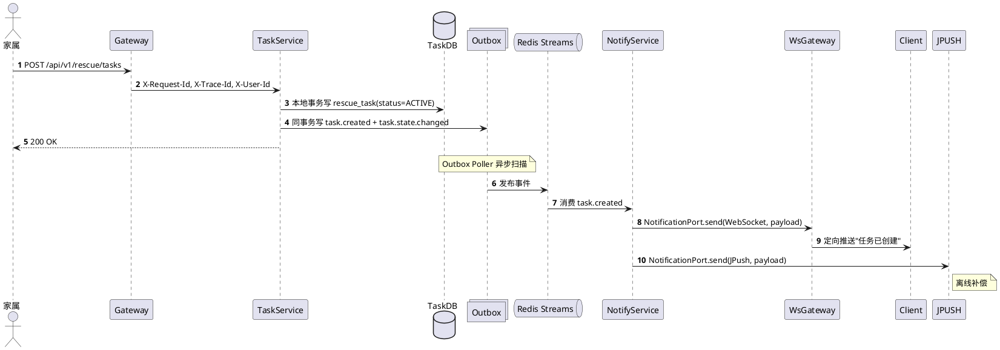
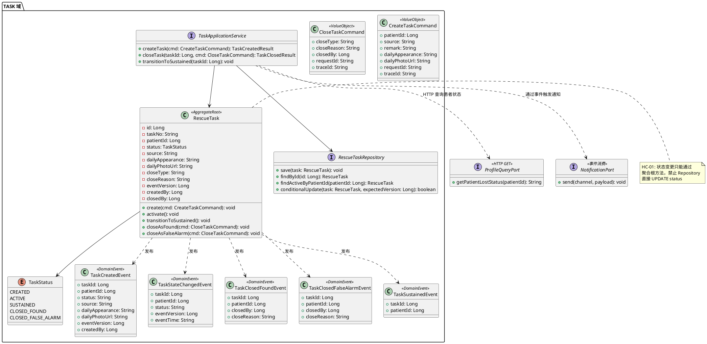
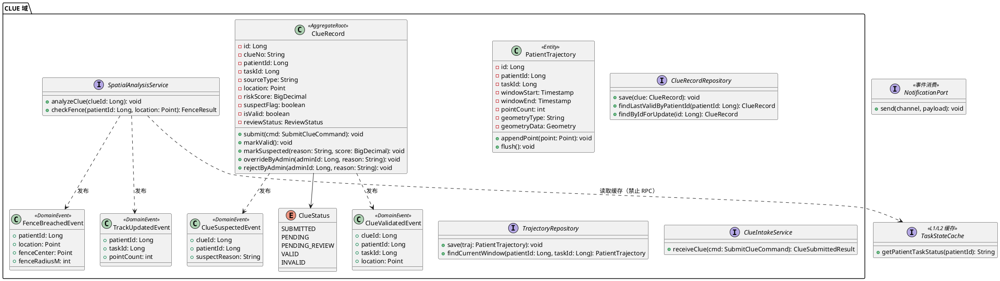
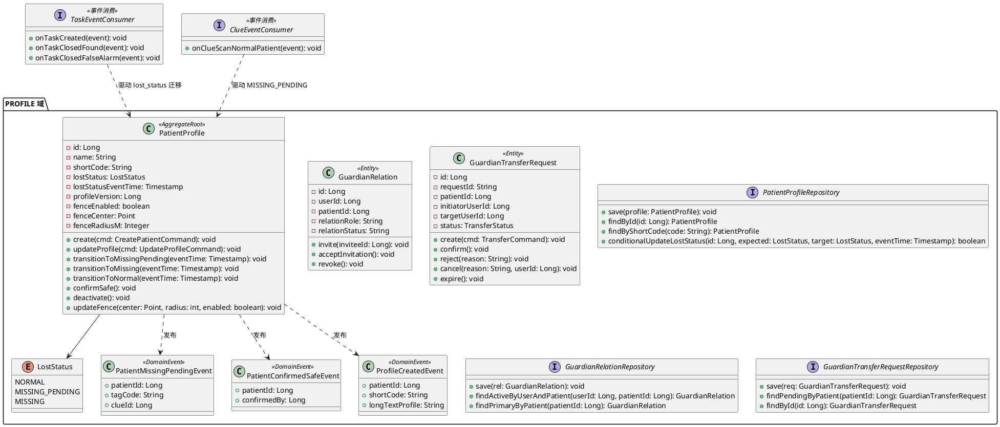
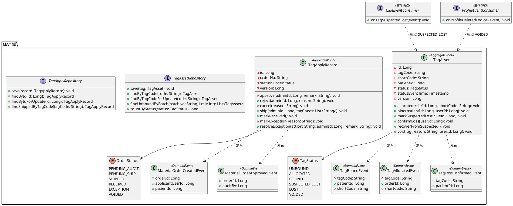
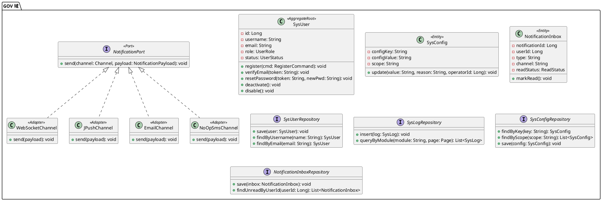

# 基于 AI 的阿尔兹海默症患者协同寻回系统

## 系统详细设计文档（LLD）

## 0. 文档信息

| 项目 | 内容 |
| :--- | :--- |
| 文档名称 | 系统详细设计文档（LLD） |
| 版本 | V2.0 |
| 日期 | 2026-04-19 |
| 输入基线 | SRS V2.0（2026-04-04）、SADD V2.0（2026-04-12） |
| 文档目标 | 将架构约束下沉为可实现、可测试、可运维的详细设计，面向编码人员精确到字段级、方法级、接口级 |

适用范围：

- 后端服务研发与联调
- 测试用例设计与验收追踪
- 运维监控、告警与演练

**与 DBD 的分工**：本文不包含 `CREATE TABLE` DDL，所有建表 SQL、索引创建语句、分区策略统一归入数据库设计文档（DBD）。本文仅描述数据模型的业务语义、字段含义与约束来源。

---

## 1. 设计范围与全局硬约束

### 1.1 设计范围

1. 六域详细设计（TASK / CLUE / PROFILE / MAT / AI / GOV），每域含数据模型、类图、API 契约、伪代码、事件 Payload、异常设计。
2. 跨域机制设计：Outbox 投递、幂等与防乱序、缓存投影、WebSocket 路由、安全令牌。
3. 可观测性、测试验收与发布回滚。

### 1.2 非范围

- 前端页面视觉和交互细节。
- `CREATE TABLE` DDL（归入 DBD）。
- 模型 Prompt 业务文案优化。
- NFC 芯片写入协议（本期仅交付二维码方案）。

### 1.3 全局硬约束继承（来自 SADD V2.0 §1.3）

| 编号 | 约束项 | LLD 级别体现 |
| :--- | :--- | :--- |
| **HC-01** | 状态权威性 | 状态变更方法只能定义在聚合根类上，Repository 层禁止直接 UPDATE status 字段。TASK 域是任务状态机唯一权威，AI 仅生成建议（来自 SADD HC-01） |
| **HC-02** | 变更原子性 | 所有写操作的 Service 方法必须在同一本地事务内写 `sys_outbox_log` 表，伪代码中必须体现（来自 SADD HC-02） |
| **HC-03** | 接口幂等性 | 每个写接口必须有 `X-Request-Id` 字段说明及 Redis SETNX 去重逻辑（来自 SADD HC-03） |
| **HC-04** | 全链路追踪 | 所有表结构必须含 `trace_id` 审计字段；所有接口 Header 必须含 `X-Trace-Id` 与 `X-Request-Id`（来自 SADD HC-04） |
| **HC-05** | 动态配置化 | 阈值类字段禁止在代码或 SQL 中硬编码，必须注明从配置中心读取的 Key 名称（来自 SADD HC-05） |
| **HC-06** | 匿名风险隔离 | 匿名入口的 DTO 必须含 `device_fingerprint` 字段，Service 层必须有频率校验调用点（来自 SADD HC-06） |
| **HC-07** | 隐私脱敏规范 | PII 字段（姓名、坐标、手机号）在 VO/DTO 层必须标注 `@Desensitize` 并说明脱敏规则；路人端照片必须叠加半透明时间戳水印（来自 SADD HC-07） |
| **HC-08** | 通信约束 | 通知出口必须通过 `NotificationPort` 接口抽象，严禁业务层直接调用渠道实现类（来自 SADD HC-08） |

### 1.4 HC-08 通信渠道规范（来自 SADD V2.0 §3.4, FR-GOV-010）

| 渠道 | 实现状态 | 适用场景 | 禁止场景 |
| :--- | :--- | :--- | :--- |
| **WebSocket** | 已实现 | 登录态用户实时业务推送（任务状态变更、围栏告警），必须定向下发，禁止广播 | 离线用户、账户类事件 |
| **极光推送（JPush）** | 已实现 | App 离线或后台时的业务提醒，作为 WebSocket 的离线补偿渠道 | 账户类事件 |
| **邮件（SMTP）** | 已实现 | 仅用于账户类事件（注册验证码、修改密码确认） | 业务流程通知 |
| **短信（SMS）** | 预留接口，`NoOpSmsChannel` 空实现 | 未来可扩展，当前不发送，仅写审计日志 | 当前所有场景，`notification.sms.enabled = false` |

```
NotificationPort（出口接口）
  ├── WebSocketChannel     ← 已实现
  ├── JPushChannel         ← 已实现
  ├── EmailChannel         ← 已实现
  └── SmsChannel           ← NoOpSmsChannel，notification.sms.enabled = false
```

### 1.5 术语

| 术语 | 说明 |
| :--- | :--- |
| Intake 原始事件 | `clue.reported.raw`，先入 Redis Streams 削峰，不走 Outbox |
| 领域状态事件 | 由领域服务发布、必须走 Outbox |
| L1/L2 缓存 | L1 为进程内本地缓存，L2 为 Redis 只读投影 |
| 抑制分支 | L1/L2 都不可用或都未命中时的受控降级路径 |
| `pod_id` | 当前连接归属的 WS 节点唯一标识 |
| Redis Streams | 事件总线选型（来自 SADD ADR-006），替代 Kafka 降低运维复杂度 |

---

## 2. 服务划分与部署视图

### 2.1 微服务拆分

| 服务名 | 所属域 | 写模型归属 | 关键职责 | 发布事件 | 消费事件 |
| :--- | :--- | :--- | :--- | :--- | :--- |
| gateway-security | 接入安全层 | 无 | 认证透传、幂等预拦截、时间窗校验 | — | — |
| auth-service | 接入安全层 | 无 | JWT 校验、resource_token 验签解码 | — | — |
| risk-service | 接入安全层 | 风控计数 | CAPTCHA、IP/设备限流、冷却策略 | — | — |
| profile-service | PROFILE 域 | `patient_profile`、`guardian_relation`、`guardian_transfer_request`、`guardian_invitation` | 档案、监护关系、走失状态迁移 | `profile.created`、`profile.updated`、`profile.deleted.logical`、`patient.missing_pending`、`patient.confirmed_safe` | `task.created`、`task.closed.found`、`task.closed.false_alarm`、`clue.scan.normal_patient`、`tag.bound` |
| task-service | TASK 域 | `rescue_task` | 任务生命周期、状态收敛、通知触发 | `task.created`、`task.state.changed`、`task.sustained`、`task.closed.found`、`task.closed.false_alarm` | `clue.validated`、`track.updated`、`fence.breached`、`ai.strategy.generated`、`ai.poster.generated`、`patient.missing_pending` |
| clue-intake-service | CLUE 域（入口） | `clue_record`（原始段） | 匿名线索入口、标准化与入站削峰 | `clue.reported.raw`、`clue.vectorize.requested`、`clue.scan.normal_patient`、`tag.suspected_lost` | — |
| clue-analysis-service | CLUE 域（研判） | `clue_record` | 时空研判、围栏判定、可疑线索识别 | `clue.validated`、`clue.suspected`、`track.updated`、`fence.breached` | `clue.reported.raw`、`task.state.changed` |
| clue-trajectory-service | CLUE 域（轨迹） | `patient_trajectory` | 轨迹聚合、窗口归档、终态 Flush | `track.updated`（聚合后） | `clue.validated`、`task.closed.found`、`task.closed.false_alarm` |
| ai-orchestrator-service | AI 域 | `ai_session`、配额账本 | AI Agent 自然语言交互、Function Calling 编排（Spring AI Alibaba）、上下文组装、推理、策略事件 | `ai.strategy.generated`、`ai.poster.generated`、`memory.appended`、`memory.expired` | `clue.validated`、`track.updated`、`task.created`、`task.closed.found`、`task.closed.false_alarm`、`task.sustained` |
| ai-vectorizer-service | AI 域 | `vector_store` | 文本切片、向量写入、失效清理 | — | `profile.created`、`profile.updated`、`profile.deleted.logical`、`memory.appended`、`memory.expired`、`clue.vectorize.requested` |
| material-service | MAT 域 | `tag_asset`、`tag_apply_record` | 标签主数据、绑定流程、工单流转、发货、异常处置 | `tag.allocated`、`tag.bound`、`tag.loss.confirmed`、`material.order.created`、`material.order.approved`、`material.order.shipped` | `tag.suspected_lost`、`profile.deleted.logical` |
| notify-service | GOV 域（通知子能力） | `notification_inbox` | 事件消费、模板组装、多渠道分发（经 `NotificationPort`） | `notification.sent` | `task.created`、`task.closed.found`、`task.closed.false_alarm`、`task.sustained`、`fence.breached`、`patient.missing_pending`、`patient.confirmed_safe`、`clue.validated`、`track.updated`、`tag.suspected_lost` |
| ws-gateway-service | GOV 域（通知子能力） | Redis 路由态 | WebSocket 长连接、路由注册、点对点下发 | — | Redis Pub/Sub `ws.push.{pod_id}` |
| admin-review-service | GOV 域（审计子能力） | `clue_record` 审核字段 | 线索复核（override/reject）、治理审计 | `clue.overridden`、`clue.rejected` | `clue.suspected` |
| outbox-dispatcher | GOV 域（Outbox 治理） | `sys_outbox_log` | 分区抢占、租约、重试、死信闸门 | Redis Streams 对应 Topic | — |

### 2.2 部署拓扑

```plantuml
@startuml
node GatewayCluster {
  [gateway-security]
  [auth-service]
  [risk-service]
}

node AppCluster {
  [profile-service]
  [task-service]
  [clue-intake-service]
  [clue-analysis-service]
  [clue-trajectory-service]
  [ai-orchestrator-service]
  [ai-vectorizer-service]
  [material-service]
  [notify-service]
  [admin-review-service]
  [outbox-dispatcher]
}

node WSCluster {
  [ws-gateway-service-1]
  [ws-gateway-service-2]
}

database "PostgreSQL 16\n(PostGIS + pgvector)" as PG
database Redis as R
cloud "大模型服务" as LLM
cloud "地图定位" as MAP
cloud "极光推送" as JPUSH
cloud "邮件 SMTP" as SMTP

GatewayCluster --> AppCluster
AppCluster --> PG
AppCluster --> R : "缓存 + Redis Streams + 路由"
ai-orchestrator-service --> LLM
clue-analysis-service --> MAP
notify-service --> JPUSH
notify-service --> SMTP
WSCluster --> R
@enduml
```

### 2.3 端到端主时序（任务创建到通知）



### 2.4 通用协议与头部约束

| 项 | 约束 |
| :--- | :--- |
| 协议 | HTTPS + JSON（来自 SRS AC-10） |
| 幂等键 | `X-Request-Id`（16-64，字母数字与 `-`）（来自 SADD HC-03） |
| 链路追踪 | `X-Trace-Id`（16-64）（来自 SADD HC-04） |
| 时间防重放 | `request_time` 偏差 ≤ 300s |
| 鉴权 | Bearer JWT（匿名接口除外）（来自 SRS FR-GOV-001） |
| Agent 执行上下文 | `X-Action-Source`、`X-Agent-Profile`、`X-Execution-Mode`、`X-Confirm-Level`（`X-Action-Source=AI_AGENT` 时必填）（来自 SADD §6.6） |
| 内部 Header 防伪造 | `X-User-Id`、`X-User-Role` 等内部头仅允许网关注入；网关必须在请求入站第一时间清洗或拒绝客户端同名头 |
| 统一响应体 | `{ code, message, trace_id, data }` |

---

## 3. 寻回任务执行域（TASK）

> **本章覆盖 SRS 需求编号**：FR-TASK-001 ~ FR-TASK-005，§5.2.2 任务状态机
> **对应 SADD 约束**：HC-01（状态权威性）、HC-02（变更原子性）、HC-03（幂等）、HC-04（追踪）、HC-05（动态配置化）

### 3.1 数据模型说明

#### 3.1.1 rescue_task（寻回任务表）

业务职责：承载寻回任务全生命周期，是任务状态机唯一权威实体。

| 字段名 | 类型 | 业务含义 | 约束来源 |
| :--- | :--- | :--- | :--- |
| `id` | bigint | 主键 | — |
| `task_no` | varchar(32) | 任务业务编号（外部可见） | — |
| `patient_id` | bigint | 关联患者 | FR-TASK-001 |
| `status` | varchar(20) | 任务状态：`CREATED`/`ACTIVE`/`SUSTAINED`/`CLOSED_FOUND`/`CLOSED_FALSE_ALARM` | SRS §5.2.2 |
| `source` | varchar(32) | 来源：`APP`/`ADMIN_PORTAL`/`AUTO_UPGRADE` | FR-TASK-002 |
| `remark` | varchar(500) | 发起备注 | — |
| `daily_appearance` | text | 当日着装特征描述（最高视觉锚点） | FR-TASK-003 |
| `daily_photo_url` | varchar(1024) | 当日照片 URL | FR-TASK-003 |
| `ai_analysis_summary` | text | AI 分析摘要（`ai.strategy.generated` 异步回写） | FR-AI-006 |
| `poster_url` | varchar(1024) | AI 海报地址（`ai.poster.generated` 回写） | FR-AI-013 |
| `close_type` | varchar(20) | 关闭类型：`FOUND`/`FALSE_ALARM` | FR-TASK-004 |
| `close_reason` | varchar(256) | 关闭原因（`FALSE_ALARM` 时必填） | FR-TASK-004 |
| `event_version` | bigint | 状态事件版本（乐观锁 `version`）**（HC-01）** | SADD HC-01 |
| `created_by` | bigint | 发起人 user_id | FR-TASK-005 |
| `closed_by` | bigint | 关闭人 user_id | FR-TASK-005 |
| `created_at` | timestamptz | 创建时间 | — |
| `closed_at` | timestamptz | 关闭时间（终态写入） | — |
| `updated_at` | timestamptz | 更新时间 | — |
| `trace_id` | varchar(64) | 创建时链路标识 **（HC-04）** | SADD HC-04 |

**标注说明**：
- `event_version` 是乐观锁字段，每次状态变更自增，用于事件防乱序（SADD §5.1）。
- `daily_appearance`、`daily_photo_url` 是 `task.created` 事件 payload 的冗余字段。
- PII 字段：无直接 PII，`patient_id` 通过关联查询。
- `SUSTAINED` 阈值由配置中心 `task.sustained.threshold.hours` 下发（HC-05）。

**业务约束**：
- 同一 `patient_id` 仅允许一个非终态任务（唯一部分索引 `uq_task_active_per_patient`）。
- `status` 为终态（`CLOSED_FOUND`/`CLOSED_FALSE_ALARM`）时 `closed_at` 必须非空。

### 3.2 核心类图



### 3.3 API 契约

#### 3.3.1 POST /api/v1/rescue/tasks

描述：创建寻回任务（来自 SRS FR-TASK-001, FR-TASK-002, FR-TASK-003）

Headers:
```
X-Trace-Id:   string, 必填，由 Gateway 注入
X-Request-Id: string, 必填，幂等键
Authorization: Bearer JWT
```

Request Body:
```json
{
  "patient_id":        "int64, 必填, 必须存在且无非终态任务",
  "source":            "string, 必填, APP / ADMIN_PORTAL",
  "remark":            "string, 选填, <= 500",
  "daily_appearance":  "string, 选填, <= 2000, 当日着装描述",
  "daily_photo_url":   "string, 选填, <= 1024, 白名单域名"
}
```

Response 200:
```json
{
  "code": "ok",
  "message": "success",
  "trace_id": "trc_xxx",
  "data": {
    "task_id": 8848,
    "task_no": "TSK20260419001",
    "status": "ACTIVE",
    "event_version": 1,
    "created_at": "2026-04-19T10:00:00Z"
  }
}
```

Response 409:
```json
{
  "code": "E_TASK_4091",
  "message": "任务进行中，请勿重复发起",
  "trace_id": "trc_xxx"
}
```

幂等说明：
```
Redis Key = "idem:req:{X-Request-Id}"，TTL = 24h
重复请求返回首次结果，不重复执行业务逻辑（HC-03）
```

#### 3.3.2 POST /api/v1/rescue/tasks/{task_id}/close

描述：关闭寻回任务（来自 SRS FR-TASK-004, FR-TASK-005）

Headers:
```
X-Trace-Id:   string, 必填
X-Request-Id: string, 必填
Authorization: Bearer JWT
```

Request Body:
```json
{
  "close_type": "string, 必填, FOUND / FALSE_ALARM",
  "close_reason": "string, FALSE_ALARM时必填, 5-256"
}
```

Response 200:
```json
{
  "code": "ok",
  "message": "success",
  "trace_id": "trc_xxx",
  "data": {
    "task_id": 8848,
    "status": "CLOSED_FOUND",
    "event_version": 5,
    "closed_at": "2026-04-19T18:00:00Z"
  }
}
```

Response 4xx:
```json
{
  "code": "E_TASK_4041",
  "message": "任务不存在",
  "trace_id": "trc_xxx"
}
```

幂等说明：同 §3.3.1

#### 3.3.3 GET /api/v1/rescue/tasks/{task_id}/snapshot

描述：拉取任务最新快照（来自 SRS FR-TASK-001）

Response 200:
```json
{
  "code": "ok",
  "trace_id": "trc_xxx",
  "data": {
    "task_id": 8848,
    "status": "ACTIVE",
    "patient_id": 1001,
    "event_version": 3,
    "event_time": "2026-04-19T12:00:00Z",
    "daily_appearance": "蓝色外套，黑色裤子",
    "latest_trajectory": { "point_count": 5, "last_coord": [116.40, 39.90] }
  }
}
```

#### 3.3.4 GET /api/v1/rescue/tasks/{task_id}/trajectory/latest

描述：按任务拉取最新轨迹片段（来自 SRS FR-CLUE-010）

Query Params:
```
limit:            int32, 选填, 1-200, 默认 50
since_event_time: string, 选填, ISO-8601, 增量拉取
```

#### 3.3.5 GET /api/v1/rescue/tasks/{task_id}/events/poll

描述：长轮询降级接口（弱网或 WS 不可用时）

Query Params:
```
since_version: int64, 必填, 客户端已确认版本
timeout_ms:    int32, 选填, 1000-25000, 默认 15000
```

### 3.4 核心流程伪代码

#### 3.4.1 创建寻回任务（Happy Path + 异常分支）

```
FUNCTION createRescueTask(cmd: CreateTaskCommand):
    // ===== 幂等检查（HC-03）=====
    IF Redis.SETNX("idem:req:{cmd.requestId}", "", TTL=24h) == false:
        RETURN cachedResult(cmd.requestId)  // 重复请求返回首次结果

    // ===== 授权校验 =====
    relation = ProfileQueryPort.getRelation(cmd.userId, cmd.patientId)  // HTTP
    IF relation == null OR relation.status != ACTIVE:
        THROW E_TASK_4032("无患者监护授权")

    // ===== 业务校验 =====
    existingTask = RescueTaskRepository.findActiveByPatientId(cmd.patientId)
    IF existingTask != null:
        THROW E_TASK_4091("任务进行中，请勿重复发起")

    // ===== 聚合根创建（HC-01：状态变更只能通过聚合根）=====
    task = RescueTask.create(cmd)
    task.status = ACTIVE
    task.eventVersion = 1

    // ===== 本地事务（HC-02：变更原子性）=====
    BEGIN TRANSACTION
        RescueTaskRepository.save(task)

        // 同事务写 Outbox
        OutboxRepository.insert(event_id=UUID, topic="task.created",
            aggregate_id=task.id, partition_key="patient_{cmd.patientId}",
            payload={task_id, patient_id, status, source, daily_appearance,
                     daily_photo_url, event_version, created_by},
            request_id=cmd.requestId, trace_id=cmd.traceId)

        OutboxRepository.insert(event_id=UUID, topic="task.state.changed",
            aggregate_id=task.id, partition_key="patient_{cmd.patientId}",
            payload={task_id, patient_id, status="ACTIVE", event_version=1,
                     event_time=now()},
            request_id=cmd.requestId, trace_id=cmd.traceId)

        // 写审计日志
        SysLogRepository.insert(module="TASK", action="TASK_CREATED",
            operator_user_id=cmd.userId, object_id=task.id,
            result="SUCCESS", trace_id=cmd.traceId,
            detail={from_status=null, to_status="ACTIVE"})
    COMMIT TRANSACTION

    // ===== Outbox Poller 异步发布到 Redis Streams =====
    // （由 outbox-dispatcher 独立处理，此处不同步等待）

    RETURN TaskCreatedResult(task_id, task_no, status, event_version)

EXCEPTION HANDLING:
    E_TASK_4032 -> HTTP 403, 无患者监护授权
    E_TASK_4091 -> HTTP 409, 任务已存在
    DB UniqueConstraintViolation -> 幂等兜底，返回已存在任务
```

#### 3.4.2 关闭寻回任务（Happy Path + 异常分支）

```
FUNCTION closeRescueTask(taskId: Long, cmd: CloseTaskCommand):
    // ===== 幂等检查（HC-03）=====
    IF Redis.SETNX("idem:req:{cmd.requestId}", "", TTL=24h) == false:
        RETURN cachedResult(cmd.requestId)

    // ===== 读取聚合根 =====
    task = RescueTaskRepository.findById(taskId)
    IF task == null:
        THROW E_TASK_4041("任务不存在")

    // ===== 权限校验（FR-TASK-005：仅发起者和主监护可关闭）=====
    IF cmd.closedBy != task.createdBy:
        isPrimary = ProfileQueryPort.isPrimaryGuardian(cmd.closedBy, task.patientId)
        IF NOT isPrimary:
            THROW E_TASK_4031("无关闭权限")

    // ===== 状态机守卫（HC-01）=====
    IF task.status NOT IN (ACTIVE, SUSTAINED):
        THROW E_TASK_4092("当前状态不可关闭")

    IF cmd.closeType == "FALSE_ALARM" AND task.status == SUSTAINED:
        THROW E_TASK_4093("长期维持任务不支持误报关闭")

    IF cmd.closeType == "FALSE_ALARM" AND (cmd.closeReason == null OR len(cmd.closeReason) < 5):
        THROW E_TASK_4221("误报关闭必须填写原因")

    // ===== 聚合根状态迁移 =====
    IF cmd.closeType == "FOUND":
        task.closeAsFound(cmd)
        eventTopic = "task.closed.found"
    ELSE:
        task.closeAsFalseAlarm(cmd)
        eventTopic = "task.closed.false_alarm"

    // ===== 本地事务（HC-02）=====
    BEGIN TRANSACTION
        success = RescueTaskRepository.conditionalUpdate(task, expectedVersion=task.eventVersion - 1)
        IF NOT success:
            THROW E_TASK_4094("并发冲突，请重试")

        OutboxRepository.insert(event_id=UUID, topic=eventTopic,
            aggregate_id=task.id, partition_key="patient_{task.patientId}",
            payload={task_id, patient_id, close_type, close_reason, closed_by,
                     event_version},
            request_id=cmd.requestId, trace_id=cmd.traceId)

        OutboxRepository.insert(event_id=UUID, topic="task.state.changed",
            aggregate_id=task.id, partition_key="patient_{task.patientId}",
            payload={task_id, patient_id, status=task.status,
                     event_version=task.eventVersion, event_time=now()},
            request_id=cmd.requestId, trace_id=cmd.traceId)

        SysLogRepository.insert(module="TASK", action="TASK_CLOSED",
            operator_user_id=cmd.closedBy, object_id=task.id,
            result="SUCCESS", trace_id=cmd.traceId,
            detail={from_status=previousStatus, to_status=task.status,
                    close_type=cmd.closeType, close_reason=cmd.closeReason})
    COMMIT TRANSACTION

    // ===== 后续异步处理 =====
    // task.closed.found → PROFILE 域恢复 NORMAL，轨迹沉淀至向量库
    // task.closed.false_alarm → PROFILE 域恢复 NORMAL，阻断数据进入 RAG（BR-003）

    RETURN TaskClosedResult(task_id, status, event_version, closed_at)

EXCEPTION HANDLING:
    E_TASK_4041 -> HTTP 404
    E_TASK_4031 -> HTTP 403
    E_TASK_4092 -> HTTP 409
    E_TASK_4093 -> HTTP 409
    E_TASK_4094 -> HTTP 409
    E_TASK_4221 -> HTTP 422
```

#### 3.4.3 任务长期维持迁移（调度器触发）

```
FUNCTION transitionToSustained():
    // ===== 配置读取（HC-05）=====
    thresholdHours = ConfigCenter.get("task.sustained.threshold.hours")  // 默认 24

    // ===== 查询超时活跃任务 =====
    staleTasks = RescueTaskRepository.findActiveOlderThan(thresholdHours)

    FOR EACH task IN staleTasks:
        // 检查是否有新线索（配置窗口内）
        hasRecentClue = ClueQueryPort.hasRecentClue(task.patientId, thresholdHours)
        IF hasRecentClue:
            CONTINUE  // 有新线索，跳过

        // ===== 聚合根状态迁移（HC-01）=====
        task.transitionToSustained()

        BEGIN TRANSACTION
            success = RescueTaskRepository.conditionalUpdate(task, expectedVersion=task.eventVersion - 1)
            IF NOT success:
                LOG.warn("并发冲突，跳过 task_id={}", task.id)
                CONTINUE

            OutboxRepository.insert(topic="task.sustained",
                payload={task_id, patient_id, event_version})

            OutboxRepository.insert(topic="task.state.changed",
                payload={task_id, patient_id, status="SUSTAINED",
                         event_version=task.eventVersion, event_time=now()})
        COMMIT TRANSACTION

    // ===== 后续：AI 降为每日摘要模式，停止主动推送告警 =====
```

### 3.5 领域事件 Payload 定义

#### 3.5.1 task.created

```json
{
  "event_type":  "task.created",
  "event_id":    "evt_01H...",
  "trace_id":    "trc_xxx",
  "occurred_at": "2026-04-19T10:00:00Z",
  "payload": {
    "task_id":           8848,
    "patient_id":        1001,
    "status":            "ACTIVE",
    "source":            "APP",
    "daily_appearance":  "蓝色外套，黑色裤子",
    "daily_photo_url":   "https://oss.example.com/photo/xxx.jpg",
    "event_version":     1,
    "created_by":        2001
  }
}
```

消费方：PROFILE 域（迁移 `lost_status` → `MISSING`）、AI 域（初始化上下文 + 配额豁免标记）、通知服务（强提醒双通道策略）

#### 3.5.2 task.state.changed

```json
{
  "event_type":  "task.state.changed",
  "event_id":    "evt_01H...",
  "trace_id":    "trc_xxx",
  "occurred_at": "2026-04-19T10:00:00Z",
  "payload": {
    "task_id":       8848,
    "patient_id":    1001,
    "status":        "ACTIVE",
    "event_version": 1,
    "event_time":    "2026-04-19T10:00:00Z"
  }
}
```

消费方：CLUE 域（围栏抑制缓存 L1/L2 更新），仅当 `incoming.version > current.version` 时覆盖

#### 3.5.3 task.closed.found

```json
{
  "event_type":  "task.closed.found",
  "event_id":    "evt_01H...",
  "trace_id":    "trc_xxx",
  "occurred_at": "2026-04-19T18:00:00Z",
  "payload": {
    "task_id":       8848,
    "patient_id":    1001,
    "closed_by":     2001,
    "close_reason":  "已在公园找到",
    "event_version": 5
  }
}
```

消费方：PROFILE 域（恢复 `NORMAL`）、CLUE 域（轨迹终态 Flush）、AI 域（异步沉淀轨迹至向量库 + 清除豁免标记）、通知服务

#### 3.5.4 task.closed.false_alarm

```json
{
  "event_type":  "task.closed.false_alarm",
  "event_id":    "evt_01H...",
  "trace_id":    "trc_xxx",
  "occurred_at": "2026-04-19T18:00:00Z",
  "payload": {
    "task_id":       8848,
    "patient_id":    1001,
    "closed_by":     2001,
    "close_reason":  "测试发起，非真实走失",
    "event_version": 5
  }
}
```

消费方：PROFILE 域（恢复 `NORMAL`）、CLUE 域（轨迹终态 Flush）、AI 域（清除豁免标记 + **阻断**数据进入 RAG，来自 BR-003）、通知服务

#### 3.5.5 task.sustained

```json
{
  "event_type":  "task.sustained",
  "event_id":    "evt_01H...",
  "trace_id":    "trc_xxx",
  "occurred_at": "2026-04-20T10:00:00Z",
  "payload": {
    "task_id":       8848,
    "patient_id":    1001,
    "event_version": 3
  }
}
```

消费方：AI 域（降为每日摘要模式）、通知服务（停止主动推送告警）

### 3.6 异常与补偿设计

#### 3.6.1 受检异常（业务异常）

| 异常 | 触发条件 | HTTP 状态码 | 错误码 | 补偿动作 |
| :--- | :--- | :---: | :--- | :--- |
| 任务已存在 | 同患者存在非终态任务 | 409 | `E_TASK_4091` | 返回已有任务 ID，前端跳转 |
| 任务不存在 | task_id 无效 | 404 | `E_TASK_4041` | — |
| 状态不可迁移 | 当前状态不允许目标操作 | 409 | `E_TASK_4092` | 返回当前状态供前端提示 |
| 无关闭权限 | 非发起者且非主监护人 | 403 | `E_TASK_4031` | — |
| 误报缺少原因 | `FALSE_ALARM` 未填写原因 | 422 | `E_TASK_4221` | 前端强制校验 |
| 无监护授权 | 用户与患者无关联 | 403 | `E_TASK_4032` | — |
| 长期任务不支持误报关闭 | SUSTAINED + FALSE_ALARM | 409 | `E_TASK_4093` | — |
| 并发冲突 | 条件更新影响行为 0 | 409 | `E_TASK_4094` | 客户端重试 |

#### 3.6.2 非受检异常（系统异常）

| 异常 | 触发条件 | HTTP 状态码 | 错误码 | 补偿动作 |
| :--- | :--- | :---: | :--- | :--- |
| Outbox 写入失败 | 数据库不可用 | 500 | `E_SYS_5001` | 事务回滚，客户端重试 |
| Redis 不可用 | 幂等缓存不可达 | 500 | `E_SYS_5002` | 降级到 DB 唯一索引兜底 |
| PROFILE 域查询超时 | HTTP 调用超时 | 503 | `E_SYS_5031` | 熔断降级，拒绝创建并提示稍后重试 |

#### 3.6.3 Outbox DEAD 处理

- 当 `task.created` 事件进入 DEAD 状态时，PROFILE 域不会收到状态迁移通知，患者 `lost_status` 将停留在旧值。
- 补偿：DEAD 事件由超管通过 `POST /api/v1/admin/super/outbox/dead/{event_id}/replay` 受控重放（需 `CONFIRM_3`）。
- 重放前必须确认同 `partition_key` 无更早未修复 DEAD。

---

## 4. 线索与时空研判域（CLUE）

> **本章覆盖 SRS 需求编号**：FR-CLUE-001 ~ FR-CLUE-010，§5.2.4 线索状态机
> **对应 SADD 约束**：HC-02（变更原子性）、HC-03（幂等）、HC-04（追踪）、HC-05（防漂移速度阈值配置化）、HC-06（匿名风险隔离）、HC-07（脱敏）、HC-08（通知通道）

### 4.1 数据模型说明

#### 4.1.1 clue_record（线索记录表）

业务职责：记录路人上报的每条线索原始数据、研判结果与复核状态。

| 字段名 | 类型 | 业务含义 | 约束来源 |
| :--- | :--- | :--- | :--- |
| `id` | bigint | 主键 | — |
| `clue_no` | varchar(32) | 线索业务编号 | — |
| `patient_id` | bigint | 关联患者 | FR-CLUE-001 |
| `task_id` | bigint | 关联任务（可空，首条线索可能先于任务） | FR-CLUE-005 |
| `tag_code` | varchar(100) | 标签码 | FR-CLUE-002 |
| `source_type` | varchar(20) | 来源：`SCAN`/`MANUAL`/`POSTER_SCAN` | FR-CLUE-002, FR-CLUE-008 |
| `location` | geometry(Point,4326) | 坐标（PostGIS，WGS84） | FR-CLUE-001 |
| `coord_system` | varchar(10) | 固定 `WGS84`（网关标准化后） | — |
| `description` | text | 现场描述 | — |
| `photo_url` | varchar(1024) | 图片地址 | FR-CLUE-001 |
| `tag_only` | boolean | 仅发现标识（无人） | SRS §3.2 异常流 |
| `risk_score` | numeric(5,4) | 风险分（0-1，研判服务生成） | FR-CLUE-005 |
| `suspect_flag` | boolean | 是否可疑 | FR-CLUE-007 |
| `suspect_reason` | varchar(256) | 可疑原因摘要 | FR-CLUE-007 |
| `is_valid` | boolean | 是否有效 | FR-CLUE-005 |
| `review_status` | varchar(20) | 复核状态：`PENDING`/`OVERRIDDEN`/`REJECTED`（非可疑为 NULL） | FR-CLUE-007 |
| `override` | boolean | 管理员强制回流标记 | FR-CLUE-007 |
| `override_by` | bigint | 强制回流操作人 | — |
| `override_reason` | varchar(256) | 强制回流原因 | — |
| `reject_reason` | varchar(256) | 驳回原因 | — |
| `rejected_by` | bigint | 驳回人 | — |
| `assignee_user_id` | bigint | 复核指派人 | — |
| `assigned_at` | timestamptz | 指派时间 | — |
| `reviewed_at` | timestamptz | 完成复核时间 | — |
| `entry_token_jti` | varchar(64) | entry_token 唯一标识（审计追溯） | HC-04 |
| `device_fingerprint` | varchar(128) | 上报设备指纹 **（HC-06）** | SADD HC-06 |
| `trace_id` | varchar(64) | 链路标识 **（HC-04）** | SADD HC-04 |
| `created_at` | timestamptz | 创建时间 | — |
| `updated_at` | timestamptz | 更新时间 | — |

**标注说明**：
- `location` 为 PostGIS 地理字段，存储策略：`geometry(Point,4326)` SRID=4326（WGS84），查询使用 `ST_DWithin` / `ST_Distance`。
- PII 字段：`location`（坐标）在非属主视图必须 `@Desensitize` 模糊化（HC-07）。
- `device_fingerprint` 是 HC-06 匿名风险隔离必填字段。

#### 4.1.2 patient_trajectory（患者轨迹表）

业务职责：将离散有效坐标点按时间窗口聚合为连续轨迹空间数据对象。

| 字段名 | 类型 | 业务含义 | 约束来源 |
| :--- | :--- | :--- | :--- |
| `id` | bigint | 主键 | — |
| `patient_id` | bigint | 患者 | — |
| `task_id` | bigint | 任务 | — |
| `window_start` | timestamptz | 窗口起始 | FR-CLUE-010 |
| `window_end` | timestamptz | 窗口结束 | FR-CLUE-010 |
| `point_count` | int | 点数量 | — |
| `geometry_type` | varchar(32) | `LINESTRING`/`SPARSE_POINT`/`EMPTY_WINDOW` | — |
| `geometry_data` | geometry | 轨迹几何（PostGIS） | FR-CLUE-010 |
| `trace_id` | varchar(64) | 链路标识 **（HC-04）** | SADD HC-04 |
| `created_at` | timestamptz | 创建时间 | — |

**约束**：`EMPTY_WINDOW` 时 `geometry_data` 必须为 NULL；其他类型 `geometry_data` 必须非 NULL。

### 4.2 核心类图



### 4.3 API 契约

#### 4.3.1 GET /r/{resource_token}

描述：扫码入口，验签并动态路由（来自 SRS FR-CLUE-002, FR-CLUE-004）

路由规则：
- `BOUND` + 患者 `NORMAL` → 302 到 `/p/{short_code}/clues/new`，下发 `entry_token` Cookie
- `BOUND` + 患者 `MISSING` 或 `MISSING_PENDING` → 302 到 `/p/{short_code}/emergency/report`，下发 `entry_token` Cookie
- `UNBOUND`/`ALLOCATED`/`VOIDED` → 无效页

安全要求：`entry_token` 仅 `HttpOnly; Secure; SameSite=Strict` Cookie 传递

#### 4.3.2 POST /api/v1/public/clues/manual-entry

描述：二维码污损时手动兜底入口（来自 SRS FR-CLUE-002, FR-CLUE-003）

Request Body:
```json
{
  "short_code":         "string, 必填, 固定6位大写字母数字",
  "captcha_token":      "string, 必填, 人机校验通过令牌",
  "device_fingerprint": "string, 必填, 16-128（HC-06）"
}
```

风控（HC-06）：
- IP 限流：≤ 5 次/分钟，配置键 `risk.manual_entry.ip.rate_per_minute`
- 设备限流：≤ 20 次/小时，配置键 `risk.manual_entry.device.rate_per_hour`
- 同 `short_code` 连续失败 ≥ 5 次进入 15 分钟冷却，配置键 `risk.manual_entry.cooldown.minutes`

Response 200:
```json
{
  "code": "ok",
  "trace_id": "trc_xxx",
  "data": {
    "manual_entry_token": "string, 一次性令牌, TTL=300s"
  }
}
```

#### 4.3.3 POST /api/v1/clues/report

描述：匿名提交线索（来自 SRS FR-CLUE-001, FR-CLUE-004, FR-CLUE-005）

Request Body:
```json
{
  "tag_code":           "string, 必填",
  "coord_system":       "string, 必填, 固定WGS84",
  "location": {
    "lat":              "number, 必填, -90~90",
    "lng":              "number, 必填, -180~180"
  },
  "description":        "string, 选填, <=2000",
  "photo_url":          "string, MANUAL时必填, 白名单域名",
  "tag_only":           "boolean, 选填, 默认false"
}
```

幂等说明：`entry_token.jti` 一次性消费，Redis `SETNX entry_token:consumed:{jti}`

处理流程：
1. 网关从 Cookie / `X-Anonymous-Token` 提取 `entry_token` 并校验
2. 一次性消费校验（Redis SETNX）
3. 设备指纹校验 + IP /24 子网匹配（见 §12.2 宽松模式说明）
4. 写 `clue_record`（raw）
5. 直接发布 Redis Streams `clue.reported.raw` + `clue.vectorize.requested`（**不走 Outbox**，来自 SADD §5.3）
6. 若 `tag_only=true` 且标签为 `BOUND`，发布 `tag.suspected_lost`

#### 4.3.4 POST /api/v1/clues/{clue_id}/override

描述：管理员强制回流可疑线索（来自 SRS FR-CLUE-007）

Request Body:
```json
{
  "override":        "boolean, 必填, 仅允许true",
  "override_reason": "string, 必填, 5-256"
}
```

结果：发布 `clue.overridden`

#### 4.3.5 POST /api/v1/clues/{clue_id}/reject

描述：管理员驳回可疑线索（来自 SRS FR-CLUE-007, BR-004）

Request Body:
```json
{
  "reject_reason": "string, 必填, 5-256"
}
```

结果：发布 `clue.rejected`

### 4.4 核心流程伪代码

#### 4.4.1 线索接收与研判（Happy Path + 异常分支）

```
FUNCTION receiveAndAnalyzeClue(rawEvent: ClueReportedRawEvent):
    // ===== 消费端幂等（本地事务日志）=====
    BEGIN TRANSACTION
        inserted = ConsumedEventLog.insertIfNotExists(
            consumer="clue-analysis", event_id=rawEvent.eventId)
        IF NOT inserted:
            RETURN  // 重复消费，跳过

        // ===== 加载线索原始记录 =====
        clue = ClueRecordRepository.findById(rawEvent.clueId)

        // ===== 第一条线索特殊处理（FR-CLUE-005）=====
        lastValidClue = ClueRecordRepository.findLastValidByPatientId(clue.patientId)
        IF lastValidClue == null:
            clue.markValid()
            clue.riskScore = 0.0
            // 第一条线索无需防漂移校验
            GOTO PUBLISH_VALID

        // ===== 防漂移速率计算（FR-CLUE-005, HC-05）=====
        maxSpeedKmh = ConfigCenter.get("clue.anti_drift.max_speed_kmh")  // 如 80
        distance = ST_Distance(clue.location, lastValidClue.location)  // 米
        timeDiffHours = (clue.createdAt - lastValidClue.createdAt) / 3600
        IF timeDiffHours <= 0:
            timeDiffHours = 0.001  // 防除零

        speedKmh = (distance / 1000) / timeDiffHours

        IF speedKmh > maxSpeedKmh:
            // ===== 异常路径：速率超限 =====
            clue.markSuspected(
                reason="速率异常: {speedKmh}km/h > 阈值{maxSpeedKmh}km/h",
                score=0.85)

            ClueRecordRepository.save(clue)

            // 同事务写 Outbox（HC-02）
            OutboxRepository.insert(topic="clue.suspected",
                partition_key="patient_{clue.patientId}",
                payload={clue_id, patient_id, suspect_reason, risk_score})
            COMMIT TRANSACTION
            RETURN

        // ===== 围栏判定（FR-CLUE-006, FR-CLUE-009）=====
        taskStatus = TaskStateCache.getPatientTaskStatus(clue.patientId)  // L1/L2
        IF taskStatus == "NORMAL" OR taskStatus == null:
            // 仅 NORMAL 态执行围栏越界判定
            fenceConfig = ProfileQueryPort.getFence(clue.patientId)  // HTTP
            IF fenceConfig != null AND fenceConfig.enabled:
                breached = ST_DWithin(clue.location, fenceConfig.center,
                                      fenceConfig.radiusM) == false
                IF breached:
                    OutboxRepository.insert(topic="fence.breached",
                        payload={patient_id, location, fence_center,
                                 fence_radius_m, clue_id})
        ELSE IF taskStatus == "MISSING" OR taskStatus == "MISSING_PENDING":
            // 走失态：抑制围栏告警，仅静默更新轨迹（FR-CLUE-009）

        // ===== 正常路径：标记有效 =====
        clue.markValid()
        clue.riskScore = calculateRiskScore(clue)

        LABEL PUBLISH_VALID:
        ClueRecordRepository.save(clue)

        OutboxRepository.insert(topic="clue.validated",
            partition_key="patient_{clue.patientId}",
            payload={clue_id, patient_id, task_id, location,
                     source_type, is_valid=true, event_version})

        OutboxRepository.insert(topic="track.updated",
            partition_key="patient_{clue.patientId}",
            payload={patient_id, task_id, clue_id, location, point_count})

    COMMIT TRANSACTION

EXCEPTION HANDLING:
    ProfileQueryPort 超时 → 围栏判定降级跳过，线索正常处理
    TaskStateCache L1/L2 不可用 → 进入抑制分支，默认不告警
```

### 4.5 领域事件 Payload 定义

#### 4.5.1 clue.reported.raw（不走 Outbox，直入 Redis Streams）

```json
{
  "event_type":  "clue.reported.raw",
  "event_id":    "evt_01H...",
  "trace_id":    "trc_xxx",
  "occurred_at": "2026-04-19T10:05:00Z",
  "payload": {
    "clue_id":            12345,
    "patient_id":         1001,
    "tag_code":           "TAG001",
    "source_type":        "SCAN",
    "location":           { "lat": 39.9042, "lng": 116.4074 },
    "device_fingerprint": "fp_abc123",
    "tag_only":           false
  }
}
```

#### 4.5.2 clue.validated

```json
{
  "event_type":  "clue.validated",
  "event_id":    "evt_01H...",
  "trace_id":    "trc_xxx",
  "occurred_at": "2026-04-19T10:05:30Z",
  "payload": {
    "clue_id":     12345,
    "patient_id":  1001,
    "task_id":     8848,
    "location":    { "lat": 39.9042, "lng": 116.4074 },
    "source_type": "SCAN",
    "is_valid":    true,
    "risk_score":  0.12
  }
}
```

#### 4.5.3 clue.suspected

```json
{
  "event_type":  "clue.suspected",
  "event_id":    "evt_01H...",
  "trace_id":    "trc_xxx",
  "occurred_at": "2026-04-19T10:05:30Z",
  "payload": {
    "clue_id":        12345,
    "patient_id":     1001,
    "suspect_reason": "速率异常: 120km/h > 阈值80km/h",
    "risk_score":     0.85
  }
}
```

#### 4.5.4 fence.breached

```json
{
  "event_type":  "fence.breached",
  "event_id":    "evt_01H...",
  "trace_id":    "trc_xxx",
  "occurred_at": "2026-04-19T10:05:30Z",
  "payload": {
    "patient_id":     1001,
    "clue_id":        12345,
    "location":       { "lat": 39.9142, "lng": 116.4174 },
    "fence_center":   { "lat": 39.9042, "lng": 116.4074 },
    "fence_radius_m": 500
  }
}
```

#### 4.5.5 track.updated

```json
{
  "event_type":  "track.updated",
  "event_id":    "evt_01H...",
  "trace_id":    "trc_xxx",
  "occurred_at": "2026-04-19T10:06:00Z",
  "payload": {
    "patient_id":  1001,
    "task_id":     8848,
    "clue_id":     12345,
    "location":    { "lat": 39.9042, "lng": 116.4074 },
    "point_count": 6
  }
}
```

#### 4.5.6 clue.scan.normal_patient（不走 Outbox，直入 Redis Streams）

```json
{
  "event_type":  "clue.scan.normal_patient",
  "event_id":    "evt_01H...",
  "trace_id":    "trc_xxx",
  "occurred_at": "2026-04-19T10:05:00Z",
  "payload": {
    "patient_id":  1001,
    "tag_code":    "TAG001",
    "clue_id":     12345,
    "location":    { "lat": 39.9042, "lng": 116.4074 }
  }
}
```

消费方：PROFILE 域（触发 `NORMAL` → `MISSING_PENDING` 迁移）

#### 4.5.7 tag.suspected_lost

```json
{
  "event_type":  "tag.suspected_lost",
  "event_id":    "evt_01H...",
  "trace_id":    "trc_xxx",
  "occurred_at": "2026-04-19T10:05:00Z",
  "payload": {
    "tag_code":   "TAG001",
    "patient_id": 1001,
    "clue_id":    12345
  }
}
```

消费方：MAT 域（标签 `BOUND` → `SUSPECTED_LOST`）

#### 4.5.8 clue.overridden

```json
{
  "event_type":  "clue.overridden",
  "event_id":    "evt_01H...",
  "trace_id":    "trc_xxx",
  "occurred_at": "2026-04-19T10:10:00Z",
  "payload": {
    "clue_id":     12345,
    "patient_id":  1001,
    "reviewer_id": 2001,
    "override_reason": "确认为有效线索"
  }
}
```

消费方：GOV 域（审计日志）

#### 4.5.9 clue.rejected

```json
{
  "event_type":  "clue.rejected",
  "event_id":    "evt_01H...",
  "trace_id":    "trc_xxx",
  "occurred_at": "2026-04-19T10:10:00Z",
  "payload": {
    "clue_id":       12345,
    "patient_id":    1001,
    "reviewer_id":   2001,
    "reject_reason": "坐标与实际不符"
  }
}
```

消费方：GOV 域（审计日志）

#### 4.5.10 clue.vectorize.requested

```json
{
  "event_type":  "clue.vectorize.requested",
  "event_id":    "evt_01H...",
  "trace_id":    "trc_xxx",
  "occurred_at": "2026-04-19T10:06:00Z",
  "payload": {
    "clue_id":      12345,
    "patient_id":   1001,
    "text_content": "老人在朝阳公园西门附近，穿蓝色外套",
    "source_type":  "SCAN"
  }
}
```

消费方：AI 域（向量化服务，触发文本 Embedding）

### 4.6 异常与补偿设计

| 异常 | 触发条件 | HTTP | 错误码 | 补偿动作 |
| :--- | :--- | :---: | :--- | :--- |
| entry_token 已消费 | jti 重复 | 409 | `E_CLUE_4012` | 返回提示"线索已提交" |
| 凭据绑定失败 | IP 或设备指纹不匹配 | 403 | `E_CLUE_4013` | — |
| 线索不存在 | clue_id 无效 | 404 | `E_CLUE_4041` | — |
| 非可疑线索不可复核 | suspect_flag=false | 422 | `E_CLUE_4221` | — |
| 复核状态不可变 | 已 OVERRIDDEN/REJECTED | 409 | `E_CLUE_4091` | — |
| Redis Streams 写入失败 | 线索入站时 | 500 | `E_SYS_5001` | 定时补偿扫描未发布的 clue_record |
| 围栏查询超时 | PROFILE HTTP 超时 | — | — | 降级跳过围栏判定，线索正常处理 |

### 4.7 关键算法说明：防漂移速率校验

**输入**：当前线索坐标 `(lat, lng)`、最近一条有效线索坐标 `(ref_lat, ref_lng)`、两者时间差 `Δt`

**处理逻辑**：
1. 使用 PostGIS `ST_Distance(geography)` 计算两点球面距离（米）
2. 计算移动速率 `speed = distance / Δt`（km/h）
3. 若 `speed > clue.anti_drift.max_speed_kmh`（配置中心下发，HC-05），标记为可疑

**输出**：`is_suspected: boolean`、`risk_score: decimal`、`suspect_reason: string`

**边界条件**：
- 第一条线索（无参考基准点）：跳过校验，直接有效（FR-CLUE-005）
- 时间差 ≤ 0：设为极小值 0.001h 防除零
- 参考基准点必须是**最近一条审核通过的线索**（FR-CLUE-005）

**配置参数 Key**：
- `clue.anti_drift.max_speed_kmh`：防漂移速度阈值（默认 80）
- `clue.suspect.auto_expire.hours`：存疑线索悬挂超时（默认 48，来自 BR-004）

---

## 5. 患者档案与监护域（PROFILE）

> **本章覆盖 SRS 需求编号**：FR-PRO-001 ~ FR-PRO-010，§5.2.1 患者走失状态机，§5.2.6 监护权协同请求状态机
> **对应 SADD 约束**：HC-01（状态权威性）、HC-02（变更原子性）、HC-04（追踪）、HC-05（围栏半径配置化、MISSING_PENDING 超时阈值）、HC-07（PII 脱敏）

### 5.1 数据模型说明

#### 5.1.1 patient_profile（患者档案表）

| 字段名 | 类型 | 业务含义 | 约束来源 |
| :--- | :--- | :--- | :--- |
| `id` | bigint | 主键 | — |
| `profile_no` | varchar(32) | 业务编号 | — |
| `name` | varchar(64) | 姓名 **`@Desensitize(CHINESE_NAME)`**（HC-07） | FR-PRO-001 |
| `gender` | varchar(16) | `MALE`/`FEMALE`/`UNKNOWN` | FR-PRO-001 |
| `birthday` | date | 出生日期 | FR-PRO-001 |
| `short_code` | char(6) | 6 位短码（服务端发号，对称混淆）**唯一** | FR-PRO-003, FR-PRO-004 |
| `photo_url` | varchar(1024) | 近期正面照片 | FR-PRO-001 |
| `medical_history` | jsonb | 医疗扩展信息（blood_type/chronic_diseases/allergy_notes） | FR-PRO-001 |
| `appearance_tags` | jsonb | 体貌特征结构化标签 | FR-PRO-001 |
| `long_text_profile` | text | 过往履历、常去地点、生活习惯（同步写入向量空间） | FR-PRO-002 |
| `fence_enabled` | boolean | 围栏开关 | FR-PRO-010 |
| `fence_center` | geometry(Point,4326) | 围栏中心（PostGIS WGS84） | FR-PRO-010 |
| `fence_radius_m` | int | 围栏半径（米） | FR-PRO-010 |
| `lost_status` | varchar(20) | `NORMAL`/`MISSING_PENDING`/`MISSING`（3 态） | SRS §5.2.1 |
| `lost_status_event_time` | timestamptz | 防乱序锚点 | SADD §4.6 |
| `profile_version` | bigint | 档案版本（乐观锁 `version`） | HC-01 |
| `created_by` | bigint | 建档人 | — |
| `created_at` | timestamptz | 创建时间 | — |
| `updated_at` | timestamptz | 更新时间 | — |
| `deleted_at` | timestamptz | 逻辑删除时间 | FR-PRO-009 |
| `trace_id` | varchar(64) | 链路标识 **（HC-04）** | SADD HC-04 |

**PII 字段**：`name`（`@Desensitize(CHINESE_NAME)`）、`photo_url`（路人端需水印）、`fence_center`（`@Desensitize(GEO_BLUR)`）
**PostGIS 字段**：`fence_center` — SRID=4326，查询方式 `ST_DWithin`
**事件 payload 冗余字段**：`lost_status`、`lost_status_event_time`（用于 `task.state.changed` 消费）

#### 5.1.2 guardian_relation（监护关系表）

业务职责：长期存在的用户-患者监护绑定关系，与转移请求解耦（单一职责拆分）。

| 字段名 | 类型 | 业务含义 | 约束来源 |
| :--- | :--- | :--- | :--- |
| `id` | bigint | 主键 | — |
| `user_id` | bigint | 用户 | FR-PRO-006 |
| `patient_id` | bigint | 患者 | — |
| `relation_role` | varchar(32) | `PRIMARY_GUARDIAN`/`GUARDIAN` | FR-PRO-006 |
| `relation_status` | varchar(20) | `PENDING`/`ACTIVE`/`REVOKED` | — |
| `trace_id` | varchar(64) | 链路标识 **（HC-04）** | SADD HC-04 |
| `created_at` | timestamptz | 创建时间 | — |
| `updated_at` | timestamptz | 更新时间 | — |

**唯一约束**：`uq_guardian_active(user_id, patient_id)` 部分索引 `WHERE relation_status = 'ACTIVE'`

#### 5.1.2a guardian_transfer_request（监护权转移请求表）

业务职责：临时性主监护权转移请求，独立生命周期，支持完整历史追溯。

| 字段名 | 类型 | 业务含义 | 约束来源 |
| :--- | :--- | :--- | :--- |
| `id` | bigint | 主键 | — |
| `request_id` | varchar(64) | 转移请求号（唯一） | FR-PRO-007 |
| `patient_id` | bigint | 归属患者 | — |
| `initiator_user_id` | bigint | 发起人（当前主监护人） | FR-PRO-007 |
| `target_user_id` | bigint | 受方（必须是 ACTIVE 成员） | FR-PRO-007 |
| `status` | varchar(32) | `PENDING_CONFIRM`/`COMPLETED`/`REJECTED`/`REVOKED`/`EXPIRED` | SRS §5.2.6 |
| `reason` | varchar(256) | 发起原因 | — |
| `expire_at` | timestamptz | 过期时间 | — |
| `confirmed_at` | timestamptz | 确认时间 | — |
| `rejected_at` | timestamptz | 拒绝时间 | — |
| `reject_reason` | varchar(256) | 拒绝原因 | — |
| `revoked_by` | bigint | 撤销操作人 | — |
| `revoked_at` | timestamptz | 撤销时间 | — |
| `revoke_reason` | varchar(256) | 撤销原因 | — |
| `trace_id` | varchar(64) | 链路标识 **（HC-04）** | SADD HC-04 |
| `created_at` | timestamptz | 创建时间 | — |
| `updated_at` | timestamptz | 更新时间 | — |

**业务约束**：同一 `patient_id` 同时仅允许一条 `PENDING_CONFIRM` 记录（部分唯一索引）。历史请求全部保留，支持审计追溯。

#### 5.1.3 guardian_invitation（监护邀请表）

| 字段名 | 类型 | 业务含义 | 约束来源 |
| :--- | :--- | :--- | :--- |
| `id` | bigint | 主键 | — |
| `invite_id` | varchar(64) | 邀请号（唯一） | FR-PRO-006 |
| `patient_id` | bigint | 归属患者 | — |
| `inviter_user_id` | bigint | 邀请发起人 | — |
| `invitee_user_id` | bigint | 被邀请用户 | — |
| `relation_role` | varchar(32) | 仅允许 `GUARDIAN` | FR-PRO-006 |
| `status` | varchar(20) | `PENDING`/`ACCEPTED`/`REJECTED`/`EXPIRED`/`REVOKED` | — |
| `reason` | varchar(256) | 发起原因 | — |
| `reject_reason` | varchar(256) | 拒绝/撤销原因 | — |
| `expire_at` | timestamptz | 过期时间 | — |
| `accepted_at` | timestamptz | 接受时间 | — |
| `rejected_at` | timestamptz | 拒绝时间 | — |
| `revoked_at` | timestamptz | 撤销时间 | — |
| `trace_id` | varchar(64) | 链路标识 **（HC-04）** | SADD HC-04 |
| `created_at` | timestamptz | 创建时间 | — |
| `updated_at` | timestamptz | 更新时间 | — |

### 5.2 核心类图



### 5.3 API 契约

#### 5.3.1 POST /api/v1/patients

描述：创建患者档案（来自 SRS FR-PRO-001, FR-PRO-002, FR-PRO-003）

Request Body:
```json
{
  "name":              "string, 必填, 2-64",
  "gender":            "string, 必填, MALE/FEMALE/UNKNOWN",
  "birthday":          "string, 必填, ISO date",
  "photo_url":         "string, 必填, 白名单域名",
  "medical_history":   "object, 选填",
  "appearance_tags":   "array, 选填, 体貌特征标签",
  "long_text_profile": "string, 选填, <=5000"
}
```

Response 200: `{ patient_id, profile_no, short_code }`

幂等说明：`Redis Key = "idem:req:{X-Request-Id}"，TTL = 24h`

#### 5.3.2 POST /api/v1/patients/{patient_id}/guardians/invitations

描述：主监护人邀请成员加入（来自 SRS FR-PRO-006）

Request Body:
```json
{
  "invitee_user_id": "int64, 必填",
  "relation_role":   "string, 必填, 仅允许GUARDIAN",
  "reason":          "string, 选填, <=256"
}
```

#### 5.3.3 POST /api/v1/patients/{patient_id}/guardians/primary-transfer

描述：发起主监护权双阶段转移（来自 SRS FR-PRO-007, BR-005）

Request Body:
```json
{
  "target_user_id":     "int64, 必填, 必须是ACTIVE成员",
  "reason":             "string, 必填, 5-256",
  "expire_in_seconds":  "int32, 选填, 300-86400, 默认1800"
}
```

#### 5.3.4 POST /api/v1/patients/{patient_id}/missing-pending/confirm

描述：家属确认走失或否认走失（来自 SRS §5.2.1）

Request Body:
```json
{
  "action": "string, 必填, CONFIRM_MISSING / CONFIRM_SAFE"
}
```

处理逻辑：
- `CONFIRM_MISSING`：创建任务（调用 TASK 域）→ 患者 → `MISSING`
- `CONFIRM_SAFE`：患者 → `NORMAL`，发布 `patient.confirmed_safe`

#### 5.3.5 PUT /api/v1/patients/{patient_id}/fence

描述：更新围栏配置（来自 SRS FR-PRO-010，SADD §6.7 白名单 `update_fence_config`）

Headers:
```
X-Trace-Id:   string, 必填
X-Request-Id: string, 必填
Authorization: Bearer JWT
```

Request Body:
```json
{
  "fence_enabled":  "boolean, 必填",
  "fence_center":   "object, 开启时必填, { lng: number, lat: number }",
  "fence_radius_m": "int32, 开启时必填, 100-50000, 配置键 profile.fence.default_radius_m"
}
```

Response 200:
```json
{
  "code": "ok",
  "trace_id": "trc_xxx",
  "data": {
    "patient_id": 1001,
    "fence_enabled": true,
    "fence_radius_m": 500
  }
}
```

权限要求：当前用户必须为该患者 `PRIMARY_GUARDIAN` 或 `GUARDIAN`（ACTIVE）

幂等说明：`Redis Key = "idem:req:{X-Request-Id}"，TTL = 24h`

#### 5.3.6 PUT /api/v1/patients/{patient_id}/appearance

描述：更新当日着装特征描述（最高视觉锚点）（来自 SRS FR-TASK-003，SADD §6.7 白名单 `update_daily_appearance`）

Headers:
```
X-Trace-Id:   string, 必填
X-Request-Id: string, 必填
Authorization: Bearer JWT
```

Request Body:
```json
{
  "daily_appearance": "string, 必填, <=2000, 当日着装特征描述",
  "daily_photo_url":  "string, 选填, <=1024, 白名单域名"
}
```

Response 200:
```json
{
  "code": "ok",
  "trace_id": "trc_xxx",
  "data": { "patient_id": 1001, "updated_at": "2026-04-19T10:00:00Z" }
}
```

权限要求：当前用户必须为该患者关联家属（ACTIVE），且患者存在进行中任务时同步更新 `rescue_task.daily_appearance` + `rescue_task.daily_photo_url`

幂等说明：`Redis Key = "idem:req:{X-Request-Id}"，TTL = 24h`

#### 5.3.7 PUT /api/v1/patients/{patient_id}/profile

描述：更新基础档案信息（来自 SRS FR-PRO-001, FR-PRO-002，SADD §6.7 白名单 `update_patient_profile`）

Headers:
```
X-Trace-Id:   string, 必填
X-Request-Id: string, 必填
Authorization: Bearer JWT
```

Request Body:
```json
{
  "name":              "string, 选填, 2-64",
  "gender":            "string, 选填, MALE/FEMALE/UNKNOWN",
  "birthday":          "string, 选填, ISO date",
  "photo_url":         "string, 选填, 白名单域名",
  "medical_history":   "object, 选填",
  "appearance_tags":   "array, 选填",
  "long_text_profile": "string, 选填, <=5000"
}
```

Response 200: `{ patient_id, profile_version, updated_at }`

权限要求：当前用户必须为该患者关联家属（ACTIVE）

幂等说明：`Redis Key = "idem:req:{X-Request-Id}"，TTL = 24h`

处理逻辑：
1. 更新 `patient_profile` 对应字段，`profile_version` 自增
2. 若 `long_text_profile` 变更，同事务写 Outbox 发布 `profile.updated`，触发 ai-vectorizer-service 重建向量

#### 5.3.8 GET /api/v1/admin/patients（管理员全局只读列表）

描述：管理员跨监护关系查询全局患者档案（FR-PRO-011，V2.1 增量）。

权限要求：`ADMIN` 或 `SUPER_ADMIN`；`admin` 与 `super_admin` 在本接口权限一致（均为只读）。

Query：`keyword` / `status` / `gender` / `primary_guardian_user_id` / `cursor` / `page_size`

Response 200：`items[]` 含 `patient_id / profile_no / short_code / patient_name(脱敏) / gender / age / status / primary_guardian{user_id,nickname(脱敏),phone(脱敏)} / guardian_count / active_task_id / created_at`，`next_cursor` / `has_next`。

数据访问：

- SQL 主表 `patient_profile`，LEFT JOIN `guardian_relation g ON g.patient_id = p.id AND g.relation_role='PRIMARY_GUARDIAN' AND g.relation_status='ACTIVE'` LEFT JOIN `sys_user u ON u.id = g.user_id`；
- 排序 `p.id DESC`，游标使用 `encodeBase64({"id": lastId})`；
- `guardian_count` 子查询：`SELECT count(*) FROM guardian_relation WHERE patient_id=p.id AND relation_status='ACTIVE'`。

脱敏（HC-07）：PII 字段走 `@Desensitize(NAME/PHONE/EMAIL)`；响应 DTO 序列化前统一处理。

审计：同事务写 `sys_log`，`module=PROFILE`，`action=admin.patient.list`，`risk_level=MEDIUM`，`object_id=null`，`detail.filters={...}`。

#### 5.3.9 GET /api/v1/admin/patients/{patient_id}（管理员档案详情只读）

描述：管理员只读查看患者档案完整详情（FR-PRO-011）。权限同 §5.3.8。

处理逻辑：
1. 加载 `patient_profile` 并按 HC-07 脱敏；
2. 加载 `guardian_relation` 所有 `relation_status='ACTIVE'` 成员 JOIN `sys_user`，按 `relation_role=PRIMARY_GUARDIAN DESC, created_at ASC` 排序；
3. 写 `sys_log`，`action=admin.patient.read`，`risk_level=MEDIUM`，`object_id=patient_id`。

#### 5.3.10 POST /api/v1/admin/patients/{patient_id}/guardians/force-transfer（管理员强制转移主监护）

描述：行政强制转移主监护权（FR-PRO-012，V2.1 增量），用于原主监护失联 / 禁用 / 注销的场景。

权限要求：仅 `SUPER_ADMIN`，`X-Confirm-Level=CONFIRM_3`。

Request Body：
```json
{
  "target_user_id": "string, 必填",
  "reason":         "string, 必填, 20-256",
  "evidence_url":   "string, 可选"
}
```

前置校验：
- `target_user_id` 必须为当前 `patient_id` 的 `guardian_relation.relation_status='ACTIVE'` 成员；否则 `E_PRO_4044`；
- `target_user_id` 对应 `sys_user.role=FAMILY` 且 `status=ACTIVE`；否则 `E_PRO_4035`；
- `target_user_id` 非当前主监护本身。

事务：
1. `UPDATE guardian_relation SET relation_role='GUARDIAN' WHERE patient_id=? AND relation_role='PRIMARY_GUARDIAN'`；
2. `UPDATE guardian_relation SET relation_role='PRIMARY_GUARDIAN' WHERE patient_id=? AND user_id=?`；
3. `UPDATE patient_profile SET profile_version = profile_version + 1 WHERE id=?`（HC-01 乐观锁）；
4. 写 Outbox `patient.primary_guardian.force_transferred`（见 §5.5.X）；
5. 写 `sys_log`，`action=admin.patient.force_transfer_primary`，`risk_level=CRITICAL`，`confirm_level=CONFIRM_3`，`detail.previous_primary_user_id / new_primary_user_id / reason / evidence_url`。

幂等：`Redis Key = "idem:req:{X-Request-Id}"，TTL = 24h`。

异常对照：`E_PRO_4041` / `E_PRO_4046` / `E_PRO_4044` / `E_PRO_4035` / `E_AUTH_4031`。

### 5.4 核心流程伪代码

#### 5.4.1 路人扫码触发 MISSING_PENDING（3 态走失状态机核心流程）

```
// ===== PROFILE 域消费 clue.scan.normal_patient 事件 =====
FUNCTION onClueScanNormalPatient(event: ClueScanNormalPatientEvent):

    BEGIN TRANSACTION
        // 消费幂等
        inserted = ConsumedEventLog.insertIfNotExists(
            consumer="profile-service", event_id=event.eventId)
        IF NOT inserted:
            RETURN

        // 加载聚合根
        patient = PatientProfileRepository.findById(event.patientId)
        IF patient == null:
            LOG.error("患者不存在, patient_id={}", event.patientId)
            RETURN

        // 状态机守卫（HC-01）
        IF patient.lostStatus != NORMAL:
            // 已处于 MISSING_PENDING 或 MISSING，不重复迁移
            // MISSING_PENDING 重复扫码：正常接收线索但不迁移（SADD §4.4.1）
            RETURN

        // 聚合根状态迁移
        patient.transitionToMissingPending(event.occurredAt)

        PatientProfileRepository.save(patient)

        // 同事务写 Outbox（HC-02）
        OutboxRepository.insert(topic="patient.missing_pending",
            partition_key="patient_{event.patientId}",
            payload={patient_id, tag_code=event.tagCode, clue_id=event.clueId,
                     event_time=event.occurredAt})

        SysLogRepository.insert(module="PROFILE", action="LOST_STATUS_CHANGED",
            detail={from_status="NORMAL", to_status="MISSING_PENDING",
                    trigger="clue.scan.normal_patient"})
    COMMIT TRANSACTION

    // ===== 异步：通知服务消费 patient.missing_pending =====
    // NotificationPort.send(WebSocket, {type: "MISSING_PENDING_ALERT", patient_id})
    // NotificationPort.send(JPush, {type: "MISSING_PENDING_ALERT", patient_id})
    // 启动超时调度器：patient.missing_pending.timeout.minutes（HC-05）
```

#### 5.4.2 MISSING_PENDING 超时自动升级

```
FUNCTION scheduleMissingPendingTimeout():
    timeoutMinutes = ConfigCenter.get("patient.missing_pending.timeout.minutes")

    pendingPatients = PatientProfileRepository
        .findByLostStatusAndTimeoutExceeded(MISSING_PENDING, timeoutMinutes)

    FOR EACH patient IN pendingPatients:
        // 自动创建任务（调用 TASK 域 API）
        result = TaskServiceClient.POST("/api/v1/rescue/tasks", {
            patient_id: patient.id,
            source: "AUTO_UPGRADE",
            remark: "MISSING_PENDING超时自动升级"
        }, headers={X-Action-Source: "SYSTEM", X-Trace-Id: newTraceId()})

        IF result.code == "ok":
            // task.created 事件将驱动 PROFILE 域迁移 lost_status → MISSING
            // 同时发送二次强提醒
            NotificationPort.send(WebSocket, {type: "AUTO_UPGRADE_ALERT",
                patient_id: patient.id, task_id: result.data.task_id})
            NotificationPort.send(JPush, {type: "AUTO_UPGRADE_ALERT",
                patient_id: patient.id})
        ELSE:
            LOG.warn("自动升级失败, patient_id={}, code={}", patient.id, result.code)
```

#### 5.4.3 主监护权双阶段转移

```
FUNCTION initiatePrimaryTransfer(cmd: TransferCommand):
    // 幂等检查（HC-03）
    IF Redis.SETNX("idem:req:{cmd.requestId}", "", TTL=24h) == false:
        RETURN cachedResult(cmd.requestId)

    BEGIN TRANSACTION
        // 校验发起方是主监护人
        initiator = GuardianRelationRepository
            .findActiveByUserAndPatient(cmd.userId, cmd.patientId)
        IF initiator.relationRole != PRIMARY_GUARDIAN:
            THROW E_PROFILE_4032("仅主监护人可发起转移")

        // 校验无进行中转移请求
        existingPending = GuardianTransferRequestRepository
            .findPendingByPatient(cmd.patientId)
        IF existingPending != null:
            THROW E_PROFILE_4095("已有进行中的转移请求")

        // 校验目标是 ACTIVE 成员
        target = GuardianRelationRepository
            .findActiveByUserAndPatient(cmd.targetUserId, cmd.patientId)
        IF target == null OR target.relationStatus != ACTIVE:
            THROW E_PROFILE_4044("目标用户非活跃成员")

        // 创建独立转移请求记录
        transferReq = GuardianTransferRequest.create(
            patientId=cmd.patientId,
            initiatorUserId=cmd.userId,
            targetUserId=cmd.targetUserId,
            reason=cmd.reason,
            expireInSeconds=cmd.expireInSeconds)

        GuardianTransferRequestRepository.save(transferReq)

        SysLogRepository.insert(module="GUARDIAN", action="TRANSFER_INITIATED",
            operator_user_id=cmd.userId, object_id=cmd.patientId,
            trace_id=cmd.traceId,
            detail={request_id=transferReq.requestId,
                    target_user_id=cmd.targetUserId, reason=cmd.reason})
    COMMIT TRANSACTION

    // 通知目标受方
    NotificationPort.send(WebSocket, {type: "TRANSFER_REQUEST",
        patient_id: cmd.patientId, from_user_id: cmd.userId})
    NotificationPort.send(JPush, {type: "TRANSFER_REQUEST",
        patient_id: cmd.patientId})

EXCEPTION HANDLING:
    E_PROFILE_4032 -> HTTP 403
    E_PROFILE_4095 -> HTTP 409
    E_PROFILE_4044 -> HTTP 422
```

### 5.5 领域事件 Payload 定义

#### 5.5.1 patient.missing_pending

```json
{
  "event_type":  "patient.missing_pending",
  "event_id":    "evt_01H...",
  "trace_id":    "trc_xxx",
  "occurred_at": "2026-04-19T10:00:00Z",
  "payload": {
    "patient_id": 1001,
    "tag_code":   "TAG001",
    "clue_id":    12345,
    "event_time": "2026-04-19T10:00:00Z"
  }
}
```

消费方：TASK 域（启动超时调度器）、通知服务（推送家属强提醒双通道）

#### 5.5.2 patient.confirmed_safe

```json
{
  "event_type":  "patient.confirmed_safe",
  "event_id":    "evt_01H...",
  "trace_id":    "trc_xxx",
  "occurred_at": "2026-04-19T10:10:00Z",
  "payload": {
    "patient_id":  1001,
    "confirmed_by": 2001
  }
}
```

消费方：通知服务（推送确认结果）

#### 5.5.3 profile.created

```json
{
  "event_type":  "profile.created",
  "event_id":    "evt_01H...",
  "trace_id":    "trc_xxx",
  "occurred_at": "2026-04-19T09:00:00Z",
  "payload": {
    "patient_id":        1001,
    "short_code":        "A3B7K2",
    "long_text_profile": "老人常去朝阳公园散步...",
    "profile_version":   1
  }
}
```

消费方：AI 向量化服务（触发 Embedding 初始化）

#### 5.5.4 profile.updated

```json
{
  "event_type":  "profile.updated",
  "event_id":    "evt_01H...",
  "trace_id":    "trc_xxx",
  "occurred_at": "2026-04-19T11:00:00Z",
  "payload": {
    "patient_id":      1001,
    "changed_fields":  ["long_text_profile", "appearance_tags"],
    "profile_version": 3
  }
}
```

消费方：AI 向量化服务（触发向量重建）

#### 5.5.5 profile.deleted.logical

```json
{
  "event_type":  "profile.deleted.logical",
  "event_id":    "evt_01H...",
  "trace_id":    "trc_xxx",
  "occurred_at": "2026-04-19T20:00:00Z",
  "payload": {
    "patient_id": 1001,
    "deleted_by": 2001
  }
}
```

消费方：AI 向量化服务（清理全部 Embedding）、MAT 域（标签强制 `VOIDED`）

### 5.6 异常与补偿设计

| 异常 | 触发条件 | HTTP | 错误码 | 补偿动作 |
| :--- | :--- | :---: | :--- | :--- |
| 患者不存在 | patient_id 无效 | 404 | `E_PROFILE_4041` | — |
| 非主监护人 | 无权操作 | 403 | `E_PROFILE_4032` | — |
| 成员非活跃 | relation_status != ACTIVE | 422 | `E_PROFILE_4044` | — |
| 已有进行中转移 | 重复发起 | 409 | `E_PROFILE_4095` | 返回已有请求 ID |
| 转移已过期 | 超时 | 409 | `E_PROFILE_4097` | 自动失效 |
| 短码冲突 | 唯一索引冲突 | — | — | 自动重试下一序列值，最多 3 次 |
| 短码熔断 | 冲突率 >0.01% | 503 | `E_SYS_5031` | 阻断建档，等待人工处置 |

### 5.7 关键算法说明：短码生成

**输入**：数据库序列 `patient_short_code_seq` 的下一个值 `sequence_id`

**处理逻辑**：
1. 发号服务按固定步长（如 200）预取号段到节点本地
2. `sequence_id` → 可逆混淆（`[0, 36^6-1]` 上的双射映射）→ `Base36` 定长 6 位
3. 混淆算法必须保证 encode/decode 回环一致性

**输出**：6 位大写字母数字短码 `short_code`

**边界条件**：
- 禁止对混淆结果截断、取模、大小写归一
- 唯一索引兜底；冲突时重试下一序列值，单请求最多 3 次
- 节点故障后未消费号段直接废弃，禁止回填

**配置参数 Key**：
- `shortcode.alloc.step_size`：号段预取步长（默认 200）
- `shortcode.conflict.circuit_breaker.threshold`：熔断阈值（默认 0.01%）
- `shortcode.conflict.circuit_breaker.duration_seconds`：熔断持续时间（默认 30）

---

## 6. 标签与物资运营域（MAT）

> **本章覆盖 SRS 需求编号**：FR-MAT-001 ~ FR-MAT-006，§5.2.3 标签状态机，§5.2.5 工单状态机
> **对应 SADD 约束**：HC-01（状态权威性）、HC-02（变更原子性）、HC-03（幂等）、HC-04（追踪）、HC-05（库存预警阈值配置化）

### 6.1 数据模型说明

#### 6.1.1 tag_asset（标签资产表）

业务职责：防走失标签的全生命周期主数据，含 6 态状态机。

| 字段名 | 类型 | 业务含义 | 约束来源 |
| :--- | :--- | :--- | :--- |
| `id` | bigint | 主键 | — |
| `tag_code` | varchar(100) | 标签唯一编码（全局唯一） | FR-MAT-005 |
| `short_code` | char(6) | 关联患者短码（绑定后填充） | FR-MAT-002 |
| `patient_id` | bigint | 绑定患者（绑定后填充） | — |
| `status` | varchar(20) | `UNBOUND`/`ALLOCATED`/`BOUND`/`SUSPECTED_LOST`/`LOST`/`VOIDED` | SRS §5.2.3 |
| `status_event_time` | timestamptz | 状态变更锚点（防乱序） | SADD §4.6 |
| `qr_content` | varchar(1024) | 二维码内容（URL + 签名参数） | FR-MAT-005 |
| `resource_token` | varchar(256) | 二维码路由凭据 | SADD §3.5 |
| `batch_no` | varchar(64) | 批次号（发号批次） | FR-MAT-005 |
| `order_id` | bigint | 关联工单 ID（分配后填充） | FR-MAT-002 |
| `bound_at` | timestamptz | 绑定时间 | — |
| `bound_by` | bigint | 绑定操作人 | — |
| `voided_at` | timestamptz | 作废时间 | — |
| `voided_by` | bigint | 作废操作人 | — |
| `void_reason` | varchar(256) | 作废原因 | FR-MAT-004 |
| `suspected_lost_at` | timestamptz | 疑似丢失时间 | — |
| `suspected_lost_clue_id` | bigint | 触发疑似丢失的线索 ID | — |
| `loss_confirmed_at` | timestamptz | 确认丢失时间 | — |
| `loss_confirmed_by` | bigint | 确认丢失操作人 | — |
| `version` | bigint | 乐观锁（状态表必选） | HC-01 |
| `trace_id` | varchar(64) | 链路标识 **（HC-04）** | SADD HC-04 |
| `created_at` | timestamptz | 创建时间 | — |
| `updated_at` | timestamptz | 更新时间 | — |

**标注说明**：
- `version` 乐观锁字段：所有状态变更必须通过聚合根方法 + CAS 更新（HC-01）
- `resource_token` 为 SADD §3.5 定义的路由凭据，内含签名参数，扫码入口依赖该字段路由

#### 6.1.2 tag_apply_record（物资申领工单表）

业务职责：物资申领的全流程工单，6 主态 + 2 终态（REJECTED/CANCELLED）。

| 字段名 | 类型 | 业务含义 | 约束来源 |
| :--- | :--- | :--- | :--- |
| `id` | bigint | 主键 | — |
| `order_no` | varchar(32) | 工单业务编号 | — |
| `applicant_user_id` | bigint | 申领人 | FR-MAT-001 |
| `patient_id` | bigint | 关联患者 | — |
| `status` | varchar(20) | `PENDING_AUDIT`/`PENDING_SHIP`/`SHIPPED`/`RECEIVED`/`EXCEPTION`/`VOIDED` | SRS §5.2.5 |
| `rejected` | boolean | 是否被驳回 | — |
| `cancelled` | boolean | 是否被取消 | — |
| `quantity` | int | 申领数量 | FR-MAT-001 |
| `shipping_address` | varchar(512) | 收货地址 | — |
| `shipping_contact` | varchar(64) | 收货联系人 **`@Desensitize(CHINESE_NAME)`** | HC-07 |
| `shipping_phone` | varchar(32) | 收货电话 **`@Desensitize(PHONE)`** | HC-07 |
| `audit_by` | bigint | 审核人 | — |
| `audit_at` | timestamptz | 审核时间 | — |
| `audit_remark` | varchar(256) | 审核备注 | — |
| `reject_reason` | varchar(256) | 驳回原因 | FR-MAT-004 |
| `cancel_reason` | varchar(256) | 取消原因 | FR-MAT-004 |
| `ship_at` | timestamptz | 发货时间 | — |
| `ship_by` | bigint | 发货操作人 | — |
| `ship_remark` | varchar(256) | 发货备注 | — |
| `received_at` | timestamptz | 签收时间 | — |
| `exception_reason` | varchar(256) | 异常原因 | FR-MAT-004 |
| `exception_at` | timestamptz | 异常时间 | — |
| `exception_resolved_action` | varchar(20) | `RESEND`/`VOID` | FR-MAT-004, BR-008 |
| `exception_resolved_by` | bigint | 异常处置人 | — |
| `exception_resolved_at` | timestamptz | 异常处置时间 | — |
| `exception_resolved_remark` | varchar(256) | 异常处置备注 | — |
| `version` | bigint | 乐观锁 | HC-01 |
| `trace_id` | varchar(64) | 链路标识 **（HC-04）** | SADD HC-04 |
| `created_at` | timestamptz | 创建时间 | — |
| `updated_at` | timestamptz | 更新时间 | — |

**PII 字段**：`shipping_contact`（`@Desensitize(CHINESE_NAME)`）、`shipping_phone`（`@Desensitize(PHONE)`）

### 6.2 核心类图



### 6.3 API 契约

#### 6.3.1 POST /api/v1/material/orders

描述：家属提交物资申领工单（来自 SRS FR-MAT-001）

Headers: `X-Trace-Id`, `X-Request-Id`, `Authorization: Bearer JWT`

Request Body:
```json
{
  "patient_id":        "int64, 必填",
  "quantity":          "int32, 必填, 1-10",
  "shipping_address":  "string, 必填, <=512",
  "shipping_contact":  "string, 必填, <=64",
  "shipping_phone":    "string, 必填, 手机号格式"
}
```

Response 200: `{ order_id, order_no, status: "PENDING_AUDIT" }`

幂等说明：`Redis Key = "idem:req:{X-Request-Id}"，TTL = 24h`

#### 6.3.2 POST /api/v1/material/orders/{order_id}/approve

描述：管理员审核通过（来自 SRS FR-MAT-001）

Request Body:
```json
{
  "action":  "string, 必填, APPROVE/REJECT",
  "remark":  "string, REJECT时必填, <=256"
}
```

#### 6.3.3 POST /api/v1/material/orders/{order_id}/ship

描述：管理员发货出库，绑定标签短码（来自 SRS FR-MAT-002, FR-MAT-006）

Request Body:
```json
{
  "tag_codes":   "array<string>, 必填, 数量=工单quantity",
  "ship_remark": "string, 选填, <=256"
}
```

校验逻辑：
- 每个 `tag_code` 必须存在且状态为 `UNBOUND`（FR-MAT-006）
- 禁止 `ALLOCATED`/`BOUND`/`VOIDED` 标签出库

#### 6.3.4 POST /api/v1/tags/{tag_code}/bind

描述：家属在线绑定标签到患者档案（来自 SRS §5.2.3，FR-MAT-003）

Request Body:
```json
{
  "patient_id": "int64, 必填"
}
```

联动效果：
- 标签 `ALLOCATED` → `BOUND`
- 若关联工单处于 `SHIPPED`，自动迁移为 `RECEIVED`（FR-MAT-003）
- 发布 `tag.bound` 事件

#### 6.3.5 POST /api/v1/tags/{tag_code}/loss/confirm

描述：主监护人确认标签丢失（来自 SRS §5.2.3）

Request Body:
```json
{
  "action": "string, 必填, CONFIRM_LOSS/RECOVER"
}
```

- `CONFIRM_LOSS`：`SUSPECTED_LOST` → `LOST`，发布 `tag.loss.confirmed`
- `RECOVER`：`SUSPECTED_LOST` → `BOUND`

#### 6.3.6 POST /api/v1/tags/batch-generate

描述：平台批量发号（异步任务模式）（来自 SRS FR-MAT-005）

> 最大支持 10,000 条，响应体可达 100~200KB，为避免弱网超时，采用异步任务 + 文件下载模式。

Request Body:
```json
{
  "quantity":   "int32, 必填, 1-10000",
  "batch_no":   "string, 必填, 批次号"
}
```

Response 202（任务已受理）:
```json
{
  "code": "ACCEPTED",
  "trace_id": "trc_xxx",
  "data": {
    "job_id":     "job_20260419_001",
    "batch_no":   "BATCH2026041901",
    "quantity":   5000,
    "status":     "PROCESSING",
    "poll_url":   "/api/v1/tags/batch-generate/jobs/{job_id}"
  }
}
```

#### 6.3.6a GET /api/v1/tags/batch-generate/jobs/{job_id}

描述：查询批量发号任务状态

Response 200（进行中）:
```json
{
  "job_id": "job_20260419_001",
  "status": "PROCESSING",
  "progress": 3200,
  "total":    5000
}
```

Response 200（已完成）:
```json
{
  "job_id":       "job_20260419_001",
  "status":       "COMPLETED",
  "batch_no":     "BATCH2026041901",
  "generated_count": 5000,
  "download_url": "/api/v1/tags/batch-generate/jobs/{job_id}/download",
  "expires_at":   "2026-04-20T10:00:00Z"
}
```

`download_url` 返回 CSV 文件（`tag_code, short_code, qr_content`），签名 URL 有效期 24h。

#### 6.3.7 GET /api/v1/tags/inventory/summary

描述：库存余量查询（来自 SRS FR-MAT-006）

Response 200:
```json
{
  "unbound_count":         1200,
  "allocated_count":       50,
  "bound_count":           800,
  "suspected_lost_count":  3,
  "lost_count":            10,
  "voided_count":          25,
  "low_stock_warning":     false
}
```

`low_stock_warning` 判定阈值：配置键 `mat.inventory.low_stock.threshold`（HC-05）

#### 6.3.8 POST /api/v1/material/orders/{order_id}/resolve-exception

描述：管理员对 `EXCEPTION` 工单执行补发或直接作废（SRS AC-07，FR-MAT-004）。

**前置检查**：
1. 工单当前状态必须为 `EXCEPTION`，否则返回 `E_MAT_4091`（409）。
2. `action = RESHIP` 时，`tracking_no` + `carrier` 必填；校验 `tracking_no` 全局唯一（同 §6.3.3）。
3. 幂等键：`idem:req:{requestId}`，TTL 24h（HC-03）。

**事务逻辑**：

```
BEGIN TRANSACTION
  order = TagApplyRepository.findByIdForUpdate(orderId)
  IF order.status != EXCEPTION: THROW E_MAT_4091

  IF action == RESHIP:
      order.logistics.tracking_no = cmd.trackingNo
      order.logistics.carrier     = cmd.carrier
      order.logistics.shipped_at  = now()
      order.status = SHIPPED
      publish Outbox: order.exception.reshipped
  ELSE IF action == VOID:
      order.status = VOIDED
      publish Outbox: order.exception.voided

  order.resolve_reason  = cmd.reason
  order.resolved_by     = currentUserId
  order.resolved_at     = now()
  writeAuditLog(action="admin_resolve_exception_order", resource=orderId, risk=HIGH)
COMMIT
```

**授权矩阵**：`ADMIN` 与 `SUPER_ADMIN` 均可执行。

### 6.4 核心流程伪代码

#### 6.4.1 发货出库（标签分配 + 工单流转）

```
FUNCTION shipOrder(cmd: ShipOrderCommand):
    // 幂等检查（HC-03）
    IF Redis.SETNX("idem:req:{cmd.requestId}", "", TTL=24h) == false:
        RETURN cachedResult(cmd.requestId)

    BEGIN TRANSACTION
        // 加载工单聚合根
        order = TagApplyRepository.findByIdForUpdate(cmd.orderId)
        IF order.status != PENDING_SHIP:
            THROW E_MAT_4091("工单状态不允许发货")

        // 校验标签数量
        IF cmd.tagCodes.size != order.quantity:
            THROW E_MAT_4221("标签数量与工单不匹配")

        // 逐个校验并分配标签
        FOR EACH tagCode IN cmd.tagCodes:
            tag = TagAssetRepository.findByTagCodeForUpdate(tagCode)
            IF tag == null:
                THROW E_MAT_4041("标签不存在: {tagCode}")
            IF tag.status != UNBOUND:
                THROW E_MAT_4222("标签不可用: {tagCode}, 当前状态={tag.status}")

            // 聚合根状态迁移（HC-01）
            tag.allocate(orderId=order.id, shortCode=tag.tagCode)
            TagAssetRepository.save(tag)

            // Outbox（HC-02）
            OutboxRepository.insert(topic="tag.allocated",
                partition_key="tag_{tagCode}",
                payload={tag_code=tagCode, order_id=order.id})

        // 工单状态迁移
        order.ship(adminId=cmd.adminId, tagCodes=cmd.tagCodes)
        TagApplyRepository.save(order)

        SysLogRepository.insert(module="MAT", action="ORDER_SHIPPED",
            operator_user_id=cmd.adminId, object_id=order.id,
            trace_id=cmd.traceId,
            detail={tag_codes=cmd.tagCodes})
    COMMIT TRANSACTION

EXCEPTION HANDLING:
    E_MAT_4091 → HTTP 409, 工单状态冲突
    E_MAT_4221 → HTTP 422, 数量不匹配
    E_MAT_4041 → HTTP 404, 标签不存在
    E_MAT_4222 → HTTP 422, 标签不可用（已占用/作废）
```

#### 6.4.2 标签绑定与工单自动签收

```
FUNCTION bindTag(cmd: BindTagCommand):
    // 幂等检查（HC-03）
    IF Redis.SETNX("idem:req:{cmd.requestId}", "", TTL=24h) == false:
        RETURN cachedResult(cmd.requestId)

    BEGIN TRANSACTION
        // 加载标签聚合根
        tag = TagAssetRepository.findByTagCodeForUpdate(cmd.tagCode)
        IF tag == null:
            THROW E_MAT_4042("标签不存在")
        IF tag.status != ALLOCATED:
            THROW E_MAT_4223("标签当前状态不允许绑定: {tag.status}")

        // 聚合根操作（HC-01）
        tag.bind(patientId=cmd.patientId, userId=cmd.userId)
        TagAssetRepository.save(tag)

        // Outbox: tag.bound（HC-02）
        OutboxRepository.insert(topic="tag.bound",
            partition_key="tag_{cmd.tagCode}",
            payload={tag_code=cmd.tagCode, patient_id=cmd.patientId,
                     short_code=tag.shortCode, order_id=tag.orderId})

        // ===== 工单自动签收（FR-MAT-003）=====
        IF tag.orderId != null:
            order = TagApplyRepository.findByIdForUpdate(tag.orderId)
            IF order != null AND order.status == SHIPPED:
                order.markReceived()
                TagApplyRepository.save(order)
                // 工单签收审计
                SysLogRepository.insert(module="MAT", action="ORDER_AUTO_RECEIVED",
                    trace_id=cmd.traceId,
                    detail={order_id=order.id, trigger="tag.bound"})
    COMMIT TRANSACTION

EXCEPTION HANDLING:
    E_MAT_4042 → HTTP 404
    E_MAT_4223 → HTTP 422
```

#### 6.4.3 消费 tag.suspected_lost 事件

```
FUNCTION onTagSuspectedLost(event: TagSuspectedLostEvent):
    BEGIN TRANSACTION
        inserted = ConsumedEventLog.insertIfNotExists(
            consumer="mat-service", event_id=event.eventId)
        IF NOT inserted:
            RETURN

        tag = TagAssetRepository.findByTagCodeForUpdate(event.tagCode)
        IF tag == null OR tag.status != BOUND:
            LOG.warn("标签不存在或非BOUND, tag_code={}, status={}",
                     event.tagCode, tag?.status)
            RETURN  // 非预期状态，静默跳过

        // 聚合根迁移（HC-01）
        tag.markSuspectedLost(clueId=event.clueId)
        TagAssetRepository.save(tag)

        SysLogRepository.insert(module="MAT", action="TAG_SUSPECTED_LOST",
            trace_id=event.traceId,
            detail={tag_code=event.tagCode, clue_id=event.clueId})
    COMMIT TRANSACTION

    // 通知主监护人确认
    NotificationPort.send(WebSocket, {type: "TAG_SUSPECTED_LOST",
        patient_id: tag.patientId, tag_code: event.tagCode})
    NotificationPort.send(JPush, {type: "TAG_SUSPECTED_LOST",
        patient_id: tag.patientId})
```

#### 6.4.4 消费 profile.deleted.logical 事件（标签强制作废）

```
FUNCTION onProfileDeletedLogical(event: ProfileDeletedEvent):
    // SADD §4.4.3：档案注销时关联标签强制 VOIDED（FR-PRO-009）
    BEGIN TRANSACTION
        inserted = ConsumedEventLog.insertIfNotExists(
            consumer="mat-service", event_id=event.eventId)
        IF NOT inserted:
            RETURN

        patientId = event.payload.patientId

        // 查询该患者所有非终态标签
        tags = TagAssetRepository.findByPatientIdAndStatusNotIn(
            patientId, excludeStatuses=[VOIDED])

        FOR EACH tag IN tags:
            // 聚合根操作（HC-01）
            tag.voidTag(reason="档案注销强制作废", userId=0)  // 系统操作
            TagAssetRepository.save(tag)

            // Outbox（HC-02）
            OutboxRepository.insert(topic="tag.voided",
                partition_key="tag_{tag.tagCode}",
                payload={tag_code=tag.tagCode, patient_id=patientId,
                         reason="PROFILE_DELETED"},
                trace_id=event.traceId)

        SysLogRepository.insert(module="MAT", action="TAGS_FORCE_VOIDED",
            trace_id=event.traceId,
            detail={patient_id=patientId,
                    voided_count=tags.size(),
                    tag_codes=tags.map(t -> t.tagCode)})
    COMMIT TRANSACTION

EXCEPTION HANDLING:
    标签不存在 → 静默跳过（幂等安全）
    部分标签已终态 → 跳过该标签，继续处理其余
```

### 6.5 领域事件 Payload 定义

#### 6.5.1 tag.allocated

```json
{
  "event_type":  "tag.allocated",
  "event_id":    "evt_01H...",
  "trace_id":    "trc_xxx",
  "occurred_at": "2026-04-19T14:00:00Z",
  "payload": {
    "tag_code":   "TAG001",
    "order_id":   5001,
    "short_code": "A3B7K2",
    "batch_no":   "BATCH-2026-04"
  }
}
```

#### 6.5.2 tag.bound

```json
{
  "event_type":  "tag.bound",
  "event_id":    "evt_01H...",
  "trace_id":    "trc_xxx",
  "occurred_at": "2026-04-19T15:00:00Z",
  "payload": {
    "tag_code":    "TAG001",
    "patient_id":  1001,
    "short_code":  "A3B7K2",
    "order_id":    5001,
    "bound_by":    2001
  }
}
```

消费方：PROFILE 域（同步绑定关系）、MAT 域（工单自动签收）

#### 6.5.3 tag.loss.confirmed

```json
{
  "event_type":  "tag.loss.confirmed",
  "event_id":    "evt_01H...",
  "trace_id":    "trc_xxx",
  "occurred_at": "2026-04-19T16:00:00Z",
  "payload": {
    "tag_code":      "TAG001",
    "patient_id":    1001,
    "confirmed_by":  2001
  }
}
```

#### 6.5.4 material.order.created

```json
{
  "event_type":  "material.order.created",
  "event_id":    "evt_01H...",
  "trace_id":    "trc_xxx",
  "occurred_at": "2026-04-19T13:00:00Z",
  "payload": {
    "order_id":           7001,
    "order_no":           "ORD-2026041901",
    "applicant_user_id":  2001,
    "patient_id":         1001,
    "quantity":           2
  }
}
```

#### 6.5.5 material.order.approved

```json
{
  "event_type":  "material.order.approved",
  "event_id":    "evt_01H...",
  "trace_id":    "trc_xxx",
  "occurred_at": "2026-04-19T13:30:00Z",
  "payload": {
    "order_id":  7001,
    "audit_by":  3001
  }
}
```

#### 6.5.6 material.order.shipped

```json
{
  "event_type":  "material.order.shipped",
  "event_id":    "evt_01H...",
  "trace_id":    "trc_xxx",
  "occurred_at": "2026-04-19T14:00:00Z",
  "payload": {
    "order_id":   7001,
    "order_no":   "ORD20260419001",
    "patient_id": 1001,
    "tag_codes":  ["TAG20260419001", "TAG20260419002"]
  }
}
```

### 6.6 异常与补偿设计

| 异常 | 触发条件 | HTTP | 错误码 | 补偿动作 |
| :--- | :--- | :---: | :--- | :--- |
| 工单状态不允许发货 | status != PENDING_SHIP | 409 | `E_MAT_4091` | — |
| 标签数量不匹配 | tag_codes.size != quantity | 422 | `E_MAT_4221` | — |
| 标签不存在 | tag_code 无效 | 404 | `E_MAT_4041` | — |
| 标签不可用 | status != UNBOUND（发货时） | 422 | `E_MAT_4222` | — |
| 绑定时标签非 ALLOCATED | status != ALLOCATED | 422 | `E_MAT_4223` | — |
| 工单不存在 | order_id 无效 | 404 | `E_MAT_4042` | — |
| 库存不足 | UNBOUND < 申领 quantity | 422 | `E_MAT_4224` | 建议管理员先发号补充库存 |
| 批量发号超限 | quantity > 10000 | 422 | `E_MAT_4225` | — |
| tag.bound 工单自动签收失败 | 乐观锁冲突 | — | — | 事件重试（幂等保护），最多 3 次后进入 DEAD |

### 6.7 关键算法说明

本域无复杂算法逻辑。标签发号直接使用 PROFILE 域的短码生成服务（§5.7）；库存预警判定为简单阈值比较：

**库存预警判定**：
- `unbound_count < mat.inventory.low_stock.threshold`（配置键，HC-05，默认 100）
- 触发时写审计日志并通知管理员

---

## 7. AI 协同支持域（AI）

> **本章覆盖 SRS 需求编号**：FR-AI-001 ~ FR-AI-014，§5.3 AI 操作权限白名单
> **对应 SADD 约束**：HC-01（AI 不直接写域实体表）、HC-04（追踪）、HC-05（配额阈值配置化）、HC-07（Prompt PII 脱敏）；SADD §6.1 ~ §6.7

### 7.1 数据模型说明

#### 7.1.1 ai_session（AI 会话表）

业务职责：存储家属 AI 对话的完整上下文、Token 消耗与配额审计信息。

| 字段名 | 类型 | 业务含义 | 约束来源 |
| :--- | :--- | :--- | :--- |
| `id` | bigint | 主键 | — |
| `session_id` | varchar(64) | 会话号（唯一） | — |
| `user_id` | bigint | 用户 | FR-AI-001 |
| `patient_id` | bigint | 患者 | FR-AI-004 |
| `task_id` | bigint | 关联任务（可空） | FR-AI-003 |
| `messages` | jsonb | 会话消息数组（含 tool_calls 结构） | FR-AI-011 |
| `request_tokens` | int | 本轮请求 Token 数 | — |
| `response_tokens` | int | 本轮响应 Token 数 | — |
| `token_usage` | jsonb | 细粒度计费明细（见下方键契约） | FR-AI-009 |
| `token_used` | int | 已消耗 Token | — |
| `model_name` | varchar(64) | 模型标识 | — |
| `prompt_template_version` | varchar(32) | Prompt 模板版本 | FR-AI-011 |
| `status` | varchar(20) | `ACTIVE`/`ARCHIVED` | — |
| `archived_at` | timestamptz | 归档时间 | — |
| `feedback` | varchar(20) | `ADOPTED`/`USELESS`/`null` | FR-AI-014 |
| `feedback_at` | timestamptz | 反馈时间 | — |
| `version` | bigint | 乐观锁（禁止全量覆盖，须 CAS 更新） | HC-01 |
| `trace_id` | varchar(64) | 链路标识 **（HC-04）** | SADD HC-04 |
| `created_at` | timestamptz | 创建时间 | — |
| `updated_at` | timestamptz | 更新时间 | — |

**`token_usage` JSONB 键契约**（统一解析口径）：
```json
{
  "prompt_tokens": 320,
  "completion_tokens": 180,
  "total_tokens": 500,
  "model_name": "qwen-plus",
  "model_price_tier": "standard",
  "currency": "CNY",
  "estimated_cost": 0.42,
  "billing_source": "provider_api",
  "provider_request_id": "bailian_req_20260406_0001"
}
```

**并发约束**：禁止全量读改写覆盖 `messages`，必须使用 jsonb 原子追加或 `version` CAS 更新。

#### 7.1.2 patient_memory_note（患者记忆条目表）

业务职责：存储 AI 从对话/任务中沉淀的结构化患者记忆（习惯、常去地点、安全线索等）。

| 字段名 | 类型 | 业务含义 | 约束来源 |
| :--- | :--- | :--- | :--- |
| `id` | bigint | 主键 | — |
| `note_id` | varchar(64) | 记忆条目号（唯一） | — |
| `patient_id` | bigint | 患者 | — |
| `kind` | varchar(32) | `HABIT`/`PLACE`/`PREFERENCE`/`SAFETY_CUE`/`RESCUE_CASE` | — |
| `content` | text | 原始记忆内容 | — |
| `tags` | jsonb | 语义标签数组 | — |
| `source_version` | bigint | 版本号 | — |
| `source_event_id` | varchar(64) | 触发向量化事件号 | — |
| `created_by` | bigint | 创建人 | — |
| `trace_id` | varchar(64) | 链路标识 **（HC-04）** | SADD HC-04 |
| `created_at` | timestamptz | 创建时间 | — |
| `updated_at` | timestamptz | 更新时间 | — |

**记忆沉淀约束**：
- `task.closed.found` → 触发 `kind=RESCUE_CASE` 记忆沉淀
- `task.closed.false_alarm` → **禁止**沉淀 RESCUE_CASE（BR-003）

#### 7.1.3 vector_store（向量存储表）

业务职责：存储患者档案、记忆条目、线索摘要的 Embedding 向量，供 RAG 语义检索。

| 字段名 | 类型 | 业务含义 | 约束来源 |
| :--- | :--- | :--- | :--- |
| `id` | bigint | 主键 | — |
| `patient_id` | bigint | 患者隔离键（**必须先按此过滤再 ANN**） | FR-AI-004 |
| `source_type` | varchar(32) | `PROFILE`/`MEMORY`/`RESCUE_CASE` | — |
| `source_id` | varchar(64) | 来源记录 | — |
| `source_version` | bigint | 版本锚点 | — |
| `chunk_no` | int | 切片序号 | — |
| `chunk_hash` | varchar(64) | 切片内容 Hash（去重） | — |
| `embedding` | vector(1024) | 向量（pgvector，HNSW，cosine 距离） | SADD ADR-003 |
| `content` | text | 原文片段 | — |
| `valid` | boolean | 是否可召回 | — |
| `superseded_at` | timestamptz | 被替代时间 | — |
| `deleted_at` | timestamptz | 逻辑删除时间 | — |
| `expired_at` | timestamptz | 过期时间 | — |
| `trace_id` | varchar(64) | 链路标识 **（HC-04）** | SADD HC-04 |
| `created_at` | timestamptz | 创建时间 | — |

**pgvector 字段说明**：
- 维度：`vector(1024)`，与 Embedding 模型输出维度一致（配置键 `ai.embedding.model_dimension`）
- 距离算法：cosine（余弦距离）
- HNSW 参数基线：`m=32, ef_construction=256`，查询 `ef_search=80`（配置键 `ai.vector.ef_search`，范围 40-200）
- 检索隔离：`WHERE patient_id=:pid AND valid=true`，**禁止全局 ANN 后过滤**

#### 7.1.4 ai_quota_ledger（AI 配额台账表）

业务职责：双维度（用户全局 + 患者全局）配额账本，支持预占-确认-回滚状态机。

| 字段名 | 类型 | 业务含义 | 约束来源 |
| :--- | :--- | :--- | :--- |
| `id` | bigint | 主键 | — |
| `ledger_type` | varchar(20) | `USER`/`PATIENT` | FR-AI-009 |
| `owner_id` | bigint | user_id 或 patient_id | — |
| `period` | varchar(20) | 计费周期（如 `2026-04`） | — |
| `quota_limit` | int | 配额上限（Token） | HC-05 |
| `used` | int | 已确认消耗 | — |
| `reserved` | int | 已预占未确认 | — |
| `status` | varchar(20) | `ACTIVE`/`EXHAUSTED` | — |
| `version` | bigint | 乐观锁 | — |
| `trace_id` | varchar(64) | 链路标识 **（HC-04）** | SADD HC-04 |
| `created_at` | timestamptz | 创建时间 | — |
| `updated_at` | timestamptz | 更新时间 | — |

**走失豁免**：Redis 标记 `quota:exempt:patient:{patient_id} = true`，配额校验前读取，若命中且上下文属寻回对话则跳过扣减（FR-AI-009, SADD §6.3）

### 7.2 核心类图

```plantuml
@startuml
package "AI 域" {

  class AiSession <<AggregateRoot>> {
    - sessionId: String
    - userId: Long
    - patientId: Long
    - taskId: Long
    - messages: JSONB
    - tokenUsed: int
    - status: SessionStatus
    - version: Long
    + appendMessage(msg: ChatMessage): void
    + appendToolCall(call: ToolCallRecord): void
    + archive(): void
    + recordFeedback(feedback: FeedbackType): void
  }

  class PatientMemoryNote <<Entity>> {
    - noteId: String
    - patientId: Long
    - kind: MemoryKind
    - content: String
    + update(content: String, tags: List<String>): void
  }

  class VectorStoreEntry <<ValueObject>> {
    - patientId: Long
    - sourceType: String
    - embedding: float[1024]
    - content: String
    - valid: boolean
  }

  class AiQuotaLedger <<Entity>> {
    - ledgerType: String
    - ownerId: Long
    - quotaLimit: int
    - used: int
    - reserved: int
    + reserve(amount: int): boolean
    + confirm(actualAmount: int): void
    + rollback(amount: int): void
  }

  interface AiSessionRepository {
    + save(session: AiSession): void
    + findBySessionId(sid: String): AiSession
    + findBySessionIdForUpdate(sid: String): AiSession
  }

  interface VectorStoreRepository {
    + save(entry: VectorStoreEntry): void
    + searchByPatientId(pid: Long, query: float[], topK: int): List<VectorStoreEntry>
    + invalidateBySourceId(sourceId: String): void
    + deleteByPatientId(pid: Long): void
  }

  interface QuotaLedgerRepository {
    + findByOwner(type: String, ownerId: Long, period: String): AiQuotaLedger
    + save(ledger: AiQuotaLedger): void
  }

  interface AiOrchestrationService {
    + chat(cmd: ChatCommand): SSEStream
    + confirmIntent(sessionId: String, intentId: String): ActionResult
    + cancelIntent(sessionId: String, intentId: String): void
  }

  interface ContextAssembler {
    + assemble(userId: Long, patientId: Long, taskId: Long): PromptContext
  }

  interface RagRetriever {
    + retrieve(patientId: Long, query: String, topK: int): List<RagChunk>
  }

  interface PolicyGuardClient {
    + check(action: String, source: String, profile: String, level: String): PolicyResult
  }

  enum AgentExecutionState {
    INTENT_NORMALIZED
    PLAN_READY
    PRECHECK_PASS
    WAIT_CONFIRM
    EXECUTING
    EXECUTED
    PRECHECK_FAIL
    POLICY_BLOCK
    CONFIRM_TIMEOUT
    EXECUTE_FAIL
  }

  AiOrchestrationService ..> ContextAssembler
  AiOrchestrationService ..> RagRetriever
  AiOrchestrationService ..> PolicyGuardClient
  AiOrchestrationService ..> AiSession
  AiOrchestrationService ..> AiQuotaLedger
}

' 跨域依赖
interface "TaskQueryPort" as TQP <<HTTP>> {
  + getTaskSnapshot(taskId): TaskSnapshot
  + getLatestTrajectory(taskId): TrajectoryData
}
interface "ProfileQueryPort" as PQP <<HTTP>> {
  + getPatientProfile(patientId): PatientProfile
}
interface "ClueQueryPort" as CQP <<HTTP>> {
  + getClueList(taskId): List<ClueRecord>
}

ContextAssembler ..> TQP : "只读 A0"
ContextAssembler ..> PQP : "只读 A0"
ContextAssembler ..> CQP : "只读 A0"
@enduml
```



### 7.2a Agent Function Calling 白名单与确认等级（来自 SADD §6.7）

> 本表作为前端渲染确认按钮与后端 Policy Guard 校验的共同基线。

**家属侧操作**：

| `action` | 目标接口 | 确认等级 | 说明 |
| :--- | :--- | :---: | :--- |
| `query_task_snapshot` | `GET /api/v1/rescue/tasks/{id}/snapshot` | A0 | 只读自动执行 |
| `query_trajectory` | `GET /api/v1/rescue/tasks/{id}/trajectory/latest` | A0 | 只读自动执行 |
| `query_patient_profile` | `GET /api/v1/patients/{id}` | A0 | 只读自动执行 |
| `query_clue_list` | `GET /api/v1/rescue/tasks/{id}/clues` | A0 | 只读自动执行 |
| `generate_poster` | `POST /api/v1/ai/poster` | A1 | 输出 JSON 文案，无需确认 |
| `create_rescue_task` | `POST /api/v1/rescue/tasks` | A2 (`CONFIRM_1`) | 家属确认后执行 |
| `submit_material_order` | `POST /api/v1/material/orders` | A2 (`CONFIRM_1`) | 家属确认 |
| `report_tag_lost` | `POST /api/v1/tags/{code}/loss/confirm` | A2 (`CONFIRM_1`) | 家属勾选确认 |
| `update_fence_config` | `PUT /api/v1/patients/{id}/fence` | A2 (`CONFIRM_1`) | 禁止 AI 直接关闭围栏 |
| `update_daily_appearance` | `PUT /api/v1/patients/{id}/appearance` | A2 (`CONFIRM_1`) | 最高视觉锚点 |
| `update_patient_profile` | `PUT /api/v1/patients/{id}/profile` | A2 (`CONFIRM_1`) | 长期 RAG 素材 |
| `propose_close_found` | `POST /api/v1/rescue/tasks/{id}/close` | A3 (`CONFIRM_2`) | 极高风险，物理点击 |

**管理与治理操作**：

| `action` | 目标接口 | 确认等级 | 说明 |
| :--- | :--- | :---: | :--- |
| `approve_material_order` | `POST /api/v1/material/orders/{id}/approve` | A3 (`CONFIRM_2`) | 审核通过 |
| `replay_outbox_dead` | `POST /api/v1/admin/super/outbox/dead/{id}/replay` | A3 (`CONFIRM_3`) | DEAD 事件重放 |

**前端渲染规则**：
- A0：自动执行，无需渲染确认按钮
- A1：展示 AI 建议内容，用户可选择采纳
- A2：必须渲染「确认执行」按钮 + 预填信息摘要
- A3：必须渲染「确认执行」按钮 + 风险提示 + 二次确认弹窗
- A4：禁止 AI 触发，前端不渲染 AI 入口

### 7.3 API 契约

#### 7.3.1 POST /api/v1/ai/sessions/{session_id}/messages

描述：家属发送消息，SSE 流式返回（来自 SRS FR-AI-001, FR-AI-012）

Headers:
```
X-Trace-Id:   string, 必填
X-Request-Id: string, 必填
Authorization: Bearer JWT
Accept: text/event-stream
```

Request Body:
```json
{
  "content":    "string, 必填, <=2000",
  "patient_id": "int64, 必填",
  "task_id":    "int64, 选填"
}
```

SSE 事件流（五种事件类型）：

**event=ack**：受理确认
```json
{ "session_id": "s001", "message_id": "m001", "stream_status": "STREAMING" }
```

**event=delta**：流式文本分段
```json
{ "index": 1, "content": "根据最新线索..." }
```

**event=tool_intent**：动作确认卡片
```json
{
  "intent_id":        "int_001",
  "action":           "create_rescue_task",
  "target":           { "patient_id": 1001 },
  "args":             { "remark": "..." },
  "reason":           "检测到走失意图",
  "confidence":       0.87,
  "risk_level":       "MEDIUM",
  "confirm_required": true,
  "expires_at":       "2026-04-19T10:15:00Z"
}
```

**event=done**：完成
```json
{
  "token_usage":      { "prompt_tokens": 320, "completion_tokens": 180, "total_tokens": 500 },
  "action_id":        null,
  "result_code":      null,
  "executed_at":      null,
  "version":          "3"
}
```

**event=error**：错误
```json
{ "code": "E_AI_4292", "message": "配额已耗尽", "retry_after": null }
```

幂等说明：`X-Request-Id` 去重，重复请求返回首次 SSE 流缓存摘要

#### 7.3.2 POST /api/v1/ai/sessions/{session_id}/intents/{intent_id}/confirm

描述：用户确认 AI 生成的待办工单（来自 SRS FR-AI-007）

Request Body:
```json
{
  "confirmed": "boolean, 必填",
  "args_override": "object, 选填, 用户修改后的参数"
}
```

处理逻辑：
1. 校验 `intent_id` 未过期 (`expires_at`)
2. PolicyGuard 再次校验
3. 调用目标域标准 REST API（透传 `X-Action-Source=AI_AGENT`, `X-Operator-User-Id={user_id}`）
4. 返回执行回执

#### 7.3.3 POST /api/v1/ai/sessions

描述：创建新会话（来自 SRS FR-AI-001）

Request Body:
```json
{
  "patient_id": "int64, 必填",
  "task_id":    "int64, 选填"
}
```

Response 200: `{ session_id, created_at }`

#### 7.3.4 POST /api/v1/ai/sessions/{session_id}/feedback

描述：用户对 AI 建议反馈（来自 SRS FR-AI-014）

Request Body:
```json
{
  "feedback": "string, 必填, ADOPTED/USELESS"
}
```

#### 7.3.5 POST /api/v1/ai/poster

描述：生成寻人海报文案 JSON（来自 SRS FR-AI-013, A1 等级）

Request Body:
```json
{
  "patient_id": "int64, 必填",
  "task_id":    "int64, 必填"
}
```

Response 200: 结构化海报 JSON（含 name_masked, description, last_seen_location, photo_url, contact_masked, qr_url）

### 7.4 核心流程伪代码

#### 7.4.1 AI 对话主流程（含配额、上下文溢出、Function Calling）

```
FUNCTION chat(cmd: ChatCommand) -> SSEStream:
    // ===== 1. 幂等检查 =====
    IF Redis.SETNX("idem:req:{cmd.requestId}", "", TTL=24h) == false:
        RETURN cachedStreamSummary(cmd.requestId)

    // ===== 2. 配额预占（双台账）=====
    estimatedTokens = estimateTokenCount(cmd.content)

    // 走失豁免检查
    exempt = Redis.GET("quota:exempt:patient:{cmd.patientId}")
    IF exempt != "true":
        userLedger = QuotaLedgerRepository.findByOwner("USER", cmd.userId, currentPeriod())
        patientLedger = QuotaLedgerRepository.findByOwner("PATIENT", cmd.patientId, currentPeriod())

        IF NOT userLedger.reserve(estimatedTokens):
            THROW E_AI_4292("用户配额已耗尽")
        IF NOT patientLedger.reserve(estimatedTokens):
            userLedger.rollback(estimatedTokens)
            THROW E_AI_4293("患者配额已耗尽")

    // ===== 3. 上下文组装 =====
    session = AiSessionRepository.findBySessionId(cmd.sessionId)

    context = ContextAssembler.assemble(cmd.userId, cmd.patientId, cmd.taskId)
    // 包含：近 N 轮对话、任务快照、最近轨迹、患者档案摘要

    // ===== 4. RAG 向量召回（patient_id 隔离）=====
    ragChunks = RagRetriever.retrieve(cmd.patientId, cmd.content, topK=10)
    // 过滤：valid=true, 排除 FALSE_ALARM 数据

    // ===== 5. Token 溢出防护（FR-AI-005）=====
    totalTokens = estimateTotal(context, ragChunks, cmd.content)
    modelLimit = ConfigCenter.get("ai.model.context_window_tokens")  // HC-05

    IF totalTokens > modelLimit:
        // 截断优先级：系统Prompt > 实时线索 > 近3轮 > 历史
        context = truncateByPriority(context, modelLimit)
        // 审计截断信息
        LOG.audit("context_overflow", {before=totalTokens, after=estimateTotal(context),
                   strategy="PRIORITY_TRUNCATION", trace_id=cmd.traceId})

    // ===== 6. Prompt PII 脱敏（HC-07）=====
    sanitizedPrompt = PromptSanitizer.sanitize(context, ragChunks, cmd.content)
    // 正则匹配手机号、身份证、姓名 → 替换为占位符

    // ===== 7. SSE 流式输出 =====
    EMIT SSE event=ack { session_id, message_id, stream_status="STREAMING" }

    TRY:
        // Spring AI Alibaba ChatClient 流式调用
        stream = ChatClient.prompt(sanitizedPrompt)
            .tools(taskTool, clueTool, patientTool, posterTool)
            .advisors(memoryChatAdvisor)
            .stream()

        index = 0
        FOR EACH chunk IN stream:
            IF chunk.isText():
                index++
                EMIT SSE event=delta { index, content=chunk.text }

            IF chunk.isToolCall():
                // Function Calling → Policy Guard 校验
                toolCall = chunk.toolCall
                policyResult = PolicyGuardClient.check(
                    action=toolCall.name,
                    source="AI_AGENT",
                    profile=session.agentProfile,
                    level=getRequiredConfirmLevel(toolCall.name))

                IF policyResult.blocked:
                    LOG.audit("policy_block", {action=toolCall.name, reason=policyResult.reason})
                    EMIT SSE event=error { code=policyResult.errorCode }
                    CONTINUE

                IF requiresConfirmation(toolCall.name):
                    // A2+ 需用户确认
                    intent = buildToolIntent(toolCall, policyResult)
                    EMIT SSE event=tool_intent { intent }
                    // 缓存 intent 到 Redis, TTL = expires_at
                    Redis.SET("intent:{intent.intentId}", serialize(intent),
                              TTL=ConfigCenter.get("ai.intent.expire_seconds"))
                ELSE:
                    // A0 只读，自动执行
                    result = executeToolCall(toolCall)

        // ===== 8. 配额确认 =====
        actualUsage = stream.getTokenUsage()
        IF exempt != "true":
            userLedger.confirm(actualUsage.totalTokens)
            patientLedger.confirm(actualUsage.totalTokens)

        // ===== 9. 会话持久化 =====
        session.appendMessage({role="user", content=cmd.content})
        session.appendMessage({role="assistant", content=fullResponse,
                               tool_calls=toolCallRecords})
        session.tokenUsed += actualUsage.totalTokens
        session.tokenUsage = actualUsage
        AiSessionRepository.save(session)

        EMIT SSE event=done { token_usage=actualUsage, version=session.version }

    CATCH ModelTimeoutException:
        // L1 失败 → 快速重试 + 熔断 → 降级
        IF exempt != "true":
            userLedger.rollback(estimatedTokens)
            patientLedger.rollback(estimatedTokens)
        fallback = generateRuleBased(context)  // 基于规则推荐（FR-AI-010）
        EMIT SSE event=done { fallback_response={mode="RULE_BASED"} }

    CATCH ContextOverflowException:
        // L2 失败
        IF exempt != "true":
            userLedger.rollback(estimatedTokens)
            patientLedger.rollback(estimatedTokens)
        EMIT SSE event=error { code="E_AI_5021", message="AI 繁忙，请查看地图" }

    CATCH ContentSafetyException:
        // L4 阻断
        LOG.audit("content_safety_block", {session_id=cmd.sessionId, trace_id=cmd.traceId})
        EMIT SSE event=error { code="E_AI_4031", message="内容安全限制" }
```

#### 7.4.2 向量化流水线（消费 profile.created/profile.updated）

```
FUNCTION onProfileEvent(event: ProfileEvent):
    BEGIN TRANSACTION
        inserted = ConsumedEventLog.insertIfNotExists(
            consumer="ai-vectorizer", event_id=event.eventId)
        IF NOT inserted:
            RETURN

        // 加载患者档案长文本
        profile = ProfileQueryPort.getPatientProfile(event.patientId)
        longText = profile.longTextProfile

        IF longText == null OR longText.isEmpty():
            RETURN

        // 失效旧版本向量
        VectorStoreRepository.invalidateBySourceId(
            sourceId="profile_{event.patientId}")

        // 切片
        chunks = TextChunker.chunk(longText, {
            target_length: 450,
            min_length: 300,
            max_length: 700,
            overlap: 80
        })

        // Embedding
        embeddingModel = ConfigCenter.get("ai.embedding.model_id")
        FOR EACH (i, chunk) IN enumerate(chunks):
            vector = EmbeddingClient.embed(chunk.text, model=embeddingModel)

            // 维度校验
            IF vector.length != 1024:
                LOG.error("维度不匹配: expected=1024, actual={}", vector.length)
                THROW E_AI_5011("Embedding 维度不匹配，禁止隐式截断")

            VectorStoreRepository.save({
                patient_id: event.patientId,
                source_type: "PROFILE",
                source_id: "profile_{event.patientId}",
                source_version: event.profileVersion,
                chunk_no: i,
                chunk_hash: sha256(chunk.text),
                embedding: vector,
                content: chunk.text,
                valid: true
            })
    COMMIT TRANSACTION

EXCEPTION HANDLING:
    Embedding API 超时 → 重试 3 次后写 DEAD 事件，人工介入
    维度不匹配 → 失败快返 + 审计，禁止隐式截断
```

#### 7.4.3 消费 task.closed.* 事件（清除走失豁免）

```
FUNCTION onTaskClosed(event: TaskClosedEvent):
    // 适用事件：task.closed.found / task.closed.false_alarm
    BEGIN TRANSACTION
        inserted = ConsumedEventLog.insertIfNotExists(
            consumer="ai-orchestrator", event_id=event.eventId)
        IF NOT inserted:
            RETURN

        patientId = event.payload.patientId
        taskId    = event.payload.taskId
        closeType = event.payload.closeType  // "FOUND" / "FALSE_ALARM"

        // ===== 1. 清除 Redis 走失豁免标记（SADD §6.3）=====
        Redis.DEL("quota:exempt:patient:{patientId}")

        // ===== 2. 会话归档 =====
        sessions = AiSessionRepository.findActiveByPatientAndTask(patientId, taskId)
        FOR EACH session IN sessions:
            session.archive()
            AiSessionRepository.save(session)

        // ===== 3. 记忆沉淀（仅 FOUND）=====
        IF closeType == "FOUND":
            // 沉淀 RESCUE_CASE 类型记忆（FR-TASK-005）
            note = PatientMemoryNote.create(
                patientId=patientId, kind="RESCUE_CASE",
                content=buildRescueSummary(event),
                sourceEventId=event.eventId)
            PatientMemoryNoteRepository.save(note)

            // 同事务 Outbox（HC-02）
            OutboxRepository.insert(topic="memory.appended",
                partition_key="patient_{patientId}",
                payload={note_id=note.noteId, patient_id=patientId,
                         kind="RESCUE_CASE", source_event_id=event.eventId},
                trace_id=event.traceId)

        IF closeType == "FALSE_ALARM":
            // 禁止沉淀 RESCUE_CASE（BR-003）
            // 标记关联向量为失效，阻断 RAG 召回
            VectorStoreRepository.invalidateByTaskId(taskId)
            LOG.audit("false_alarm_data_blocked",
                {patient_id=patientId, task_id=taskId, trace_id=event.traceId})

        SysLogRepository.insert(module="AI", action="TASK_CLOSED_CONSUMED",
            trace_id=event.traceId,
            detail={task_id=taskId, close_type=closeType,
                    exempt_cleared=true})
    COMMIT TRANSACTION

EXCEPTION HANDLING:
    Redis.DEL 失败 → 记录告警，设 TTL=5m 强制过期兜底
    会话归档失败 → 重试 3 次后写 DEAD
```

#### 7.4.4 消费 profile.deleted.logical 事件（物理删除向量与会话）

> 来自 SRS FR-PRO-009："删除关联 AI 会话摘要及向量库中该患者的全部 Embedding 向量"。
> 向量数据须物理删除而非软失效，确保不可恢复。

```
FUNCTION onProfileDeletedLogical(event: ProfileDeletedLogicalEvent):
    BEGIN TRANSACTION
        inserted = ConsumedEventLog.insertIfNotExists(
            consumer="ai-vectorizer", event_id=event.eventId)
        IF NOT inserted:
            RETURN

        patientId = event.payload.patientId

        // ===== 1. 物理删除 vector_store 全部向量（FR-PRO-009）=====
        deletedCount = VectorStoreRepository
            .physicalDeleteByPatientId(patientId)
        // SQL: DELETE FROM vector_store WHERE patient_id = :patientId

        // ===== 2. 归档并删除 AI 会话 =====
        sessions = AiSessionRepository.findAllByPatient(patientId)
        FOR EACH session IN sessions:
            session.archive()
            AiSessionRepository.save(session)

        // ===== 3. 归档并删除记忆笔记 =====
        notes = PatientMemoryNoteRepository.findAllByPatient(patientId)
        FOR EACH note IN notes:
            note.markExpired()
            PatientMemoryNoteRepository.save(note)
            // 同事务 Outbox 发布 memory.expired 触发残留向量清理
            OutboxRepository.insert(topic="memory.expired",
                partition_key="patient_{patientId}",
                payload={note_id=note.noteId, patient_id=patientId},
                trace_id=event.traceId)

        // ===== 4. 清除配额与豁免缓存 =====
        Redis.DEL("quota:exempt:patient:{patientId}")
        Redis.DEL("ai:quota:patient:{patientId}:daily")

        SysLogRepository.insert(module="AI", action="PROFILE_DELETED_CLEANUP",
            trace_id=event.traceId,
            detail={patient_id=patientId,
                    vectors_deleted=deletedCount,
                    sessions_archived=sessions.size(),
                    notes_expired=notes.size()})
    COMMIT TRANSACTION

EXCEPTION HANDLING:
    物理删除失败 → 重试 3 次后写 DEAD，人工介入
    Redis 缓存清除失败 → 记录告警，设 TTL=5m 强制过期兜底
```

### 7.5 领域事件 Payload 定义

AI 域主要**消费**其他域事件，自身发布的事件较少：

#### 7.5.1 memory.appended（记忆沉淀）

```json
{
  "event_type":  "memory.appended",
  "event_id":    "evt_01H...",
  "trace_id":    "trc_xxx",
  "occurred_at": "2026-04-19T18:00:00Z",
  "payload": {
    "note_id":    "note_001",
    "patient_id": 1001,
    "kind":       "RESCUE_CASE",
    "content":    "患者2026年4月在朝阳公园走失...",
    "source_event_id": "evt_task_closed_found_xxx"
  }
}
```

消费方：ai-vectorizer-service（触发记忆向量化）

#### 7.5.2 memory.expired（记忆失效）

```json
{
  "event_type":  "memory.expired",
  "event_id":    "evt_01H...",
  "trace_id":    "trc_xxx",
  "occurred_at": "2026-04-19T19:00:00Z",
  "payload": {
    "note_id":    "note_001",
    "patient_id": 1001,
    "reason":     "PROFILE_DELETED"
  }
}
```

消费方：ai-vectorizer-service（清理对应 Embedding）

#### 7.5.3 ai.strategy.generated

```json
{
  "event_type":  "ai.strategy.generated",
  "event_id":    "evt_01H...",
  "trace_id":    "trc_xxx",
  "occurred_at": "2026-04-19T10:08:00Z",
  "payload": {
    "task_id":       8848,
    "patient_id":    1001,
    "session_id":    "sess_001",
    "strategy_type": "SEARCH_AREA_RECOMMENDATION",
    "summary":       "建议在朝阳公园西门至北门区域搜寻",
    "confidence":    0.82
  }
}
```

消费方：TASK 域（可选，关联任务日志）、GOV 域（审计日志）

#### 7.5.4 ai.poster.generated

```json
{
  "event_type":  "ai.poster.generated",
  "event_id":    "evt_01H...",
  "trace_id":    "trc_xxx",
  "occurred_at": "2026-04-19T10:09:00Z",
  "payload": {
    "task_id":     8848,
    "patient_id":  1001,
    "session_id":  "sess_001",
    "poster_url":  "https://oss.example.com/posters/task_8848.png",
    "template_id": "TPL_MISSING_V1"
  }
}
```

消费方：TASK 域（可选，附加到任务详情）、GOV 域（审计日志）

### 7.6 异常与补偿设计

| 异常 | 触发条件 | HTTP | 错误码 | 补偿动作 |
| :--- | :--- | :---: | :--- | :--- |
| 用户配额已耗尽 | user 账本 used + reserved ≥ limit | 429 | `E_AI_4292` | 提示用户等待下周期 |
| 患者配额已耗尽 | patient 账本 used + reserved ≥ limit | 429 | `E_AI_4293` | 提示用户等待下周期 |
| 上下文溢出 | 截断后仍超限 | 500 | `E_AI_5021` | 模板降级 |
| 模型超时 | DashScope 响应超时 | 503 | `E_AI_5031` | 快速重试 → 熔断 → 规则降级 |
| 内容安全阻断 | Prompt 或回复触发安全过滤 | 403 | `E_AI_4031` | 强阻断 + 审计 |
| 意图过期 | intent expires_at 已过 | 409 | `E_AI_4091` | 提示重新发起 |
| Policy Guard 拦截 | action 不在白名单或权限不足 | 403 | `E_GOV_4039` | 记录审计 |
| Embedding 维度不匹配 | 模型输出维度 ≠ 1024 | 500 | `E_AI_5011` | 失败快返，禁止截断 |
| 配额预占超时 | PENDING 超时未确认 | — | — | 定时对账任务自动回滚 |

### 7.7 关键算法说明

#### 7.7.1 RAG 向量召回

**输入**：`patient_id`、用户查询文本 `query`、`topK`

**处理逻辑**：
1. 查询文本 → Embedding 模型 → query_vector
2. 在 `vector_store` 中执行 `WHERE patient_id=:pid AND valid=true` 过滤
3. 过滤后执行 HNSW ANN 近邻搜索（cosine 距离，ef_search 由配置下发）
4. 排除 `source_type=RESCUE_CASE` 且关联任务 `close_type=FALSE_ALARM` 的条目
5. 返回 TopK 结果（含 `source_id`, `source_version`, `content`, `distance`）

**边界条件**：
- `patient_id` 必须在 WHERE 中物理过滤（禁止先 ANN 后过滤）
- 无有效向量时返回空集，AI 继续基于上下文推理

**配置参数 Key**：
- `ai.vector.ef_search`：HNSW 查询参数（默认 80，范围 40-200）
- `ai.embedding.model_id`：Embedding 模型标识
- `ai.embedding.model_dimension`：模型维度（默认 1024）
- `ai.rag.top_k`：默认召回数量（默认 10）

#### 7.7.2 上下文溢出截断

**输入**：组装后的完整上下文 Token 估算值、模型上下文窗口限制

**处理逻辑**（按优先级从低到高保留）：
1. 历史对话轮次（第 4 轮以前）→ 最先截断
2. 近 3 轮对话 → 次优先截断
3. 实时线索摘要 → 高优先保留
4. 系统角色 Prompt → 永不截断

**输出**：截断后的上下文 + 截断审计日志

**配置参数 Key**：
- `ai.model.context_window_tokens`：模型上下文窗口 Token 限制
- `ai.context.reserve_for_response`：预留给响应的 Token 数（默认 2048）

#### 7.7.3 双台账配额状态机

**状态**：`PENDING` → `CONFIRMED` 或 `ROLLED_BACK`

**流程**：
1. 推理前：原子预占 user 与 patient 两账本（Redis Lua 脚本）
2. 成功后：按实际消耗确认，回补差额（实际 < 预占）
3. 失败/超时：将 PENDING 自动回滚
4. 定时对账：修复异常账本（PENDING 超过 `ai.quota.pending.timeout.seconds` 自动回滚）

**配置参数 Key**：
- `ai.quota.user.monthly_limit`：用户月度配额（Token）
- `ai.quota.patient.monthly_limit`：患者月度配额（Token）
- `ai.quota.pending.timeout.seconds`：预占超时（默认 300）

---

## 8. 通用治理域（GOV）

> **本章覆盖 SRS 需求编号**：FR-GOV-001 ~ FR-GOV-010
> **对应 SADD 约束**：HC-02（Outbox）、HC-04（追踪）、HC-05（配置中心）、HC-07（PII 脱敏）、HC-08（四通道通知）；SADD §8

### 8.1 数据模型说明

#### 8.1.1 sys_user（用户表）

| 字段名 | 类型 | 业务含义 | 约束来源 |
| :--- | :--- | :--- | :--- |
| `id` | bigint | 主键 | — |
| `username` | varchar(64) | 登录名（唯一） | FR-GOV-001 |
| `email` | varchar(128) | 注册邮箱（唯一）**`@Desensitize(EMAIL)`** | FR-GOV-002 |
| `phone` | varchar(32) | 手机号（可空）**`@Desensitize(PHONE)`** | HC-07 |
| `password_hash` | varchar(128) | 密码哈希（BCrypt） | FR-GOV-001 |
| `nickname` | varchar(64) | 昵称 | — |
| `avatar_url` | varchar(1024) | 头像 | — |
| `role` | varchar(32) | `FAMILY`/`ADMIN`/`SUPER_ADMIN` | FR-GOV-004 |
| `status` | varchar(20) | `ACTIVE`/`DISABLED`/`DEACTIVATED` | FR-GOV-002 |
| `email_verified` | boolean | 邮箱是否已验证 | FR-GOV-002 |
| `last_login_at` | timestamptz | 最近登录时间 | — |
| `last_login_ip` | varchar(64) | 最近登录 IP | — |
| `deactivated_at` | timestamptz | 注销时间 | FR-GOV-002 |
| `trace_id` | varchar(64) | 链路标识 **（HC-04）** | SADD HC-04 |
| `created_at` | timestamptz | 创建时间 | — |
| `updated_at` | timestamptz | 更新时间 | — |

**PII 字段**：`email`（`@Desensitize(EMAIL)`）、`phone`（`@Desensitize(PHONE)`）

#### 8.1.2 sys_log（审计日志表）

| 字段名 | 类型 | 业务含义 | 约束来源 |
| :--- | :--- | :--- | :--- |
| `id` | bigint | 主键 | — |
| `module` | varchar(64) | 模块（TASK/CLUE/PROFILE/MAT/AI/GOVERNANCE） | FR-GOV-006 |
| `action` | varchar(64) | 动作标识 | FR-GOV-006 |
| `action_id` | varchar(64) | Agent 执行动作 ID | — |
| `result_code` | varchar(64) | 执行结果码 | — |
| `executed_at` | timestamptz | 动作执行完成时间 | — |
| `operator_user_id` | bigint | 操作人 | FR-GOV-006 |
| `operator_username` | varchar(64) | 操作账号快照 | FR-GOV-006 |
| `object_id` | varchar(64) | 操作对象 | FR-GOV-006 |
| `result` | varchar(20) | `SUCCESS`/`FAIL` | FR-GOV-006 |
| `risk_level` | varchar(20) | `LOW`/`MEDIUM`/`HIGH`/`CRITICAL` | — |
| `detail` | jsonb | 变更前后快照 + 扩展信息 | FR-GOV-006, AC-14 |
| `action_source` | varchar(20) | `USER`/`AI_AGENT` | FR-AI-011 |
| `agent_profile` | varchar(64) | Agent 能力包标识 | — |
| `execution_mode` | varchar(20) | `AUTO`/`CONFIRM_1`/`CONFIRM_2`/`CONFIRM_3`/`MANUAL_ONLY` | — |
| `confirm_level` | varchar(20) | 确认级别 | — |
| `blocked_reason` | varchar(128) | 策略阻断原因 | — |
| `ip` | varchar(64) | 操作 IP | FR-GOV-006 |
| `request_id` | varchar(64) | 幂等键 | HC-03 |
| `trace_id` | varchar(64) | 链路标识 **（HC-04）** | SADD HC-04 |
| `created_at` | timestamptz | 时间 | — |

**审计回执约束**：当 `action_source='AI_AGENT'` 时，`action_id`/`result_code`/`executed_at` 必须落库。

#### 8.1.3 sys_outbox_log（Outbox 事件表）

| 字段名 | 类型 | 业务含义 | 约束来源 |
| :--- | :--- | :--- | :--- |
| `event_id` | varchar(64) | 事件唯一标识（联合主键） | HC-02 |
| `topic` | varchar(128) | 目标 Topic | — |
| `aggregate_id` | varchar(64) | 聚合标识 | — |
| `partition_key` | varchar(64) | 分区键 | — |
| `payload` | jsonb | 事件载荷 | — |
| `request_id` | varchar(64) | 幂等键 | HC-03 |
| `trace_id` | varchar(64) | 链路标识 **（HC-04）** | HC-04 |
| `phase` | varchar(20) | `PENDING`/`DISPATCHING`/`SENT`/`RETRY`/`DEAD` | — |
| `retry_count` | int | 重试次数 | — |
| `next_retry_at` | timestamptz | 下次重试时间 | — |
| `lease_owner` | varchar(64) | 抢占实例 | — |
| `lease_until` | timestamptz | 租约到期 | — |
| `sent_at` | timestamptz | 成功时间 | — |
| `last_error` | varchar(512) | 最近错误 | — |
| `last_intervention_by` | bigint | 最近人工干预操作人 | — |
| `last_intervention_at` | timestamptz | 最近人工干预时间 | — |
| `replay_reason` | varchar(256) | 最近一次重放原因 | — |
| `replay_token` | varchar(64) | 最近一次重放幂等键 | — |
| `replayed_at` | timestamptz | 最近一次重放时间 | — |
| `created_at` | timestamptz | 创建时间（联合主键 + 分区键） | — |
| `updated_at` | timestamptz | 更新时间 | — |

**phase 状态机**：`PENDING → DISPATCHING → SENT`；失败路径 `DISPATCHING → RETRY → DEAD`

#### 8.1.4 consumed_event_log（消费幂等日志表）

| 字段名 | 类型 | 业务含义 | 约束来源 |
| :--- | :--- | :--- | :--- |
| `id` | bigint | 主键（联合） | — |
| `consumer_name` | varchar(64) | 消费者服务名 | — |
| `topic` | varchar(128) | Topic | — |
| `event_id` | varchar(64) | 事件 ID | — |
| `partition` | int | 分区 | — |
| `offset` | bigint | 位点 | — |
| `processed_at` | timestamptz | 处理时间（联合主键 + 分区键） | — |
| `trace_id` | varchar(64) | 链路标识 **（HC-04）** | HC-04 |

**唯一约束**：`uq_consumer_event(consumer_name, topic, event_id, processed_at)`

#### 8.1.5 sys_config（系统配置表）

| 字段名 | 类型 | 业务含义 | 约束来源 |
| :--- | :--- | :--- | :--- |
| `config_key` | varchar(128) | 配置键（主键） | FR-GOV-008 |
| `config_value` | text | 配置值 | — |
| `scope` | varchar(32) | `public`/`ops`/`security`/`ai_policy` | — |
| `description` | varchar(512) | 配置说明 | — |
| `updated_by` | bigint | 更新人 | — |
| `updated_reason` | varchar(256) | 更新原因 | — |
| `trace_id` | varchar(64) | 链路标识 **（HC-04）** | SADD HC-04 |
| `created_at` | timestamptz | 创建时间 | — |
| `updated_at` | timestamptz | 更新时间 | — |

#### 8.1.6 notification_inbox（通知收件箱表）

| 字段名 | 类型 | 业务含义 | 约束来源 |
| :--- | :--- | :--- | :--- |
| `notification_id` | bigint | 主键 | — |
| `user_id` | bigint | 接收用户 | FR-GOV-010 |
| `type` | varchar(32) | `TASK_PROGRESS`/`FENCE_ALERT`/`TASK_CLOSED`/`MISSING_PENDING_ALERT`/`TAG_SUSPECTED_LOST`/`TRANSFER_REQUEST`/`SYSTEM` | — |
| `title` | varchar(128) | 标题 | — |
| `content` | text | 内容摘要 | — |
| `level` | varchar(16) | `INFO`/`WARN`/`CRITICAL` | — |
| `channel` | varchar(20) | `WEBSOCKET`/`JPUSH`/`EMAIL`/`INBOX` | HC-08 |
| `related_task_id` | bigint | 关联任务 | — |
| `related_patient_id` | bigint | 关联患者 | — |
| `read_status` | varchar(16) | `UNREAD`/`READ` | — |
| `read_at` | timestamptz | 已读时间 | — |
| `source_event_id` | varchar(64) | 触发事件 ID | HC-04 |
| `trace_id` | varchar(64) | 链路标识 **（HC-04）** | HC-04 |
| `created_at` | timestamptz | 创建时间 | — |
| `updated_at` | timestamptz | 更新时间 | — |

### 8.2 核心类图



### 8.3 API 契约

#### 8.3.1 POST /api/v1/auth/register

描述：用户注册（来自 SRS FR-GOV-001, FR-GOV-002）

Request Body:
```json
{
  "username": "string, 必填, 4-64",
  "email":    "string, 必填, 邮箱格式",
  "password": "string, 必填, 8-128, 至少含大小写+数字"
}
```

Response 200: `{ user_id, email_verification_sent: true }`

处理逻辑：
1. 密码 BCrypt 哈希后存储
2. 发送邮箱验证链接（通过 `NotificationPort.send(Email, ...)`），TTL = 30 分钟
3. 写审计日志

幂等说明：`Redis Key = "idem:req:{X-Request-Id}"，TTL = 24h`

#### 8.3.2 POST /api/v1/auth/login

描述：用户登录（来自 SRS FR-GOV-001）

Request Body:
```json
{
  "username": "string, 必填",
  "password": "string, 必填"
}
```

Response 200: `{ access_token, refresh_token, expires_in }`

#### 8.3.3 POST /api/v1/auth/password-reset/request

描述：请求密码重置（来自 SRS FR-GOV-002, AC-15）

Request Body:
```json
{
  "email": "string, 必填"
}
```

处理逻辑：
1. 生成重置 Token（TTL = 30 分钟）
2. `NotificationPort.send(Email, {type: "PASSWORD_RESET", token, email})`
3. 仅通过邮件渠道发送（HC-08：账户类事件仅邮件）

#### 8.3.4 PUT /api/v1/admin/configs/{config_key}

描述：管理员修改配置（来自 SRS FR-GOV-008）

Request Body:
```json
{
  "config_value": "string, 必填",
  "reason":       "string, 必填, 5-256"
}
```

权限要求：`ADMIN` 或 `SUPER_ADMIN`

#### 8.3.5 GET /api/v1/admin/logs

描述：审计日志查询（来自 SRS FR-GOV-006, FR-GOV-007）

Query Params: `module`, `action`, `operator_user_id`, `date_from`, `date_to`, `page`, `size`

Response 200: 分页审计日志列表

#### 8.3.6 GET /api/v1/notifications/inbox

描述：用户通知收件箱（来自 SRS FR-GOV-010）

Query Params: `read_status`, `type`, `page`, `size`

Response 200: 分页通知列表

#### 8.3.7 POST /api/v1/admin/super/outbox/dead/{event_id}/replay

描述：DEAD 事件受控重放（SADD §5.3 Outbox 模型）

Request Body:
```json
{
  "reason":       "string, 必填, 5-256",
  "replay_token": "string, 必填, 幂等键"
}
```

权限要求：`SUPER_ADMIN`，确认等级 `CONFIRM_3`

前置校验：
- 同 `partition_key` 无更早未修复 DEAD
- 不可跨分区键重放

#### 8.3.8 GET /api/v1/admin/users（用户列表）

描述：管理员用户管理列表（FR-GOV-011，V2.1 增量）。

权限矩阵（服务端强制过滤）：

| 当前角色 | 可见 `role` 集合 |
| :--- | :--- |
| `ADMIN` | `FAMILY` 唯一 |
| `SUPER_ADMIN` | `FAMILY` / `ADMIN` / `SUPER_ADMIN` 全部 |

数据访问：`sys_user` 主表；`keyword` 走 `ILIKE` 匹配 `username/nickname`，对 `email/phone` 先做 hash 匹配（若配置了 PII hash 索引）退化为后缀匹配；排序 `id DESC`；游标 `encodeBase64({"id":lastId})`。

脱敏：`email/phone` 在响应 DTO 层 `@Desensitize`。

审计：`sys_log action=admin.user.list risk=LOW`（列表查询降级审计，仅记录过滤条件）。

#### 8.3.9 GET /api/v1/admin/users/{user_id}（用户详情）

描述：查看单个用户详情，含关联统计。

权限矩阵：
- `ADMIN`：仅能看 `role=FAMILY`，否则 `E_USR_4032`；
- `SUPER_ADMIN`：任意。

处理：`sys_user` 单行 + 聚合统计（`primary_guardian_patient_count` / `guardian_patient_count` / `pending_material_order_count`）。
审计：`action=admin.user.read risk=LOW`。

#### 8.3.10 PUT /api/v1/admin/users/{user_id}（修改用户信息 / 角色）

描述：FR-GOV-012。

授权矩阵：
| 当前角色 | 可操作目标 | 可改字段 | 禁令 |
| :--- | :--- | :--- | :--- |
| `ADMIN` | `role=FAMILY` | `nickname/email/phone` | 不得传 `role` |
| `SUPER_ADMIN` | 任意 | 全部 | 不得将 `SUPER_ADMIN` 降级（目标 `role=SUPER_ADMIN` 时拒绝 `role` 变更）；不得改自身 `role` |

处理：
1. 校验授权，违例即 `E_USR_4032/4033/4034/4035`；
2. 事务更新 `sys_user`；若 `email` 变更：`email_verified=false` 并发送验证邮件；
3. 若 `role` 变更：发布 `user.role.changed`，并写 Redis `auth:jti:revoke:{user_id}` 失效现行 JWT（HC-02）；
4. `sys_log action=admin.user.update`，`risk_level=HIGH`，角色变更升级 `CRITICAL`。

#### 8.3.11 POST /api/v1/admin/users/{user_id}/disable

描述：FR-GOV-013。

授权矩阵：
- `ADMIN`：目标 `role=FAMILY` 且非自身；
- `SUPER_ADMIN`：目标 `role IN (FAMILY,ADMIN)` 且非自身；`SUPER_ADMIN` **永不可禁用**。

处理：
1. `UPDATE sys_user SET status='DISABLED' WHERE id=? AND status='ACTIVE'`，影响行数=0 → `E_USR_4091`；
2. 吊销 JWT（Redis 黑名单）；
3. 查询 `guardian_relation` 中 `PRIMARY_GUARDIAN` 患者集合，若非空则 `detail.primary_patient_ids=[...]` 记录并发事件 `user.disabled` payload；
4. `sys_log action=admin.user.disable risk=HIGH confirm=CONFIRM_2`。

异常对照：`E_USR_4032/4033/4034/4041/4091`。

#### 8.3.12 POST /api/v1/admin/users/{user_id}/enable

描述：将 `DISABLED` 用户恢复 `ACTIVE`。授权矩阵同 §8.3.11。

处理：CAS 更新 `status DISABLED → ACTIVE`，失败 `E_USR_4091`；发布 `user.enabled`；`sys_log risk=MEDIUM`。

#### 8.3.13 DELETE /api/v1/admin/users/{user_id}（逻辑删除 / 注销）

描述：FR-GOV-014。

授权矩阵：同 §8.3.11；`X-Confirm-Level=CONFIRM_3`。

前置：
- 目标为任何患者 `PRIMARY_GUARDIAN` → `E_USR_4092`；
- 目标持有 `PENDING_AUDIT/PENDING_SHIP` 工单或 `ACTIVE/SUSTAINED` 任务 → `E_USR_4093`。

事务：
1. `UPDATE sys_user SET status='DEACTIVATED', deactivated_at=now(), username=username||'#DEL_'||epoch, email=email||'#DEL_'||epoch, phone=phone||'#DEL_'||epoch WHERE id=?`（释放唯一约束）；
2. `UPDATE guardian_relation SET relation_status='REVOKED' WHERE user_id=? AND relation_role<>'PRIMARY_GUARDIAN'`；
3. 吊销 JWT；
4. 发布 `user.deactivated`；
5. `sys_log action=admin.user.deactivate risk=CRITICAL confirm=CONFIRM_3`。

### 8.4 核心流程伪代码

#### 8.4.1 通知分发主流程（事件消费驱动）

```
FUNCTION onBusinessEvent(event: DomainEvent):
    BEGIN TRANSACTION
        inserted = ConsumedEventLog.insertIfNotExists(
            consumer="notify-service", event_id=event.eventId)
        IF NOT inserted:
            RETURN

        // ===== 通知节流（防消息轰炸）=====
        // 对有效线索类事件（clue.validated / track.updated），按患者粒度做最小间隔控制
        IF event.eventType IN ("clue.validated", "track.updated", "fence.breached"):
            patientId = event.payload.patientId
            throttleKey = "notify:throttle:patient:{patientId}:{event.eventType}"
            throttleSeconds = ConfigCenter.get(
                "notification.clue_throttle.interval_seconds")  // HC-05，默认 300
            IF Redis.SETNX(throttleKey, event.eventId, TTL=throttleSeconds) == false:
                // 在节流窗口内，仅写站内通知，不触发 WebSocket / JPush
                NotificationInboxRepository.save(
                    NotificationBuilder.buildSilent(event))
                LOG.info("通知节流命中, patient={}, event={}", patientId, event.eventType)
                RETURN

        // 路由规则：根据事件类型决定通知渠道与目标用户
        routingRules = NotificationRouter.resolve(event.eventType)

        FOR EACH rule IN routingRules:
            targetUsers = rule.resolveTargetUsers(event)

            FOR EACH userId IN targetUsers:
                // 构建通知内容
                notification = NotificationBuilder.build(
                    type=rule.notificationType,
                    level=rule.level,
                    channel=rule.channel,
                    userId=userId,
                    event=event)

                // 写站内通知
                NotificationInboxRepository.save(notification)

                // 发送外部通知
                TRY:
                    NotificationPort.send(rule.channel, notification.toPayload())
                CATCH ChannelException:
                    // 渠道降级：WebSocket 失败 → 降级至 JPush
                    IF rule.channel == WEBSOCKET:
                        NotificationPort.send(JPUSH, notification.toPayload())
                    ELSE:
                        LOG.error("通知发送失败, channel={}, userId={}",
                                  rule.channel, userId)

                SysLogRepository.insert(module="NOTIFICATION", action="SENT",
                    trace_id=event.traceId,
                    detail={channel=rule.channel, user_id=userId,
                            event_type=event.eventType})
    COMMIT TRANSACTION

EXCEPTION HANDLING:
    WebSocket 不可达 → 降级 JPush
    JPush 不可达 → 仅写站内通知 + 审计
    Email 不可达 → 重试 3 次后写 DEAD
    SMS → NoOp（当前不启用，仅写审计）
```

#### 8.4.2 通知路由规则

```
ROUTING_RULES:
  // 业务事件 → WebSocket + JPush（HC-08）
  task.created          → [WebSocket(家属), JPush(家属)]
  task.closed.found     → [WebSocket(家属), JPush(家属)]
  task.closed.false_alarm → [WebSocket(家属), JPush(家属)]
  task.sustained        → [WebSocket(家属), JPush(家属)]
  clue.validated        → [WebSocket(家属), JPush(家属)]  // 受节流控制
  track.updated         → [WebSocket(家属)]                // 受节流控制，仅在线推送
  fence.breached        → [WebSocket(家属, level=CRITICAL), JPush(家属)]  // 受节流控制
  patient.missing_pending → [WebSocket(家属, level=CRITICAL), JPush(家属)]
  tag.suspected_lost    → [WebSocket(主监护人), JPush(主监护人)]
  patient.confirmed_safe → [WebSocket(家属), JPush(家属)]

  // 节流配置（按患者粒度，防消息轰炸）
  // 配置键：notification.clue_throttle.interval_seconds（默认 300，管理员可调）
  // 节流范围：clue.validated / track.updated / fence.breached
  // 节流窗口内新事件仅写站内通知，不触发 WebSocket / JPush

  // 账户类事件 → 仅邮件（HC-08）
  account.registered    → [Email(注册用户)]
  password.reset        → [Email(请求用户)]

  // 禁止场景
  SMS → notification.sms.enabled = false，当前不发送
```

### 8.5 领域事件 Payload 定义

#### 8.5.1 notification.sent

```json
{
  "event_type":  "notification.sent",
  "event_id":    "evt_01H...",
  "trace_id":    "trc_xxx",
  "occurred_at": "2026-04-19T10:05:00Z",
  "payload": {
    "notification_id": 9001,
    "user_id":         2001,
    "channel":         "WEBSOCKET",
    "type":            "TASK_PROGRESS",
    "source_event":    "task.created",
    "result":          "DELIVERED"
  }
}
```

### 8.6 异常与补偿设计

| 异常 | 触发条件 | HTTP | 错误码 | 补偿动作 |
| :--- | :--- | :---: | :--- | :--- |
| 用户名已存在 | 注册重复 | 409 | `E_GOV_4091` | — |
| 邮箱已存在 | 注册重复 | 409 | `E_GOV_4092` | — |
| 邮箱验证链接过期 | 超 30 分钟 | 410 | `E_GOV_4101` | 重新发送 |
| 密码重置链接过期 | 超 30 分钟 | 410 | `E_GOV_4102` | 重新请求 |
| 配置键不存在 | config_key 非法 | 404 | `E_GOV_4041` | — |
| 策略拒绝 | Policy Guard 拦截 | 403 | `E_GOV_4039` | 记录审计 |
| 确认等级不足 | AI Agent 触发 | 409 | `E_GOV_4097` | 返回需要的确认等级 |
| DEAD 事件分区闸门 | 同分区有更早 DEAD | 409 | `E_GOV_4098` | 必须先修复更早 DEAD |
| WebSocket 不可达 | 连接断开 | — | — | 降级至 JPush |
| JPush 不可达 | 服务端异常 | — | — | 仅写站内通知 |
| Email 不可达 | SMTP 异常 | — | — | 重试 3 次后写 DEAD |

### 8.7 关键算法说明

本域无复杂算法。通知路由为规则匹配（§8.4.2）；配置中心为简单 K-V 读写 + 缓存（L1 进程缓存 + L2 Redis，TTL 由 `config.cache.ttl.seconds` 控制）。

---

## 9. Outbox、幂等与防乱序设计

> **对应 SADD 约束**：HC-02（变更原子性）、HC-03（幂等）；SADD §5.3 ~ §5.4

### 9.1 Outbox 状态机

```
PENDING → DISPATCHING → SENT
                ↓
              RETRY → DEAD
                ↑       ↓
                └── (人工修复)
```

| 当前 phase | 条件 | 新 phase |
| :--- | :--- | :--- |
| `PENDING`/`RETRY` | Dispatcher 抢占成功 | `DISPATCHING` |
| `DISPATCHING` | Redis Streams XADD 成功 | `SENT` |
| `DISPATCHING` | 发送失败可重试 | `RETRY` |
| `RETRY` | `retry_count` > 阈值 | `DEAD` |
| `DEAD` | 人工修复 | `RETRY` |

### 9.2 Polling Dispatcher 实施基线

1. 抢占在主库执行，使用 `FOR UPDATE SKIP LOCKED` + 批量 LIMIT
2. 扫描周期：100~300ms 自适应轮询；空轮询指数退避，上限 2s
3. 单实例 worker 并发 4~8；同 `partition_key` 严格单并发
4. 批量 100~500 条/批，失败仅更新本行
5. Dispatcher 独立连接池与 CPU 配额

### 9.3 重试与退避策略

| `retry_count` 区间 | 退避策略 |
| :--- | :--- |
| 1~3 | 固定 1s |
| 4~6 | 指数退避 $2^n$ 秒，上限 60s |
| 7~10 | 固定 5 分钟 |
| > 10 | 进入 `DEAD` |

配置键：`outbox.retry.max_count`（默认 10）

### 9.4 消费端本地事务幂等

```
BEGIN TRANSACTION
    inserted = consumed_event_log.insertIfNotExists(consumer, event_id)
    IF NOT inserted: ROLLBACK; RETURN  // 唯一冲突=重复
    执行业务更新
COMMIT TRANSACTION
```

- 禁止以 Redis 作为唯一幂等源；Redis 可做前置防重
- 最终以本地事务日志为准

### 9.5 分区闸门与 DEAD 干预

- 同 `partition_key` 存在 `DEAD` 且未修复时，启用停机闸门，阻止后续事件发送
- 重放前必须确认同 `partition_key` 无更早未修复 `DEAD`
- 干预需 `SUPER_ADMIN`，确认等级 `CONFIRM_3`
- 干预动作全量审计（`operator_user_id`、`reason`、`trace_id`）

---

## 10. 缓存与跨域状态投影设计

> **对应 SADD 约束**：SADD §4.6 围栏抑制、§5.5 WebSocket 路由

### 10.1 Redis 键设计

| 键模式 | 用途 | TTL |
| :--- | :--- | :--- |
| `idem:req:{request_id}` | 写接口幂等前置拦截 | 24h |
| `clue:taskstate:l2:{patient_id}` | task.state.changed 投影缓存 | 10m |
| `ws:route:user:{user_id}` | WebSocket 路由 | 120s（心跳续期） |
| `ws:route:session:{session_id}` | 会话路由 | 120s |
| `quota:user:{user_id}:{yyyyMM}` | AI 用户月配额 | 35d |
| `quota:patient:{patient_id}:{yyyyMM}` | AI 患者月配额 | 35d |
| `quota:pending:{ledger_id}` | 待确认账本 | 1h |
| `quota:exempt:patient:{patient_id}` | 走失豁免标记 | task 关闭时清除 |
| `risk:manual:ip:{ip}:m1` | 手动入口 IP 限流 | 60s |
| `risk:manual:device:{fp}:h1` | 设备限流 | 3600s |
| `risk:manual:cooldown:{short_code}` | 短码冷却 | 配置键 `risk.manual_entry.cooldown.minutes` |
| `entry_token:consumed:{jti}` | entry_token 单次消费 | 120s |
| `intent:{intent_id}` | AI 意图缓存 | 配置键 `ai.intent.expire_seconds` |
| `notify:throttle:patient:{pid}:{event_type}` | 通知节流窗口（按患者+事件类型） | 配置键 `notification.clue_throttle.interval_seconds`，默认 300 |
| `dedup:topic:{event_id}` | 可选一级幂等缓存 | 7d |
| `ws.push.{pod_id}` | WebSocket 跨 Pod 定向推送 Pub/Sub 频道 | — (Pub/Sub 频道，无 TTL) |

### 10.2 L1/L2 更新规则

- incoming.version > current.version → 更新
- incoming.version = current.version → 忽略
- incoming.version < current.version → stale_drop 计数

**原子性要求**：L2（Redis）更新必须使用 Lua 脚本做服务端原子版本比较并写入，禁止客户端 GET-SET 非原子流程。

```
// Lua 伪代码
local cached_version = redis.call('HGET', KEYS[1], 'version')
if cached_version == nil or tonumber(ARGV[1]) > tonumber(cached_version) then
    redis.call('HSET', KEYS[1], 'version', ARGV[1], 'data', ARGV[2])
    redis.call('EXPIRE', KEYS[1], ARGV[3])
    return 'UPDATED'
elseif tonumber(ARGV[1]) == tonumber(cached_version) then
    return 'IGNORED'
else
    return 'STALE'
end
```

### 10.3 围栏抑制链路

1. 读取 L1（进程缓存）
2. 未命中读取 L2（Redis 投影）
3. L1/L2 都不可用 → 进入抑制分支，默认不告警
4. 禁止高频同步 RPC 调用 TASK 域

---

## 11. WebSocket 路由与通知设计

> **对应 SADD 约束**：HC-08；SADD §5.5

### 11.1 路由注册与失效

1. 客户端建立连接后，ws-gateway 写入 `user_id → pod_id`
2. 心跳采用抖动窗口（30s 基线 + 0~8s 随机抖动），避免同频写放大
3. 续期阈值触发：仅当路由键剩余 TTL < 60s 才执行续期
4. 同一连接续期 user/session 两个键使用 Redis Pipeline 批量提交
5. 断开主动删除映射；异常断链依赖 TTL 到期被动回收

### 11.2 定向下发流程

1. 消费节点收到业务事件
2. 查询 Redis 路由表获取目标 `pod_id`
3. 发布到 `ws.push.{pod_id}` 定向通道（Redis Pub/Sub）
4. 目标 WS 节点点对点下发给用户连接

**禁止**：Global Topic 全量广播

### 11.3 降级策略

- 路由缺失 → 降级至 JPush + 站内通知
- 路由存储短暂不可用 → 启用推送/站内通知兜底 + 触发可观测降级

### 11.4 客户端防乱序

- 消息体必须包含 `aggregate_id`、`version`、`event_time`
- 主判定锚点为 `version`（仅接收更大 version）
- version 相同时以 `event_time` 为最终锚点
- version 回退必须丢弃并记录乱序计数

---

## 12. 安全设计

> **对应 SADD 约束**：SADD §8

### 12.1 resource_token（二维码路由凭据）

- 生成规则：`resource_token = Base64URL( AES-256-GCM_Encrypt( payload_json, batch_key ) )`
- 加密密钥按批次管理（`kid` 标识），支持按批次撤销与快速失效
- 生成时机：物资工单发货分配标签时，与标签 `UNBOUND→ALLOCATED` 同事务

载荷结构（加密前）：

| 字段 | 类型 | 说明 |
| :--- | :--- | :--- |
| `kid` | string | 批次密钥 ID |
| `tag_code` | string | 标签编码 |
| `short_code` | string | 患者 6 位短码 |
| `tag_type` | string | `QR_CODE`/`NFC` |
| `applicant_user_id` | string | 物资申领人 ID |
| `iat` | int64 | 签发时间（Unix 秒） |

### 12.2 entry_token（匿名入口一次性凭据）

- 扫码验签成功后服务端签发，`HttpOnly; Secure; SameSite=Strict` Cookie 传递
- TTL 由配置键 `security.entry_token.ttl_seconds` 控制（默认 120s）
- 一次性消费：Redis `SETNX entry_token:consumed:{jti}`
- 设备指纹绑定（`device_fingerprint`），防令牌转移（HC-06）
- IP 校验策略：**宽松模式**——仅校验同 /24 子网段（`ip_prefix_24`），不做精确 IP 绑定。移动网络 NAT/基站切换场景下精确 IP 易变，采用子网前缀足以防范跨地域盗用，配置键 `security.entry_token.ip_match_mode`（默认 `SUBNET_24`，可选 `EXACT` / `DISABLED`）

### 12.3 身份传播

- 网关验证 JWT 后注入 `user_id`，业务服务不信任客户端传入
- AI Agent 调用域 API 时：服务账号 + `X-Action-Source=AI_AGENT` + `X-Operator-User-Id={user_id}`
- 域服务校验 `X-Operator-User-Id` 对目标资源的 RBAC 与 Ownership

### 12.4 Prompt 注入防御

- System Guard 注入不可变安全约束
- 用户输入由 `PromptSanitizer` 过滤控制字符与已知注入模式
- Function Calling 输出 `action` 必须命中白名单
- AI 返回结构化意图经 JSON Schema 校验

---

## 13. 可观测性设计

### 13.1 Metrics 指标基线

| 指标 | 类型 | 阈值 | 来源 |
| :--- | :--- | :--- | :--- |
| `outbox_dispatch_lag` | Histogram | TP99 ≤ 3s | §9 |
| `outbox_dead_count` | Counter | 触发告警 ≥ 1 | §9 |
| `clue_intake_qps` | Counter | 峰值监控 | §4 |
| `anti_drift_reject_rate` | Gauge | 异常率 > 5% 告警 | §4.7 |
| `ws_route_miss_rate` | Gauge | > 2% 告警 | §11 |
| `ai_quota_exhaust_rate` | Gauge | > 10% 用户触发告警 | §7 |
| `ai_model_latency` | Histogram | TP95 ≤ 3.5s | SADD §9.1 |
| `redis_lua_version_stale` | Counter | stale_drop 计数 | §10.2 |
| `cache_l1_hit_rate` | Gauge | < 80% 告警 | §10 |
| `cache_l2_hit_rate` | Gauge | < 90% 告警 | §10 |

### 13.2 审计覆盖率

- 所有状态变更操作 100% 写 `sys_log`
- `action_source` 字段区分 `USER` 与 `AI_AGENT`
- 通知发送记录含渠道、目标、结果、`trace_id`
- 审计日志至少保留 180 天（FR-GOV-007）

### 13.3 链路追踪

- `X-Trace-Id` 贯穿全链路：HTTP Header → 事件 payload → 日志 MDC → 审计记录
- `X-Request-Id` 用于幂等去重

---

## 14. 测试策略

### 14.1 测试分层

| 层级 | 覆盖目标 | 工具 |
| :--- | :--- | :--- |
| 单元测试 | 聚合根状态机守卫、配额计算、短码混淆 | JUnit 5 + Mockito |
| 集成测试 | Outbox 投递链路、事件消费幂等、Redis Lua 脚本 | Testcontainers(PG/Redis) |
| 契约测试 | SSE 事件载荷结构、API 请求/响应 Schema | Spring Cloud Contract |
| 端到端测试 | AC-01 ~ AC-15 验收场景 | Selenium + Appium |
| 性能测试 | SLO 指标（500VU/10min） | JMeter |

### 14.2 关键场景

| 场景 | 验证点 |
| :--- | :--- |
| 并发上报 | 20 并发 5 分钟，AVG ≤ 1200ms，错误率 0%（AC-11） |
| Outbox DEAD | 分区闸门阻止后续事件；人工修复后恢复 |
| AI 配额耗尽 | 返回 429；走失豁免跳过扣减（AC-13） |
| WebSocket 断连 | 降级至 JPush + 站内通知 |
| 围栏抑制 | MISSING 态不产生告警风暴 |
| 短码冲突 | 自动重试下一序列值，熔断机制生效 |

---

## 15. 发布与回滚策略

### 15.1 发布步骤

1. 数据库迁移（Flyway），向后兼容
2. 灰度发布（金丝雀），新版本接收 10% 流量
3. 监控 SLO 指标 15 分钟
4. 全量切换
5. 保留旧版本实例 30 分钟

### 15.2 回滚条件

- 错误率 > 0.5%
- TP99 > 3s 持续 5 分钟
- Outbox `dispatch_lag` > 5 分钟

### 15.3 回滚操作

1. 路由回切至旧版本
2. 新版本优雅下线（等待 in-flight 完成）
3. 数据库迁移兼容设计，无需回退 DDL

---

## 16. LLD → API 映射矩阵

| LLD 章节 | SRS 编号 | API 端点 | 优先级 |
| :--- | :--- | :--- | :--- |
| §3 TASK | FR-TASK-001 | `POST /api/v1/rescue/tasks` | P0 |
| §3 TASK | FR-TASK-002 | `POST /api/v1/rescue/tasks/{id}/close` | P0 |
| §3 TASK | FR-TASK-003 | `GET /api/v1/rescue/tasks/{id}/snapshot` | P0 |
| §3 TASK | FR-TASK-004 | `POST /api/v1/rescue/tasks/{id}/sustained` | P0 |
| §4 CLUE | FR-CLUE-001 | `POST /api/v1/clues/report` | P0 |
| §4 CLUE | FR-CLUE-002 | `GET /r/{resource_token}` | P0 |
| §4 CLUE | FR-CLUE-003 | `POST /api/v1/public/clues/manual-entry` | P0 |
| §4 CLUE | FR-CLUE-007 | `POST /api/v1/clues/{id}/override` | P0 |
| §4 CLUE | FR-CLUE-007 | `POST /api/v1/clues/{id}/reject` | P0 |
| §5 PROFILE | FR-PRO-001 | `POST /api/v1/patients` | P0 |
| §5 PROFILE | FR-PRO-006 | `POST /api/v1/patients/{id}/guardians/invitations` | P0 |
| §5 PROFILE | FR-PRO-007 | `POST /api/v1/patients/{id}/guardians/primary-transfer` | P0 |
| §5 PROFILE | §5.2.1 | `POST /api/v1/patients/{id}/missing-pending/confirm` | P0 |
| §5 PROFILE | FR-PRO-010 | `PUT /api/v1/patients/{id}/fence` | P0 |
| §5 PROFILE | FR-TASK-003 | `PUT /api/v1/patients/{id}/appearance` | P0 |
| §5 PROFILE | FR-PRO-001 | `PUT /api/v1/patients/{id}/profile` | P0 |
| §6 MAT | FR-MAT-001 | `POST /api/v1/material/orders` | P0 |
| §6 MAT | FR-MAT-001 | `POST /api/v1/material/orders/{id}/approve` | P0 |
| §6 MAT | FR-MAT-002 | `POST /api/v1/material/orders/{id}/ship` | P0 |
| §6 MAT | FR-MAT-003 | `POST /api/v1/tags/{code}/bind` | P0 |
| §6 MAT | §5.2.3 | `POST /api/v1/tags/{code}/loss/confirm` | P0 |
| §6 MAT | FR-MAT-005 | `POST /api/v1/tags/batch-generate` | P0 |
| §6 MAT | FR-MAT-005 | `GET /api/v1/tags/batch-generate/jobs/{id}` | P0 |
| §6 MAT | FR-MAT-006 | `GET /api/v1/tags/inventory/summary` | P0 |
| §7 AI | FR-AI-001 | `POST /api/v1/ai/sessions/{id}/messages` | P0 |
| §7 AI | FR-AI-007 | `POST /api/v1/ai/sessions/{id}/intents/{iid}/confirm` | P0 |
| §7 AI | FR-AI-001 | `POST /api/v1/ai/sessions` | P0 |
| §7 AI | FR-AI-014 | `POST /api/v1/ai/sessions/{id}/feedback` | P2 |
| §7 AI | FR-AI-013 | `POST /api/v1/ai/poster` | P1 |
| §8 GOV | FR-GOV-001 | `POST /api/v1/auth/register` | P0 |
| §8 GOV | FR-GOV-001 | `POST /api/v1/auth/login` | P0 |
| §8 GOV | FR-GOV-002 | `POST /api/v1/auth/password-reset/request` | P0 |
| §8 GOV | FR-GOV-008 | `PUT /api/v1/admin/configs/{key}` | P0 |
| §8 GOV | FR-GOV-006 | `GET /api/v1/admin/logs` | P1 |
| §8 GOV | FR-GOV-010 | `GET /api/v1/notifications/inbox` | P0 |
| §8 GOV | §5.3 | `POST /api/v1/admin/super/outbox/dead/{id}/replay` | P1 |

---
