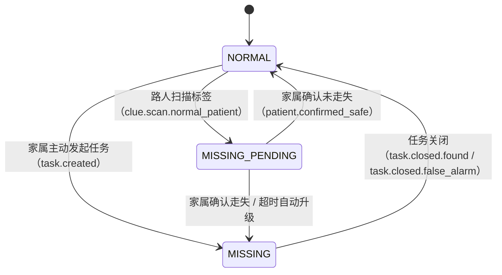
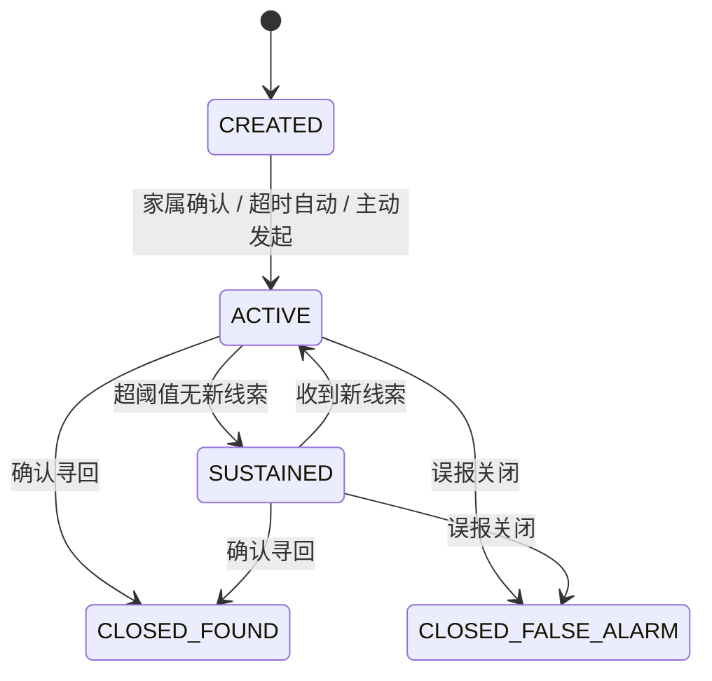
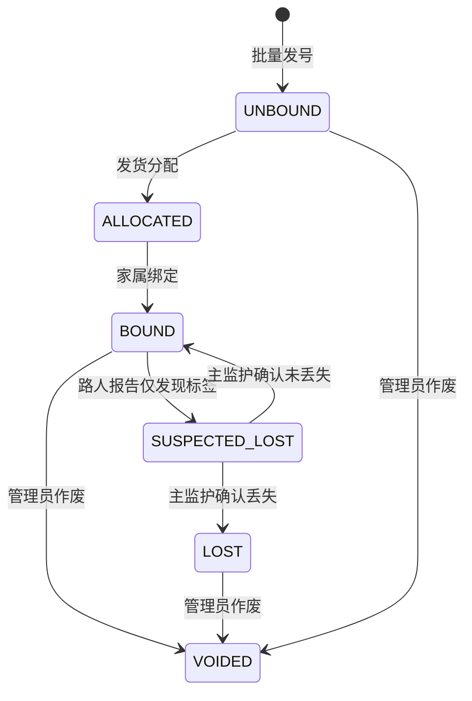
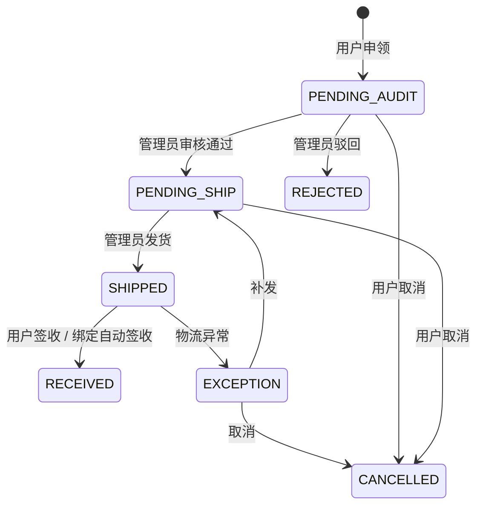

# 后端开发手册（Backend Development Document — BDD）

## 0. 文档信息

| 项目 | 内容 |
| :--- | :--- |
| 文档名称 | 后端开发手册（Backend Development Document — BDD） |
| 文档版本 | V2.0 |
| 日期 | 2026-04-19 |
| 适用对象 | 后端研发、测试、运维、架构、技术管理 |
| 文档目标 | 任何研发成员按本文可开发并交付同构后端系统 |

### 0.1 文档定位

本手册是工程执行文档，不是概念说明文档。所有规则按三类关键词表达：

1. **必须**：违反即视为实现不合规，禁止合并。
2. **应当**：默认执行，偏离需设计评审与记录。
3. **可选**：在满足前两类前提下按场景启用。

### 0.2 上位基线（权威顺序）

| 优先级 | 基线文档 | 版本 |
| :--- | :--- | :--- |
| 1 | 需求基线 SRS.md | V2.0（2026-04-04） |
| 2 | 架构基线 SADD_V2.0.md | V2.0（2026-04-12） |
| 3 | 详细设计基线 LLD_V2.0.md | V2.0（2026-04-19） |
| 4 | 外部契约基线 API_V2.0.md | V2.0（2026-04-19） |
| 5 | 数据落库基线 DBD.md | V2.0（2026-06-17） |

冲突处理规则：

1. 跨文档冲突时，优先满足 SRS.md 的需求语义。
2. 同层冲突时，优先满足最新版本号文档。
3. 接口字段与状态码争议时，以 API_V2.0.md 为联调契约。
4. 字段能否落库争议时，以 DBD.md 与 LLD_V2.0.md 的一致交集为准。

### 0.3 架构硬约束（必须）

| 编号 | 约束 | 执行要求 |
| :--- | :--- | :--- |
| HC-01 | TASK 域是任务状态机唯一权威，AI 通过 Function Calling 调用标准域 API | 禁止 AI 服务直接写 `rescue_task` 等域实体表；状态变更由 TASK 服务完成（根据 SADD HC-01） |
| HC-02 | 核心状态变更必须本地事务 + Outbox 同提交 | 任何核心状态事件不得绕过 Outbox（根据 SADD HC-02） |
| HC-03 | 所有写接口必须支持 `X-Request-Id` 幂等 | 无幂等键写接口禁止上线（根据 SADD HC-03） |
| HC-04 | 全链路必须透传 `X-Trace-Id` | 无 `X-Trace-Id` 的请求在网关拒绝；日志、事件、内部调用均须包含（根据 SADD HC-04） |
| HC-05 | 严禁硬编码 | 围栏半径、防漂移阈值、AI Token 限制、疑似走失超时等必须通过配置中心 `sys_config` 下发（根据 SADD HC-05） |
| HC-06 | 匿名风险隔离 | 匿名入口必须执行"设备指纹 + 频率 + 地理位置"校验（根据 SADD HC-06） |
| HC-07 | 隐私脱敏规范 | PII 展示强制脱敏；路人端照片叠加半透明时间戳水印（根据 SADD HC-07） |
| HC-08 | 通信约束 | 支持应用推送（极光推送 JPush）、邮件推送（SMTP）、站内通知及 WebSocket 定向下发。通知网关层预留短信接口扩展，当前不启用。禁止全量广播（根据 SADD HC-08） |

---

## 1. 部署架构与基础设施

> **本章依据**：SADD V2.0 §3.4 基础设施选型、§9 部署建议；用户部署约束（3 台阿里云 ECS + OSS + 百炼 AI）。

### 1.1 服务器资源规划（必须）

系统部署于 **3 台阿里云 ECS** 实例 + 阿里云托管服务：

| 节点编号 | 规格 | 角色 | 部署组件 |
| :--- | :--- | :--- | :--- |
| Node-A | 4 核 8GB | 应用主节点 | gateway-security、auth-service、risk-service、profile-service、task-service、clue-intake-service、clue-analysis-service、material-service、ai-orchestrator-service、notify-service、admin-review-service、outbox-dispatcher |
| Node-B | 4 核 8GB | 数据 + 支撑节点 | PostgreSQL 16（PostGIS + pgvector）、Redis 7、clue-trajectory-service、ai-vectorizer-service、ws-gateway-service |
| Node-C | 2 核 2GB | 轻量辅助节点 | Nginx 反向代理（HTTPS 终结）、静态前端（Web Admin H5）、日志收集 Agent、健康检查探针 |

### 1.2 云服务接入清单（必须）

| 云服务 | 提供商 | 用途 | 配置 Key 前缀 |
| :--- | :--- | :--- | :--- |
| 阿里云 OSS | 阿里云 | 患者照片、海报、导出文件等静态资源存储 | `aliyun.oss.*` |
| 阿里云百炼（DashScope） | 阿里云 | AI 大模型推理（通义千问）、Embedding 向量化 | `ai.dashscope.*` |
| 阿里云 DirectMail / SMTP | 阿里云 | 邮件推送（注册验证、密码重置、重要通知） | `notification.email.*` |
| 极光推送（JPush） | 极光 | Android App 离线推送、后台通知 | `notification.jpush.*` |
| 高德地图 | 高德 | 坐标转换（GCJ-02 → WGS-84）、逆地理编码、路径规划辅助 | `amap.*` |

### 1.3 网络拓扑（必须）

```text
                    ┌──────────────────────────────────────────────────┐
                    │              阿里云 VPC 内网                      │
                    │                                                  │
  互联网用户 ──HTTPS──► Node-C (Nginx)                                 │
                    │    ├── 静态前端 (Web Admin / H5)                  │
                    │    └── 反向代理 ──► Node-A (应用集群 :8080-8099)   │
                    │                  ──► Node-B (WS :8100)           │
                    │                                                  │
                    │  Node-A ◄──内网──► Node-B (PG:5432 / Redis:6379) │
                    │                                                  │
                    └──────────────────────────────────────────────────┘
                                   │          │          │
                              阿里云 OSS   百炼 AI    DirectMail
                                   │
                              极光推送 / 高德地图
```

### 1.4 端口规划（必须）

| 服务 | 端口 | 节点 |
| :--- | :--- | :--- |
| Nginx HTTPS | 443 | Node-C |
| gateway-security | 8080 | Node-A |
| auth-service | 8081 | Node-A |
| risk-service | 8082 | Node-A |
| profile-service | 8083 | Node-A |
| task-service | 8084 | Node-A |
| clue-intake-service | 8085 | Node-A |
| clue-analysis-service | 8086 | Node-A |
| material-service | 8087 | Node-A |
| ai-orchestrator-service | 8088 | Node-A |
| notify-service | 8089 | Node-A |
| admin-review-service | 8090 | Node-A |
| outbox-dispatcher | 8091 | Node-A |
| clue-trajectory-service | 8092 | Node-B |
| ai-vectorizer-service | 8093 | Node-B |
| ws-gateway-service | 8100 | Node-B |
| PostgreSQL | 5432 | Node-B |
| Redis | 6379 | Node-B |

### 1.5 环境与配置隔离（必须）

| 环境 | 配置文件 | 用途 |
| :--- | :--- | :--- |
| `local` | `application-local.yml` | 本地开发（Docker Compose 依赖） |
| `dev` | `application-dev.yml` | 开发联调 |
| `prod` | `application-prod.yml` | 生产环境 |

敏感配置**禁止**写入配置文件，必须通过环境变量注入：

| 环境变量 | 用途 |
| :--- | :--- |
| `DB_URL` / `DB_USERNAME` / `DB_PASSWORD` | PostgreSQL 连接 |
| `REDIS_HOST` / `REDIS_PORT` / `REDIS_PASSWORD` | Redis 连接 |
| `JWT_SECRET` | JWT 签发密钥 |
| `ALIYUN_OSS_ACCESS_KEY_ID` / `ALIYUN_OSS_ACCESS_KEY_SECRET` | OSS 访问凭证 |
| `ALIYUN_OSS_BUCKET` / `ALIYUN_OSS_ENDPOINT` | OSS 存储桶配置 |
| `AI_DASHSCOPE_API_KEY` | 百炼 AI API Key |
| `JPUSH_APP_KEY` / `JPUSH_MASTER_SECRET` | 极光推送凭证 |
| `AMAP_API_KEY` | 高德地图 Web 服务 Key |
| `EMAIL_SMTP_HOST` / `EMAIL_SMTP_PORT` / `EMAIL_SMTP_USERNAME` / `EMAIL_SMTP_PASSWORD` | 邮件 SMTP 凭证 |
| `AES_BATCH_KEY` | resource_token 加密密钥 |

---

## 2. 项目结构与模块职责

> **本章依据**：LLD V2.0 §2.1 微服务拆分、SADD V2.0 §4.1 六域映射。

### 2.1 统一仓库结构（必须）

```text
alzheimer-rescue-backend/
  docs/                           # 工程文档
  scripts/
    local/                        # 本地 Docker Compose 等
    ci/                           # CI/CD 脚本
    sql/                          # Flyway 迁移脚本
  platform/                       # 基座模块（BOM + Starter）
    starter-core/                 # 通用工具、Result<T>、BaseEntity、BizException
    starter-web/                  # Web 配置、全局异常处理、JSON 序列化
    starter-security/             # JWT 解析、AuthInterceptor、OwnershipCheck
    starter-redis/                # Redis 配置、分布式锁、幂等工具、Lua 脚本
    starter-event/                # Redis Streams 生产/消费基座、Outbox 抽象
    starter-oss/                  # 阿里云 OSS 上传/下载/签名 URL 封装
    starter-notification/         # NotificationPort 接口、JPush/Email/WebSocket/SMS 渠道实现
    starter-observability/        # Micrometer + 日志 JSON 格式 + MDC 配置
    starter-amap/                 # 高德地图坐标转换、逆地理编码封装
  common/
    common-domain/                # 通用领域基础类（BaseEntity、ValueObject、DomainEvent）
    common-infra/                 # 通用基础设施（MapStruct 基座、分页封装）
    common-test/                  # ArchUnit 基础规则、Testcontainers 基座
  gateway/
    gateway-security/             # 网关路由、HTTPS 终结、Header 清洗、Agent 门禁
    auth-service/                 # JWT 签发/验签、匿名 entry_token 签发
    risk-service/                 # CAPTCHA 校验、IP/设备频率限流、冷却策略
  services/
    profile-service/              # PROFILE 域：档案、监护关系、走失状态
    task-service/                 # TASK 域：任务生命周期、状态收敛
    clue-intake-service/          # CLUE 域（入口）：匿名线索接入、标准化
    clue-analysis-service/        # CLUE 域（研判）：防漂移、围栏判定、可疑识别
    clue-trajectory-service/      # CLUE 域（轨迹）：轨迹聚合、窗口归档
    material-service/             # MAT 域：标签主数据、绑定、工单流转
    ai-orchestrator-service/      # AI 域：Agent 编排、Function Calling、策略生成
    ai-vectorizer-service/        # AI 域：文本切片、向量写入、失效清理
    notify-service/               # GOV 域（通知）：事件消费、模板组装、多渠道分发
    ws-gateway-service/           # GOV 域（WebSocket）：长连接、路由注册、定向下发
    admin-review-service/         # GOV 域（审计）：线索复核（override/reject）
    outbox-dispatcher/            # GOV 域（Outbox）：分区抢占、租约、重试、死信
  integration-tests/              # 端到端集成测试
  pom.xml
  README.md
```

### 2.2 每个服务固定包结构（必须）

```text
service-x/
  src/main/java/com/alz/rescue/{domain}/
    interfaces/           # Controller、RequestVO、ResponseVO
    application/          # UseCase、CommandHandler、QueryHandler
    domain/               # Entity、ValueObject、DomainService、Repository 接口
    infrastructure/       # DO、Mapper、Repository 实现、MQ 适配、外部 SDK 适配
    converter/            # MapStruct / Assembler
    config/               # Spring 配置类
  src/main/resources/
    application.yml
    application-{profile}.yml
  src/test/java/com/alz/rescue/{domain}/
    unit/
    integration/
```

### 2.3 依赖方向（必须）

```text
interfaces → application → domain
                              ↑
infrastructure ───────────────┘（实现 domain 接口）
```

1. `interfaces` → `application` → `domain`：严格单向调用。
2. `infrastructure` 依赖 `domain`（实现其 Repository 接口），不反向。
3. `domain` 不得依赖 `interfaces` / `infrastructure`。
4. `common-test` 可被所有服务测试依赖，不得反向依赖业务模块。
5. 跨域调用**仅**通过 Redis Streams 事件或 HTTP 查询接口，禁止直接注入其他域的 Service。

### 2.4 微服务职责矩阵（必须）

| 服务名 | 所属域 | 写模型归属 | 发布事件 | 消费事件 |
| :--- | :--- | :--- | :--- | :--- |
| profile-service | PROFILE | `patient_profile`、`guardian_relation`、`guardian_transfer_request`、`guardian_invitation` | `profile.created`、`profile.updated`、`profile.deleted.logical`、`patient.missing_pending`、`patient.confirmed_safe` | `task.created`、`task.closed.found`、`task.closed.false_alarm`、`clue.scan.normal_patient`、`tag.bound` |
| task-service | TASK | `rescue_task` | `task.created`、`task.state.changed`、`task.sustained`、`task.closed.found`、`task.closed.false_alarm` | `clue.validated`、`track.updated`、`fence.breached`、`ai.strategy.generated`、`ai.poster.generated`、`patient.missing_pending` |
| clue-intake-service | CLUE（入口） | `clue_record`（原始段） | `clue.reported.raw`、`clue.vectorize.requested`、`clue.scan.normal_patient`、`tag.suspected_lost` | — |
| clue-analysis-service | CLUE（研判） | `clue_record` | `clue.validated`、`clue.suspected`、`track.updated`、`fence.breached` | `clue.reported.raw`、`task.state.changed` |
| clue-trajectory-service | CLUE（轨迹） | `patient_trajectory` | `track.updated`（聚合后） | `clue.validated`、`task.closed.found`、`task.closed.false_alarm` |
| ai-orchestrator-service | AI | `ai_session`、`ai_quota_ledger` | `ai.strategy.generated`、`ai.poster.generated`、`memory.appended`、`memory.expired` | `clue.validated`、`track.updated`、`task.created`、`task.closed.found`、`task.closed.false_alarm`、`task.sustained` |
| ai-vectorizer-service | AI | `vector_store` | — | `profile.created`、`profile.updated`、`profile.deleted.logical`、`memory.appended`、`memory.expired`、`clue.vectorize.requested` |
| material-service | MAT | `tag_asset`、`tag_apply_record` | `tag.allocated`、`tag.bound`、`tag.loss.confirmed`、`material.order.created`、`material.order.approved`、`material.order.shipped` | `tag.suspected_lost`、`profile.deleted.logical` |
| notify-service | GOV（通知） | `notification_inbox` | `notification.sent` | `task.created`、`task.closed.found`、`task.closed.false_alarm`、`task.sustained`、`fence.breached`、`patient.missing_pending`、`patient.confirmed_safe`、`clue.validated`、`track.updated`、`tag.suspected_lost` |
| ws-gateway-service | GOV（WebSocket） | Redis 路由态 | — | Redis Pub/Sub `ws.push.{pod_id}` |
| admin-review-service | GOV（审计） | `clue_record` 审核字段 | `clue.overridden`、`clue.rejected` | `clue.suspected` |
| outbox-dispatcher | GOV（Outbox） | `sys_outbox_log` | Redis Streams 各 Topic | — |

---

## 3. 技术栈与 SDK 清单

> **本章依据**：SADD V2.0 §3.4 基础设施选型、LLD V2.0 §1.4 通信渠道规范。

### 3.1 核心框架版本（必须）

| 组件 | 版本 | 用途 |
| :--- | :--- | :--- |
| JDK | 21 LTS | 运行时 |
| Spring Boot | 3.3.x | 应用框架 |
| Maven | 3.9+ | 构建工具 |
| PostgreSQL | 16 | 主数据库（PostGIS 3.4 + pgvector 0.7+） |
| Redis | 7+ | 缓存 + 事件总线（Redis Streams）+ 分布式锁 |

### 3.2 版本管理策略（必须）

1. 全部版本由 `platform` 模块 BOM 统一锁定。
2. 业务模块禁止自行指定核心依赖版本。
3. 升级必须走 ADR + 回归验证。

### 3.3 SDK 分组

| 分组 | 组件 | 用途 |
| :--- | :--- | :--- |
| Web | Spring Boot Web, Validation | REST 接口、参数校验 |
| Security | Spring Security, JWT（jjwt） | 鉴权、权限 |
| DB | PostgreSQL Driver, Flyway, MyBatis-Plus | 持久化、迁移、ORM |
| GIS | PostGIS / JTS | 围栏、空间计算 |
| Vector | pgvector（JDBC 原生） | RAG 向量召回 |
| Cache | Spring Data Redis, Redisson, Lua | 幂等、限流、路由、分布式锁 |
| Event | Redis Streams（Lettuce） | 事件总线（替代 Kafka，来自 SADD ADR-006） |
| Mapping | MapStruct | DTO / DO / VO 转换 |
| Observe | Micrometer, Logback JSON, MDC | 指标、日志、追踪 |
| Test | JUnit 5, Mockito, Testcontainers, RestAssured, ArchUnit | 质量门禁 |

### 3.4 第三方服务 SDK 集成（必须）

#### 3.4.1 阿里云 OSS（对象存储）

```xml
<dependency>
    <groupId>com.aliyun.oss</groupId>
    <artifactId>aliyun-sdk-oss</artifactId>
</dependency>
```

集成要点：

1. 统一封装于 `starter-oss` 模块，提供 `OssClient` 接口。
2. 上传接口返回资源 Key（非完整 URL），URL 由服务端签名生成（STS 临时凭证或签名 URL）。
3. 照片上传必须校验文件类型（仅 `image/jpeg`, `image/png`）与大小（≤ 5MB）。
4. 路人端照片必须在上传后由服务端叠加半透明时间戳水印（HC-07，BR-010）。
5. 配置 Key：

| 配置 Key | 说明 |
| :--- | :--- |
| `aliyun.oss.endpoint` | OSS Endpoint |
| `aliyun.oss.bucket` | 存储桶名称 |
| `aliyun.oss.access-key-id` | 访问密钥 ID（环境变量注入） |
| `aliyun.oss.access-key-secret` | 访问密钥 Secret（环境变量注入） |
| `aliyun.oss.url-expiration-seconds` | 签名 URL 有效期（默认 3600） |
| `aliyun.oss.max-file-size-mb` | 单文件最大 MB（默认 5） |

#### 3.4.2 阿里云百炼 AI（DashScope）

```xml
<dependency>
    <groupId>com.alibaba.cloud.ai</groupId>
    <artifactId>spring-ai-alibaba-starter</artifactId>
</dependency>
```

集成要点：

1. `ai-orchestrator-service` 通过 `ChatClient` + `@Tool` 注解实现 Tool-Use Agent 编排（根据 LLD §7）。
2. `ChatClient.builder(chatModel).defaultSystem(systemPrompt).defaultTools(taskTool, clueTool, patientTool).build()`。
3. 每个 `@Tool` 方法映射唯一域 API（如 `createRescueTask` → `POST /api/v1/rescue/tasks`）。
4. Tool 方法通过内部 HTTP 调用目标域 REST API，携带 `X-Action-Source=AI_AGENT`。
5. 统一 AI Adapter 层，不得在业务层直接调用供应商 SDK。
6. 支持主模型与降级模型切换（`sys_config` 键 `ai.model.chat.primary` / `ai.model.chat.fallback`）。
7. Embedding 模型用于 RAG 向量化（`ai-vectorizer-service`），与聊天模型独立配置。
8. 配置 Key：

| 配置 Key | 说明 |
| :--- | :--- |
| `ai.dashscope.api-key` | 百炼 API Key（环境变量注入） |
| `ai.dashscope.chat.model` | 聊天模型名称（如 `qwen-max`） |
| `ai.dashscope.chat.fallback-model` | 降级模型名称（如 `qwen-turbo`） |
| `ai.dashscope.embedding.model` | Embedding 模型名称（如 `text-embedding-v3`） |
| `ai.dashscope.chat.timeout-ms` | 聊天请求超时（默认 30000） |
| `ai.dashscope.chat.max-tokens` | 单次最大 Token 数 |

9. `token_usage` 必须统一输出键：`prompt_tokens`、`completion_tokens`、`total_tokens`、`model_name`、`billing_source`。

#### 3.4.3 极光推送（JPush）

```xml
<dependency>
    <groupId>cn.jpush.api</groupId>
    <artifactId>jpush-client</artifactId>
</dependency>
```

集成要点：

1. 封装于 `starter-notification` 模块的 `JPushChannel` 实现类。
2. 推送目标使用 `user_id` 作为 Alias 绑定（Android 客户端登录时注册）。
3. 支持按 Alias（单用户）和 Tag（患者关联家属组）两种推送方式。
4. 推送消息体必须包含 `trace_id`、`event_type`、`related_patient_id`。
5. 推送失败必须记录日志并写入重试队列，禁止静默丢弃。
6. 配置 Key：

| 配置 Key | 说明 |
| :--- | :--- |
| `notification.jpush.app-key` | JPush App Key（环境变量注入） |
| `notification.jpush.master-secret` | JPush Master Secret（环境变量注入） |
| `notification.jpush.retry-max` | 最大重试次数（默认 3） |
| `notification.jpush.live-time` | 离线消息保留时长秒（默认 86400） |

#### 3.4.4 邮件推送（阿里云 SMTP / DirectMail）

```xml
<dependency>
    <groupId>org.springframework.boot</groupId>
    <artifactId>spring-boot-starter-mail</artifactId>
</dependency>
```

集成要点：

1. 封装于 `starter-notification` 模块的 `EmailChannel` 实现类。
2. **仅用于账户类事件**：注册验证码、密码重置确认、重要安全通知（根据 LLD §1.4）。
3. 禁止用于业务流程通知（任务变更、围栏告警等）。
4. 邮件模板由 `sys_config`（`scope=email_template`）管理，支持热更新。
5. 验证码邮件必须设置 TTL（默认 5 分钟），同一邮箱 1 分钟内不可重复发送。
6. 配置 Key：

| 配置 Key | 说明 |
| :--- | :--- |
| `notification.email.smtp-host` | SMTP 服务器地址 |
| `notification.email.smtp-port` | SMTP 端口（465/SSL） |
| `notification.email.username` | 发件人账号（环境变量注入） |
| `notification.email.password` | 发件人密码（环境变量注入） |
| `notification.email.from-address` | 发件人显示地址 |
| `notification.email.from-name` | 发件人显示名称 |

#### 3.4.5 高德地图（AMap）

集成要点：

1. 封装于 `starter-amap` 模块，提供 `AmapGeoService` 接口。
2. **核心能力**：
   - **坐标转换**：GCJ-02（高德/前端）→ WGS-84（数据库存储）。坐标转换在**网关层**完成（根据 LLD §12），业务服务收到的坐标恒为 WGS-84。
   - **逆地理编码**：坐标 → 结构化地址描述（用于线索描述补充）。
   - **地理围栏辅助**：围栏圆心与半径的前端可视化辅助。
3. 调用方式：高德 Web 服务 API（HTTP REST），非客户端 SDK。
4. 调用频次受高德免费额度限制，必须在 `risk-service` 做调用限流。
5. 配置 Key：

| 配置 Key | 说明 |
| :--- | :--- |
| `amap.api-key` | 高德 Web 服务 Key（环境变量注入） |
| `amap.base-url` | API 基础地址（默认 `https://restapi.amap.com/v3`） |
| `amap.timeout-ms` | 请求超时（默认 3000） |
| `amap.daily-limit` | 每日调用上限（用于自保限流） |

---

## 4. 分层架构与编码规范

> **本章依据**：SADD V2.0 §3.3 分层架构、LLD V2.0 §1.3 全局硬约束。

### 4.1 控制器层规范（interfaces）

1. 只做协议适配、权限入口校验、参数校验（`@Valid`）、错误码映射。
2. 不得编写领域规则与跨聚合事务。
3. 每个写接口必须读取并透传 `X-Request-Id`、`X-Trace-Id`（HC-03、HC-04）。
4. 返回值统一使用 `Result<T>` 包装。
5. 匿名接口必须读取 `Cookie(entry_token)` 或 `X-Anonymous-Token`。

### 4.2 应用层规范（application）

1. 一个用例对应一个 Application Service 或 Handler。
2. 应用层负责事务边界（`@Transactional`）、调用顺序编排。
3. 禁止在应用层直接写 SQL。
4. Outbox 写入必须在应用层事务方法内完成（HC-02）。
5. 幂等校验（Redis SETNX）在应用层方法入口执行。

### 4.3 领域层规范（domain）

1. 状态变更必须通过聚合根方法（HC-01）。
2. 聚合根方法返回领域事件集合（`List<DomainEvent>`）。
3. 领域服务仅封装跨实体规则，不做 IO。
4. Repository 接口定义在 domain 层，实现在 infrastructure 层。

### 4.4 基础设施层规范（infrastructure）

1. 只负责持久化、事件发布、外部依赖适配。
2. Repository 实现必须使用领域接口返回领域对象（Entity）。
3. 外部 SDK 结果必须转换为内部 DTO。
4. 通知发送必须通过 `NotificationPort` 接口（HC-08），禁止直接调用渠道实现类。

### 4.5 命名与后缀规范（必须）

| 类型 | 后缀 | 作用域 | 示例 |
| :--- | :--- | :--- | :--- |
| Entity | `*Entity` | domain | `RescueTaskEntity` |
| ValueObject | `*Value` | domain | `FenceConfigValue` |
| 持久化对象 | `*DO` | infrastructure | `RescueTaskDO` |
| 请求对象 | `*Request` | interfaces | `CloseTaskRequest` |
| 响应对象 | `*Response` | interfaces | `TaskSnapshotResponse` |
| 命令对象 | `*Command` | application | `CloseTaskCommand` |
| 查询对象 | `*Query` | application | `TaskListQuery` |
| 事件对象 | `*Event` | domain / integration | `TaskCreatedEvent` |
| 转换器 | `*Converter` | converter | `RescueTaskConverter` |
| Mapper | `*Mapper` | infrastructure | `RescueTaskMapper` |

### 4.6 核心公共基础类

#### 4.6.1 通用响应外壳 `Result<T>`（必须）

```java
public class Result<T> {
    private String code;       // 业务码，成功为 "ok"
    private String message;    // 描述
    private String traceId;    // 链路追踪 ID
    private T data;            // 业务数据

    public static <T> Result<T> ok(T data) { ... }
    public static <T> Result<T> fail(String code, String message) { ... }
}
```

#### 4.6.2 分页基础类（必须）

```java
// Offset 分页
public record PageRequest(int pageNo, int pageSize) {}
public class PageResponse<T> {
    private List<T> items;
    private int pageNo;
    private int pageSize;
    private long total;
    private boolean hasNext;
}

// Cursor 分页（流水型）
public record CursorRequest(String cursor, int limit) {}
public class CursorResponse<T> {
    private List<T> items;
    private String nextCursor;
    private boolean hasNext;
}
```

#### 4.6.3 实体基类 `BaseEntity`（必须）

```java
public abstract class BaseEntity {
    private Long id;
    private LocalDateTime createdAt;
    private LocalDateTime updatedAt;
    private Integer version;       // 乐观锁（HC-06 并发控制）
    private String traceId;        // 审计追踪（HC-04）
}
```

自动填充组件（MyBatis-Plus MetaObjectHandler）：

```java
@Component
public class AutoFillHandler implements MetaObjectHandler {
    @Override
    public void insertFill(MetaObject metaObject) {
        this.strictInsertFill(metaObject, "createdAt", LocalDateTime::now, LocalDateTime.class);
        this.strictInsertFill(metaObject, "updatedAt", LocalDateTime::now, LocalDateTime.class);
        this.strictInsertFill(metaObject, "version", () -> 1, Integer.class);
    }
    @Override
    public void updateFill(MetaObject metaObject) {
        this.strictUpdateFill(metaObject, "updatedAt", LocalDateTime::now, LocalDateTime.class);
    }
}
```

#### 4.6.4 业务异常类 `BizException`（必须）

```java
public class BizException extends RuntimeException {
    private final String code;
    private final String message;

    public static BizException of(String code) { ... }         // 从错误码字典查找
    public static BizException of(String code, String msg) { ... }
}
```

业务代码仅抛出 `BizException`，禁止在业务逻辑中直接 `try-catch` 吃掉异常（HC-03 全局异常处理）。

### 4.7 拦截器与切面规划（必须）

#### 4.7.1 认证拦截器 `AuthInterceptor`

1. JWT 解析与上下文注入：将 `user_id`、`user_role` 注入 `ThreadLocal`（`UserContext`）。
2. `X-Trace-Id` 注入 MDC（日志格式包含 `[%X{trace_id}]`）（HC-04）。
3. 匿名接口路径白名单放行（`/r/{resource_token}`、`/api/v1/public/**`）。

#### 4.7.2 幂等切面 `IdempotentAspect`

```java
@Aspect
public class IdempotentAspect {
    // 写接口方法入口：
    // 1. 读取 X-Request-Id
    // 2. Redis SETNX idem:req:{request_id} 1 EX 86400
    // 3. 返回 0 → 幂等命中，直接返回缓存结果
    // 4. 返回 1 → 放行执行
}
```

#### 4.7.3 日志切面 `LogAspect`

1. 接口入参、出参、执行耗时统一打印。
2. 日志字段必须包含：`trace_id`、`request_id`、`user_id`、`action_source`。

#### 4.7.4 全局异常处理器 `GlobalExceptionHandler`

```java
@RestControllerAdvice
public class GlobalExceptionHandler {
    @ExceptionHandler(BizException.class)
    public Result<Void> handleBiz(BizException e) {
        return Result.fail(e.getCode(), e.getMessage());
    }
    @ExceptionHandler(MethodArgumentNotValidException.class)
    public Result<Void> handleValidation(...) { ... }
    @ExceptionHandler(Exception.class)
    public Result<Void> handleUnexpected(...) {
        // 记录日志，返回通用错误码 E_SYS_5000
    }
}
```

### 4.8 代码风格与静态检查（必须）

1. 仓库提交 Checkstyle 配置。
2. SonarLint 规则文件入库并在 IDE 启用。
3. PR 流水线执行：`checkstyle` + `spotbugs` + `sonar gate`。
4. 任一门禁失败，PR 禁止合并。

---

## 5. 内部数据结构与流转映射规范

> **本章依据**：LLD V2.0 §2.4 通用协议、API V2.0 §1 全局规范。

### 5.1 对象职责定义（必须）

| 类型 | 作用域 | 用途 | 禁止事项 |
| :--- | :--- | :--- | :--- |
| Entity | domain | 业务行为与状态机 | 公开 `setStatus` 等破坏守卫的方法 |
| ValueObject | domain | 不可变值语义 | 可变字段 |
| DO | infrastructure | 表结构映射 | 出现在 Controller 入参/出参 |
| DTO | application / infrastructure | 内部传输 | 对外 API 直出 |
| VO（Request/Response） | interfaces | API 输入/输出契约 | 携带数据库技术字段（如 `version`） |
| Command | application | 写场景输入 | 直接拼 SQL |
| Query | application | 读场景输入 | 混入写语义 |
| EventPayload | domain / integration | 事件消息体 | 缺少 `event_id`、`trace_id`、`version` |

### 5.2 数据流转链路（必须）

```text
Controller 收到 RequestVO
  → 转换为 Command / Query
    → Application 执行命令，调用 Aggregate 行为方法
      → Aggregate 返回新状态 + DomainEvent
        → Infrastructure 保存 DO + 同事务写 Outbox（HC-02）
          → outbox-dispatcher 异步发布 EventPayload → Redis Streams
```

### 5.3 MapStruct 转换规则（必须）

1. 所有核心路径对象转换必须走 MapStruct。
2. 禁止在 Controller 手写字段逐个 copy。
3. MapStruct 必须启用 `unmappedTargetPolicy = ERROR`。

```java
@Mapper(componentModel = "spring", unmappedTargetPolicy = ReportingPolicy.ERROR)
public interface RescueTaskConverter {
    RescueTaskEntity toEntity(RescueTaskDO d);
    RescueTaskDO toDO(RescueTaskEntity e);
    TaskSnapshotResponse toSnapshotVO(RescueTaskEntity e);
}
```

### 5.4 核心字段语义规则（必须）

1. ID 字段在 API 线传必须为 `string`（根据 API V2.0 §1.11）。
2. 时间字段统一 `ISO 8601` UTC 格式（`timestamptz`）。
3. `coord_system` 入库固定 `WGS84`（坐标转换在网关层完成）。
4. `clue_record.source_type` 取值 `SCAN` / `MANUAL` / `POSTER_SCAN`。
5. `clue_record.review_status` 仅 `suspect_flag=true` 时可用，非可疑必须为 `null`。

---

## 6. 核心实体设计与状态机

> **本章依据**：SRS V2.0 §5.2 核心业务状态机、SADD V2.0 §4.4、LLD V2.0 §3-§8、DBD V2.0 全部建表 DDL。

### 6.1 患者走失状态（`lost_status`）（必须）



| 当前状态 | 目标状态 | 触发条件 | 执行方 |
| :--- | :--- | :--- | :--- |
| `NORMAL` | `MISSING_PENDING` | 路人扫描标签（患者为 `NORMAL`） | CLUE 域发布 `clue.scan.normal_patient` → PROFILE 域消费执行迁移 |
| `MISSING_PENDING` | `MISSING` | 家属确认走失 / 超时自动升级 | TASK 域创建任务 → 发布 `task.created` → PROFILE 域消费执行迁移 |
| `NORMAL` | `MISSING` | 家属主动发起任务 | TASK 域发布 `task.created` → PROFILE 域消费执行迁移 |
| `MISSING` | `NORMAL` | 任务关闭 | TASK 域发布 `task.closed.found` / `task.closed.false_alarm` → PROFILE 域消费执行迁移 |
| `MISSING_PENDING` | `NORMAL` | 家属确认未走失 | PROFILE 域直接迁移 → 发布 `patient.confirmed_safe` |

实现约束：

1. `lost_status` 完全由事件驱动，不提供独立写入 API。
2. PROFILE 域消费 TASK 域事件时，必须使用 `lost_status_event_time` 防乱序覆盖（`event_time <= lost_status_event_time` 时丢弃）。
3. `MISSING_PENDING` 超时阈值由配置中心动态维护（HC-05），Key：`profile.missing_pending.timeout_minutes`。
4. `MISSING_PENDING` 重复扫码场景：系统正常接收线索（进入 `PENDING`），不重复触发状态迁移。

### 6.2 RescueTask（寻回任务）（必须）



| 当前状态 | 触发事件 | 下一状态 | 守卫 |
| :--- | :--- | :--- | :--- |
| — | 创建 | `CREATED` | 同患者无非终态任务（`uq_task_active_per_patient_partial` 唯一索引） |
| `CREATED` | 确认激活 | `ACTIVE` | 授权通过 |
| `ACTIVE` | 超阈值无新线索 | `SUSTAINED` | 调度器触发，阈值 Key：`task.sustained.threshold_hours` |
| `ACTIVE` | 确认寻回关闭 | `CLOSED_FOUND` | 仅任务发起者或主监护可关闭 |
| `ACTIVE` | 误报关闭 | `CLOSED_FALSE_ALARM` | `reason` 必填；误报数据禁止进入 AI 长期经验库（SRS BR-003） |
| `SUSTAINED` | 收到新线索 | `ACTIVE` | 消费 `clue.validated` 事件自动恢复 |
| `SUSTAINED` | 确认寻回关闭 | `CLOSED_FOUND` | 同 ACTIVE |
| `SUSTAINED` | 误报关闭 | `CLOSED_FALSE_ALARM` | 同 ACTIVE |
| `CLOSED_*` | 任何 | 原状态 | 终态不可变 |

关键字段（对齐 DBD `rescue_task`）：

| DB 字段 | 类型 | 说明 |
| :--- | :--- | :--- |
| `id` | `BIGINT` | 主键 |
| `task_no` | `VARCHAR(32)` | 业务编号 |
| `patient_id` | `BIGINT` | 关联患者 |
| `status` | `VARCHAR(24)` | 状态枚举 |
| `close_type` | `VARCHAR(24)` | `FOUND` / `FALSE_ALARM` |
| `close_reason` | `TEXT` | 关闭原因 |
| `daily_appearance` | `TEXT` | 当日着装描述（API 映射：`today_appearance`） |
| `daily_photo_url` | `VARCHAR(1024)` | 当日照片 OSS Key（API 映射：`today_photo_url`） |
| `created_by` | `BIGINT` | API 映射：`reported_by` |
| `created_at` | `TIMESTAMPTZ` | API 映射：`start_time` |
| `closed_at` | `TIMESTAMPTZ` | API 映射：`end_time` |
| `event_version` | `BIGINT` | 乐观锁（DBD 命名 `event_version`，代码层可映射为 `version`） |
| `trace_id` | `VARCHAR(64)` | 链路追踪 |

实现要求：

1. 更新必须条件更新 `WHERE status IN (...) AND version = :version`。
2. 更新成功 `version` +1。
3. 每次状态变更必须发布对应事件并写 Outbox（HC-02）。

### 6.3 ClueRecord（线索记录）（必须）

关键字段（对齐 DBD `clue_record`）：

| DB 字段 | 类型 | 说明 |
| :--- | :--- | :--- |
| `id` | `BIGINT` | 主键 |
| `patient_id` | `BIGINT` | 关联患者 |
| `task_id` | `BIGINT` | 关联任务（可空） |
| `source_type` | `VARCHAR(20)` | `SCAN` / `MANUAL` / `POSTER_SCAN` |
| `location` | `GEOMETRY(Point, 4326)` | 上报坐标（WGS84） |
| `photo_url` | `VARCHAR(1024)` | 照片（OSS Key） |
| `risk_score` | `NUMERIC(5,4)` | 风险分 |
| `suspect_flag` | `BOOLEAN` | 是否可疑 |
| `review_status` | `VARCHAR(16)` | `PENDING` / `OVERRIDDEN` / `REJECTED`（仅 `suspect_flag=true`） |
| `device_fingerprint` | `VARCHAR(128)` | 设备指纹（HC-06） |
| `entry_token_jti` | `VARCHAR(64)` | 匿名凭据 JTI |

强约束：

1. `suspect_flag=false` 时 `review_status` 必须为 `null`。
2. `suspect_flag=true` 时 `review_status` 取 `PENDING` / `OVERRIDDEN` / `REJECTED`。
3. `review_status=OVERRIDDEN` 时，`override=true` 且 `override_reason` 必填。
4. `review_status=REJECTED` 时，`rejected_by` 与 `reject_reason` 成对非空。

### 6.4 TagAsset（标签资产）（必须）



| 当前状态 | 触发 | 下一状态 | 守卫 |
| :--- | :--- | :--- | :--- |
| `UNBOUND` | 发货分配 | `ALLOCATED` | 与 `resource_link` 同事务写入 |
| `ALLOCATED` | 家属绑定 | `BOUND` | 绑定患者 + 发布 `tag.bound` |
| `BOUND` | 路人报告仅标签 | `SUSPECTED_LOST` | 发布 `tag.suspected_lost` |
| `SUSPECTED_LOST` | 确认丢失 | `LOST` | 主监护操作 |
| `SUSPECTED_LOST` | 确认未丢失 | `BOUND` | 主监护操作 |
| `VOIDED` | — | — | 终态，作废标签禁止进入紧急上报链路（BR-007） |

### 6.5 TagApplyRecord（物资工单）（必须）



| 状态 | 含义 |
| :--- | :--- |
| `PENDING_AUDIT` | 等待管理员审核 |
| `PENDING_SHIP` | 审核通过待发货 |
| `SHIPPED` | 已发货 |
| `RECEIVED` | 已签收 |
| `EXCEPTION` | 物流异常 |
| `REJECTED` | 已驳回 |
| `CANCELLED` | 已取消 |
| `VOIDED` | 已作废 |

### 6.6 AiSession（AI 会话）（必须）

规则：

1. 禁止全量覆盖写 `messages`。
2. 仅允许 JSONB 原子追加或 version CAS。
3. 长会话拆分 `ai_session_message`。
4. 归档接口更新 `ai_session.status=ARCHIVED`，并写 `archived_at`。
5. `status` 枚举：`ACTIVE` / `ARCHIVED`。

### 6.7 GuardianRelation 与 GuardianTransferRequest（监护关系）（必须）

**监护关系**（`guardian_relation`）：

| 字段 | 说明 |
| :--- | :--- |
| `user_id` | 监护人 |
| `patient_id` | 患者 |
| `relation_role` | `PRIMARY_GUARDIAN` / `GUARDIAN` |
| `relation_status` | `ACTIVE` / `REVOKED` |

**监护转移请求**（`guardian_transfer_request`）状态机：

| 当前状态 | 触发动作 | 下一状态 | 守卫 |
| :--- | :--- | :--- | :--- |
| — | 发起转移 | `PENDING_CONFIRM` | 同患者仅一个 `PENDING_CONFIRM` |
| `PENDING_CONFIRM` | 受方接受 | `COMPLETED` | 仅目标受方 + `relation_status=ACTIVE` |
| `PENDING_CONFIRM` | 受方拒绝 | `REJECTED` | `reject_reason` 必填 |
| `PENDING_CONFIRM` | 发起方撤销 | `REVOKED` | 仅原发起方或 SUPERADMIN |
| `PENDING_CONFIRM` | 超时 | `EXPIRED` | 定时任务触发 |
| 终态 | 任何 | 原状态 | 终态不可变 |

并发约束：

1. 成员移除时（`DELETE /guardians/{user_id}`），若目标成员存在 `PENDING_CONFIRM` 请求，必须同事务取消。
2. 被移除成员的历史确认请求必须失效，返回 `E_PRO_4099` 或 `E_PRO_4011`。

### 6.8 存疑线索复核闭环（必须）

| `suspect_flag` | `review_status` | 允许动作 | 结果事件 |
| :--- | :--- | :--- | :--- |
| `false` | `NULL` | 不入复核队列 | 无 |
| `true` | `PENDING` | override | `clue.overridden`（`override=true`） |
| `true` | `PENDING` | reject | `clue.rejected` |
| `true` | `OVERRIDDEN` / `REJECTED` | 只读 | 终态不可重复处置 |

### 6.9 匿名扫码动态路由决策（必须）

| `tag_asset.status` | 路由结果 | 令牌策略 |
| :--- | :--- | :--- |
| `BOUND` | 302 → `/p/{short_code}/clues/new` | 下发 `entry_token`（Cookie） |
| `LOST` / `SUSPECTED_LOST` | 302 → `/p/{short_code}/emergency/report` | 下发 `entry_token`（Cookie） |
| `UNBOUND` / `ALLOCATED` / `VOIDED` | 拦截页 | 不得下发 `entry_token` |

实现约束：

1. `entry_token` 设置为 `HttpOnly; Secure; SameSite=Strict; Max-Age=120`。
2. APP 端在响应头回写 `X-Anonymous-Token`。
3. 当 `Cookie(entry_token)` 与 `X-Anonymous-Token` 同时存在但值不一致，拒绝 `E_CLUE_4012`。

### 6.10 围栏配置与抑制语义（必须）

1. `fence_enabled=true` 时，`fence_center` 与 `fence_radius_m` 必须同时存在，半径 100-50000 米。
2. `fence_enabled=false` 时，`fence_center` 与 `fence_radius_m` 同时置空。
3. `lost_status=NORMAL` 允许 `fence.breached` 触发告警；`lost_status=MISSING` 必须抑制围栏告警风暴，仅保留 `track.updated`。
4. 围栏判定基于 L1/L2 投影缓存，不得高频同步 RPC 拉取 task-service。

### 6.11 OutboxEvent 与 ConsumedEvent（必须）

Outbox 状态：`PENDING` → `DISPATCHING` → `SENT` / `RETRY` → `DEAD`。

幂等表唯一键：`consumer_name + topic + event_id`。

DEAD 重放规则：

1. 重放定位使用 `event_id + created_at` 复合键。
2. 同 `partition_key` 存在 DEAD 时阻止后续事件（分区闸门）。
3. 重放需 `SUPER_ADMIN` + 确认等级 `CONFIRM_3`。

---

## 7. API 开发实现规范

> **本章依据**：API V2.0 §1 全局规范、LLD V2.0 §2.4 通用协议、§11-§12 安全设计。

### 7.1 通用协议（必须）

1. Base URL：`/api/v1`。
2. 写接口必须带 `X-Request-Id`（16-64 字符，字母数字与 `-`）。
3. 全链路必须带 `X-Trace-Id`（16-64 字符）。
4. Content-Type：`application/json`。
5. 鉴权：`Authorization: Bearer {jwt}`（匿名接口除外）。

### 7.2 Header 与网关职责（必须）

1. `X-User-Id`、`X-User-Role` 仅网关注入，客户端伪造必须拒绝 `E_REQ_4003`。
2. 匿名凭据优先从 `Cookie(entry_token)` / `X-Anonymous-Token` 读取。
3. 当 `X-Action-Source=AI_AGENT` 时，必须同时传入 `X-Agent-Profile`、`X-Execution-Mode`、`X-Confirm-Level`。
4. 网关在进入业务服务前执行 Agent 策略门禁（权限 + 归属 + 确认等级）。
5. `MANUAL_ONLY` 接口被 Agent 调用时必须拒绝 `E_GOV_4231`。
6. 时间防重放：`request_time` 偏差 ≤ 300s。
7. 网关必须在请求入站第一时间清洗或拒绝客户端同名内部头。

Agent 能力包开关（`sys_config.scope=ai_policy`）：

| `X-Agent-Profile` | 配置 Key |
| :--- | :--- |
| `RescueCommander` | `agent.capability.rescue.enabled` |
| `ClueInvestigator` | `agent.capability.clue.enabled` |
| `GuardianCoordinator` | `agent.capability.guardian.enabled` |
| `MaterialOperator` | `agent.capability.material.enabled` |
| `AICaseCopilot` | `agent.capability.ai_case.enabled` |
| `GovernanceSentinel` | `agent.capability.governance.enabled` |
| `OutboxReliabilityAgent` | `agent.capability.outbox_reliability.enabled` |

### 7.3 错误码规范（必须）

1. 业务码不可丢失，HTTP 状态与业务码双轨表达。
2. 新错误码必须先入 API V2.0 错误码字典（§2），再实现。
3. 接口示例与状态码矩阵必须一致。

### 7.4 Ownership Check（必须）

任一 `patient_id` / `task_id` / `clue_id` / `order_id` 相关接口，Controller 必须先做数据归属校验：

```java
void assertOwnership(Long operatorId, Long patientId, String role) {
    if (Role.isAdmin(role)) return;
    boolean related = guardianRelationRepo.existsActiveRelation(operatorId, patientId);
    if (!related) throw BizException.of("E_PRO_4030");
}
```

### 7.5 分页规范

1. 普通列表：Offset 分页（`page_no` / `page_size` / `total` / `has_next`）。
2. 流水型列表：Cursor 分页（`next_cursor` / `has_next`）。

### 7.6 匿名凭据协同协议（必须）

1. 浏览器 H5 仅使用 `HttpOnly Cookie(entry_token)` 透传匿名凭据，前端 JavaScript 不得读取。
2. 非浏览器端允许使用 `X-Anonymous-Token`；若同时带 Cookie 与 Header 且值不一致，网关拒绝 `E_CLUE_4012`。
3. 跨域匿名请求必须 `credentials: include`。
4. `Access-Control-Allow-Credentials=true` 时禁止与通配符 `*` 同时出现。

### 7.7 GET /r/{resource_token} 动态路由实现（必须）

1. 先验签 `resource_token`（AES-256-GCM 解密 + `kid` 匹配批次密钥），再查询 `tag_asset.status` 与关联 `short_code`。
2. `BOUND` 路由到 `/p/{short_code}/clues/new`；`LOST` / `SUSPECTED_LOST` 路由到 `/p/{short_code}/emergency/report`。
3. `UNBOUND` / `ALLOCATED` / `VOIDED` 一律拦截。
4. APP 端同步回写 `X-Anonymous-Token`。

`resource_token` 载荷规范（加密前）：

- `kid`（批次密钥 ID）、`tag_code`、`short_code`、`tag_type`、`applicant_user_id`、`iat`、`ver`。
- 加密方式：`Base64URL(AES-256-GCM_Encrypt(payload_json, batch_key))`。

`entry_token` 校验（线索提交时）：

- 一次性消费：Redis `SETNX entry_token:consumed:{jti} 1 EX 120`，返回 0 则拒绝。
- IP 绑定：宽松模式（同 /24 子网段），Key：`security.entry_token.ip_match_mode`。
- 设备指纹校验：若携带 `device_fingerprint` 且与载荷不一致，拒绝 `E_CLUE_4013`。
- `jti` 写入 `clue_record.entry_token_jti`。

`resource_link` 生成规则：

1. `resource_link = PUBLIC_ENTRY_BASE_URL + "/r/" + resource_token`。
2. 与发货分配事务同提交：`tag_asset UNBOUND → ALLOCATED` 与 `resource_link` 写入同事务。
3. 幂等：同一 `order_id + tag_code` 重复触发返回同一 `resource_link`（未风险轮换时）。

### 7.8 手动兜底入口实现（必须）

`POST /api/v1/public/clues/manual-entry`：

1. 输入 `short_code`（6 位）+ `captcha_token`（人机校验）+ `device_fingerprint`。
2. 成功后同时返回 `manual_entry_token` 与 `Set-Cookie(entry_token)`，两者值一致。
3. 频控覆盖：IP 级、设备级、`short_code` 连续失败冷却。
4. 额外频控：同一 IP + `device_fingerprint`，5 分钟内最多 2 次成功验证。
5. 令牌 TTL = 120 秒，Cookie `Max-Age=120`。
6. `source_type=MANUAL` 时 `photo_urls` 为必填字段。

### 7.9 坐标处理规范（必须）

1. 前端（Android / H5）上报坐标为 GCJ-02（高德坐标系）。
2. `gateway-security` 调用高德坐标转换 API，转为 WGS-84 后注入请求体。
3. 业务服务收到的坐标恒为 WGS-84，不得在业务层二次转换。
4. 非法坐标或转换失败由网关返回 `E_CLUE_4007` 拒绝。

---

## 8. API → Domain → DB 映射手册

> **本章依据**：API V2.0 §1.11 字段映射表、LLD V2.0 §3-§8 数据模型、DBD V2.0 全部建表 DDL。

### 8.1 核心映射表（必须）

| API 字段 | 领域字段 | DB 字段 | 说明 |
| :--- | :--- | :--- | :--- |
| `task_id` | `task.id` | `rescue_task.id` | ID 线传 `string` |
| `reported_by` | `task.reportedBy` | `rescue_task.created_by` | 命名别名 |
| `start_time` | `task.startTime` | `rescue_task.created_at` | 命名别名 |
| `end_time` | `task.endTime` | `rescue_task.closed_at` | 命名别名 |
| `today_appearance` | `task.todayAppearance` | `rescue_task.daily_appearance` | 当日着装（API↔DB 命名别名） |
| `today_photo_url` | `task.todayPhotoUrl` | `rescue_task.daily_photo_url` | OSS Key（API↔DB 命名别名） |
| `close_type` | `task.closeType` | `rescue_task.close_type` | `FOUND` / `FALSE_ALARM` |
| `source_type` | `clue.sourceType` | `clue_record.source_type` | `SCAN` / `MANUAL` / `POSTER_SCAN` |
| `suspect_reason` | `clue.suspectReason` | `clue_record.suspect_reason` | — |
| `review_status` | `clue.reviewStatus` | `clue_record.review_status` | 可空 |
| `override_reason` | `clue.overrideReason` | `clue_record.override_reason` | — |
| `rejected_by` | `clue.rejectedBy` | `clue_record.rejected_by` | — |
| `reviewed_at` | `clue.reviewedAt` | `clue_record.reviewed_at` | — |
| `assignee_user_id` | `clue.assigneeUserId` | `clue_record.assignee_user_id` | — |
| `relation_role` | `guardian.relationRole` | `guardian_relation.relation_role` | `PRIMARY_GUARDIAN` / `GUARDIAN` |
| `relation_status` | `guardian.relationStatus` | `guardian_relation.relation_status` | `ACTIVE` / `REVOKED` |
| `transfer_status` | `transfer.status` | `guardian_transfer_request.status` | 五态 |
| `reject_reason` | `transfer.rejectReason` | `guardian_transfer_request.reject_reason` | — |
| `invitation_status` | `invitation.status` | `guardian_invitation.status` | `PENDING` / `ACCEPTED` / `REJECTED` / `EXPIRED` / `REVOKED` |
| `fence_enabled` | `profile.fenceEnabled` | `patient_profile.fence_enabled` | — |
| `fence_center` | `profile.fenceCenter` | `patient_profile.fence_center` | `GEOMETRY(Point, 4326)` |
| `fence_radius_m` | `profile.fenceRadiusM` | `patient_profile.fence_radius_m` | 100-50000 |
| `lost_status` | `profile.lostStatus` | `patient_profile.lost_status` | 三态 |
| `ship_remark` | `order.shipRemark` | `tag_apply_record.ship_remark` | 发货备注 |
| `exception_reason` | `order.exceptionReason` | `tag_apply_record.exception_reason` | 物流异常原因 |
| `tag_status` | `tag.status` | `tag_asset.status` | 六态 |
| `short_code` | `tag.shortCode` | `tag_asset.short_code` | 6 位 |
| `avatar_url` | `profile.avatarUrl` | `patient_profile.photo_url` | 命名别名 |
| `medical_history` | `profile.medicalHistory` | `patient_profile.medical_history` | JSONB |
| `note_id` | `memory.noteId` | `patient_memory_note.id` | — |
| `ai_session_status` | `aiSession.status` | `ai_session.status` | `ACTIVE` / `ARCHIVED` |
| `archived_at` | `aiSession.archivedAt` | `ai_session.archived_at` | — |

### 8.2 命名别名规则（必须）

1. API 对外语义可友好命名。
2. Domain 与 DB 保持语义稳定与审计友好。
3. 所有别名必须在 §8.1 映射表登记。

### 8.3 映射变更流程（必须）

1. 变更 API 字段 → 更新 MapStruct 映射 → 更新 DB 映射表 → 更新 DDL 注释 → 执行映射回归测试。

---

## 9. 数据库设计与迁移规范

> **本章依据**：DBD V2.0 全部建表 DDL、索引规划、分区策略。

### 9.1 关键表清单（必须）

| 域 | 表名 | 说明 |
| :--- | :--- | :--- |
| TASK | `rescue_task` | 寻回任务 |
| CLUE | `clue_record` | 线索记录 |
| CLUE | `patient_trajectory` | 轨迹聚合 |
| PROFILE | `patient_profile` | 患者档案 |
| PROFILE | `guardian_relation` | 监护关系 |
| PROFILE | `guardian_transfer_request` | 监护转移请求 |
| PROFILE | `guardian_invitation` | 监护邀请 |
| MAT | `tag_asset` | 标签资产 |
| MAT | `tag_apply_record` | 物资工单 |
| AI | `ai_session` | AI 会话 |
| AI | `patient_memory_note` | 患者记忆笔记 |
| AI | `vector_store` | 向量存储 |
| AI | `ai_quota_ledger` | AI 配额台账 |
| GOV | `sys_user` | 用户 |
| GOV | `sys_log` | 审计日志 |
| GOV | `sys_outbox_log` | Outbox 事件 |
| GOV | `consumed_event_log` | 消费幂等 |
| GOV | `sys_config` | 系统配置 |
| GOV | `notification_inbox` | 通知收件箱 |

共 **19 张表**，涵盖 6 大业务域。

### 9.2 建表与字段规范（必须）

1. 每表必须有 `created_at`、`updated_at`（技术表按需）。
2. 状态字段必须定义 `CHECK` 约束。
3. 核心唯一约束必须体现业务不变量。
4. 所有 19 张表都有 `trace_id` 字段（HC-04）。
5. 7 张状态表包含 `version` 字段（乐观锁）。
6. 外键策略：逻辑外键（应用层保障），注释标注关联关系。

### 9.3 关键索引（必须）

| 索引 | 表 | 类型 | 用途 |
| :--- | :--- | :--- | :--- |
| `uq_task_active_per_patient_partial` | `rescue_task` | UNIQUE（部分索引） | 同一患者仅允许一个非终态任务 |
| `gist_clue_record_location` | `clue_record` | GiST | 空间范围查询 |
| `gist_patient_trajectory_geom` | `patient_trajectory` | GiST | 轨迹空间查询 |
| `gist_patient_profile_fence_center` | `patient_profile` | GiST | 围栏中心点查询 |
| `hnsw_vector_store_embedding` | `vector_store` | HNSW | RAG 语义检索（cosine，m=32，ef_construction=256） |
| `idx_outbox_phase_retry` | `sys_outbox_log` | B-tree | Outbox Polling Dispatcher 扫描 |
| `uq_consumer_event` | `consumed_event_log` | UNIQUE | 消费幂等 |

### 9.4 分区策略（必须）

| 表 | 分区键 | 分区方式 | 保留周期 |
| :--- | :--- | :--- | :--- |
| `sys_log` | `created_at` | pg_partman 按月 RANGE | 180 天 |
| `sys_outbox_log` | `created_at` | pg_partman 按月 RANGE | 90 天 |
| `consumed_event_log` | `processed_at` | pg_partman 按月 RANGE | 90 天 |

归档流程：分区 detach → 对象存储（OSS）导出 → DROP。

### 9.5 迁移脚本规范（必须）

命名：`V{yyyymmddHHmm}__{feature}_{change}.sql`。

规则：

1. 一次迁移只做一个主题。
2. DDL 必须带注释说明 API 映射关系。
3. 含数据修复时必须提供回滚脚本。
4. 向后兼容设计，新增列默认值或可空。

```sql
-- 示例
COMMENT ON COLUMN rescue_task.created_by IS 'API.reported_by 映射字段';
COMMENT ON COLUMN rescue_task.created_at IS 'API.start_time 映射字段';
COMMENT ON COLUMN rescue_task.closed_at IS 'API.end_time 映射字段';
```

---

## 10. 缓存、并发控制与任务调度规范

> **本章依据**：LLD V2.0 §10 缓存与跨域投影设计、SADD V2.0 HC-05 动态配置化。

### 10.1 缓存分层

1. **L1**：进程内本地缓存（Caffeine），短 TTL，热点只读投影。
2. **L2**：Redis（跨节点共享），版本号原子更新（Lua 脚本）。

### 10.2 Redis Key 清单（必须）

| Key 模式 | 数据结构 | TTL | 用途 |
| :--- | :--- | :--- | :--- |
| `idem:req:{request_id}` | String | 24h | 写接口幂等前置拦截 |
| `clue:taskstate:l2:{patient_id}` | String/Hash | 10min | `task.state.changed` 投影缓存（围栏抑制） |
| `ws:route:user:{user_id}` | String | 120s（心跳续期） | WebSocket 路由 |
| `ws:route:session:{session_id}` | String | 120s | 会话路由 |
| `quota:user:{user_id}:{yyyyMM}` | String | 35d | AI 用户月配额 |
| `quota:patient:{patient_id}:{yyyyMM}` | String | 35d | AI 患者月配额 |
| `quota:pending:{ledger_id}` | String | 1h | 待确认账本 |
| `quota:exempt:patient:{patient_id}` | String | task 关闭时清除 | 走失豁免标记 |
| `risk:manual:ip:{ip}:m1` | String | 60s | 手动入口 IP 限流 |
| `risk:manual:device:{fp}:h1` | String | 3600s | 设备限流 |
| `risk:manual:cooldown:{short_code}` | String | 配置 Key 控制 | 短码冷却 |
| `entry_token:consumed:{jti}` | String | 120s | entry_token 单次消费 |
| `intent:{intent_id}` | Hash | 配置 Key 控制 | AI 意图缓存 |
| `notify:throttle:patient:{pid}:{event_type}` | String | 300s | 通知节流窗口（防轰炸） |
| `dedup:topic:{event_id}` | String | 7d | 一级幂等缓存 |
| `shortcode:seq:current` | String | 永久 | 短码发号序列 |

### 10.3 Cache-Aside 模式（必须）

1. **读流程**：先查 L1 → miss 查 L2 → miss 查 DB → 回填 L2 → 回填 L1。
2. **写流程**：先写 DB → 后删 L2 缓存 → L1 通过 TTL 自动失效。
3. 删除失败必须重试或异步补偿。
4. TTL 添加随机抖动防雪崩（TTL ± random(0, TTL * 10%)）。

### 10.4 L2 版本号原子更新（必须）

```lua
-- Lua 脚本：仅当 incoming_version > current_version 时更新
local current = redis.call('GET', KEYS[1])
if current then
    local cv = tonumber(cjson.decode(current).version)
    local iv = tonumber(ARGV[2])
    if iv <= cv then return 0 end
end
redis.call('SETEX', KEYS[1], ARGV[3], ARGV[1])
return 1
```

禁止客户端 GET-SET 非原子流程。

### 10.5 防护策略

| 问题 | 策略 |
| :--- | :--- |
| 缓存穿透 | 空值缓存（TTL 30s）+ 参数白名单 |
| 缓存击穿 | 热点 Key 互斥重建（Redisson 分布式锁） |
| 缓存雪崩 | TTL 随机抖动 + L1 兜底 |

### 10.6 并发控制（必须）

1. 默认优先乐观锁（`version` 字段 CAS 更新）。
2. 临界资源使用 Redisson 分布式锁。
3. 锁释放必须 `finally` 保证。
4. 锁键必须含业务实体 ID（如 `lock:task:{task_id}`）。
5. 锁超时 > 业务最大执行时间。

### 10.7 定时任务规范

| 任务 | 触发频率 | 说明 |
| :--- | :--- | :--- |
| `MISSING_PENDING` 超时升级 | 1min 轮询 | 超时阈值 Key：`profile.missing_pending.timeout_minutes` |
| `ACTIVE → SUSTAINED` 迁移 | 5min 轮询 | 阈值 Key：`task.sustained.threshold_hours` |
| 监护邀请/转移过期 | 5min 轮询 | TTL Key：`guardian.invitation.expire_hours` |
| Outbox DEAD 复核 | 10min 轮询 | 仅告警，不自动重放 |
| 向量失效清理 | 每日凌晨 | 清理已注销患者的 Embedding |
| 日志/Outbox 分区归档 | 每日凌晨 | pg_partman + OSS 导出 |

规则：

1. 分布式任务必须防重执行（Redisson 锁或数据库排他更新）。
2. 扫描任务必须游标分页，不得全表载入内存。
3. 单批大小和最大运行时必须配置化。

---

## 11. 事件驱动与一致性规范

> **本章依据**：SADD V2.0 §5 事件驱动设计（ADR-006 Redis Streams）、LLD V2.0 §9 Outbox 设计、API V2.0 §5 事件总线契约。

### 11.1 事件总线选型

事件总线统一使用 **Redis Streams**（来自 SADD ADR-006），替代早期版本 Kafka 方案，降低毕设场景运维复杂度。

### 11.2 Topic 清单（必须）

| 编号 | Topic | 生产方 | 消费方 |
| :--- | :--- | :--- | :--- |
| 1 | `clue.reported.raw` | clue-intake-service | clue-analysis-service |
| 2 | `clue.validated` | clue-analysis-service | task-service、ai-orchestrator-service、clue-trajectory-service、notify-service |
| 3 | `clue.suspected` | clue-analysis-service | admin-review-service |
| 4 | `clue.overridden` | admin-review-service | clue-analysis-service |
| 5 | `clue.rejected` | admin-review-service | clue-analysis-service、GOV 审计 |
| 6 | `clue.scan.normal_patient` | clue-intake-service | profile-service |
| 7 | `clue.vectorize.requested` | clue-intake-service | ai-vectorizer-service |
| 8 | `track.updated` | clue-analysis-service / clue-trajectory-service | task-service、ai-orchestrator-service、notify-service |
| 9 | `fence.breached` | clue-analysis-service | task-service、notify-service |
| 10 | `task.created` | task-service | profile-service、ai-orchestrator-service、notify-service |
| 11 | `task.state.changed` | task-service | clue-analysis-service |
| 12 | `task.sustained` | task-service | ai-orchestrator-service、notify-service |
| 13 | `task.closed.found` | task-service | profile-service、ai-orchestrator-service、clue-trajectory-service、notify-service |
| 14 | `task.closed.false_alarm` | task-service | profile-service、ai-orchestrator-service、clue-trajectory-service、notify-service |
| 15 | `patient.missing_pending` | profile-service | task-service、notify-service |
| 16 | `patient.confirmed_safe` | profile-service | notify-service |
| 17 | `profile.created` | profile-service | ai-vectorizer-service |
| 18 | `profile.updated` | profile-service | ai-vectorizer-service |
| 19 | `profile.deleted.logical` | profile-service | ai-vectorizer-service、material-service |
| 20 | `ai.strategy.generated` | ai-orchestrator-service | task-service |
| 21 | `ai.poster.generated` | ai-orchestrator-service | task-service |
| 22 | `memory.appended` | ai-orchestrator-service | ai-vectorizer-service |
| 23 | `memory.expired` | ai-orchestrator-service | ai-vectorizer-service |
| 24 | `tag.allocated` | material-service | — |
| 25 | `tag.bound` | material-service | profile-service |
| 26 | `tag.suspected_lost` | clue-intake-service | material-service、notify-service |
| 27 | `tag.loss.confirmed` | material-service | — |
| 28 | `material.order.created` | material-service | — |
| 29 | `material.order.approved` | material-service | — |
| 30 | `material.order.shipped` | material-service | — |
| 31 | `notification.sent` | notify-service | — |

### 11.3 统一 Envelope（必须）

```json
{
  "event_id": "evt_xxx",
  "topic": "task.state.changed",
  "partition_key": "patient_1001",
  "aggregate_id": "task_8848",
  "event_time": "2026-04-05T10:21:00Z",
  "version": 12,
  "request_id": "req_xxx",
  "trace_id": "trc_xxx",
  "producer": "task-service",
  "payload": {}
}
```

所有事件 Envelope 字段缺一不可，禁止遗漏 `version`、`trace_id`、`request_id`。

### 11.4 Outbox 投递机制（必须）

**Outbox 状态迁移**：

```text
PENDING → DISPATCHING → SENT（成功）
DISPATCHING → RETRY（失败）
RETRY → DISPATCHING（重试）
RETRY → DEAD（超阈值，默认 10 次）
DEAD → RETRY（人工干预重放）
```

**Polling Dispatcher**：

1. 主库 `FOR UPDATE SKIP LOCKED` 批量抢占。
2. 同 `partition_key` 严格单并发，保证顺序。
3. 单实例 4~8 并发。

**重试策略**：

| 重试次数 | 策略 |
| :--- | :--- |
| 1~3 | 固定 1s |
| 4~6 | 指数退避 $2^n$ 秒，上限 60s |
| 7~10 | 固定 5 分钟 |
| >10 | 进入 DEAD |

**分区闸门**（必须）：

同 `partition_key` 存在 DEAD 事件时，阻止该 partition_key 后续事件发送。重放需 `SUPER_ADMIN` + `CONFIRM_3`。

### 11.5 消费幂等与防乱序（必须）

1. 消费前先查 `consumed_event_log`（唯一约束 `consumer_name + topic + event_id`）。
2. 消费成功后同事务写幂等日志。
3. 投影更新仅接受 `incoming.version > current.version`。

### 11.6 核心事件消费动作矩阵（必须）

| 事件 | 消费方 | 消费动作 |
| :--- | :--- | :--- |
| `clue.reported.raw` | clue-analysis-service | 防漂移校验 → 围栏判定 → 标记结果 |
| `clue.validated` | task-service | 推进任务进展、SUSTAINED → ACTIVE 恢复 |
| `clue.validated` | clue-trajectory-service | 追加有效坐标到轨迹聚合 |
| `clue.suspected` | admin-review-service | 创建复核任务，`review_status=PENDING` |
| `clue.overridden` | clue-analysis-service | 覆写线索状态为 `VALID` |
| `clue.rejected` | clue-analysis-service | 关闭复核链路并记录拒绝审计 |
| `clue.scan.normal_patient` | profile-service | `NORMAL → MISSING_PENDING` + 发布 `patient.missing_pending` |
| `task.created` | profile-service | `lost_status` 迁移至 `MISSING` |
| `task.state.changed` | clue-analysis-service | 更新 L1/L2 状态投影（围栏抑制） |
| `task.closed.found` | profile-service | `lost_status` 迁移至 `NORMAL` + 清除走失豁免标记 |
| `task.closed.false_alarm` | profile-service | `lost_status` 迁移至 `NORMAL` + 禁止进入长期经验沉淀 |
| `fence.breached` | notify-service | 触发告警通知（WebSocket + JPush） |
| `patient.missing_pending` | task-service | 启动超时自动升级调度 |
| `patient.missing_pending` | notify-service | 向关联家属推送强提醒 |
| `tag.suspected_lost` | material-service | 标签 `BOUND → SUSPECTED_LOST` |
| `tag.bound` | profile-service | 更新患者标签绑定关系 |
| `profile.created` / `profile.updated` | ai-vectorizer-service | 文本切片 + 向量写入 |
| `profile.deleted.logical` | ai-vectorizer-service | 清除该患者全部 Embedding |
| `memory.appended` | ai-vectorizer-service | 增量向量写入 |

---

## 12. 安全与合规规范

> **本章依据**：SADD V2.0 §8 安全与治理、LLD V2.0 §12 安全设计、SRS §4.6 身份权限与治理。

### 12.1 鉴权与权限（必须）

1. 所有受保护接口必须 JWT 鉴权。
2. 高危接口仅 `SUPER_ADMIN`。
3. 权限失败统一 `403` + 业务码。
4. Agent 执行必须执行 A0-A4 分级，A4 操作永不允许自动执行。
5. A2/A3 写操作必须有确认等级门禁（`CONFIRM_1` / `CONFIRM_2` / `CONFIRM_3`）。

Agent 策略门禁顺序（必须）：

```text
权限校验 → 数据归属校验 → 执行模式校验 → 确认等级校验
```

Action 白名单映射（对齐 API V2.0 §6）：

| action | 执行等级 | 目标接口 | 最低确认 | 执行约束 |
| :--- | :---: | :--- | :--- | :--- |
| `query_task_snapshot` | A0 | `GET /api/v1/rescue/tasks/{task_id}/snapshot` | — | 只读，自动执行 |
| `query_trajectory` | A0 | `GET /api/v1/rescue/tasks/{task_id}/trajectory/latest` | — | 只读，自动执行 |
| `query_clues` | A0 | `GET /api/v1/clues` | — | 只读，自动执行 |
| `query_patient_profile` | A0 | `GET /api/v1/patients/{patient_id}` | — | 只读，自动执行 |
| `update_daily_appearance` | A2 | `PUT /api/v1/patients/{patient_id}/appearance` | `CONFIRM_1` | 当日着装为最高视觉锚点 |
| `generate_poster` | A1 | `POST /api/v1/ai/poster` | `CONFIRM_1` | 低风险写入 |
| `create_task` | A2 | `POST /api/v1/rescue/tasks` | `CONFIRM_2` | 高风险写入，用户确认 |
| `close_task` | A2 | `POST /api/v1/rescue/tasks/{task_id}/close` | `CONFIRM_2` | 高风险写入，用户确认 |
| `sustained_task` | A2 | `POST /api/v1/rescue/tasks/{task_id}/sustained` | `CONFIRM_2` | 高风险写入 |
| `confirm_missing` | A3 | `POST /api/v1/patients/{patient_id}/missing-pending/confirm` | `CONFIRM_3` | 行政级操作，二次确认 |
| `approve_material_order` | A2 | `POST /api/v1/material/orders/{order_id}/approve` | `CONFIRM_2` | 高风险写入 |
| `replay_outbox_dead` | A3 | `POST /api/v1/admin/super/outbox/dead/{event_id}/replay` | `CONFIRM_3` | 行政级操作 |
| `admin_list_patients` | A0 | `GET /api/v1/admin/patients` | — | 只读，`ADMIN` / `SUPER_ADMIN`，PII 脱敏 |
| `admin_read_patient` | A0 | `GET /api/v1/admin/patients/{patient_id}` | — | 只读，`ADMIN` / `SUPER_ADMIN` |
| `admin_force_transfer_primary` | A4 | `POST /api/v1/admin/patients/{patient_id}/guardians/force-transfer` | `CONFIRM_3` | 行政级写入，仅 `SUPER_ADMIN`；永不允许 Agent 自动执行 |
| `admin_list_users` | A0 | `GET /api/v1/admin/users` | — | 只读；服务端按当前角色强制过滤 `role` 维度 |
| `admin_read_user` | A0 | `GET /api/v1/admin/users/{user_id}` | — | `ADMIN` 仅 `FAMILY` 目标，`SUPER_ADMIN` 任意 |
| `admin_update_user` | A3 | `PUT /api/v1/admin/users/{user_id}` | `CONFIRM_2` | `role` 变更仅 `SUPER_ADMIN`，目标 `SUPER_ADMIN` 不可降级 |
| `admin_disable_user` | A3 | `POST /api/v1/admin/users/{user_id}/disable` | `CONFIRM_2` | `SUPER_ADMIN` 目标永拒；自身目标永拒 |
| `admin_enable_user` | A2 | `POST /api/v1/admin/users/{user_id}/enable` | `CONFIRM_1` | 授权矩阵同 disable |
| `admin_deactivate_user` | A4 | `DELETE /api/v1/admin/users/{user_id}` | `CONFIRM_3` | 行政级终态；前置检查主监护 / 未终态任务
| `admin_resolve_exception_order` | A2 | `POST /api/v1/material/orders/{order_id}/resolve-exception` | `CONFIRM_2` | 补发（RESHIP）或作废（VOID）`EXCEPTION` 工单；`ADMIN` / `SUPER_ADMIN` 均可 |
| `admin_export_audit_logs` | A3 | `GET /api/v1/admin/logs/export` | `CONFIRM_2` | 仅 `SUPER_ADMIN`；单次上限 10,000 条；写入审计"导出日志"事件 |

### 12.2 匿名链路安全（必须）

1. `resource_token` 验签后下发 `entry_token`（AES-256-GCM 加密）。
2. `entry_token` 必须一次性、短 TTL（120s）、防重放。
3. 禁止 query 参数传 token。
4. 设备指纹绑定（HC-06），防令牌转移。

### 12.3 敏感信息保护（必须）

1. 患者敏感信息不得出现在匿名接口响应。
2. 日志不得输出明文 `token`、密码。
3. `photo_url` 必须白名单域名（OSS Bucket 域名）。
4. PII 字段（姓名、手机、坐标、邮箱）在 VO 层必须标注 `@Desensitize` 并说明脱敏规则（HC-07）。
5. 路人端照片必须叠加半透明时间戳水印（BR-010）。

### 12.4 Data Ownership Check（必须）

1. 任一患者/任务/工单查询先做归属校验。
2. 越权访问统一拒绝，禁止"查不到即 404 掩盖"策略不一致。

### 12.5 审计要求（必须）

审计记录（`sys_log`）必须包含：

| 字段 | 说明 |
| :--- | :--- |
| `operator_user_id` | 操作人 |
| `operator_username` | 操作人用户名 |
| `module` | 业务模块 |
| `action` | 操作类型 |
| `object_type` / `object_id` | 目标对象 |
| `result` | 操作结果 |
| `risk_level` | 风险等级 |
| `request_id` / `trace_id` | 追踪标识 |
| `before_snapshot` / `after_snapshot` | 高危变更前后快照 |
| `action_source` | `USER` / `AI_AGENT` |
| `agent_profile` / `execution_mode` / `confirm_level` | Agent 执行上下文 |
| `blocked_reason` | 策略阻断原因 |
| `ip_address` | 来源 IP |

### 12.6 通知触达矩阵（必须）

| 触发场景 | 一级通道 | 二级通道 | 禁止事项 |
| :--- | :--- | :--- | :--- |
| `task.created` / `task.closed.*` | 极光推送（JPush） | 站内通知 + WebSocket | 依赖短信 |
| `fence.breached` | 极光推送（高优先） | 站内通知 + WebSocket | 仅 WebSocket 单通道 |
| `patient.missing_pending` | 极光推送（高优先） | 站内通知 + WebSocket | 延迟超过 3s |
| 注册验证 / 密码重置 | 邮件（SMTP） | — | 使用推送发送验证码 |
| WebSocket 路由缺失 / 离线 | 极光推送 | 站内通知入箱 | 丢弃告警 |

通知渠道架构（必须，根据 LLD §1.4）：

```text
NotificationPort（出口接口）
  ├── WebSocketChannel     ← 已实现（定向下发）
  ├── JPushChannel         ← 已实现（极光推送）
  ├── EmailChannel         ← 已实现（仅账户类事件）
  └── SmsChannel           ← NoOpSmsChannel（预留接口，notification.sms.enabled = false）
```

执行要求：

1. `notify-service` 必须保证幂等写入 `notification_inbox`。
2. 推送失败必须可重试并记录失败原因，禁止静默失败。
3. 通知节流：同一患者同一事件类型 300 秒内不重复推送（防轰炸），Key：`notify:throttle:patient:{pid}:{event_type}`。

### 12.7 Prompt 注入防御（必须）

1. System Guard 注入不可变安全约束。
2. 用户输入由 `PromptSanitizer` 过滤控制字符与已知注入模式。
3. Function Calling 输出 `action` 必须命中白名单。
4. AI 返回结构化意图经 JSON Schema 校验。
5. PII 正则匹配与自动脱敏替换（手机号、身份证、姓名）。

---

## 13. WebSocket 与流式数据规范

> **本章依据**：LLD V2.0 §11 WebSocket 与通知设计、API V2.0 §4 WebSocket 实时推送。

### 13.1 WebSocket 握手（必须）

1. 浏览器使用 `ws_ticket` 或短效 token 握手。
2. 握手失败必须返回可识别业务错误码。
3. 建连后写路由表 `ws:route:user:{user_id}` → `pod_id`（TTL 120s）。

### 13.2 心跳与重连

1. 心跳：30s 基线 + 0~8s 随机抖动（避免同频写放大）。
2. 续期阈值：剩余 TTL < 60s 才执行续期（同一连接用 Redis Pipeline 批量续期 user/session 两键）。
3. 连续 N 次超时断开并清理路由。
4. 客户端重连必须指数退避。

### 13.3 多节点定向下发（必须）

```text
消费节点查询 Redis ws:route:user:{user_id}
  → 获取 pod_id
  → 发布至 Redis Pub/Sub ws.push.{pod_id}
  → 目标 WS 节点点对点下发
```

1. **禁止** Global Topic 全量广播。
2. 路由缺失降级 → JPush + 站内通知入箱。
3. 路由存储短暂不可用 → 推送 + 站内通知兜底。

### 13.4 客户端防乱序（必须）

1. 消息必含 `aggregate_id`、`version`、`event_time`。
2. 主判定锚点为 `version`，仅接收更大 version。
3. version 相同以 `event_time` 为最终锚点。
4. version 回退丢弃并记录乱序计数。

### 13.5 SSE（AI 流式）（必须）

1. 流事件必须含 `sequence_no`。
2. 结束必须发送 `DONE` 事件。
3. 任何异常必须封装为结构化 error frame。
4. `DONE` 事件必须包含 `token_usage` 与 `fallback_response.mode`（可空）。
5. 当本次会话触发受控动作执行时，`DONE` 事件追加 `action_id`、`result_code`、`executed_at`。

---

## 14. 第三方服务与 AI 大模型集成韧性规范

> **本章依据**：SADD V2.0 §6 AI 架构、LLD V2.0 §7 AI 域详细设计、SRS FR-AI-009/010。

### 14.1 外部调用超时（必须）

每个外部调用必须配置三级超时：

| 服务 | connect timeout | read timeout | total timeout |
| :--- | :--- | :--- | :--- |
| 百炼 AI（Chat） | 3s | 30s | 35s |
| 百炼 AI（Embedding） | 3s | 10s | 15s |
| 极光推送 | 3s | 5s | 8s |
| 邮件 SMTP | 5s | 10s | 15s |
| 高德地图 API | 2s | 3s | 5s |
| 阿里云 OSS | 3s | 10s | 15s |

### 14.2 重试策略

1. 仅幂等请求可重试。
2. 重试采用指数退避 + 抖动。
3. 达到上限快速失败并打点。

### 14.3 熔断与降级

1. AI 调用达到错误阈值触发熔断。
2. AI 调用失败走 `fallback_response`（降级模式）：`RULE_BASED` / `SAFE_GUARD` / `TOOL_DEGRADED`。
3. 降级模式必须可审计。
4. 极光推送失败降级为站内通知。
5. 高德地图失败降级为不转换坐标（客户端直接上报 WGS-84）。

### 14.4 AI 配额与限流（必须）

1. 双账本：`user_id` 全局 + `patient_id` 全局（`ai_quota_ledger`）。
2. 写请求先预占 → 再确认或回滚。
3. 额度不足返回 `E_AI_4293`。
4. **走失豁免**：若患者 `lost_status=MISSING`，关联家属 AI 配额自动豁免（Redis Key `quota:exempt:patient:{patient_id}`），仅允许寻回相关对话（SRS FR-AI-009）。

### 14.5 AI Agent 执行治理（必须）

1. 策略门禁顺序固定：权限 → 归属 → 执行模式 → 确认等级。
2. 支持 `dry_run=true` 预检查模式（不产生副作用）。
3. A4 操作 `MANUAL_ONLY`。
4. Agent 执行链路可按能力包与执行等级独立熔断。
5. 连续失败超阈值自动降级为只读建议模式。
6. Function Calling 的 `action` 必须命中白名单。

### 14.6 海报生成（必须）

1. AI 仅负责核心文案逻辑（输出 JSON 结构）。
2. 系统底层解析 JSON 并结合患者照片（OSS）完成最终渲染。
3. 渲染结果上传至 OSS，返回签名 URL。
4. 发布 `ai.poster.generated` 事件。

### 14.7 外部依赖埋点（必须）

每个外部服务必须上报：

1. 调用次数（Counter）。
2. 成功率（Gauge）。
3. TP95 / TP99（Histogram）。
4. 错误分布（超时 / 5xx / 业务拒绝）。

---

## 15. 可观测性与运维规范

> **本章依据**：LLD V2.0 §13 可观测性设计、SADD V2.0 §9 量化 SLO。

### 15.1 日志字段规范（必须）

每条业务日志至少包含：

| 字段 | 说明 |
| :--- | :--- |
| `timestamp` | ISO 8601 |
| `level` | INFO / WARN / ERROR |
| `service` | 服务名 |
| `trace_id` | 链路追踪 ID（MDC 注入） |
| `request_id` | 幂等键 |
| `user_id` | 可空 |
| `patient_id` / `task_id` | 按场景 |
| `code` / `message` | 业务码与描述 |
| `action_source` | `USER` / `AI_AGENT` |
| `agent_profile` / `execution_mode` / `confirm_level` | Agent 链路 |
| `blocked_reason` | 策略阻断时 |

日志格式：JSON，Logback 配置强制 `[%X{trace_id}]`。

### 15.2 Metrics 指标基线（必须）

| 指标 | 类型 | 阈值 |
| :--- | :--- | :--- |
| `outbox_dispatch_lag` | Histogram | TP99 ≤ 3s |
| `outbox_dead_count` | Counter | ≥1 触发告警 |
| `clue_intake_qps` | Counter | 峰值监控 |
| `anti_drift_reject_rate` | Gauge | >5% 告警 |
| `ws_route_miss_rate` | Gauge | >2% 告警 |
| `ai_quota_exhaust_rate` | Gauge | >10% 告警 |
| `ai_model_latency` | Histogram | TP95 ≤ 3.5s |
| `redis_lua_version_stale` | Counter | stale_drop 计数 |
| `cache_l1_hit_rate` | Gauge | <80% 告警 |
| `cache_l2_hit_rate` | Gauge | <90% 告警 |
| `jpush_fail_rate` | Gauge | >5% 告警 |
| `email_send_fail_rate` | Gauge | >3% 告警 |
| `amap_api_latency` | Histogram | TP99 ≤ 3s |
| `oss_upload_latency` | Histogram | TP99 ≤ 5s |

### 15.3 告警规则（必须）

1. 核心写接口错误率超阈值（>1%）告警。
2. Outbox DEAD 增长告警。
3. WS 路由缺失率告警（>2%）。
4. AI 连续失败（≥3 次）告警。
5. 极光推送连续失败告警。
6. 数据库连接池使用率 >80% 告警。
7. Redis 延迟 >50ms 告警。

### 15.4 排障手册最小集合

| 场景 | 排查步骤 |
| :--- | :--- |
| 任务无法关闭 | 检查 `rescue_task.status` 与 `version` → 检查 Outbox 状态 → 检查消费端幂等日志 |
| 线索无法回流 | 检查 `clue_record.review_status` → 检查 `clue.validated` 事件 → 检查消费端 |
| 工单卡在中间态 | 检查 `tag_apply_record.status` → 检查异常处置分支 |
| SSE 中途截断 | 检查 AI 服务日志 → 检查 token_usage → 检查超时配置 |
| Outbox 卡在 DEAD | 检查 `sys_outbox_log.retry_count` → 分区闸门状态 → 人工重放 |
| 推送未到达 | 检查 `notification_inbox` 记录 → 检查 JPush 回调 → 检查路由表 |

---

## 16. 测试与质量门禁

> **本章依据**：LLD V2.0 §14 测试策略、SRS AC-01 ~ AC-15 验收标准。

### 16.1 测试分层（必须）

| 层级 | 覆盖目标 | 工具 |
| :--- | :--- | :--- |
| 单元测试 | 聚合守卫、状态机流转、配额计算、短码混淆 | JUnit 5 + Mockito |
| 集成测试 | Outbox 链路、事件消费幂等、Redis Lua、DB CRUD | Testcontainers（PG + Redis） |
| 契约测试 | API 字段、状态码、SSE 载荷结构 | Spring Cloud Contract |
| 事件测试 | Outbox → Redis Streams → Consumer | Testcontainers |
| 数据一致性测试 | 关键字段映射回归 | 自定义 MapStruct 编译断言 |
| Agent 门禁测试 | 确认等级、MANUAL_ONLY、dry_run | JUnit 5 |

### 16.2 架构守护（ArchUnit，必须）

```java
@AnalyzeClasses(packages = "com.alz.rescue")
public class ArchitectureRulesTest extends BaseArchRules {}

public abstract class BaseArchRules {
    @ArchTest
    static final ArchRule domainNotDependOnInfra =
        noClasses().that().resideInAPackage("..domain..")
            .should().dependOnClassesThat().resideInAPackage("..infrastructure..");

    @ArchTest
    static final ArchRule controllerOnlyCallApplication =
        classes().that().resideInAPackage("..interfaces..")
            .should().onlyDependOnClassesThat()
            .resideInAnyPackage("..interfaces..", "..application..", "java..", "jakarta..", "org.springframework..");
}
```

### 16.3 CI 门禁（必须）

```text
compile → checkstyle → unit-test（含 ArchUnit）→ integration-test → contract-test → quality-gate → package
```

任一阶段失败直接阻断合并。

### 16.4 性能门禁

| 指标 | 基线 |
| :--- | :--- |
| 核心写接口 TP99 | ≤ 200ms |
| 跨域一致性收敛 TP99 | ≤ 3s |
| 向量召回 TP95 | ≤ 120ms |
| 向量召回 TP99 | ≤ 200ms |
| 并发上报（20VU/5min） | AVG ≤ 1200ms，错误率 0% |

### 16.5 关键验收场景（必须）

| 编号 | 验收场景 | 关联需求 |
| :--- | :--- | :--- |
| ACC-BE-001 | 扫码标签 `BOUND` → 路由到线索上报页 | FR-CLUE-008 |
| ACC-BE-002 | 扫码标签 `LOST` → 路由到紧急上报页 | FR-CLUE-008 |
| ACC-BE-003 | 扫码 `UNBOUND` / `ALLOCATED` / `VOIDED` → 拦截 | FR-CLUE-008、BR-007 |
| ACC-BE-004 | 手动兜底 short_code + captcha（人机校验） | FR-CLUE-003 |
| ACC-BE-005 | 存疑线索 override / reject 分支 | FR-CLUE-005 |
| ACC-BE-006 | 主监护转移 COMPLETED / REJECT | FR-PRO-005 |
| ACC-BE-007 | 移除存在未决转移的成员 | FR-PRO-006、BR-006 |
| ACC-BE-008 | FALSE_ALARM 关闭缺少 reason 被拒 | FR-TASK-003/004 |
| ACC-BE-009 | 围栏开启/关闭输入组合校验 | FR-PRO-008 |
| ACC-BE-010 | WebSocket 离线时通知 JPush + 站内兜底 | FR-TASK-005、HC-08 |
| ACC-BE-011 | 路人扫码触发 `MISSING_PENDING` → 家属确认 → 任务创建 | SRS §5.2.1 |
| ACC-BE-012 | AI 配额耗尽 → 走失豁免跳过扣减 | FR-AI-009 |
| ACC-BE-013 | Outbox DEAD → 分区闸门阻止后续 → 人工重放 | HC-02 |

---

## 17. 手把手开发流程

### 17.1 新需求开发 12 步（必须）

| 步骤 | 输入 | 输出 | 必查项 |
| :--- | :--- | :--- | :--- |
| 1 | 需求单 | 需求理解记录 | 是否落在六域边界内 |
| 2 | 需求理解 | 领域归属结论 | 是否影响状态机 |
| 3 | 领域归属 | API 草案 | 错误码是否复用现有 |
| 4 | API 草案 | Command / Query 定义 | ID 是否 `string` 线传 |
| 5 | Command / Query | Entity 行为设计 | 守卫是否完整 |
| 6 | 实体设计 | DDL 变更脚本（Flyway） | 是否有映射注释 |
| 7 | DDL | Repository / Mapper 实现 | MapStruct 无未映射字段 |
| 8 | 代码实现 | Outbox / Event 实现 | 事件 Envelope 是否完整 |
| 9 | 代码实现 | 单元测试 | 状态机与边界条件覆盖 |
| 10 | 单测通过 | 集成与契约测试 | API / DB 映射回归通过 |
| 11 | 测试通过 | 代码评审单 | ArchUnit / 静态检查绿灯 |
| 12 | 评审通过 | 发布申请 | 灰度与回滚方案齐全 |

### 17.2 代码评审清单

1. 是否新增或破坏 HC-01~HC-08。
2. 写接口是否具备幂等与 `trace_id`。
3. 是否存在跨层依赖违规。
4. 是否有字段映射遗漏。
5. 是否有状态机非法流转。
6. 是否补齐事件与幂等处理。
7. 是否补齐审计日志。
8. 第三方调用是否配置超时与降级。
9. OSS 上传是否校验文件类型与大小。

### 17.3 联调清单

1. 前后端接口字段完全一致（对齐 API V2.0）。
2. 状态码矩阵与响应示例一致。
3. 匿名链路 token 来源一致（非 body）。
4. WebSocket 与事件使用同一 Envelope 解析器。
5. 坐标系一致：前端 GCJ-02 → 网关转 WGS-84 → DB 存储 WGS-84。
6. 照片 URL 一致：使用 OSS 签名 URL 或 Key。

---

## 18. 发布、灰度、回滚与应急

> **本章依据**：LLD V2.0 §15 发布与回滚策略。

### 18.1 发布前检查

1. 所有门禁通过（compile → test → quality-gate）。
2. Flyway 迁移脚本在预发完成演练。
3. 指标与告警配置已生效。
4. 回滚脚本与负责人明确。
5. 第三方服务连通性验证（OSS / 百炼 / JPush / SMTP / 高德）。

### 18.2 灰度策略

1. 先 10% 流量灰度（金丝雀）。
2. 观察 15 分钟关键指标。
3. 无异常扩容至 50% → 100%。

### 18.3 回滚条件

- 错误率 > 0.5%。
- TP99 > 3s 持续 5 分钟。
- Outbox `dispatch_lag` > 5 分钟。

### 18.4 回滚操作

1. 路由回切至旧版本。
2. 新版本优雅下线（等待 in-flight 完成）。
3. 数据库迁移兼容设计，无需回退 DDL。
4. 保留旧版本实例 30 分钟。

### 18.5 生产应急分工

| 角色 | 职责 |
| :--- | :--- |
| 值班后端 | 故障止血与回滚 |
| DBA | 迁移与数据修复支持 |
| 架构负责人 | 根因复盘与制度修正 |

---

## 19. 全局配置项清单（application.yml）

> **本章依据**：HC-05 动态配置化；§1.5 环境变量；§3.4 第三方 SDK 配置。

### 19.1 数据库连接

```yaml
spring:
  datasource:
    url: ${DB_URL:jdbc:postgresql://localhost:5432/alzheimer_rescue}
    username: ${DB_USERNAME:postgres}
    password: ${DB_PASSWORD:}
    hikari:
      maximum-pool-size: 20
      minimum-idle: 5
      connection-timeout: 3000
  flyway:
    enabled: true
    locations: classpath:db/migration
```

### 19.2 Redis 连接

```yaml
spring:
  data:
    redis:
      host: ${REDIS_HOST:localhost}
      port: ${REDIS_PORT:6379}
      password: ${REDIS_PASSWORD:}
      lettuce:
        pool:
          max-active: 16
          max-idle: 8
```

### 19.3 阿里云 OSS

```yaml
aliyun:
  oss:
    endpoint: ${ALIYUN_OSS_ENDPOINT:oss-cn-hangzhou.aliyuncs.com}
    bucket: ${ALIYUN_OSS_BUCKET:alzheimer-rescue}
    access-key-id: ${ALIYUN_OSS_ACCESS_KEY_ID:}
    access-key-secret: ${ALIYUN_OSS_ACCESS_KEY_SECRET:}
    url-expiration-seconds: 3600
    max-file-size-mb: 5
```

### 19.4 百炼 AI

```yaml
ai:
  dashscope:
    api-key: ${AI_DASHSCOPE_API_KEY:}
    chat:
      model: qwen-max
      fallback-model: qwen-turbo
      timeout-ms: 30000
      max-tokens: 4096
    embedding:
      model: text-embedding-v3
```

### 19.5 极光推送

```yaml
notification:
  jpush:
    app-key: ${JPUSH_APP_KEY:}
    master-secret: ${JPUSH_MASTER_SECRET:}
    retry-max: 3
    live-time: 86400
```

### 19.6 邮件 SMTP

```yaml
notification:
  email:
    smtp-host: ${EMAIL_SMTP_HOST:smtp.aliyun.com}
    smtp-port: ${EMAIL_SMTP_PORT:465}
    username: ${EMAIL_SMTP_USERNAME:}
    password: ${EMAIL_SMTP_PASSWORD:}
    from-address: noreply@alzheimer-rescue.com
    from-name: 阿尔兹海默症协同寻回系统
    ssl-enabled: true
```

### 19.7 高德地图

```yaml
amap:
  api-key: ${AMAP_API_KEY:}
  base-url: https://restapi.amap.com/v3
  timeout-ms: 3000
  daily-limit: 5000
```

### 19.8 JWT 与安全

```yaml
security:
  jwt:
    secret: ${JWT_SECRET:}
    expire-hours: 24
  entry-token:
    ttl-seconds: 120
    ip-match-mode: SUBNET_24
  aes-batch-key: ${AES_BATCH_KEY:}
```

### 19.9 通知开关

```yaml
notification:
  sms:
    enabled: false   # 短信预留接口，当前不启用
  websocket:
    enabled: true
  jpush-enabled: true
  email-enabled: true
```

---

## 20. 附录模板

### 20.1 Entity 模板

```java
public class RescueTaskEntity extends BaseEntity {
    private String taskNo;
    private Long patientId;
    private TaskStatus status;
    private String closeType;
    private String closeReason;

    public List<DomainEvent> close(Long operatorId, String closeType, String reason) {
        if (this.status != TaskStatus.ACTIVE && this.status != TaskStatus.SUSTAINED) {
            throw BizException.of("E_TASK_4093");
        }
        if ("FALSE_ALARM".equals(closeType) && (reason == null || reason.isBlank())) {
            throw BizException.of("E_TASK_4005");
        }
        this.status = "FOUND".equals(closeType) ? TaskStatus.CLOSED_FOUND : TaskStatus.CLOSED_FALSE_ALARM;
        this.closeType = closeType;
        this.closeReason = reason;
        // version 由 infrastructure 层乐观锁处理
        return List.of(
            new TaskClosedEvent(this.getId(), this.patientId, closeType, this.getVersion(), operatorId)
        );
    }
}
```

### 20.2 Application Service 骨架（事务边界）

```java
@Service
public class TaskApplicationService {

    @Transactional(rollbackFor = Exception.class)
    public CloseTaskResponse closeTask(CloseTaskCommand cmd) {
        // 1. 幂等校验（Redis SETNX）
        idempotentService.checkAndMark(cmd.requestId());

        // 2. Ownership 校验
        ownershipChecker.assertTaskOwnership(cmd.operatorUserId(), cmd.taskId());

        // 3. 加载聚合根
        RescueTaskEntity task = taskRepository.findById(cmd.taskId())
                .orElseThrow(() -> BizException.of("E_TASK_4041"));

        // 4. 执行领域行为
        List<DomainEvent> events = task.close(cmd.operatorUserId(), cmd.closeType(), cmd.reason());

        // 5. 持久化（乐观锁 CAS）
        taskRepository.updateWithVersion(task);

        // 6. 同事务写 Outbox（HC-02）
        events.forEach(e -> outboxRepository.insert(
            OutboxEvent.of(e.topic(), task.getPatientId().toString(), task.getId().toString(), e)
        ));

        // 7. 返回
        return taskConverter.toCloseResponse(task);
    }
}
```

### 20.3 Controller 模板

```java
@RestController
@RequestMapping("/api/v1/rescue/tasks")
public class RescueTaskController {

    @PostMapping("/{taskId}/close")
    public Result<CloseTaskResponse> close(
            @PathVariable String taskId,
            @RequestHeader("X-Request-Id") String requestId,
            @RequestHeader("X-Trace-Id") String traceId,
            @RequestBody @Valid CloseTaskRequest request,
            @CurrentUser AuthPrincipal principal) {

        CloseTaskCommand cmd = new CloseTaskCommand(
                Long.valueOf(taskId), principal.userId(), request.closeType(),
                request.reason(), requestId, traceId);
        return Result.ok(taskAppService.closeTask(cmd));
    }
}
```

### 20.4 MapStruct 模板

```java
@Mapper(componentModel = "spring", unmappedTargetPolicy = ReportingPolicy.ERROR)
public interface ClueRecordConverter {
    ClueRecordEntity toEntity(ClueRecordDO d);
    ClueRecordDO toDO(ClueRecordEntity e);
    ClueDetailResponse toDetailVO(ClueRecordEntity e);
}
```

### 20.5 事件消费模板

```java
@Component
public class TaskCreatedEventConsumer {

    @StreamListener("task.created")
    public void onTaskCreated(EventEnvelope envelope) {
        // 1. 幂等校验
        if (consumedEventRepo.exists(consumerName(), envelope.eventId())) {
            return;
        }
        // 2. 版本防乱序
        if (!versionChecker.isNewer(envelope.aggregateId(), envelope.version())) {
            return;
        }
        // 3. 业务处理（同事务）
        profileService.transitToMissing(envelope.payload().patientId(), envelope.eventTime());
        // 4. 写幂等日志（同事务）
        consumedEventRepo.insert(consumerName(), envelope.topic(), envelope.eventId());
    }
}
```

### 20.6 NotificationPort 通道实现模板

```java
public interface NotificationPort {
    void send(NotificationMessage message);
}

@Component
@ConditionalOnProperty(name = "notification.jpush-enabled", havingValue = "true")
public class JPushChannel implements NotificationPort {
    @Override
    public void send(NotificationMessage message) {
        // 1. 构建 JPush Payload（Alias = user_id）
        // 2. 调用 JPush API
        // 3. 失败写重试队列
        // 4. 记录审计日志
    }
}

@Component
@ConditionalOnProperty(name = "notification.email-enabled", havingValue = "true")
public class EmailChannel implements NotificationPort {
    // 仅处理 ACCOUNT 类型通知（注册验证码、密码重置）
}

@Component
public class NoOpSmsChannel implements NotificationPort {
    // notification.sms.enabled = false 时的空实现
    @Override
    public void send(NotificationMessage message) {
        log.info("SMS channel disabled, skip: {}", message.traceId());
    }
}
```

---

## 21. SRS 五段追踪矩阵

> **本章依据**：SRS V2.0 全部 FR 编号、API V2.0 接口清单、§11 事件清单、DBD V2.0 表清单。

| 需求 | 接口（主） | 事件 | 表 | 测试 |
| :--- | :--- | :--- | :--- | :--- |
| FR-CLUE-008（BOUND 路由） | `GET /r/{resource_token}` | — | `tag_asset`、`patient_profile` | ACC-BE-001 |
| FR-CLUE-008（LOST 路由） | `GET /r/{resource_token}` | — | `tag_asset`、`patient_profile` | ACC-BE-002 |
| FR-CLUE-008（拦截） | `GET /r/{resource_token}` | — | `tag_asset` | ACC-BE-003 |
| FR-CLUE-003（兜底准入） | `POST /api/v1/public/clues/manual-entry` | — | `patient_profile`、`tag_asset` | ACC-BE-004 |
| FR-CLUE-005（存疑闭环） | `POST /clues/{id}/override`; `POST /clues/{id}/reject` | `clue.overridden`、`clue.rejected` | `clue_record`、`sys_outbox_log` | ACC-BE-005 |
| FR-PRO-005（主监护转移） | `POST /guardians/primary-transfer`; `confirm`; `cancel` | — | `guardian_relation`、`guardian_transfer_request` | ACC-BE-006 |
| FR-PRO-006（成员移除） | `DELETE /guardians/{user_id}` | — | `guardian_relation`、`guardian_transfer_request` | ACC-BE-007 |
| FR-TASK-004（误报门禁） | `POST /rescue/tasks/{id}/close` | `task.closed.false_alarm` | `rescue_task`、`sys_outbox_log` | ACC-BE-008 |
| FR-PRO-008（围栏配置） | `PUT /patients/{id}/fence` | `fence.breached`（运行时） | `patient_profile` | ACC-BE-009 |
| FR-TASK-005 + HC-08（通知） | 任务创建/关闭 | `task.created`、`task.closed.*` | `notification_inbox` | ACC-BE-010 |
| SRS §5.2.1（疑似走失） | 扫码 + 确认 | `clue.scan.normal_patient`、`patient.missing_pending`、`task.created` | `patient_profile`、`rescue_task` | ACC-BE-011 |
| FR-AI-009（配额豁免） | `POST /ai/sessions/{id}/messages` | — | `ai_quota_ledger` | ACC-BE-012 |
| HC-02（Outbox DEAD） | `POST /outbox/dead/{id}/replay` | Outbox 全链路 | `sys_outbox_log`、`consumed_event_log` | ACC-BE-013 |

---

## 22. Doc as Code 落地计划

| 文档规则 | 代码载体 |
| :--- | :--- |
| 分层依赖约束 | common-test ArchUnit |
| 命名与风格 | Checkstyle / Sonar 规则文件 |
| 字段映射约束 | MapStruct + 编译期 ERROR |
| 接口契约一致性 | 契约测试 + OpenAPI 校验 |
| 状态机守卫 | 聚合单元测试 |
| 事件 Envelope 完整性 | 编译期校验 + 契约测试 |

CI 流水线（必须）：

```text
compile → checkstyle → unit-test（含 ArchUnit）→ integration-test → contract-test → quality-gate → package
```

---

## 23. 开发完成定义（Definition of Done）

一个需求仅在满足以下条件时可标记完成：

1. API、领域、DB 三层字段映射完整且可追溯。
2. 核心状态机守卫有单测覆盖。
3. Outbox 与幂等链路经集成测试验证。
4. 安全与归属校验通过。
5. 观测与告警已配置。
6. 发布与回滚方案齐备。
7. 文档、模板、代码三者一致。
8. 第三方服务调用配置超时与降级。
9. OSS 文件上传校验文件类型与大小。

**本手册即为后端系统唯一工程执行规范。除非通过规则变更流程，本手册中的"必须"条款不得绕过。**

---

## 24. 后台用户治理与管理员患者访问（V2.1 增量）

> **本章依据**：API V2.0 §3.3.15–§3.3.17、§3.6.15–§3.6.20；LLD V2.0 §5.3.8–§5.3.10、§8.3.8–§8.3.13；DBD §2.3 `guardian_relation` / §2.6.1 `sys_user`。
> **新增需求**：FR-GOV-011（用户列表）、FR-GOV-012（修改用户/角色）、FR-GOV-013（启/禁用）、FR-GOV-014（注销）、FR-PRO-011（管理员全局档案只读）、FR-PRO-012（管理员强制转移主监护）。

### 24.1 服务归属与控制器（必须）

| 接口 | 所属服务 | Controller |
| :--- | :--- | :--- |
| `GET /api/v1/admin/users` | `auth-service` | `AdminUserController#list` |
| `GET /api/v1/admin/users/{id}` | `auth-service` | `AdminUserController#detail` |
| `PUT /api/v1/admin/users/{id}` | `auth-service` | `AdminUserController#update` |
| `POST /api/v1/admin/users/{id}/disable` | `auth-service` | `AdminUserController#disable` |
| `POST /api/v1/admin/users/{id}/enable`  | `auth-service` | `AdminUserController#enable` |
| `DELETE /api/v1/admin/users/{id}` | `auth-service` | `AdminUserController#deactivate` |
| `GET /api/v1/admin/patients` | `profile-service` | `AdminPatientController#list` |
| `GET /api/v1/admin/patients/{id}` | `profile-service` | `AdminPatientController#detail` |
| `POST /api/v1/admin/patients/{id}/guardians/force-transfer` | `profile-service` | `AdminPatientController#forceTransferPrimary` |

### 24.2 授权矩阵实现（必须）

引入 `@AdminRoleGuard` 方法注解：

```java
@AdminRoleGuard(
    allowed = {Role.ADMIN, Role.SUPER_ADMIN},
    targetScope = TargetScope.USER,      // 或 TargetScope.PATIENT
    rule = AuthzRule.ADMIN_MANAGES_FAMILY_ONLY // 或 SUPERADMIN_ONLY / SUPERADMIN_EXCLUDE_SELF
)
```

拦截器逻辑顺序（与 §12.1 门禁一致）：
1. JWT 解析 → 当前 `operator_user_id / role`；
2. 加载 `targetUser` / `targetPatient`；
3. 按 `rule` 匹配矩阵；失败抛对应 `E_USR_4032/4033/4034/4035` 或 `E_PRO_4035/4036`；
4. 高危操作校验 `X-Confirm-Level`。

### 24.3 关键规则（必须）

| # | 规则 | 违反时错误码 |
| :---: | :--- | :--- |
| 1 | `ADMIN` 仅能操作 `role=FAMILY` 用户 | `E_USR_4032` |
| 2 | `SUPER_ADMIN` 不可被禁用 / 注销 / 降级 | `E_USR_4033` |
| 3 | 任何管理员不得操作自身（禁用 / 删除 / 改自身角色） | `E_USR_4034` |
| 4 | `role` 字段仅 `SUPER_ADMIN` 可修改 | `E_USR_4035` |
| 5 | 删除用户前：非 `PRIMARY_GUARDIAN` 且无未终态任务 / 工单 | `E_USR_4092` / `E_USR_4093` |
| 6 | 管理员查询 / 查看患者档案 PII 必须 `@Desensitize` | HC-07 |
| 7 | 强制转移主监护仅 `SUPER_ADMIN` + `CONFIRM_3` + 目标为现 `ACTIVE` 监护成员 | `E_PRO_4035/4044/4046`、`E_AUTH_4031` |
| 8 | 禁用 / 注销 / 角色变更后必须吊销目标所有 JWT | HC-02（强制下线） |
| 9 | 所有管理员写操作必须写 `sys_log`，`risk_level` ≥ `HIGH` | §12.5 |
| 10 | 管理员查询不得暴露原始手机号 / 邮箱 / 姓名 | HC-07 |

### 24.4 服务层骨架（必须）

```java
// auth-service
@Service @RequiredArgsConstructor
public class AdminUserService {

    private final SysUserRepository userRepo;
    private final GuardianRelationRepository guardianRepo;
    private final JwtRevocationService jwtRevoke;
    private final OutboxPublisher outbox;
    private final AuditLogger audit;

    @Transactional
    public DisableResult disable(long targetId, long operatorId, Role operatorRole, String reason) {
        SysUser t = userRepo.findById(targetId).orElseThrow(() -> biz(E_USR_4041));
        AuthzGuards.assertOperable(operatorId, operatorRole, t); // 规则 1/2/3
        int n = userRepo.casStatus(targetId, ACTIVE, DISABLED);
        if (n == 0) throw biz(E_USR_4091);
        jwtRevoke.revokeAllForUser(targetId);
        List<Long> primaryPatientIds = guardianRepo.findPrimaryPatientIds(targetId);
        outbox.publish("user.disabled", UserDisabledPayload.of(targetId, operatorId, reason, primaryPatientIds));
        audit.log(operatorId, "admin.user.disable", "HIGH", "CONFIRM_2", targetId, reason);
        return new DisableResult(targetId, DISABLED, Instant.now());
    }
    // enable / deactivate / update 类似
}
```

### 24.5 Outbox 事件 payload（必须）

```json
// user.disabled / user.enabled / user.deactivated
{
  "user_id":            "2001",
  "operator_user_id":   "9001",
  "previous_status":    "ACTIVE",
  "new_status":         "DISABLED",
  "reason":             "...",
  "primary_patient_ids": ["1001", "1007"],
  "occurred_at":        "2026-04-19T22:00:00Z",
  "trace_id":           "trc_xxx"
}
```

```json
// user.role.changed
{
  "user_id":         "2001",
  "operator_user_id": "9001",
  "previous_role":   "FAMILY",
  "new_role":        "ADMIN",
  "occurred_at":     "2026-04-19T21:30:00Z",
  "trace_id":        "trc_xxx"
}
```

```json
// patient.primary_guardian.force_transferred
{
  "patient_id":                "1001",
  "previous_primary_user_id":  "2001",
  "new_primary_user_id":       "2002",
  "operator_user_id":          "9001",
  "reason":                    "原主监护账号已注销，行政审批单号 XYZ",
  "evidence_url":              "https://oss.example.com/approval/2026-xyz.pdf",
  "occurred_at":               "2026-04-19T21:00:00Z",
  "trace_id":                  "trc_xxx"
}
```

### 24.6 消费端（必须）

| 事件 | 消费方 | 行为 |
| :--- | :--- | :--- |
| `user.disabled` / `user.deactivated` | `notify-service` | 站内通知目标用户（不发短信，HC-06）；若 `primary_patient_ids` 非空，额外通知运营群组（站内消息） |
| `user.enabled` | `notify-service` | 站内通知 |
| `user.role.changed` | `notify-service` + `gateway-security` | 通知目标；失效 JWT（规则 8）|
| `patient.primary_guardian.force_transferred` | `notify-service` | 通知原主监护 + 新主监护 + 其他 ACTIVE 成员 |

### 24.7 审计落库字段（必须）

| action | module | risk_level | confirm_level |
| :--- | :--- | :--- | :--- |
| `admin.user.list` | `GOV` | `LOW` | — |
| `admin.user.read` | `GOV` | `LOW` | — |
| `admin.user.update` | `GOV` | `HIGH`（角色变更 `CRITICAL`） | `CONFIRM_2` |
| `admin.user.disable` | `GOV` | `HIGH` | `CONFIRM_2` |
| `admin.user.enable` | `GOV` | `MEDIUM` | `CONFIRM_1` |
| `admin.user.deactivate` | `GOV` | `CRITICAL` | `CONFIRM_3` |
| `admin.patient.list` | `PROFILE` | `MEDIUM` | — |
| `admin.patient.read` | `PROFILE` | `MEDIUM` | — |
| `admin.patient.force_transfer_primary` | `PROFILE` | `CRITICAL` | `CONFIRM_3` |

### 24.8 测试清单（必须）

1. 授权矩阵单元测：`AdminRoleGuardTest` 覆盖 12 种组合（`ADMIN/SUPER_ADMIN × 目标 FAMILY/ADMIN/SUPER_ADMIN × 非自身/自身`）。
2. 禁用级联：`disable → JWT 吊销 → 再次调受保护 API 应 401`。
3. 注销前置：持有主监护关系 → `E_USR_4092`；走完强制转移后 → 可注销。
4. 强制转移：目标非 `ACTIVE` 监护成员 → `E_PRO_4044`；成功后患者 `profile_version` +1，`guardian_relation` 角色对调。
5. 脱敏：响应中手机号 / 邮箱 / 姓名格式正则 `\*{3,}`。
6. 审计：每次成功调用写入 `sys_log` 可查询。


---

## 25. V2.1 基线增量实现要点（对应 API §3.8）

> **本章依据**：API V2.0 §3.8（13 个新增端点）、DBD §2.6.7 `user_push_token` / §2.6.8 `captcha_challenge` / §2.5.1 `ai_session`。本章给出落地最小实现契约，编码细节服从 §4 分层规范与 §11 Outbox 规范。

### 25.1 端点 → 服务 → 控制器映射（必须）

| 接口 (§) | 服务 | Controller | Service 方法 |
| :--- | :--- | :--- | :--- |
| §3.8.1.1 `GET /ai/sessions` | `ai-service` | `AiSessionController#list` | `AiSessionQuery.list(userId, filter, cursor)` |
| §3.8.1.2 `GET /ai/sessions/{id}` | `ai-service` | `AiSessionController#detail` | `AiSessionQuery.detail(userId, id)` |
| §3.8.1.3 `DELETE /ai/sessions/{id}` | `ai-service` | `AiSessionController#archive` | `AiSessionService.archive(userId, id, reqId)` |
| §3.8.1.4 `GET /ai/sessions/{id}/messages` | `ai-service` | `AiMessageController#history` | `AiSessionQuery.messages(userId, id, cursor)` |
| §3.8.1.5 `POST /ai/sessions/{id}/messages/{mid}/cancel` | `ai-service` | `AiMessageController#cancel` | `AiSessionService.cancelMessage(userId, id, mid, reqId)` |
| §3.8.2.1 `GET /public/patients/{short_code}/rescue-info` | `clue-service` | `PublicRescueController#rescueInfo` | `RescueInfoQuery.byShortCode(entryToken, shortCode)` |
| §3.8.2.2 `POST /public/captcha/issue` | `risk-service` | `PublicCaptchaController#issue` | `CaptchaService.issue(scene, fingerprint, challenge)` |
| §3.8.3.1 `POST /media/upload-sign` | `media-service` | `MediaUploadController#sign` | `MediaSignService.sign(userId, scene, fileMeta)` |
| §3.8.4.1 `POST /notifications/read-all` | `notify-service` | `NotificationController#readAll` | `NotificationService.readAll(userId, type, beforeTime, reqId)` |
| §3.8.5.1 `POST /users/me/push-tokens` | `notify-service` | `PushTokenController#register` | `PushTokenService.register(userId, cmd)` |
| §3.8.5.2 `DELETE /users/me/push-tokens/{id}` | `notify-service` | `PushTokenController#revoke` | `PushTokenService.revoke(userId, id)` |
| §3.8.6.1 `GET /meta/version` | `gateway-meta` | `MetaController#version` | `MetaService.version(platform, channel)`（从 `sys_config` 读 `min_client_version_*`） |
| §3.8.7.1 `POST /auth/logout` | `auth-service` | `AuthController#logout` | `AuthService.logout(userId, accessJti, refreshToken, pushTokenId)` |

### 25.2 AI 会话增量实现（必须）

- **读侧**（list / detail / messages）走 CQRS Query 端，直接读 `ai_session` JSONB；`messages` 端点按 `seq` 游标分页（服务端裁切 JSONB 数组）。
- **archive**：`UPDATE ai_session SET status='ARCHIVED', archived_at=now(), version=version+1 WHERE id=? AND user_id=? AND version=?`（乐观锁 CAS，规则 HC-02）。幂等：若 `status` 已为 `ARCHIVED` 直接返回当前记录，不报错。
- **cancel**：将 `messages[mid].completion_status` 置为 `CANCELLED`；若 SSE 流仍挂载，写 Redis key `ai:cancel:{session_id}:{message_id}` 供流处理器感知后关闭上游。
- **Outbox 事件**：`ai.session.archived`（payload：`session_id / user_id / archived_at / trace_id`）。
- **错误码**：`E_AI_4030` / `E_AI_4041`（§3.8.8）。

### 25.3 公开救援信息（必须）

- `entry_token` 由 §3.2.1 / §3.2.2 签发，JWT-lite（HS256，TTL 120s，claim = `short_code + tag_state + issued_at`）；网关层校验，非法 → `E_CLUE_4011`。
- `profile-service` 通过 `short_code` 反查 `patient_profile`（必须已 `MISSING` / `MISSING_PENDING` / `SUSTAINED`），加载当前 `ACTIVE` 任务；`emergency_contact` 从 `guardian_relation` 取 `PRIMARY_GUARDIAN` 单人。
- 响应装配必须走 `@Desensitize` 统一切面（HC-07）；禁止返回原始 PII。
- 限流：同一 `entry_token` 5 RPS、同一 IP 20 RPS；超限 `E_CLUE_4291`。

### 25.4 CAPTCHA 下发（必须）

- `risk-service` 校验 `challenge_result.trace` 与 `duration_ms`（风控规则引擎 `rule.captcha.slider_v1`）→ 失败 `E_CLUE_4001`。
- 成功后**不写 DB**，改用 Redis：`SET captcha:{token} "{scene}|{fingerprint}" EX 300 NX`（`token = UUIDv7`）。
- 业务端点（§3.2.2 / §3.2.3）消费时执行 `GETDEL captcha:{token}`；返回 `nil` 即已消耗或过期，抛 `E_CLUE_4011`。
- 此方案无 DB 写压力，无需清理 Job，TTL 自动过期；DBD §2.6.8 记录此说明备查。

### 25.5 Media 直传凭证（必须）

- `media-service` 不代传二进制；调用阿里云 OSS STS / PresignV4 生成 `PUT` 预签名 URL，TTL ≤ 10 分钟。
- `scene` 白名单 → 物化 OSS `object_key` 前缀（如 `media/clue/{yyyy}/{MM}/{dd}/u{userId}_{shortId}.{ext}`）。
- 校验 `content_type ∈ {image/jpeg, image/png, image/webp}` 且 `size_bytes ≤ max_size_bytes`（`PATIENT_AVATAR` / `USER_AVATAR` 5MB，其余 10MB）。
- 返回的 `public_url` 为 CDN 回源地址；业务端点回填后由 `media-service` 异步 `HEAD` 校验文件是否落地（后台 Job），并对不合规图片发 `media.violation_detected` 事件。

### 25.6 通知批量已读（必须）

- 单 SQL：`UPDATE notification_inbox SET read_status='READ', read_at=now() WHERE user_id=? AND read_status='UNREAD' [AND type=?] [AND created_at<=?]`；返回 `affected_count`。
- 走 `auth-service` 幂等网关：同 `X-Request-Id` 重复请求直接读 `idempotency_log` 返回首次结果。
- Outbox 事件：不发布（属于读状态变更，无下游副作用）。

### 25.7 推送 Token 注册与注销（必须）

- `register`：按 `(user_id, device_id)` `INSERT ... ON CONFLICT DO UPDATE` — 更新 `push_token / platform / app_version / last_active_at / status='ACTIVE' / revoked_at=NULL`。
- `revoke`：`UPDATE user_push_token SET status='REVOKED', revoked_at=now() WHERE push_token_id=? AND user_id=?`；幂等。
- `notification-service` 分发 `MOBILE_PUSH` 渠道时仅读 `status='ACTIVE'` 行；禁止保留已吊销 token（HC-05）。
- Outbox 事件：`user.push_token.registered` / `user.push_token.revoked`（payload：`push_token_id / user_id / platform / occurred_at / trace_id`）。

### 25.8 /meta/version（必须）

- 仅读 `sys_config`：`min_client_version_{platform}` / `latest_client_version_{platform}` / `force_upgrade_{platform}` / `release_notes_url_{platform}` / `download_url_{platform}` / `announcement_{platform}_{locale}`。
- 响应缓存：Nginx/CDN `Cache-Control: public, max-age=60`；`announcement` 变更后由运维清 CDN。
- 不走鉴权；按 IP 60 RPS 限流。

### 25.9 /auth/logout（必须）

- 将当前 access token 的 `jti` 写入 Redis 吊销集 `auth:revoked:{jti}`，TTL = token 剩余寿命。
- 若提供 `refresh_token`，从 `auth_refresh_token` 表置 `revoked_at`（或从 Redis `auth:refresh:{jti}` DEL）。
- 若提供 `push_token_id`，链式调 §25.7 revoke 服务。
- 写 `sys_log`：`action=auth.logout, risk_level=LOW`。
- 无 Outbox 事件。

### 25.10 错误码补齐（§2 对齐，必须）

| 错误码 | HTTP | 语义 | 对应端点 |
| :--- | :---: | :--- | :--- |
| `E_CLUE_4011` | 401 | entry_token 缺失 / 过期 / 与 short_code 不一致 | §3.8.2.1 |
| `E_CLUE_4041` | 404 | short_code 不存在或标签 `VOID` | §3.8.2.1 |
| `E_CLUE_4001` | 400 | CAPTCHA challenge 校验失败 | §3.8.2.2 |
| `E_CLUE_4291` | 429 | 公开域频率超限 | §3.8.2.1/2 |
| `E_GOV_4131` | 413 | 上传体积超限 | §3.8.3.1 |
| `E_GOV_4291` | 429 | 上传频率超限 | §3.8.3.1 |
| `E_AI_4030` | 403 | 非会话所有者 | §3.8.1.* |
| `E_AI_4041` | 404 | 会话或消息不存在 | §3.8.1.* |

### 25.11 测试清单（必须）

1. AI 归档幂等：连续两次 `DELETE` 均返回 200；`version` 仅 +1。
2. 消息续传：`after_cursor=last_seq` 拉取增量正确；`seq` 单调。
3. 公开 rescue-info：`entry_token` 被篡改 → `E_CLUE_4011`；PII 脱敏正则校验。
4. CAPTCHA：同一 `captcha_token` 二次消费 → 业务端抛 `E_CLUE_4011`。
5. Upload-sign：越界 `size_bytes` → `E_GOV_4131`；非白名单 MIME → `E_GOV_4001`。
6. Push-token：同 `device_id` 注册两次仅一行；revoke 后 `notification-service` 不再投递。
7. /auth/logout：吊销后原 access token 调受保护接口应 401。