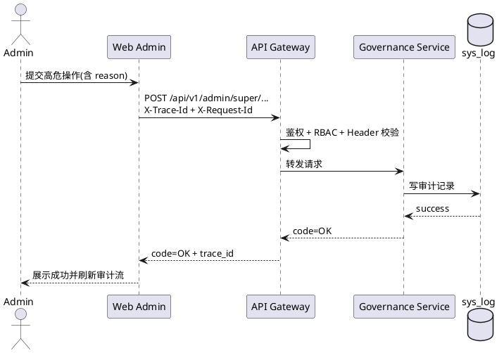

# 基于AI Agent的阿尔兹海默症患者协同寻回系统
## Web 管理端开发手册（Vue + TypeScript）

## 0. 文档信息

| 项目 | 内容 |
| :--- | :--- |
| 文档名称 | Web 管理端开发手册（Vue + TypeScript） |
| 版本 | V1.0 |
| 日期 | 2026-04-07 |
| 输入基线 | SRS_simplify.md、SADD_from_SRS_simplify.md、LLD_from_SRS_SADD.md、API_from_SRS_SADD_LLD.md、backend_handbook.md |
| 适用对象 | Web 前端开发、测试、联调、架构评审 |

说明：
1. 本手册仅覆盖 Web 管理端（`ADMIN` / `SUPERADMIN`）实现，不包含 Android 与匿名 H5 交互。
2. 接口字段、错误码、权限边界以上游 API 文档为准，本手册定义前端落地方式。
3. 所有高危操作（导出、日志清理、强制关闭、DEAD 重放、配置修改）必须具备二次确认与审计可追踪。

## 1. 目标与范围

### 1.1 目标

1. 提供可直接落地的管理端工程实现口径，减少需求解释偏差。
2. 确保治理链路闭环：任务治理、线索复核、物资与标签治理、用户治理、审计与安全、系统配置、DEAD 重放。
3. 在“可实现优先”的前提下，保留扩展能力（策略门禁、Agent 协同、观测增强）。

### 1.2 范围

1. 前端工程架构（Vue3 + TypeScript + Vite）。
2. API 核心契约与统一请求/错误处理。
3. 路由与权限（`ADMIN` / `SUPERADMIN`）。
4. 本地信息持久化（会话、筛选、游标、表格配置）。
5. 页面布局、样式设计令牌、交互逻辑与状态机守卫。
6. 测试、质量门禁、发布规范与 DoD。

### 1.3 管理端页面范围（8 页）

| 页面 ID | 页面名称 | 角色 |
| :--- | :--- | :--- |
| ADM-01 | 运营看板页 | ADMIN / SUPERADMIN |
| ADM-02 | 任务治理页 | ADMIN / SUPERADMIN |
| ADM-03 | 线索复核页 | ADMIN / SUPERADMIN |
| ADM-04 | 标签与物资治理页 | ADMIN / SUPERADMIN |
| ADM-05 | 用户治理页 | ADMIN / SUPERADMIN（重置密码仅 SUPERADMIN） |
| ADM-06 | 审计与安全页 | ADMIN / SUPERADMIN |
| ADM-07 | 系统配置页 | SUPERADMIN（ADMIN 只读） |
| ADM-08 | DEAD 干预与超管操作页 | SUPERADMIN |

## 2. 技术栈与第三方库策略

### 2.1 基础栈

| 类别 | 选型 | 说明 |
| :--- | :--- | :--- |
| 语言 | TypeScript 5.x | 全量 TS，禁止核心业务逻辑使用 JS 裸文件 |
| 框架 | Vue 3.5+ | 组合式 API + `<script setup>` |
| 构建 | Vite 6.x | 快速构建与分包 |
| 路由 | Vue Router 4.x | 路由守卫 + `meta` 权限控制 |
| 状态 | Pinia 3.x | 模块化状态与持久化插件 |
| 网络 | Axios 1.x | 统一拦截器与错误映射 |
| 数据请求 | @tanstack/vue-query | 查询缓存、失效重取、并发请求治理 |

### 2.2 UI 与可视化

| 类别 | 选型 | 使用边界 |
| :--- | :--- | :--- |
| 组件库 | Ant Design Vue (`ant-design-vue`) | 表单、表格、抽屉、对话框 |
| 图表 | ECharts + vue-echarts | 指标图、趋势图、分布图 |
| 图标 | @iconify/vue | 统一图标来源与按需加载 |
| 样式 | UnoCSS + SCSS | 快速原子类 + 设计令牌 |
| 表格增强 | AG Grid Community（可选） | 大数据量治理表格场景 |

### 2.3 可引入的大量第三方库（推荐清单）

| 能力域 | 推荐库 | 目的 |
| :--- | :--- | :--- |
| UI 组件 | ant-design-vue | 管理端 UI 主组件体系 |
| 参数校验 | zod | API 入参与响应运行时校验 |
| 时间处理 | dayjs | 时间格式化与区间计算 |
| 工具函数 | lodash-es | 防抖、节流、深拷贝等 |
| 浏览器工具 | @vueuse/core | 存储、窗口、键盘、网络状态 |
| 本地 DB | localforage / idb | IndexedDB 持久化 |
| 持久化插件 | pinia-plugin-persistedstate | Pinia 有选择持久化 |
| 国际化 | vue-i18n（可选） | 多语言预留 |
| 动画 | motion-v / GSAP（可选） | 看板动效增强 |
| 可观测前端 | @sentry/vue | 异常采集与追踪 |
| 单元测试 | vitest + @vue/test-utils | 组件与状态单测 |
| E2E | Playwright | 核心流程回归 |
| Mock | msw | 联调前契约模拟 |

治理原则：
1. 可引入大量库，但必须通过 `adapter` 封装，业务页面不得直接耦合底层实现。
2. 新库引入需提供“可替换方案 + 影响评估（体积、性能、学习成本）”。
3. 默认采用“最小可用集”，仅在页面复杂度上升时分阶段启用增强库。

## 3. 工程结构（推荐）

```text
web-admin/
  src/
    app/
      main.ts
      App.vue
      router/
      guards/
      providers/
    core/
      api/                # axios 实例、拦截器、统一错误
      auth/               # 登录态、权限、会话
      storage/            # localStorage/sessionStorage/IndexedDB 封装
      constants/          # 错误码、路由名、角色常量
      utils/              # traceId、requestId、格式化工具
      types/              # 全局类型
    modules/
      dashboard/          # ADM-01
      task-governance/    # ADM-02
      clue-review/        # ADM-03
      material-tag/       # ADM-04
      user-governance/    # ADM-05
      audit-security/     # ADM-06
      sys-config/         # ADM-07
      dead-intervention/  # ADM-08
    shared/
      components/
      composables/
      directives/
      styles/
    tests/
```

模块规则：
1. `modules` 之间不得直接相互依赖。
2. 通用能力只能从 `core` 或 `shared` 获取。
3. API DTO 与 UI ViewModel 分离，禁止页面直接消费原始响应。

## 4. API 核心契约

### 4.1 全局 Header 与响应契约

必遵规则：
1. 全请求必须带 `X-Trace-Id`。
2. 写请求（POST/PUT/PATCH/DELETE）必须带 `X-Request-Id`。
3. 受保护接口带 `Authorization: Bearer <token>`。
4. 统一响应结构：`code`、`message`、`trace_id`、`data`。
5. `code != OK` 视为业务失败，不因 HTTP 200 视为成功。

### 4.2 Axios 实现模板

```ts
import axios, { AxiosError, InternalAxiosRequestConfig } from 'axios'
import { v4 as uuidv4 } from 'uuid'

const api = axios.create({
  baseURL: '/api/v1',
  timeout: 15000,
})

function isWriteMethod(method?: string): boolean {
  const m = (method || 'GET').toUpperCase()
  return ['POST', 'PUT', 'PATCH', 'DELETE'].includes(m)
}

api.interceptors.request.use((config: InternalAxiosRequestConfig) => {
  const traceId = `trc_web_${Date.now()}_${Math.random().toString(36).slice(2, 8)}`
  config.headers['X-Trace-Id'] = traceId

  if (isWriteMethod(config.method)) {
    config.headers['X-Request-Id'] = `req_web_${uuidv4()}`
  }

  const token = sessionStorage.getItem('access_token')
  if (token) {
    config.headers.Authorization = `Bearer ${token}`
  }

  return config
})

api.interceptors.response.use(
  (resp) => {
    const body = resp.data
    if (!body || body.code !== 'OK') {
      return Promise.reject({
        code: body?.code ?? 'E_UNKNOWN',
        message: body?.message ?? 'unknown error',
        traceId: body?.trace_id,
      })
    }
    return body.data
  },
  (error: AxiosError) => Promise.reject(error)
)

export default api
```

### 4.3 错误码分层处理

| 错误码 | 前端处理策略 |
| :--- | :--- |
| E_GOV_4011 | 清会话 + 跳转登录 |
| E_GOV_4030 | 无权限提示 + 保持当前页只读 |
| E_GOV_4032 | 提示“仅 SUPERADMIN 可执行” |
| E_GOV_4231 | 标记为“仅人工执行”，禁止自动化触发 |
| E_GOV_4291/E_GOV_4292 | 读取 `Retry-After`，倒计时后允许重试 |
| E_REQ_4005 | 参数格式错误，优先做前端校验回补 |
| E_TASK_4093/E_MAT_4091/E_MAT_4098 | 状态冲突，刷新详情并重绘按钮可见性 |
| E_GOV_5002 | 审计回滚风险提示，保留操作上下文 |

### 4.4 管理端 API 核心清单

#### 4.4.1 任务治理

1. `GET /api/v1/admin/rescue/tasks`
2. `GET /api/v1/admin/rescue/tasks/{task_id}`
3. `GET /api/v1/admin/rescue/tasks/{task_id}/audit`
4. `POST /api/v1/admin/rescue/tasks/{task_id}/notify/retry`
5. `POST /api/v1/admin/super/rescue/tasks/{task_id}/force-close`

#### 4.4.2 线索治理

1. `GET /api/v1/admin/clues/{clue_id}`
2. `GET /api/v1/admin/clues/review/queue`
3. `POST /api/v1/clues/{clue_id}/override`
4. `POST /api/v1/clues/{clue_id}/reject`
5. `POST /api/v1/admin/clues/{clue_id}/assign`
6. `POST /api/v1/admin/clues/{clue_id}/request-evidence`（毕设版本仅保留审计）
7. `GET /api/v1/admin/clues/statistics`
8. `GET /api/v1/admin/clues/suspected`

#### 4.4.3 物资与标签治理

1. `GET /api/v1/admin/material/orders`
2. `GET /api/v1/admin/material/orders/{order_id}`
3. `GET /api/v1/admin/material/orders/{order_id}/timeline`
4. `PUT /api/v1/admin/material/orders/{order_id}/approve`
5. `PUT /api/v1/admin/material/orders/{order_id}/cancel/approve`
6. `PUT /api/v1/admin/material/orders/{order_id}/cancel/reject`
7. `PUT /api/v1/admin/material/orders/{order_id}/ship`
8. `PUT /api/v1/admin/material/orders/{order_id}/logistics-exception`
9. `PUT /api/v1/admin/material/orders/{order_id}/reship`
10. `PUT /api/v1/admin/material/orders/{order_id}/close-exception`
11. `GET /api/v1/admin/tags`
12. `GET /api/v1/admin/tags/{tag_code}`
13. `POST /api/v1/admin/tags/import`
14. `POST /api/v1/admin/tags/{tag_code}/void`
15. `POST /api/v1/admin/tags/{tag_code}/reset`
16. `POST /api/v1/admin/tags/{tag_code}/recover`
17. `POST /api/v1/admin/tags/{tag_code}/allocate`
18. `POST /api/v1/admin/tags/{tag_code}/release`

#### 4.4.4 用户、审计与系统治理

1. `GET /api/v1/admin/users`
2. `PUT /api/v1/admin/users/{user_id}/status`
3. `PUT /api/v1/admin/users/{user_id}/password:reset`
4. `GET /api/v1/admin/logs`
5. `GET /api/v1/admin/dashboard/metrics`
6. `GET /api/v1/admin/metrics/security`
7. `GET /api/v1/admin/config`
8. `PUT /api/v1/admin/super/config`
9. `POST /api/v1/admin/super/export-data`
10. `POST /api/v1/admin/super/logs/purge`
11. `GET /api/v1/admin/super/outbox/dead`
12. `POST /api/v1/admin/super/outbox/dead/{event_id}/replay`

### 4.5 高危动作前端门禁

高危动作统一策略：
1. 仅 `SUPERADMIN` 可见按钮。
2. 必须填写 `reason` 且长度 `5-256`。
3. 二次确认弹窗强制输入校验短语（如“CONFIRM”）。
4. 写请求必须带新的 `X-Request-Id`，禁止复用上次请求。
5. 成功后刷新目标资源 + 拉取审计流，失败保留上下文。

## 5. 路由设计

### 5.1 路由树

```text
/login
/admin
  /dashboard                     (ADM-01)
  /tasks                         (ADM-02)
  /tasks/:taskId                 (ADM-02 详情)
  /clues/review                  (ADM-03)
  /material                      (ADM-04)
  /material/orders/:orderId      (ADM-04 详情)
  /users                         (ADM-05)
  /audit                         (ADM-06)
  /config                        (ADM-07)
  /dead-letter                   (ADM-08)
```

### 5.2 Route Meta 规范

| 字段 | 类型 | 说明 |
| :--- | :--- | :--- |
| requiresAuth | boolean | 是否登录可见 |
| roles | string[] | 允许角色（ADMIN/SUPERADMIN） |
| permissionCode | string | 细粒度权限码 |
| keepAlive | boolean | 是否缓存页面状态 |
| auditTag | string | 页面操作审计标签 |

### 5.3 路由守卫示例

```ts
router.beforeEach(async (to, _from, next) => {
  const token = sessionStorage.getItem('access_token')
  const role = sessionStorage.getItem('role') as 'ADMIN' | 'SUPERADMIN' | null

  if (to.meta.requiresAuth && !token) {
    return next({ name: 'login' })
  }

  const allowRoles = (to.meta.roles || []) as string[]
  if (allowRoles.length > 0 && role && !allowRoles.includes(role)) {
    return next({ name: 'forbidden' })
  }

  next()
})
```

## 6. 本地信息持久化设计

### 6.1 持久化分层

| 存储层 | 典型内容 | TTL/策略 |
| :--- | :--- | :--- |
| 内存（Pinia） | 当前页状态、弹窗状态、请求中标记 | 页面卸载释放 |
| sessionStorage | `access_token`、`role`、`user_profile`、最近路由 | 会话级，登出即清 |
| localStorage | 主题、表格列配置、筛选偏好、看板窗口偏好 | 长期保留，可版本迁移 |
| IndexedDB | 审计日志游标快照、离线导出任务记录、大列表缓存 | 按容量与时间清理 |

### 6.2 键命名规范

| 键名 | 说明 |
| :--- | :--- |
| `admin.session.access_token` | 登录访问令牌（会话级） |
| `admin.session.role` | 当前角色 |
| `admin.ui.theme` | 主题模式 |
| `admin.ui.table.columns.{page}` | 列显隐与顺序 |
| `admin.filter.{page}` | 最近筛选条件 |
| `admin.cursor.audit` | 审计日志游标 |
| `admin.cursor.dead` | DEAD 队列游标 |

### 6.3 Pinia 持久化示例

```ts
import { defineStore } from 'pinia'

export const useAdminPrefStore = defineStore('admin-pref', {
  state: () => ({
    dashboardWindow: '24h' as '1h' | '24h' | '7d' | '30d',
    taskTableColumns: [] as string[],
    theme: 'light' as 'light' | 'dark',
  }),
  persist: {
    key: 'admin.pref',
    paths: ['dashboardWindow', 'taskTableColumns', 'theme'],
    storage: localStorage,
  },
})
```

### 6.4 安全约束

1. 禁止在本地存储写入明文密码、敏感证件号、完整审计明细。
2. 登录失效（`E_GOV_4011`）必须一次性清空 `sessionStorage` 与内存会话。
3. 高危操作草稿（如日志清理原因）仅存内存，不入 `localStorage`。

## 7. 页面布局规范

### 7.1 全局壳布局

```text
┌──────────────────────────────────────────┐
│ TopBar: Logo + 全局搜索 + 告警 + 用户菜单 │
├───────────────┬──────────────────────────┤
│ SideNav       │ MainContent              │
│ - Dashboard   │ - PageHeader             │
│ - Tasks       │ - FilterBar              │
│ - Clues       │ - ContentArea            │
│ - Material    │ - Drawer/Modal           │
│ - Users       │                          │
│ - Audit       │                          │
│ - Config      │                          │
│ - DeadLetter  │                          │
└───────────────┴──────────────────────────┘
```

### 7.2 页面区域模板

1. 列表页：`PageHeader + FilterBar + Table + Pagination + SideDrawer`。
2. 看板页：`KPI 卡片区 + 趋势图区 + 风险事件区`。
3. 高危页：`操作区固定可见 + 审计回溯区`。

### 7.3 响应式断点

| 断点 | 场景 |
| :--- | :--- |
| `>=1440px` | 运营大屏，三栏信息布局 |
| `1200-1439px` | 标准后台布局 |
| `992-1199px` | 双栏压缩布局 |
| `<992px` | 不建议高危治理操作，仅提供只读与告警查看 |

## 8. 样式系统与主题令牌

### 8.1 设计令牌

```css
:root {
  --color-primary: #0b6b8a;
  --color-success: #2e7d32;
  --color-warning: #b26a00;
  --color-danger: #b42318;
  --color-bg: #f4f7f9;
  --color-surface: #ffffff;
  --color-text: #18242d;
  --color-border: #8ca1ae;
}
```

规则：
1. 风险动作只允许 `danger`，且必须配确认步骤。
2. 状态表达不能只靠颜色，必须有图标或文案。
3. 表格高频页面优先降低视觉噪音，分割线使用 `--color-border`。

### 8.2 组件样式统一

| 组件 | 规范 |
| :--- | :--- |
| 按钮 | 主按钮用于核心提交，危险按钮只用于高危动作 |
| 表格 | 固定表头 + 可配置列 + 行内状态标签 |
| 抽屉 | 承载详情与审批动作，禁止塞入复杂多步骤流程 |
| 弹窗 | 仅用于确认与阻断提示，不承载大量编辑表单 |

## 9. 页面交互逻辑（8 页）

### 9.1 页面与 API 映射

| 页面 ID | 路由 | 核心 API |
| :--- | :--- | :--- |
| ADM-01 | `/admin/dashboard` | `/api/v1/admin/dashboard/metrics`、`/api/v1/admin/clues/statistics`、`/api/v1/admin/metrics/security` |
| ADM-02 | `/admin/tasks` | `/api/v1/admin/rescue/tasks`、`/api/v1/admin/rescue/tasks/{task_id}`、`/api/v1/admin/rescue/tasks/{task_id}/notify/retry` |
| ADM-03 | `/admin/clues/review` | `/api/v1/admin/clues/review/queue`、`/api/v1/admin/clues/{clue_id}`、`/api/v1/clues/{clue_id}/override`、`/api/v1/clues/{clue_id}/reject`、`/api/v1/admin/clues/{clue_id}/assign`、`/api/v1/admin/clues/{clue_id}/request-evidence`（禁用入口，当前版本不开放） |
| ADM-04 | `/admin/material` | `/api/v1/admin/material/orders*`、`/api/v1/admin/tags*` 及治理动作接口 |
| ADM-05 | `/admin/users` | `/api/v1/admin/users`、`/api/v1/admin/users/{user_id}/status`、`/api/v1/admin/users/{user_id}/password:reset` |
| ADM-06 | `/admin/audit` | `/api/v1/admin/logs`、`/api/v1/admin/metrics/security` |
| ADM-07 | `/admin/config` | `/api/v1/admin/config`、`/api/v1/admin/super/config` |
| ADM-08 | `/admin/dead-letter` | `/api/v1/admin/super/outbox/dead*`、`/api/v1/admin/super/outbox/dead/{event_id}/replay`、`/api/v1/admin/super/rescue/tasks/{task_id}/force-close` |

### 9.2 ADM-01 运营看板

交互规则：
1. 默认窗口 `24h`，切换窗口触发三路并发请求（指标/线索统计/安全指标）。
2. 看板失败采用“局部降级”，单卡片失败不清空其他卡片。
3. 指标点击支持跳转对应治理页并携带筛选条件。

### 9.3 ADM-02 任务治理

交互规则：
1. 列表支持 `status/source` 过滤、分页与详情抽屉。
2. “通知补偿”提交时强制填写 `reason`，成功后刷新详情与审计流。
3. 出现 `E_TASK_4093` 时弹出“状态冲突”并自动刷新任务详情。

### 9.4 ADM-03 线索复核

交互规则：
1. 队列按风险分排序，默认聚焦最高风险待办。
2. 分配动作必须校验 `assignee_user_id`，成功后队列与详情同步刷新。
3. 复核终结动作必须支持 `override` 与 `reject`，提交前强制二次确认并校验原因字段。
4. `override/reject` 成功后，当前线索应从待复核队列移除并进入终态（`OVERRIDDEN`/`REJECTED`）。
5. `request-evidence` 入口保留但默认禁用，提示“当前版本仅记录治理审计”。

### 9.5 ADM-04 标签与物资治理

交互规则：
1. 工单、标签双视图可切换，保留各自筛选与分页状态。
2. 状态机约束前置到前端按钮可见性（如 `PROCESSING` 才可发货）。
3. 发货、异常、补发、作废、重置、恢复等动作均要求确认理由。
4. 操作成功后仅更新受影响行，避免整表闪烁。

### 9.6 ADM-05 用户治理

交互规则：
1. 用户状态开关由 `status` 控制，变更失败必须回滚 UI。
2. 密码重置按钮仅 `SUPERADMIN` 可见。
3. 重置后前端展示“强制重新登录已触发”。

### 9.7 ADM-06 审计与安全

交互规则：
1. 审计日志优先 Cursor 模式分页，支持 `trace_id` 精确检索。
2. 若返回 429，读取 `Retry-After` 并禁用查询按钮倒计时。
3. 安全指标图与审计列表联动过滤时间窗口。

### 9.8 ADM-07 系统配置

交互规则：
1. `ADMIN` 只读，`SUPERADMIN` 可编辑。
2. 提交更新前展示 Diff 预览（旧值/新值/scope）。
3. 配置更新成功后必须回刷快照并记录“最后更新时间/操作人”。

### 9.9 ADM-08 DEAD 干预与超管操作

交互规则：
1. DEAD 列表支持 `topic/partition_key/time` 过滤。
2. 重放必须填写 `replay_reason`，建议支持 `dry_run` 预检查开关。
3. 出现 `E_GOV_4096` 时提示“存在更早未修复 DEAD，禁止越序重放”。
4. 强制关闭任务仅在超管专属面板展示，默认二次确认。

## 10. 前端状态机守卫

### 10.1 任务状态守卫（治理侧）

| 当前状态 | 操作 | 前端允许 |
| :--- | :--- | :---: |
| ACTIVE | 通知补偿 | 是 |
| ACTIVE | 强制关闭（超管） | 是 |
| RESOLVED/FALSE_ALARM | 强制关闭 | 否 |

### 10.2 物资工单守卫

| 当前状态 | 可见动作 |
| :--- | :--- |
| PENDING | 审核通过 |
| PROCESSING | 发货、取消审核 |
| SHIPPED | 物流异常 |
| EXCEPTION | 补发、异常关闭 |

### 10.3 标签守卫

| 当前状态 | 可见动作 |
| :--- | :--- |
| UNBOUND | 分配、作废 |
| ALLOCATED | 释放、作废 |
| BOUND | 挂失、作废 |
| LOST | 重置、恢复 |
| VOID | 重置 |

## 11. API 契约与前端类型模型

```ts
export interface ApiEnvelope<T> {
  code: string
  message: string
  trace_id: string
  data: T
}

export interface PageOffset<T> {
  items: T[]
  page_no: number
  page_size: number
  total: number
  has_next: boolean
}

export interface PageCursor<T> {
  items: T[]
  page_size: number
  next_cursor: string | null
  has_next: boolean
}
```

字段约束：
1. ID 一律按 `string` 处理（含路径参数与查询参数）。
2. 状态枚举必须定义 `UNKNOWN` 兜底值，防止后端枚举扩展导致 UI 崩溃。

## 12. 测试与质量门禁

### 12.1 必测清单

1. 路由权限：`ADMIN` 与 `SUPERADMIN` 页面访问边界。
2. Header 注入：`X-Trace-Id` 全量、`X-Request-Id` 写接口注入。
3. 高危动作：二次确认、理由校验、失败回滚。
4. 429 退避：`Retry-After` 倒计时逻辑。
5. Cursor 分页：审计与 DEAD 列表滚动加载。

### 12.2 推荐测试栈

1. 单测：Vitest + Vue Test Utils。
2. 契约测试：MSW + OpenAPI mock（或接口样例回放）。
3. E2E：Playwright 覆盖 ADM-02/ADM-04/ADM-08 高风险链路。

## 13. 构建、发布与回滚

### 13.1 CI 必过项

1. `pnpm lint`
2. `pnpm typecheck`
3. `pnpm test`
4. `pnpm build`

### 13.2 发布策略

1. 先灰度至管理内网用户。
2. 重点观察：接口失败率、关键操作成功率、前端异常率。
3. 高危操作功能支持开关化控制（按路由或按钮粒度）。

### 13.3 回滚策略

1. 前端静态资源版本可回退。
2. 配置页修改需保留“前值快照”便于恢复。
3. 回滚后强制刷新缓存并清理失效持久化键。

## 14. 开发完成定义（DoD）

一个管理端需求完成，必须同时满足：

1. 页面实现与路由守卫完成，权限边界可验证。
2. API 契约、错误码、状态机行为与基线一致。
3. 本地持久化策略符合安全约束（无敏感明文）。
4. 高危动作具备二次确认、理由留存与失败回滚。
5. 单测/E2E/联调用例通过并具备审计可追踪性。
6. 文档与变更记录同步更新。

## 15. 附录

### 15.1 页面权限矩阵

| 页面 | ADMIN | SUPERADMIN |
| :--- | :---: | :---: |
| ADM-01 运营看板 | 是 | 是 |
| ADM-02 任务治理 | 是 | 是 |
| ADM-03 线索复核 | 是 | 是 |
| ADM-04 标签与物资治理 | 是 | 是 |
| ADM-05 用户治理（状态） | 是 | 是 |
| ADM-05 密码重置 | 否 | 是 |
| ADM-06 审计与安全 | 是 | 是 |
| ADM-07 配置读取 | 是 | 是 |
| ADM-07 配置修改 | 否 | 是 |
| ADM-08 DEAD 列表/重放 | 否 | 是 |
| 强制关闭任务 | 否 | 是 |

### 15.2 建议的 API 模块拆分

1. `taskGovernanceApi.ts`
2. `clueReviewApi.ts`
3. `materialTagApi.ts`
4. `userGovernanceApi.ts`
5. `auditSecurityApi.ts`
6. `superAdminApi.ts`

### 15.3 管理端交互时序（示意）



## 16. 字段级页面约束表（8 页逐页联调版）

适用约束：
1. 表内错误码必须与 `API_from_SRS_SADD_LLD.md` 保持一致。
2. 所有写接口必须自动注入 `X-Request-Id`，全请求注入 `X-Trace-Id`。
3. 所有路径与查询中的 ID 均按十进制字符串处理，不允许前端以浮点数中转。
4. 每页至少实现 `Loading`、`Empty`、`Error`、`Content` 四态。

### 16.1 ADM-01 运营看板页

| 字段 | 必填 | 入参校验 | 典型错误码 | 空态/异常态 |
| :--- | :---: | :--- | :--- | :--- |
| `window` | 否 | 枚举：`1h/24h/7d/30d` | `E_REQ_4001` | 指标为空显示“暂无统计数据”；保留时间窗口切换入口 |
| `time_from`、`time_to`、`granularity` | 否 | 时间为 ISO-8601；`granularity` 枚举：`day/week/month` | `E_REQ_4005` | 非法参数阻断请求并就地提示 |
| `scope`（安全指标） | 否 | 枚举：`summary/detail`；`detail` 仅 `SUPERADMIN` 可用 | `E_GOV_4032`、`E_GOV_4030` | 权限不足时降级展示 `summary` 视图，不清空其他卡片 |
| `trace_id`（响应） | 是 | 非空；用于联调追踪 | `E_GOV_4011` | 401 触发会话失效并跳登录页 |

联调断言：切换窗口后应触发三路请求（看板、线索统计、安全指标），且任一卡片失败不影响其余卡片展示。

### 16.2 ADM-02 任务治理页

| 字段 | 必填 | 入参校验 | 典型错误码 | 空态/异常态 |
| :--- | :---: | :--- | :--- | :--- |
| `page_no`、`page_size`、`status`、`source` | 否 | `page_no>=1`、`page_size=1-100`；`status` 枚举：`ACTIVE/RESOLVED/FALSE_ALARM`；`source` 枚举：`APP/MINI_PROGRAM/ADMIN_PORTAL` | `E_REQ_4005` | 列表空态显示“暂无任务”；保留筛选重置按钮 |
| `task_id`（Path） | 是 | 十进制字符串 | `E_TASK_4041`、`E_REQ_4005` | 详情不存在时关闭抽屉并提示“任务不可见或已删除” |
| `reason`、`channels`（通知补偿） | `reason` 是 | `reason` 长度 `5-256`；`channels` 仅允许 `IN_APP/PUSH` | `E_REQ_4001`、`E_GOV_5002` | 提交失败保留弹窗与输入；500 提示“审计回滚” |
| `reason`（强制关闭） | 是 | 长度 `5-256`；仅 `SUPERADMIN` 可见入口 | `E_GOV_4032`、`E_TASK_4093` | 状态冲突时刷新任务详情并重绘按钮可见性 |

联调断言：`notify/retry` 成功后必须刷新 `audit` 流，`force-close` 成功后状态变为 `RESOLVED`。

### 16.3 ADM-03 线索复核页

| 字段 | 必填 | 入参校验 | 典型错误码 | 空态/异常态 |
| :--- | :---: | :--- | :--- | :--- |
| `page_no`、`page_size`、`assignee_user_id` | 否 | 分页参数合法；`assignee_user_id` 为十进制字符串 | `E_REQ_4005` | 队列空态展示“当前无待复核线索” |
| `clue_id`（Path） | 是 | 十进制字符串 | `E_CLUE_4043` | 线索不存在时清空详情面板并跳下一条 |
| `override`、`override_reason`（通过复核） | 是 | `override=true`；`override_reason` 长度 `5-256` | `E_CLUE_4008`、`E_CLUE_4009`、`E_CLUE_5011`、`E_GOV_4030` | 通过失败时保留当前详情并允许修正后重试 |
| `reject_reason`（驳回复核） | 是 | 长度 `5-256` | `E_CLUE_4010`、`E_CLUE_5012`、`E_GOV_4030` | 驳回失败时保留理由输入并提示错误原因 |
| `assignee_user_id`、`reason`（分派） | `assignee_user_id` 是 | 目标用户 ID 合法；`reason<=256` | `E_REQ_4001`、`E_GOV_4030` | 分派失败保留当前上下文并允许重试 |
| `request-evidence` 触发参数 | 否 | 当前版本不开放提交 | `E_GOV_4030` | 按钮默认禁用，点击仅提示“暂不开放，已记录治理策略” |

联调断言：分派成功后队列中对应记录的 `assignee_user_id` 与详情面板保持一致；`override/reject` 成功后 `review_status` 必须进入 `OVERRIDDEN/REJECTED` 且队列不再返回该线索。

#### 16.3.1 override/reject 联调用例矩阵（可执行）

| 用例 ID | 动作 | 前置条件 | 请求要点 | 期望响应 | 回归断言 |
| :--- | :--- | :--- | :--- | :--- | :--- |
| `CR-OVR-001` | 通过复核（成功） | 线索 `review_status=PENDING`，操作者为 `ADMIN/SUPERADMIN` | `POST /api/v1/clues/{clue_id}/override`，`{ "override": true, "override_reason": "xxxxx" }`，带 `X-Request-Id` | HTTP 200 + `code=OK`，返回 `override=true`、`override_reason`、`reviewed_at` | 队列移除该线索；详情进入 `OVERRIDDEN`；刷新后不回流到待办 |
| `CR-OVR-002` | 通过复核（参数非法） | 同上 | `override=false` 或缺失 | HTTP 400 + `E_CLUE_4008` | 页面保留输入上下文，不关闭详情抽屉 |
| `CR-OVR-003` | 通过复核（理由非法） | 同上 | `override_reason` 长度 `<5` 或 `>256` | HTTP 400 + `E_CLUE_4009` | 字段级报错显示在理由输入框下方 |
| `CR-OVR-004` | 通过复核（权限不足） | 操作者非管理角色 | 同 `CR-OVR-001` | HTTP 403 + `E_GOV_4030` | 按钮恢复可点击；显示无权限提示；不改本地状态 |
| `CR-OVR-005` | 通过复核（资源不存在） | `clue_id` 不存在或不可见 | 同 `CR-OVR-001` | HTTP 404 + `E_CLUE_4043` | 清空详情并跳转下一条待办或列表空态 |
| `CR-OVR-006` | 通过复核（服务失败） | 服务端事件发布异常模拟 | 同 `CR-OVR-001` | HTTP 501 + `E_CLUE_5011` | 页面提示“复核提交失败，可重试”，保留输入内容 |
| `CR-REJ-001` | 驳回复核（成功） | 线索 `review_status=PENDING`，操作者为 `ADMIN/SUPERADMIN` | `POST /api/v1/clues/{clue_id}/reject`，`{ "reject_reason": "xxxxx" }`，带 `X-Request-Id` | HTTP 200 + `code=OK`，返回 `reject_reason`、`rejected_by`、`reviewed_at` | 队列移除该线索；详情进入 `REJECTED`；时间线可见驳回动作 |
| `CR-REJ-002` | 驳回复核（理由非法） | 同上 | `reject_reason` 长度 `<5` 或 `>256` | HTTP 401 + `E_CLUE_4010` | 理由字段就地报错，提交按钮恢复可用 |
| `CR-REJ-003` | 驳回复核（权限不足） | 操作者非管理角色 | 同 `CR-REJ-001` | HTTP 403 + `E_GOV_4030` | 不改队列与详情状态，提示权限不足 |
| `CR-REJ-004` | 驳回复核（资源不存在） | `clue_id` 不存在或不可见 | 同 `CR-REJ-001` | HTTP 404 + `E_CLUE_4043` | 详情面板退出当前线索并刷新队列 |
| `CR-REJ-005` | 驳回复核（服务失败） | 服务端关闭复核工单失败模拟 | 同 `CR-REJ-001` | HTTP 501 + `E_CLUE_5012` | 页面展示失败提示并允许原地重试 |

执行建议：
1. 联调顺序建议先执行 `CR-OVR-001`、`CR-REJ-001` 成功流，再跑参数/权限/资源异常分支。
2. 每条用例都要记录 `trace_id` 并在 ADM-06 审计页做可追踪性复核。
3. 回归阶段需重复执行 `CR-OVR-001` 与 `CR-REJ-001`，验证队列出队与终态一致性不回退。

### 16.4 ADM-04 标签与物资治理页

| 字段 | 必填 | 入参校验 | 典型错误码 | 空态/异常态 |
| :--- | :---: | :--- | :--- | :--- |
| `order_id`、`tag_code`（Path） | 是 | 十进制字符串/标签编码格式合法 | `E_MAT_4041`、`E_MAT_4044`、`E_REQ_4005` | 资源不存在时返回列表并保持筛选条件 |
| `tracking_number`、`tag_code`（发货） | 是 | `tracking_number` 长度 `6-64`；标签状态需满足可分配 | `E_MAT_4222`、`E_MAT_4091`、`E_REQ_4001` | 失败保留发货表单并聚焦错误字段 |
| `exception_desc`、`reship_reason`、`new_tag_code` | 条件必填 | 异常说明/补发原因长度 `5-256`；新标签必须可用 | `E_MAT_4224`、`E_MAT_4091`、`E_REQ_4001` | 异常处理失败不清空时间线，标记失败步骤 |
| `void_reason`、`reason`、`patient_id`（标签作废/重置/恢复） | 条件必填 | 原因长度 `5-256`；恢复需合法 `patient_id` | `E_MAT_4098`、`E_PRO_4031`、`E_PRO_4093`、`E_REQ_4001`、`E_REQ_4005` | 状态冲突时刷新标签详情并锁定非法动作 |
| `batch_no`、`tags[]`（批量导入） | 是 | `batch_no` 长度 `1-64`；单批建议 `<=500` | `E_REQ_4001`、`E_PRO_4092` | 部分失败时展示失败明细并支持导出 |

联调断言：工单状态流转与标签状态流转需一致（发货后标签进入 `ALLOCATED`，异常时可触发作废链路）。

### 16.5 ADM-05 用户治理页

| 字段 | 必填 | 入参校验 | 典型错误码 | 空态/异常态 |
| :--- | :---: | :--- | :--- | :--- |
| `page_no`、`page_size`、`role`、`status`、`keyword` | 否 | 分页参数合法；`role` 枚举：`FAMILY/ADMIN/SUPERADMIN`；`status` 枚举：`NORMAL/BANNED` | `E_REQ_4005` | 无结果展示“未匹配用户”空态 |
| `user_id`（Path） | 是 | 十进制字符串 | `E_USR_4041`、`E_REQ_4005` | 资源不存在时回收行内编辑态 |
| `status`、`reason`（封禁/解封） | `status` 是 | `status` 枚举合法；`reason` 建议 `5-256` | `E_USR_4003`、`E_REQ_4001`、`E_GOV_4030` | 失败时回滚状态开关并提示原因 |
| `new_password`、`reason`（密码重置） | 是 | 密码强度满足策略；仅 `SUPERADMIN` 可操作 | `E_USR_4002`、`E_GOV_4032`、`E_GOV_4231`、`E_REQ_4001` | 重置失败保留弹窗并显示可修复提示 |

联调断言：封禁后目标用户应被强制失效会话；密码重置成功返回 `force_relogin=true`。

### 16.6 ADM-06 审计与安全页

| 字段 | 必填 | 入参校验 | 典型错误码 | 空态/异常态 |
| :--- | :---: | :--- | :--- | :--- |
| `cursor`、`page_size`、`page_no` | 否 | `page_size=1-200`；优先使用 `cursor` | `E_REQ_4005` | 日志为空展示“暂无审计记录” |
| `module`、`action`、`user_id`、`trace_id`、`start_time`、`end_time` | 否 | 时间为 ISO-8601；`user_id` 十进制字符串 | `E_REQ_4005`、`E_GOV_4030` | 查询失败保留筛选条件便于复查 |
| 安全指标参数：`time_from`、`time_to`、`scope` | 否 | `scope` 枚举：`summary/detail` | `E_GOV_4011`、`E_GOV_4032` | detail 无权限时降级 summary |
| 429 限流响应 | 否 | 读取 `Retry-After` 与剩余额度头 | `E_GOV_4291` | 查询按钮倒计时禁用，到期后自动可重试 |

联调断言：`trace_id` 检索结果应能与目标高危操作记录一一对应。

### 16.7 ADM-07 系统配置页

| 字段 | 必填 | 入参校验 | 典型错误码 | 空态/异常态 |
| :--- | :---: | :--- | :--- | :--- |
| `scope`（读取） | 否 | 枚举：`public/ops/security/ai_policy`；后两者通常仅超管可见 | `E_GOV_4030`、`E_GOV_4032`、`E_REQ_4005` | 无配置时显示默认值说明区 |
| `config_key`、`config_value`、`reason`（更新） | 是 | `config_key` 必须命中白名单；`reason` 长度 `5-256` | `E_REQ_4001`、`E_GOV_4032`、`E_GOV_5002` | 保存失败保留编辑态与 diff 预览 |
| `trace_id`（响应） | 是 | 非空，用于配置变更追踪 | `E_GOV_4011` | 会话失效时退出编辑模式并跳登录 |

联调断言：更新成功后，`GET /admin/config` 读取值必须与提交值一致。

### 16.8 ADM-08 DEAD 干预与超管操作页

| 字段 | 必填 | 入参校验 | 典型错误码 | 空态/异常态 |
| :--- | :---: | :--- | :--- | :--- |
| `cursor`、`page_size`、`topic`、`partition_key`、`from_time`、`to_time` | 否 | 分页与时间参数合法；`page_size=1-100` | `E_REQ_4005`、`E_GOV_4032` | 无 DEAD 事件显示“队列健康”空态 |
| `event_id`（Path）、`created_at`、`replay_reason`、`replay_mode`、`next_retry_at` | `event_id/created_at/replay_reason` 是 | `replay_reason` 长度 `5-256`；`replay_mode=RETRY_AT` 时必须给 `next_retry_at` | `E_GOV_4046`、`E_GOV_4096`、`E_GOV_4097`、`E_REQ_4001`、`E_GOV_5002` | 重放失败保留事件上下文并提示阻断原因 |
| `task_id`（Path）、`reason`（强制关闭） | 是 | `reason` 长度 `5-256`；仅 `SUPERADMIN` 可见 | `E_GOV_4032`、`E_TASK_4041`、`E_TASK_4093`、`E_REQ_4001` | 状态冲突时展示“已被其他操作关闭”并刷新任务详情 |
| 预检查模式 `dry_run`（建议） | 否 | 开启时仅做校验不落副作用 | `E_GOV_4226` | 预检查失败需显示命中规则与修复建议 |

联调断言：DEAD 重放成功后目标事件 `phase` 应从 `DEAD` 进入 `RETRY`，并生成对应审计记录。
